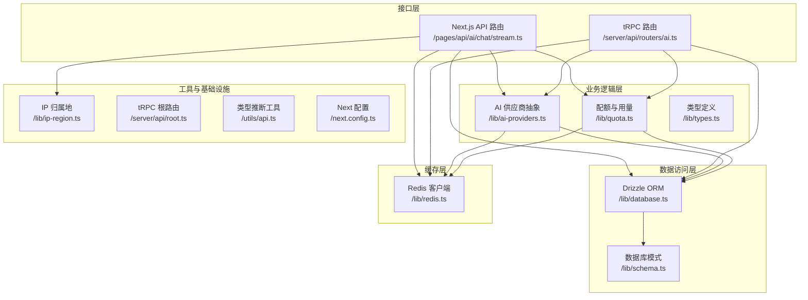
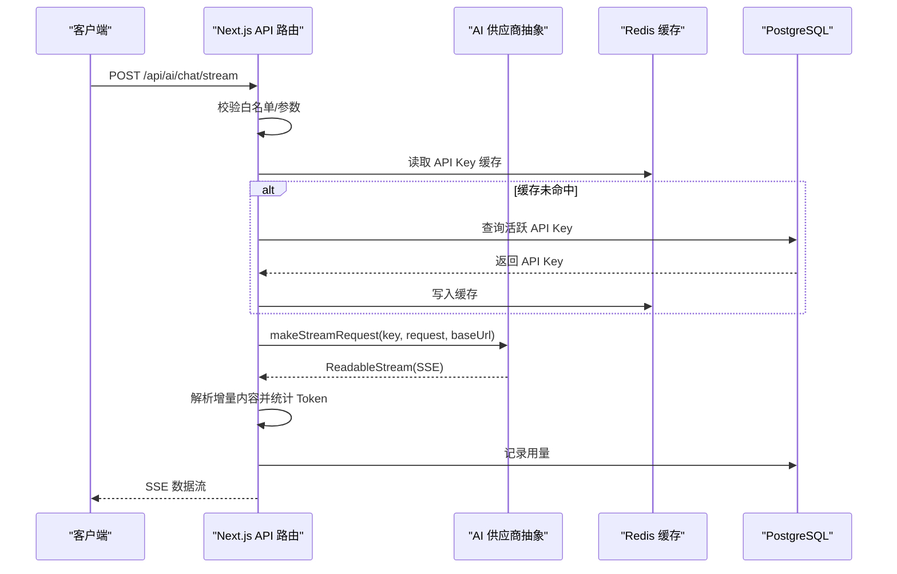
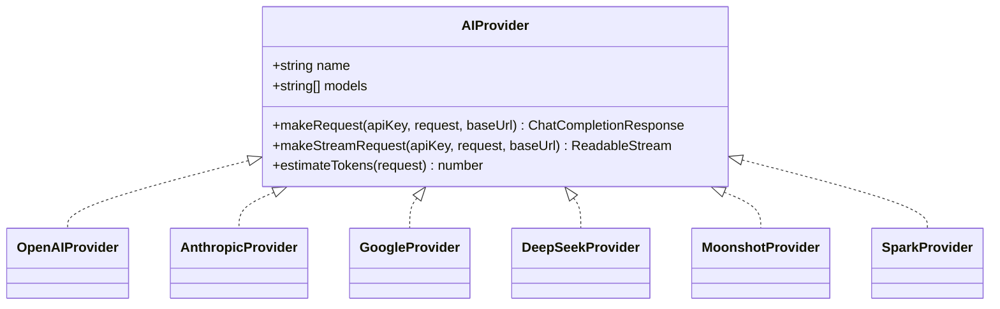
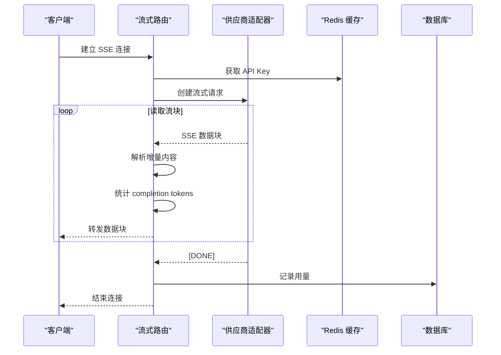
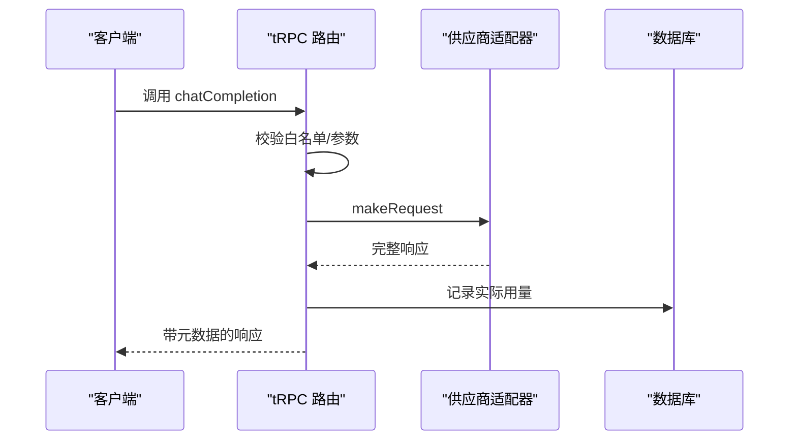
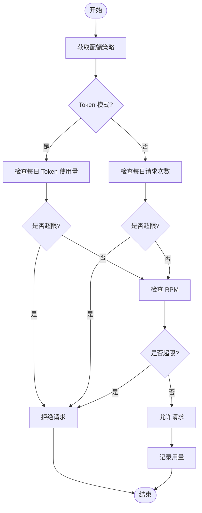
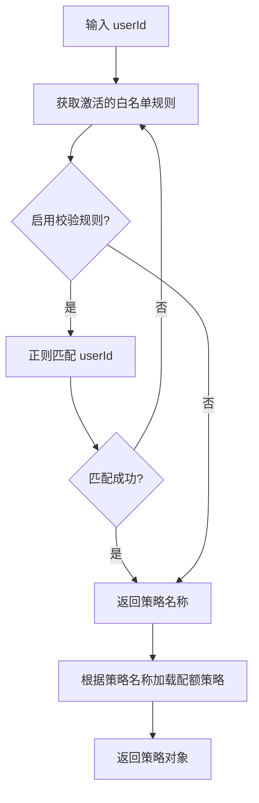
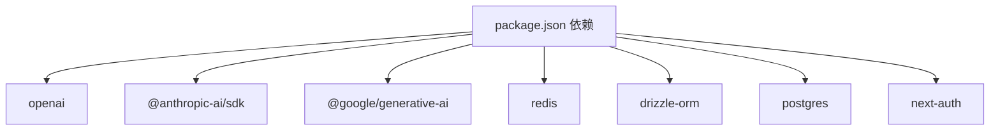

# AI 供应商集成系统

<cite>
**本文档引用的文件**
- [src/lib/ai-providers.ts](file://src/lib/ai-providers.ts)
- [src/pages/api/ai/chat/stream.ts](file://src/pages/api/ai/chat/stream.ts)
- [src/server/api/routers/ai.ts](file://src/server/api/routers/ai.ts)
- [src/lib/quota.ts](file://src/lib/quota.ts)
- [src/lib/types.ts](file://src/lib/types.ts)
- [src/lib/database.ts](file://src/lib/database.ts)
- [src/lib/redis.ts](file://src/lib/redis.ts)
- [src/lib/ip-region.ts](file://src/lib/ip-region.ts)
- [src/server/api/root.ts](file://src/server/api/root.ts)
- [src/lib/schema.ts](file://src/lib/schema.ts)
- [src/utils/api.ts](file://src/utils/api.ts)
- [package.json](file://package.json)
- [next.config.ts](file://next.config.ts)
- [docs/ai-api.md](file://docs/ai-api.md)
</cite>

## 目录
1. [简介](#简介)
2. [项目结构](#项目结构)
3. [核心组件](#核心组件)
4. [架构总览](#架构总览)
5. [详细组件分析](#详细组件分析)
6. [依赖关系分析](#依赖关系分析)
7. [性能考虑](#性能考虑)
8. [故障排除指南](#故障排除指南)
9. [结论](#结论)
10. [附录](#附录)

## 简介
本项目为 AIGate 的 AI 供应商集成系统，目标是通过统一抽象层屏蔽不同 AI 供应商（OpenAI、Anthropic、Google Gemini、DeepSeek、Moonshot、Spark）的差异，提供一致的接口与流式响应能力，并内置配额管理、Token 估算、成本控制、白名单校验与地域追踪等企业级功能。系统采用 Next.js + tRPC + Drizzle ORM + Redis + PostgreSQL 架构，支持多供应商适配与扩展。

**更新** 新增完整的AI API调用文档（docs/ai-api.md），提供详细的API端点说明、参数详解、响应格式和调用示例，作为AI供应商集成系统的补充文档。

## 项目结构
系统主要由以下层次构成：
- 接口层：Next.js API Routes 与 tRPC 路由，分别处理 SSE 流式请求与非流式请求
- 业务逻辑层：AI 供应商抽象与路由处理器，负责参数映射、配额检查与用量记录
- 数据访问层：Drizzle ORM 访问 PostgreSQL，封装 API Key、配额策略、用量记录与白名单规则
- 缓存层：Redis 缓存 API Key、配额策略与请求日志
- 工具与基础设施：IP 归属地查询、类型定义、全局配置



**图表来源**
- [src/pages/api/ai/chat/stream.ts:1-124](file://src/pages/api/ai/chat/stream.ts#L1-L124)
- [src/server/api/routers/ai.ts:1-301](file://src/server/api/routers/ai.ts#L1-L301)
- [src/lib/ai-providers.ts:1-759](file://src/lib/ai-providers.ts#L1-L759)
- [src/lib/quota.ts:1-327](file://src/lib/quota.ts#L1-L327)
- [src/lib/database.ts:1-850](file://src/lib/database.ts#L1-L850)
- [src/lib/redis.ts:1-43](file://src/lib/redis.ts#L1-L43)
- [src/lib/ip-region.ts:1-101](file://src/lib/ip-region.ts#L1-L101)
- [src/server/api/root.ts:1-23](file://src/server/api/root.ts#L1-L23)
- [src/lib/schema.ts:1-159](file://src/lib/schema.ts#L1-L159)
- [src/utils/api.ts:1-17](file://src/utils/api.ts#L1-L17)
- [next.config.ts:1-9](file://next.config.ts#L1-L9)

**章节来源**
- [src/pages/api/ai/chat/stream.ts:1-124](file://src/pages/api/ai/chat/stream.ts#L1-L124)
- [src/server/api/routers/ai.ts:1-301](file://src/server/api/routers/ai.ts#L1-L301)
- [src/lib/ai-providers.ts:1-759](file://src/lib/ai-providers.ts#L1-L759)
- [src/lib/quota.ts:1-327](file://src/lib/quota.ts#L1-L327)
- [src/lib/database.ts:1-850](file://src/lib/database.ts#L1-L850)
- [src/lib/redis.ts:1-43](file://src/lib/redis.ts#L1-L43)
- [src/lib/ip-region.ts:1-101](file://src/lib/ip-region.ts#L1-L101)
- [src/server/api/root.ts:1-23](file://src/server/api/root.ts#L1-L23)
- [src/lib/schema.ts:1-159](file://src/lib/schema.ts#L1-L159)
- [src/utils/api.ts:1-17](file://src/utils/api.ts#L1-L17)
- [next.config.ts:1-9](file://next.config.ts#L1-L9)

## 核心组件
- AI 供应商抽象层：统一定义 AIProvider 接口，包含 makeRequest、makeStreamRequest、estimateTokens 三个核心方法；内置 OpenAI、Anthropic、Google Gemini、DeepSeek、Moonshot、Spark 六家供应商适配器
- 流式响应处理：Next.js API 路由基于 SSE 实现，将供应商流式输出转换为标准事件流，支持增量内容统计与最终关闭信号
- 非流式响应处理：tRPC 路由直接调用供应商 SDK 获取完整响应，记录实际用量并返回元数据
- 配额与用量：基于 Redis 的 Token/请求次数双模式配额控制，支持 RPM 限流与每日/每月限额；用量持久化至 PostgreSQL
- 白名单与安全：通过白名单规则匹配用户策略，结合 IP 归属地与客户端 IP 追踪
- 类型系统：Zod 定义请求/响应/策略/用量等类型，确保前后端一致性

**章节来源**
- [src/lib/ai-providers.ts:12-27](file://src/lib/ai-providers.ts#L12-L27)
- [src/pages/api/ai/chat/stream.ts:67-123](file://src/pages/api/ai/chat/stream.ts#L67-L123)
- [src/server/api/routers/ai.ts:34-86](file://src/server/api/routers/ai.ts#L34-L86)
- [src/lib/quota.ts:78-200](file://src/lib/quota.ts#L78-L200)
- [src/lib/types.ts:4-118](file://src/lib/types.ts#L4-L118)

## 架构总览
系统采用"抽象 + 适配 + 缓存 + 数据库"的分层设计，核心流程如下：



**图表来源**
- [src/pages/api/ai/chat/stream.ts:22-123](file://src/pages/api/ai/chat/stream.ts#L22-L123)
- [src/lib/ai-providers.ts:58-95](file://src/lib/ai-providers.ts#L58-L95)
- [src/lib/redis.ts:18-42](file://src/lib/redis.ts#L18-L42)
- [src/lib/database.ts:35-100](file://src/lib/database.ts#L35-L100)

**章节来源**
- [src/pages/api/ai/chat/stream.ts:1-124](file://src/pages/api/ai/chat/stream.ts#L1-L124)
- [src/lib/ai-providers.ts:1-759](file://src/lib/ai-providers.ts#L1-L759)
- [src/lib/redis.ts:1-43](file://src/lib/redis.ts#L1-L43)
- [src/lib/database.ts:1-850](file://src/lib/database.ts#L1-L850)

## 详细组件分析

### AI 供应商抽象层与适配器
- 抽象接口：AIProvider 定义统一的 makeRequest、makeStreamRequest、estimateTokens 方法，便于替换与扩展
- 适配器实现：
  - OpenAI：使用官方 SDK，支持流式与非流式
  - Anthropic：使用 fetch 调用 Messages API，支持 SSE 流式转换
  - Google Gemini：使用 REST API，支持 SSE 流式转换
  - DeepSeek/Moonshot/Spark：均使用 OpenAI 兼容 API，复用 OpenAI 适配器
- Token 估算：提供简单估算函数，按字符长度粗略换算为 token 数量



**图表来源**
- [src/lib/ai-providers.ts:12-27](file://src/lib/ai-providers.ts#L12-L27)
- [src/lib/ai-providers.ts:34-100](file://src/lib/ai-providers.ts#L34-L100)
- [src/lib/ai-providers.ts:102-282](file://src/lib/ai-providers.ts#L102-L282)
- [src/lib/ai-providers.ts:284-469](file://src/lib/ai-providers.ts#L284-L469)
- [src/lib/ai-providers.ts:471-685](file://src/lib/ai-providers.ts#L471-L685)

**章节来源**
- [src/lib/ai-providers.ts:1-759](file://src/lib/ai-providers.ts#L1-L759)

### 流式响应处理（SSE）
- Next.js API 路由负责：
  - 白名单校验与 API Key 校验
  - 估算 Token 并检查配额
  - 选择供应商并调用 makeStreamRequest
  - 将供应商流式输出转换为 SSE，逐行解析增量内容并统计 completion token
  - 最终发送 [DONE] 信号并记录用量



**图表来源**
- [src/pages/api/ai/chat/stream.ts:67-123](file://src/pages/api/ai/chat/stream.ts#L67-L123)
- [src/lib/ai-providers.ts:58-95](file://src/lib/ai-providers.ts#L58-L95)
- [src/lib/redis.ts:18-42](file://src/lib/redis.ts#L18-L42)
- [src/lib/database.ts:35-100](file://src/lib/database.ts#L35-L100)

**章节来源**
- [src/pages/api/ai/chat/stream.ts:1-124](file://src/pages/api/ai/chat/stream.ts#L1-L124)

### 非流式响应处理（tRPC）
- tRPC 路由负责：
  - 输入校验与白名单校验
  - 估算 Token 并检查配额
  - 调用供应商 SDK 获取完整响应
  - 记录实际用量并返回带元数据的响应



**图表来源**
- [src/server/api/routers/ai.ts:34-86](file://src/server/api/routers/ai.ts#L34-L86)
- [src/server/api/routers/ai.ts:179-200](file://src/server/api/routers/ai.ts#L179-L200)

**章节来源**
- [src/server/api/routers/ai.ts:1-301](file://src/server/api/routers/ai.ts#L1-L301)

### 配额与用量控制
- 配额策略：支持按 Token 或请求次数两种模式，含每日/每月限额与 RPM 限制
- 检查流程：优先从 Redis 读取策略缓存，再检查每日 Token/请求计数与 RPM
- 记录流程：根据 limitType 更新对应计数器，写入请求日志与数据库



**图表来源**
- [src/lib/quota.ts:78-200](file://src/lib/quota.ts#L78-L200)
- [src/lib/quota.ts:202-260](file://src/lib/quota.ts#L202-L260)

**章节来源**
- [src/lib/quota.ts:1-327](file://src/lib/quota.ts#L1-L327)

### 白名单与用户策略匹配
- 白名单规则：支持正则匹配与优先级排序，未启用校验规则的规则视为匹配所有用户
- 策略匹配：根据 userId 匹配到规则后，获取对应配额策略名称，再从数据库加载完整策略



**图表来源**
- [src/lib/database.ts:1-200](file://src/lib/database.ts#L1-L200)

**章节来源**
- [src/lib/database.ts:1-850](file://src/lib/database.ts#L1-L850)

### IP 归属地与地域追踪
- 客户端 IP 提取：优先从代理头 x-forwarded-for、x-real-ip，回退到 socket 远端地址
- 地区查询：使用 ip2region 库查询省份，跳过内网/本地 IP
- 追踪字段：在用量记录中附加 region 与 clientIp 字段

**章节来源**
- [src/lib/ip-region.ts:24-78](file://src/lib/ip-region.ts#L24-L78)

### 类型系统与输入校验
- Zod 类型：定义 ChatCompletionRequest、ChatCompletionResponse、UsageRecord、QuotaPolicy 等
- tRPC 输入校验：在路由层进行严格参数校验，保证数据一致性

**章节来源**
- [src/lib/types.ts:4-118](file://src/lib/types.ts#L4-L118)
- [src/server/api/routers/ai.ts:8-94](file://src/server/api/routers/ai.ts#L8-L94)

## 依赖关系分析
- 外部依赖：openai、@anthropic-ai/sdk、@google/generative-ai、redis、drizzle-orm、postgres、next-auth 等
- 内部模块：ai-providers、quota、database、redis、ip-region、schema、types、api 工具



**图表来源**
- [package.json:20-71](file://package.json#L20-L71)

**章节来源**
- [package.json:1-94](file://package.json#L1-L94)

## 性能考虑
- 缓存策略：API Key 与配额策略缓存于 Redis，降低数据库压力
- 流式传输：SSE 减少前端等待时间，增量统计 token 提升可观测性
- 并发与限流：RPM 限制与每日/每月限额避免供应商侧限流触发
- 数据库优化：批量写入与索引（如用量记录时间戳）提升查询效率
- 构建优化：Next.js standalone 输出与 React Compiler 加速启动与渲染

## 故障排除指南
- 供应商不可用：检查 API Key 状态与 baseUrl 配置，确认供应商 SDK 版本兼容
- 流式连接中断：关注 SSE [DONE] 信号与异常捕获，排查网络与上游服务稳定性
- 配额不足：检查 Redis 中的每日/每分钟计数键，核对策略配置
- 白名单未匹配：确认 userId 格式与正则表达式，查看规则优先级
- IP 归属地为空：确认代理头设置与 ip2region 数据库可用性

**章节来源**
- [src/pages/api/ai/chat/stream.ts:111-123](file://src/pages/api/ai/chat/stream.ts#L111-L123)
- [src/lib/quota.ts:138-156](file://src/lib/quota.ts#L138-L156)
- [src/lib/database.ts:1-200](file://src/lib/database.ts#L1-L200)
- [src/lib/ip-region.ts:51-78](file://src/lib/ip-region.ts#L51-L78)

## 结论
该系统通过统一抽象层实现了多供应商无缝集成，配合 Redis 缓存与 PostgreSQL 数据持久化，提供了完善的配额控制、用量统计与安全校验能力。流式响应与增量 Token 统计提升了用户体验与可观测性。未来可进一步引入供应商健康检查、故障转移与熔断降级策略，以及更精细的成本核算与可视化报表。

## 附录

### API 调用文档补充
**更新** 新增完整的AI API调用文档（docs/ai-api.md），提供详细的API端点说明、参数详解、响应格式和调用示例。

#### 主要API端点
- **聊天补全接口** (`ai.chatCompletion`)：支持多个AI提供商和模型，提供非流式响应
- **流式聊天接口** (`/api/ai/chat/stream`)：Server-Sent Events (SSE) 实时流式响应
- **获取支持的模型列表** (`ai.getSupportedModels`)：查询系统中所有可用的AI模型
- **估算Token消耗** (`ai.estimateTokens`)：在发送请求前估算消耗的Token数量

#### 支持的AI提供商和模型
- **OpenAI**: `gpt-4o`, `gpt-4o-mini`, `gpt-4-turbo`
- **Anthropic**: `claude-3-opus`, `claude-3-sonnet`, `claude-3-haiku`
- **Google**: `gemini-pro`, `gemini-pro-vision`
- **DeepSeek**: `deepseek-chat`, `deepseek-coder`
- **Moonshot**: `moonshot-v1-8k`, `moonshot-v1-32k`, `moonshot-v1-128k`
- **Spark**: `spark-3.5`, `spark-3.0`, `spark-2.0`, `spark-lite`

#### 配额管理
系统支持两种配额限制模式：
- **Token限制模式**：根据每日/每月消耗的Token数量限制
- **请求次数限制模式**：根据每日请求次数限制

配额基于 `userId + apiKeyId` 的组合计算，确保同一用户使用不同API Key或同一API Key被不同用户使用时配额分开计算。

#### 错误处理
- **403 FORBIDDEN**: 用户校验未通过，用户不在白名单或已被禁用
- **400 BAD_REQUEST**: API Key不存在/已禁用或不支持的提供商
- **429 TOO_MANY_REQUESTS**: 配额已用完（达到每日限制或RPM限制）
- **500 INTERNAL_SERVER_ERROR**: 服务器内部错误

**章节来源**
- [docs/ai-api.md:1-825](file://docs/ai-api.md#L1-L825)
- [src/server/api/routers/ai.ts:87-213](file://src/server/api/routers/ai.ts#L87-L213)
- [src/pages/api/ai/chat/stream.ts:1-124](file://src/pages/api/ai/chat/stream.ts#L1-L124)

### 供应商选择与参数映射
- 供应商选择：根据 model 前缀自动匹配（如 gpt- 开头走 OpenAI，claude- 开头走 Anthropic 等）
- 参数映射：messages、temperature、max_tokens 等参数在适配器内部映射到各供应商 API
- 流式支持：部分供应商（OpenAI、Anthropic、Google Gemini、DeepSeek、Moonshot、Spark）支持流式输出

**章节来源**
- [src/lib/ai-providers.ts:697-707](file://src/lib/ai-providers.ts#L697-L707)
- [src/lib/ai-providers.ts:34-100](file://src/lib/ai-providers.ts#L34-L100)
- [src/lib/ai-providers.ts:102-282](file://src/lib/ai-providers.ts#L102-L282)
- [src/lib/ai-providers.ts:284-469](file://src/lib/ai-providers.ts#L284-L469)
- [src/lib/ai-providers.ts:471-685](file://src/lib/ai-providers.ts#L471-L685)

### 添加新供应商步骤
- 定义适配器：实现 AIProvider 接口（name、models、makeRequest、makeStreamRequest、estimateTokens）
- 注册适配器：在 providers 对象中注册，并在 getProviderByModel 中增加前缀判断
- 配置 API Key：在数据库中新增 API Key 记录，设置 provider 与 baseUrl
- 验证流式支持：如需流式，确保 makeStreamRequest 正确转换供应商 SSE 格式
- 单元测试：覆盖参数映射、Token 估算、配额检查与用量记录

**章节来源**
- [src/lib/ai-providers.ts:12-27](file://src/lib/ai-providers.ts#L12-L27)
- [src/lib/ai-providers.ts:688-707](file://src/lib/ai-providers.ts#L688-L707)
- [src/lib/schema.ts:42-52](file://src/lib/schema.ts#L42-L52)

### 集成示例与最佳实践
- 非流式调用：通过 tRPC 路由 chatCompletion，传入 userId、apiKeyId 与 request
- 流式调用：通过 /api/ai/chat/stream 端点发起 SSE 连接，实时接收增量内容
- 成本控制：合理设置配额策略（Token/请求次数模式），开启 RPM 限制
- 监控指标：关注每日 Token 使用量、请求次数、RPM 与供应商响应延迟

**章节来源**
- [src/server/api/routers/ai.ts:87-213](file://src/server/api/routers/ai.ts#L87-L213)
- [src/pages/api/ai/chat/stream.ts:1-124](file://src/pages/api/ai/chat/stream.ts#L1-L124)
- [src/lib/quota.ts:78-200](file://src/lib/quota.ts#L78-L200)

### API 调用示例
**更新** 基于新增的AI API文档，提供多种调用方式的示例：

#### TypeScript - tRPC 客户端
```typescript
const response = await trpc.ai.chatCompletion.mutate({
  userId: 'user@example.com',
  apiKeyId: 'key-id-abc123',
  request: {
    model: 'gpt-4o',
    messages: [
      { role: 'system', content: '你是一个有帮助的编程助手' },
      { role: 'user', content: '用 TypeScript 写一个快速排序函数' },
    ],
    temperature: 0.7,
    max_tokens: 2000,
  },
});

console.log('AI 回复:', response.choices[0].message.content);
console.log('消耗 Token:', response.usage?.total_tokens);
console.log('剩余配额:', response.aigate_metadata.quotaRemaining.tokens);
console.log('处理耗时:', response.aigate_metadata.processingTime, 'ms');
```

#### JavaScript - EventSource API
```javascript
const eventSource = new EventSource('/api/ai/chat/stream?userId=user@example.com&apiKeyId=key-id');

let fullContent = '';

eventSource.addEventListener('message', (event) => {
  if (event.data === '[DONE]') {
    console.log('流式响应完成');
    eventSource.close();
    return;
  }

  try {
    const data = JSON.parse(event.data);
    const content = data.choices?.[0]?.delta?.content;
    if (content) {
      fullContent += content;
      // 实时更新 UI
      document.getElementById('response').textContent = fullContent;
    }
  } catch (e) {
    console.error('解析失败:', e);
  }
});
```

**章节来源**
- [docs/ai-api.md:119-241](file://docs/ai-api.md#L119-L241)
- [docs/ai-api.md:289-379](file://docs/ai-api.md#L289-L379)