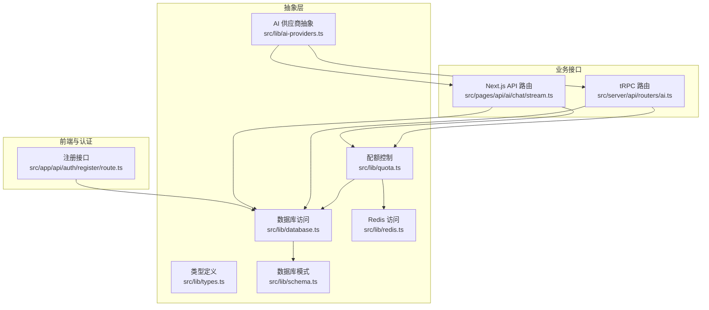
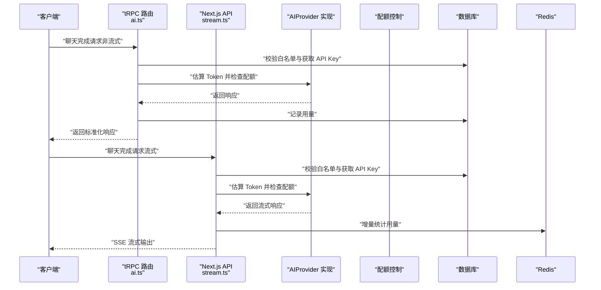
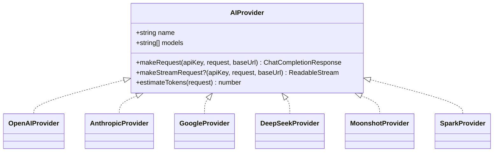
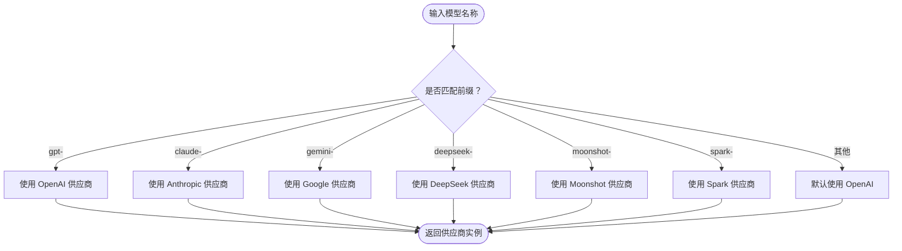
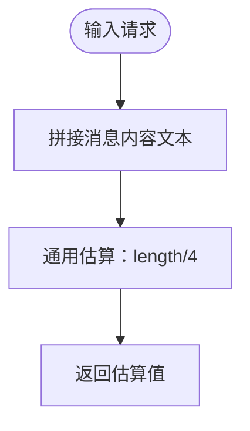
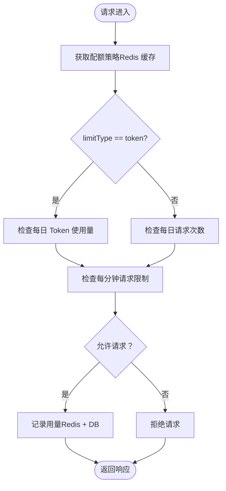
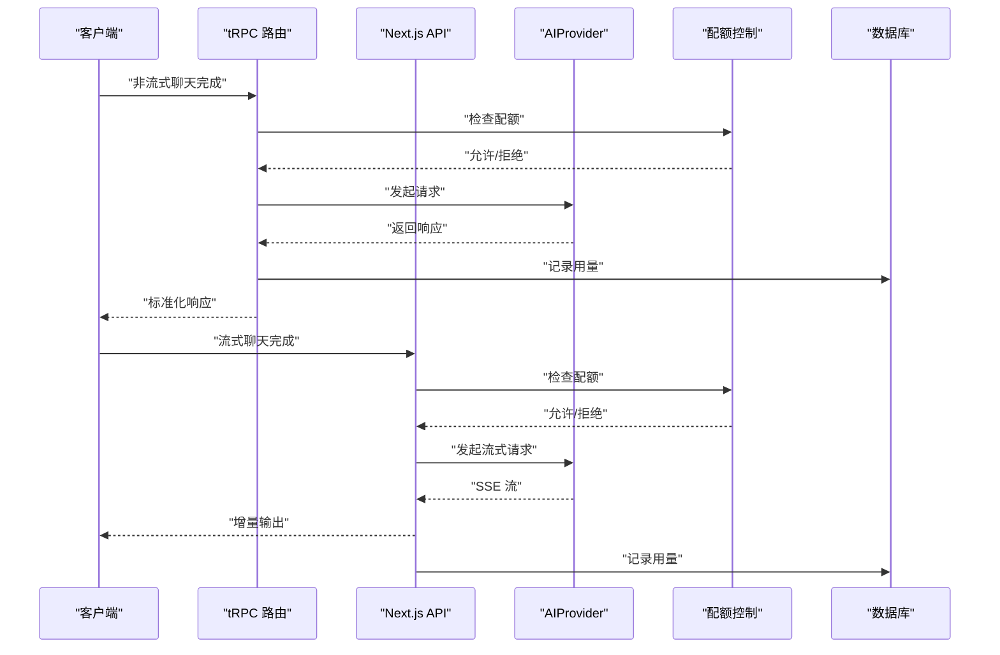
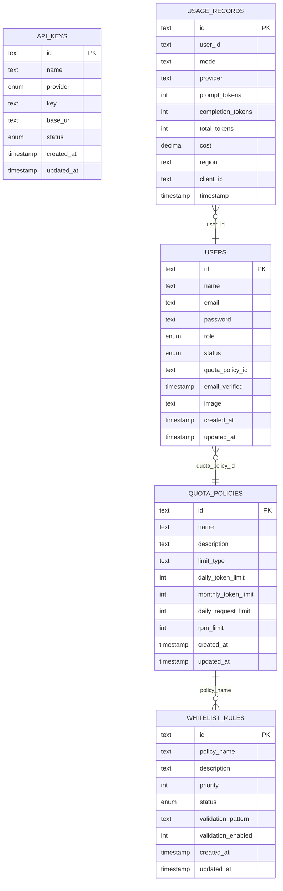
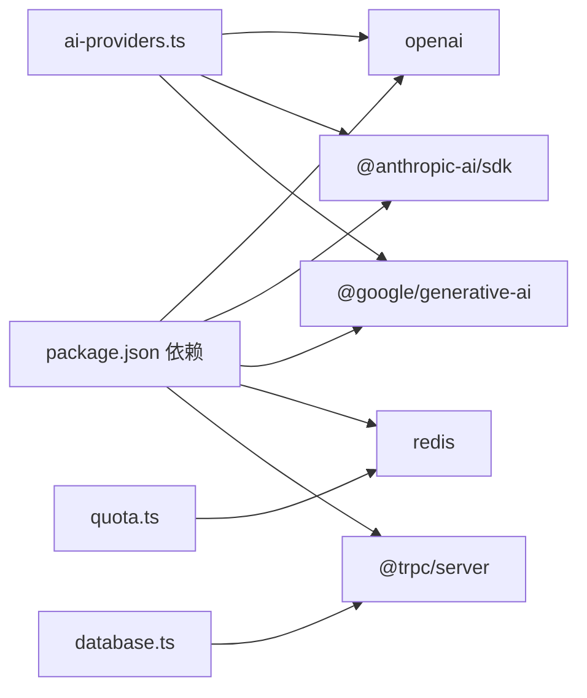

# AI 供应商抽象层设计

<cite>
**本文档引用的文件**
- [src/lib/ai-providers.ts](file://src/lib/ai-providers.ts)
- [src/lib/types.ts](file://src/lib/types.ts)
- [src/lib/quota.ts](file://src/lib/quota.ts)
- [src/lib/database.ts](file://src/lib/database.ts)
- [src/lib/redis.ts](file://src/lib/redis.ts)
- [src/lib/schema.ts](file://src/lib/schema.ts)
- [src/server/api/routers/ai.ts](file://src/server/api/routers/ai.ts)
- [src/pages/api/ai/chat/stream.ts](file://src/pages/api/ai/chat/stream.ts)
- [src/app/api/auth/register/route.ts](file://src/app/api/auth/register/route.ts)
- [package.json](file://package.json)
</cite>

## 目录
1. [简介](#简介)
2. [项目结构](#项目结构)
3. [核心组件](#核心组件)
4. [架构总览](#架构总览)
5. [详细组件分析](#详细组件分析)
6. [依赖关系分析](#依赖关系分析)
7. [性能考量](#性能考量)
8. [故障排查指南](#故障排查指南)
9. [结论](#结论)
10. [附录](#附录)

## 简介
本项目旨在构建一个统一的 AI 供应商抽象层，屏蔽不同大模型供应商（OpenAI、Anthropic、Google、DeepSeek、Moonshot、Spark）的差异，向上层提供一致的接口与数据结构。抽象层通过统一的 AIProvider 接口、标准化的数据模型、统一的配额控制与用量统计，以及灵活的供应商选择与路由机制，实现对多供应商的透明适配与无缝切换。

## 项目结构
项目采用基于功能模块的分层组织方式：
- 抽象层与核心逻辑：位于 src/lib 下，包含 AI 供应商抽象、类型定义、配额控制、数据库与 Redis 访问等
- 业务路由：位于 src/server/api/routers 下，提供 tRPC 接口
- API 端点：位于 src/pages/api 下，提供 Next.js API 路由
- 前端与认证：位于 src/app 与 src/components 下，配合 NextAuth 使用
- 数据库与迁移：位于 drizzle 目录下，使用 Drizzle ORM 管理数据库结构

图表来源
- [src/lib/ai-providers.ts](file://src/lib/ai-providers.ts#L1-L759)
- [src/lib/types.ts](file://src/lib/types.ts#L1-L118)
- [src/lib/quota.ts](file://src/lib/quota.ts#L1-L334)
- [src/lib/database.ts](file://src/lib/database.ts#L1-L524)
- [src/lib/redis.ts](file://src/lib/redis.ts#L1-L49)
- [src/lib/schema.ts](file://src/lib/schema.ts#L1-L159)
- [src/server/api/routers/ai.ts](file://src/server/api/routers/ai.ts#L1-L223)
- [src/pages/api/ai/chat/stream.ts](file://src/pages/api/ai/chat/stream.ts#L1-L167)
- [src/app/api/auth/register/route.ts](file://src/app/api/auth/register/route.ts#L1-L46)

章节来源
- [src/lib/ai-providers.ts](file://src/lib/ai-providers.ts#L1-L759)
- [src/server/api/routers/ai.ts](file://src/server/api/routers/ai.ts#L1-L223)
- [src/pages/api/ai/chat/stream.ts](file://src/pages/api/ai/chat/stream.ts#L1-L167)

## 核心组件
- AIProvider 接口：定义统一的供应商能力边界，包括模型列表、请求方法、流式请求方法与 Token 估算方法
- 供应商实现：针对 OpenAI、Anthropic、Google、DeepSeek、Moonshot、Spark 的具体实现，包含请求封装、流式转换与 Token 估算
- 类型系统：使用 Zod Schema 定义请求、响应、用量记录与配额策略的结构化类型
- 配额控制：基于 Redis 的每日 Token/请求次数与每分钟请求限制，支持策略缓存与用量持久化
- 数据库与缓存：Drizzle ORM 访问 PostgreSQL，Redis 缓存策略与 API Key，提升性能与可靠性
- tRPC 与 API 路由：统一的聊天完成接口与流式接口，支持白名单校验、配额检查与用量记录

章节来源
- [src/lib/ai-providers.ts](file://src/lib/ai-providers.ts#L12-L27)
- [src/lib/types.ts](file://src/lib/types.ts#L47-L117)
- [src/lib/quota.ts](file://src/lib/quota.ts#L74-L190)
- [src/lib/database.ts](file://src/lib/database.ts#L1-L524)
- [src/lib/redis.ts](file://src/lib/redis.ts#L1-L49)

## 架构总览
抽象层通过统一接口与标准化数据结构，屏蔽供应商差异；通过白名单规则与配额策略实现用户级用量控制；通过 Redis 缓存与数据库持久化实现高性能与可观测性。

图表来源
- [src/server/api/routers/ai.ts](file://src/server/api/routers/ai.ts#L85-L193)
- [src/pages/api/ai/chat/stream.ts](file://src/pages/api/ai/chat/stream.ts#L9-L166)
- [src/lib/ai-providers.ts](file://src/lib/ai-providers.ts#L688-L759)
- [src/lib/quota.ts](file://src/lib/quota.ts#L74-L255)
- [src/lib/database.ts](file://src/lib/database.ts#L19-L80)

## 详细组件分析

### AIProvider 接口与实现
AIProvider 接口定义了统一的能力边界，确保不同供应商的实现遵循相同的契约。每个供应商实现包含：
- 名称与支持模型列表
- 同步请求方法：makeRequest
- 可选的流式请求方法：makeStreamRequest
- Token 估算方法：estimateTokens

供应商实现概览：
- OpenAI：使用官方 SDK，支持同步与流式
- Anthropic：使用 fetch 调用 Messages API，支持流式转换
- Google：使用 Gemini API，支持流式转换
- DeepSeek/Moonshot/Spark：均使用 OpenAI 兼容 API

图表来源
- [src/lib/ai-providers.ts](file://src/lib/ai-providers.ts#L12-L27)
- [src/lib/ai-providers.ts](file://src/lib/ai-providers.ts#L34-L100)
- [src/lib/ai-providers.ts](file://src/lib/ai-providers.ts#L102-L282)
- [src/lib/ai-providers.ts](file://src/lib/ai-providers.ts#L284-L469)
- [src/lib/ai-providers.ts](file://src/lib/ai-providers.ts#L471-L613)
- [src/lib/ai-providers.ts](file://src/lib/ai-providers.ts#L615-L685)

章节来源
- [src/lib/ai-providers.ts](file://src/lib/ai-providers.ts#L12-L27)
- [src/lib/ai-providers.ts](file://src/lib/ai-providers.ts#L34-L100)
- [src/lib/ai-providers.ts](file://src/lib/ai-providers.ts#L102-L282)
- [src/lib/ai-providers.ts](file://src/lib/ai-providers.ts#L284-L469)
- [src/lib/ai-providers.ts](file://src/lib/ai-providers.ts#L471-L613)
- [src/lib/ai-providers.ts](file://src/lib/ai-providers.ts#L615-L685)

### 供应商选择算法与动态路由
供应商选择基于模型前缀进行匹配，支持默认回退策略：
- 模型前缀匹配：gpt-（OpenAI）、claude-（Anthropic）、gemini-（Google）、deepseek-（DeepSeek）、moonshot-（Moonshot）、spark-（Spark）
- 默认回退：若未匹配，默认返回 OpenAI
- 动态路由：根据 API Key 的 provider 字段选择对应供应商实例

图表来源
- [src/lib/ai-providers.ts](file://src/lib/ai-providers.ts#L697-L707)

章节来源
- [src/lib/ai-providers.ts](file://src/lib/ai-providers.ts#L697-L707)

### Token 估算算法与供应商特殊处理
- 通用估算：按字符长度估算，约 4 个字符 ≈ 1 个 token
- 供应商特殊处理：
  - OpenAI：直接复用供应商返回的 usage
  - Anthropic/Google：当供应商未返回 usage 时，使用通用估算值
  - 流式场景：在流式读取过程中增量统计完成 token 数量

图表来源
- [src/lib/ai-providers.ts](file://src/lib/ai-providers.ts#L29-L32)
- [src/lib/ai-providers.ts](file://src/lib/ai-providers.ts#L96-L99)
- [src/lib/ai-providers.ts](file://src/lib/ai-providers.ts#L278-L281)
- [src/lib/ai-providers.ts](file://src/lib/ai-providers.ts#L465-L468)
- [src/pages/api/ai/chat/stream.ts](file://src/pages/api/ai/chat/stream.ts#L108-L122)

章节来源
- [src/lib/ai-providers.ts](file://src/lib/ai-providers.ts#L29-L32)
- [src/lib/ai-providers.ts](file://src/lib/ai-providers.ts#L96-L99)
- [src/lib/ai-providers.ts](file://src/lib/ai-providers.ts#L278-L281)
- [src/lib/ai-providers.ts](file://src/lib/ai-providers.ts#L465-L468)
- [src/pages/api/ai/chat/stream.ts](file://src/pages/api/ai/chat/stream.ts#L108-L122)

### 配额控制与用量统计
配额控制支持两种模式：
- Token 模式：按每日 Token 使用量与每分钟请求限制控制
- 请求次数模式：按每日请求次数与每分钟请求限制控制
- 策略缓存：Redis 缓存用户配额策略，降低数据库压力
- 用量记录：记录每次请求的用量、地区与客户端 IP，并持久化到数据库

图表来源
- [src/lib/quota.ts](file://src/lib/quota.ts#L74-L190)
- [src/lib/quota.ts](file://src/lib/quota.ts#L192-L255)
- [src/lib/redis.ts](file://src/lib/redis.ts#L18-L49)
- [src/lib/database.ts](file://src/lib/database.ts#L280-L295)

章节来源
- [src/lib/quota.ts](file://src/lib/quota.ts#L74-L190)
- [src/lib/quota.ts](file://src/lib/quota.ts#L192-L255)
- [src/lib/redis.ts](file://src/lib/redis.ts#L18-L49)
- [src/lib/database.ts](file://src/lib/database.ts#L280-L295)

### tRPC 与 API 路由工作流
- tRPC 路由：负责非流式请求，进行白名单校验、配额检查、用量记录与响应包装
- Next.js API 路由：负责流式请求，使用 SSE 输出供应商流式响应，实时统计完成 token 并记录用量

图表来源
- [src/server/api/routers/ai.ts](file://src/server/api/routers/ai.ts#L85-L193)
- [src/pages/api/ai/chat/stream.ts](file://src/pages/api/ai/chat/stream.ts#L9-L166)

章节来源
- [src/server/api/routers/ai.ts](file://src/server/api/routers/ai.ts#L85-L193)
- [src/pages/api/ai/chat/stream.ts](file://src/pages/api/ai/chat/stream.ts#L9-L166)

### 数据模型与关系
抽象层使用 Zod Schema 定义请求、响应、用量记录与配额策略的结构化类型，确保前后端一致性。

图表来源
- [src/lib/schema.ts](file://src/lib/schema.ts#L28-L95)
- [src/lib/types.ts](file://src/lib/types.ts#L4-L117)

章节来源
- [src/lib/schema.ts](file://src/lib/schema.ts#L28-L95)
- [src/lib/types.ts](file://src/lib/types.ts#L4-L117)

## 依赖关系分析
- 外部依赖：openai、@anthropic-ai/sdk、@google/generative-ai、redis、drizzle-orm、next、@trpc/server 等
- 内部依赖：抽象层组件之间的耦合度低，通过统一接口与类型定义解耦
- 数据流：请求从 tRPC/API 路由进入，经过白名单与配额检查，调用 AIProvider，最终记录用量并返回

图表来源
- [package.json](file://package.json#L18-L56)
- [src/lib/ai-providers.ts](file://src/lib/ai-providers.ts#L42-L46)
- [src/lib/ai-providers.ts](file://src/lib/ai-providers.ts#L111-L130)
- [src/lib/ai-providers.ts](file://src/lib/ai-providers.ts#L293-L323)
- [src/lib/quota.ts](file://src/lib/quota.ts#L1-L3)
- [src/lib/database.ts](file://src/lib/database.ts#L1-L6)

章节来源
- [package.json](file://package.json#L18-L56)
- [src/lib/ai-providers.ts](file://src/lib/ai-providers.ts#L42-L46)
- [src/lib/ai-providers.ts](file://src/lib/ai-providers.ts#L111-L130)
- [src/lib/ai-providers.ts](file://src/lib/ai-providers.ts#L293-L323)
- [src/lib/quota.ts](file://src/lib/quota.ts#L1-L3)
- [src/lib/database.ts](file://src/lib/database.ts#L1-L6)

## 性能考量
- Redis 缓存：策略缓存、API Key 缓存、用量统计与请求日志缓存，显著降低数据库压力
- 异步流式：流式响应使用 ReadableStream 与 SSE，避免一次性等待完整响应
- 估算与配额：在请求前进行 Token 估算与配额检查，减少无效调用
- 数据库优化：使用 Drizzle ORM 与索引，结合并发写入与过期策略

## 故障排查指南
- 供应商不可用：检查 API Key 状态与 baseUrl 配置，确认供应商 SDK 正常
- 配额超限：查看 Redis 中的每日用量与每分钟请求计数，调整配额策略
- 流式异常：检查供应商是否支持流式，确认 SSE 转换逻辑与错误处理
- 白名单校验失败：核对白名单规则与 userId 匹配，确保规则优先级与正则表达式正确

章节来源
- [src/pages/api/ai/chat/stream.ts](file://src/pages/api/ai/chat/stream.ts#L40-L51)
- [src/lib/quota.ts](file://src/lib/quota.ts#L114-L157)
- [src/lib/database.ts](file://src/lib/database.ts#L400-L489)

## 结论
该抽象层通过统一接口、标准化类型与灵活的配额控制，实现了对多供应商的透明适配。其设计兼顾性能与可维护性，支持扩展新的供应商与配额策略，满足多用户共享模型但隔离用量的实际需求。

## 附录

### 扩展指南：新增供应商集成步骤
- 定义供应商实现：实现 AIProvider 接口，包含 models、makeRequest、可选 makeStreamRequest、estimateTokens
- 注册供应商：将新供应商加入 providers 映射，并在 getProviderByModel 中添加前缀匹配
- 配置 API Key：在数据库中添加供应商 API Key，支持自定义 baseUrl
- 测试验证：覆盖非流式与流式场景，验证 Token 估算与用量记录

章节来源
- [src/lib/ai-providers.ts](file://src/lib/ai-providers.ts#L12-L27)
- [src/lib/ai-providers.ts](file://src/lib/ai-providers.ts#L688-L759)
- [src/lib/database.ts](file://src/lib/database.ts#L29-L40)

### 使用模式示例（路径引用）
- 非流式聊天完成：[src/server/api/routers/ai.ts](file://src/server/api/routers/ai.ts#L85-L193)
- 流式聊天完成：[src/pages/api/ai/chat/stream.ts](file://src/pages/api/ai/chat/stream.ts#L9-L166)
- 配额检查与记录：[src/lib/quota.ts](file://src/lib/quota.ts#L74-L255)
- 类型定义与校验：[src/lib/types.ts](file://src/lib/types.ts#L47-L117)
- 数据库操作：[src/lib/database.ts](file://src/lib/database.ts#L19-L80)