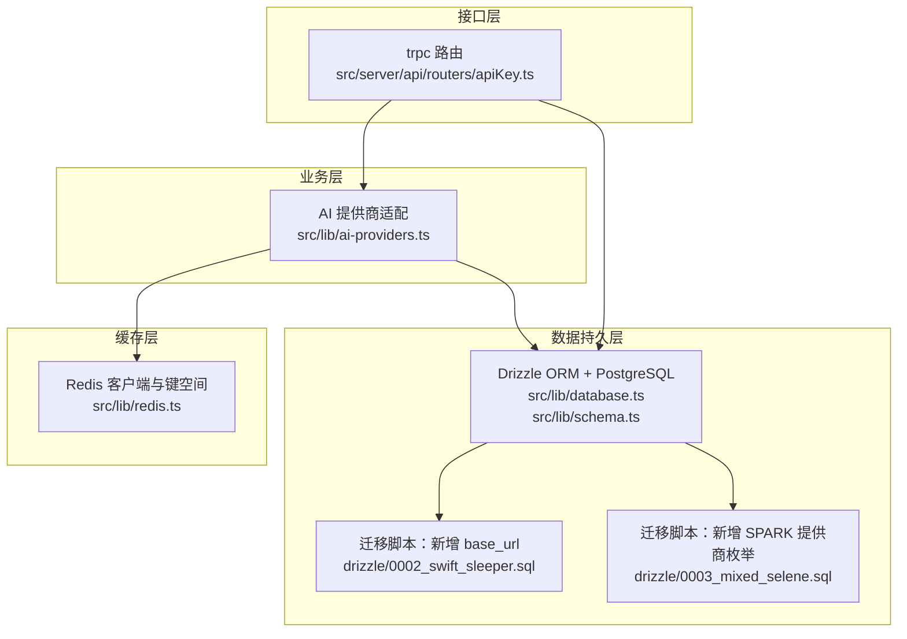
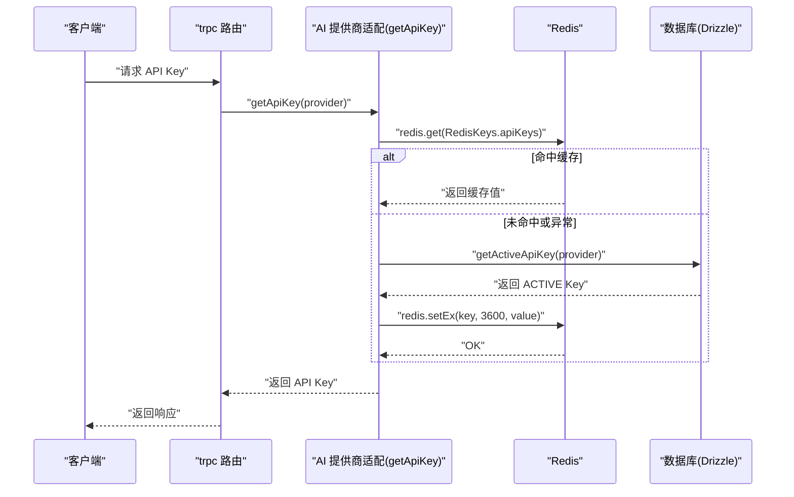
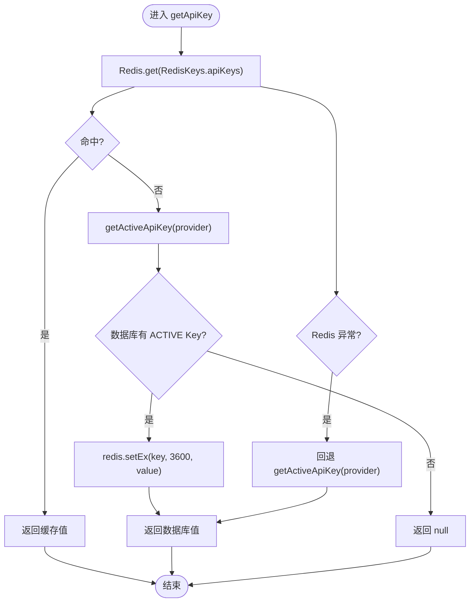
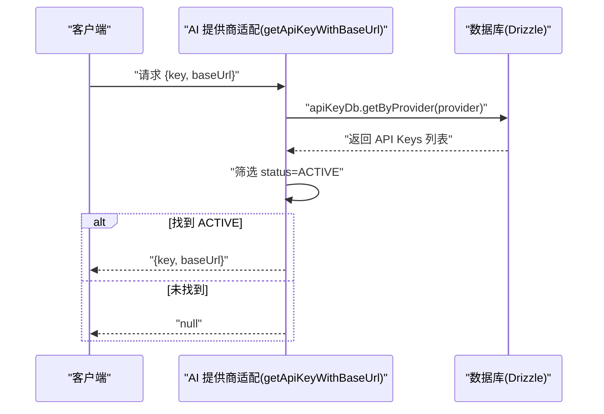
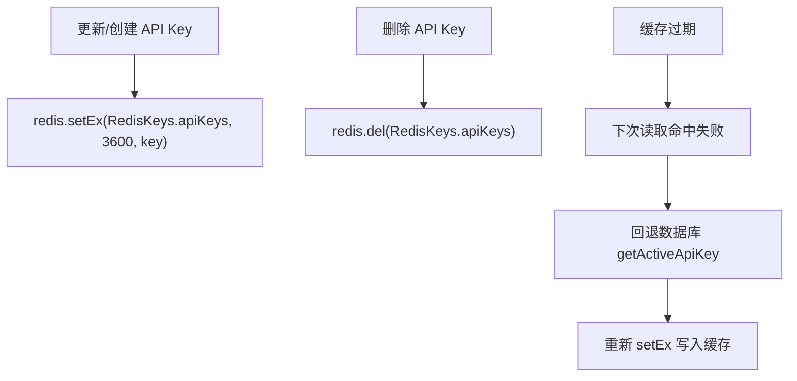
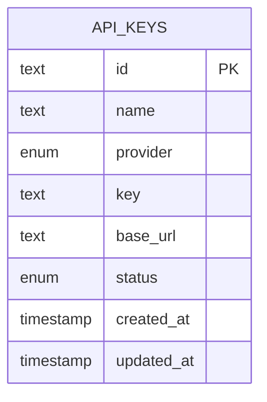
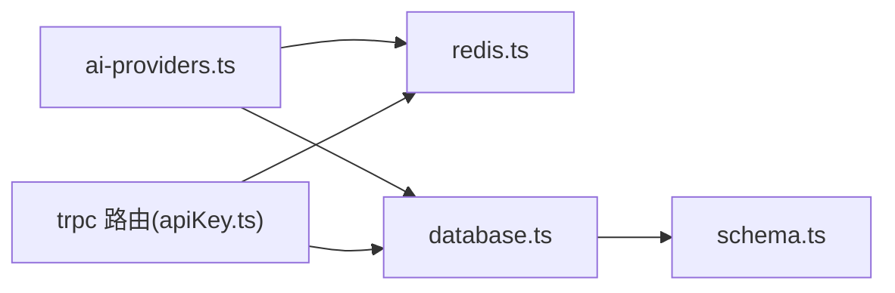

# API Key 管理与缓存

<cite>
**本文引用的文件**
- [src/lib/ai-providers.ts](file://src/lib/ai-providers.ts)
- [src/lib/redis.ts](file://src/lib/redis.ts)
- [src/lib/database.ts](file://src/lib/database.ts)
- [src/lib/schema.ts](file://src/lib/schema.ts)
- [src/server/api/routers/apiKey.ts](file://src/server/api/routers/apiKey.ts)
- [.env](file://.env)
- [drizzle/0002_swift_sleeper.sql](file://drizzle/0002_swift_sleeper.sql)
- [drizzle/0003_mixed_selene.sql](file://drizzle/0003_mixed_selene.sql)
- [src/types/api-key.ts](file://src/types/api-key.ts)
</cite>

## 目录
1. [简介](#简介)
2. [项目结构](#项目结构)
3. [核心组件](#核心组件)
4. [架构总览](#架构总览)
5. [详细组件分析](#详细组件分析)
6. [依赖关系分析](#依赖关系分析)
7. [性能考量](#性能考量)
8. [故障排查指南](#故障排查指南)
9. [结论](#结论)
10. [附录](#附录)

## 简介
本文件围绕 API Key 管理与缓存系统进行深入技术说明，重点覆盖以下内容：
- getApiKey 与 getApiKeyWithBaseUrl 的实现原理与调用路径
- Redis 缓存策略、数据库回退机制与错误处理流程
- 缓存键命名规范、过期时间与失效策略
- API Key 存储结构、提供商映射、状态管理与基础 URL 配置
- 缓存一致性保障（读写路径、回退策略），并发与数据同步
- 配置指南（Redis 连接、缓存参数调优、故障恢复）
- 使用示例与最佳实践（性能监控、容量规划、安全）

## 项目结构
该系统采用分层设计：
- 接口层：trpc 路由负责对外暴露 API Key 的增删改查与状态切换等能力
- 业务层：AI 提供商适配模块负责根据提供商选择合适的 API Key 与基础 URL
- 缓存层：Redis 提供高频读取的缓存键空间
- 数据持久层：PostgreSQL + Drizzle ORM，维护 API Key、用量记录、配额策略等

图表来源
- [src/server/api/routers/apiKey.ts](file://src/server/api/routers/apiKey.ts#L147-L190)
- [src/lib/ai-providers.ts](file://src/lib/ai-providers.ts#L710-L758)
- [src/lib/redis.ts](file://src/lib/redis.ts#L1-L49)
- [src/lib/database.ts](file://src/lib/database.ts#L19-L80)
- [src/lib/schema.ts](file://src/lib/schema.ts#L42-L52)
- [drizzle/0002_swift_sleeper.sql](file://drizzle/0002_swift_sleeper.sql#L1-L1)
- [drizzle/0003_mixed_selene.sql](file://drizzle/0003_mixed_selene.sql#L1-L1)

章节来源
- [src/server/api/routers/apiKey.ts](file://src/server/api/routers/apiKey.ts#L147-L190)
- [src/lib/ai-providers.ts](file://src/lib/ai-providers.ts#L710-L758)
- [src/lib/redis.ts](file://src/lib/redis.ts#L1-L49)
- [src/lib/database.ts](file://src/lib/database.ts#L19-L80)
- [src/lib/schema.ts](file://src/lib/schema.ts#L42-L52)
- [drizzle/0002_swift_sleeper.sql](file://drizzle/0002_swift_sleeper.sql#L1-L1)
- [drizzle/0003_mixed_selene.sql](file://drizzle/0003_mixed_selene.sql#L1-L1)

## 核心组件
- 缓存键空间与连接
  - RedisKeys.apiKeys(provider)：按提供商维度缓存活跃 API Key
  - 过期时间：1 小时（setEx 3600）
  - 连接配置：REDIS_URL 环境变量，默认本地 redis://localhost:6379
- 数据库模型与查询
  - 表结构：api_keys（含 provider、key、base_url、status、createdAt 等）
  - 查询：按提供商获取、按 ID 获取、创建/更新/删除
  - 状态：ACTIVE/INACTIVE/SUSPENDED（枚举）
- AI 提供商适配
  - getApiKey(providerName)：优先 Redis，未命中回退数据库；异常时回退数据库
  - getApiKeyWithBaseUrl(providerName)：直接从数据库取 ACTIVE 状态的 API Key 及其 base_url

章节来源
- [src/lib/redis.ts](file://src/lib/redis.ts#L18-L37)
- [src/lib/ai-providers.ts](file://src/lib/ai-providers.ts#L710-L758)
- [src/lib/database.ts](file://src/lib/database.ts#L19-L80)
- [src/lib/schema.ts](file://src/lib/schema.ts#L42-L52)
- [.env](file://.env#L1-L2)

## 架构总览
下图展示了 API Key 读取与缓存的关键交互流程。

图表来源
- [src/lib/ai-providers.ts](file://src/lib/ai-providers.ts#L710-L735)
- [src/lib/redis.ts](file://src/lib/redis.ts#L18-L37)
- [src/lib/database.ts](file://src/lib/database.ts#L296-L306)

## 详细组件分析

### 组件一：getApiKey 实现原理
- 读取顺序
  - 先查 Redis：RedisKeys.apiKeys(provider)
  - 未命中或异常：回退数据库，调用 getActiveApiKey(provider)
  - 成功后写入 Redis，设置过期时间为 3600 秒
- 异常处理
  - Redis 异常时记录错误并回退数据库，确保可用性
- 并发与一致性
  - 读路径无显式锁；写路径在创建/更新/删除 API Key 后同步更新 Redis
  - 未发现显式的全局读写锁或分布式锁，采用“读缓存、回退数据库”的保守策略

图表来源
- [src/lib/ai-providers.ts](file://src/lib/ai-providers.ts#L710-L735)
- [src/lib/database.ts](file://src/lib/database.ts#L296-L306)
- [src/lib/redis.ts](file://src/lib/redis.ts#L18-L37)

章节来源
- [src/lib/ai-providers.ts](file://src/lib/ai-providers.ts#L710-L735)
- [src/lib/database.ts](file://src/lib/database.ts#L296-L306)

### 组件二：getApiKeyWithBaseUrl 实现原理
- 读取逻辑
  - 直接查询数据库：apiKeyDb.getByProvider(provider)
  - 在结果集中筛选 status 为 ACTIVE 的条目
  - 返回 { key, baseUrl? }，若无 ACTIVE 则返回 null
- 适用场景
  - 需要同时获取 API Key 与自定义基础 URL 的场景（如企业私有化部署）
- 与 getApiKey 的差异
  - 不使用 Redis 缓存，直接走数据库，避免缓存与实际配置不一致的风险

图表来源
- [src/lib/ai-providers.ts](file://src/lib/ai-providers.ts#L738-L758)
- [src/lib/database.ts](file://src/lib/database.ts#L29-L39)

章节来源
- [src/lib/ai-providers.ts](file://src/lib/ai-providers.ts#L738-L758)
- [src/lib/database.ts](file://src/lib/database.ts#L29-L39)

### 组件三：Redis 缓存策略与键命名
- 键命名规范
  - RedisKeys.apiKeys(provider)：形如 "api_keys:{provider}"
  - 以提供商为维度隔离，避免跨提供商污染
- 过期时间与失效策略
  - setEx 3600 秒（1 小时）；到期后自动失效，下次读取触发回退数据库
  - 删除 API Key 时主动清理对应缓存键，确保一致性
- 写入时机
  - 创建 API Key、更新 API Key 后均会写入缓存
  - 删除 API Key 后清理缓存

图表来源
- [src/server/api/routers/apiKey.ts](file://src/server/api/routers/apiKey.ts#L164-L171)
- [src/server/api/routers/apiKey.ts](file://src/server/api/routers/apiKey.ts#L211-L218)
- [src/server/api/routers/apiKey.ts](file://src/server/api/routers/apiKey.ts#L265-L272)
- [src/lib/redis.ts](file://src/lib/redis.ts#L32-L33)

章节来源
- [src/server/api/routers/apiKey.ts](file://src/server/api/routers/apiKey.ts#L164-L171)
- [src/server/api/routers/apiKey.ts](file://src/server/api/routers/apiKey.ts#L211-L218)
- [src/server/api/routers/apiKey.ts](file://src/server/api/routers/apiKey.ts#L265-L272)
- [src/lib/redis.ts](file://src/lib/redis.ts#L32-L33)

### 组件四：API Key 存储结构与状态管理
- 表结构要点（api_keys）
  - provider：枚举，支持 OPENAI、ANTHROPIC、GOOGLE、DEEPSEEK、MOONSHOT、SPARK
  - key：敏感字段，对外展示时进行掩码处理
  - base_url：可选，用于自定义基础地址（迁移脚本已添加）
  - status：ACTIVE/INACTIVE/SUSPENDED
  - createdAt/updatedAt：时间戳
- 类型定义
  - ApiKey、ApiKeyFormData、ApiKeyTestResult 等类型约束
- 状态切换
  - trpc 路由提供 toggleStatus 能力，基于当前状态翻转

图表来源
- [src/lib/schema.ts](file://src/lib/schema.ts#L42-L52)
- [src/types/api-key.ts](file://src/types/api-key.ts#L1-L19)
- [drizzle/0002_swift_sleeper.sql](file://drizzle/0002_swift_sleeper.sql#L1-L1)
- [drizzle/0003_mixed_selene.sql](file://drizzle/0003_mixed_selene.sql#L1-L1)

章节来源
- [src/lib/schema.ts](file://src/lib/schema.ts#L42-L52)
- [src/types/api-key.ts](file://src/types/api-key.ts#L1-L19)
- [drizzle/0002_swift_sleeper.sql](file://drizzle/0002_swift_sleeper.sql#L1-L1)
- [drizzle/0003_mixed_selene.sql](file://drizzle/0003_mixed_selene.sql#L1-L1)

### 组件五：并发控制与缓存一致性
- 读路径
  - 无显式锁；读 Redis → 回退数据库 → 写 Redis 的流程天然具备最终一致性
- 写路径
  - 创建/更新 API Key 后立即写入 Redis
  - 删除 API Key 后立即删除 Redis
- 数据同步
  - 通过 trpc 路由的 CRUD 操作保证数据库与缓存的同步
  - 未发现专门的“读写锁”或分布式锁实现

章节来源
- [src/server/api/routers/apiKey.ts](file://src/server/api/routers/apiKey.ts#L164-L171)
- [src/server/api/routers/apiKey.ts](file://src/server/api/routers/apiKey.ts#L211-L218)
- [src/server/api/routers/apiKey.ts](file://src/server/api/routers/apiKey.ts#L265-L272)

## 依赖关系分析
- 模块耦合
  - ai-providers.ts 依赖 redis.ts 与 database.ts
  - trpc 路由依赖 database.ts 与 redis.ts
  - database.ts 依赖 schema.ts 与 drizzle 初始化
- 外部依赖
  - Redis：用于缓存 API Key
  - PostgreSQL：持久化 API Key 与用量记录
  - Drizzle ORM：类型安全的数据库访问

图表来源
- [src/lib/ai-providers.ts](file://src/lib/ai-providers.ts#L1-L4)
- [src/lib/redis.ts](file://src/lib/redis.ts#L1-L16)
- [src/lib/database.ts](file://src/lib/database.ts#L1-L16)
- [src/lib/schema.ts](file://src/lib/schema.ts#L1-L11)
- [src/server/api/routers/apiKey.ts](file://src/server/api/routers/apiKey.ts#L147-L190)

章节来源
- [src/lib/ai-providers.ts](file://src/lib/ai-providers.ts#L1-L4)
- [src/lib/redis.ts](file://src/lib/redis.ts#L1-L16)
- [src/lib/database.ts](file://src/lib/database.ts#L1-L16)
- [src/lib/schema.ts](file://src/lib/schema.ts#L1-L11)
- [src/server/api/routers/apiKey.ts](file://src/server/api/routers/apiKey.ts#L147-L190)

## 性能考量
- 缓存命中率
  - 高频读取场景下，Redis 命中可显著降低数据库压力
  - 建议监控命中率与延迟，结合业务峰值调整过期时间
- 过期时间调优
  - 当前 3600 秒；可根据 Key 变更频率与一致性要求动态调整
- 并发读写
  - 读路径无锁，写路径在 trpc 层串行化数据库操作，Redis 写入为原子命令
- 监控建议
  - 指标：Redis 命中率、setEx/set 命中率、数据库查询 QPS、错误率
  - 告警：Redis 连接异常、setEx 失败、数据库超时

[本节为通用指导，无需特定文件引用]

## 故障排查指南
- Redis 连接失败
  - 检查 REDIS_URL 环境变量是否正确
  - 查看应用日志中的 Redis Client Error
- Redis 写入失败
  - setEx/set 命令异常会被捕获并告警，系统会回退数据库
- API Key 未生效
  - 确认数据库中对应 provider 的 ACTIVE Key 是否存在
  - 若使用 getApiKeyWithBaseUrl，请确认数据库中存在 ACTIVE 状态的记录
- 缓存未更新
  - 检查 trpc 路由的创建/更新/删除流程是否执行了缓存写入/删除
  - 手动验证 Redis 中是否存在对应键

章节来源
- [.env](file://.env#L1-L2)
- [src/lib/redis.ts](file://src/lib/redis.ts#L7-L9)
- [src/lib/ai-providers.ts](file://src/lib/ai-providers.ts#L730-L734)
- [src/server/api/routers/apiKey.ts](file://src/server/api/routers/apiKey.ts#L164-L171)
- [src/server/api/routers/apiKey.ts](file://src/server/api/routers/apiKey.ts#L211-L218)
- [src/server/api/routers/apiKey.ts](file://src/server/api/routers/apiKey.ts#L265-L272)

## 结论
本系统通过“Redis 缓存 + 数据库回退”的方式实现了高效且可靠的 API Key 读取路径，配合 trpc 路由在写入侧同步维护缓存，保证了最终一致性。getApiKeyWithBaseUrl 则直接从数据库读取，避免了缓存与实际配置不一致的问题。整体设计简洁可靠，适合在高并发场景下稳定运行。

[本节为总结，无需特定文件引用]

## 附录

### 配置指南
- Redis 连接
  - REDIS_URL：Redis 服务地址（默认 redis://localhost:6379）
  - 应用启动时自动 connect，错误将输出日志
- 数据库连接
  - DATABASE_URL：PostgreSQL 连接字符串
  - Drizzle 初始化使用该连接字符串
- 缓存参数调优
  - 过期时间：当前为 3600 秒；可根据业务变更频率调整
  - 建议结合监控指标评估最优值
- 故障恢复
  - Redis 异常时自动回退数据库
  - 删除 API Key 时同步清理缓存键

章节来源
- [.env](file://.env#L1-L2)
- [src/lib/redis.ts](file://src/lib/redis.ts#L3-L14)
- [src/lib/drizzle.ts](file://src/lib/drizzle.ts#L5-L9)

### 使用示例（路径指引）
- 获取 API Key（带缓存）
  - 调用路径：getApiKey(providerName)
  - 位置参考：[src/lib/ai-providers.ts](file://src/lib/ai-providers.ts#L710-L735)
- 获取 API Key 与基础 URL
  - 调用路径：getApiKeyWithBaseUrl(providerName)
  - 位置参考：[src/lib/ai-providers.ts](file://src/lib/ai-providers.ts#L738-L758)
- 创建/更新/删除 API Key（同步缓存）
  - 路由入口：create/update/delete
  - 位置参考：[src/server/api/routers/apiKey.ts](file://src/server/api/routers/apiKey.ts#L147-L190)
  - 位置参考：[src/server/api/routers/apiKey.ts](file://src/server/api/routers/apiKey.ts#L192-L240)
  - 位置参考：[src/server/api/routers/apiKey.ts](file://src/server/api/routers/apiKey.ts#L242-L285)

### 安全最佳实践
- 敏感字段掩码：对外展示时对 key 进行掩码处理
  - 位置参考：[src/server/api/routers/apiKey.ts](file://src/server/api/routers/apiKey.ts#L90-L102)
- 最小权限原则：仅授予数据库必要权限
- 网络隔离：Redis 与数据库置于内网或受控网络
- 审计与告警：对关键操作（创建/删除/更新）记录审计日志并设置告警

章节来源
- [src/server/api/routers/apiKey.ts](file://src/server/api/routers/apiKey.ts#L90-L102)