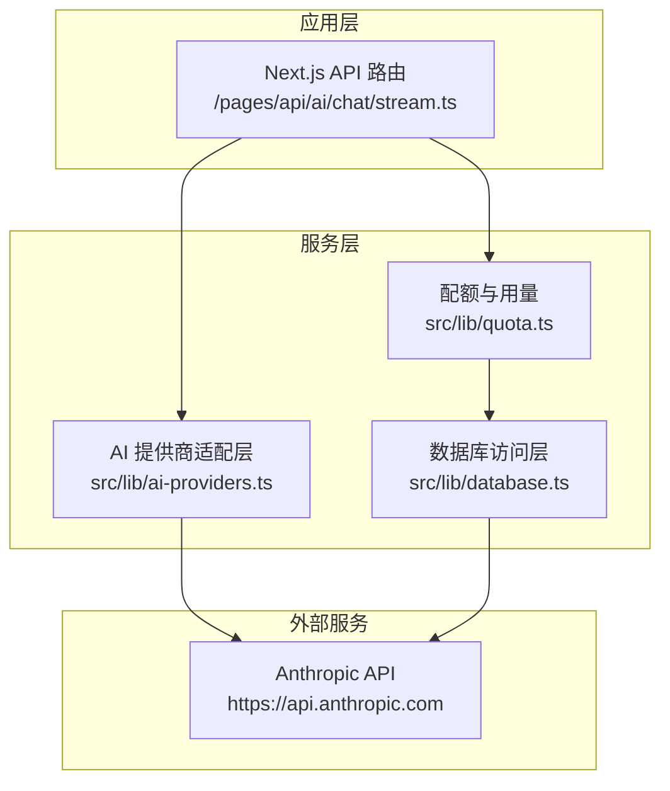
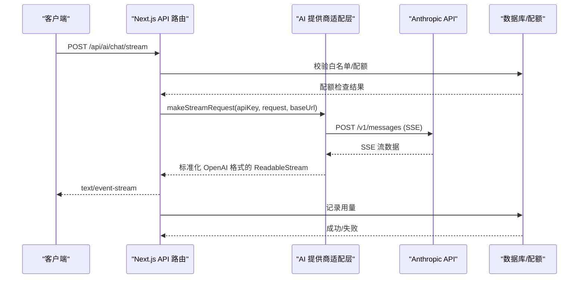
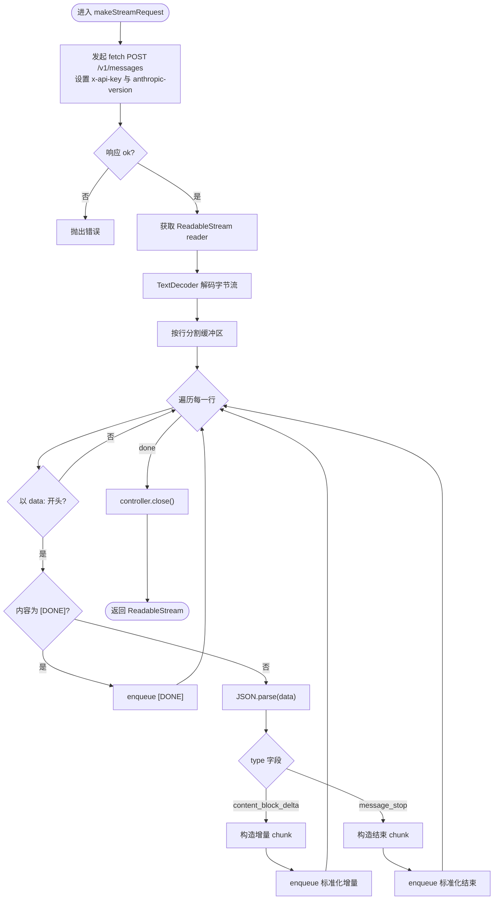
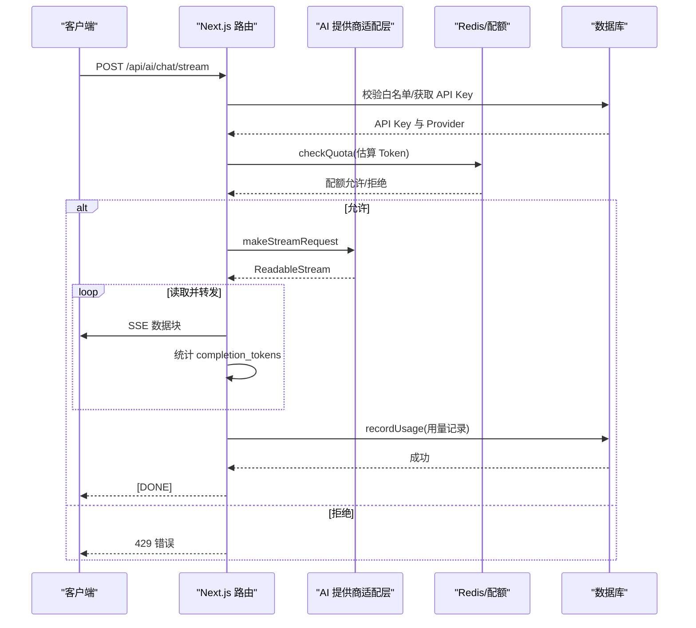
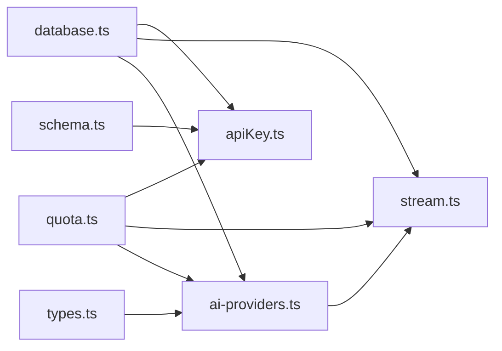

# Anthropic Claude 供应商集成

<cite>
**本文档引用的文件**
- [ai-providers.ts](file://src/lib/ai-providers.ts)
- [types.ts](file://src/lib/types.ts)
- [stream.ts](file://src/pages/api/ai/chat/stream.ts)
- [apiKey.ts](file://src/server/api/routers/apiKey.ts)
- [database.ts](file://src/lib/database.ts)
- [quota.ts](file://src/lib/quota.ts)
- [schema.ts](file://src/lib/schema.ts)
</cite>

## 目录
1. [简介](#简介)
2. [项目结构](#项目结构)
3. [核心组件](#核心组件)
4. [架构总览](#架构总览)
5. [详细组件分析](#详细组件分析)
6. [依赖关系分析](#依赖关系分析)
7. [性能考虑](#性能考虑)
8. [故障排查指南](#故障排查指南)
9. [结论](#结论)
10. [附录](#附录)

## 简介
本文件面向需要在系统中集成 Anthropic Claude 供应商的开发者，提供从架构设计、实现细节到运维实践的完整技术文档。重点覆盖以下方面：
- Anthropic Provider 的实现架构与调用流程
- 自定义 fetch 调用、HTTP 头部配置与认证机制
- Anthropic API 特有参数要求与消息格式转换
- 版本头部设置与流式响应处理（SSE）
- SSE 流数据的解析与转换（数据块分割、JSON 解析、格式标准化）
- Anthropic 响应结构与字段映射（内容增量、完成原因、用量统计）
- 完整集成指南（API 密钥配置、自定义基础 URL、错误处理策略）
- 性能优化技巧、调试方法与最佳实践

## 项目结构
该系统采用模块化组织，关键与 Anthropic 集成相关的文件分布如下：
- 提供商统一接口与实现：src/lib/ai-providers.ts
- 类型定义与校验：src/lib/types.ts
- 流式聊天接口：src/pages/api/ai/chat/stream.ts
- API Key 管理与测试：src/server/api/routers/apiKey.ts
- 数据库访问层：src/lib/database.ts
- 配额与用量统计：src/lib/quota.ts
- 数据库模式定义：src/lib/schema.ts

图表来源
- [stream.ts](file://src/pages/api/ai/chat/stream.ts#L1-L167)
- [ai-providers.ts](file://src/lib/ai-providers.ts#L102-L282)
- [quota.ts](file://src/lib/quota.ts#L74-L190)
- [database.ts](file://src/lib/database.ts#L19-L80)

章节来源
- [ai-providers.ts](file://src/lib/ai-providers.ts#L102-L282)
- [types.ts](file://src/lib/types.ts#L47-L118)
- [stream.ts](file://src/pages/api/ai/chat/stream.ts#L1-L167)
- [apiKey.ts](file://src/server/api/routers/apiKey.ts#L337-L407)
- [database.ts](file://src/lib/database.ts#L19-L80)
- [quota.ts](file://src/lib/quota.ts#L74-L190)
- [schema.ts](file://src/lib/schema.ts#L42-L52)

## 核心组件
- AIProvider 接口：定义统一的 makeRequest、makeStreamRequest、estimateTokens 方法，便于不同提供商的统一接入。
- anthropicProvider 实现：封装 Anthropic API 的调用、头部配置、消息格式转换与 SSE 流解析。
- 流式聊天路由：负责鉴权、配额检查、SSE 头部设置、流式转发与用量统计。
- API Key 管理：提供 API Key 的增删改查、状态切换、格式校验与测试。
- 配额与用量：基于 Redis 的限流与配额控制，支持按日/按分钟/按请求次数的策略。
- 数据库模式：定义 api_keys 表，支持 provider、key、baseUrl、status 等字段。

章节来源
- [ai-providers.ts](file://src/lib/ai-providers.ts#L13-L27)
- [ai-providers.ts](file://src/lib/ai-providers.ts#L102-L282)
- [stream.ts](file://src/pages/api/ai/chat/stream.ts#L78-L166)
- [apiKey.ts](file://src/server/api/routers/apiKey.ts#L84-L407)
- [quota.ts](file://src/lib/quota.ts#L74-L190)
- [schema.ts](file://src/lib/schema.ts#L42-L52)

## 架构总览
Anthropic 集成遵循“统一接口 + 具体实现 + 中间层路由”的三层架构：
- 统一接口层：AIProvider 定义标准方法，确保不同提供商的一致行为契约。
- 具体实现层：anthropicProvider 在 makeRequest 与 makeStreamRequest 中完成 Anthropic API 的调用与响应转换。
- 中间层路由：Next.js API 路由负责鉴权、配额、SSE 头部、流式转发与用量记录。

图表来源
- [stream.ts](file://src/pages/api/ai/chat/stream.ts#L78-L166)
- [ai-providers.ts](file://src/lib/ai-providers.ts#L168-L277)
- [quota.ts](file://src/lib/quota.ts#L192-L255)

## 详细组件分析

### Anthropic Provider 实现
- 自定义 fetch 调用
  - 支持自定义 baseUrl，默认 https://api.anthropic.com
  - 请求路径：/v1/messages
- HTTP 头部配置
  - Content-Type: application/json
  - x-api-key: API Key
  - anthropic-version: 2023-06-01
- 认证机制
  - 通过 x-api-key 头传递 API Key
  - API Key 格式校验：Anthropic Key 以 sk-ant- 开头（测试逻辑）
- 参数要求与消息格式转换
  - 请求体包含 model、max_tokens、messages
  - messages 为标准格式（role: system/user/assistant, content: string）
  - 响应转换为标准 ChatCompletionResponse，choices[0].message.content 为 Claude 输出文本
- 流式响应处理（SSE）
  - 启用 stream: true
  - 逐行解析 data: 行，支持 [DONE] 结束标记
  - 将 Anthropic 的 content_block_delta 与 message_stop 转换为 OpenAI 格式
- 响应结构与字段映射
  - id、object、created、model、choices、usage
  - choices.delta.content 对应增量内容；finish_reason 在 message_stop 时为 stop
  - usage.prompt_tokens/completion_tokens/total_tokens 基于 API 返回或估算

图表来源
- [ai-providers.ts](file://src/lib/ai-providers.ts#L168-L277)

章节来源
- [ai-providers.ts](file://src/lib/ai-providers.ts#L102-L282)

### 流式聊天路由（Next.js API）
- 鉴权与白名单校验
  - 根据 userId 进行白名单规则匹配与校验
- API Key 获取与提供商选择
  - 从数据库获取 API Key（含 provider、key、baseUrl、status）
  - 通过 provider 名称选择对应 AIProvider
- 配额检查
  - 使用 provider.estimateTokens 估算 Token
  - checkQuota 按策略进行每日/每分钟限制检查
- SSE 头部设置
  - Content-Type: text/event-stream;charset=UTF-8
  - Cache-Control: no-cache, no-transform
  - Connection: keep-alive
  - X-Accel-Buffering: no（禁用 Nginx 缓冲）
- 流式转发与用量统计
  - 读取 provider.makeStreamRequest 返回的 ReadableStream
  - 解码并原样转发给客户端
  - 从 data: 行中提取增量内容，估算 completion_tokens
  - 最终记录用量（promptTokens、completionTokens、totalTokens）

图表来源
- [stream.ts](file://src/pages/api/ai/chat/stream.ts#L78-L166)
- [quota.ts](file://src/lib/quota.ts#L74-L190)

章节来源
- [stream.ts](file://src/pages/api/ai/chat/stream.ts#L1-L167)
- [quota.ts](file://src/lib/quota.ts#L74-L190)

### API Key 管理与测试
- API Key 数据结构
  - 字段：id、name、provider（支持 anthropic）、key、baseUrl、status、createdAt
  - 数据库枚举：providerEnum 包含 ANTHROPIC
- API Key 测试
  - Anthropic：简单校验 key 是否以 sk-ant- 开头
  - 其他提供商：使用 OpenAI SDK 调用对应 baseURL 的 models.list
- 前后端映射
  - convertProviderToDb/convertProviderFromDb 实现前端小写与数据库枚举的双向转换

章节来源
- [apiKey.ts](file://src/server/api/routers/apiKey.ts#L337-L407)
- [schema.ts](file://src/lib/schema.ts#L15-L22)
- [types.ts](file://src/lib/types.ts#L19-L31)

### 配额与用量统计
- 策略类型
  - limitType: token 或 request
  - dailyTokenLimit、monthlyTokenLimit、dailyRequestLimit、rpmLimit
- 检查逻辑
  - 按用户标识符（userId/IP/API Key）聚合 Redis 计数器
  - 同时检查每日 Token/请求次数与每分钟请求次数
- 记录用量
  - 按策略类型分别更新 Redis 计数器与数据库 usage_records
  - 支持按天与按分钟的过期策略

章节来源
- [quota.ts](file://src/lib/quota.ts#L5-L12)
- [quota.ts](file://src/lib/quota.ts#L74-L190)
- [quota.ts](file://src/lib/quota.ts#L192-L255)
- [database.ts](file://src/lib/database.ts#L142-L277)

## 依赖关系分析
- ai-providers.ts 依赖：
  - types.ts（ChatCompletionRequest/Response 类型）
  - database.ts（API Key 缓存与获取）
  - quota.ts（Token 估算）
- stream.ts 依赖：
  - ai-providers.ts（提供 makeStreamRequest）
  - quota.ts（checkQuota、recordUsage）
  - database.ts（API Key 查询）
- apiKey.ts 依赖：
  - schema.ts（providerEnum、apiKeys 表）
  - database.ts（apiKeyDb）
  - quota.ts（Redis 缓存 API Key）

图表来源
- [ai-providers.ts](file://src/lib/ai-providers.ts#L1-L10)
- [stream.ts](file://src/pages/api/ai/chat/stream.ts#L1-L8)
- [apiKey.ts](file://src/server/api/routers/apiKey.ts#L1-L6)

章节来源
- [ai-providers.ts](file://src/lib/ai-providers.ts#L1-L10)
- [stream.ts](file://src/pages/api/ai/chat/stream.ts#L1-L8)
- [apiKey.ts](file://src/server/api/routers/apiKey.ts#L1-L6)

## 性能考虑
- 流式传输
  - 使用 ReadableStream 与 TextDecoder 逐步解码，避免一次性加载大响应
  - 禁用 Nginx 缓冲（X-Accel-Buffering: no），确保低延迟实时输出
- Redis 缓存
  - API Key 缓存：减少数据库查询压力
  - 配额计数器：按天/按分钟设置过期，避免内存无限增长
- Token 估算
  - estimateTokens 采用字符长度估算，避免昂贵的第三方 Tokenizer
- 错误处理
  - 对 SSE 解析异常进行 try/catch，保证流持续可用
  - 对 API 调用异常进行统一错误包装与日志记录

[本节为通用性能建议，无需特定文件来源]

## 故障排查指南
- API Key 格式问题
  - Anthropic Key 应以 sk-ant- 开头；若测试失败，请检查 Key 前缀
- 配额限制
  - 若收到 429，请检查 dailyTokenLimit/dailyRequestLimit/rpmLimit 配置
  - 可通过 getDailyUsage 或 Redis 键查看当前使用量
- SSE 流中断
  - 检查响应头是否正确设置（Content-Type、Cache-Control、Connection、X-Accel-Buffering）
  - 查看客户端是否正确处理 data: 行与 [DONE] 结束标记
- 用量统计不准确
  - 确认 completion_tokens 估算逻辑（按字符长度估算）
  - 检查 recordUsage 是否成功写入数据库与 Redis

章节来源
- [apiKey.ts](file://src/server/api/routers/apiKey.ts#L374-L384)
- [stream.ts](file://src/pages/api/ai/chat/stream.ts#L78-L166)
- [quota.ts](file://src/lib/quota.ts#L192-L255)

## 结论
本集成方案通过统一的 AIProvider 接口与标准化的流式处理，实现了对 Anthropic Claude 的稳定接入。其关键优势包括：
- 明确的头部与认证规范（x-api-key、anthropic-version）
- 完整的流式响应解析与格式标准化
- 健壮的配额与用量统计体系
- 可扩展的提供商适配层，便于后续接入其他模型厂商

[本节为总结性内容，无需特定文件来源]

## 附录

### 集成步骤清单
- 配置 API Key
  - 在管理界面添加 provider=anthropic 的 API Key，并填写 baseUrl（可选）
  - 使用 testKey 验证 Key 格式
- 调用流式接口
  - POST /api/ai/chat/stream，携带 userId、apiKeyId、request（包含 model、messages、max_tokens 等）
  - 确保客户端正确处理 text/event-stream
- 错误处理
  - 400：缺少必要字段或 API Key 状态异常
  - 403：白名单校验失败
  - 429：配额不足
  - 501：Provider 不支持 stream
  - 5xx：上游 API 异常

章节来源
- [apiKey.ts](file://src/server/api/routers/apiKey.ts#L337-L407)
- [stream.ts](file://src/pages/api/ai/chat/stream.ts#L14-L166)

### 关键实现参考路径
- Anthropic Provider 主要实现：[ai-providers.ts](file://src/lib/ai-providers.ts#L102-L282)
- 流式聊天路由：[stream.ts](file://src/pages/api/ai/chat/stream.ts#L1-L167)
- API Key 管理与测试：[apiKey.ts](file://src/server/api/routers/apiKey.ts#L337-L407)
- 配额检查与用量记录：[quota.ts](file://src/lib/quota.ts#L74-L255)
- 数据库模式定义：[schema.ts](file://src/lib/schema.ts#L42-L52)