# Google Gemini 供应商集成

<cite>
**本文档引用的文件**
- [src/lib/ai-providers.ts](file://src/lib/ai-providers.ts)
- [src/pages/api/ai/chat/stream.ts](file://src/pages/api/ai/chat/stream.ts)
- [src/server/api/routers/ai.ts](file://src/server/api/routers/ai.ts)
- [src/server/api/routers/apiKey.ts](file://src/server/api/routers/apiKey.ts)
- [src/lib/types.ts](file://src/lib/types.ts)
- [src/lib/quota.ts](file://src/lib/quota.ts)
- [src/lib/database.ts](file://src/lib/database.ts)
- [src/lib/schema.ts](file://src/lib/schema.ts)
- [readme/project-description.md](file://readme/project-description.md)
</cite>

## 目录
1. [简介](#简介)
2. [项目结构](#项目结构)
3. [核心组件](#核心组件)
4. [架构概览](#架构概览)
5. [详细组件分析](#详细组件分析)
6. [依赖关系分析](#依赖关系分析)
7. [性能考虑](#性能考虑)
8. [故障排除指南](#故障排除指南)
9. [结论](#结论)
10. [附录](#附录)

## 简介

AIGate 是一个轻量级、可私有部署的 AI 代理服务，支持多种主流大模型供应商，包括 Google Gemini。本文档专注于 Google Gemini 供应商的完整技术实现，详细解释了 Google Provider 的实现原理、API 调用机制、RESTful 接口封装和响应处理流程。

Google Gemini 供应商集成了以下核心功能：
- Gemini API 调用和 RESTful 接口封装
- 流式响应处理（SSE 数据流解析）
- 响应格式转换和使用量统计
- API 密钥管理和代理设置
- 配额控制和使用监控

## 项目结构

AIGate 采用模块化的架构设计，Google Gemini 集成位于核心的 AI 供应商模块中：

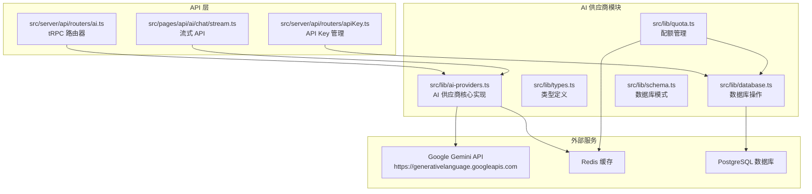

**图表来源**
- [src/lib/ai-providers.ts](file://src/lib/ai-providers.ts#L1-L759)
- [src/server/api/routers/ai.ts](file://src/server/api/routers/ai.ts#L1-L223)
- [src/pages/api/ai/chat/stream.ts](file://src/pages/api/ai/chat/stream.ts#L1-L167)

**章节来源**
- [src/lib/ai-providers.ts](file://src/lib/ai-providers.ts#L1-L759)
- [src/server/api/routers/ai.ts](file://src/server/api/routers/ai.ts#L1-L223)

## 核心组件

### Google Provider 实现

Google Provider 是 AIGate 中专门用于集成 Google Gemini API 的核心组件。它实现了统一的 AIProvider 接口，提供了完整的非流式和流式请求处理能力。

#### 主要特性

1. **统一接口设计**：遵循 AIProvider 接口规范，确保与其他供应商的一致性
2. **灵活的 API 集成**：支持自定义基础 URL 和 API 密钥
3. **完整的响应处理**：支持标准响应格式和流式响应格式
4. **智能内容结构**：自动将消息数组转换为 Gemini API 所需的内容格式

#### 关键实现细节

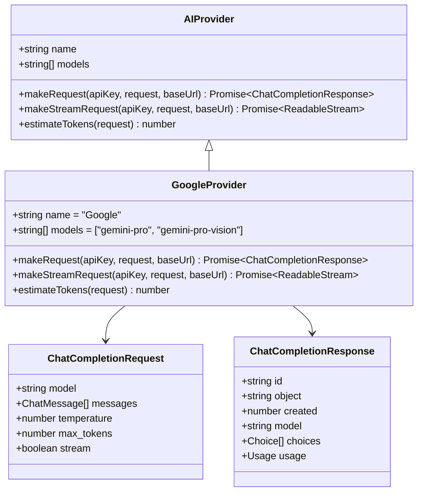

**图表来源**
- [src/lib/ai-providers.ts](file://src/lib/ai-providers.ts#L13-L27)
- [src/lib/ai-providers.ts](file://src/lib/ai-providers.ts#L284-L469)

**章节来源**
- [src/lib/ai-providers.ts](file://src/lib/ai-providers.ts#L284-L469)

### 流式响应处理

Google Provider 实现了完整的流式响应处理机制，支持 SSE（Server-Sent Events）数据流的解析和转换。

#### 流式处理流程

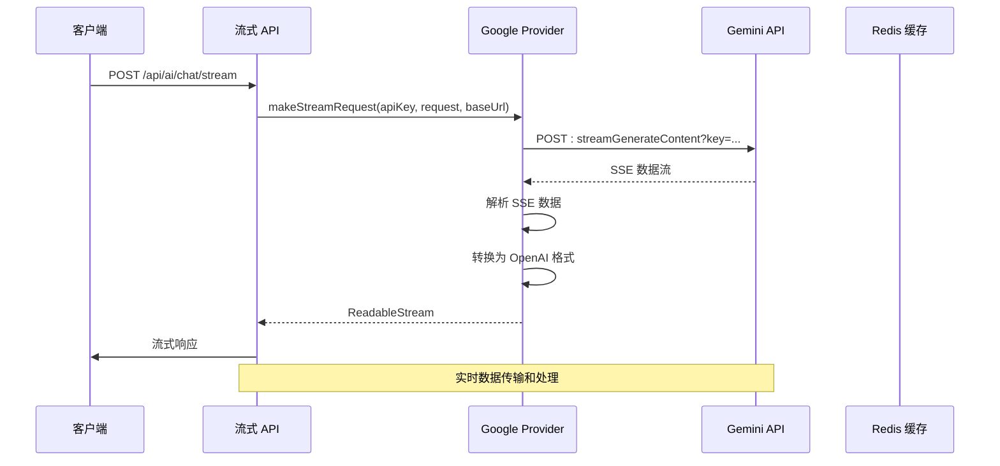

**图表来源**
- [src/lib/ai-providers.ts](file://src/lib/ai-providers.ts#L358-L464)
- [src/pages/api/ai/chat/stream.ts](file://src/pages/api/ai/chat/stream.ts#L88-L129)

**章节来源**
- [src/lib/ai-providers.ts](file://src/lib/ai-providers.ts#L358-L464)
- [src/pages/api/ai/chat/stream.ts](file://src/pages/api/ai/chat/stream.ts#L88-L129)

## 架构概览

AIGate 的 Google Gemini 集成采用了分层架构设计，确保了良好的可维护性和扩展性。

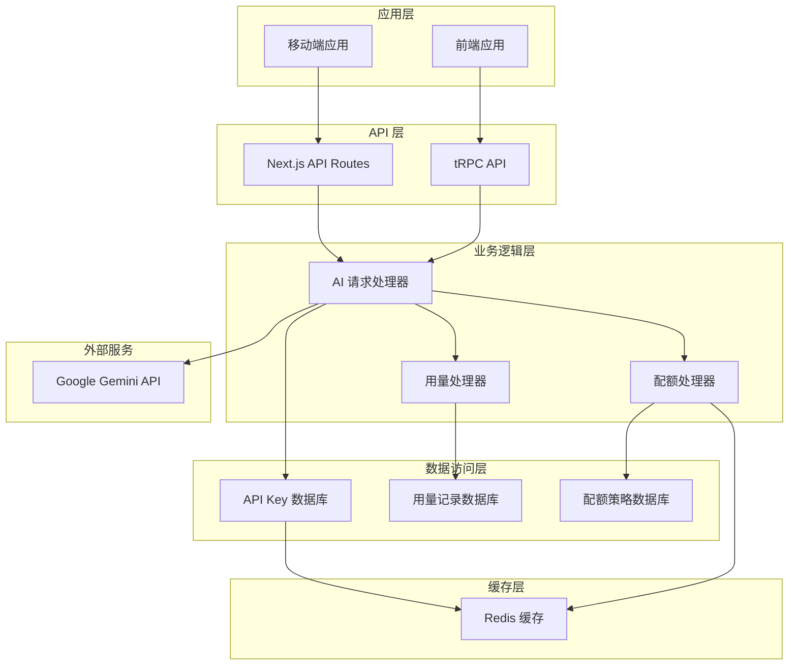

**图表来源**
- [src/server/api/routers/ai.ts](file://src/server/api/routers/ai.ts#L1-L223)
- [src/lib/quota.ts](file://src/lib/quota.ts#L1-L334)
- [src/lib/database.ts](file://src/lib/database.ts#L1-L524)

## 详细组件分析

### Google Provider 核心实现

#### 非流式请求处理

Google Provider 的非流式请求处理实现了完整的 Gemini API 调用流程：

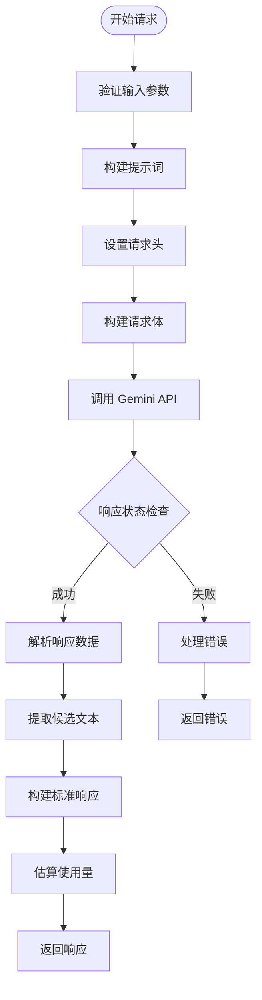

**图表来源**
- [src/lib/ai-providers.ts](file://src/lib/ai-providers.ts#L287-L357)

#### 流式请求处理

流式请求处理实现了复杂的 SSE 数据流解析和转换：

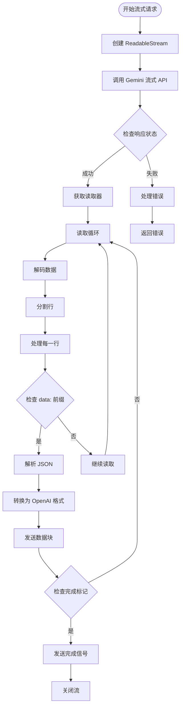

**图表来源**
- [src/lib/ai-providers.ts](file://src/lib/ai-providers.ts#L358-L464)

**章节来源**
- [src/lib/ai-providers.ts](file://src/lib/ai-providers.ts#L287-L464)

### API 密钥管理

Google Provider 支持灵活的 API 密钥管理机制，包括缓存和数据库存储：

#### API 密钥获取流程

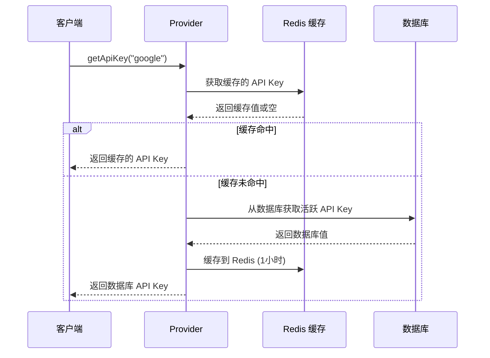

**图表来源**
- [src/lib/ai-providers.ts](file://src/lib/ai-providers.ts#L709-L735)

**章节来源**
- [src/lib/ai-providers.ts](file://src/lib/ai-providers.ts#L709-L735)

### 配额控制系统

Google Provider 集成了完整的配额控制机制，支持基于 Token 数量和请求次数的双重限制：

#### 配额检查流程

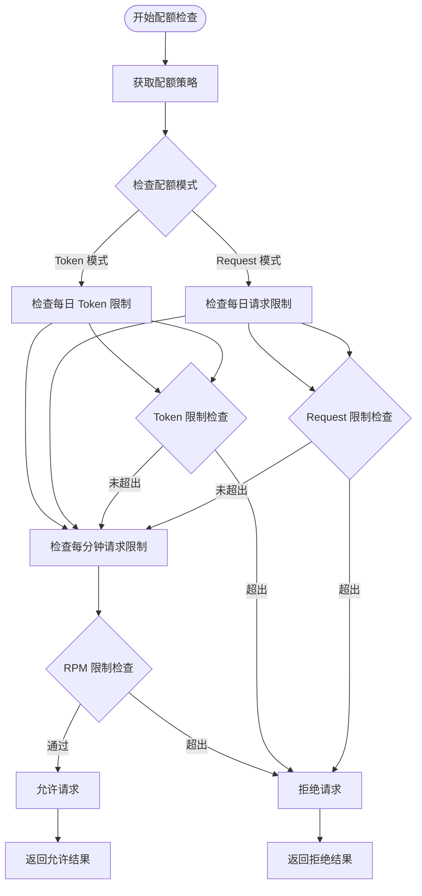

**图表来源**
- [src/lib/quota.ts](file://src/lib/quota.ts#L74-L190)

**章节来源**
- [src/lib/quota.ts](file://src/lib/quota.ts#L74-L190)

### 使用量统计和监控

Google Provider 实现了完整的使用量统计和监控机制：

#### 使用量记录流程

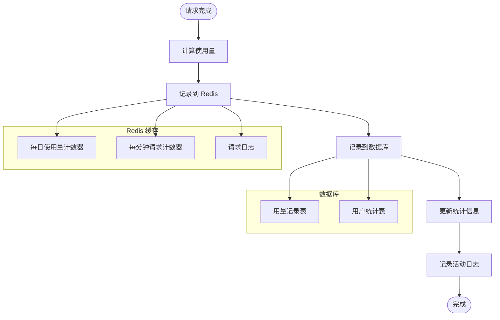

**图表来源**
- [src/lib/quota.ts](file://src/lib/quota.ts#L192-L255)

**章节来源**
- [src/lib/quota.ts](file://src/lib/quota.ts#L192-L255)

## 依赖关系分析

### 组件间依赖关系

Google Gemini 集成涉及多个核心组件的协作，形成了清晰的依赖层次：

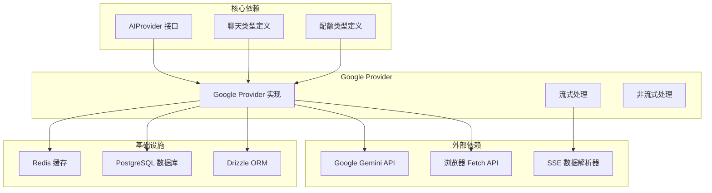

**图表来源**
- [src/lib/ai-providers.ts](file://src/lib/ai-providers.ts#L1-L759)
- [src/lib/database.ts](file://src/lib/database.ts#L1-L524)

### 数据流依赖

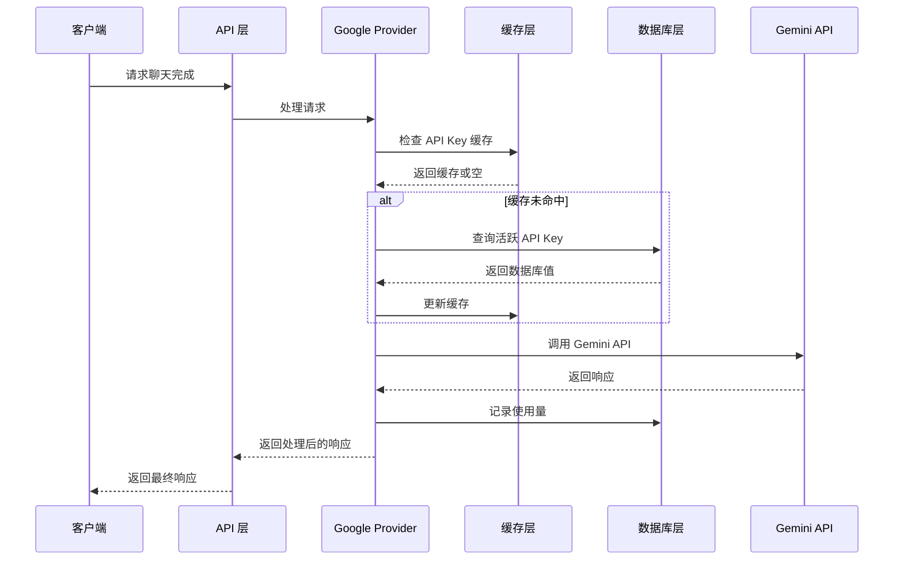

**图表来源**
- [src/pages/api/ai/chat/stream.ts](file://src/pages/api/ai/chat/stream.ts#L36-L94)
- [src/server/api/routers/ai.ts](file://src/server/api/routers/ai.ts#L116-L179)

**章节来源**
- [src/lib/ai-providers.ts](file://src/lib/ai-providers.ts#L1-L759)
- [src/pages/api/ai/chat/stream.ts](file://src/pages/api/ai/chat/stream.ts#L1-L167)
- [src/server/api/routers/ai.ts](file://src/server/api/routers/ai.ts#L1-L223)

## 性能考虑

### 缓存策略

Google Provider 实现了多层次的缓存策略来优化性能：

1. **Redis 缓存**：API Key 缓存 1 小时，减少数据库查询
2. **内存缓存**：在进程内缓存活跃的 API Key
3. **连接池**：复用 HTTP 连接，减少连接开销

### 流式处理优化

```mermaid
flowchart TD
Start([流式处理开始]) --> BufferSize["缓冲区大小控制"]
BufferSize --> ChunkSize["分块大小优化"]
ChunkSize --> Timeout["超时控制"]
Timeout --> Backpressure["背压处理"]
Backpressure --> Memory["内存管理"]
Memory --> GC["垃圾回收"]
GC --> Optimize["性能优化"]
Optimize --> Complete([处理完成])
subgraph "优化策略"
BufferSize --> "动态调整缓冲区大小"
ChunkSize --> "根据网络状况调整分块大小"
Timeout --> "设置合理的超时时间"
Backpressure --> "实现背压机制"
Memory --> "监控内存使用"
GC --> "定期清理内存"
end
```

### 错误处理和重试

Google Provider 实现了完善的错误处理机制：

1. **网络错误重试**：自动重试短暂的网络错误
2. **超时处理**：设置合理的超时时间
3. **降级策略**：在错误情况下提供降级响应
4. **监控告警**：记录错误并触发告警

## 故障排除指南

### 常见问题诊断

#### API Key 相关问题

| 问题类型 | 症状 | 诊断方法 | 解决方案 |
|---------|------|----------|----------|
| API Key 格式错误 | 请求被拒绝 | 检查 API Key 长度和格式 | 验证 API Key 格式 |
| API Key 无效 | 401 未授权错误 | 测试 API Key 有效性 | 重新生成 API Key |
| API Key 过期 | 403 禁止访问 | 检查 API Key 状态 | 更新或替换 API Key |
| API Key 限制 | 429 请求过多 | 检查配额使用情况 | 升级配额或等待重置 |

#### 流式处理问题

| 问题类型 | 症状 | 诊断方法 | 解决方案 |
|---------|------|----------|----------|
| SSE 连接中断 | 数据流提前结束 | 检查网络连接和超时设置 | 优化网络配置 |
| 数据解析错误 | JSON 解析失败 | 检查数据格式和编码 | 实现数据验证 |
| 背压问题 | 内存使用过高 | 监控内存和缓冲区大小 | 调整缓冲区大小 |
| 完成信号丢失 | 客户端无法识别结束 | 检查完成信号格式 | 确保正确发送 [DONE] |

#### 配额控制问题

| 问题类型 | 症状 | 诊断方法 | 解决方案 |
|---------|------|----------|----------|
| 配额不足 | 429 请求被拒绝 | 检查配额使用统计 | 升级配额计划 |
| 配额重置延迟 | 配额未及时重置 | 检查 Redis 过期设置 | 调整过期时间 |
| 统计数据不准确 | 使用量统计异常 | 检查记录流程 | 修复数据同步 |

**章节来源**
- [src/server/api/routers/apiKey.ts](file://src/server/api/routers/apiKey.ts#L337-L407)
- [src/lib/quota.ts](file://src/lib/quota.ts#L74-L190)

### 调试工具和监控

Google Provider 提供了丰富的调试和监控功能：

1. **日志记录**：详细的请求和响应日志
2. **性能指标**：响应时间、吞吐量等关键指标
3. **错误追踪**：完整的错误堆栈和上下文信息
4. **实时监控**：通过 Redis 和数据库监控系统状态

## 结论

AIGate 的 Google Gemini 供应商集成为企业级 AI 应用提供了完整、可靠的集成解决方案。通过模块化的设计和完善的错误处理机制，该集成能够满足生产环境的各种需求。

### 主要优势

1. **标准化接口**：统一的 AIProvider 接口设计，便于扩展和维护
2. **完整的功能支持**：同时支持非流式和流式请求处理
3. **强大的配额控制**：灵活的配额策略和使用量统计
4. **高性能设计**：多层缓存和优化的流式处理机制
5. **完善的监控**：全面的日志记录和性能监控

### 未来发展方向

1. **模型支持扩展**：增加对更多 Gemini 模型的支持
2. **高级功能集成**：支持图像识别、多模态等功能
3. **性能进一步优化**：实现更智能的缓存策略和资源管理
4. **安全增强**：加强 API Key 管理和访问控制
5. **监控可视化**：提供更直观的监控仪表板

## 附录

### 配置指南

#### 基础配置

1. **API Key 设置**：在 API Key 管理界面添加 Google API Key
2. **基础 URL 配置**：可选的自定义基础 URL 设置
3. **模型选择**：支持 `gemini-pro` 和 `gemini-pro-vision` 模型

#### 高级配置

1. **配额策略**：配置每日 Token 限制和请求限制
2. **缓存设置**：调整 Redis 缓存参数
3. **超时配置**：设置合理的请求超时时间
4. **重试策略**：配置网络错误的重试机制

### 使用示例

#### 基本聊天请求

```javascript
// 非流式请求示例
const response = await fetch('/api/ai/chat/completion', {
  method: 'POST',
  headers: {
    'Content-Type': 'application/json',
  },
  body: JSON.stringify({
    userId: 'user123',
    apiKeyId: 'key_google_123',
    request: {
      model: 'gemini-pro',
      messages: [
        {
          role: 'user',
          content: '你好，有什么可以帮助你的吗？'
        }
      ],
      temperature: 0.7,
      max_tokens: 1000
    }
  })
})
```

#### 流式聊天请求

```javascript
// 流式请求示例
const response = await fetch('/api/ai/chat/stream', {
  method: 'POST',
  headers: {
    'Content-Type': 'application/json',
  },
  body: JSON.stringify({
    userId: 'user123',
    apiKeyId: 'key_google_123',
    request: {
      model: 'gemini-pro',
      messages: [
        {
          role: 'user',
          content: '请解释什么是人工智能？'
        }
      ],
      temperature: 0.7,
      max_tokens: 1000,
      stream: true
    }
  })
})

// 处理流式响应
const reader = response.body.getReader()
const decoder = new TextDecoder()

while (true) {
  const { done, value } = await reader.read()
  if (done) break
  
  const chunk = decoder.decode(value)
  console.log('收到数据块:', chunk)
}
```

### 最佳实践

1. **API Key 管理**：定期轮换 API Key，避免泄露风险
2. **配额监控**：建立配额使用监控和告警机制
3. **错误处理**：实现完善的错误处理和重试机制
4. **性能优化**：合理配置缓存和连接池参数
5. **安全防护**：实施适当的访问控制和速率限制