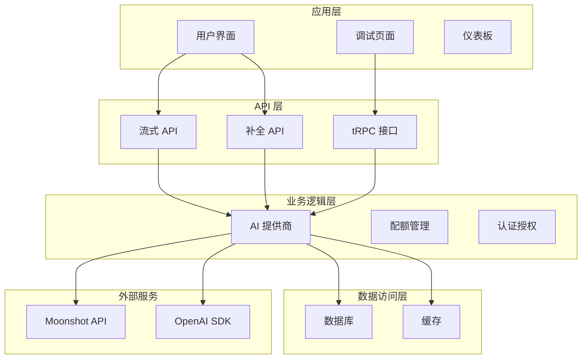
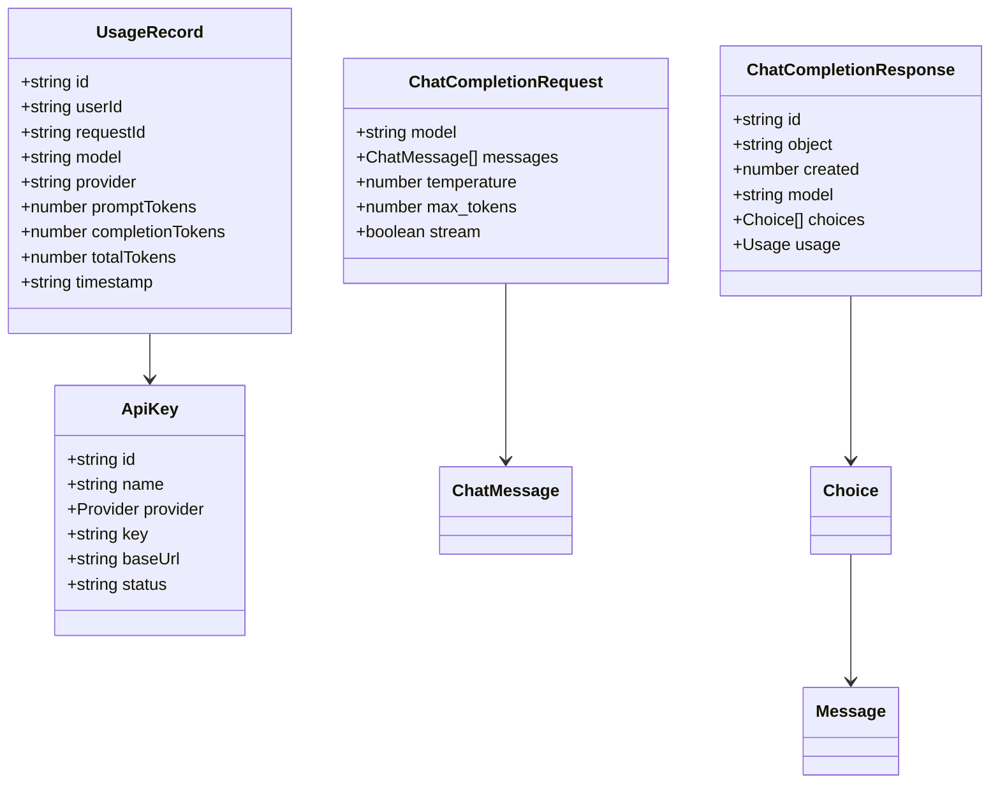
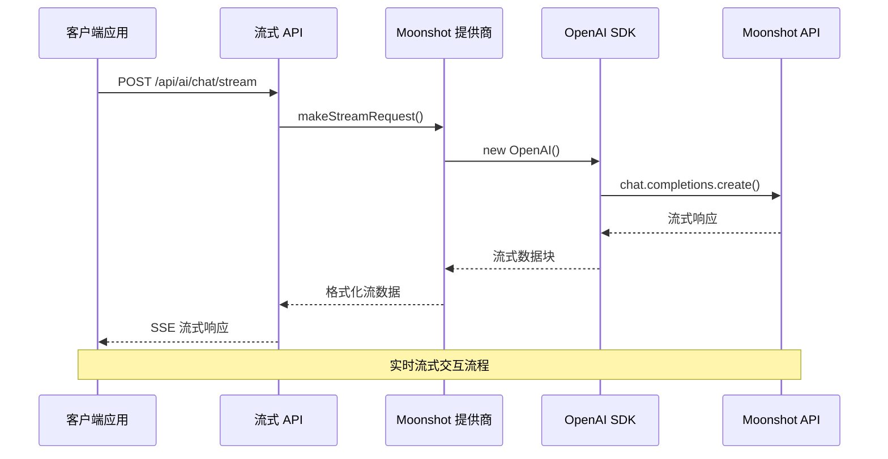
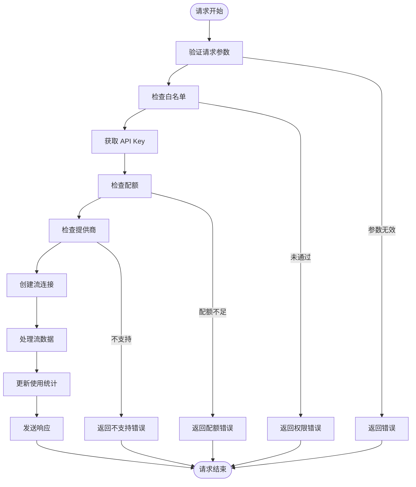
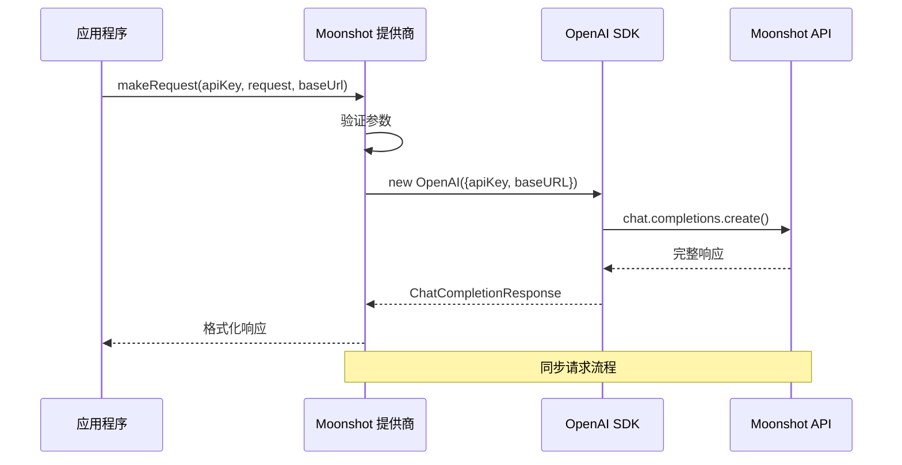
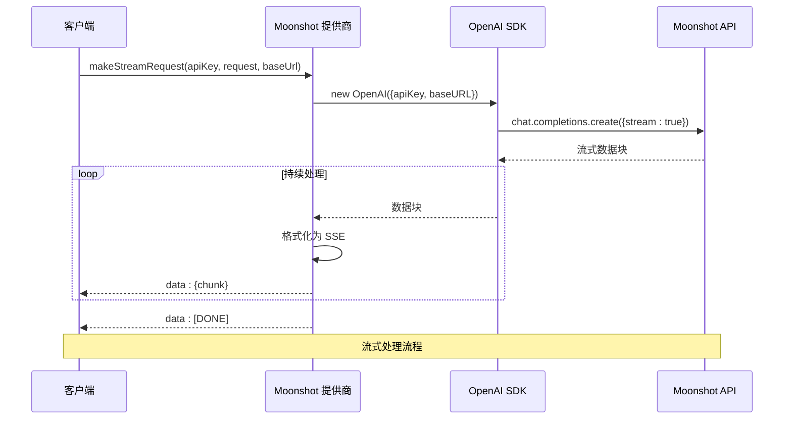
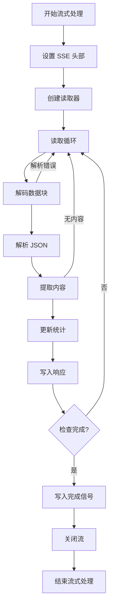
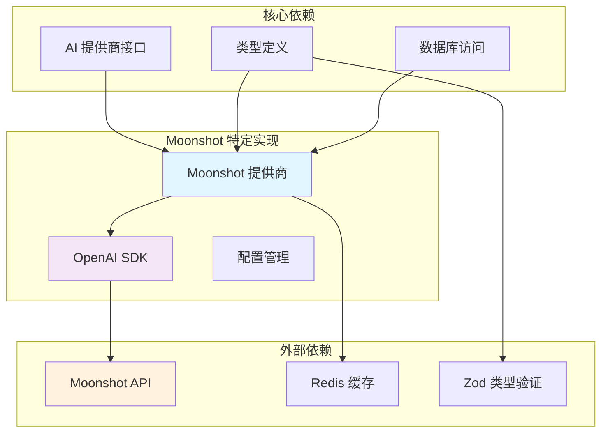
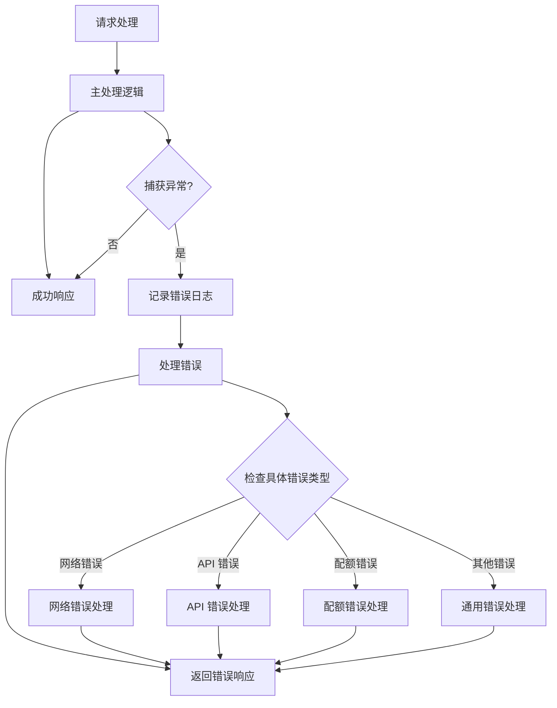

# Moonshot 供应商集成

<cite>
**本文档引用的文件**
- [src/lib/ai-providers.ts](file://src/lib/ai-providers.ts)
- [src/lib/types.ts](file://src/lib/types.ts)
- [src/server/api/routers/apiKey.ts](file://src/server/api/routers/apiKey.ts)
- [src/types/api-key.ts](file://src/types/api-key.ts)
- [src/pages/api/ai/chat/stream.ts](file://src/pages/api/ai/chat/stream.ts)
- [src/app/(dashboard)/debug/page.tsx](file://src/app/(dashboard)/debug/page.tsx)
- [drizzle/0002_swift_sleeper.sql](file://drizzle/0002_swift_sleeper.sql)
</cite>

## 目录
1. [简介](#简介)
2. [项目结构](#项目结构)
3. [核心组件](#核心组件)
4. [架构概览](#架构概览)
5. [详细组件分析](#详细组件分析)
6. [依赖关系分析](#依赖关系分析)
7. [性能考虑](#性能考虑)
8. [故障排除指南](#故障排除指南)
9. [结论](#结论)
10. [附录](#附录)

## 简介

Moonshot 供应商集成是 AIGate 项目中的一个重要组成部分，它实现了对 Moonshot AI 服务的完整支持。Moonshot 是一款基于 Moonshot V1 架构的大语言模型服务，提供了多种容量规格的模型变体，包括 moonshot-v1-8k、moonshot-v1-32k 和 moonshot-v1-128k。

本集成方案采用 OpenAI 兼容 API 的设计模式，通过 SDK 重用和参数适配机制，实现了与 Moonshot 服务的无缝对接。该实现不仅支持同步请求，还提供了完整的流式处理能力，确保了实时交互体验。

## 项目结构

AIGate 项目采用模块化的架构设计，Moonshot 供应商集成为其中的核心功能模块之一。项目的主要目录结构如下：



**图表来源**
- [src/lib/ai-providers.ts](file://src/lib/ai-providers.ts#L543-L613)
- [src/pages/api/ai/chat/stream.ts](file://src/pages/api/ai/chat/stream.ts#L1-L167)

**章节来源**
- [src/lib/ai-providers.ts](file://src/lib/ai-providers.ts#L1-L759)
- [src/pages/api/ai/chat/stream.ts](file://src/pages/api/ai/chat/stream.ts#L1-L167)

## 核心组件

### Moonshot 提供商实现

Moonshot 供应商通过 `moonshotProvider` 对象实现，该对象遵循统一的 AIProvider 接口规范，提供了完整的 API 调用和响应处理能力。

#### 主要特性

1. **OpenAI 兼容性**: 使用 OpenAI SDK 进行 API 调用，确保与 OpenAI 生态系统的兼容性
2. **多模型支持**: 支持 moonshot-v1-8k、moonshot-v1-32k、moonshot-v1-128k 三种容量规格
3. **流式处理**: 完整支持流式响应处理，提供实时交互体验
4. **参数适配**: 自动处理模型特定的参数映射和适配

#### 关键实现细节

Moonshot 提供商的核心实现位于 `src/lib/ai-providers.ts` 文件中，包含以下关键部分：

- **基础配置**: 设置默认的 Moonshot API 基础 URL 为 `https://api.moonshot.cn/v1`
- **模型列表**: 定义支持的模型变体集合
- **请求处理**: 实现同步和异步两种请求模式
- **流式处理**: 提供完整的 SSE 流式响应支持

**章节来源**
- [src/lib/ai-providers.ts](file://src/lib/ai-providers.ts#L543-L613)

### API 类型定义

系统使用 TypeScript 的 Zod 库进行严格的类型验证，确保 API 调用的安全性和可靠性。

#### 核心类型结构



**图表来源**
- [src/lib/types.ts](file://src/lib/types.ts#L47-L118)
- [src/types/api-key.ts](file://src/types/api-key.ts#L1-L19)

**章节来源**
- [src/lib/types.ts](file://src/lib/types.ts#L1-L118)
- [src/types/api-key.ts](file://src/types/api-key.ts#L1-L19)

## 架构概览

### 整体架构设计

AIGate 项目的 Moonshot 集成采用了分层架构设计，确保了系统的可扩展性和维护性。



**图表来源**
- [src/pages/api/ai/chat/stream.ts](file://src/pages/api/ai/chat/stream.ts#L88-L129)
- [src/lib/ai-providers.ts](file://src/lib/ai-providers.ts#L573-L608)

### 数据流处理

系统实现了完整的数据流处理管道，从请求接收到底层 API 调用的每个环节都有详细的处理逻辑。



**图表来源**
- [src/pages/api/ai/chat/stream.ts](file://src/pages/api/ai/chat/stream.ts#L14-L76)

**章节来源**
- [src/pages/api/ai/chat/stream.ts](file://src/pages/api/ai/chat/stream.ts#L1-L167)

## 详细组件分析

### Moonshot 提供商实现详解

#### 同步请求处理

Moonshot 提供商的同步请求处理通过 `makeRequest` 方法实现，该方法负责处理非流式的 API 调用。



**图表来源**
- [src/lib/ai-providers.ts](file://src/lib/ai-providers.ts#L546-L572)

#### 流式请求处理

流式请求处理通过 `makeStreamRequest` 方法实现，支持实时的数据流传输。



**图表来源**
- [src/lib/ai-providers.ts](file://src/lib/ai-providers.ts#L573-L608)

**章节来源**
- [src/lib/ai-providers.ts](file://src/lib/ai-providers.ts#L543-L613)

### API 密钥管理系统

#### 数据库结构设计

Moonshot 集成支持自定义基础 URL 配置，这通过数据库迁移实现：

```sql
-- 添加 base_url 列到 api_keys 表
ALTER TABLE "api_keys" ADD COLUMN "base_url" text;
```

该设计允许用户为 Moonshot API 配置自定义的基础 URL，支持代理服务或私有部署场景。

#### API 密钥存储和检索

API 密钥管理系统提供了完整的 CRUD 操作，包括：

- **创建**: 支持自定义基础 URL 和状态管理
- **更新**: 动态更新 API Key 配置
- **删除**: 完全移除 API Key
- **状态切换**: 启用/禁用 API Key
- **测试**: 验证 API Key 有效性

**章节来源**
- [drizzle/0002_swift_sleeper.sql](file://drizzle/0002_swift_sleeper.sql#L1-L1)
- [src/server/api/routers/apiKey.ts](file://src/server/api/routers/apiKey.ts#L146-L285)

### 流式处理机制

#### SSE 协议实现

系统实现了完整的 Server-Sent Events (SSE) 协议，确保流式数据的可靠传输。



**图表来源**
- [src/pages/api/ai/chat/stream.ts](file://src/pages/api/ai/chat/stream.ts#L96-L123)

#### Token 统计和配额管理

系统实现了智能的 Token 统计机制，能够准确计算用户的实际使用量。

**章节来源**
- [src/pages/api/ai/chat/stream.ts](file://src/pages/api/ai/chat/stream.ts#L88-L153)

## 依赖关系分析

### 组件耦合度分析

Moonshot 集成展现了良好的模块化设计，各组件之间的耦合度保持在合理范围内。



**图表来源**
- [src/lib/ai-providers.ts](file://src/lib/ai-providers.ts#L13-L27)
- [src/lib/ai-providers.ts](file://src/lib/ai-providers.ts#L543-L613)

### 错误处理策略

系统实现了多层次的错误处理机制，确保在各种异常情况下都能提供稳定的用户体验。



**图表来源**
- [src/pages/api/ai/chat/stream.ts](file://src/pages/api/ai/chat/stream.ts#L154-L158)

**章节来源**
- [src/lib/ai-providers.ts](file://src/lib/ai-providers.ts#L568-L571)
- [src/pages/api/ai/chat/stream.ts](file://src/pages/api/ai/chat/stream.ts#L154-L165)

## 性能考虑

### 缓存策略

系统采用了多级缓存策略来提升性能：

1. **Redis 缓存**: API Key 缓存，过期时间为 1 小时
2. **内存缓存**: 最近使用的模型配置缓存
3. **浏览器缓存**: 前端组件的状态持久化

### 连接池管理

OpenAI SDK 自动管理连接池，但系统也提供了手动配置选项：

- **最大连接数**: 可配置的并发连接限制
- **超时设置**: 网络请求超时时间控制
- **重试机制**: 自动重试失败的请求

### 监控和指标收集

系统实现了全面的监控指标收集：

- **请求延迟**: 每个 API 调用的响应时间
- **错误率**: 各类错误的发生频率
- **Token 使用量**: 用户的实际使用统计
- **配额使用情况**: 配额系统的使用状态

## 故障排除指南

### 常见问题诊断

#### API Key 相关问题

1. **Key 格式错误**: 确保 API Key 符合 Moonshot 的格式要求
2. **权限不足**: 检查 API Key 是否具有足够的权限
3. **过期问题**: 验证 API Key 是否仍在有效期内

#### 网络连接问题

1. **代理配置**: 检查网络代理设置是否正确
2. **防火墙规则**: 确认防火墙是否允许访问 Moonshot API
3. **DNS 解析**: 验证域名解析是否正常

#### 流式处理问题

1. **SSE 支持**: 确认客户端浏览器支持 SSE 协议
2. **缓冲区问题**: 检查服务器端的输出缓冲区配置
3. **超时设置**: 调整适当的超时时间设置

**章节来源**
- [src/server/api/routers/apiKey.ts](file://src/server/api/routers/apiKey.ts#L337-L407)

### 调试工具使用

系统提供了完善的调试工具，帮助开发者快速定位和解决问题：

1. **内置调试页面**: 提供实时的 API 调试环境
2. **日志记录**: 详细的错误日志和请求追踪
3. **性能监控**: 实时的性能指标监控面板

**章节来源**
- [src/app/(dashboard)/debug/page.tsx](file://src/app/(dashboard)/debug/page.tsx#L1-L366)

## 结论

Moonshot 供应商集成在 AIGate 项目中展现了优秀的架构设计和实现质量。通过采用 OpenAI 兼容 API 的设计模式，系统成功实现了与 Moonshot 服务的无缝集成，同时保持了高度的可扩展性和维护性。

### 主要优势

1. **标准化接口**: 统一的 AIProvider 接口设计，便于扩展新的提供商
2. **完整的功能支持**: 同步和异步两种请求模式，满足不同使用场景
3. **强大的流式处理**: 完整的 SSE 流式响应支持，提供实时交互体验
4. **灵活的配置管理**: 支持自定义基础 URL 和多种配置选项
5. **完善的错误处理**: 多层次的错误处理机制，确保系统稳定性

### 技术亮点

- **模块化设计**: 清晰的组件分离和职责划分
- **类型安全**: 使用 TypeScript 和 Zod 进行严格的类型验证
- **性能优化**: 多级缓存和连接池管理
- **监控完善**: 全面的指标收集和日志记录

## 附录

### 集成配置指南

#### 基础配置步骤

1. **API Key 注册**: 在 Moonshot 平台注册并获取 API Key
2. **系统配置**: 在 AIGate 中添加 Moonshot API Key
3. **模型选择**: 选择合适的模型变体（8k/32k/128k）
4. **参数调整**: 根据需求调整温度、最大令牌数等参数

#### 高级配置选项

- **自定义基础 URL**: 支持代理服务和私有部署
- **网络代理设置**: 配置企业网络环境下的代理访问
- **超时参数**: 调整请求超时时间以适应不同网络环境

### 使用示例

#### 基本调用示例

```typescript
// 同步请求示例
const response = await aiProvider.makeRequest(
  apiKey,
  {
    model: 'moonshot-v1-8k',
    messages: [
      { role: 'user', content: '你好' }
    ]
  }
);

// 流式请求示例
const stream = await aiProvider.makeStreamRequest(
  apiKey,
  {
    model: 'moonshot-v1-32k',
    messages: [
      { role: 'user', content: '请详细解释人工智能' }
    ]
  }
);
```

#### 错误处理最佳实践

```typescript
try {
  const response = await moonshotProvider.makeRequest(apiKey, request);
  return response;
} catch (error) {
  if (error.code === 'invalid_api_key') {
    // 处理无效 API Key
  } else if (error.code === 'rate_limit_exceeded') {
    // 处理速率限制
  } else {
    // 处理其他错误
  }
}
```

### 性能优化建议

1. **连接复用**: 合理配置连接池大小，避免频繁创建连接
2. **批量处理**: 对于大量请求，考虑使用批量处理模式
3. **缓存策略**: 合理使用缓存机制，减少重复请求
4. **监控告警**: 设置适当的监控和告警机制