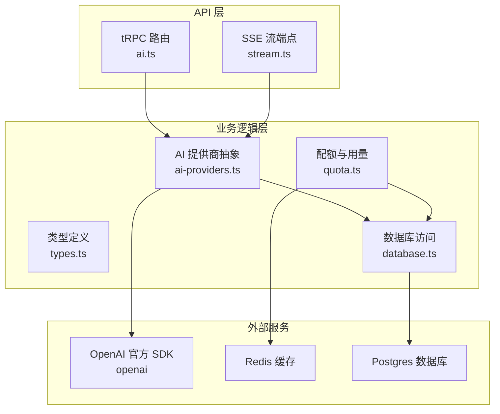
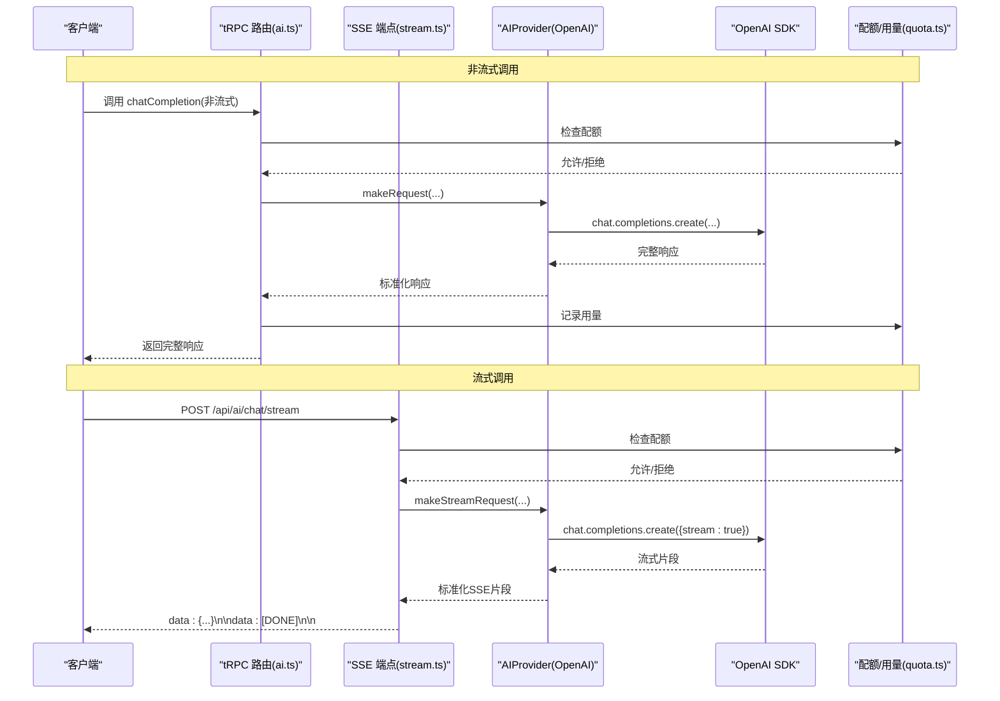
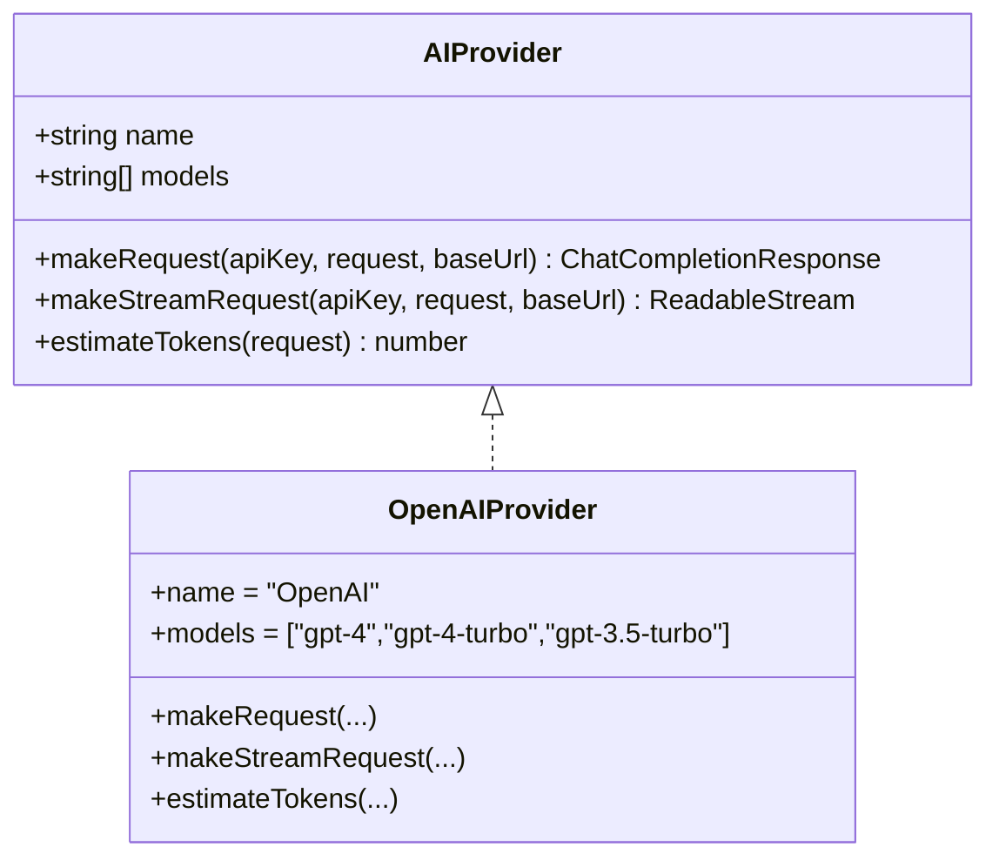
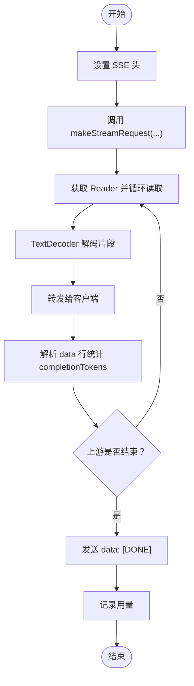
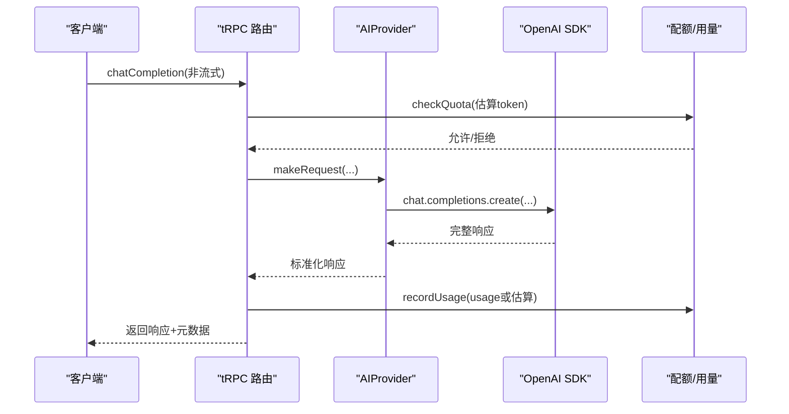
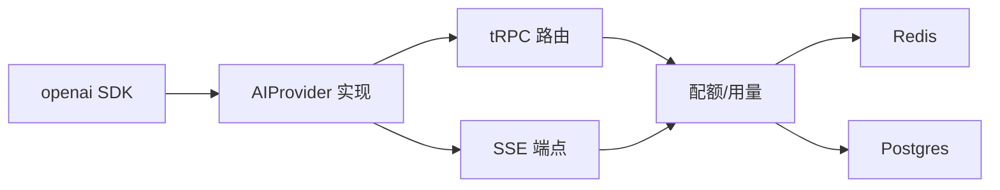

# OpenAI 供应商集成

<cite>
**本文引用的文件**
- [ai-providers.ts](file://src/lib/ai-providers.ts)
- [types.ts](file://src/lib/types.ts)
- [stream.ts](file://src/pages/api/ai/chat/stream.ts)
- [ai.ts](file://src/server/api/routers/ai.ts)
- [quota.ts](file://src/lib/quota.ts)
- [database.ts](file://src/lib/database.ts)
- [package.json](file://package.json)
</cite>

## 目录
1. [简介](#简介)
2. [项目结构](#项目结构)
3. [核心组件](#核心组件)
4. [架构总览](#架构总览)
5. [详细组件分析](#详细组件分析)
6. [依赖关系分析](#依赖关系分析)
7. [性能考量](#性能考量)
8. [故障排查指南](#故障排查指南)
9. [结论](#结论)
10. [附录](#附录)

## 简介
本文件面向 OpenAI 供应商集成，系统化阐述以下内容：
- OpenAI Provider 的实现原理与封装方式
- 官方 SDK 集成、API 调用封装与错误处理机制
- 流式响应处理：ReadableStream 创建、SSE 数据转换与完成信号处理
- OpenAI 特有参数配置：模型选择、温度、最大令牌数与消息格式要求
- Token 估算算法及其在 OpenAI 上的应用与准确性分析
- 完整配置指南：API 密钥管理、基础 URL 自定义、代理设置
- 使用示例：调用不同模型与处理不同响应格式
- 性能优化建议、错误处理策略与监控指标收集

## 项目结构
OpenAI 集成位于 lib 层，通过统一的 AIProvider 接口抽象多家模型厂商，OpenAI 作为其中一种实现。关键文件如下：
- 提供商与类型定义：src/lib/ai-providers.ts、src/lib/types.ts
- 流式端点：src/pages/api/ai/chat/stream.ts
- tRPC 路由与非流式调用：src/server/api/routers/ai.ts
- 配额与用量：src/lib/quota.ts、src/lib/database.ts
- 依赖声明：package.json

图表来源
- [ai.ts](file://src/server/api/routers/ai.ts#L85-L193)
- [stream.ts](file://src/pages/api/ai/chat/stream.ts#L9-L167)
- [ai-providers.ts](file://src/lib/ai-providers.ts#L34-L100)
- [quota.ts](file://src/lib/quota.ts#L74-L190)
- [database.ts](file://src/lib/database.ts#L19-L80)
- [package.json](file://package.json#L46-L46)

章节来源
- [ai-providers.ts](file://src/lib/ai-providers.ts#L1-L100)
- [types.ts](file://src/lib/types.ts#L47-L61)
- [stream.ts](file://src/pages/api/ai/chat/stream.ts#L1-L167)
- [ai.ts](file://src/server/api/routers/ai.ts#L85-L193)
- [quota.ts](file://src/lib/quota.ts#L74-L190)
- [database.ts](file://src/lib/database.ts#L19-L80)
- [package.json](file://package.json#L46-L46)

## 核心组件
- AIProvider 接口：统一定义 makeRequest、makeStreamRequest、estimateTokens 三个能力，并维护模型清单
- OpenAI Provider 实现：基于 openai 官方 SDK，支持同步与流式两种调用模式
- 流式端点：Next.js API Route，将上游流式响应转换为 SSE，透传至客户端
- tRPC 路由：非流式请求入口，负责鉴权、配额检查与用量记录
- 配额与用量：基于 Redis 的限流与统计，结合数据库持久化

章节来源
- [ai-providers.ts](file://src/lib/ai-providers.ts#L13-L27)
- [ai-providers.ts](file://src/lib/ai-providers.ts#L34-L100)
- [stream.ts](file://src/pages/api/ai/chat/stream.ts#L78-L128)
- [ai.ts](file://src/server/api/routers/ai.ts#L32-L83)
- [quota.ts](file://src/lib/quota.ts#L74-L190)

## 架构总览
OpenAI 集成采用“统一抽象 + 多家适配”的设计。客户端通过 tRPC 或 SSE 端点发起请求，经由鉴权、配额检查后，由 AIProvider 抽象选择具体实现（OpenAI），再通过 openai SDK 调用上游 API。流式场景下，服务端将上游流转换为 SSE 格式并持续推送，直至收到完成信号。

图表来源
- [ai.ts](file://src/server/api/routers/ai.ts#L95-L193)
- [stream.ts](file://src/pages/api/ai/chat/stream.ts#L88-L158)
- [ai-providers.ts](file://src/lib/ai-providers.ts#L58-L95)
- [quota.ts](file://src/lib/quota.ts#L74-L190)

## 详细组件分析

### OpenAI Provider 实现与封装
- SDK 集成：动态导入 openai，构造 OpenAI 客户端，支持自定义 baseURL
- 同步请求：调用 chat.completions.create，stream=false，返回完整响应
- 流式请求：调用 chat.completions.create，stream=true，将上游流逐片编码为 SSE 片段并输出
- 完成信号：当上游 chunk 的 finish_reason 存在时，追加 data: [DONE] 完成信号
- Token 估算：对消息内容拼接后按约 4 字符≈1 token 的规则估算

图表来源
- [ai-providers.ts](file://src/lib/ai-providers.ts#L13-L27)
- [ai-providers.ts](file://src/lib/ai-providers.ts#L34-L100)

章节来源
- [ai-providers.ts](file://src/lib/ai-providers.ts#L34-L100)

### 流式响应处理（SSE）
- SSE 头设置：Content-Type: text/event-stream；禁用缓存与缓冲
- 流读取：通过 sourceStream.getReader() 逐块读取上游流
- 数据解码与转发：TextDecoder 解码二进制片段，原样写回客户端
- Token 统计：解析 data 行中的 choices[0].delta.content，按长度估算 token 数（最小 1）
- 完成信号：上游流结束后发送 data: [DONE]，并记录用量

图表来源
- [stream.ts](file://src/pages/api/ai/chat/stream.ts#L78-L158)

章节来源
- [stream.ts](file://src/pages/api/ai/chat/stream.ts#L78-L158)

### 非流式请求处理（tRPC）
- 输入校验：使用 Zod Schema 校验请求体
- 白名单校验：根据 userId 匹配规则进行准入控制
- 配额检查：估算请求 token 后检查日限额与 RPM
- 调用上游：调用 provider.makeRequest 返回完整响应
- 用量记录：根据实际 usage 或估算值记录用量

图表来源
- [ai.ts](file://src/server/api/routers/ai.ts#L95-L193)
- [ai-providers.ts](file://src/lib/ai-providers.ts#L37-L57)
- [quota.ts](file://src/lib/quota.ts#L74-L190)

章节来源
- [ai.ts](file://src/server/api/routers/ai.ts#L95-L193)

### 错误处理机制
- tRPC 层：统一抛出 TRPCError，便于前端捕获与展示
- SSE 层：捕获上游异常，发送包含错误的 data 帧并结束连接
- 配额层：检查失败时返回明确原因（如“配额已用完”）
- Provider 层：SDK 异常向上抛出，由上层统一处理

章节来源
- [ai.ts](file://src/server/api/routers/ai.ts#L180-L193)
- [stream.ts](file://src/pages/api/ai/chat/stream.ts#L154-L158)
- [quota.ts](file://src/lib/quota.ts#L182-L189)

### OpenAI 特有参数配置
- 模型选择：通过 request.model 指定，OpenAI Provider 支持 gpt-4、gpt-4-turbo、gpt-3.5-turbo
- 温度：request.temperature 控制随机性，默认由上游 SDK 处理
- 最大令牌数：request.max_tokens 控制生成上限
- 消息格式：messages 数组元素需包含 role（system/user/assistant）与 content 字符串
- 基础 URL：可通过 API Key 的 baseUrl 字段自定义（OpenAI Provider 默认 https://api.openai.com/v1）

章节来源
- [ai-providers.ts](file://src/lib/ai-providers.ts#L48-L54)
- [ai-providers.ts](file://src/lib/ai-providers.ts#L69-L75)
- [types.ts](file://src/lib/types.ts#L48-L61)
- [types.ts](file://src/lib/types.ts#L19-L31)

### Token 估算算法与准确性分析
- 算法：对所有消息内容拼接后按约 4 字符≈1 token 的规则估算
- 应用：用于配额预估与 SSE 流中 completionTokens 的近似统计
- 准确性：该规则为启发式估算，适用于快速配额检查与成本预估；实际消耗以上游 usage 为准（非流式场景可直接使用）

章节来源
- [ai-providers.ts](file://src/lib/ai-providers.ts#L29-L32)
- [ai-providers.ts](file://src/lib/ai-providers.ts#L96-L99)
- [stream.ts](file://src/pages/api/ai/chat/stream.ts#L108-L122)

### 配置指南
- API 密钥管理
  - 在数据库中新增 API Key，字段包含 provider、key、baseUrl、status
  - 支持多条同厂商密钥，按 ACTIVE 状态轮询使用
- 基础 URL 自定义
  - OpenAI Provider 默认使用 https://api.openai.com/v1
  - 可通过 API Key 的 baseUrl 字段覆盖（如代理或镜像地址）
- 代理设置
  - 通过 baseURL 间接实现代理：将 baseURL 指向代理服务
  - 注意：代理需兼容 OpenAI 兼容 API 协议
- 配额策略
  - 支持按 token 与按请求次数两种模式
  - 支持日限额、月限额与 RPM（每分钟请求）限制
  - Redis 缓存策略与过期时间已在实现中考虑

章节来源
- [types.ts](file://src/lib/types.ts#L19-L31)
- [ai-providers.ts](file://src/lib/ai-providers.ts#L43-L45)
- [ai-providers.ts](file://src/lib/ai-providers.ts#L64-L66)
- [quota.ts](file://src/lib/quota.ts#L5-L12)
- [quota.ts](file://src/lib/quota.ts#L74-L190)

### 使用示例（路径指引）
- 非流式调用（tRPC）
  - 路径：src/server/api/routers/ai.ts
  - 关键流程：输入校验 → 白名单 → 配额 → 调用 makeRequest → 记录用量
- 流式调用（SSE）
  - 路径：src/pages/api/ai/chat/stream.ts
  - 关键流程：校验 → 配额 → makeStreamRequest → SSE 转换 → 完成信号 → 用量记录
- Token 估算
  - 路径：src/lib/ai-providers.ts
  - 关键流程：拼接消息内容 → 估算 token

章节来源
- [ai.ts](file://src/server/api/routers/ai.ts#L95-L193)
- [stream.ts](file://src/pages/api/ai/chat/stream.ts#L88-L158)
- [ai-providers.ts](file://src/lib/ai-providers.ts#L29-L32)

## 依赖关系分析
- OpenAI 官方 SDK：通过动态导入 openai，支持 baseURL 自定义
- tRPC：统一的 API 路由层，负责输入校验与错误包装
- Next.js API Routes：SSE 端点，负责流式响应转换
- Redis：配额与用量统计的高性能缓存
- Postgres：持久化存储 API Key、用量记录与策略

图表来源
- [package.json](file://package.json#L46-L46)
- [ai-providers.ts](file://src/lib/ai-providers.ts#L42-L67)
- [ai.ts](file://src/server/api/routers/ai.ts#L95-L193)
- [stream.ts](file://src/pages/api/ai/chat/stream.ts#L88-L158)
- [quota.ts](file://src/lib/quota.ts#L74-L190)
- [database.ts](file://src/lib/database.ts#L19-L80)

章节来源
- [package.json](file://package.json#L46-L46)
- [ai-providers.ts](file://src/lib/ai-providers.ts#L42-L67)

## 性能考量
- 流式传输：SSE 无缓冲，实时转发上游片段，降低首字节延迟
- 缓存策略：API Key 与配额策略在 Redis 中缓存，减少数据库压力
- Token 估算：仅用于预估与统计，避免重复计算
- 连接与超时：SSE 端点设置 X-Accel-Buffering=no，确保实时性

[本节为通用性能建议，无需特定文件引用]

## 故障排查指南
- API Key 无效或禁用
  - 现象：返回“API Key 不存在或已禁用”
  - 排查：确认 API Key 状态为 ACTIVE，provider 与 key 正确
- 不支持的提供商
  - 现象：返回“不支持的提供商”
  - 排查：确认 API Key 的 provider 字段正确
- 配额不足
  - 现象：返回“配额已用完”或 429
  - 排查：检查日限额、RPM 与 limitType
- 流式端点不可用
  - 现象：返回“Provider 暂不支持 stream 模式”
  - 排查：确认目标 Provider 支持 makeStreamRequest
- SSE 连接中断
  - 现象：客户端未收到 [DONE] 或中途断开
  - 排查：检查上游 SDK 返回与完成信号处理

章节来源
- [stream.ts](file://src/pages/api/ai/chat/stream.ts#L40-L76)
- [ai.ts](file://src/server/api/routers/ai.ts#L120-L135)
- [quota.ts](file://src/lib/quota.ts#L114-L157)

## 结论
OpenAI 供应商集成通过统一的 AIProvider 抽象与 openai 官方 SDK 深度整合，实现了稳定、可扩展且具备良好可观测性的聊天补全能力。其流式处理链路清晰，配额与用量体系完善，适合在生产环境中大规模部署与演进。

[本节为总结性内容，无需特定文件引用]

## 附录
- 消息格式要求
  - messages 数组元素需包含 role（system/user/assistant）与 content 字符串
- 模型清单
  - OpenAI Provider 支持 gpt-4、gpt-4-turbo、gpt-3.5-turbo
- 配额策略字段
  - dailyTokenLimit、monthlyTokenLimit、dailyRequestLimit、rpmLimit、limitType

章节来源
- [types.ts](file://src/lib/types.ts#L48-L61)
- [ai-providers.ts](file://src/lib/ai-providers.ts#L36-L36)
- [quota.ts](file://src/lib/quota.ts#L5-L12)