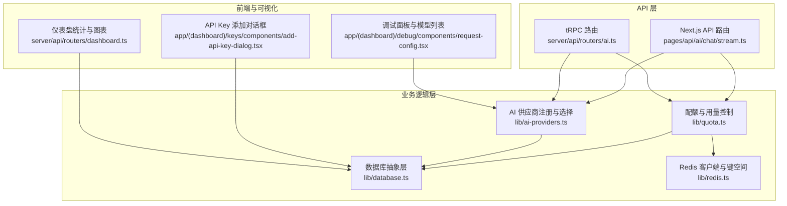
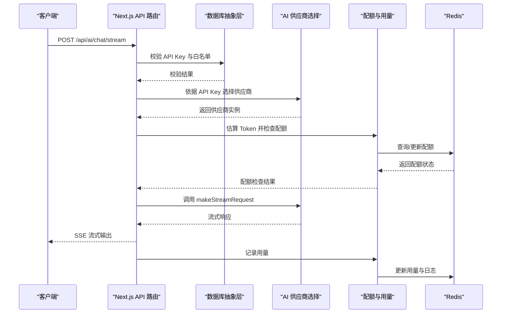
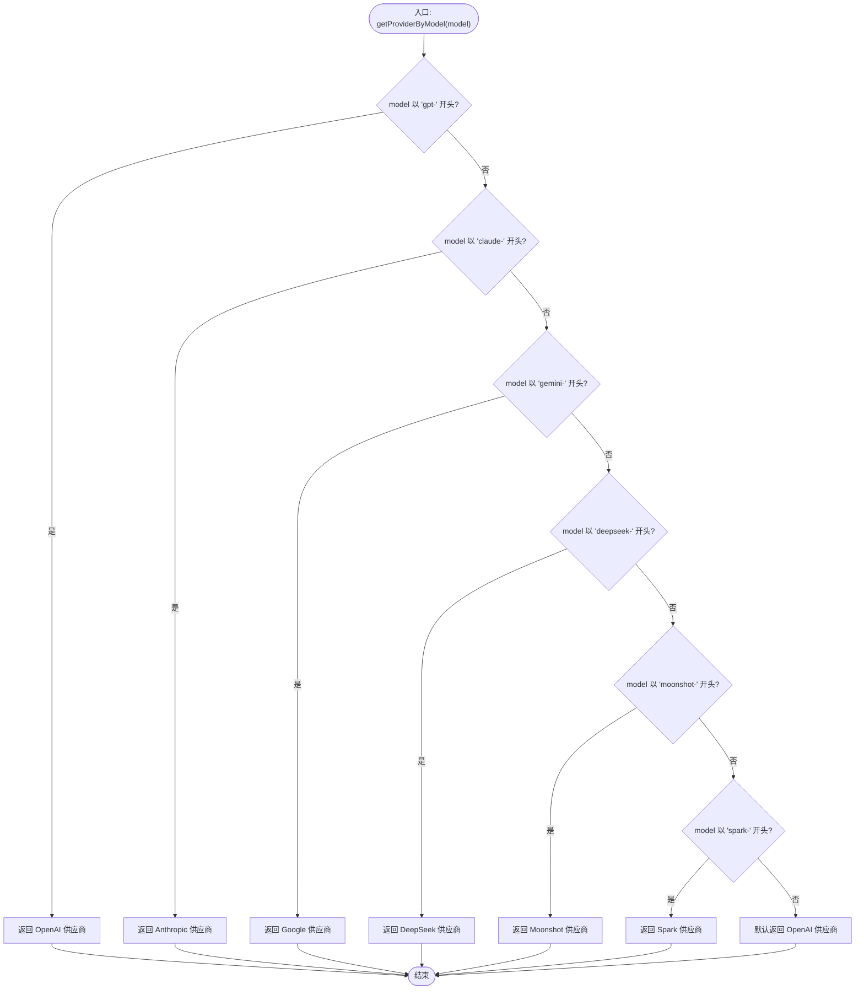
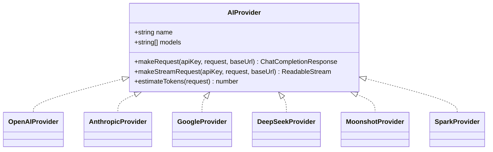
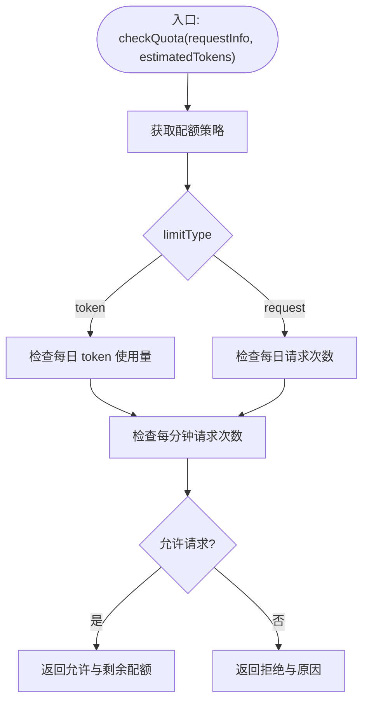
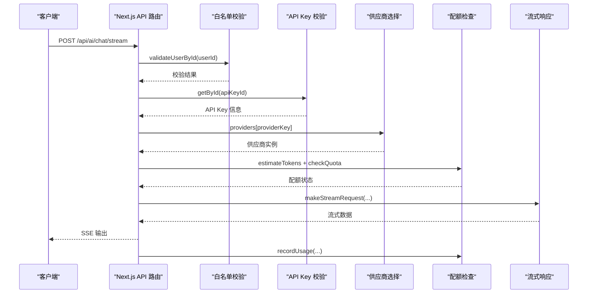
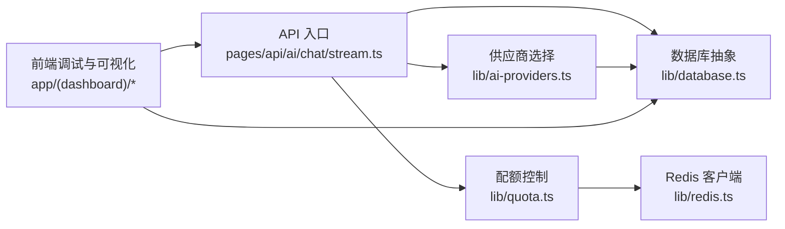

# 供应商选择与路由机制

<cite>
**本文引用的文件**
- [ai-providers.ts](file://src/lib/ai-providers.ts)
- [stream.ts](file://src/pages/api/ai/chat/stream.ts)
- [types.ts](file://src/lib/types.ts)
- [quota.ts](file://src/lib/quota.ts)
- [database.ts](file://src/lib/database.ts)
- [redis.ts](file://src/lib/redis.ts)
- [request-config.tsx](file://src/app/(dashboard)/debug/components/request-config.tsx)
- [add-api-key-dialog.tsx](file://src/app/(dashboard)/keys/components/add-api-key-dialog.tsx)
- [dashboard.ts](file://src/server/api/routers/dashboard.ts)
- [docker-compose.yml](file://docker-compose.yml)
</cite>

## 目录
1. [简介](#简介)
2. [项目结构](#项目结构)
3. [核心组件](#核心组件)
4. [架构总览](#架构总览)
5. [详细组件分析](#详细组件分析)
6. [依赖关系分析](#依赖关系分析)
7. [性能考量](#性能考量)
8. [故障排查指南](#故障排查指南)
9. [结论](#结论)
10. [附录](#附录)

## 简介
本技术文档围绕“供应商选择与路由机制”展开，重点解释以下内容：
- getProviderByModel 函数的实现原理：模型前缀匹配算法、路由决策逻辑与默认回退策略
- 供应商注册与管理机制：providers 字典结构、动态查找与扩展接口
- 模型到供应商的映射规则：前缀匹配表、优先级排序与冲突处理
- 负载均衡与故障转移策略：健康检查、失败重试与自动切换机制
- 扩展指南：新供应商注册流程、模型映射配置与路由规则定制
- 使用示例：如何实现智能供应商选择与动态路由
- 性能优化建议、监控指标与故障诊断方法

## 项目结构
该系统采用模块化设计，核心路由与供应商选择位于 lib 层，API 入口位于 pages/api 与 server/api，数据访问通过 database.ts 抽象层，配额与用量通过 quota.ts 与 redis.ts 管理。

图示来源
- [stream.ts](file://src/pages/api/ai/chat/stream.ts#L1-L167)
- [ai-providers.ts](file://src/lib/ai-providers.ts#L687-L707)
- [quota.ts](file://src/lib/quota.ts#L1-L334)
- [database.ts](file://src/lib/database.ts#L1-L200)
- [redis.ts](file://src/lib/redis.ts#L1-L49)
- [request-config.tsx](file://src/app/(dashboard)/debug/components/request-config.tsx#L179-L240)
- [add-api-key-dialog.tsx](file://src/app/(dashboard)/keys/components/add-api-key-dialog.tsx#L176-L196)
- [dashboard.ts](file://src/server/api/routers/dashboard.ts#L1-L141)

章节来源
- [stream.ts](file://src/pages/api/ai/chat/stream.ts#L1-L167)
- [ai-providers.ts](file://src/lib/ai-providers.ts#L687-L707)
- [quota.ts](file://src/lib/quota.ts#L1-L334)
- [database.ts](file://src/lib/database.ts#L1-L200)
- [redis.ts](file://src/lib/redis.ts#L1-L49)
- [request-config.tsx](file://src/app/(dashboard)/debug/components/request-config.tsx#L179-L240)
- [add-api-key-dialog.tsx](file://src/app/(dashboard)/keys/components/add-api-key-dialog.tsx#L176-L196)
- [dashboard.ts](file://src/server/api/routers/dashboard.ts#L1-L141)

## 核心组件
- AI 供应商注册与选择：提供 AIProvider 接口、各供应商实现与 getProviderByModel 路由函数
- 配额与用量控制：基于 Redis 的限流与用量统计，支持按 token 数与请求次数两种模式
- 数据库抽象层：统一 API Key、配额策略、用量记录与白名单规则的 CRUD
- API 入口：Next.js API 路由与 tRPC 路由，负责鉴权、白名单校验、配额检查与流式输出
- 前端调试与可视化：调试面板展示模型列表，仪表盘统计模型使用分布

章节来源
- [ai-providers.ts](file://src/lib/ai-providers.ts#L12-L759)
- [quota.ts](file://src/lib/quota.ts#L1-L334)
- [database.ts](file://src/lib/database.ts#L1-L200)
- [stream.ts](file://src/pages/api/ai/chat/stream.ts#L1-L167)

## 架构总览
系统通过 API 入口接收请求，进行白名单与配额校验后，依据 API Key 关联的供应商与模型前缀，选择对应供应商实现，并通过流式接口将响应返回给客户端。配额与用量通过 Redis 快速计算，数据库持久化存储。

图示来源
- [stream.ts](file://src/pages/api/ai/chat/stream.ts#L36-L167)
- [ai-providers.ts](file://src/lib/ai-providers.ts#L697-L707)
- [quota.ts](file://src/lib/quota.ts#L74-L190)
- [redis.ts](file://src/lib/redis.ts#L19-L37)

## 详细组件分析

### getProviderByModel 函数与模型前缀匹配
- 功能定位：根据传入模型名称的前缀，返回对应的 AIProvider 实例；若无匹配，默认回退到 OpenAI
- 匹配规则：按顺序判断模型前缀，依次覆盖 gpt-、claude-、gemini-、deepseek-、moonshot-、spark-
- 冲突处理：由于前缀判断按顺序执行，前缀越具体优先级越高；若均不匹配，则默认返回 OpenAI
- 扩展点：新增供应商只需在 providers 字典中注册，并在 getProviderByModel 中增加前缀判断

图示来源
- [ai-providers.ts](file://src/lib/ai-providers.ts#L697-L707)

章节来源
- [ai-providers.ts](file://src/lib/ai-providers.ts#L697-L707)

### 供应商注册与管理机制
- providers 字典：集中管理所有供应商实例，键名为小写供应商名，值为 AIProvider 实现
- 动态查找：API 入口通过 API Key 的 provider 字段映射到 providers 字典
- 扩展接口：新增供应商需实现 AIProvider 接口（name、models、makeRequest、makeStreamRequest、estimateTokens），并在 providers 中注册

图示来源
- [ai-providers.ts](file://src/lib/ai-providers.ts#L13-L27)
- [ai-providers.ts](file://src/lib/ai-providers.ts#L34-L100)
- [ai-providers.ts](file://src/lib/ai-providers.ts#L102-L167)
- [ai-providers.ts](file://src/lib/ai-providers.ts#L284-L357)
- [ai-providers.ts](file://src/lib/ai-providers.ts#L471-L541)
- [ai-providers.ts](file://src/lib/ai-providers.ts#L543-L613)
- [ai-providers.ts](file://src/lib/ai-providers.ts#L615-L685)

章节来源
- [ai-providers.ts](file://src/lib/ai-providers.ts#L687-L695)
- [ai-providers.ts](file://src/lib/ai-providers.ts#L13-L27)

### 模型到供应商的映射规则
- 前缀匹配表：gpt- → OpenAI；claude- → Anthropic；gemini- → Google；deepseek- → DeepSeek；moonshot- → Moonshot；spark- → Spark
- 优先级排序：按前缀判断顺序，前缀越具体优先级越高
- 冲突处理：若多个前缀可能匹配，按顺序判断，仅首个匹配生效
- 默认回退：无匹配时默认返回 OpenAI

章节来源
- [ai-providers.ts](file://src/lib/ai-providers.ts#L697-L707)

### 负载均衡与故障转移策略
- 健康检查：通过 API Key 与白名单规则进行前置校验，避免无效请求进入下游
- 失败重试：当前实现未内置自动重试逻辑；可在上游网关或客户端实现指数退避重试
- 自动切换：当前实现未内置多 Key 轮询或故障切换；可通过扩展在 providers 中维护多个 API Key 并轮询选择

章节来源
- [stream.ts](file://src/pages/api/ai/chat/stream.ts#L26-L51)
- [database.ts](file://src/lib/database.ts#L29-L49)

### 配额与用量控制
- 限流模式：支持按 token 数与按请求次数两种模式，均支持每日与每分钟限制
- Redis 计数：使用 user_daily_quota、user_daily_requests、user_rpm 等键空间进行快速计数
- 用量记录：记录请求 ID、用户标识、模型、供应商、prompt/completion tokens、地区与客户端 IP

图示来源
- [quota.ts](file://src/lib/quota.ts#L74-L190)
- [redis.ts](file://src/lib/redis.ts#L19-L37)

章节来源
- [quota.ts](file://src/lib/quota.ts#L1-L334)
- [redis.ts](file://src/lib/redis.ts#L1-L49)

### API 入口与路由流程
- Next.js API 路由：接收请求，校验白名单与 API Key，估算 Token 并检查配额，选择供应商并发起流式请求，最后记录用量
- tRPC 路由：与 Next.js API 路由类似，但通过 tRPC 调用链路封装

图示来源
- [stream.ts](file://src/pages/api/ai/chat/stream.ts#L9-L167)
- [ai-providers.ts](file://src/lib/ai-providers.ts#L687-L707)
- [quota.ts](file://src/lib/quota.ts#L74-L190)

章节来源
- [stream.ts](file://src/pages/api/ai/chat/stream.ts#L1-L167)

### 前端调试与可视化
- 调试面板：展示所选 API Key 对应供应商支持的模型列表，便于选择与测试
- API Key 添加：下拉选择供应商，支持 OpenAI、Anthropic、Google、DeepSeek、Moonshot、Spark
- 仪表盘：统计模型使用分布，辅助分析路由效果与资源消耗

章节来源
- [request-config.tsx](file://src/app/(dashboard)/debug/components/request-config.tsx#L179-L240)
- [add-api-key-dialog.tsx](file://src/app/(dashboard)/keys/components/add-api-key-dialog.tsx#L176-L196)
- [dashboard.ts](file://src/server/api/routers/dashboard.ts#L279-L304)

## 依赖关系分析
- API 入口依赖：AI 供应商选择、配额控制、数据库与 Redis
- 供应商实现依赖：第三方 SDK 或原生 fetch，统一返回 OpenAI 兼容格式
- 配额控制依赖：Redis 键空间与数据库策略表
- 前端依赖：tRPC 与 Next.js 路由，用于调试与可视化

图示来源
- [stream.ts](file://src/pages/api/ai/chat/stream.ts#L1-L167)
- [ai-providers.ts](file://src/lib/ai-providers.ts#L687-L707)
- [quota.ts](file://src/lib/quota.ts#L1-L334)
- [database.ts](file://src/lib/database.ts#L1-L200)
- [redis.ts](file://src/lib/redis.ts#L1-L49)

章节来源
- [stream.ts](file://src/pages/api/ai/chat/stream.ts#L1-L167)
- [ai-providers.ts](file://src/lib/ai-providers.ts#L687-L707)
- [quota.ts](file://src/lib/quota.ts#L1-L334)
- [database.ts](file://src/lib/database.ts#L1-L200)
- [redis.ts](file://src/lib/redis.ts#L1-L49)

## 性能考量
- Redis 缓存：API Key 与配额策略缓存减少数据库压力；建议合理设置过期时间
- 流式输出：SSE 流式传输降低延迟，提升用户体验
- 估算 Token：简单估算减少额外调用开销，但可能与真实值存在偏差
- 并发与限流：每分钟请求次数限制防止突发流量冲击上游供应商

[本节为通用性能建议，不直接分析具体文件]

## 故障排查指南
- 供应商不可用：确认 API Key 是否有效且处于激活状态；检查供应商名称大小写与 providers 字典键一致
- 模型不支持：确认模型名称前缀是否符合匹配规则；若不在前缀表中，考虑扩展 getProviderByModel
- 配额不足：检查 Redis 中的 user_daily_quota、user_daily_requests、user_rpm 键值；核对策略配置
- 流式输出异常：检查 makeStreamRequest 实现与上游供应商 SSE 格式转换；关注网络与超时问题
- 健康检查失败：确认数据库与 Redis 服务可用；查看容器编排健康检查配置

章节来源
- [stream.ts](file://src/pages/api/ai/chat/stream.ts#L40-L51)
- [quota.ts](file://src/lib/quota.ts#L145-L175)
- [docker-compose.yml](file://docker-compose.yml#L36-L58)

## 结论
本系统通过明确的模型前缀匹配与供应商字典管理，实现了稳定、可扩展的智能路由机制。结合 Redis 的高效限流与数据库的持久化能力，能够满足多用户、多模型的并发场景。未来可在上游网关层引入自动重试与故障切换，在业务层扩展多 Key 轮询与更细粒度的健康检查，进一步提升系统的可靠性与弹性。

[本节为总结性内容，不直接分析具体文件]

## 附录

### 扩展指南：新增供应商
- 步骤
  1) 在 lib/ai-providers.ts 中新增 AIProvider 实现（name、models、makeRequest、makeStreamRequest、estimateTokens）
  2) 在 providers 字典中注册新供应商
  3) 在 getProviderByModel 中增加模型前缀判断
  4) 在前端调试面板与 API Key 添加界面中补充供应商选项
  5) 在数据库中创建对应的 API Key 记录并设为激活状态
- 示例路径
  - 新增供应商实现：参考现有供应商实现位置
  - 注册供应商：providers 字典注册
  - 前缀匹配：getProviderByModel 函数扩展
  - 前端支持：调试面板与 API Key 对话框

章节来源
- [ai-providers.ts](file://src/lib/ai-providers.ts#L687-L707)
- [ai-providers.ts](file://src/lib/ai-providers.ts#L687-L695)
- [request-config.tsx](file://src/app/(dashboard)/debug/components/request-config.tsx#L179-L240)
- [add-api-key-dialog.tsx](file://src/app/(dashboard)/keys/components/add-api-key-dialog.tsx#L176-L196)

### 使用示例：智能供应商选择与动态路由
- 场景：根据模型前缀自动路由到对应供应商
- 步骤
  1) 客户端发送请求，携带模型名称
  2) API 入口根据 API Key 获取供应商键
  3) 通过 getProviderByModel 选择供应商
  4) 供应商实现发起上游请求并返回流式响应
  5) 配额系统实时更新用量并持久化

章节来源
- [stream.ts](file://src/pages/api/ai/chat/stream.ts#L36-L167)
- [ai-providers.ts](file://src/lib/ai-providers.ts#L697-L707)
- [quota.ts](file://src/lib/quota.ts#L192-L255)

### 监控指标与故障诊断
- 指标
  - 每日 token 使用量、每分钟请求次数、请求成功率、上游供应商响应时间
  - 模型使用分布、地区与客户端 IP 维度的用量统计
- 诊断
  - 查看 Redis 键空间 user_quota、user_requests、user_rpm
  - 核对数据库中的 API Key 与配额策略状态
  - 检查容器健康检查与日志输出

章节来源
- [redis.ts](file://src/lib/redis.ts#L19-L37)
- [quota.ts](file://src/lib/quota.ts#L192-L255)
- [dashboard.ts](file://src/server/api/routers/dashboard.ts#L279-L304)
- [docker-compose.yml](file://docker-compose.yml#L36-L58)