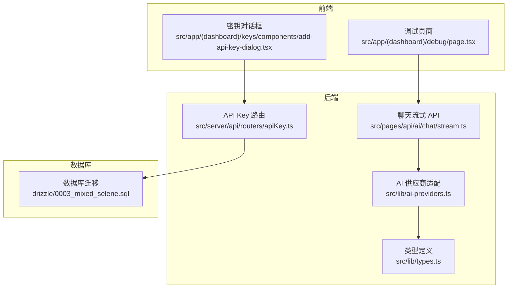
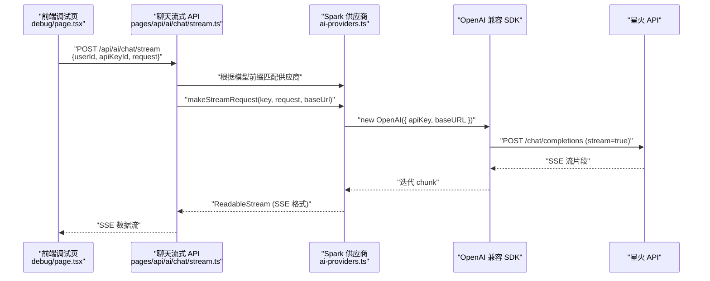
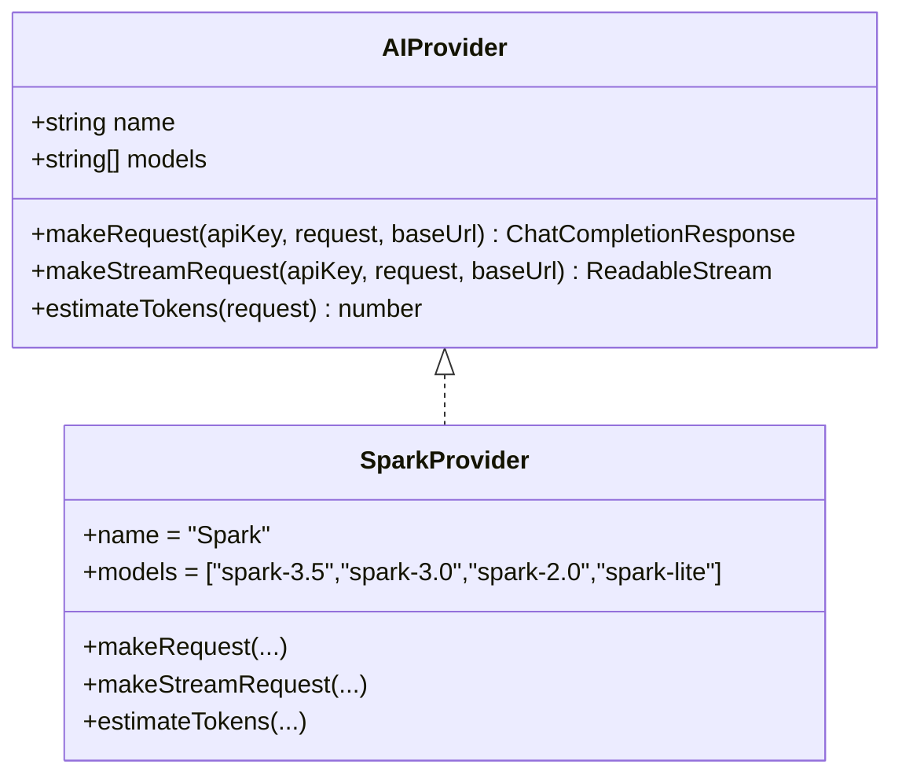
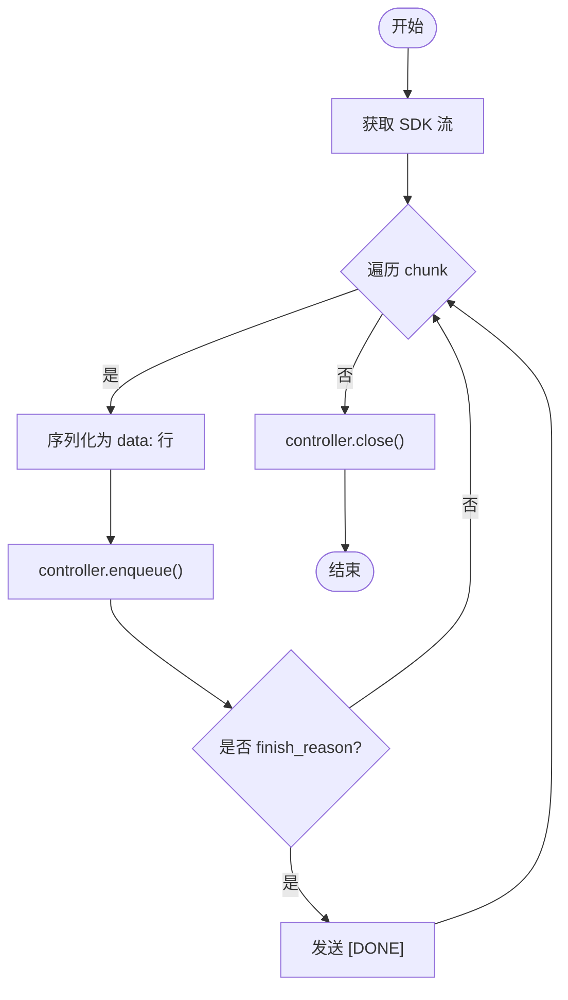
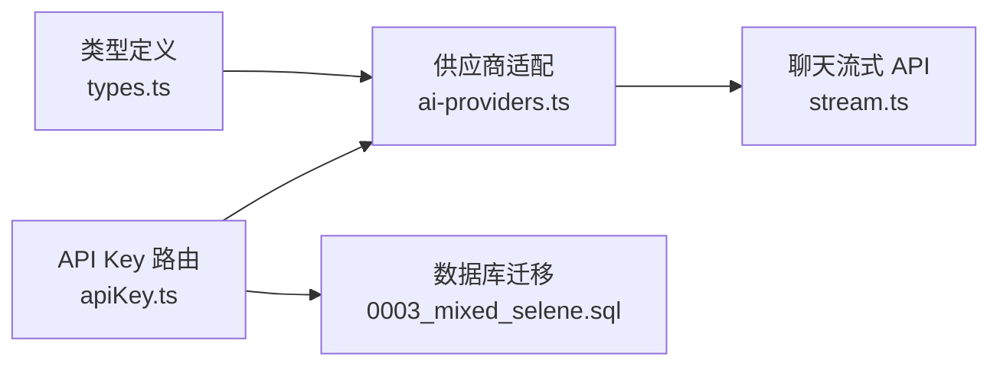

# 星火大模型 Spark 供应商集成

<cite>
**本文档引用的文件**
- [src/lib/ai-providers.ts](file://src/lib/ai-providers.ts)
- [src/lib/types.ts](file://src/lib/types.ts)
- [src/server/api/routers/apiKey.ts](file://src/server/api/routers/apiKey.ts)
- [src/types/api-key.ts](file://src/types/api-key.ts)
- [src/pages/api/ai/chat/stream.ts](file://src/pages/api/ai/chat/stream.ts)
- [src/app/(dashboard)/debug/page.tsx](file://src/app/(dashboard)/debug/page.tsx)
- [src/app/(dashboard)/keys/components/add-api-key-dialog.tsx](file://src/app/(dashboard)/keys/components/add-api-key-dialog.tsx)
- [drizzle/0003_mixed_selene.sql](file://drizzle/0003_mixed_selene.sql)
</cite>

## 目录
1. [简介](#简介)
2. [项目结构](#项目结构)
3. [核心组件](#核心组件)
4. [架构总览](#架构总览)
5. [详细组件分析](#详细组件分析)
6. [依赖关系分析](#依赖关系分析)
7. [性能考虑](#性能考虑)
8. [故障排除指南](#故障排除指南)
9. [结论](#结论)
10. [附录](#附录)

## 简介
本技术文档面向希望在系统中集成星火大模型（Spark）的开发者，系统性阐述 Spark 供应商的实现架构与集成要点。重点包括：
- 基于 OpenAI 兼容 API 的封装与 SDK 重用
- 参数映射与响应格式标准化
- 流式响应处理与 SSE 转换
- Spark 特殊配置项：自定义基础 URL、模型前缀匹配与认证方式
- 支持的模型系列：spark-3.5、spark-3.0、spark-2.0、spark-lite
- 完整集成指南：API 密钥配置、基础 URL 设置、中国地区网络支持
- 使用示例、性能优化建议、调试与故障排除

## 项目结构
围绕 Spark 集成的关键文件分布如下：
- 供应商适配层：统一的 AIProvider 接口与各提供商实现（含 Spark）
- 类型定义：请求/响应、API Key、配额策略等
- API 层：Next.js API Route 实现流式与非流式聊天
- 管理界面：调试页与密钥管理对话框
- 数据库迁移：新增 SPARK 提供商枚举值

**图表来源**
- [src/pages/api/ai/chat/stream.ts](file://src/pages/api/ai/chat/stream.ts#L1-L167)
- [src/lib/ai-providers.ts](file://src/lib/ai-providers.ts#L615-L707)
- [src/lib/types.ts](file://src/lib/types.ts#L1-L118)
- [src/server/api/routers/apiKey.ts](file://src/server/api/routers/apiKey.ts#L28-L61)
- [drizzle/0003_mixed_selene.sql](file://drizzle/0003_mixed_selene.sql#L1-L1)

**章节来源**
- [src/lib/ai-providers.ts](file://src/lib/ai-providers.ts#L615-L707)
- [src/lib/types.ts](file://src/lib/types.ts#L1-L118)
- [src/pages/api/ai/chat/stream.ts](file://src/pages/api/ai/chat/stream.ts#L1-L167)
- [src/server/api/routers/apiKey.ts](file://src/server/api/routers/apiKey.ts#L28-L61)
- [drizzle/0003_mixed_selene.sql](file://drizzle/0003_mixed_selene.sql#L1-L1)

## 核心组件
- Spark 供应商实现：基于 OpenAI 兼容 SDK，封装非流式与流式请求，支持自定义 baseURL
- 模型前缀匹配：通过模型名前缀“spark-”自动路由至 Spark 供应商
- API Key 管理：支持存储 provider、key、baseUrl、状态，并提供测试与缓存
- 流式处理：将 OpenAI 兼容流转换为标准 SSE 格式，逐块推送
- 类型系统：统一的请求/响应 Schema，保障跨供应商一致性

**章节来源**
- [src/lib/ai-providers.ts](file://src/lib/ai-providers.ts#L615-L707)
- [src/lib/types.ts](file://src/lib/types.ts#L48-L118)
- [src/server/api/routers/apiKey.ts](file://src/server/api/routers/apiKey.ts#L28-L61)

## 架构总览
下图展示了从前端调试页到后端 API Route，再到 Spark 供应商与 OpenAI 兼容 SDK 的完整调用链路。

**图表来源**
- [src/app/(dashboard)/debug/page.tsx](file://src/app/(dashboard)/debug/page.tsx#L218-L314)
- [src/pages/api/ai/chat/stream.ts](file://src/pages/api/ai/chat/stream.ts#L88-L158)
- [src/lib/ai-providers.ts](file://src/lib/ai-providers.ts#L645-L680)

**章节来源**
- [src/app/(dashboard)/debug/page.tsx](file://src/app/(dashboard)/debug/page.tsx#L218-L314)
- [src/pages/api/ai/chat/stream.ts](file://src/pages/api/ai/chat/stream.ts#L88-L158)
- [src/lib/ai-providers.ts](file://src/lib/ai-providers.ts#L645-L680)

## 详细组件分析

### Spark 供应商实现
- 模型集合：spark-3.5、spark-3.0、spark-2.0、spark-lite
- 认证方式：通过 OpenAI SDK 的 apiKey 参数传递
- 基础 URL：默认 https://spark-api.xf-yun.com/v1；可通过 API Key 的 baseUrl 覆盖
- 非流式请求：直接调用 chat.completions.create，返回标准 ChatCompletionResponse
- 流式请求：启用 stream=true，将底层 SDK 的流转换为标准 SSE 格式，逐块推送

**图表来源**
- [src/lib/ai-providers.ts](file://src/lib/ai-providers.ts#L13-L27)
- [src/lib/ai-providers.ts](file://src/lib/ai-providers.ts#L615-L685)

**章节来源**
- [src/lib/ai-providers.ts](file://src/lib/ai-providers.ts#L615-L685)

### OpenAI 兼容封装与参数映射
- SDK 重用：通过动态 import 加载 openai，实例化 OpenAI 客户端
- 参数映射：将统一的 ChatCompletionRequest 映射到 SDK 的 create 调用
- 响应标准化：非流式直接透传；流式将 chunk 序列化为 data: 行，末尾追加 [DONE]
- 认证：apiKey 作为构造参数传入 OpenAI 客户端
- 基础 URL：优先使用 API Key 中的 baseUrl，否则使用默认地址

**章节来源**
- [src/lib/ai-providers.ts](file://src/lib/ai-providers.ts#L625-L643)
- [src/lib/ai-providers.ts](file://src/lib/ai-providers.ts#L650-L680)

### 流式响应处理（SSE）
- 读取底层 SDK 的流迭代器，逐块编码为文本事件行
- 在 finish_reason 存在时追加 data: [DONE]，通知消费端结束
- 通过 ReadableStream 对外暴露，便于上游直接转发

**图表来源**
- [src/lib/ai-providers.ts](file://src/lib/ai-providers.ts#L664-L680)

**章节来源**
- [src/lib/ai-providers.ts](file://src/lib/ai-providers.ts#L664-L680)

### 模型前缀匹配与路由
- getProviderByModel 根据模型名前缀选择对应供应商
- “spark-” 前缀路由到 Spark 供应商，其余前缀路由到其他供应商

**章节来源**
- [src/lib/ai-providers.ts](file://src/lib/ai-providers.ts#L697-L707)

### API Key 管理与测试
- 存储结构：provider、key、baseUrl、status 等
- 前后端映射：convertProviderToDb/convertProviderFromDb
- 测试逻辑：对部分提供商进行可用性验证（如 models.list）
- 缓存策略：Redis 缓存 API Key，提升读取性能

**章节来源**
- [src/server/api/routers/apiKey.ts](file://src/server/api/routers/apiKey.ts#L28-L61)
- [src/server/api/routers/apiKey.ts](file://src/server/api/routers/apiKey.ts#L338-L407)
- [src/types/api-key.ts](file://src/types/api-key.ts#L1-L19)

### 调试与集成示例
- 调试页：支持选择 API Key、模型、温度、最大 token、是否流式
- 代码生成：提供 JavaScript/Python/cURL 三种示例，便于快速集成
- 流式处理：前端使用 fetch + ReadableStream 读取 SSE

**章节来源**
- [src/app/(dashboard)/debug/page.tsx](file://src/app/(dashboard)/debug/page.tsx#L104-L205)
- [src/app/(dashboard)/debug/page.tsx](file://src/app/(dashboard)/debug/page.tsx#L218-L314)

## 依赖关系分析
- 供应商适配层依赖类型系统，保证请求/响应一致
- API Route 依赖供应商适配层与配额/白名单等中间件
- API Key 路由负责持久化与缓存，支撑运行时选择正确的 baseURL
- 数据库迁移扩展了 provider 枚举，支持 SPARK

**图表来源**
- [src/lib/types.ts](file://src/lib/types.ts#L48-L118)
- [src/lib/ai-providers.ts](file://src/lib/ai-providers.ts#L615-L707)
- [src/pages/api/ai/chat/stream.ts](file://src/pages/api/ai/chat/stream.ts#L1-L167)
- [src/server/api/routers/apiKey.ts](file://src/server/api/routers/apiKey.ts#L28-L61)
- [drizzle/0003_mixed_selene.sql](file://drizzle/0003_mixed_selene.sql#L1-L1)

**章节来源**
- [src/lib/types.ts](file://src/lib/types.ts#L48-L118)
- [src/lib/ai-providers.ts](file://src/lib/ai-providers.ts#L615-L707)
- [src/pages/api/ai/chat/stream.ts](file://src/pages/api/ai/chat/stream.ts#L1-L167)
- [src/server/api/routers/apiKey.ts](file://src/server/api/routers/apiKey.ts#L28-L61)
- [drizzle/0003_mixed_selene.sql](file://drizzle/0003_mixed_selene.sql#L1-L1)

## 性能考虑
- SDK 动态导入：按需加载 openai，减少初始包体积
- Redis 缓存 API Key：降低数据库压力，提升高并发下的响应速度
- 流式直通：避免一次性聚合响应，降低内存占用
- SSE 转换最小化：仅做必要序列化与 [DONE] 追加，保持低开销
- Token 估算：简单字符长度估算，避免复杂计算带来的额外延迟

[本节为通用性能建议，无需具体文件分析]

## 故障排除指南
- Spark API 错误日志：供应商内部捕获并打印错误，便于定位问题
- 非流式/流式差异：确认请求参数与 SDK 行为一致，必要时切换模式
- 基础 URL 不可达：检查 API Key 的 baseUrl 是否正确，或留空使用默认地址
- SSE 传输异常：确认 API Route 已设置正确的 SSE 头部与缓冲策略
- 配额/白名单限制：若被拒绝，检查配额策略与用户白名单状态

**章节来源**
- [src/lib/ai-providers.ts](file://src/lib/ai-providers.ts#L640-L643)
- [src/pages/api/ai/chat/stream.ts](file://src/pages/api/ai/chat/stream.ts#L78-L83)

## 结论
本集成方案通过统一的 AIProvider 接口与 OpenAI 兼容 SDK，实现了对星火大模型的无缝接入。其优势在于：
- 以最小改动复用现有 SDK 与类型体系
- 支持自定义基础 URL 与流式响应，满足多场景需求
- 提供完善的调试工具与示例，加速集成落地

后续可进一步扩展：
- 增强流式错误恢复与断点续传
- 引入更精细的 Token 统计与成本核算
- 扩展更多 Spark 模型变体与参数映射

[本节为总结性内容，无需具体文件分析]

## 附录

### 集成步骤与配置清单
- 在后台添加 API Key，选择“星火大模型”，填写 API Key 与可选的自定义基础 URL
- 在调试页选择该 API Key 与目标模型（如 spark-3.5），配置温度与最大 token
- 若需流式输出，勾选“流式”并在前端使用 ReadableStream 读取 SSE
- 如在中国地区访问受限，可在 API Key 中设置代理或私有部署的 baseURL

**章节来源**
- [src/app/(dashboard)/keys/components/add-api-key-dialog.tsx](file://src/app/(dashboard)/keys/components/add-api-key-dialog.tsx#L139-L149)
- [src/server/api/routers/apiKey.ts](file://src/server/api/routers/apiKey.ts#L28-L61)

### 支持的模型系列
- spark-3.5
- spark-3.0
- spark-2.0
- spark-lite

**章节来源**
- [src/lib/ai-providers.ts](file://src/lib/ai-providers.ts#L616-L617)

### 数据模型与类型参考
- ChatCompletionRequest/Response：统一的请求/响应结构
- ApiKey：包含 provider、key、baseUrl、status 等字段
- provider 枚举：新增 SPARK

**章节来源**
- [src/lib/types.ts](file://src/lib/types.ts#L48-L118)
- [src/types/api-key.ts](file://src/types/api-key.ts#L1-L19)
- [drizzle/0003_mixed_selene.sql](file://drizzle/0003_mixed_selene.sql#L1-L1)