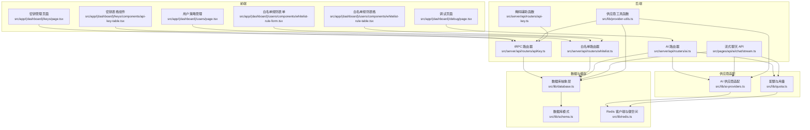
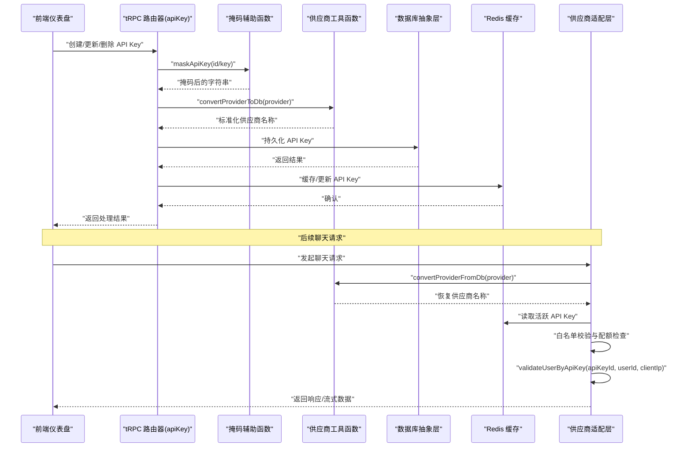
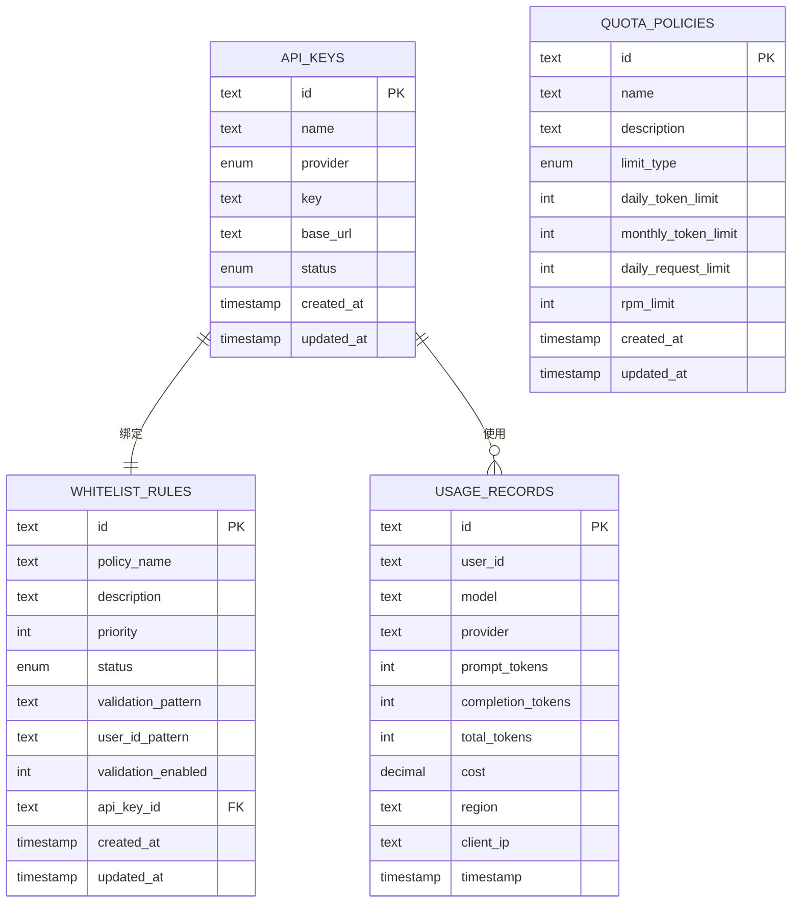
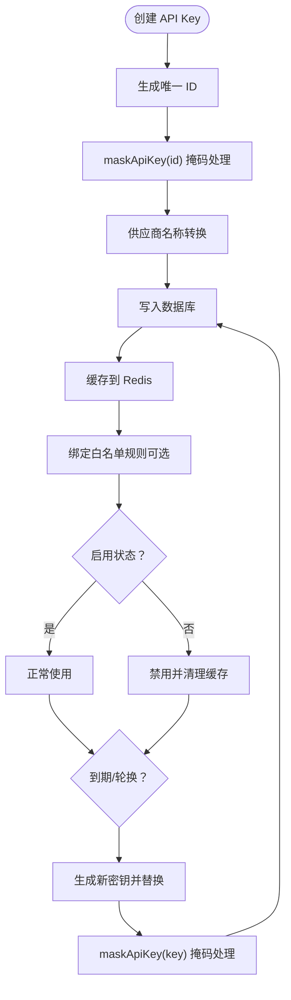
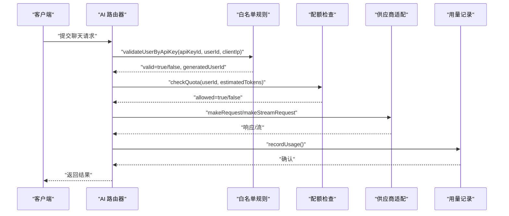
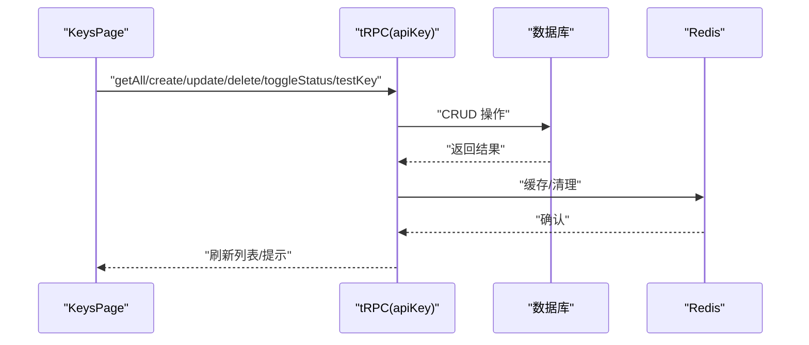
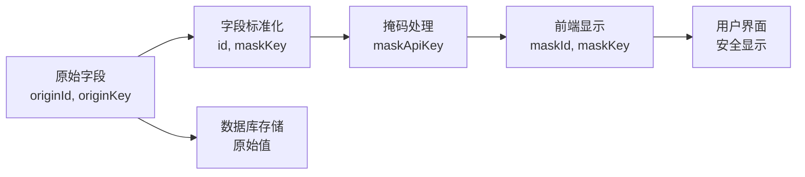
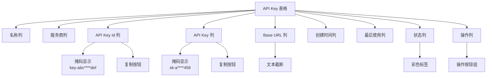
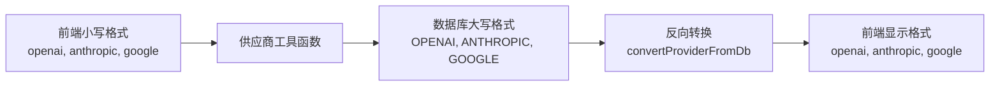
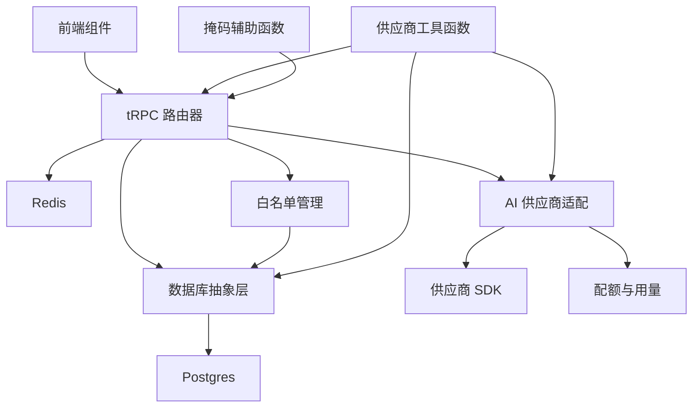

# API Key 管理系统

<cite>
**本文档引用的文件**
- [src/lib/schema.ts](file://src/lib/schema.ts)
- [src/types/api-key.ts](file://src/types/api-key.ts)
- [src/server/api/routers/api-key.ts](file://src/server/api/routers/api-key.ts)
- [src/server/api/routers/whitelist.ts](file://src/server/api/routers/whitelist.ts)
- [src/server/api/routers/ai.ts](file://src/server/api/routers/ai.ts)
- [src/pages/api/ai/chat/stream.ts](file://src/pages/api/ai/chat/stream.ts)
- [src/lib/database.ts](file://src/lib/database.ts)
- [src/lib/redis.ts](file://src/lib/redis.ts)
- [src/lib/ai-providers.ts](file://src/lib/ai-providers.ts)
- [src/lib/quota.ts](file://src/lib/quota.ts)
- [src/lib/provider-utils.ts](file://src/lib/provider-utils.ts)
- [src/app/(dashboard)/keys/page.tsx](file://src/app/(dashboard)/keys/page.tsx)
- [src/app/(dashboard)/keys/components/api-key-table.tsx](file://src/app/(dashboard)/keys/components/api-key-table.tsx)
- [src/app/(dashboard)/users/page.tsx](file://src/app/(dashboard)/users/page.tsx)
- [src/app/(dashboard)/users/components/whitelist-rule-form.tsx](file://src/app/(dashboard)/users/components/whitelist-rule-form.tsx)
- [src/app/(dashboard)/users/components/whitelist-rule-table.tsx](file://src/app/(dashboard)/users/components/whitelist-rule-table.tsx)
</cite>

## 更新摘要
**所做更改**
- 新增字段命名统一章节，详细说明 originId→id、originKey→maskKey 的现代化改造
- 更新 API Key 表格增强功能章节，包含新增 API Key Id 列显示、复制到剪贴板功能、改进表格布局
- 新增供应商工具函数集成章节，统一供应商命名规范与转换逻辑
- 更新架构图，展示字段命名统一和表格增强功能的集成点
- 新增 maskApiKey 辅助函数的详细实现说明

## 目录
1. [简介](#简介)
2. [项目结构](#项目结构)
3. [核心组件](#核心组件)
4. [架构总览](#架构总览)
5. [详细组件分析](#详细组件分析)
6. [字段命名统一现代化](#字段命名统一现代化)
7. [API Key 表格增强功能](#api-key-表格增强功能)
8. [供应商工具函数集成](#供应商工具函数集成)
9. [依赖关系分析](#依赖关系分析)
10. [性能考虑](#性能考虑)
11. [故障排除指南](#故障排除指南)
12. [结论](#结论)
13. [附录](#附录)

## 简介
本文件为 AIGate 的 API Key 管理系统提供全面技术文档。重点涵盖以下方面：
- API Key 的生成、存储与安全验证流程
- 密钥轮换策略与生命周期管理
- 多供应商支持与动态配置更新
- 权限控制、访问范围限制与使用审计
- **新增** 字段命名统一现代化改造，包括 originId→id、originKey→maskKey 的标准化
- **新增** API Key 表格增强功能：新增 API Key Id 列显示、复制到剪贴板功能、改进表格显示和用户体验
- **新增** 供应商工具函数集成，统一供应商命名规范与转换逻辑
- **新增** maskApiKey 辅助函数的安全掩码机制
- 加密存储、传输保护与访问日志记录最佳实践
- 批量管理、导入导出与自动化运维建议
- API Key 与用户账户的关联与权限继承机制
- 配置示例与安全加固指南

## 项目结构
AIGate 采用前后端分离的 Next.js 架构，API Key 管理涉及前端仪表盘、tRPC 后端路由、Drizzle ORM 数据层、Redis 缓存以及供应商适配层。**更新后**，系统完成了字段命名统一现代化改造，通过标准化的字段命名和增强的表格功能提升了系统的可维护性和用户体验。



**图表来源**
- [src/app/(dashboard)/keys/page.tsx](file://src/app/(dashboard)/keys/page.tsx#L1-L261)
- [src/app/(dashboard)/keys/components/api-key-table.tsx](file://src/app/(dashboard)/keys/components/api-key-table.tsx#L1-L175)
- [src/app/(dashboard)/users/page.tsx](file://src/app/(dashboard)/users/page.tsx#L1-L146)
- [src/server/api/routers/api-key.ts](file://src/server/api/routers/api-key.ts#L1-L200)
- [src/lib/provider-utils.ts](file://src/lib/provider-utils.ts#L1-L26)
- [src/lib/database.ts](file://src/lib/database.ts#L1-L582)
- [src/lib/redis.ts](file://src/lib/redis.ts#L1-L49)

**章节来源**
- [src/lib/schema.ts](file://src/lib/schema.ts#L42-L98)
- [src/lib/database.ts](file://src/lib/database.ts#L1-L582)
- [src/lib/redis.ts](file://src/lib/redis.ts#L1-L49)
- [src/lib/ai-providers.ts](file://src/lib/ai-providers.ts#L1-L759)
- [src/lib/provider-utils.ts](file://src/lib/provider-utils.ts#L1-L26)
- [src/server/api/routers/api-key.ts](file://src/server/api/routers/api-key.ts#L1-L200)
- [src/server/api/routers/whitelist.ts](file://src/server/api/routers/whitelist.ts#L1-L221)
- [src/server/api/routers/ai.ts](file://src/server/api/routers/ai.ts#L1-L223)
- [src/pages/api/ai/chat/stream.ts](file://src/pages/api/ai/chat/stream.ts#L1-L167)
- [src/app/(dashboard)/keys/page.tsx](file://src/app/(dashboard)/keys/page.tsx#L1-L261)
- [src/app/(dashboard)/keys/components/api-key-table.tsx](file://src/app/(dashboard)/keys/components/api-key-table.tsx#L1-L175)
- [src/app/(dashboard)/users/page.tsx](file://src/app/(dashboard)/users/page.tsx#L1-L146)

## 核心组件
- API Key 数据模型与数据库模式：定义了 API Key 表、配额策略表、用量记录表、**白名单规则表**及枚举类型，支持多供应商与状态管理。
- tRPC 路由器：提供 API Key 的增删改查、状态切换、有效性测试与使用统计查询，**新增白名单规则管理功能**。
- **新增** 字段命名统一现代化：统一使用标准字段名 id、maskKey 替代 originId、originKey，提升代码一致性。
- **新增** 掩码辅助函数：提供 maskApiKey 函数实现安全的 API Key 掩码显示机制。
- **新增** 供应商工具函数模块：提供标准化的供应商名称转换函数，统一前端小写格式与数据库大写格式之间的转换。
- 前端仪表盘：提供密钥列表展示、新增/编辑/删除、启用/禁用、测试等功能，**新增增强的表格功能**。
- 供应商适配层：统一 OpenAI、Anthropic、Google、DeepSeek、Moonshot、Spark 等提供商的调用与流式输出。
- Redis 缓存：缓存活跃 API Key、用户配额策略、用量统计与请求日志，提升性能与可扩展性。
- 配额与用量：基于 Redis 实现每日 Token/请求次数限制与 RPM 限制，并记录用量到数据库。
- **新增** 白名单管理：通过 API Key 与白名单规则的关联，实现基于密钥的访问控制与用户身份验证。
- **新增** 表格增强功能：API Key Id 列显示、复制到剪贴板按钮、改进的表格布局与用户体验。

**章节来源**
- [src/lib/schema.ts](file://src/lib/schema.ts#L42-L98)
- [src/server/api/routers/api-key.ts](file://src/server/api/routers/api-key.ts#L10-L21)
- [src/server/api/routers/api-key.ts](file://src/server/api/routers/api-key.ts#L75-L85)
- [src/server/api/routers/api-key.ts](file://src/server/api/routers/api-key.ts#L134-L175)
- [src/server/api/routers/whitelist.ts](file://src/server/api/routers/whitelist.ts#L65-L168)
- [src/lib/ai-providers.ts](file://src/lib/ai-providers.ts#L687-L759)
- [src/lib/redis.ts](file://src/lib/redis.ts#L18-L49)
- [src/lib/quota.ts](file://src/lib/quota.ts#L73-L255)
- [src/lib/provider-utils.ts](file://src/lib/provider-utils.ts#L1-L26)

## 架构总览
AIGate 的 API Key 管理系统围绕"前端仪表盘 + tRPC + Drizzle ORM + Redis + 供应商适配 + 供应商工具函数 + 掩码辅助函数"的架构展开。**更新后**，关键流程增加了字段命名统一和表格增强功能：

- 前端通过 tRPC 调用 API Key 路由器进行密钥管理；
- 路由器调用数据库抽象层持久化数据；
- 供应商适配层负责对接多家 AI 提供商；
- Redis 缓存活跃 API Key 与配额策略，加速读取；
- **新增** 字段命名统一：统一使用标准字段名 id、maskKey 替代 originId、originKey；
- **新增** 掩码辅助函数：提供安全的 API Key 掩码显示机制；
- **新增** 供应商工具函数：统一处理供应商名称转换，确保前后端一致的命名规范；
- **新增** 白名单验证：流式与非流式聊天请求在进入供应商前进行白名单校验与配额检查；
- **新增** API Key 与白名单规则关联：每个 API Key 可绑定唯一的白名单规则，实现细粒度访问控制；
- **新增** 表格增强：API Key Id 列显示原始 ID，支持一键复制到剪贴板，提升用户体验。



**图表来源**
- [src/server/api/routers/api-key.ts](file://src/server/api/routers/api-key.ts#L10-L21)
- [src/server/api/routers/api-key.ts](file://src/server/api/routers/api-key.ts#L134-L175)
- [src/lib/database.ts](file://src/lib/database.ts#L445-L547)
- [src/lib/redis.ts](file://src/lib/redis.ts#L18-L37)
- [src/lib/ai-providers.ts](file://src/lib/ai-providers.ts#L709-L759)
- [src/lib/provider-utils.ts](file://src/lib/provider-utils.ts#L1-L26)

## 详细组件分析

### API Key 数据模型与存储机制
- 数据模型：API Key 表包含 id、name、provider、key、baseUrl、status、createdAt、updatedAt；配额策略表包含 limitType、dailyTokenLimit、monthlyTokenLimit、dailyRequestLimit、rpmLimit 等；**新增白名单规则表包含 policyName、description、priority、status、validationPattern、userIdPattern、validationEnabled、apiKeyId**等字段。
- 存储策略：使用 Drizzle ORM 对 Postgres 进行读写；Redis 缓存活跃 API Key 与用户配额策略，提升读取性能。
- 安全处理：前端仅显示掩码后的 API Key；数据库不存储明文敏感信息（注意：当前模式未见加密字段，建议在生产环境增加加密存储）。



**图表来源**
- [src/lib/schema.ts](file://src/lib/schema.ts#L42-L98)

**章节来源**
- [src/lib/schema.ts](file://src/lib/schema.ts#L42-L98)

### API Key 生命周期与轮换策略
- 生命周期：创建时生成唯一 id；支持启用/禁用；删除时清理 Redis 缓存。
- 轮换策略：当前实现未包含自动轮换逻辑。建议引入"密钥版本"字段与"到期时间"，在到期前自动轮换并通知管理员；同时保留历史密钥以保证平滑过渡。
- 状态管理：通过状态枚举控制 ACTIVE/INACTIVE/SUSPENDED；禁用时清理缓存，防止继续使用。
- **新增** 白名单绑定：API Key 删除时应同时清理关联的白名单规则，避免悬挂引用。



**图表来源**
- [src/server/api/routers/api-key.ts](file://src/server/api/routers/api-key.ts#L134-L175)
- [src/server/api/routers/api-key.ts](file://src/server/api/routers/api-key.ts#L10-L21)
- [src/lib/redis.ts](file://src/lib/redis.ts#L18-L37)
- [src/lib/provider-utils.ts](file://src/lib/provider-utils.ts#L1-L26)

**章节来源**
- [src/server/api/routers/api-key.ts](file://src/server/api/routers/api-key.ts#L134-L175)
- [src/server/api/routers/api-key.ts](file://src/server/api/routers/api-key.ts#L10-L21)
- [src/lib/redis.ts](file://src/lib/redis.ts#L18-L37)
- [src/lib/provider-utils.ts](file://src/lib/provider-utils.ts#L1-L26)

### 多供应商支持与动态配置更新
- 供应商适配：统一接口 makeRequest/makeStreamRequest/estimateTokens；支持 OpenAI、Anthropic、Google、DeepSeek、Moonshot、Spark。
- 动态配置：API Key 支持自定义 baseUrl，便于切换不同供应商的网关地址；Redis 缓存活跃 API Key，便于动态更新与热切换。
- 供应商选择：按模型前缀自动匹配提供商；若需要可扩展为基于策略的动态选择。
- **新增** 统一命名规范：通过供应商工具函数确保前后端供应商名称的一致性，避免大小写和格式不一致的问题。

```mermaid
classDiagram
class ProviderUtils {
+convertProviderToDb(provider) string
+convertProviderFromDb(provider) string
}
class MaskApiKey {
+maskApiKey(key) string
}
class AIProvider {
+string name
+string[] models
+makeRequest(apiKey, request, baseUrl) ChatCompletionResponse
+makeStreamRequest(apiKey, request, baseUrl) ReadableStream
+estimateTokens(request) number
}
class Providers {
+Record~string,AIProvider~ providers
+getProviderByModel(model) AIProvider
+getApiKey(providerName) string
+getApiKeyWithBaseUrl(providerName) {key, baseUrl}
}
ProviderUtils --> AIProvider : "标准化供应商名称"
MaskApiKey --> AIProvider : "安全掩码处理"
Providers --> AIProvider : "管理多个提供商"
```

**图表来源**
- [src/lib/ai-providers.ts](file://src/lib/ai-providers.ts#L12-L759)
- [src/lib/provider-utils.ts](file://src/lib/provider-utils.ts#L1-L26)
- [src/server/api/routers/api-key.ts](file://src/server/api/routers/api-key.ts#L10-L21)

**章节来源**
- [src/lib/ai-providers.ts](file://src/lib/ai-providers.ts#L687-L759)
- [src/lib/ai-providers.ts](file://src/lib/ai-providers.ts#L709-L759)
- [src/lib/provider-utils.ts](file://src/lib/provider-utils.ts#L1-L26)
- [src/server/api/routers/api-key.ts](file://src/server/api/routers/api-key.ts#L10-L21)

### 权限控制与访问审计
- **更新** 白名单规则：通过 whitelistRules 表与匹配逻辑，对 userId 进行规则匹配与校验，支持正则表达式与优先级。**新增 API Key 绑定验证**：每个 API Key 可绑定唯一的白名单规则，实现基于密钥的访问控制。
- 配额策略：支持按 token 数或请求次数两种模式，结合每日与 RPM 限制；用量记录包含用户、模型、提供商、Token 消耗、地区与客户端 IP。
- 审计日志：Redis 中保存请求日志键，数据库中持久化用量记录，便于审计与追溯。



**图表来源**
- [src/server/api/routers/ai.ts](file://src/server/api/routers/ai.ts#L105-L137)
- [src/lib/database.ts](file://src/lib/database.ts#L445-L547)
- [src/lib/quota.ts](file://src/lib/quota.ts#L73-L255)

**章节来源**
- [src/lib/database.ts](file://src/lib/database.ts#L84-L140)
- [src/lib/quota.ts](file://src/lib/quota.ts#L14-L48)
- [src/lib/quota.ts](file://src/lib/quota.ts#L73-L190)

### API Key 管理前端与工作流
- 页面组件：KeysPage 负责加载、创建、更新、删除、启用/禁用与测试 API Key；ApiKeyTable 展示列表并提供复制、测试、启用/禁用、编辑、删除操作。
- tRPC 集成：通过 trpc hooks 调用后端路由，实现无感知的数据同步与状态更新。
- 调试页面：提供模型选择、消息输入、Token 估算与代码示例生成功能，便于联调与测试。
- **新增** 白名单管理：UsersPage 提供白名单规则的创建、编辑、删除、启用/禁用功能，支持 API Key 绑定与验证规则配置。
- **新增** 表格增强：API Key 表格新增 API Key Id 列，显示原始 ID；为 API Key Id 和 API Key 列都添加了复制到剪贴板按钮，提升用户操作效率。



**图表来源**
- [src/app/(dashboard)/keys/page.tsx](file://src/app/(dashboard)/keys/page.tsx#L12-L122)
- [src/app/(dashboard)/keys/components/api-key-table.tsx](file://src/app/(dashboard)/keys/components/api-key-table.tsx#L20-L161)
- [src/server/api/routers/api-key.ts](file://src/server/api/routers/api-key.ts#L68-L175)

**章节来源**
- [src/app/(dashboard)/keys/page.tsx](file://src/app/(dashboard)/keys/page.tsx#L1-L261)
- [src/app/(dashboard)/keys/components/api-key-table.tsx](file://src/app/(dashboard)/keys/components/api-key-table.tsx#L1-L175)
- [src/app/(dashboard)/users/page.tsx](file://src/app/(dashboard)/users/page.tsx#L1-L146)
- [src/server/api/routers/api-key.ts](file://src/server/api/routers/api-key.ts#L68-L175)

## 字段命名统一现代化

**更新** AIGate 系统完成了字段命名的现代化改造，统一使用标准字段名替代原有的 originId、originKey 前缀，提升了代码的一致性和可维护性。

### 字段命名标准化

#### API Key 字段统一
- **originId → id**：原始 API Key ID 字段统一为标准的 id 字段名
- **originKey → maskKey**：原始 API Key 字段统一为 maskKey，配合掩码显示机制

#### 类型定义更新
```typescript
export interface ApiKey {
  id: string;           // 统一使用 id 替代 originId
  key: string;          // 原始密钥内容
  maskId: string;       // 掩码后的 ID
  maskKey: string;      // 掩码后的密钥
  name: string;
  provider: 'openai' | 'anthropic' | 'google' | 'deepseek' | 'moonshot' | 'spark';
  baseUrl?: string;
  createdAt: string;
  lastUsed?: string;
  status: 'active' | 'disabled';
}
```

### 掩码机制实现

#### maskApiKey 辅助函数
掩码函数提供安全的 API Key 显示机制：

```typescript
function maskApiKey(key: string): string {
  if (key.length <= 8) {
    return key;
  }

  const start = key.substring(0, 4);
  const end = key.substring(key.length - 4);
  const middle = '*'.repeat(Math.min(key.length - 8, 20));

  return `${start}${middle}${end}`;
}
```

#### 掩码显示策略
- **短密钥**（≤8字符）：直接显示，不做掩码处理
- **长密钥**（>8字符）：显示前4位 + '*'（最多20个）+ 后4位
- **示例**：`sk-abc123def456` → `sk-a****456`

### 数据流转处理

#### 前端数据格式转换
在 API Key 路由器中，系统会将数据库中的原始字段转换为前端期望的格式：

```typescript
const maskedApiKeys = apiKeys.map((key) => ({
  id: key.id,           // 标准字段名
  key: key.key,         // 原始密钥
  maskId: maskApiKey(key.id),  // 掩码后的 ID
  maskKey: maskApiKey(key.key), // 掩码后的密钥
  name: key.name,
  baseUrl: key.baseUrl || undefined,
  provider: convertProviderFromDb(key.provider),
  status: convertStatusFromDb(key.status),
  createdAt: formatDate(key.createdAt),
}));
```

### 优势与改进

#### 代码一致性提升
- 统一的字段命名规范消除了命名混乱
- 提升了代码的可读性和可维护性
- 便于团队协作和新成员上手

#### 安全性增强
- 掩码显示机制防止敏感信息泄露
- 原始密钥与显示密钥分离，降低安全风险
- 符合最小暴露原则

#### 向后兼容性
- 现有数据库结构保持不变
- 通过字段映射实现平滑过渡
- 不影响现有业务逻辑



**图表来源**
- [src/server/api/routers/api-key.ts](file://src/server/api/routers/api-key.ts#L10-L21)
- [src/server/api/routers/api-key.ts](file://src/server/api/routers/api-key.ts#L75-L85)
- [src/types/api-key.ts](file://src/types/api-key.ts#L1-L21)

**章节来源**
- [src/server/api/routers/api-key.ts](file://src/server/api/routers/api-key.ts#L10-L21)
- [src/server/api/routers/api-key.ts](file://src/server/api/routers/api-key.ts#L75-L85)
- [src/types/api-key.ts](file://src/types/api-key.ts#L1-L21)

## API Key 表格增强功能

**更新** API Key 表格功能显著增强，提供更好的用户体验和操作便利性。

### 表格列功能增强

#### API Key Id 列显示
- **新增** `apiKeyId` 列：显示原始的 API Key ID
- **掩码显示**：默认显示掩码后的 ID（如 `key-abc****def`）
- **复制功能**：支持一键复制原始 ID 到剪贴板

#### API Key 列增强
- **掩码显示**：默认显示掩码后的密钥（如 `sk-a****456`）
- **复制功能**：支持一键复制原始密钥到剪贴板
- **安全提示**：使用灰色字体区分显示与原始值

#### 复制到剪贴板功能
```typescript
const handleCopyToClipboard = (text: string) => {
  navigator.clipboard.writeText(text);
  toast('已复制到剪贴板');
};
```

### 表格布局优化

#### 列显示优化
- **名称列**：加粗显示，突出重要信息
- **服务商列**：使用灰色字体，保持视觉层次
- **Base URL 列**：支持文本截断和标题提示
- **状态列**：使用彩色标签，直观显示状态

#### 按钮布局改进
- **操作列右对齐**：操作按钮集中在右侧
- **按钮尺寸统一**：使用统一的图标按钮样式
- **悬停效果**：提供清晰的交互反馈

### 用户体验提升

#### 空状态处理
- **空图标**：使用 KeyRound 图标增强视觉效果
- **友好提示**：提供添加密钥的引导信息
- **加载状态**：使用旋转指示器显示加载进度

#### 响应式设计
- **移动端适配**：支持小屏幕设备显示
- **列宽调整**：自动适应不同屏幕尺寸
- **触摸友好**：按钮尺寸适合触摸操作



**图表来源**
- [src/app/(dashboard)/keys/components/api-key-table.tsx](file://src/app/(dashboard)/keys/components/api-key-table.tsx#L29-L155)

**章节来源**
- [src/app/(dashboard)/keys/components/api-key-table.tsx](file://src/app/(dashboard)/keys/components/api-key-table.tsx#L1-L175)
- [src/types/api-key.ts](file://src/types/api-key.ts#L1-L21)

## 供应商工具函数集成

**更新** AIGate 系统新增了统一的供应商工具函数模块，用于标准化供应商名称转换，消除重复的转换逻辑，确保前后端一致的命名规范。

### 供应商工具函数模块概述
- **模块位置**：src/lib/provider-utils.ts
- **核心功能**：提供标准化的供应商名称转换函数
- **统一规范**：前端使用小写格式（如 "openai"），数据库使用大写枚举（如 "OPENAI"）

### 转换函数详解

#### convertProviderToDb 函数
将前端传入的小写供应商名称转换为数据库使用的枚举格式：

```typescript
export function convertProviderToDb(provider: string): string {
  const mapping: Record<string, string> = {
    openai: 'OpenAI',
    anthropic: 'Anthropic', 
    google: 'Google',
    mistral: 'Mistral',
  };
  return mapping[provider.toLowerCase()] || provider;
}
```

#### convertProviderFromDb 函数
将数据库中的大写枚举转换为前端显示的小写格式：

```typescript
export function convertProviderFromDb(provider: string) {
  const mapping: Record<string, string> = {
    OpenAI: 'openai',
    Anthropic: 'anthropic',
    Google: 'google', 
    Mistral: 'mistral',
  };
  return (mapping[provider] || provider.toLowerCase()) as
    | 'openai'
    | 'anthropic'
    | 'google'
    | 'deepseek'
    | 'moonshot'
    | 'spark';
}
```

### 集成应用

#### 在 API Key 路由器中的应用
API Key 路由器保留了原有的转换函数，但现在可以统一使用工具函数：

```typescript
// 使用工具函数替代重复逻辑
const provider = convertProviderFromDb(key.provider);
// 或者在创建时使用
const provider = convertProviderToDb(input.provider);
```

#### 在数据库层的应用
数据库层通过导入工具函数统一处理供应商名称转换：

```typescript
import { convertProviderToDb } from './provider-utils';

// 在 getActiveApiKey 中使用
const apiKeysList = await apiKeyDb.getByProvider(convertProviderToDb(provider));
```

#### 在供应商适配层的应用
供应商适配层也集成了工具函数：

```typescript
import { convertProviderToDb } from '@/server/api/routers/api-key';

// 在 getApiKeyWithBaseUrl 中使用
const apiKeysList = await apiKeyDb.getByProvider(convertProviderToDb(providerName));
```

### 优势与改进

#### 消除重复代码
- 统一的转换逻辑避免了在多个模块中重复编写相同的转换代码
- 减少了维护成本和潜在的不一致性

#### 标准化命名规范
- 前端使用小写格式，数据库使用大写枚举
- 确保跨模块的一致性，避免大小写不一致导致的问题

#### 易于扩展
- 新增供应商时只需在工具函数中添加映射
- 保持向后兼容性，不影响现有功能



**图表来源**
- [src/lib/provider-utils.ts](file://src/lib/provider-utils.ts#L1-L26)

**章节来源**
- [src/lib/provider-utils.ts](file://src/lib/provider-utils.ts#L1-L26)
- [src/server/api/routers/api-key.ts](file://src/server/api/routers/api-key.ts#L8)
- [src/lib/database.ts](file://src/lib/database.ts#L16-L17)
- [src/lib/ai-providers.ts](file://src/lib/ai-providers.ts#L2-L2)

## 依赖关系分析
- 组件耦合：API Key 路由器依赖数据库抽象层与 Redis；AI 路由器依赖供应商适配层与配额模块；**新增** 供应商工具函数提供统一的供应商名称转换；**新增** 掩码辅助函数提供安全的字段显示；**新增** 白名单路由器提供独立的规则管理功能；前端依赖 tRPC 客户端。
- 外部依赖：Redis、Postgres、各供应商 SDK；Next.js 生态（tRPC、Drizzle ORM）。
- 潜在风险：Redis 失败不影响主流程但可能影响缓存命中；数据库异常需降级处理；供应商接口变更需适配层同步更新；**新增** 供应商工具函数的映射配置错误会影响整个系统的供应商识别；**新增** 掩码函数的错误处理需要考虑边界情况；**新增** 白名单规则约束需要严格的 API Key 绑定验证；**新增** 表格增强功能依赖浏览器 Clipboard API。



**图表来源**
- [src/server/api/routers/api-key.ts](file://src/server/api/routers/api-key.ts#L1-L10)
- [src/server/api/routers/whitelist.ts](file://src/server/api/routers/whitelist.ts#L1-L5)
- [src/lib/database.ts](file://src/lib/database.ts#L1-L10)
- [src/lib/redis.ts](file://src/lib/redis.ts#L1-L16)
- [src/lib/ai-providers.ts](file://src/lib/ai-providers.ts#L1-L5)
- [src/lib/quota.ts](file://src/lib/quota.ts#L1-L5)
- [src/lib/provider-utils.ts](file://src/lib/provider-utils.ts#L1-L26)

**章节来源**
- [src/server/api/routers/api-key.ts](file://src/server/api/routers/api-key.ts#L1-L10)
- [src/server/api/routers/whitelist.ts](file://src/server/api/routers/whitelist.ts#L1-L5)
- [src/lib/database.ts](file://src/lib/database.ts#L1-L10)
- [src/lib/redis.ts](file://src/lib/redis.ts#L1-L16)
- [src/lib/ai-providers.ts](file://src/lib/ai-providers.ts#L1-L5)
- [src/lib/quota.ts](file://src/lib/quota.ts#L1-L5)
- [src/lib/provider-utils.ts](file://src/lib/provider-utils.ts#L1-L26)

## 性能考虑
- 缓存策略：Redis 缓存活跃 API Key 与配额策略，减少数据库压力；用量计数器按日与按分钟过期，避免无限增长。
- 异步处理：用量记录异步写入数据库，降低请求延迟。
- 流式传输：SSE 流式转发减少内存占用，提升用户体验。
- **新增** 供应商工具函数缓存：工具函数的映射对象在模块级别缓存，避免重复创建。
- **新增** 掩码函数优化：掩码函数使用常量时间复杂度，避免大字符串处理开销。
- **新增** 白名单缓存：白名单规则可缓存到 Redis，减少频繁的数据库查询。
- **新增** 表格性能：React.memo 优化表格渲染，减少不必要的重渲染。
- 扩展建议：对高频查询建立索引；对 Redis 键设置合理 TTL；监控慢查询与高延迟指标。

## 故障排除指南
- API Key 无效：通过 testKey 接口验证格式与可用性；检查 Redis 缓存是否正确更新。
- 配额超限：检查 Redis 中当日用量与 RPM 计数；核对配额策略 limitType 与阈值。
- 供应商不可用：检查供应商 SDK 版本与网络连通性；确认 baseUrl 配置。
- 数据库异常：查看数据库抽象层错误日志；必要时回滚迁移或修复约束。
- **新增** 字段命名错误：检查 API Key 类型定义中的字段名是否正确使用 id、maskKey。
- **新增** 掩码功能异常：检查 maskApiKey 函数的边界条件处理；验证字符串长度计算。
- **新增** 供应商名称转换错误：检查供应商工具函数的映射配置；确认前端传入的供应商名称格式。
- **新增** 供应商工具函数异常：检查 provider-utils.ts 文件是否存在；确认导入路径正确。
- **新增** 白名单验证失败：检查 API Key 是否绑定了有效的白名单规则；验证规则格式是否正确；确认用户ID格式是否符合要求。
- **新增** API Key 绑定冲突：当尝试绑定 API Key 到白名单规则时，如该 API Key 已绑定其他规则，系统会拒绝此操作。
- **新增** 复制功能异常：检查浏览器 Clipboard API 权限；确认页面在 HTTPS 环境下运行；验证浏览器兼容性。

**章节来源**
- [src/server/api/routers/api-key.ts](file://src/server/api/routers/api-key.ts#L337-L407)
- [src/lib/quota.ts](file://src/lib/quota.ts#L73-L190)
- [src/lib/database.ts](file://src/lib/database.ts#L1-L10)
- [src/lib/database.ts](file://src/lib/database.ts#L445-L547)
- [src/lib/provider-utils.ts](file://src/lib/provider-utils.ts#L1-L26)
- [src/server/api/routers/api-key.ts](file://src/server/api/routers/api-key.ts#L10-L21)

## 结论
AIGate 的 API Key 管理系统具备清晰的分层架构与良好的扩展性。**更新后**，通过完成字段命名统一现代化改造、集成统一的供应商工具函数模块、增强表格用户体验，系统实现了标准化的字段命名规范、统一的供应商命名转换、安全的掩码显示机制，以及基于 API Key 的细粒度访问控制。通过 tRPC、Drizzle ORM、Redis、供应商适配层、供应商工具函数、掩码辅助函数的协同，以及新增的白名单验证机制和表格增强功能，实现了密钥管理、配额控制、白名单验证、使用审计与用户体验优化的完整闭环。建议在生产环境中进一步强化密钥加密存储、自动化轮换与合规审计能力，以满足更高的安全与运维要求。

## 附录

### 配置示例与安全加固指南
- 环境变量
  - REDIS_URL：Redis 连接地址
  - DATABASE_URL：Postgres 连接地址
- 安全加固
  - 密钥加密存储：在数据库中对 key 字段进行加密（建议 AES-256），并使用密钥管理服务（KMS）管理密钥。
  - 传输保护：强制 HTTPS、HSTS、TLS 最低版本与加密套件升级。
  - 访问控制：最小权限原则、定期轮换、审计日志留存至少 90 天。
  - 配额策略：按用户/租户维度细化策略，启用每日请求次数与 RPM 限制。
  - **新增** 字段命名安全：确保字段命名统一，避免命名混淆导致的安全问题。
  - **新增** 掩码机制安全：验证掩码函数的边界条件，防止信息泄露。
  - **新增** 供应商工具函数安全：确保映射配置的准确性，定期审查供应商支持列表。
  - **新增** 白名单安全：定期审查白名单规则的有效性，监控异常访问模式。
  - **新增** 表格安全：确保复制功能在安全的 HTTPS 环境下运行，验证浏览器 Clipboard API 权限。
- 自动化运维
  - 密钥轮换：通过定时任务在到期前生成新密钥并替换，保留历史密钥窗口期。
  - 导入导出：提供 CSV/JSON 导入模板与校验规则，支持批量创建与状态更新。
  - 告警与监控：对配额超限、Redis 连接异常、供应商接口错误、白名单验证失败设置告警。
  - **新增** 字段命名监控：监控字段命名的一致性，及时发现命名违规。
  - **新增** 掩码监控：监控掩码函数的执行情况，确保安全显示机制正常工作。
  - **新增** 供应商工具函数监控：监控供应商名称转换的准确性和性能。
  - **新增** 白名单监控：监控白名单规则的命中率与验证成功率，及时发现配置问题。
  - **新增** 表格监控：监控复制功能的使用情况与错误率，优化用户体验。
- **新增** 字段命名优化
  - 类型安全：使用 TypeScript 接口确保字段名的类型安全。
  - 错误处理：为未知字段名提供合理的默认值和错误处理。
  - 性能优化：利用模块级别的缓存减少重复计算。
- **新增** 掩码功能优化
  - 边界处理：完善字符串长度边界条件的处理逻辑。
  - 性能优化：优化掩码算法，减少大字符串处理的开销。
  - 兼容性：确保掩码函数在不同浏览器环境下的兼容性。
- **新增** 表格功能优化
  - 响应式设计：确保表格在移动设备上的良好显示效果
  - 键盘导航：支持 Tab 键导航和快捷键操作
  - 加载状态：为长列表提供骨架屏加载效果
  - 错误处理：优雅处理数据加载失败的情况

### 数据库迁移要点
- 新增每日请求次数限制与限制类型字段，确保枚举约束合法。
- 为用户表增加 NextAuth 相关字段，支持认证与会话管理。
- **新增** 白名单规则表迁移：包含策略名称、描述、优先级、状态、验证规则、用户ID模式、验证开关、API Key绑定等字段，确保外键约束与索引完整性。
- **新增** API Key 表结构优化：支持 id 和 maskKey 字段，便于原始数据与显示数据的分离。
- **新增** 供应商工具函数迁移：在数据库层集成供应商名称转换逻辑，确保数据一致性。
- **新增** 掩码机制迁移：在前端和后端同时实现掩码显示机制，确保数据安全。

**章节来源**
- [src/lib/schema.ts](file://src/lib/schema.ts#L42-L98)
- [src/types/api-key.ts](file://src/types/api-key.ts#L1-L21)
- [src/lib/provider-utils.ts](file://src/lib/provider-utils.ts#L1-L26)
- [src/server/api/routers/api-key.ts](file://src/server/api/routers/api-key.ts#L10-L21)
- [src/lib/database.ts](file://src/lib/database.ts#L16-L17)