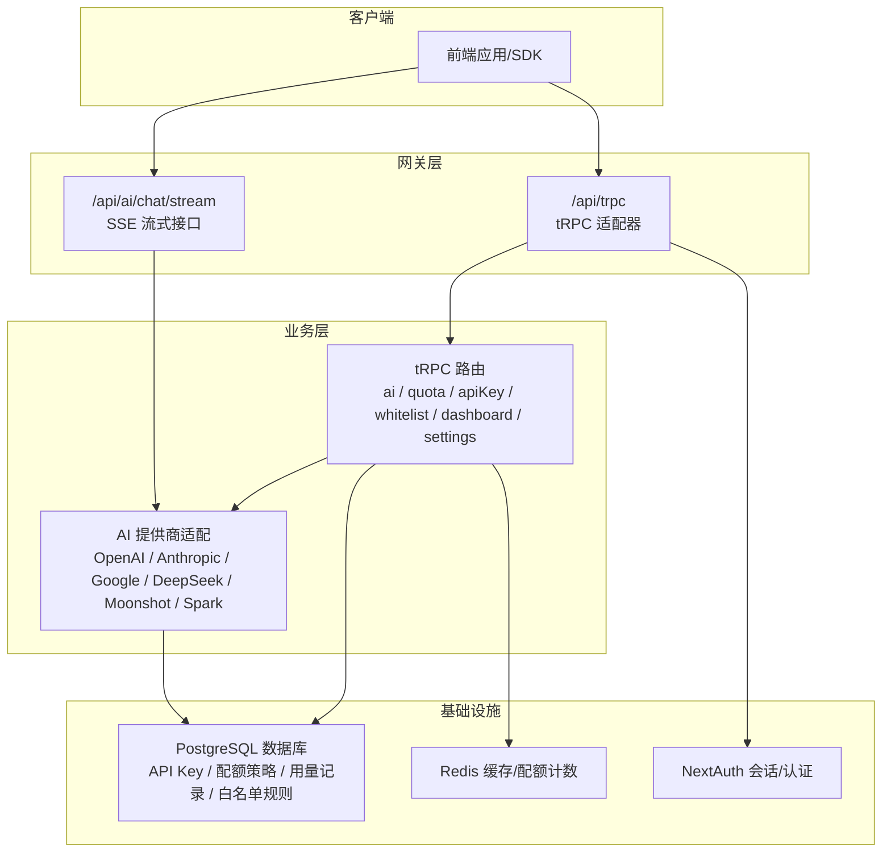
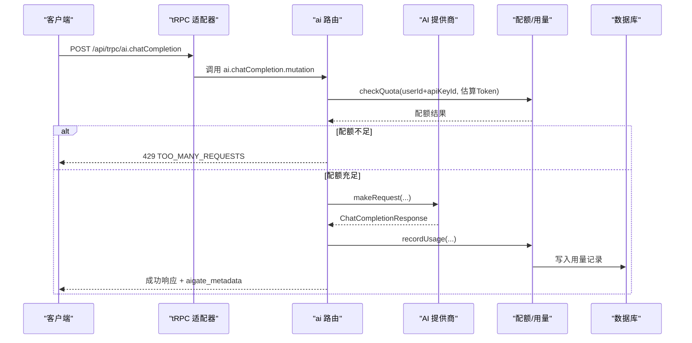
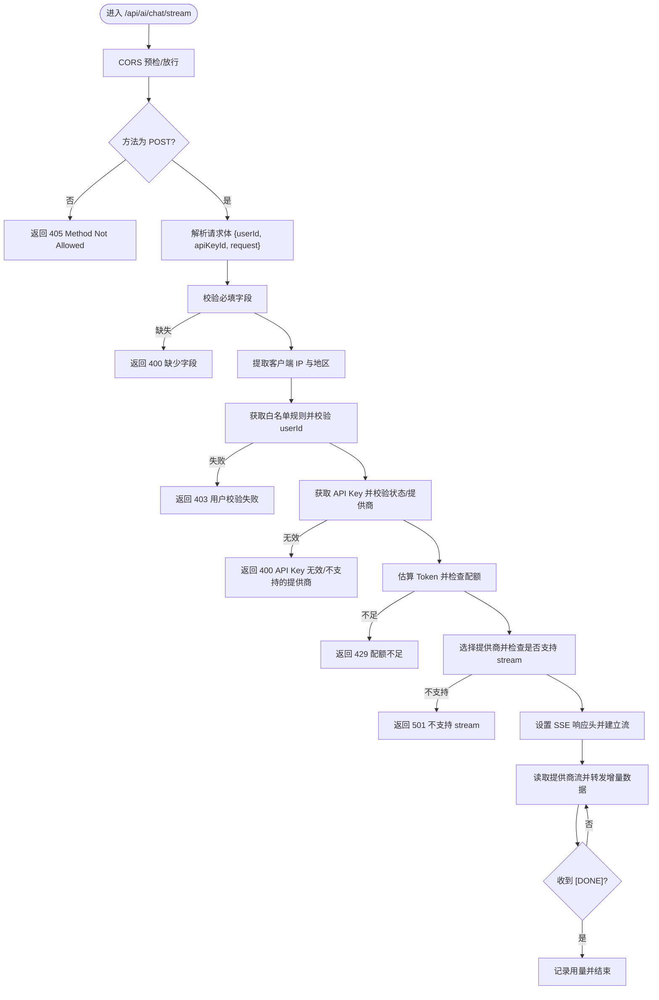
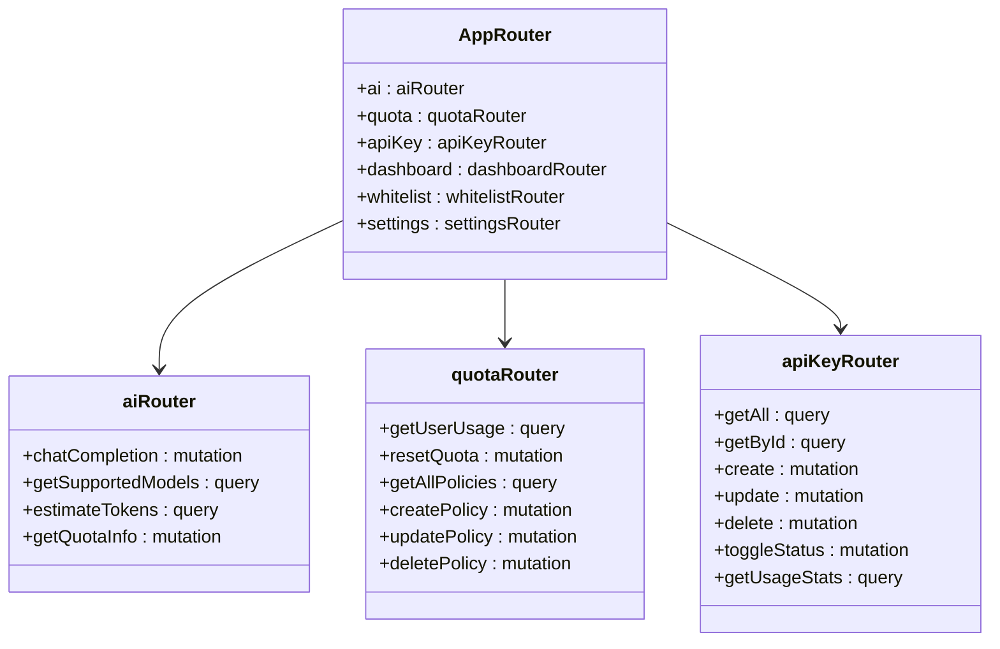
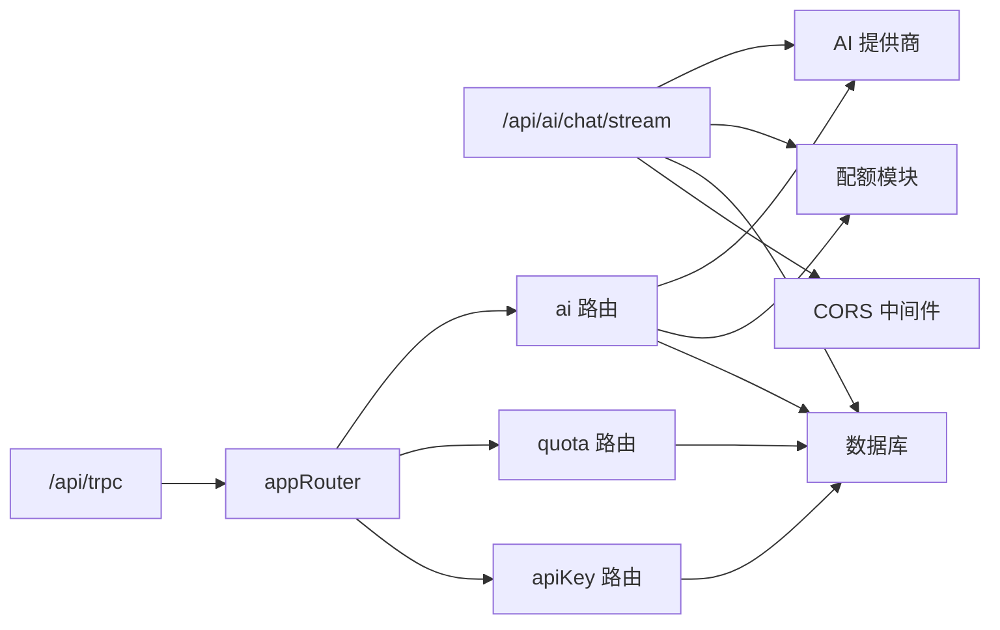

# API 参考

<cite>
**本文引用的文件**
- [src/pages/api/ai/chat/stream.ts](file://src/pages/api/ai/chat/stream.ts)
- [src/pages/api/trpc/[trpc].ts](file://src/pages/api/trpc/[trpc].ts)
- [src/server/api/root.ts](file://src/server/api/root.ts)
- [src/server/api/trpc.ts](file://src/server/api/trpc.ts)
- [src/server/api/routers/ai.ts](file://src/server/api/routers/ai.ts)
- [src/server/api/routers/api-key.ts](file://src/server/api/routers/api-key.ts)
- [src/server/api/routers/quota.ts](file://src/server/api/routers/quota.ts)
- [src/lib/ai-providers.ts](file://src/lib/ai-providers.ts)
- [src/lib/types.ts](file://src/lib/types.ts)
- [src/lib/quota.ts](file://src/lib/quota.ts)
- [src/lib/cors.ts](file://src/lib/cors.ts)
- [src/lib/database.ts](file://src/lib/database.ts)
- [src/auth.ts](file://src/auth.ts)
- [src/utils/api.ts](file://src/utils/api.ts)
- [README.md](file://README.md)
- [docs/ai-api.md](file://docs/ai-api.md)
</cite>

## 目录
1. [简介](#简介)
2. [项目结构](#项目结构)
3. [核心组件](#核心组件)
4. [架构总览](#架构总览)
5. [详细组件分析](#详细组件分析)
6. [依赖关系分析](#依赖关系分析)
7. [性能考量](#性能考量)
8. [故障排查指南](#故障排查指南)
9. [结论](#结论)
10. [附录](#附录)

## 简介
本文件为 AIGate 的完整 API 参考文档，覆盖两类接口：
- OpenAI 兼容接口（HTTP SSE 流式与非流式）
- tRPC API（类型安全的后端 RPC）

文档面向开发者与运维人员，提供端点定义、请求/响应格式、参数说明、错误码、认证机制、CORS 与配额策略、客户端集成示例与最佳实践。

## 项目结构
- Next.js 14 应用，采用 App Router + tRPC + NextAuth + Drizzle ORM + Redis + PostgreSQL
- OpenAI 兼容接口位于 Next API Route，支持 SSE 流式响应
- tRPC 路由集中于 server/api/routers 下，根路由在 server/api/root.ts
- 认证基于 NextAuth.js，上下文在 tRPC 中注入
- 配额与用量基于 Redis 计数，策略与白名单规则持久化至 PostgreSQL

图表来源
- [src/pages/api/ai/chat/stream.ts](file://src/pages/api/ai/chat/stream.ts#L1-L184)
- [src/pages/api/trpc/[trpc].ts](file://src/pages/api/trpc/[trpc].ts#L1-L28)
- [src/server/api/root.ts](file://src/server/api/root.ts#L1-L25)
- [src/server/api/trpc.ts](file://src/server/api/trpc.ts#L1-L153)
- [src/lib/ai-providers.ts](file://src/lib/ai-providers.ts#L1-L759)
- [src/lib/database.ts](file://src/lib/database.ts#L1-L692)
- [src/lib/quota.ts](file://src/lib/quota.ts#L1-L327)

章节来源
- [src/pages/api/ai/chat/stream.ts](file://src/pages/api/ai/chat/stream.ts#L1-L184)
- [src/pages/api/trpc/[trpc].ts](file://src/pages/api/trpc/[trpc].ts#L1-L28)
- [src/server/api/root.ts](file://src/server/api/root.ts#L1-L25)
- [src/server/api/trpc.ts](file://src/server/api/trpc.ts#L1-L153)
- [src/lib/ai-providers.ts](file://src/lib/ai-providers.ts#L1-L759)
- [src/lib/database.ts](file://src/lib/database.ts#L1-L692)
- [src/lib/quota.ts](file://src/lib/quota.ts#L1-L327)

## 核心组件
- OpenAI 兼容接口（SSE）
  - 端点：POST /api/ai/chat/stream
  - 协议：Server-Sent Events（text/event-stream）
  - 特性：按块推送增量内容，支持 [DONE] 结束标记
- tRPC API
  - 端点：/api/trpc（Next API Handler）
  - 路由：ai、quota、apiKey、whitelist、dashboard、settings
  - 认证：受保护的路由通过 NextAuth 会话注入
- AI 提供商适配
  - 支持 OpenAI、Anthropic、Google、DeepSeek、Moonshot、Spark
  - 统一 makeRequest/makeStreamRequest/estimateTokens 接口
- 配额与用量
  - Redis 计数：每日 Token/请求、RPM
  - 策略：按 apiKeyId 关联白名单规则与配额策略
  - 记录：usageRecords 表，支持统计与查询

章节来源
- [src/pages/api/ai/chat/stream.ts](file://src/pages/api/ai/chat/stream.ts#L1-L184)
- [src/pages/api/trpc/[trpc].ts](file://src/pages/api/trpc/[trpc].ts#L1-L28)
- [src/server/api/root.ts](file://src/server/api/root.ts#L1-L25)
- [src/server/api/trpc.ts](file://src/server/api/trpc.ts#L128-L139)
- [src/lib/ai-providers.ts](file://src/lib/ai-providers.ts#L1-L759)
- [src/lib/quota.ts](file://src/lib/quota.ts#L1-L327)

## 架构总览
AIGate 通过 tRPC 提供类型安全的后端 RPC，同时提供 OpenAI 兼容的 HTTP SSE 接口。认证通过 NextAuth 注入到 tRPC 上下文，配额与用量通过 Redis 与数据库协同实现。

图表来源
- [src/pages/api/trpc/[trpc].ts](file://src/pages/api/trpc/[trpc].ts#L1-L28)
- [src/server/api/routers/ai.ts](file://src/server/api/routers/ai.ts#L98-L213)
- [src/lib/quota.ts](file://src/lib/quota.ts#L79-L200)
- [src/lib/ai-providers.ts](file://src/lib/ai-providers.ts#L34-L100)
- [src/lib/database.ts](file://src/lib/database.ts#L144-L221)

## 详细组件分析

### OpenAI 兼容接口（SSE）
- 端点：POST /api/ai/chat/stream
- 方法：POST
- 请求体字段
  - userId: string（必需）
  - apiKeyId: string（必需）
  - request: 对话请求对象
    - model: string（必需）
    - messages: Array<{ role, content }>（必需）
    - temperature?: number
    - max_tokens?: number
    - stream: true（必需）
- 响应
  - Content-Type: text/event-stream
  - 每条数据形如 data: {...}
  - 结束标记 data: [DONE]
- 认证与校验
  - CORS：支持跨域，允许 OPTIONS 预检
  - 白名单校验：根据 apiKeyId 获取规则并校验 userId
  - API Key 校验：检查状态与提供商有效性
  - 配额检查：估算 Token 后检查每日/每分钟限制
  - 流式支持：仅当提供商支持 makeStreamRequest 时才允许
- 错误码
  - 400：缺少必要字段、API Key 无效、不支持的提供商
  - 403：未绑定有效白名单规则、用户校验失败
  - 429：配额不足
  - 501：提供商不支持 stream
  - 500：内部错误

图表来源
- [src/pages/api/ai/chat/stream.ts](file://src/pages/api/ai/chat/stream.ts#L10-L184)
- [src/lib/cors.ts](file://src/lib/cors.ts#L42-L53)
- [src/lib/quota.ts](file://src/lib/quota.ts#L79-L200)
- [src/lib/ai-providers.ts](file://src/lib/ai-providers.ts#L16-L27)

章节来源
- [src/pages/api/ai/chat/stream.ts](file://src/pages/api/ai/chat/stream.ts#L1-L184)
- [src/lib/cors.ts](file://src/lib/cors.ts#L1-L54)
- [src/lib/quota.ts](file://src/lib/quota.ts#L79-L200)
- [src/lib/ai-providers.ts](file://src/lib/ai-providers.ts#L16-L27)

### tRPC API（类型安全 RPC）
- 基础路径：/api/trpc
- 认证：protectedProcedure 仅允许已登录用户
- 根路由（appRouter）包含：
  - ai：聊天补全、模型列表、Token 估算、配额信息
  - quota：用户用量、策略 CRUD、重置配额
  - apiKey：API Key CRUD、状态切换、使用统计
  - whitelist、dashboard、settings：白名单、仪表盘、系统设置
- 类型推断：RouterInputs/RouterOutputs 通过 utils/api.ts 导出

图表来源
- [src/server/api/root.ts](file://src/server/api/root.ts#L14-L21)
- [src/server/api/routers/ai.ts](file://src/server/api/routers/ai.ts#L88-L301)
- [src/server/api/routers/quota.ts](file://src/server/api/routers/quota.ts#L39-L221)
- [src/server/api/routers/api-key.ts](file://src/server/api/routers/api-key.ts#L68-L377)

章节来源
- [src/pages/api/trpc/[trpc].ts](file://src/pages/api/trpc/[trpc].ts#L1-L28)
- [src/server/api/root.ts](file://src/server/api/root.ts#L1-L25)
- [src/server/api/trpc.ts](file://src/server/api/trpc.ts#L128-L139)
- [src/utils/api.ts](file://src/utils/api.ts#L1-L17)

#### 聊天补全（ai.chatCompletion）
- 接口类型：mutation
- 请求参数
  - userId: string（必需）
  - apiKeyId: string（必需）
  - request: ChatCompletionRequest（必需）
    - model: string
    - messages: Array<{ role, content }>
    - temperature?: number
    - max_tokens?: number
    - stream?: boolean（注意：若为 true，应走 SSE 端点）
- 响应
  - 标准 OpenAI 格式字段：id、object、created、model、choices、usage
  - aigate_metadata：包含 requestId、provider、processingTime、quotaRemaining
- 错误码
  - 403：FORBIDDEN（白名单校验失败）
  - 400：BAD_REQUEST（API Key 无效/不支持的提供商）
  - 429：TOO_MANY_REQUESTS（配额不足）
  - 500：INTERNAL_SERVER_ERROR（内部错误）

章节来源
- [src/server/api/routers/ai.ts](file://src/server/api/routers/ai.ts#L98-L213)
- [src/lib/types.ts](file://src/lib/types.ts#L48-L117)

#### 流式聊天（SSE）
- 端点：POST /api/ai/chat/stream
- 请求体：同上（request.stream 必须为 true）
- 响应：SSE，逐块推送 choices[0].delta.content，结束时 [DONE]

章节来源
- [src/pages/api/ai/chat/stream.ts](file://src/pages/api/ai/chat/stream.ts#L105-L175)

#### 获取支持的模型列表（ai.getSupportedModels）
- 接口类型：query
- 响应：Array<{ model, provider }>
- 用途：前端渲染可用模型与提供商映射

章节来源
- [src/server/api/routers/ai.ts](file://src/server/api/routers/ai.ts#L215-L225)

#### 估算 Token（ai.estimateTokens）
- 接口类型：query
- 请求：ChatCompletionRequest
- 响应：{ estimatedTokens: number }
- 用途：发送前预估消耗，辅助配额检查与成本估算

章节来源
- [src/server/api/routers/ai.ts](file://src/server/api/routers/ai.ts#L227-L239)
- [src/lib/ai-providers.ts](file://src/lib/ai-providers.ts#L29-L32)

#### 配额信息（ai.getQuotaInfo）
- 接口类型：mutation
- 请求：{ userId, apiKeyId }
- 响应：policy、usage、remaining
- 用途：前端展示剩余配额与使用情况

章节来源
- [src/server/api/routers/ai.ts](file://src/server/api/routers/ai.ts#L242-L299)

#### API Key 管理（apiKey.*）
- 接口：getAll、getById、create、update、delete、toggleStatus、getUsageStats
- 权限：protectedProcedure（需登录）
- 特性：状态切换会同步 Redis 缓存；敏感字段掩码展示

章节来源
- [src/server/api/routers/api-key.ts](file://src/server/api/routers/api-key.ts#L68-L377)

#### 配额策略（quota.*）
- 接口：getUserUsage、resetQuota、getAllPolicies、createPolicy、updatePolicy、deletePolicy
- 特性：策略变更会清理相关 Redis 缓存键；Token/请求次数双模式

章节来源
- [src/server/api/routers/quota.ts](file://src/server/api/routers/quota.ts#L39-L221)

### 认证与上下文
- NextAuth.js 提供凭据认证，回调注入 JWT 与 session
- tRPC 上下文通过 createTRPCContext 获取 session，受保护过程要求已登录
- 管理员账户可通过 /settings 动态配置（运行时生效）

章节来源
- [src/auth.ts](file://src/auth.ts#L1-L114)
- [src/server/api/trpc.ts](file://src/server/api/trpc.ts#L65-L75)
- [src/server/api/trpc.ts](file://src/server/api/trpc.ts#L128-L139)

### 数据模型与类型
- ChatCompletionRequest/Response：标准化 OpenAI 兼容格式
- UsageRecord：用量记录（prompt/completion/total tokens、地区/IP 等）
- QuotaPolicy：配额策略（limitType、dailyTokenLimit、monthlyTokenLimit、dailyRequestLimit、rpmLimit）

章节来源
- [src/lib/types.ts](file://src/lib/types.ts#L48-L117)

### 配额与用量
- 检查配额：checkQuota（按 userId+apiKeyId 组合、按天/按分钟）
- 记录用量：recordUsage（Redis 增量 + 数据库落盘）
- 获取今日使用：getDailyUsage
- 策略缓存：Redis 缓存策略，按 apiKeyId 命中

章节来源
- [src/lib/quota.ts](file://src/lib/quota.ts#L79-L200)
- [src/lib/quota.ts](file://src/lib/quota.ts#L202-L260)
- [src/lib/quota.ts](file://src/lib/quota.ts#L262-L296)

## 依赖关系分析
- 组件耦合
  - ai 路由依赖 providers、quota、database、ip-region、logger
  - tRPC 适配器依赖 appRouter 与 createTRPCContext
  - SSE 端点依赖 providers、quota、database、cors、ip-region
- 外部依赖
  - NextAuth（会话/认证）
  - Redis（配额计数/缓存）
  - PostgreSQL（持久化）
  - OpenAI/Anthropic/Google 等第三方 SDK/fetch

图表来源
- [src/pages/api/ai/chat/stream.ts](file://src/pages/api/ai/chat/stream.ts#L1-L184)
- [src/pages/api/trpc/[trpc].ts](file://src/pages/api/trpc/[trpc].ts#L1-L28)
- [src/server/api/root.ts](file://src/server/api/root.ts#L1-L25)
- [src/server/api/routers/ai.ts](file://src/server/api/routers/ai.ts#L1-L301)
- [src/lib/quota.ts](file://src/lib/quota.ts#L1-L327)
- [src/lib/database.ts](file://src/lib/database.ts#L1-L692)
- [src/lib/cors.ts](file://src/lib/cors.ts#L1-L54)

## 性能考量
- Redis 缓存
  - API Key 缓存：按提供商缓存，1 小时过期
  - 配额策略缓存：按 apiKeyId 缓存，1 小时过期
  - 每日/每分钟计数：使用 incr/incrBy，配合 expire
- 流式传输
  - SSE 直通提供商流，避免额外序列化开销
  - Nginx 缓冲禁用（X-Accel-Buffering: no）保证低延迟
- 类型安全
  - tRPC 输入/输出类型推断，减少运行时校验成本

章节来源
- [src/lib/ai-providers.ts](file://src/lib/ai-providers.ts#L709-L758)
- [src/lib/quota.ts](file://src/lib/quota.ts#L18-L57)
- [src/pages/api/ai/chat/stream.ts](file://src/pages/api/ai/chat/stream.ts#L95-L104)

## 故障排查指南
- 常见错误码与处理
  - 400：检查 userId、apiKeyId、request 结构与提供商是否支持
  - 403：确认白名单规则存在且激活，userId 符合校验规则
  - 429：等待配额重置或提升策略限额
  - 501：确认提供商支持 stream
  - 500：查看服务端日志，定位具体异常
- CORS 问题
  - 确认 Access-Control-Allow-Origin、Allow-Headers、Allow-Methods 设置
  - OPTIONS 预检是否返回 200
- 配额异常
  - 检查 Redis 中对应键是否存在与过期时间
  - 策略更新后是否清理了缓存键
- 认证问题
  - NextAuth 会话是否正确注入到 tRPC 上下文
  - 管理员账户是否激活

章节来源
- [src/pages/api/ai/chat/stream.ts](file://src/pages/api/ai/chat/stream.ts#L36-L86)
- [src/lib/cors.ts](file://src/lib/cors.ts#L42-L53)
- [src/server/api/routers/quota.ts](file://src/server/api/routers/quota.ts#L15-L37)

## 结论
AIGate 提供了统一的 OpenAI 兼容接口与类型安全的 tRPC API，结合灵活的配额策略与强大的提供商适配，满足多场景 AI 网关需求。通过 SSE 流式传输与 Redis 缓存，兼顾实时性与性能。建议在生产环境中合理配置配额策略、开启 CORS 白名单、完善错误处理与日志监控。

## 附录

### OpenAI 兼容接口（SSE）
- 端点：POST /api/ai/chat/stream
- 请求体字段
  - userId: string（必需）
  - apiKeyId: string（必需）
  - request: ChatCompletionRequest（必需，stream 必须为 true）
- 响应
  - text/event-stream，逐块推送 choices[0].delta.content，结束 [DONE]

章节来源
- [src/pages/api/ai/chat/stream.ts](file://src/pages/api/ai/chat/stream.ts#L105-L175)

### tRPC API 端点一览
- ai.chatCompletion（mutation）
- ai.getSupportedModels（query）
- ai.estimateTokens（query）
- ai.getQuotaInfo（mutation）
- quota.getUserUsage（query）
- quota.resetQuota（mutation）
- quota.getAllPolicies（query）
- quota.createPolicy（mutation)
- quota.updatePolicy（mutation）
- quota.deletePolicy（mutation）
- apiKey.getAll（query）
- apiKey.getById（query）
- apiKey.create（mutation）
- apiKey.update（mutation）
- apiKey.delete（mutation）
- apiKey.toggleStatus（mutation）
- apiKey.getUsageStats（query）

章节来源
- [src/server/api/root.ts](file://src/server/api/root.ts#L14-L21)
- [src/server/api/routers/ai.ts](file://src/server/api/routers/ai.ts#L88-L301)
- [src/server/api/routers/quota.ts](file://src/server/api/routers/quota.ts#L39-L221)
- [src/server/api/routers/api-key.ts](file://src/server/api/routers/api-key.ts#L68-L377)

### 认证与会话
- NextAuth 凭据认证，JWT 与 session 回调
- tRPC 受保护过程 require 已登录

章节来源
- [src/auth.ts](file://src/auth.ts#L1-L114)
- [src/server/api/trpc.ts](file://src/server/api/trpc.ts#L128-L139)

### 客户端集成要点
- OpenAI 兼容接口
  - 使用 fetch 或 EventSource 接收 SSE
  - 注意 stream=true 时必须使用 /api/ai/chat/stream
- tRPC 客户端
  - 使用 RouterInputs/RouterOutputs 进行类型推断
  - 错误处理通过 error.data.code 分类（如 TOO_MANY_REQUESTS、FORBIDDEN）

章节来源
- [docs/ai-api.md](file://docs/ai-api.md#L1-L825)
- [src/utils/api.ts](file://src/utils/api.ts#L1-L17)