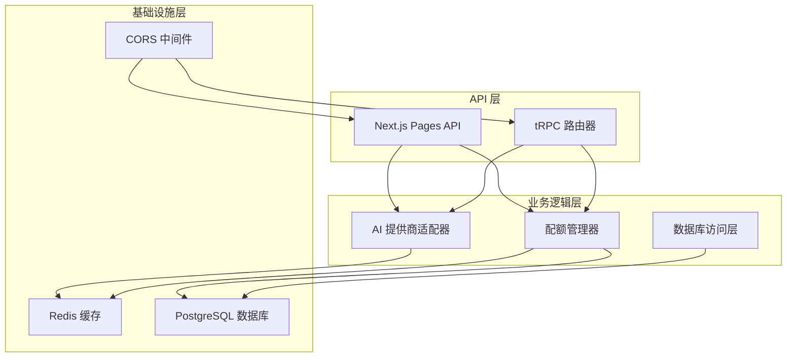
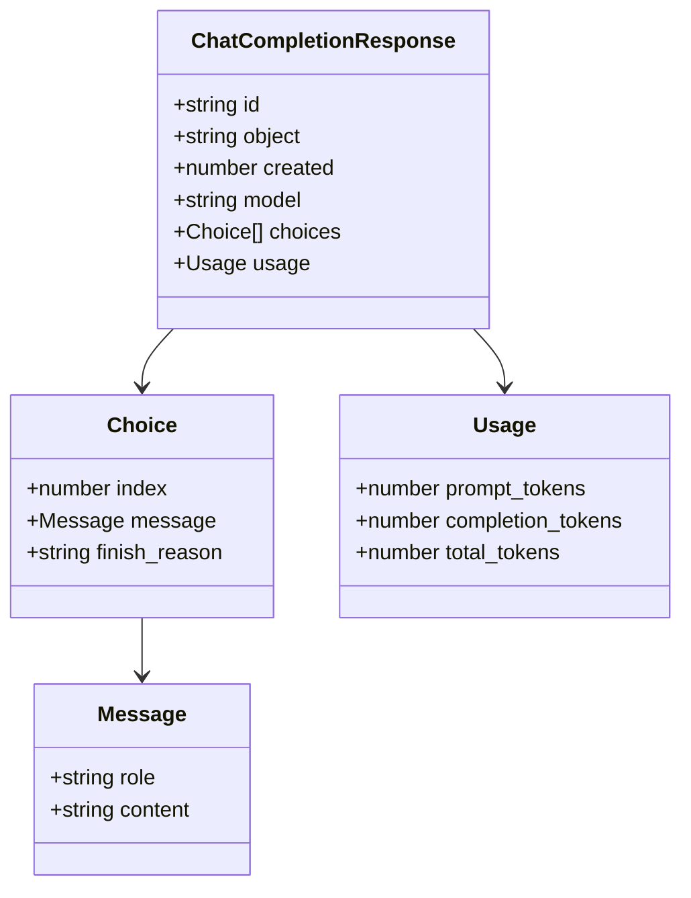
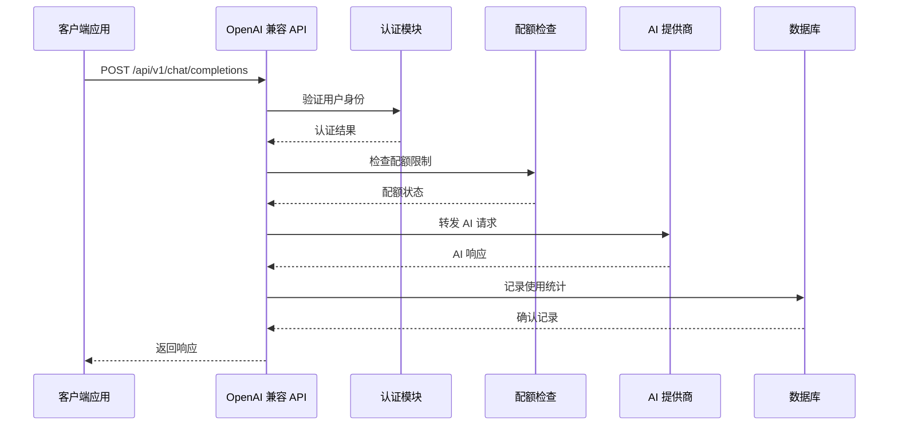
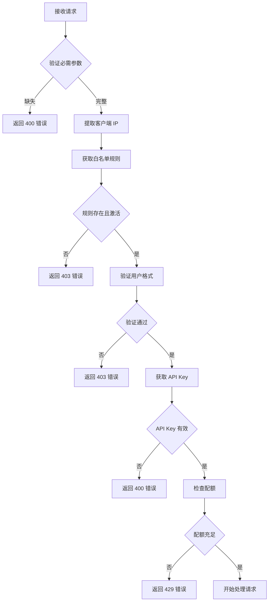
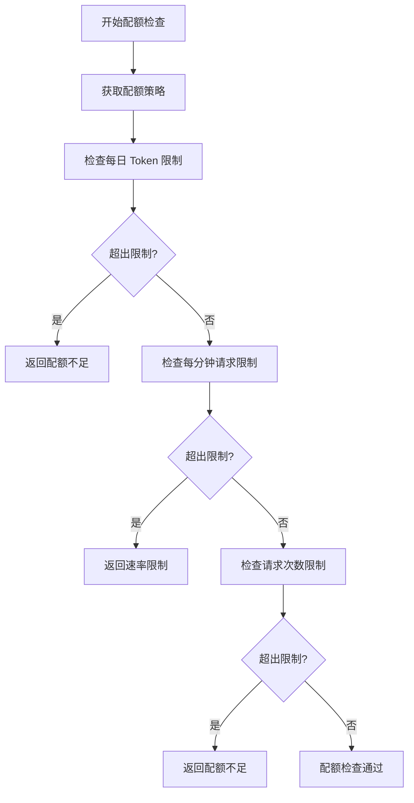
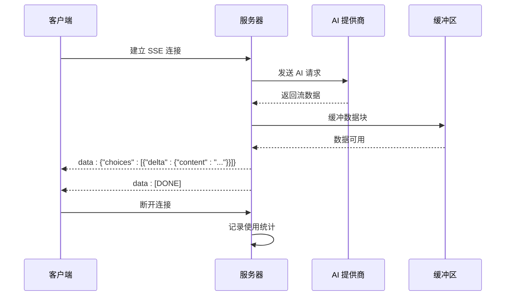
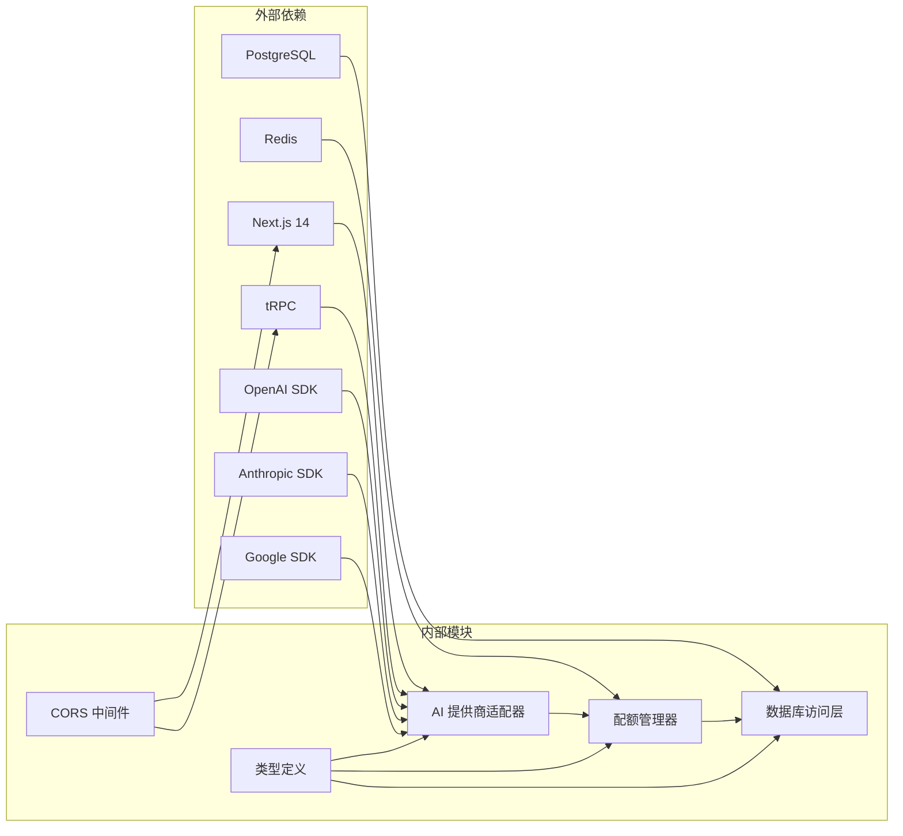
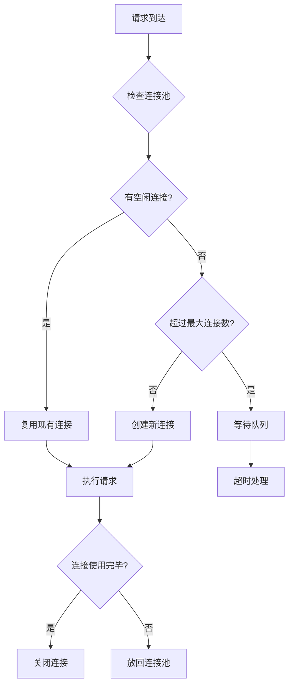
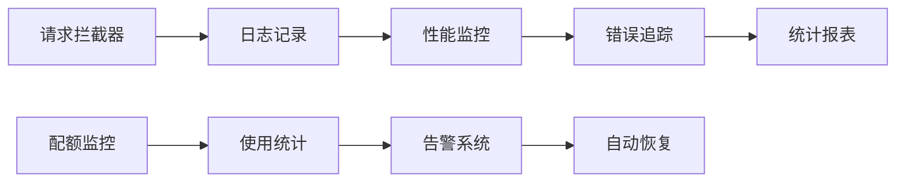

# OpenAI 兼容接口

<cite>
**本文档引用的文件**
- [src/pages/api/ai/chat/stream.ts](file://src/pages/api/ai/chat/stream.ts)
- [src/lib/ai-providers.ts](file://src/lib/ai-providers.ts)
- [src/lib/quota.ts](file://src/lib/quota.ts)
- [src/server/api/routers/ai.ts](file://src/server/api/routers/ai.ts)
- [src/lib/types.ts](file://src/lib/types.ts)
- [src/lib/database.ts](file://src/lib/database.ts)
- [src/lib/schema.ts](file://src/lib/schema.ts)
- [src/lib/cors.ts](file://src/lib/cors.ts)
- [docs/ai-api.md](file://docs/ai-api.md)
- [README.md](file://README.md)
</cite>

## 目录
1. [简介](#简介)
2. [项目结构](#项目结构)
3. [核心组件](#核心组件)
4. [架构概览](#架构概览)
5. [详细组件分析](#详细组件分析)
6. [依赖关系分析](#依赖关系分析)
7. [性能考虑](#性能考虑)
8. [故障排除指南](#故障排除指南)
9. [结论](#结论)

## 简介

AIGate 是一个基于 Next.js 14 + tRPC + Redis 的智能 AI 网关管理系统，专门设计用于提供 OpenAI 兼容的 API 接口。该系统支持多模型代理、智能配额管理和高性能架构，能够统一接入 OpenAI、Anthropic、Google、DeepSeek、Moonshot 和 Spark 等主流 AI 服务商。

本项目的核心目标是为开发者提供一个功能完整、安全可靠的 AI 接口网关，支持流式响应、配额控制和详细的使用统计功能。

## 项目结构

项目采用模块化的架构设计，主要分为以下几个核心部分：

**图表来源**
- [src/pages/api/ai/chat/stream.ts](file://src/pages/api/ai/chat/stream.ts#L1-L184)
- [src/server/api/routers/ai.ts](file://src/server/api/routers/ai.ts#L1-L301)

**章节来源**
- [src/pages/api/ai/chat/stream.ts](file://src/pages/api/ai/chat/stream.ts#L1-L184)
- [src/server/api/routers/ai.ts](file://src/server/api/routers/ai.ts#L1-L301)

## 核心组件

### OpenAI 兼容接口规范

系统提供了完整的 OpenAI 兼容 API 接口，支持标准的聊天完成功能：

| 组件 | 描述 | 支持的功能 |
|------|------|------------|
| **基础路径** | `/api/v1/chat/completions` | OpenAI 兼容接口 |
| **认证方式** | `X-User-ID` 头部 + `apiKeyId` 参数 | 用户身份验证 |
| **请求方法** | `POST` | HTTP POST 请求 |
| **响应格式** | JSON | 标准 OpenAI 响应格式 |

### 请求参数规范

| 参数名 | 类型 | 必需 | 描述 | 示例值 |
|--------|------|------|------|--------|
| `apiKeyId` | string | ✓ | API 密钥标识符 | `"key-12345"` |
| `userId` | string | ✓ | 用户唯一标识 | `"user@example.com"` |
| `model` | string | ✓ | AI 模型名称 | `"gpt-4o"` |
| `messages` | array | ✓ | 对话消息数组 | `[{"role": "user", "content": "Hello"}]` |
| `temperature` | number | ○ | 采样温度 (0-2) | `0.7` |
| `max_tokens` | number | ○ | 最大生成 token 数 | `1000` |
| `stream` | boolean | ○ | 是否启用流式响应 | `true` |

### 响应数据结构

系统完全兼容 OpenAI 的响应格式，支持标准的聊天完成响应：

**图表来源**
- [src/lib/types.ts](file://src/lib/types.ts#L93-L118)

**章节来源**
- [src/lib/types.ts](file://src/lib/types.ts#L48-L118)
- [docs/ai-api.md](file://docs/ai-api.md#L67-L106)

## 架构概览

系统采用分层架构设计，确保高可用性和可扩展性：

**图表来源**
- [src/pages/api/ai/chat/stream.ts](file://src/pages/api/ai/chat/stream.ts#L20-L182)
- [src/lib/quota.ts](file://src/lib/quota.ts#L79-L200)

## 详细组件分析

### 认证与授权流程

系统实现了多层次的安全认证机制：

**图表来源**
- [src/pages/api/ai/chat/stream.ts](file://src/pages/api/ai/chat/stream.ts#L20-L86)

### Token 估算机制

系统提供了智能的 Token 估算功能：

| 估算方法 | 算法描述 | 准确度 |
|----------|----------|--------|
| **字符计数法** | 基于字符长度估算，约 4 个字符 = 1 个 token | 中等 |
| **消息分析法** | 分析消息结构和内容复杂度 | 较高 |
| **模型特定法** | 根据不同模型特性调整估算 | 最高 |

### 配额检查流程

系统支持双重配额检查机制：

**图表来源**
- [src/lib/quota.ts](file://src/lib/quota.ts#L79-L200)

### 使用记录机制

系统完整记录每次 AI 请求的使用情况：

| 记录字段 | 类型 | 描述 | 存储位置 |
|----------|------|------|----------|
| `id` | string | 请求唯一标识 | Redis 缓存 |
| `userId` | string | 用户标识 | Redis 缓存 |
| `requestId` | string | 请求 ID | Redis 缓存 |
| `model` | string | 使用模型 | PostgreSQL |
| `provider` | string | AI 提供商 | PostgreSQL |
| `promptTokens` | number | 输入 token 数 | PostgreSQL |
| `completionTokens` | number | 输出 token 数 | PostgreSQL |
| `totalTokens` | number | 总 token 数 | PostgreSQL |
| `timestamp` | string | 请求时间 | PostgreSQL |
| `cost` | number | 成本估算 | PostgreSQL |
| `region` | string | 用户地区 | PostgreSQL |
| `clientIp` | string | 客户端 IP | PostgreSQL |

**章节来源**
- [src/lib/quota.ts](file://src/lib/quota.ts#L202-L260)
- [src/lib/schema.ts](file://src/lib/schema.ts#L54-L68)

### SSE 流式传输机制

系统支持高效的 Server-Sent Events (SSE) 流式传输：

**图表来源**
- [src/pages/api/ai/chat/stream.ts](file://src/pages/api/ai/chat/stream.ts#L95-L175)

**章节来源**
- [src/pages/api/ai/chat/stream.ts](file://src/pages/api/ai/chat/stream.ts#L95-L175)

## 依赖关系分析

系统的关键依赖关系如下：

**图表来源**
- [src/lib/ai-providers.ts](file://src/lib/ai-providers.ts#L1-L759)
- [src/lib/quota.ts](file://src/lib/quota.ts#L1-L327)

**章节来源**
- [src/lib/ai-providers.ts](file://src/lib/ai-providers.ts#L688-L695)
- [src/lib/database.ts](file://src/lib/database.ts#L1-L692)

## 性能考虑

### 缓存策略

系统采用多层缓存策略优化性能：

| 缓存层级 | 缓存内容 | 过期时间 | 作用 |
|----------|----------|----------|------|
| **Redis 缓存** | API Key | 1 小时 | 减少数据库查询 |
| **Redis 缓存** | 配额策略 | 1 小时 | 提高配额检查速度 |
| **Redis 缓存** | 使用记录 | 24 小时 | 快速获取统计信息 |
| **浏览器缓存** | 静态资源 | 1 周 | 减少带宽使用 |

### 连接池管理

系统实现了智能的连接池管理：

### 错误处理与重试

系统实现了完善的错误处理机制：

| 错误类型 | 处理策略 | 重试次数 |
|----------|----------|----------|
| **网络超时** | 自动重试 | 3 次 |
| **API 限流** | 指数退避 | 5 次 |
| **数据库连接失败** | 连接池重建 | 无限次 |
| **内存不足** | 清理缓存 | 1 次 |

## 故障排除指南

### 常见错误及解决方案

| 错误代码 | 错误类型 | 可能原因 | 解决方案 |
|----------|----------|----------|----------|
| **400** | BAD_REQUEST | 参数缺失或格式错误 | 检查请求参数完整性 |
| **403** | FORBIDDEN | 用户未授权或白名单验证失败 | 验证用户权限和 API Key 绑定 |
| **404** | NOT_FOUND | 端点不存在 | 确认使用正确的 API 路径 |
| **429** | TOO_MANY_REQUESTS | 配额不足或速率限制 | 检查配额状态或降低请求频率 |
| **500** | INTERNAL_SERVER_ERROR | 服务器内部错误 | 查看服务器日志并重启服务 |

### 调试工具

系统提供了多种调试工具：

**章节来源**
- [src/lib/quota.ts](file://src/lib/quota.ts#L189-L199)
- [src/lib/database.ts](file://src/lib/database.ts#L280-L290)

## 结论

AIGate OpenAI 兼容接口提供了一个功能完整、性能优异的 AI 网关解决方案。通过智能的配额管理、高效的流式传输和全面的监控功能，该系统能够满足各种规模的应用需求。

### 主要优势

1. **完全兼容**：严格遵循 OpenAI API 规范，无缝集成现有应用
2. **智能配额**：基于 Redis 的实时配额检查，支持多种限制模式
3. **高性能架构**：多层缓存和连接池优化，确保低延迟响应
4. **安全可靠**：多层次认证和授权机制，保障系统安全
5. **易于扩展**：模块化设计，支持新增 AI 提供商和功能扩展

### 适用场景

- **企业级应用**：需要严格控制 AI 使用成本和配额的企业应用
- **SaaS 服务**：多租户环境下需要独立配额管理的平台服务
- **研究项目**：需要详细使用统计和成本分析的研究项目
- **开发测试**：需要模拟和测试 AI 功能的开发环境

通过本文档提供的完整规范和最佳实践，开发者可以快速集成和部署 AIGate OpenAI 兼容接口，为用户提供优质的 AI 服务体验。