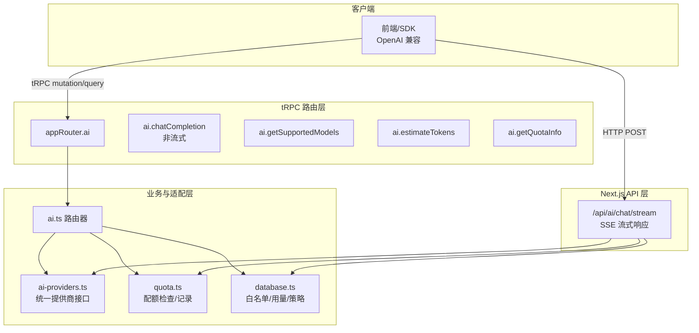
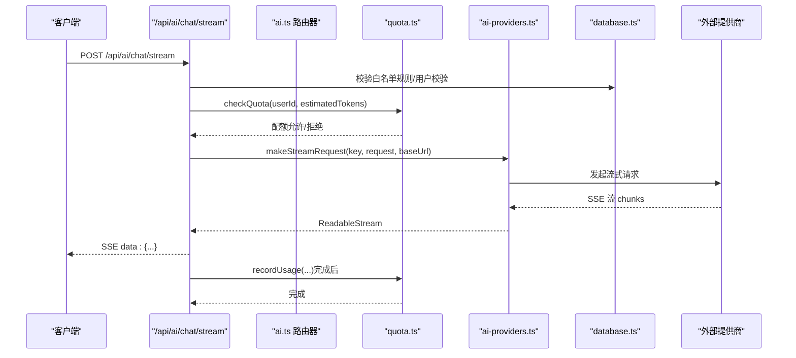
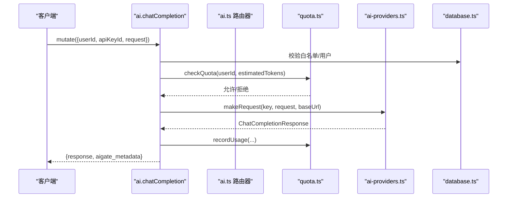
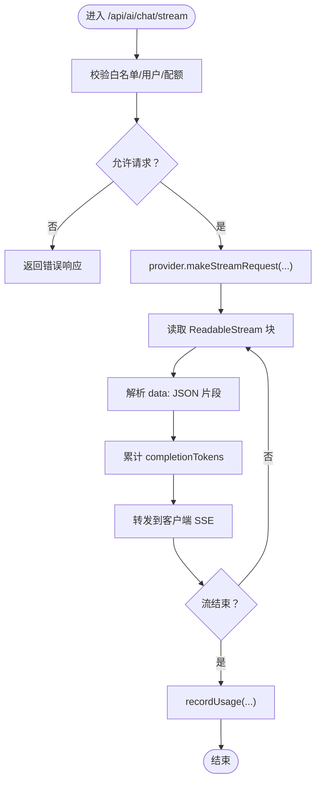
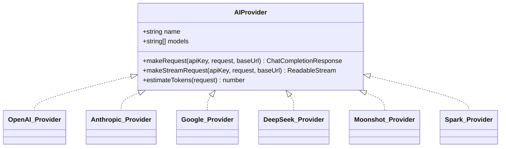
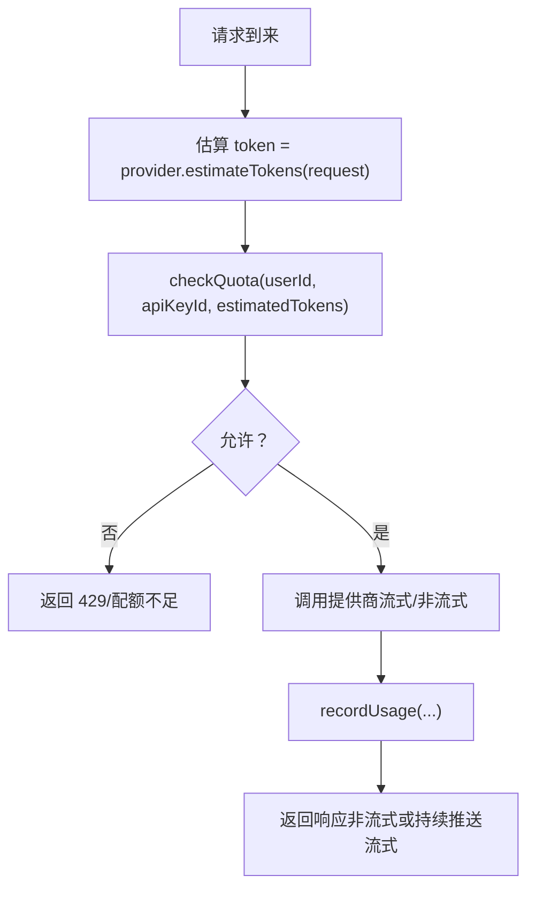
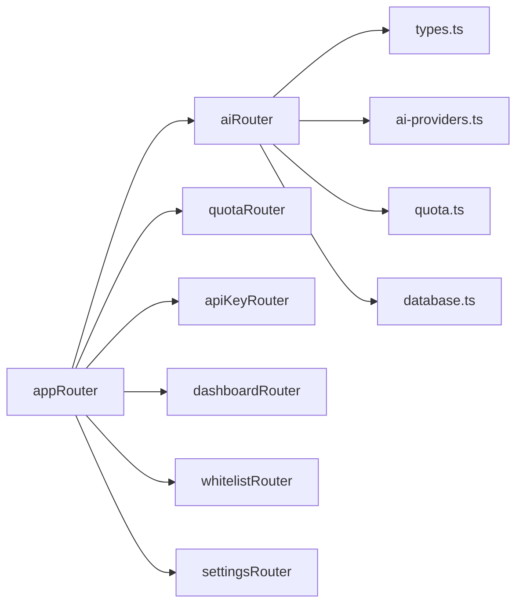

# AI 聊天路由

<cite>
**本文引用的文件**
- [src/pages/api/ai/chat/stream.ts](file://src/pages/api/ai/chat/stream.ts)
- [src/server/api/routers/ai.ts](file://src/server/api/routers/ai.ts)
- [src/lib/ai-providers.ts](file://src/lib/ai-providers.ts)
- [src/lib/types.ts](file://src/lib/types.ts)
- [src/lib/quota.ts](file://src/lib/quota.ts)
- [src/lib/database.ts](file://src/lib/database.ts)
- [src/server/api/root.ts](file://src/server/api/root.ts)
- [src/utils/api.ts](file://src/utils/api.ts)
- [docs/ai-api.md](file://docs/ai-api.md)
- [README.md](file://README.md)
- [package.json](file://package.json)
</cite>

## 目录
1. [简介](#简介)
2. [项目结构](#项目结构)
3. [核心组件](#核心组件)
4. [架构总览](#架构总览)
5. [详细组件分析](#详细组件分析)
6. [依赖关系分析](#依赖关系分析)
7. [性能考量](#性能考量)
8. [故障排查指南](#故障排查指南)
9. [结论](#结论)
10. [附录](#附录)

## 简介
本文件为 AIGate 项目的 AI 聊天路由详细 API 文档，聚焦于聊天相关端点、流式响应处理、消息历史管理与模型选择功能。文档涵盖：
- OpenAI 兼容的聊天接口实现与统一调用
- 流式响应（Server-Sent Events）与非流式响应处理
- 配额检查与用量记录（Token/请求次数）
- 白名单规则校验与用户标识生成
- 请求/响应示例与客户端集成指南

## 项目结构
AI 聊天路由涉及三层：
- Next.js API 层：提供 /api/ai/chat/stream（SSE 流式）与 tRPC 路由层：提供 ai.chatCompletion、ai.getSupportedModels、ai.estimateTokens、ai.getQuotaInfo 等端点
- 业务路由器层：在 src/server/api/routers/ai.ts 中实现聊天请求的鉴权、配额、模型选择与调用
- 适配层：在 src/lib/ai-providers.ts 中统一对接 OpenAI、Anthropic、Google、DeepSeek、Moonshot、Spark 等提供商

图表来源
- [src/server/api/root.ts](file://src/server/api/root.ts#L14-L21)
- [src/server/api/routers/ai.ts](file://src/server/api/routers/ai.ts#L88-L301)
- [src/pages/api/ai/chat/stream.ts](file://src/pages/api/ai/chat/stream.ts#L10-L184)
- [src/lib/ai-providers.ts](file://src/lib/ai-providers.ts#L688-L759)
- [src/lib/quota.ts](file://src/lib/quota.ts#L79-L200)
- [src/lib/database.ts](file://src/lib/database.ts#L317-L545)

章节来源
- [src/server/api/root.ts](file://src/server/api/root.ts#L14-L21)
- [src/server/api/routers/ai.ts](file://src/server/api/routers/ai.ts#L88-L301)
- [src/pages/api/ai/chat/stream.ts](file://src/pages/api/ai/chat/stream.ts#L10-L184)
- [src/lib/ai-providers.ts](file://src/lib/ai-providers.ts#L688-L759)
- [src/lib/quota.ts](file://src/lib/quota.ts#L79-L200)
- [src/lib/database.ts](file://src/lib/database.ts#L317-L545)

## 核心组件
- 聊天完成（非流式）：ai.chatCompletion，支持 OpenAI 兼容参数，返回标准 ChatCompletion 响应并附加 aigate_metadata
- 流式聊天：/api/ai/chat/stream，SSE 协议，逐块推送 choices.delta.content
- 模型查询：ai.getSupportedModels，返回所有可用模型与提供商映射
- Token 估算：ai.estimateTokens，按消息文本估算 token 数
- 配额信息：ai.getQuotaInfo，返回策略、使用量与剩余配额
- 提供商适配：统一 AIProvider 接口，内置 OpenAI、Anthropic、Google、DeepSeek、Moonshot、Spark

章节来源
- [src/server/api/routers/ai.ts](file://src/server/api/routers/ai.ts#L88-L301)
- [src/pages/api/ai/chat/stream.ts](file://src/pages/api/ai/chat/stream.ts#L10-L184)
- [src/lib/ai-providers.ts](file://src/lib/ai-providers.ts#L12-L27)

## 架构总览
下图展示从客户端到提供商的调用链路，以及配额与用量记录的关键节点。

图表来源
- [src/pages/api/ai/chat/stream.ts](file://src/pages/api/ai/chat/stream.ts#L10-L184)
- [src/server/api/routers/ai.ts](file://src/server/api/routers/ai.ts#L107-L213)
- [src/lib/quota.ts](file://src/lib/quota.ts#L79-L200)
- [src/lib/ai-providers.ts](file://src/lib/ai-providers.ts#L58-L95)
- [src/lib/database.ts](file://src/lib/database.ts#L456-L545)

## 详细组件分析

### 1) 非流式聊天完成（tRPC）
- 端点：ai.chatCompletion（mutation）
- 功能：校验白名单、用户校验、配额检查、模型选择、调用提供商、记录用量、返回标准响应与 aigate_metadata
- 关键行为：
  - 若 request.stream 为 true，抛出 BAD_REQUEST，提示改用 /api/ai/chat/stream
  - 使用 provider.estimateTokens 估算 token，再 checkQuota
  - 调用 provider.makeRequest，构造 UsageRecord 并 recordUsage
  - 返回响应包含 aigate_metadata：requestId、provider、processingTime、quotaRemaining

图表来源
- [src/server/api/routers/ai.ts](file://src/server/api/routers/ai.ts#L98-L213)
- [src/lib/quota.ts](file://src/lib/quota.ts#L79-L200)
- [src/lib/ai-providers.ts](file://src/lib/ai-providers.ts#L37-L57)
- [src/lib/database.ts](file://src/lib/database.ts#L456-L545)

章节来源
- [src/server/api/routers/ai.ts](file://src/server/api/routers/ai.ts#L88-L213)
- [src/lib/types.ts](file://src/lib/types.ts#L47-L118)

### 2) 流式聊天（SSE）
- 端点：/api/ai/chat/stream（Next.js API）
- 协议：text/event-stream；SSE
- 行为：
  - 校验白名单与用户，校验配额
  - 校验 provider 是否支持 makeStreamRequest
  - 设置 SSE 响应头，逐块转发提供商返回的流
  - 解析 data: 块中的 choices.delta.content 累计 completionTokens
  - 完成后发送 data: [DONE]，记录用量

图表来源
- [src/pages/api/ai/chat/stream.ts](file://src/pages/api/ai/chat/stream.ts#L10-L184)
- [src/lib/quota.ts](file://src/lib/quota.ts#L202-L260)
- [src/lib/ai-providers.ts](file://src/lib/ai-providers.ts#L58-L95)

章节来源
- [src/pages/api/ai/chat/stream.ts](file://src/pages/api/ai/chat/stream.ts#L10-L184)

### 3) 模型选择与提供商适配
- 模型到提供商映射：getProviderByModel
- 统一接口：AIProvider（makeRequest、makeStreamRequest、estimateTokens）
- 已支持提供商：OpenAI、Anthropic、Google、DeepSeek、Moonshot、Spark
- 估算 token：基于消息内容字符数估算

图表来源
- [src/lib/ai-providers.ts](file://src/lib/ai-providers.ts#L12-L27)
- [src/lib/ai-providers.ts](file://src/lib/ai-providers.ts#L34-L100)
- [src/lib/ai-providers.ts](file://src/lib/ai-providers.ts#L102-L282)
- [src/lib/ai-providers.ts](file://src/lib/ai-providers.ts#L284-L469)
- [src/lib/ai-providers.ts](file://src/lib/ai-providers.ts#L471-L613)
- [src/lib/ai-providers.ts](file://src/lib/ai-providers.ts#L615-L685)

章节来源
- [src/lib/ai-providers.ts](file://src/lib/ai-providers.ts#L697-L707)

### 4) 配额与用量
- 配额策略：按 apiKeyId 关联白名单规则与配额策略（token/request 两种模式）
- 检查逻辑：每日 token 限额、每日请求次数限额、每分钟请求次数（RPM）
- 记录用量：Redis 增量计数 + 数据库存储 UsageRecord
- 查询配额：ai.getQuotaInfo 返回策略、使用量与剩余配额

图表来源
- [src/server/api/routers/ai.ts](file://src/server/api/routers/ai.ts#L161-L174)
- [src/lib/quota.ts](file://src/lib/quota.ts#L79-L200)
- [src/lib/quota.ts](file://src/lib/quota.ts#L202-L260)

章节来源
- [src/lib/quota.ts](file://src/lib/quota.ts#L17-L76)
- [src/lib/quota.ts](file://src/lib/quota.ts#L79-L200)
- [src/lib/quota.ts](file://src/lib/quota.ts#L202-L296)

### 5) 白名单与用户校验
- 根据 apiKeyId 获取白名单规则并校验 userId 格式
- 支持通过规则中的 userIdPattern 生成最终用户标识（可包含 @user_id/@api_key/@ip 占位符）
- 若规则未激活或未绑定，返回 FORBIDDEN

章节来源
- [src/lib/database.ts](file://src/lib/database.ts#L456-L545)
- [src/server/api/routers/ai.ts](file://src/server/api/routers/ai.ts#L108-L130)
- [src/pages/api/ai/chat/stream.ts](file://src/pages/api/ai/chat/stream.ts#L32-L50)

### 6) OpenAI 兼容接口
- tRPC 路由：ai.chatCompletion
- Next.js API：/api/ai/chat/stream
- 支持的模型：gpt-4o、gpt-4o-mini、gpt-4-turbo、claude-3-opus/sonnet/haiku、gemini-pro/ultra、deepseek-chat/coder、moonshot-v1-8k/32k、spark-v3.5 等
- 响应格式：标准 ChatCompletionResponse，附加 aigate_metadata

章节来源
- [docs/ai-api.md](file://docs/ai-api.md#L18-L116)
- [src/lib/ai-providers.ts](file://src/lib/ai-providers.ts#L688-L707)

## 依赖关系分析
- tRPC 路由聚合：appRouter 汇总 ai、quota、apiKey、dashboard、whitelist、settings
- 类型安全：通过 src/utils/api.ts 推断 RouterInputs/Outputs
- 外部依赖：openai、@anthropic-ai/sdk、@google/generative-ai、redis、drizzle-orm

图表来源
- [src/server/api/root.ts](file://src/server/api/root.ts#L14-L21)
- [src/utils/api.ts](file://src/utils/api.ts#L1-L17)

章节来源
- [src/server/api/root.ts](file://src/server/api/root.ts#L14-L21)
- [src/utils/api.ts](file://src/utils/api.ts#L1-L17)
- [package.json](file://package.json#L18-L68)

## 性能考量
- 流式传输：SSE 降低首字节延迟，适合实时 UI 呈现
- Redis 缓存：配额策略与 API Key 缓存减少数据库压力
- 估算 token：在配额检查前进行，避免无效请求
- 体积控制：流式响应按块转发，避免一次性累积大量数据

## 故障排查指南
- 403 Forbidden：白名单规则未绑定或未激活；userId 格式不匹配；生成用户ID失败
- 400 Bad Request：API Key 不存在/禁用；不支持的提供商；非流式请求却设置了 stream=true
- 405 Method Not Allowed：仅支持 POST
- 429 Too Many Requests：超出每日 token 限额、请求次数限额或 RPM 限额
- 500 Internal Server Error：内部异常；检查日志与网络连通性
- 流式错误：解析失败时忽略单行错误；确保客户端正确处理 [DONE] 信号

章节来源
- [src/pages/api/ai/chat/stream.ts](file://src/pages/api/ai/chat/stream.ts#L16-L18)
- [src/pages/api/ai/chat/stream.ts](file://src/pages/api/ai/chat/stream.ts#L36-L49)
- [src/pages/api/ai/chat/stream.ts](file://src/pages/api/ai/chat/stream.ts#L56-L67)
- [src/pages/api/ai/chat/stream.ts](file://src/pages/api/ai/chat/stream.ts#L82-L86)
- [src/pages/api/ai/chat/stream.ts](file://src/pages/api/ai/chat/stream.ts#L172-L175)
- [src/server/api/routers/ai.ts](file://src/server/api/routers/ai.ts#L110-L115)
- [src/server/api/routers/ai.ts](file://src/server/api/routers/ai.ts#L137-L142)
- [src/server/api/routers/ai.ts](file://src/server/api/routers/ai.ts#L169-L174)
- [src/server/api/routers/ai.ts](file://src/server/api/routers/ai.ts#L207-L212)

## 结论
本项目通过统一的 AIProvider 接口与 tRPC 路由，实现了 OpenAI 兼容的聊天接口、灵活的流式与非流式响应、完善的配额与用量管理，以及可扩展的多提供商支持。结合白名单规则与用户校验，满足多租户场景下的安全与成本控制需求。

## 附录

### A. 端点一览与参数
- ai.chatCompletion（mutation）
  - 输入：userId、apiKeyId、request（model、messages、temperature、max_tokens、stream）
  - 输出：标准 ChatCompletionResponse + aigate_metadata
- /api/ai/chat/stream（POST）
  - 输入：userId、apiKeyId、request（stream 必须为 true）
  - 输出：SSE 流，逐块 data: {...}，最后 [DONE]
- ai.getSupportedModels（query）
  - 输出：[{ model, provider }]
- ai.estimateTokens（query）
  - 输入：同上
  - 输出：{ estimatedTokens }
- ai.getQuotaInfo（mutation）
  - 输入：{ userId, apiKeyId }
  - 输出：策略、使用量与剩余配额

章节来源
- [src/server/api/routers/ai.ts](file://src/server/api/routers/ai.ts#L88-L301)
- [src/pages/api/ai/chat/stream.ts](file://src/pages/api/ai/chat/stream.ts#L10-L184)
- [docs/ai-api.md](file://docs/ai-api.md#L18-L596)

### B. 客户端集成要点
- 非流式：使用 tRPC 客户端调用 ai.chatCompletion，解析 response.choices[0].message.content
- 流式：使用 fetch 或 EventSource 订阅 /api/ai/chat/stream，逐块拼接 choices.delta.content，遇到 [DONE] 结束
- 配额检查：先调用 ai.estimateTokens 估算 token，再调用 ai.getQuotaInfo 检查剩余配额
- 错误处理：区分 TOO_MANY_REQUESTS、FORBIDDEN、BAD_REQUEST、INTERNAL_SERVER_ERROR 并给出相应提示

章节来源
- [docs/ai-api.md](file://docs/ai-api.md#L117-L788)
- [README.md](file://README.md#L52-L68)