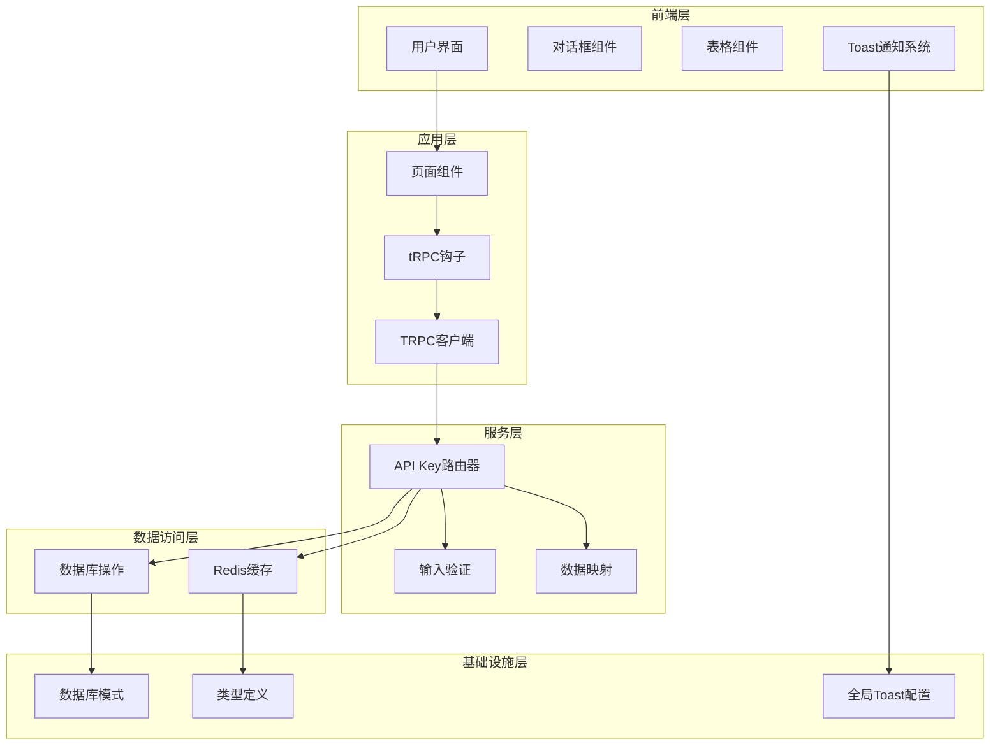
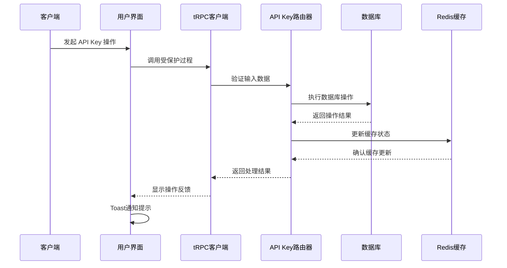
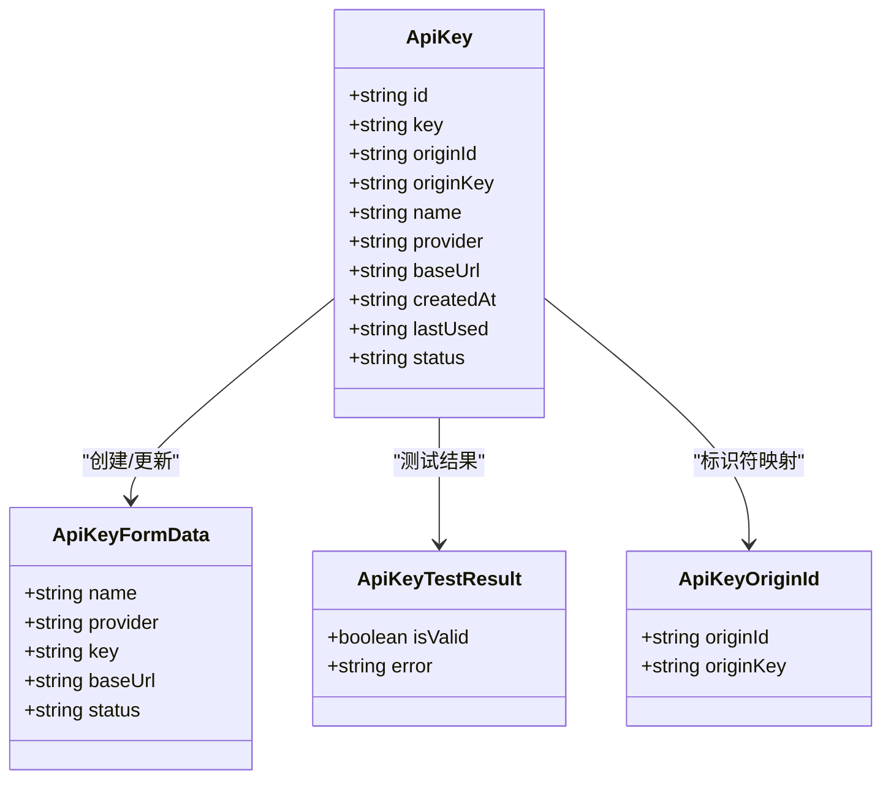
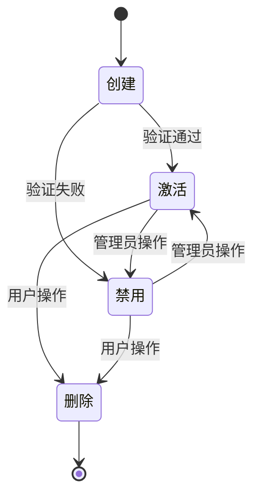
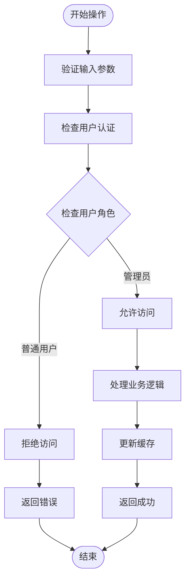
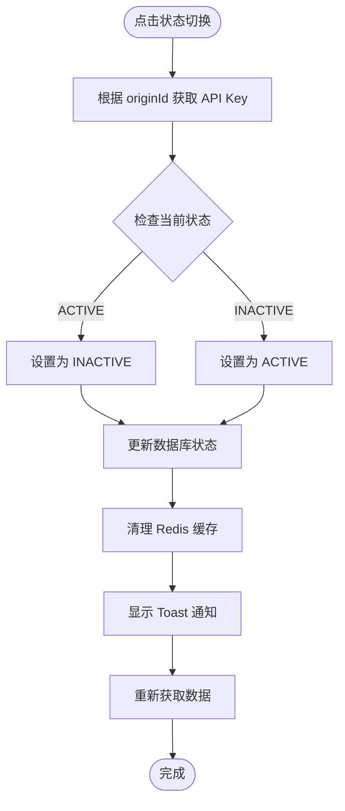
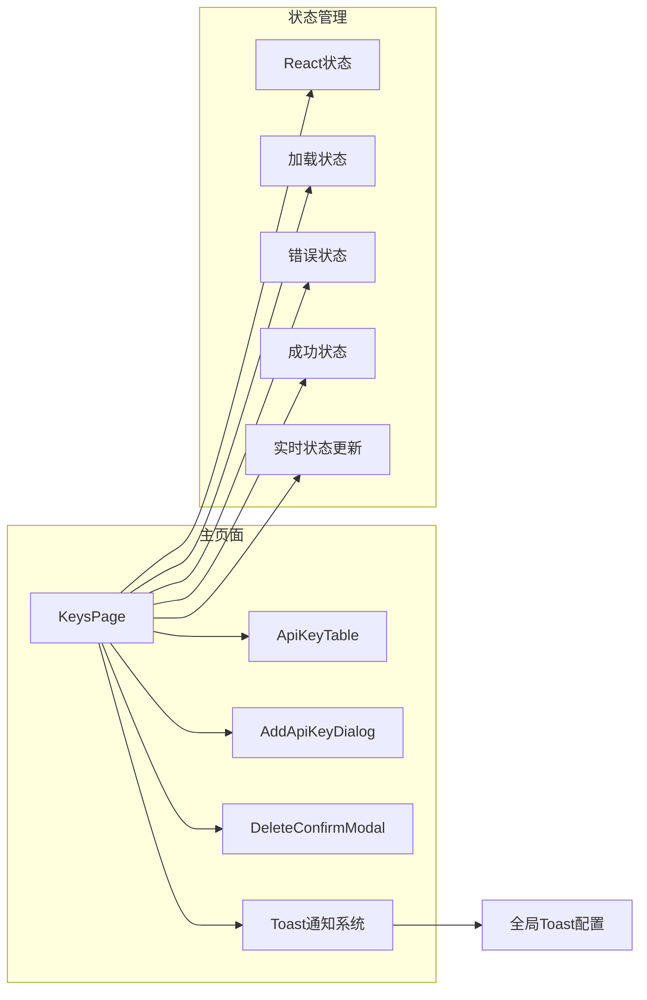
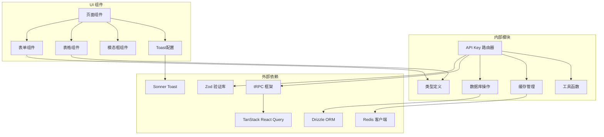

# API Key 管理路由

<cite>
**本文档引用的文件**
- [api-key.ts](file://src/server/api/routers/api-key.ts)
- [types.ts](file://src/lib/types.ts)
- [page.tsx](file://src/app/(dashboard)/keys/page.tsx)
- [add-api-key-dialog.tsx](file://src/app/(dashboard)/keys/components/add-api-key-dialog.tsx)
- [api-key-table.tsx](file://src/app/(dashboard)/keys/components/api-key-table.tsx)
- [delete-confirm-modal.tsx](file://src/app/(dashboard)/keys/components/delete-confirm-modal.tsx)
- [root.ts](file://src/server/api/root.ts)
- [database.ts](file://src/lib/database.ts)
- [redis.ts](file://src/lib/redis.ts)
- [schema.ts](file://src/lib/schema.ts)
- [ai.ts](file://src/server/api/routers/ai.ts)
- [sonner.tsx](file://src/components/ui/sonner.tsx)
- [trpc-provider.tsx](file://src/components/trpc-provider.tsx)
</cite>

## 更新摘要
**变更内容**
- 更新了 API Key 状态切换和删除操作使用 originId 字段的实现细节
- 增强了前端 Toast 通知系统的交互体验描述
- 完善了 API Key 数据模型中 originId 字段的作用说明
- 补充了 tRPC 集成和实时状态更新的说明

## 目录
1. [简介](#简介)
2. [项目结构](#项目结构)
3. [核心组件](#核心组件)
4. [架构概览](#架构概览)
5. [详细组件分析](#详细组件分析)
6. [依赖关系分析](#依赖关系分析)
7. [性能考虑](#性能考虑)
8. [故障排除指南](#故障排除指南)
9. [结论](#结论)

## 简介

API Key 管理路由是 AIGate 系统中的核心功能模块，负责管理与 AI 服务提供商的认证密钥。该模块提供了完整的 CRUD 操作，包括 API Key 的创建、查询、更新、删除以及状态切换功能。系统支持多种 AI 服务提供商，包括 OpenAI、Anthropic、Google、DeepSeek、Moonshot 和星火大模型，并集成了 Redis 缓存机制和严格的权限验证。

**更新** 本版本增强了前端交互体验，通过 Toast 通知系统提供即时的操作反馈，同时优化了 API Key 标识符的使用，确保与后端 API 的正确交互。

## 项目结构

API Key 管理功能采用分层架构设计，主要由以下层次组成：

**图表来源**
- [api-key.ts:68-376](file://src/server/api/routers/api-key.ts#L68-L376)
- [page.tsx](file://src/app/(dashboard)/keys/page.tsx#L13-L193)
- [sonner.tsx:1-45](file://src/components/ui/sonner.tsx#L1-L45)

**章节来源**
- [api-key.ts:1-377](file://src/server/api/routers/api-key.ts#L1-L377)
- [root.ts:14-21](file://src/server/api/root.ts#L14-L21)

## 核心组件

### API Key 路由器

API Key 路由器是整个模块的核心，提供了完整的 CRUD 操作和状态管理功能。路由器继承自 `protectedProcedure`，确保所有操作都需要经过身份验证。

### 数据库操作层

数据库操作层封装了所有与 API Key 相关的数据库交互，包括查询、插入、更新和删除操作。所有数据库操作都通过类型安全的 Drizzle ORM 实现。

### 缓存管理层

系统使用 Redis 作为缓存层，存储活跃的 API Key 信息，提高系统的响应性能。缓存键采用统一的命名规范，便于管理和维护。

**更新** 增强了缓存管理的智能清理机制，当 API Key 状态变为禁用时会自动清理相关缓存，确保数据一致性。

**章节来源**
- [api-key.ts:19-81](file://src/server/api/routers/api-key.ts#L19-L81)
- [redis.ts:18-42](file://src/lib/redis.ts#L18-L42)

## 架构概览

API Key 管理系统的整体架构采用分层设计，确保了良好的可维护性和扩展性：

**图表来源**
- [api-key.ts:132-175](file://src/server/api/routers/api-key.ts#L132-L175)
- [database.ts:52-80](file://src/lib/database.ts#L52-L80)
- [trpc-provider.tsx:38-54](file://src/components/trpc-provider.tsx#L38-L54)

## 详细组件分析

### API Key 数据模型

API Key 的数据模型定义了密钥的基本属性和约束条件，特别强调了标识符的双重用途：

**更新** 新增了 `originId` 和 `originKey` 字段，用于后端数据库标识符与前端显示标识符的分离，确保 API Key 操作的准确性和安全性。

**图表来源**
- [types.ts:19-31](file://src/lib/types.ts#L19-L31)
- [api-key.ts:2-13](file://src/types/api-key.ts#L2-L13)

### API Key 生命周期管理

API Key 的生命周期管理涵盖了从创建到删除的完整流程：

**更新** 优化了状态切换流程，确保在禁用状态下自动清理相关缓存，防止数据不一致。

**图表来源**
- [api-key.ts:272-322](file://src/server/api/routers/api-key.ts#L272-L322)
- [database.ts:72-80](file://src/lib/database.ts#L72-L80)

### 权限验证机制

系统采用多层权限验证确保 API Key 操作的安全性：

**图表来源**
- [api-key.ts:68-95](file://src/server/api/routers/api-key.ts#L68-L95)
- [ai.ts:134-142](file://src/server/api/routers/ai.ts#L134-L142)

### API Key 管理操作

#### 创建 API Key

创建 API Key 操作包含以下关键步骤：

1. **输入验证**：使用 Zod 验证器确保数据完整性
2. **ID 生成**：生成唯一的 API Key ID
3. **数据库存储**：将 API Key 信息持久化到数据库
4. **缓存更新**：更新 Redis 缓存以提高查询性能
5. **结果返回**：返回处理后的 API Key 信息

#### 查询 API Key

查询操作支持多种查询方式：

- **获取所有 API Key**：返回系统中所有的 API Key 列表
- **按 ID 查询**：根据唯一标识符获取特定的 API Key
- **按提供商查询**：获取特定提供商的所有 API Key

#### 更新 API Key

更新操作支持部分字段更新，包括：
- API Key 名称
- 提供商信息
- 密钥内容
- 基础 URL
- 状态控制

#### 删除 API Key

删除操作包含安全检查和缓存清理：
- 验证 API Key 存在性
- 执行数据库删除
- 清理相关缓存
- 返回操作结果

#### 状态切换

**更新** 状态切换功能现在使用正确的 `originId` 字段进行标识，确保与后端 API 的正确交互：

**图表来源**
- [api-key.ts:272-322](file://src/server/api/routers/api-key.ts#L272-L322)
- [page.tsx](file://src/app/(dashboard)/keys/page.tsx#L66-L74)

**章节来源**
- [api-key.ts:131-270](file://src/server/api/routers/api-key.ts#L131-L270)
- [types.ts:19-31](file://src/lib/types.ts#L19-L31)

### 前端用户界面

**更新** 前端界面现在集成了增强的 Toast 通知系统，提供即时的操作反馈：

**更新** 增强的交互体验包括：
- **即时反馈**：所有操作完成后显示相应的 Toast 通知
- **状态同步**：tRPC 自动同步状态变化，无需手动刷新
- **错误处理**：统一的错误处理和用户友好的错误提示
- **加载状态**：操作进行时的视觉反馈

**图表来源**
- [page.tsx](file://src/app/(dashboard)/keys/page.tsx#L13-L193)
- [api-key-table.tsx](file://src/app/(dashboard)/keys/components/api-key-table.tsx#L21-L193)
- [sonner.tsx:1-45](file://src/components/ui/sonner.tsx#L1-L45)

**章节来源**
- [page.tsx](file://src/app/(dashboard)/keys/page.tsx#L1-L194)
- [add-api-key-dialog.tsx](file://src/app/(dashboard)/keys/components/add-api-key-dialog.tsx#L1-L273)

## 依赖关系分析

API Key 管理模块的依赖关系体现了清晰的关注点分离：

**更新** 新增了 Sonner Toast 和 TanStack React Query 的依赖关系，增强了前端的实时状态管理和通知功能。

**图表来源**
- [api-key.ts:1-8](file://src/server/api/routers/api-key.ts#L1-L8)
- [root.ts:1-7](file://src/server/api/root.ts#L1-L7)
- [sonner.tsx:1-45](file://src/components/ui/sonner.tsx#L1-L45)
- [trpc-provider.tsx:1-64](file://src/components/trpc-provider.tsx#L1-L64)

**章节来源**
- [api-key.ts:1-8](file://src/server/api/routers/api-key.ts#L1-L8)
- [database.ts:1-4](file://src/lib/database.ts#L1-L4)

## 性能考虑

### 缓存策略

系统采用 Redis 缓存来优化 API Key 查询性能：

- **缓存键设计**：使用 `api_keys:{provider}` 格式存储
- **缓存过期时间**：设置 1 小时的 TTL，平衡性能和数据一致性
- **缓存更新策略**：在创建、更新、删除操作后及时更新缓存
- **智能清理**：禁用状态的 API Key 会自动清理缓存

### 数据库优化

- **索引设计**：为常用查询字段建立适当的索引
- **批量操作**：支持批量查询和更新操作
- **连接池管理**：合理配置数据库连接池大小

### 前端性能

- **虚拟滚动**：大量数据时使用虚拟滚动提升渲染性能
- **懒加载**：对话框和模态框采用懒加载技术
- **状态缓存**：避免不必要的重新渲染
- **实时更新**：tRPC 自动同步状态变化，减少手动刷新

**更新** 增加了智能缓存清理机制，当 API Key 状态发生变化时自动清理相关缓存，确保数据一致性。

## 故障排除指南

### 常见问题及解决方案

#### API Key 创建失败

**问题症状**：创建 API Key 时抛出 `INTERNAL_SERVER_ERROR`

**可能原因**：
1. 数据库连接异常
2. 输入数据验证失败
3. Redis 缓存更新失败

**解决步骤**：
1. 检查数据库连接状态
2. 验证输入数据格式
3. 查看 Redis 服务器状态
4. 检查应用日志

#### API Key 查询超时

**问题症状**：查询 API Key 时出现超时错误

**可能原因**：
1. 数据库查询性能问题
2. 缓存失效导致频繁数据库访问
3. 网络连接不稳定

**解决步骤**：
1. 优化数据库查询语句
2. 检查 Redis 缓存配置
3. 监控网络连接质量
4. 考虑增加数据库索引

#### 权限验证失败

**问题症状**：访问 API Key 操作时返回 `UNAUTHORIZED` 错误

**可能原因**：
1. 用户会话过期
2. 用户权限不足
3. 认证中间件配置错误

**解决步骤**：
1. 重新登录系统
2. 检查用户角色权限
3. 验证认证配置
4. 清除浏览器缓存

#### Toast 通知不显示

**问题症状**：操作完成后没有显示 Toast 通知

**可能原因**：
1. Sonner 配置问题
2. JavaScript 错误阻止了通知显示
3. 浏览器扩展阻止了通知

**解决步骤**：
1. 检查浏览器控制台错误
2. 验证 Sonner 组件是否正确导入
3. 禁用可能阻止通知的浏览器扩展
4. 检查网络连接状态

**章节来源**
- [api-key.ts:88-94](file://src/server/api/routers/api-key.ts#L88-L94)
- [ai.ts:137-142](file://src/server/api/routers/ai.ts#L137-L142)

## 结论

API Key 管理路由模块是 AIGate 系统的重要组成部分，提供了完整、安全、高效的 API Key 管理功能。通过采用分层架构设计、多层权限验证、智能缓存策略和完善的错误处理机制，该模块能够满足生产环境的各种需求。

**更新** 本版本的重大改进包括：
1. **增强的标识符管理**：使用 `originId` 字段确保后端 API 的正确交互
2. **即时反馈系统**：通过 Toast 通知提供更好的用户体验
3. **智能缓存清理**：自动清理禁用状态的 API Key 缓存
4. **实时状态同步**：tRPC 自动同步状态变化，无需手动刷新

### 主要优势

1. **安全性**：多层权限验证确保只有授权用户才能访问敏感操作
2. **性能**：Redis 缓存显著提升了查询性能
3. **可维护性**：清晰的代码结构和详细的注释便于维护
4. **扩展性**：模块化设计支持新功能的快速集成
5. **用户体验**：直观的前端界面和即时的反馈系统提供了优秀的操作体验
6. **实时性**：tRPC 实现实时状态更新，确保界面与数据保持同步

### 最佳实践建议

1. **定期审计**：定期审查 API Key 的使用情况和状态
2. **监控告警**：建立完善的监控和告警机制
3. **备份策略**：制定 API Key 数据的备份和恢复策略
4. **安全更新**：及时更新安全补丁和依赖包
5. **性能优化**：持续监控和优化系统性能
6. **用户体验**：利用 Toast 通知系统提供及时的操作反馈

该模块为构建可靠的 AI 应用程序奠定了坚实的基础，通过合理的使用和维护，能够为企业提供稳定、安全、高效的 API Key 管理服务。