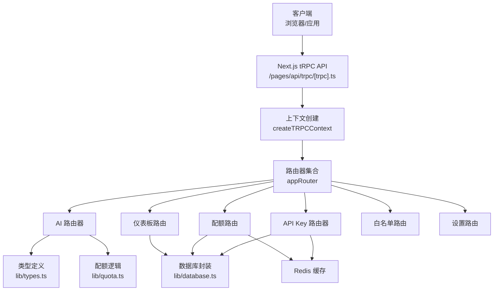
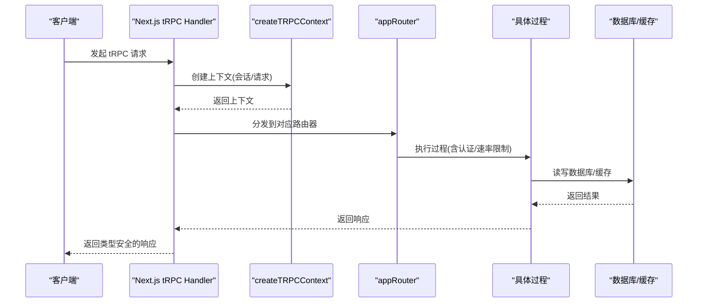
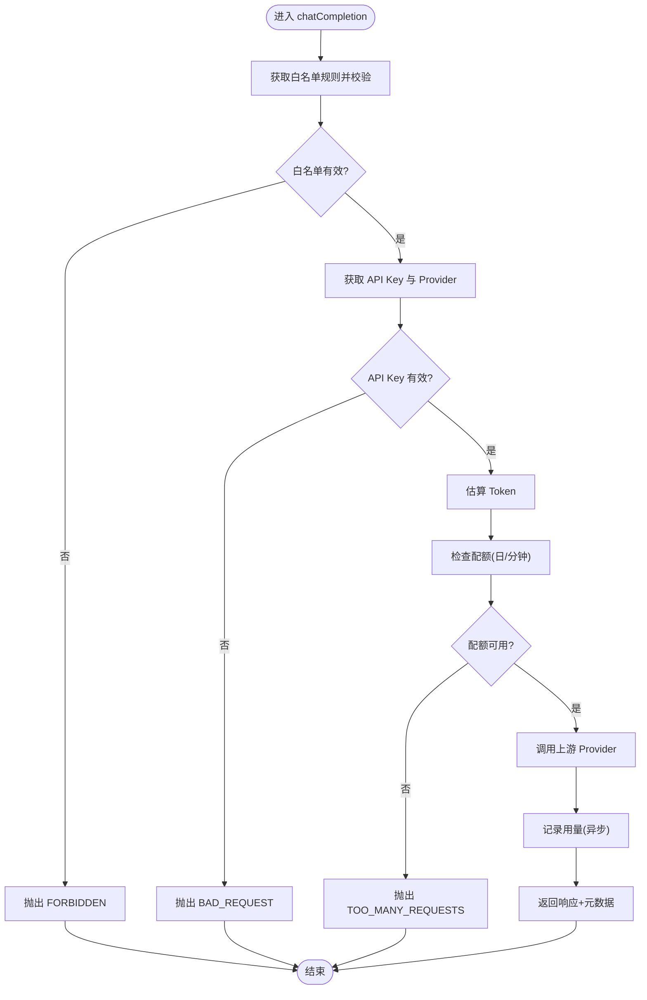
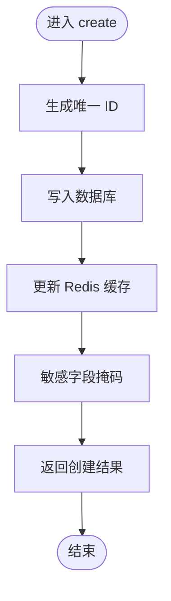
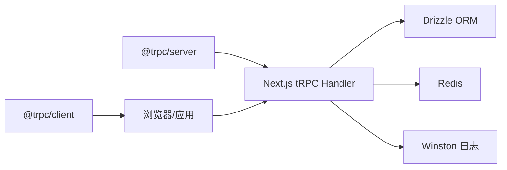

# tRPC API 接口

<cite>
**本文引用的文件**
- [src/server/api/root.ts](file://src/server/api/root.ts)
- [src/server/api/trpc.ts](file://src/server/api/trpc.ts)
- [src/server/api/routers/ai.ts](file://src/server/api/routers/ai.ts)
- [src/server/api/routers/api-key.ts](file://src/server/api/routers/api-key.ts)
- [src/server/api/routers/dashboard.ts](file://src/server/api/routers/dashboard.ts)
- [src/server/api/routers/quota.ts](file://src/server/api/routers/quota.ts)
- [src/server/api/routers/whitelist.ts](file://src/server/api/routers/whitelist.ts)
- [src/server/api/routers/settings.ts](file://src/server/api/routers/settings.ts)
- [src/lib/types.ts](file://src/lib/types.ts)
- [src/pages/api/trpc/[trpc].ts](file://src/pages/api/trpc/[trpc].ts)
- [src/lib/database.ts](file://src/lib/database.ts)
- [src/lib/quota.ts](file://src/lib/quota.ts)
- [package.json](file://package.json)
</cite>

## 目录
1. [简介](#简介)
2. [项目结构](#项目结构)
3. [核心组件](#核心组件)
4. [架构总览](#架构总览)
5. [详细组件分析](#详细组件分析)
6. [依赖关系分析](#依赖关系分析)
7. [性能考虑](#性能考虑)
8. [故障排除指南](#故障排除指南)
9. [结论](#结论)
10. [附录](#附录)

## 简介
本文件为 AIGate 项目的 tRPC API 接口完整参考文档，覆盖以下功能模块：
- AI 聊天：聊天完成、模型列表查询、Token 估算、配额信息查询
- API Key 管理：创建、查询、更新、删除、状态切换、使用统计
- 仪表板统计：总览指标、最近活动、使用趋势、地区分布、IP 请求、模型分布
- 配额管理：用户当日用量、重置配额、策略 CRUD
- 白名单管理：规则 CRUD、状态切换、策略匹配
- 系统设置：管理员账户更新与查询

文档为每个 tRPC 过程提供输入输出类型定义、参数说明、返回值格式、错误处理机制，并解释 tRPC 的类型推断与端到端类型安全特性。

## 项目结构
tRPC 服务端采用分层设计：
- 路由器层：按功能拆分路由器（ai、api-key、dashboard、quota、whitelist、settings）
- 中间件层：上下文创建、认证中间件、序列化器
- 数据访问层：数据库操作封装、Redis 缓存、配额策略与用量记录
- 入口层：Next.js API Handler 暴露 tRPC 端点

**图表来源**
- [src/pages/api/trpc/[trpc].ts](file://src/pages/api/trpc/[trpc].ts#L1-L28)
- [src/server/api/root.ts](file://src/server/api/root.ts#L1-L25)
- [src/server/api/trpc.ts](file://src/server/api/trpc.ts#L1-L153)
- [src/lib/types.ts](file://src/lib/types.ts#L1-L118)
- [src/lib/database.ts](file://src/lib/database.ts#L1-L200)
- [src/lib/quota.ts](file://src/lib/quota.ts#L1-L200)

**章节来源**
- [src/server/api/root.ts](file://src/server/api/root.ts#L1-L25)
- [src/server/api/trpc.ts](file://src/server/api/trpc.ts#L1-L153)
- [src/pages/api/trpc/[trpc].ts](file://src/pages/api/trpc/[trpc].ts#L1-L28)

## 核心组件
- 应用路由器：聚合各子路由器，统一暴露 API
- tRPC 上下文：注入会话、请求对象，供过程使用
- 认证中间件：受保护过程要求登录态
- 类型系统：Zod Schema + TypeScript 类型推断，实现端到端类型安全

**章节来源**
- [src/server/api/root.ts](file://src/server/api/root.ts#L14-L21)
- [src/server/api/trpc.ts](file://src/server/api/trpc.ts#L128-L139)
- [src/lib/types.ts](file://src/lib/types.ts#L1-L118)

## 架构总览
tRPC 在服务端通过 Next.js API Handler 暴露，客户端通过 @trpc/react-query 客户端自动获得类型推断。流程概览：

**图表来源**
- [src/pages/api/trpc/[trpc].ts](file://src/pages/api/trpc/[trpc].ts#L8-L17)
- [src/server/api/trpc.ts](file://src/server/api/trpc.ts#L65-L75)
- [src/server/api/root.ts](file://src/server/api/root.ts#L14-L21)

## 详细组件分析

### AI 路由器（聊天、模型、Token 估算、配额信息）
- 过程列表
  - chatCompletion（非流式）：校验白名单、校验用户、选择 Provider、估算 Token、检查配额、调用上游、记录用量、返回响应与元数据
  - getSupportedModels：返回所有 Provider 的模型清单
  - estimateTokens：根据模型估算输入 Token
  - getQuotaInfo：按 API Key 获取策略与用量、计算剩余配额
- 输入输出类型
  - ChatCompletionRequestSchema：模型、消息、温度、最大 Token、是否流式
  - ChatCompletionResponseSchema：标准 OpenAI 风格响应
  - QuotaCheckResultSchema：允许/原因/剩余 Token/剩余请求/策略
- 错误处理
  - FORBIDDEN：白名单无效、用户校验失败
  - BAD_REQUEST：API Key 不存在/禁用、不支持的 Provider、请求参数错误
  - TOO_MANY_REQUESTS：配额不足
  - INTERNAL_SERVER_ERROR：内部异常
- 关键流程图（chatCompletion）

**图表来源**
- [src/server/api/routers/ai.ts](file://src/server/api/routers/ai.ts#L98-L213)

**章节来源**
- [src/server/api/routers/ai.ts](file://src/server/api/routers/ai.ts#L88-L301)
- [src/lib/types.ts](file://src/lib/types.ts#L48-L117)
- [src/lib/quota.ts](file://src/lib/quota.ts#L78-L200)

### API Key 路由器（管理 API Key）
- 过程列表
  - getAll：获取所有 API Key（敏感字段掩码）
  - getById：按 ID 获取 API Key
  - create：创建 API Key（写入数据库，更新 Redis 缓存）
  - update：更新 API Key（同步 Redis）
  - delete：删除 API Key（清理 Redis）
  - toggleStatus：切换状态（禁用时清理缓存）
  - getUsageStats：获取使用统计（近 7 日）
- 输入输出类型
  - ApiKeySchema：名称、提供商、密钥、基础 URL、状态、创建时间
- 错误处理
  - NOT_FOUND：资源不存在
  - INTERNAL_SERVER_ERROR：数据库/缓存异常
- 关键流程图（create）

**图表来源**
- [src/server/api/routers/api-key.ts](file://src/server/api/routers/api-key.ts#L134-L175)

**章节来源**
- [src/server/api/routers/api-key.ts](file://src/server/api/routers/api-key.ts#L68-L377)
- [src/lib/types.ts](file://src/lib/types.ts#L19-L31)
- [src/lib/database.ts](file://src/lib/database.ts#L20-L81)

### 仪表板路由器（统计与可视化）
- 过程列表
  - getStats：总览指标（用户数、请求数、Token、活跃用户），支持对比周期
  - getRecentActivity：最近活动（可指定时间窗口）
  - getUsageTrend：使用趋势（按日聚合）
  - getRegionDistribution：地区分布（请求次数/Token）
  - getRecentIpRequests：最近 IP 请求记录
  - getModelDistribution：模型使用分布
- 输入输出类型
  - 时间范围输入：startDate/endDate/hours/days
  - 输出为聚合后的结构化数据
- 错误处理
  - 内部错误统一抛出 Error（在处理器中捕获）

**章节来源**
- [src/server/api/routers/dashboard.ts](file://src/server/api/routers/dashboard.ts#L9-L454)

### 配额路由器（用户用量与策略）
- 过程列表
  - getUserUsage：获取用户当日用量
  - resetQuota：重置用户配额
  - getAllPolicies：获取策略列表
  - createPolicy/updatePolicy/deletePolicy：策略 CRUD（含缓存清理）
- 输入输出类型
  - QuotaPolicySchema：策略名、描述、限制类型(token/request)、日/月限额、RPM
- 错误处理
  - BAD_REQUEST：策略参数校验失败
  - NOT_FOUND：策略不存在
  - INTERNAL_SERVER_ERROR：数据库/缓存异常

**章节来源**
- [src/server/api/routers/quota.ts](file://src/server/api/routers/quota.ts#L39-L221)
- [src/lib/types.ts](file://src/lib/types.ts#L3-L17)
- [src/lib/quota.ts](file://src/lib/quota.ts#L1-L76)

### 白名单路由器（规则与匹配）
- 过程列表
  - getAll/getById：规则查询
  - create/update：创建/更新（API Key 唯一绑定约束）
  - delete/toggleStatus：删除/切换状态
  - getStats：统计信息
  - matchUserPolicy：按邮箱匹配策略
- 输入输出类型
  - WhitelistRuleSchema：优先级、状态、校验模式、用户/API Key 绑定等
- 错误处理
  - BAD_REQUEST：API Key 已绑定其他规则
  - NOT_FOUND：规则不存在
  - INTERNAL_SERVER_ERROR：数据库异常

**章节来源**
- [src/server/api/routers/whitelist.ts](file://src/server/api/routers/whitelist.ts#L22-L222)
- [src/lib/types.ts](file://src/lib/types.ts#L3-L17)

### 设置路由器（系统设置）
- 过程列表
  - updateAdminAccount：重建管理员账户（删除全部用户后创建新管理员）
  - getAdminAccount：获取管理员账户信息
- 输入输出类型
  - updateEnvSchema：邮箱、密码
- 错误处理
  - NOT_FOUND：无用户
  - INTERNAL_SERVER_ERROR：数据库异常

**章节来源**
- [src/server/api/routers/settings.ts](file://src/server/api/routers/settings.ts#L13-L88)

## 依赖关系分析
- 客户端依赖
  - @trpc/client、@trpc/next、@trpc/react-query：类型安全客户端
  - superjson：复杂类型序列化
  - zod：运行时类型校验
- 服务端依赖
  - next-auth：会话管理
  - drizzle-orm/postgres：数据库 ORM
  - redis：缓存与配额计数
  - winston：日志

**图表来源**
- [package.json](file://package.json#L36-L67)

**章节来源**
- [package.json](file://package.json#L1-L90)

## 性能考虑
- 缓存策略
  - 配额策略按 API Key 缓存 1 小时
  - 用户当日用量、请求计数、RPM 按 Redis Key 计数
- 并发与限流
  - 每分钟 RPM 限制在 Redis 层实现
- 数据库查询
  - 使用 Drizzle ORM 进行类型安全查询，避免 SQL 注入
- 序列化
  - 使用 superjson 保证复杂类型（如 Date）传输一致性

[本节为通用指导，不直接分析特定文件]

## 故障排除指南
- 常见错误码
  - UNAUTHORIZED：未登录访问受保护过程
  - FORBIDDEN：白名单校验失败或 API Key 未绑定有效规则
  - BAD_REQUEST：参数非法、API Key 不存在/禁用、不支持的 Provider
  - TOO_MANY_REQUESTS：配额不足或 RPM 超限
  - NOT_FOUND：资源不存在
  - INTERNAL_SERVER_ERROR：服务器内部异常
- 日志与监控
  - 配额检查与超限操作记录日志
  - 开发环境打印 tRPC 失败路径与错误信息
- 建议排查步骤
  - 确认用户登录态与角色权限
  - 检查 API Key 状态与 Provider 映射
  - 校验白名单规则与用户校验模式
  - 查看 Redis 缓存键是否存在与过期时间
  - 检查数据库连接与表结构

**章节来源**
- [src/server/api/trpc.ts](file://src/server/api/trpc.ts#L128-L139)
- [src/server/api/routers/ai.ts](file://src/server/api/routers/ai.ts#L108-L213)
- [src/lib/quota.ts](file://src/lib/quota.ts#L78-L200)

## 结论
本项目通过 tRPC 实现了端到端类型安全的 API 接口，结合 Next.js 与 Drizzle ORM，提供清晰的模块化设计与完善的错误处理。AI 聊天、API Key 管理、仪表板统计、配额管理、白名单管理与系统设置六大功能模块覆盖完整，配合 Redis 缓存与严格的配额控制，满足生产级使用需求。

[本节为总结性内容，不直接分析特定文件]

## 附录

### 类型安全与端到端类型推断
- 客户端通过 @trpc/react-query 自动推断过程的输入/输出类型
- 服务端使用 Zod Schema 校验输入，失败时在响应中携带扁平化的 Zod 错误
- 上下文注入会话信息，受保护过程在编译期即保证认证约束

**章节来源**
- [src/server/api/trpc.ts](file://src/server/api/trpc.ts#L84-L95)
- [src/server/api/trpc.ts](file://src/server/api/trpc.ts#L128-L139)

### API 端点一览（按路由器）
- AI 路由器
  - 路径：/api/trpc/ai.chatCompletion
  - 方法：Mutation
  - 输入：userId、apiKeyId、request（ChatCompletionRequestSchema）
  - 输出：ChatCompletionResponse + aigate_metadata
- AI 路由器
  - 路径：/api/trpc/ai.getSupportedModels
  - 方法：Query
  - 输入：无
  - 输出：模型列表
- AI 路由器
  - 路径：/api/trpc/ai.estimateTokens
  - 方法：Query
  - 输入：request（ChatCompletionRequestSchema）
  - 输出：estimatedTokens
- AI 路由器
  - 路径：/api/trpc/ai.getQuotaInfo
  - 方法：Mutation
  - 输入：userId、apiKeyId
  - 输出：策略、用量、剩余配额
- API Key 路由器
  - 路径：/api/trpc/apiKey.getAll
  - 方法：Query
  - 输入：无
  - 输出：API Key 列表（掩码）
- API Key 路由器
  - 路径：/api/trpc/apiKey.getById
  - 方法：Query
  - 输入：id
  - 输出：单个 API Key（掩码）
- API Key 路由器
  - 路径：/api/trpc/apiKey.create
  - 方法：Mutation
  - 输入：Api Key 创建参数（ApiKeySchema.omit）
  - 输出：创建结果（掩码）
- API Key 路由器
  - 路径：/api/trpc/apiKey.update
  - 方法：Mutation
  - 输入：Api Key 更新参数（ApiKeySchema）
  - 输出：更新结果
- API Key 路由器
  - 路径：/api/trpc/apiKey.delete
  - 方法：Mutation
  - 输入：id
  - 输出：{ success: true }
- API Key 路由器
  - 路径：/api/trpc/apiKey.toggleStatus
  - 方法：Mutation
  - 输入：id
  - 输出：{ success: true }
- API Key 路由器
  - 路径：/api/trpc/apiKey.getUsageStats
  - 方法：Query
  - 输入：id
  - 输出：总请求、总 Token、最后使用时间、每日用量
- 仪表板路由器
  - 路径：/api/trpc/dashboard.getStats
  - 方法：Query
  - 输入：startDate/endDate
  - 输出：总览指标与变化率
- 仪表板路由器
  - 路径：/api/trpc/dashboard.getRecentActivity
  - 方法：Query
  - 输入：startDate/endDate/hours
  - 输出：最近活动列表
- 仪表板路由器
  - 路径：/api/trpc/dashboard.getUsageTrend
  - 方法：Query
  - 输入：startDate/endDate/days
  - 输出：使用趋势（日聚合）
- 仪表板路由器
  - 路径：/api/trpc/dashboard.getRegionDistribution
  - 方法：Query
  - 输入：startDate/endDate/days
  - 输出：地区分布（请求/Token）
- 仪表板路由器
  - 路径：/api/trpc/dashboard.getRecentIpRequests
  - 方法：Query
  - 输入：无
  - 输出：最近 IP 请求记录
- 仪表板路由器
  - 路径：/api/trpc/dashboard.getModelDistribution
  - 方法：Query
  - 输入：startDate/endDate/days
  - 输出：模型使用分布
- 配额路由器
  - 路径：/api/trpc/quota.getUserUsage
  - 方法：Query
  - 输入：userId、apiKeyId
  - 输出：用户当日用量
- 配额路由器
  - 路径：/api/trpc/quota.resetQuota
  - 方法：Mutation
  - 输入：userId、apiKeyId
  - 输出：{ success: true }
- 配额路由器
  - 路径：/api/trpc/quota.getAllPolicies
  - 方法：Query
  - 输入：无
  - 输出：配额策略列表
- 配额路由器
  - 路径：/api/trpc/quota.createPolicy
  - 方法：Mutation
  - 输入：策略参数（QuotaPolicySchema.omit）
  - 输出：创建策略
- 配额路由器
  - 路径：/api/trpc/quota.updatePolicy
  - 方法：Mutation
  - 输入：策略参数（QuotaPolicySchema）
  - 输出：更新策略
- 配额路由器
  - 路径：/api/trpc/quota.deletePolicy
  - 方法：Mutation
  - 输入：id
  - 输出：{ success: true }
- 白名单路由器
  - 路径：/api/trpc/whitelist.getAll
  - 方法：Query
  - 输入：无
  - 输出：规则列表
- 白名单路由器
  - 路径：/api/trpc/whitelist.getById
  - 方法：Query
  - 输入：id
  - 输出：单条规则
- 白名单路由器
  - 路径：/api/trpc/whitelist.create
  - 方法：Mutation
  - 输入：规则参数（omit id/时间戳）
  - 输出：创建规则
- 白名单路由器
  - 路径：/api/trpc/whitelist.update
  - 方法：Mutation
  - 输入：规则参数（含 id）
  - 输出：更新规则
- 白名单路由器
  - 路径：/api/trpc/whitelist.delete
  - 方法：Mutation
  - 输入：id
  - 输出：{ success: true }
- 白名单路由器
  - 路径：/api/trpc/whitelist.toggleStatus
  - 方法：Mutation
  - 输入：id
  - 输出：{ success: true }
- 白名单路由器
  - 路径：/api/trpc/whitelist.getStats
  - 方法：Query
  - 输入：无
  - 输出：统计信息
- 白名单路由器
  - 路径：/api/trpc/whitelist.matchUserPolicy
  - 方法：Query
  - 输入：email
  - 输出：匹配策略
- 设置路由器
  - 路径：/api/trpc/settings.updateAdminAccount
  - 方法：Mutation
  - 输入：email、password
  - 输出：{ success: true, message }
- 设置路由器
  - 路径：/api/trpc/settings.getAdminAccount
  - 方法：Query
  - 输入：无
  - 输出：管理员账户信息

**章节来源**
- [src/server/api/root.ts](file://src/server/api/root.ts#L14-L21)
- [src/server/api/routers/ai.ts](file://src/server/api/routers/ai.ts#L88-L301)
- [src/server/api/routers/api-key.ts](file://src/server/api/routers/api-key.ts#L68-L377)
- [src/server/api/routers/dashboard.ts](file://src/server/api/routers/dashboard.ts#L9-L454)
- [src/server/api/routers/quota.ts](file://src/server/api/routers/quota.ts#L39-L221)
- [src/server/api/routers/whitelist.ts](file://src/server/api/routers/whitelist.ts#L22-L222)
- [src/server/api/routers/settings.ts](file://src/server/api/routers/settings.ts#L13-L88)