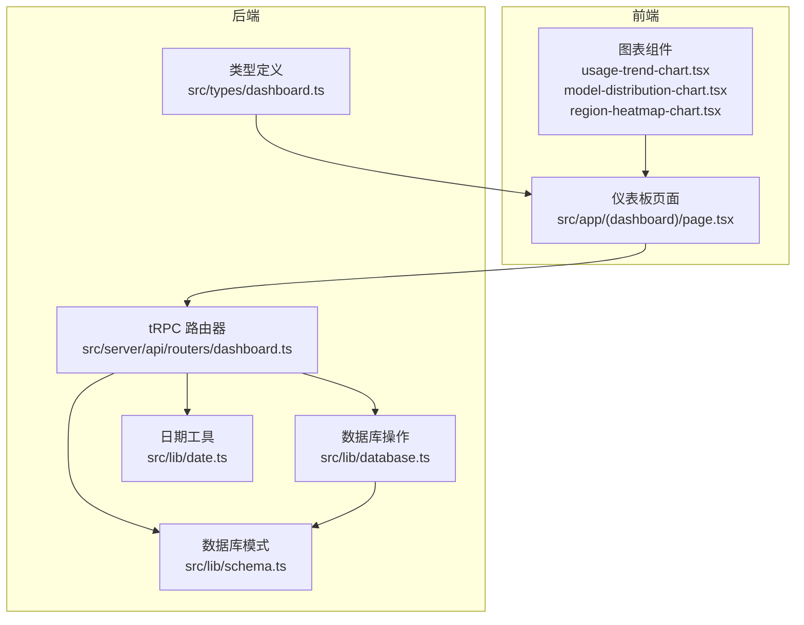
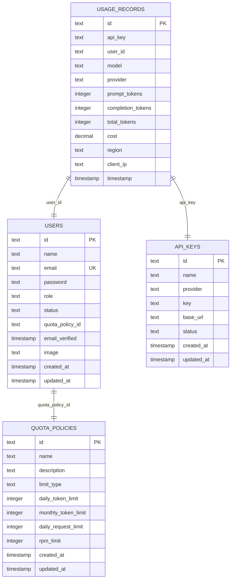
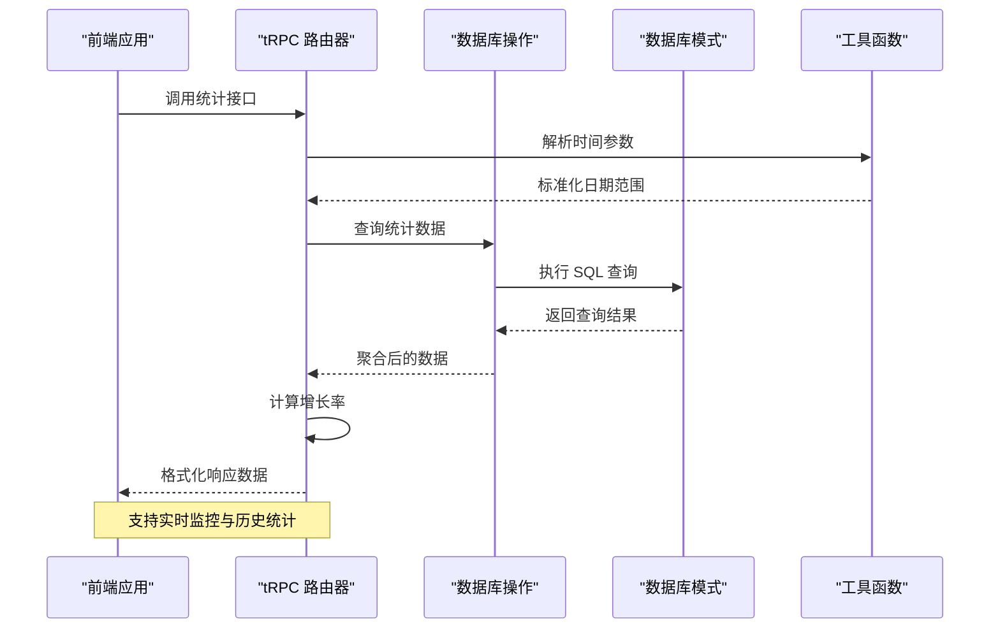
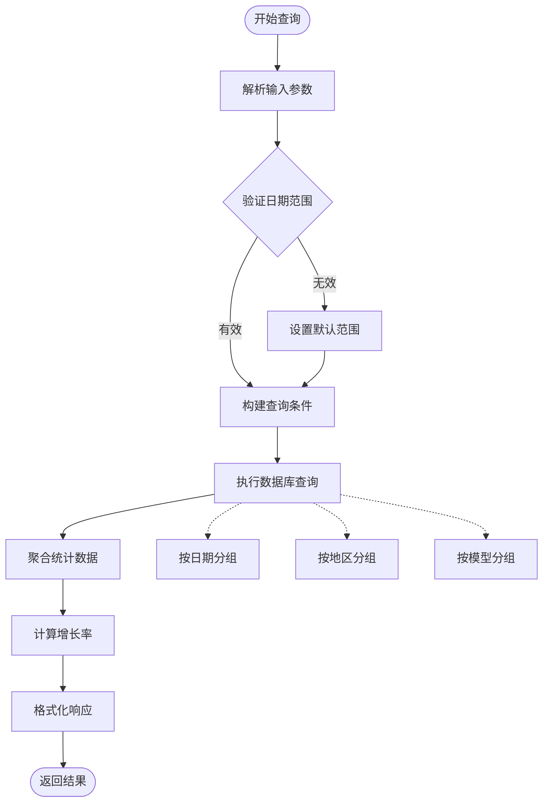
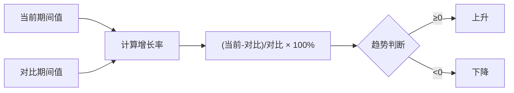
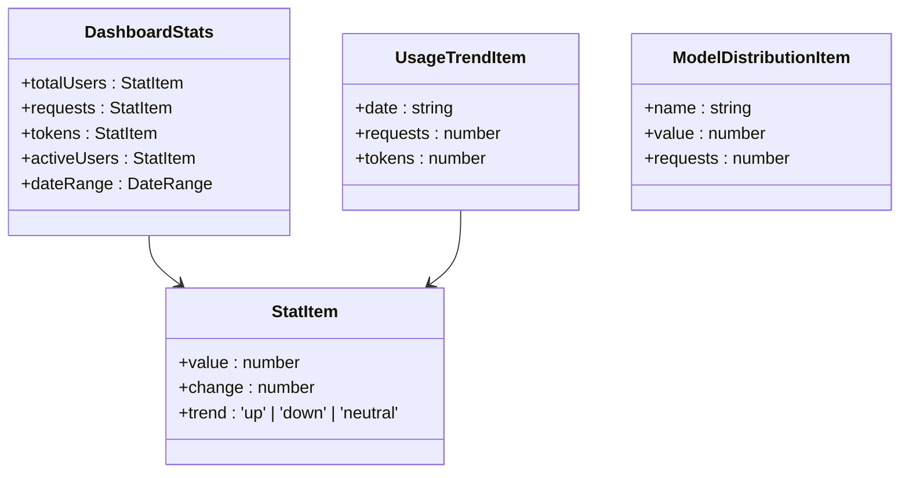
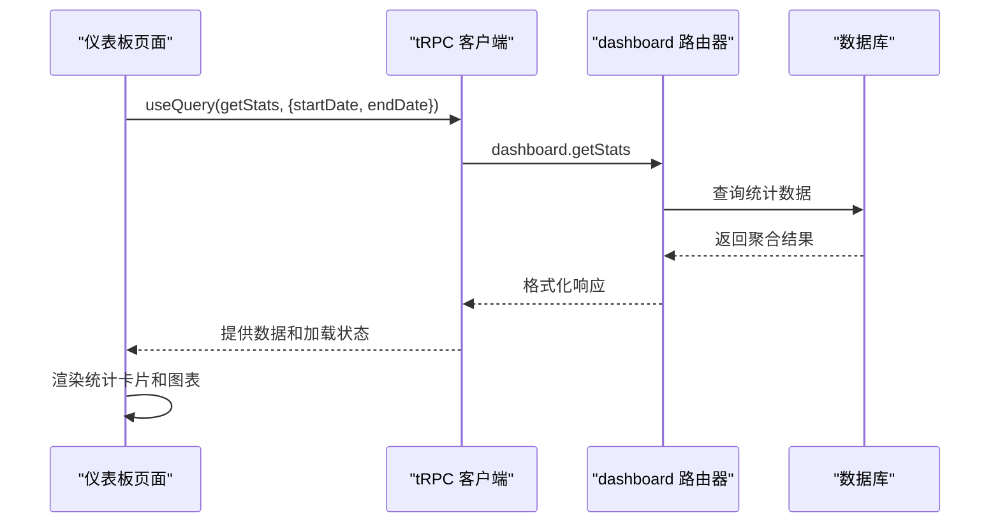
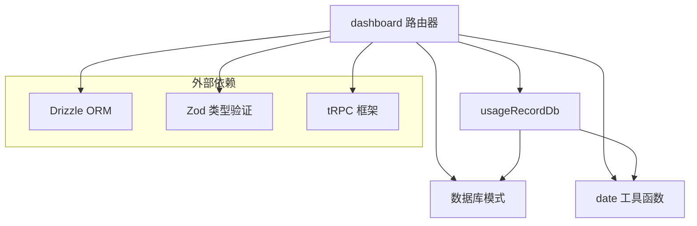

# 仪表板统计路由

<cite>
**本文档引用的文件**
- [src/server/api/routers/dashboard.ts](file://src/server/api/routers/dashboard.ts)
- [src/types/dashboard.ts](file://src/types/dashboard.ts)
- [src/lib/schema.ts](file://src/lib/schema.ts)
- [src/lib/database.ts](file://src/lib/database.ts)
- [src/lib/date.ts](file://src/lib/date.ts)
- [src/app/(dashboard)/page.tsx](file://src/app/(dashboard)/page.tsx)
</cite>

## 目录
1. [简介](#简介)
2. [项目结构](#项目结构)
3. [核心组件](#核心组件)
4. [架构概览](#架构概览)
5. [详细组件分析](#详细组件分析)
6. [依赖关系分析](#依赖关系分析)
7. [性能考虑](#性能考虑)
8. [故障排除指南](#故障排除指南)
9. [结论](#结论)

## 简介

本文件为 AIGate 项目的仪表板统计路由提供完整的 API 文档。该系统专注于提供实时监控与历史统计功能，涵盖使用趋势、模型分布、地区统计和用户行为分析等关键指标。文档详细说明了各统计数据的获取端点、数据聚合算法、时间范围筛选机制以及图表数据格式，并提供数据可视化和报表生成功能的集成指南。

## 项目结构

仪表板统计路由位于服务端 API 的路由器模块中，采用 tRPC 进行前后端通信。前端页面通过 tRPC 客户端调用后端接口，实现数据的实时展示与交互。



**图表来源**
- [src/app/(dashboard)/page.tsx](file://src/app/(dashboard)/page.tsx#L1-L228)
- [src/server/api/routers/dashboard.ts](file://src/server/api/routers/dashboard.ts#L1-L454)
- [src/types/dashboard.ts](file://src/types/dashboard.ts#L1-L48)
- [src/lib/schema.ts](file://src/lib/schema.ts#L54-L68)
- [src/lib/database.ts](file://src/lib/database.ts#L144-L278)
- [src/lib/date.ts](file://src/lib/date.ts#L1-L17)

**章节来源**
- [src/app/(dashboard)/page.tsx](file://src/app/(dashboard)/page.tsx#L1-L228)
- [src/server/api/routers/dashboard.ts](file://src/server/api/routers/dashboard.ts#L1-L454)

## 核心组件

### 统计数据接口

仪表板提供以下核心统计接口：

1. **仪表盘总览统计** (`getStats`)
   - 获取总用户数、请求数、Token 消耗量、活跃用户数
   - 支持对比时间段计算增长率
   - 默认按当天时间范围查询

2. **最近活动** (`getRecentActivity`)
   - 获取最近 API 调用活动记录
   - 支持自定义时间范围或最近 N 小时
   - 返回详细的活动描述和参数

3. **使用趋势** (`getUsageTrend`)
   - 按日统计请求数和 Token 消耗
   - 支持自定义天数范围
   - 返回标准化的时间序列数据

4. **地区分布** (`getRegionDistribution`)
   - 统计各地区的请求次数和 Token 消耗
   - 支持自定义天数范围
   - 过滤空地区信息

5. **模型分布** (`getModelDistribution`)
   - 统计各模型的使用次数和 Token 消耗
   - 支持自定义天数范围
   - 按 Token 消耗排序

6. **最近 IP 请求** (`getRecentIpRequests`)
   - 获取最近的 IP 请求记录
   - 返回完整的请求详情

**章节来源**
- [src/server/api/routers/dashboard.ts](file://src/server/api/routers/dashboard.ts#L11-L452)

### 数据模型



**图表来源**
- [src/lib/schema.ts](file://src/lib/schema.ts#L54-L83)

**章节来源**
- [src/lib/schema.ts](file://src/lib/schema.ts#L54-L83)

## 架构概览

仪表板统计路由采用分层架构设计，确保数据处理的高效性和可维护性。



**图表来源**
- [src/server/api/routers/dashboard.ts](file://src/server/api/routers/dashboard.ts#L18-L196)
- [src/lib/database.ts](file://src/lib/database.ts#L191-L216)
- [src/lib/date.ts](file://src/lib/date.ts#L3-L10)

### 数据流处理



**图表来源**
- [src/server/api/routers/dashboard.ts](file://src/server/api/routers/dashboard.ts#L246-L306)
- [src/server/api/routers/dashboard.ts](file://src/server/api/routers/dashboard.ts#L308-L362)
- [src/server/api/routers/dashboard.ts](file://src/server/api/routers/dashboard.ts#L399-L452)

**章节来源**
- [src/server/api/routers/dashboard.ts](file://src/server/api/routers/dashboard.ts#L18-L452)

## 详细组件分析

### 统计数据聚合算法

#### 增长率计算
系统采用对比时间段的方式计算各项指标的增长率：



**图表来源**
- [src/server/api/routers/dashboard.ts](file://src/server/api/routers/dashboard.ts#L146-L164)

#### 时间范围处理
系统支持多种时间范围模式：

| 模式 | 参数 | 默认天数 | 用途 |
|------|------|----------|------|
| 自定义日期 | startDate, endDate | 无 | 精确时间范围查询 |
| 最近 N 天 | days | 7/30 | 快速趋势分析 |
| 最近 N 小时 | hours | 24 | 实时监控 |

**章节来源**
- [src/server/api/routers/dashboard.ts](file://src/server/api/routers/dashboard.ts#L246-L306)
- [src/server/api/routers/dashboard.ts](file://src/server/api/routers/dashboard.ts#L308-L362)
- [src/server/api/routers/dashboard.ts](file://src/server/api/routers/dashboard.ts#L399-L452)

### API 接口规范

#### 仪表盘总览统计
- **路径**: `/api/trpc/dashboard.getStats`
- **方法**: `GET`
- **认证**: 需要受保护的访问
- **输入参数**:
  - `startDate`: 开始日期（可选）
  - `endDate`: 结束日期（可选）

- **输出格式**:
```typescript
{
  totalUsers: { value: number, change: number, trend: 'up' | 'down' | 'neutral' },
  requests: { value: number, change: number, trend: 'up' | 'down' | 'neutral' },
  tokens: { value: number, change: number, trend: 'up' | 'down' | 'neutral' },
  activeUsers: { value: number, change: number, trend: 'up' | 'down' | 'neutral' },
  dateRange: { start: Date, end: Date }
}
```

#### 使用趋势数据
- **路径**: `/api/trpc/dashboard.getUsageTrend`
- **方法**: `GET`
- **输入参数**:
  - `startDate`: 开始日期（可选）
  - `endDate`: 结束日期（可选）
  - `days`: 天数（默认 7）

- **输出格式**:
```typescript
Array<{
  date: string;        // "YYYY-MM-DD"
  requests: number;    // 当日请求数
  tokens: number;      // 当日 Token 消耗
}>
```

#### 地区分布统计
- **路径**: `/api/trpc/dashboard.getRegionDistribution`
- **方法**: `GET`
- **输入参数**:
  - `startDate`: 开始日期（可选）
  - `endDate`: 结束日期（可选）
  - `days`: 天数（默认 30）

- **输出格式**:
```typescript
Array<{
  name: string;        // 地区名称
  value: number;       // 请求次数
  tokens: number;      // Token 消耗
}>
```

#### 模型分布统计
- **路径**: `/api/trpc/dashboard.getModelDistribution`
- **方法**: `GET`
- **输入参数**:
  - `startDate`: 开始日期（可选）
  - `endDate`: 结束日期（可选）
  - `days`: 天数（默认 30）

- **输出格式**:
```typescript
Array<{
  name: string;        // 模型名称
  value: number;       // Token 消耗总量
  requests: number;    // 使用次数
}>
```

**章节来源**
- [src/server/api/routers/dashboard.ts](file://src/server/api/routers/dashboard.ts#L11-L196)
- [src/server/api/routers/dashboard.ts](file://src/server/api/routers/dashboard.ts#L246-L306)
- [src/server/api/routers/dashboard.ts](file://src/server/api/routers/dashboard.ts#L308-L362)
- [src/server/api/routers/dashboard.ts](file://src/server/api/routers/dashboard.ts#L399-L452)
- [src/types/dashboard.ts](file://src/types/dashboard.ts#L1-L48)

### 数据可视化集成

#### 图表数据格式标准化
所有统计接口返回的数据都经过标准化处理，确保前端图表组件的一致性：



**图表来源**
- [src/types/dashboard.ts](file://src/types/dashboard.ts#L1-L48)

#### 前端集成示例
前端页面通过 tRPC 客户端自动管理数据获取和缓存：



**图表来源**
- [src/app/(dashboard)/page.tsx](file://src/app/(dashboard)/page.tsx#L69-L103)

**章节来源**
- [src/app/(dashboard)/page.tsx](file://src/app/(dashboard)/page.tsx#L1-L228)

## 依赖关系分析

### 组件耦合度
仪表板统计路由具有良好的内聚性和低耦合性：



**图表来源**
- [src/server/api/routers/dashboard.ts](file://src/server/api/routers/dashboard.ts#L1-L8)
- [src/lib/database.ts](file://src/lib/database.ts#L1-L16)
- [src/lib/date.ts](file://src/lib/date.ts#L1-L17)

### 数据库查询优化

系统采用并行查询和批量处理来优化性能：

| 查询类型 | 并行数量 | 优化策略 |
|----------|----------|----------|
| 总览统计 | 8个查询 | Promise.all 并行执行 |
| 使用趋势 | 单次查询 | 一次性聚合 |
| 地区分布 | 单次查询 | 分组聚合 |
| 模型分布 | 单次查询 | 分组聚合 |

**章节来源**
- [src/server/api/routers/dashboard.ts](file://src/server/api/routers/dashboard.ts#L47-L135)
- [src/lib/database.ts](file://src/lib/database.ts#L191-L216)

## 性能考虑

### 查询性能优化
1. **索引优化**: 建议在 `timestamp` 和 `userId` 字段上建立索引
2. **批量查询**: 使用 `Promise.all` 并行执行多个统计查询
3. **数据预聚合**: 对常用查询结果进行缓存
4. **分页处理**: 对大量数据的查询添加分页限制

### 内存使用优化
- 使用 `Map` 数据结构进行临时聚合
- 及时释放不需要的中间变量
- 控制单次查询返回的数据量

### 缓存策略
建议实现多级缓存：
1. **内存缓存**: 存储热点统计数据
2. **Redis 缓存**: 存储长时间不变的配置数据
3. **浏览器缓存**: 前端数据缓存和智能刷新

## 故障排除指南

### 常见错误及解决方案

#### 数据库连接错误
**症状**: 查询超时或连接失败
**解决方案**:
1. 检查数据库连接配置
2. 验证网络连通性
3. 查看数据库负载情况

#### 查询性能问题
**症状**: 统计查询响应缓慢
**解决方案**:
1. 添加适当的数据库索引
2. 优化 WHERE 条件
3. 考虑数据归档策略

#### 数据不一致
**症状**: 不同统计接口返回的数据不匹配
**解决方案**:
1. 检查时间范围边界条件
2. 验证数据聚合逻辑
3. 确认并发写入的影响

**章节来源**
- [src/server/api/routers/dashboard.ts](file://src/server/api/routers/dashboard.ts#L192-L195)
- [src/lib/database.ts](file://src/lib/database.ts#L159-L162)

### 调试技巧
1. **启用详细日志**: 在开发环境中开启 SQL 查询日志
2. **监控查询时间**: 使用数据库性能分析工具
3. **测试边界条件**: 验证极端时间范围的处理
4. **模拟高并发**: 测试多用户同时访问的情况

## 结论

仪表板统计路由提供了完整的数据分析和可视化解决方案。通过合理的时间范围处理、高效的数据库查询和标准化的数据格式，系统能够满足实时监控和历史分析的需求。建议在生产环境中实施适当的缓存策略和性能监控，以确保系统的稳定性和响应速度。