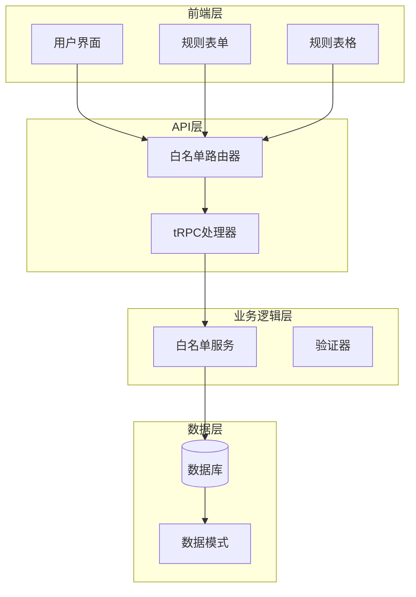
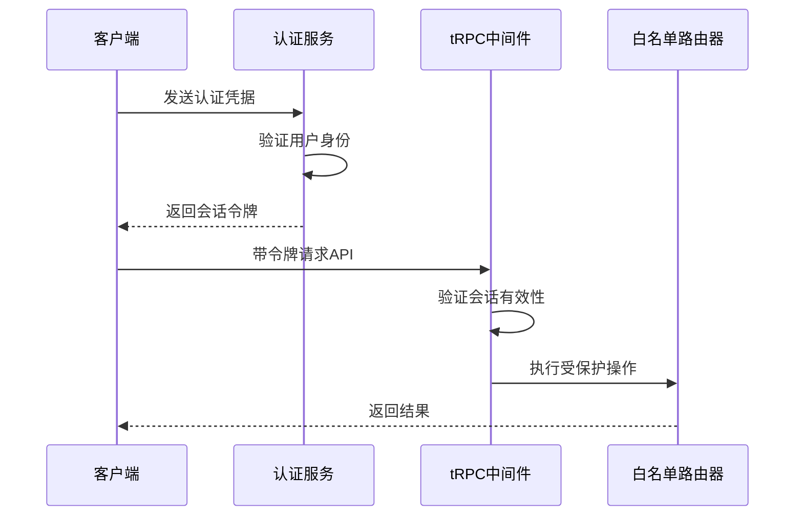
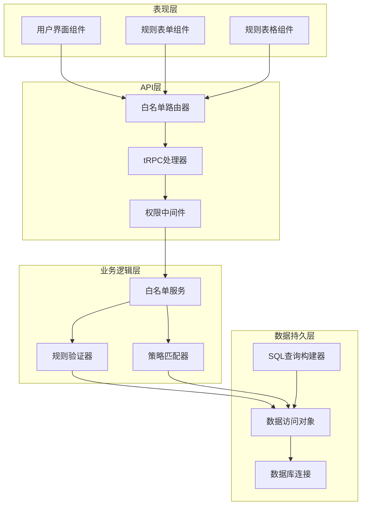
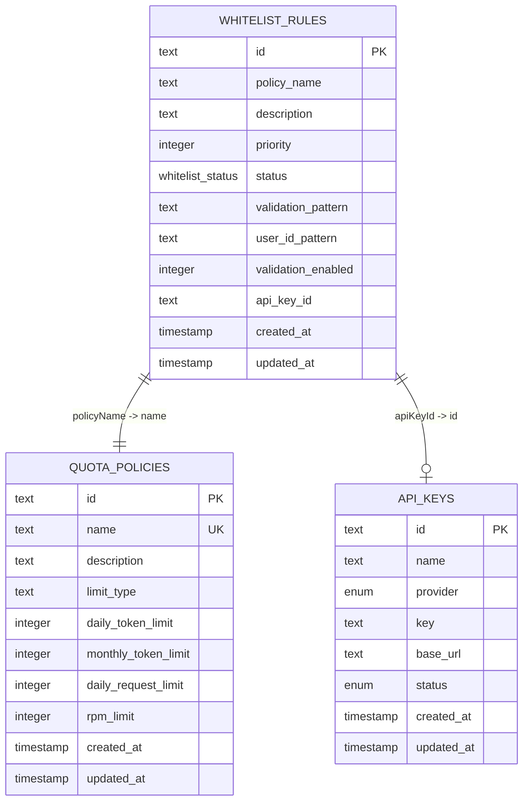
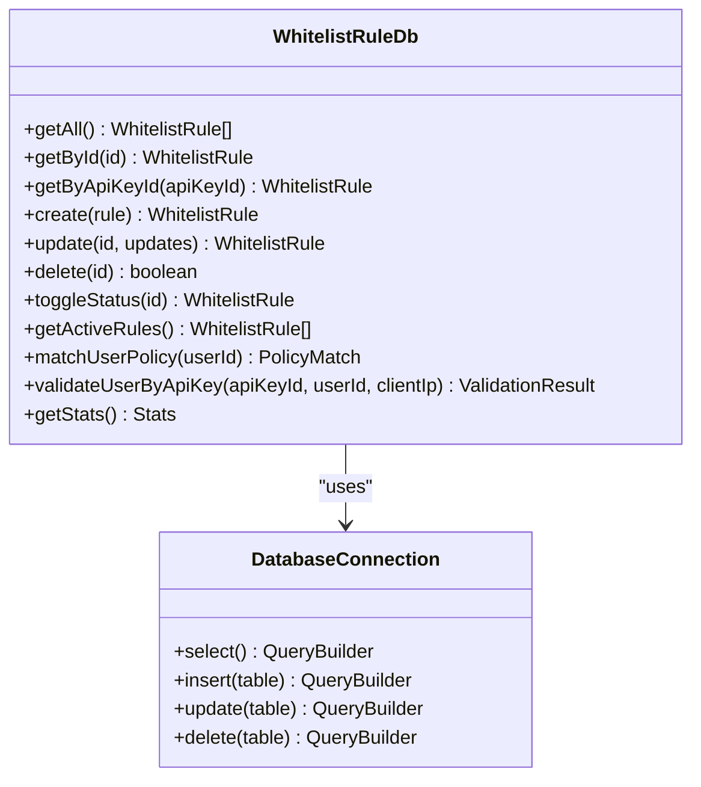
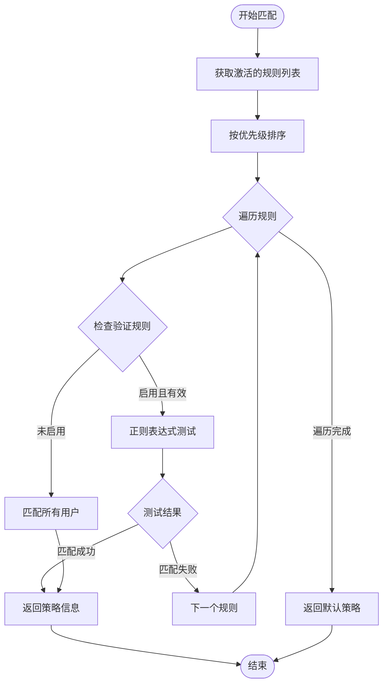
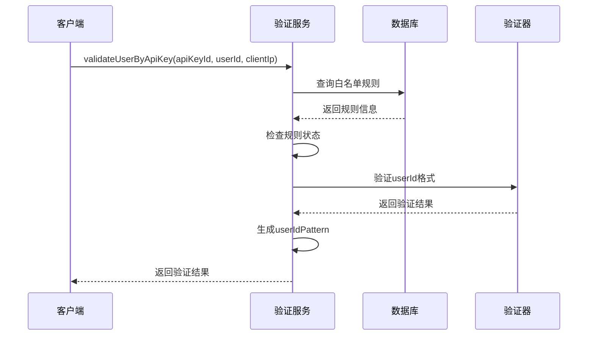
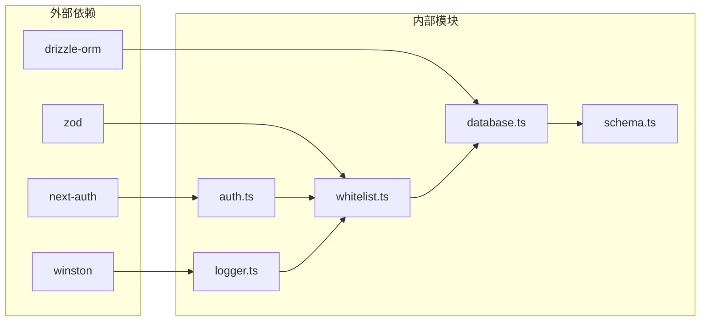
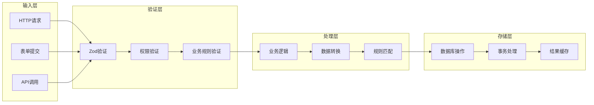
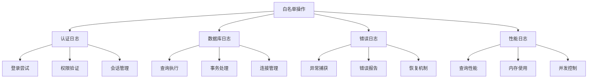

# 白名单管理路由

<cite>
**本文档引用的文件**
- [src/server/api/routers/whitelist.ts](file://src/server/api/routers/whitelist.ts)
- [src/lib/database.ts](file://src/lib/database.ts)
- [src/lib/schema.ts](file://src/lib/schema.ts)
- [src/app/(dashboard)/users/page.tsx](file://src/app/(dashboard)/users/page.tsx)
- [src/app/(dashboard)/users/components/whitelist-rule-form.tsx](file://src/app/(dashboard)/users/components/whitelist-rule-form.tsx)
- [src/app/(dashboard)/users/components/whitelist-rule-table.tsx](file://src/app/(dashboard)/users/components/whitelist-rule-table.tsx)
- [src/server/api/root.ts](file://src/server/api/root.ts)
- [src/server/api/trpc.ts](file://src/server/api/trpc.ts)
- [src/auth.ts](file://src/auth.ts)
- [src/lib/cors.ts](file://src/lib/cors.ts)
- [src/lib/ip-region.ts](file://src/lib/ip-region.ts)
- [src/lib/logger.ts](file://src/lib/logger.ts)
</cite>

## 目录
1. [简介](#简介)
2. [项目结构](#项目结构)
3. [核心组件](#核心组件)
4. [架构概览](#架构概览)
5. [详细组件分析](#详细组件分析)
6. [依赖关系分析](#依赖关系分析)
7. [性能考虑](#性能考虑)
8. [故障排除指南](#故障排除指南)
9. [结论](#结论)

## 简介

白名单管理路由是 AIGate 项目中的核心安全组件，负责管理用户访问控制策略。该系统提供了完整的白名单规则生命周期管理，包括规则的创建、查询、更新、删除和状态切换功能。

系统支持多种验证模式，包括正则表达式匹配、CIDR 网段支持和动态规则更新。通过 API Key 绑定机制，实现了细粒度的访问控制策略管理。同时集成了用户权限验证、IP 地址过滤和访问审计功能。

## 项目结构

白名单管理功能分布在多个层次中：



**图表来源**
- [src/server/api/routers/whitelist.ts](file://src/server/api/routers/whitelist.ts#L22-L222)
- [src/lib/database.ts](file://src/lib/database.ts#L293-L579)
- [src/lib/schema.ts](file://src/lib/schema.ts#L85-L98)

**章节来源**
- [src/server/api/routers/whitelist.ts](file://src/server/api/routers/whitelist.ts#L1-L222)
- [src/lib/database.ts](file://src/lib/database.ts#L1-L692)
- [src/lib/schema.ts](file://src/lib/schema.ts#L1-L162)

## 核心组件

### 白名单规则模型

白名单规则包含以下关键属性：

| 属性名 | 类型 | 描述 | 默认值 |
|--------|------|------|--------|
| id | string | 规则唯一标识符 | 自动生成 |
| policyName | string | 策略名称 | 必填 |
| description | string | 规则描述 | null |
| priority | number | 优先级 | 1 |
| status | enum | 状态(active/inactive) | active |
| validationPattern | string | 正则表达式验证模式 | null |
| userIdPattern | string | 用户ID生成模式 | null |
| validationEnabled | boolean | 是否启用验证 | false |
| apiKeyId | string | 关联的API Key ID | null |
| createdAt | date | 创建时间 | 当前时间 |
| updatedAt | date | 更新时间 | 当前时间 |

### 权限验证机制

系统采用基于会话的权限验证：



**图表来源**
- [src/server/api/trpc.ts](file://src/server/api/trpc.ts#L128-L139)
- [src/auth.ts](file://src/auth.ts#L14-L82)

**章节来源**
- [src/lib/schema.ts](file://src/lib/schema.ts#L85-L98)
- [src/server/api/trpc.ts](file://src/server/api/trpc.ts#L128-L139)
- [src/auth.ts](file://src/auth.ts#L1-L113)

## 架构概览

白名单管理系统的整体架构采用分层设计：



**图表来源**
- [src/server/api/root.ts](file://src/server/api/root.ts#L14-L21)
- [src/server/api/routers/whitelist.ts](file://src/server/api/routers/whitelist.ts#L22-L222)
- [src/lib/database.ts](file://src/lib/database.ts#L293-L579)

## 详细组件分析

### 白名单路由器

白名单路由器提供了完整的 CRUD 操作和额外的功能：

#### 主要端点

| 端点 | 方法 | 功能 | 权限要求 |
|------|------|------|----------|
| `/whitelist/getAll` | GET | 获取所有白名单规则 | 受保护 |
| `/whitelist/getById` | GET | 根据ID获取规则 | 受保护 |
| `/whitelist/create` | POST | 创建新规则 | 受保护 |
| `/whitelist/update` | PUT | 更新现有规则 | 受保护 |
| `/whitelist/delete` | DELETE | 删除规则 | 受保护 |
| `/whitelist/toggleStatus` | PATCH | 切换规则状态 | 受保护 |
| `/whitelist/getStats` | GET | 获取统计信息 | 受保护 |
| `/whitelist/matchUserPolicy` | GET | 匹配用户策略 | 受保护 |

#### API 请求/响应示例

**创建规则请求**
```typescript
// 请求体
{
  policyName: "string",
  description: "string",
  priority: 1,
  status: "active" | "inactive",
  validationPattern: "string",
  userIdPattern: "string",
  validationEnabled: boolean,
  apiKeyId: "string"
}

// 响应体
{
  id: "string",
  policyName: "string",
  description: "string",
  priority: 1,
  status: "active" | "inactive",
  validationPattern: "string",
  userIdPattern: "string",
  validationEnabled: boolean,
  apiKeyId: "string",
  createdAt: "string",
  updatedAt: "string"
}
```

**章节来源**
- [src/server/api/routers/whitelist.ts](file://src/server/api/routers/whitelist.ts#L22-L222)

### 数据库层设计

#### 数据表结构

白名单规则存储在 `whitelist_rules` 表中：



**图表来源**
- [src/lib/schema.ts](file://src/lib/schema.ts#L85-L98)
- [src/lib/schema.ts](file://src/lib/schema.ts#L140-L145)

#### 数据访问模式

数据库层采用 DAO（数据访问对象）模式：



**图表来源**
- [src/lib/database.ts](file://src/lib/database.ts#L293-L579)

**章节来源**
- [src/lib/schema.ts](file://src/lib/schema.ts#L85-L98)
- [src/lib/database.ts](file://src/lib/database.ts#L293-L579)

### 前端用户界面

#### 规则表单组件

规则表单支持多种预设模板：

| 预设标签 | 触发符 | 描述 | 正则表达式 |
|----------|--------|------|------------|
| @ip | @ip | IPv4地址格式 | `@ip` 占位符 |
| @user_id | @user_id | 用户ID占位符 | `@user_id` 占位符 |
| @any | @any | 匹配任意非空字符串 | `.+` |
| @email | @email | 邮箱格式 | `[w.+]+@[w-]+.[w.]` |
| @email_domain | @email_domain | 指定域名邮箱 | `[w.+]+@company.com` |
| @origin | @origin | HTTP Origin格式 | `https?://[w.-]+(:d+)?` |
| @numeric | @numeric | 纯数字ID | `[1-9]d*` |
| @uuid | @uuid | UUID格式 | `[0-9a-f]{8}-[0-9a-f]{4}-[0-9a-f]{4}-[0-9a-f]{4}-[0-9a-f]{12}` |

#### 表格组件功能

规则表格支持：
- 按优先级排序显示
- 实时状态切换
- 编辑和删除操作
- 空状态处理

**章节来源**
- [src/app/(dashboard)/users/components/whitelist-rule-form.tsx](file://src/app/(dashboard)/users/components/whitelist-rule-form.tsx#L50-L126)
- [src/app/(dashboard)/users/components/whitelist-rule-table.tsx](file://src/app/(dashboard)/users/components/whitelist-rule-table.tsx#L28-L167)

### 验证和匹配算法

#### 用户策略匹配流程



**图表来源**
- [src/lib/database.ts](file://src/lib/database.ts#L421-L449)

#### API Key 验证流程



**图表来源**
- [src/lib/database.ts](file://src/lib/database.ts#L456-L545)

**章节来源**
- [src/lib/database.ts](file://src/lib/database.ts#L421-L545)

## 依赖关系分析

### 组件依赖图



**图表来源**
- [src/server/api/routers/whitelist.ts](file://src/server/api/routers/whitelist.ts#L1-L5)
- [src/lib/database.ts](file://src/lib/database.ts#L1-L17)

### 数据流分析

白名单管理的数据流遵循以下模式：



**图表来源**
- [src/server/api/routers/whitelist.ts](file://src/server/api/routers/whitelist.ts#L67-L102)
- [src/lib/database.ts](file://src/lib/database.ts#L354-L365)

**章节来源**
- [src/server/api/routers/whitelist.ts](file://src/server/api/routers/whitelist.ts#L1-L222)
- [src/lib/database.ts](file://src/lib/database.ts#L1-L692)

## 性能考虑

### 查询优化

1. **索引策略**
   - 在 `status` 字段上建立索引以加速状态查询
   - 在 `priority` 字段上建立索引以支持高效排序
   - 在 `api_key_id` 字段上建立索引以支持快速关联查询

2. **查询缓存**
   - 活跃规则列表可以缓存一段时间
   - 统计数据可以定期更新而非实时计算

3. **批量操作**
   - 支持批量删除和状态切换操作
   - 合理使用事务确保数据一致性

### 内存管理

1. **对象池**
   - 复用 Zod 验证器实例
   - 管理正则表达式编译结果

2. **异步处理**
   - 长时间运行的操作使用异步处理
   - 合理设置超时时间

## 故障排除指南

### 常见问题诊断

#### 权限相关问题

**症状**: 401 未授权错误
**可能原因**:
- 会话已过期
- 用户权限不足
- 认证中间件配置错误

**解决方案**:
1. 检查用户登录状态
2. 验证用户角色权限
3. 确认认证配置正确

#### 数据验证错误

**症状**: 400 错误，参数验证失败
**可能原因**:
- API Key 约束冲突
- 正则表达式格式错误
- 数据类型不匹配

**解决方案**:
1. 检查 API Key 唯一性约束
2. 验证正则表达式语法
3. 确认数据类型转换

#### 数据库连接问题

**症状**: 500 服务器错误
**可能原因**:
- 数据库连接池耗尽
- SQL 查询超时
- 事务死锁

**解决方案**:
1. 检查数据库连接状态
2. 优化慢查询
3. 调整事务隔离级别

### 日志分析

系统提供了详细的日志记录功能：



**图表来源**
- [src/lib/logger.ts](file://src/lib/logger.ts#L105-L183)

**章节来源**
- [src/lib/logger.ts](file://src/lib/logger.ts#L1-L184)

## 结论

白名单管理路由系统提供了完整的企业级访问控制解决方案。通过分层架构设计、严格的权限验证和灵活的规则匹配机制，系统能够满足各种复杂的访问控制需求。

主要优势包括：
- **安全性**: 基于会话的权限验证和细粒度的访问控制
- **灵活性**: 支持正则表达式、CIDR 网段和动态规则更新
- **可扩展性**: 模块化设计支持功能扩展和性能优化
- **可观测性**: 完善的日志记录和监控能力

建议在生产环境中：
1. 定期审查和更新白名单规则
2. 监控系统性能指标
3. 实施备份和灾难恢复策略
4. 定期进行安全审计