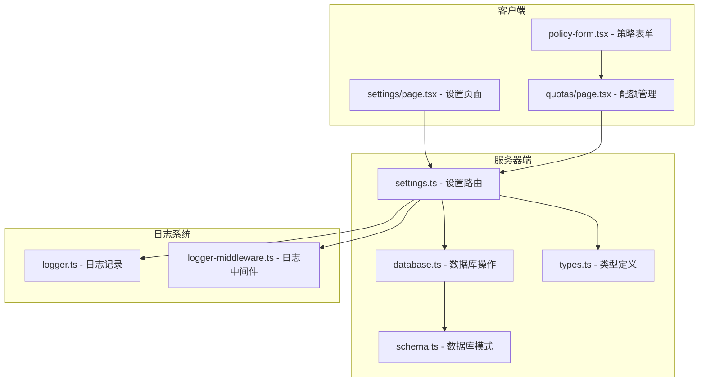
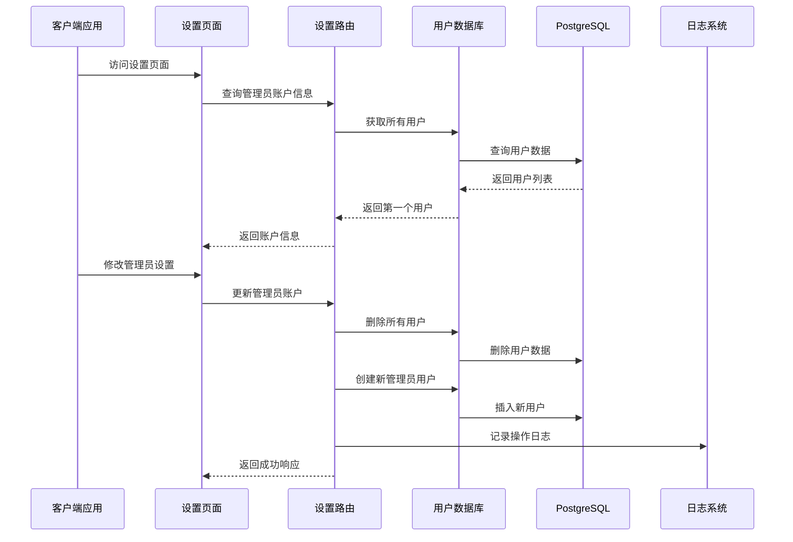
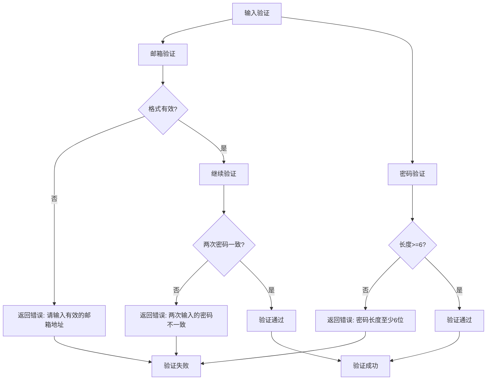
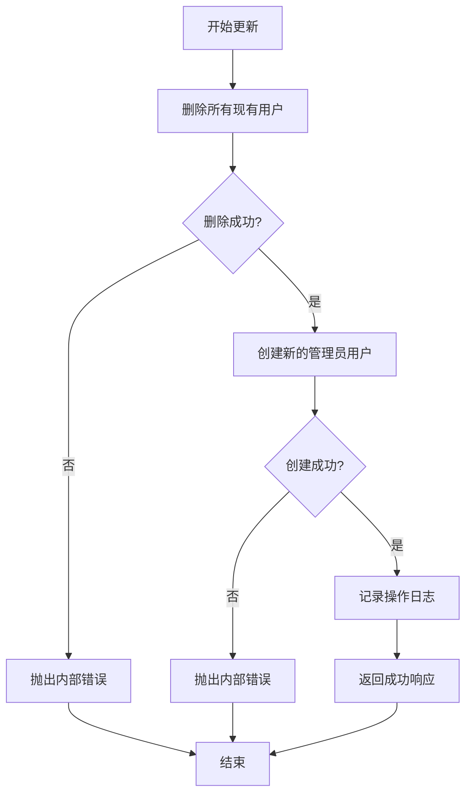
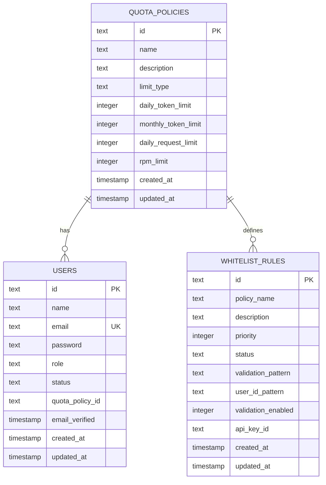
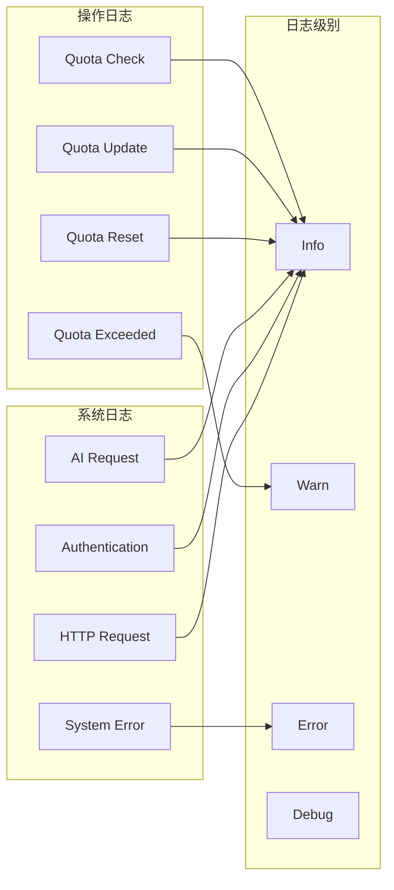
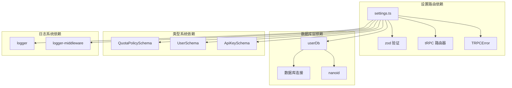

# 系统设置路由

<cite>
**本文档引用的文件**
- [src/server/api/routers/settings.ts](file://src/server/api/routers/settings.ts)
- [src/app/settings/page.tsx](file://src/app/settings/page.tsx)
- [src/lib/database.ts](file://src/lib/database.ts)
- [src/lib/schema.ts](file://src/lib/schema.ts)
- [src/lib/types.ts](file://src/lib/types.ts)
- [src/server/api/root.ts](file://src/server/api/root.ts)
- [src/server/api/routers/quota.ts](file://src/server/api/routers/quota.ts)
- [src/app/(dashboard)/quotas/page.tsx](file://src/app/(dashboard)/quotas/page.tsx)
- [src/app/(dashboard)/quotas/components/policy-form.tsx](file://src/app/(dashboard)/quotas/components/policy-form.tsx)
- [src/lib/logger.ts](file://src/lib/logger.ts)
- [src/lib/logger-middleware.ts](file://src/lib/logger-middleware.ts)
- [README.md](file://README.md)
- [deploy.sh](file://deploy.sh)
</cite>

## 目录
1. [简介](#简介)
2. [项目结构](#项目结构)
3. [核心组件](#核心组件)
4. [架构概览](#架构概览)
5. [详细组件分析](#详细组件分析)
6. [依赖关系分析](#依赖关系分析)
7. [性能考虑](#性能考虑)
8. [故障排除指南](#故障排除指南)
9. [结论](#结论)

## 简介

系统设置路由是 AIGate AI 网关管理系统中的核心配置管理模块，负责管理员账户设置、全局系统配置和默认配额策略管理。该模块采用 tRPC 架构设计，提供类型安全的 API 接口，支持实时配置更新和运行时参数调整。

AIGate 是一个基于 Next.js 14 + tRPC + Redis 的智能 AI 网关管理系统，支持配额控制和多模型代理。系统通过 tRPC 提供类型安全的 API 接口，结合 Redis 缓存实现毫秒级响应。

## 项目结构

系统设置路由位于以下关键位置：

**图表来源**
- [src/server/api/routers/settings.ts](file://src/server/api/routers/settings.ts#L1-L88)
- [src/lib/database.ts](file://src/lib/database.ts#L581-L691)
- [src/app/settings/page.tsx](file://src/app/settings/page.tsx#L1-L202)

**章节来源**
- [src/server/api/routers/settings.ts](file://src/server/api/routers/settings.ts#L1-L88)
- [src/app/settings/page.tsx](file://src/app/settings/page.tsx#L1-L202)

## 核心组件

### 设置路由模块

设置路由模块提供两个主要的配置管理功能：

1. **管理员账户设置** - 支持动态修改管理员邮箱和密码
2. **系统配置管理** - 提供全局系统参数的获取和更新接口

### 数据库层

数据库层通过 userDb 对象提供用户管理操作，包括：
- 用户创建和删除
- 用户信息查询和更新
- 管理员账户的批量操作

### 类型系统

系统采用 Zod 验证库确保数据完整性：
- 输入参数验证
- 输出数据类型定义
- 默认值处理机制

**章节来源**
- [src/server/api/routers/settings.ts](file://src/server/api/routers/settings.ts#L13-L87)
- [src/lib/database.ts](file://src/lib/database.ts#L581-L691)
- [src/lib/types.ts](file://src/lib/types.ts#L1-L118)

## 架构概览

系统设置路由采用分层架构设计，确保职责分离和代码可维护性：

**图表来源**
- [src/app/settings/page.tsx](file://src/app/settings/page.tsx#L33-L69)
- [src/server/api/routers/settings.ts](file://src/server/api/routers/settings.ts#L15-L57)
- [src/lib/database.ts](file://src/lib/database.ts#L682-L690)

**章节来源**
- [src/server/api/root.ts](file://src/server/api/root.ts#L14-L21)
- [src/lib/logger.ts](file://src/lib/logger.ts#L125-L145)

## 详细组件分析

### 管理员账户设置组件

管理员账户设置是系统最重要的配置功能，允许动态修改管理员的登录凭据。

#### 数据验证规则

**图表来源**
- [src/server/api/routers/settings.ts](file://src/server/api/routers/settings.ts#L8-L11)
- [src/app/settings/page.tsx](file://src/app/settings/page.tsx#L16-L25)

#### 批量用户管理流程

管理员账户设置采用"删除所有用户并重建"的策略：

**图表来源**
- [src/server/api/routers/settings.ts](file://src/server/api/routers/settings.ts#L17-L56)
- [src/lib/database.ts](file://src/lib/database.ts#L682-L690)

**章节来源**
- [src/server/api/routers/settings.ts](file://src/server/api/routers/settings.ts#L14-L57)
- [src/app/settings/page.tsx](file://src/app/settings/page.tsx#L29-L69)

### 系统配置管理组件

系统配置管理提供全局系统参数的访问和更新能力。

#### 配额策略管理

系统支持灵活的配额策略管理，包括：

1. **策略类型** - 支持基于 Token 和请求次数的双重限制
2. **策略参数** - 包括每日 Token 限制、每月 Token 限制、每日请求限制
3. **性能参数** - RPM（每分钟请求）限制，默认值为 60

#### 数据模型定义

**图表来源**
- [src/lib/schema.ts](file://src/lib/schema.ts#L29-L83)
- [src/lib/schema.ts](file://src/lib/schema.ts#L85-L98)

**章节来源**
- [src/lib/schema.ts](file://src/lib/schema.ts#L28-L40)
- [src/lib/types.ts](file://src/lib/types.ts#L3-L17)

### 日志记录和监控

系统实现了完整的日志记录机制，支持操作审计和问题诊断。

#### 日志分类

**图表来源**
- [src/lib/logger.ts](file://src/lib/logger.ts#L125-L145)
- [src/lib/logger.ts](file://src/lib/logger.ts#L147-L183)

**章节来源**
- [src/lib/logger.ts](file://src/lib/logger.ts#L1-L184)
- [src/lib/logger-middleware.ts](file://src/lib/logger-middleware.ts#L1-L138)

## 依赖关系分析

系统设置路由与其他组件的依赖关系如下：

**图表来源**
- [src/server/api/routers/settings.ts](file://src/server/api/routers/settings.ts#L1-L5)
- [src/lib/database.ts](file://src/lib/database.ts#L1-L16)

**章节来源**
- [src/server/api/root.ts](file://src/server/api/root.ts#L1-L25)
- [src/lib/database.ts](file://src/lib/database.ts#L1-L692)

## 性能考虑

系统设置路由在设计时充分考虑了性能优化：

### 缓存策略
- 使用 tRPC 的类型安全缓存机制
- 避免不必要的数据库查询
- 实现条件查询以减少数据传输

### 并发处理
- 异步数据库操作避免阻塞
- 错误处理确保系统的稳定性
- 日志记录不影响主业务流程

### 内存管理
- 合理的数据结构设计
- 及时释放数据库连接
- 避免内存泄漏

## 故障排除指南

### 常见问题及解决方案

#### 配置更新失败
**症状**: 管理员账户设置无法保存
**可能原因**:
- 数据库连接异常
- 用户权限不足
- 输入数据格式错误

**解决步骤**:
1. 检查数据库连接状态
2. 验证管理员权限
3. 确认输入数据格式
4. 查看系统日志获取详细错误信息

#### 配额策略异常
**症状**: 配额检查结果不符合预期
**可能原因**:
- 配额策略配置错误
- 用户绑定策略不正确
- 缓存数据过期

**解决步骤**:
1. 检查配额策略配置
2. 验证用户策略绑定
3. 清理相关缓存
4. 重新测试配额检查

#### 日志记录问题
**症状**: 系统日志缺失或格式异常
**可能原因**:
- 日志级别配置不当
- 文件权限问题
- 磁盘空间不足

**解决步骤**:
1. 检查日志级别设置
2. 验证文件权限
3. 清理磁盘空间
4. 重启日志服务

**章节来源**
- [src/lib/logger.ts](file://src/lib/logger.ts#L105-L123)
- [src/lib/logger-middleware.ts](file://src/lib/logger-middleware.ts#L32-L67)

## 结论

系统设置路由作为 AIGate AI 网关管理系统的核心配置模块，提供了完整的管理员账户管理和系统参数配置功能。通过采用 tRPC 架构、Zod 验证和完善的日志记录机制，系统确保了配置管理的安全性、可靠性和可维护性。

该模块的主要优势包括：
- 类型安全的 API 接口
- 实时配置更新能力
- 完整的操作审计日志
- 灵活的配额策略管理
- 高性能的并发处理

未来可以考虑的功能扩展：
- 更细粒度的权限控制
- 配置模板和批量导入功能
- 配置版本管理和回滚机制
- 更丰富的监控和告警功能