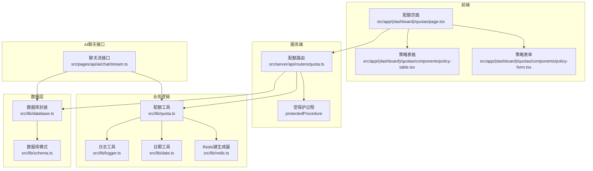
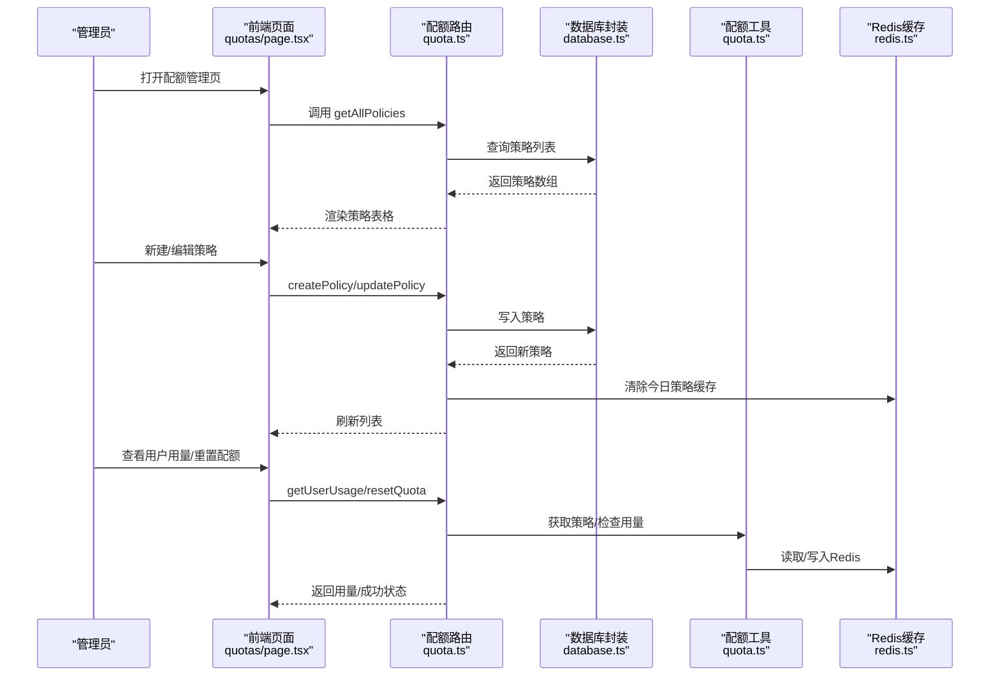
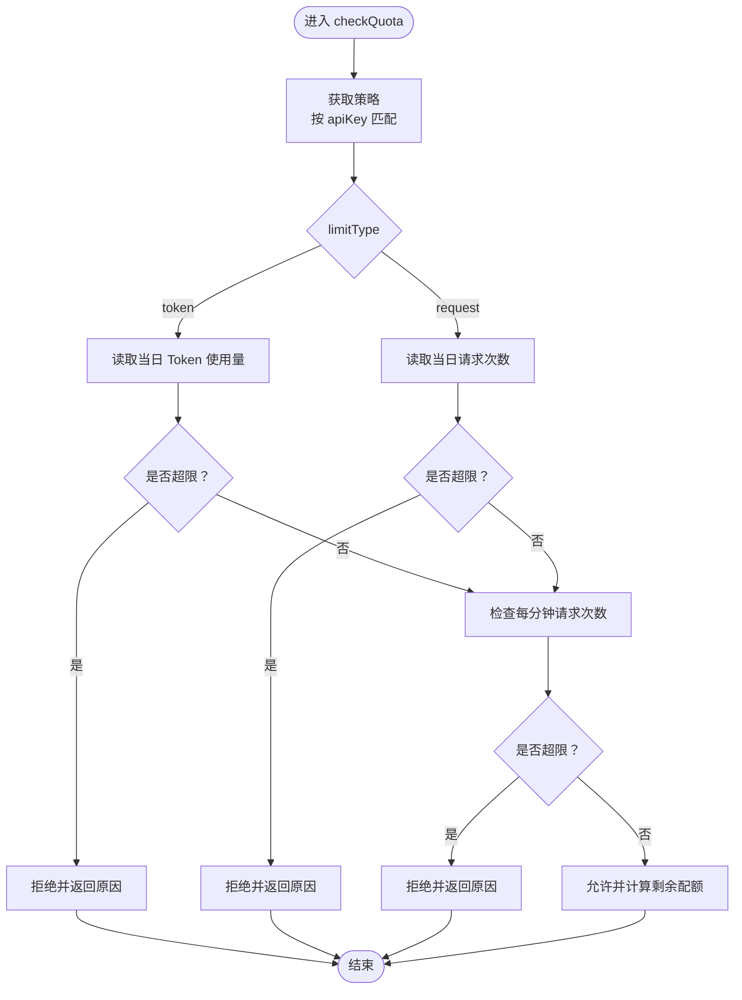
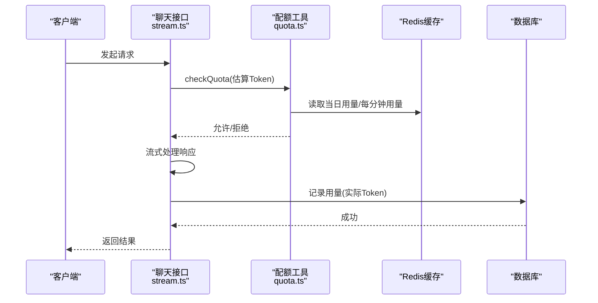
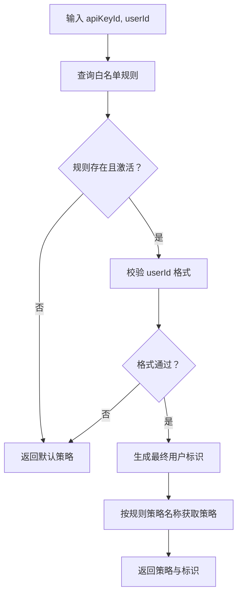
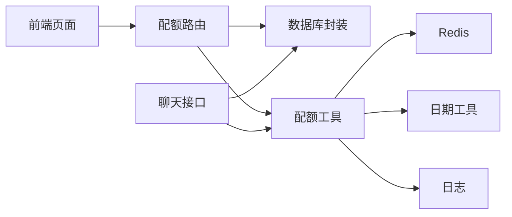
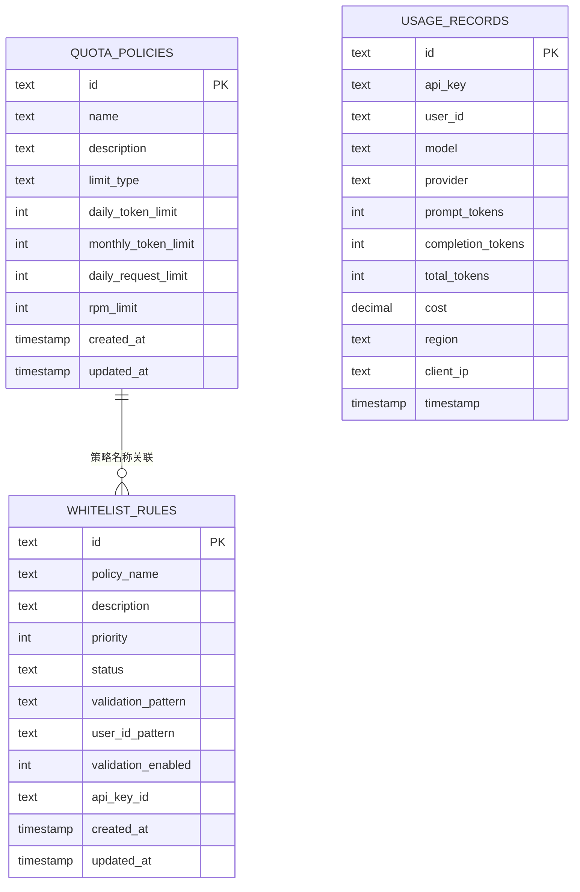

# 配额管理路由

<cite>
**本文引用的文件**
- [src/server/api/routers/quota.ts](file://src/server/api/routers/quota.ts)
- [src/lib/quota.ts](file://src/lib/quota.ts)
- [src/lib/database.ts](file://src/lib/database.ts)
- [src/lib/redis.ts](file://src/lib/redis.ts)
- [src/lib/types.ts](file://src/lib/types.ts)
- [src/lib/date.ts](file://src/lib/date.ts)
- [src/lib/logger.ts](file://src/lib/logger.ts)
- [src/lib/schema.ts](file://src/lib/schema.ts)
- [src/pages/api/ai/chat/stream.ts](file://src/pages/api/ai/chat/stream.ts)
- [src/app/(dashboard)/quotas/page.tsx](file://src/app/(dashboard)/quotas/page.tsx)
- [src/app/(dashboard)/quotas/components/policy-form.tsx](file://src/app/(dashboard)/quotas/components/policy-form.tsx)
- [src/app/(dashboard)/quotas/components/policy-table.tsx](file://src/app/(dashboard)/quotas/components/policy-table.tsx)
</cite>

## 目录
1. [简介](#简介)
2. [项目结构](#项目结构)
3. [核心组件](#核心组件)
4. [架构总览](#架构总览)
5. [详细组件分析](#详细组件分析)
6. [依赖关系分析](#依赖关系分析)
7. [性能考量](#性能考量)
8. [故障排查指南](#故障排查指南)
9. [结论](#结论)
10. [附录](#附录)

## 简介
本文件面向配额管理路由的 API 设计与实现，覆盖以下目标：
- 记录配额策略的创建、查询、更新与删除接口
- 详述配额检查机制、用量统计与限制控制（Token 限制、请求频率限制、自定义配额策略）
- 提供配额监控与告警相关接口说明
- 结合前端页面与数据库结构，给出端到端的数据流与调用流程

## 项目结构
配额管理涉及服务端路由、业务逻辑、数据库与缓存、前端页面与表单等模块。下图展示关键文件之间的关系：

图表来源
- [src/app/(dashboard)/quotas/page.tsx](file://src/app/(dashboard)/quotas/page.tsx#L1-L142)
- [src/app/(dashboard)/quotas/components/policy-form.tsx](file://src/app/(dashboard)/quotas/components/policy-form.tsx#L1-L201)
- [src/app/(dashboard)/quotas/components/policy-table.tsx](file://src/app/(dashboard)/quotas/components/policy-table.tsx#L1-L167)
- [src/server/api/routers/quota.ts](file://src/server/api/routers/quota.ts#L1-L221)
- [src/lib/quota.ts](file://src/lib/quota.ts#L1-L327)
- [src/lib/database.ts](file://src/lib/database.ts#L1-L692)
- [src/lib/redis.ts](file://src/lib/redis.ts#L1-L43)
- [src/lib/date.ts](file://src/lib/date.ts#L1-L17)
- [src/lib/logger.ts](file://src/lib/logger.ts#L1-L184)
- [src/lib/schema.ts](file://src/lib/schema.ts#L1-L162)
- [src/pages/api/ai/chat/stream.ts](file://src/pages/api/ai/chat/stream.ts#L1-L184)

章节来源
- [src/server/api/routers/quota.ts](file://src/server/api/routers/quota.ts#L1-L221)
- [src/lib/quota.ts](file://src/lib/quota.ts#L1-L327)
- [src/lib/database.ts](file://src/lib/database.ts#L1-L692)
- [src/lib/redis.ts](file://src/lib/redis.ts#L1-L43)
- [src/lib/date.ts](file://src/lib/date.ts#L1-L17)
- [src/lib/logger.ts](file://src/lib/logger.ts#L1-L184)
- [src/lib/schema.ts](file://src/lib/schema.ts#L1-L162)
- [src/pages/api/ai/chat/stream.ts](file://src/pages/api/ai/chat/stream.ts#L1-L184)
- [src/app/(dashboard)/quotas/page.tsx](file://src/app/(dashboard)/quotas/page.tsx#L1-L142)
- [src/app/(dashboard)/quotas/components/policy-form.tsx](file://src/app/(dashboard)/quotas/components/policy-form.tsx#L1-L201)
- [src/app/(dashboard)/quotas/components/policy-table.tsx](file://src/app/(dashboard)/quotas/components/policy-table.tsx#L1-L167)

## 核心组件
- 配额策略路由：提供策略的创建、查询、更新、删除与用户用量查询、重置配额能力
- 配额检查与用量记录：根据策略类型（Token/请求次数）与 RPM 限制进行实时检查，并记录用量
- 白名单规则与策略绑定：通过 API Key 与白名单规则关联策略，支持动态生成用户标识
- Redis 缓存与键空间：使用 Redis 存储每日用量、每分钟请求与策略缓存
- 数据库持久化：策略、用量记录、白名单规则与用户等数据存储于 PostgreSQL
- 前端配额管理界面：策略列表、新增/编辑弹窗、用量查询与重置入口

章节来源
- [src/server/api/routers/quota.ts](file://src/server/api/routers/quota.ts#L39-L220)
- [src/lib/quota.ts](file://src/lib/quota.ts#L17-L327)
- [src/lib/database.ts](file://src/lib/database.ts#L84-L141)
- [src/lib/database.ts](file://src/lib/database.ts#L332-L352)
- [src/lib/redis.ts](file://src/lib/redis.ts#L18-L42)
- [src/lib/schema.ts](file://src/lib/schema.ts#L28-L98)

## 架构总览
下图展示“策略管理”与“用量统计/限制控制”的端到端流程：

图表来源
- [src/app/(dashboard)/quotas/page.tsx](file://src/app/(dashboard)/quotas/page.tsx#L24-L85)
- [src/server/api/routers/quota.ts](file://src/server/api/routers/quota.ts#L90-L220)
- [src/lib/quota.ts](file://src/lib/quota.ts#L17-L57)
- [src/lib/redis.ts](file://src/lib/redis.ts#L18-L42)
- [src/lib/database.ts](file://src/lib/database.ts#L84-L141)

## 详细组件分析

### 配额策略管理 API
- 端点概览
  - 获取所有策略：GET/查询
  - 创建策略：POST/变更
  - 更新策略：POST/变更
  - 删除策略：POST/变更
  - 获取用户今日用量：GET/查询
  - 重置用户配额：POST/变更

- 输入参数与约束
  - 策略字段：名称、描述、限制类型（token/request）、每日 Token 上限、每月 Token 上限、每日请求次数上限、RPM 限制
  - 限制类型为 token 时，必须提供每日 Token 上限；限制类型为 request 时，必须提供每日请求次数上限

- 行为说明
  - 策略更新/删除后，会清理与 API Key 相关的今日策略缓存与用量键，确保新策略生效
  - 用户用量查询与配额重置均基于白名单规则校验后的最终用户标识执行

章节来源
- [src/server/api/routers/quota.ts](file://src/server/api/routers/quota.ts#L90-L220)
- [src/lib/types.ts](file://src/lib/types.ts#L4-L15)
- [src/lib/database.ts](file://src/lib/database.ts#L332-L352)

### 配额检查机制与限制控制
- 检查维度
  - Token 限制：按自然日累计，超过当日上限则拒绝
  - 请求次数限制：按自然日累计，超过当日上限则拒绝
  - RPM 限制：按自然分钟累计，超过每分钟上限则拒绝

- 关键流程
  - 依据 API Key 获取白名单规则与策略
  - 根据策略类型分别检查对应指标
  - 同时检查 RPM 限制
  - 记录检查结果与剩余配额

图表来源
- [src/lib/quota.ts](file://src/lib/quota.ts#L78-L200)
- [src/lib/redis.ts](file://src/lib/redis.ts#L18-L42)
- [src/lib/date.ts](file://src/lib/date.ts#L1-L17)

章节来源
- [src/lib/quota.ts](file://src/lib/quota.ts#L78-L200)
- [src/lib/redis.ts](file://src/lib/redis.ts#L18-L42)
- [src/lib/date.ts](file://src/lib/date.ts#L1-L17)

### 用量统计与记录
- 记录内容
  - 按自然日累计 Token 使用量或请求次数
  - 按自然分钟累计请求次数（RPM）
  - 请求日志键用于短期审计与追踪
  - 将用量记录持久化到数据库

- 关键流程
  - 在 AI 请求完成后，汇总实际 Token 使用量并写入 Redis
  - 同步写入数据库用量记录
  - 记录 AI 请求日志

图表来源
- [src/pages/api/ai/chat/stream.ts](file://src/pages/api/ai/chat/stream.ts#L78-L168)
- [src/lib/quota.ts](file://src/lib/quota.ts#L202-L260)
- [src/lib/redis.ts](file://src/lib/redis.ts#L18-L42)
- [src/lib/database.ts](file://src/lib/database.ts#L218-L221)

章节来源
- [src/lib/quota.ts](file://src/lib/quota.ts#L202-L260)
- [src/pages/api/ai/chat/stream.ts](file://src/pages/api/ai/chat/stream.ts#L150-L168)
- [src/lib/database.ts](file://src/lib/database.ts#L218-L221)

### 白名单规则与策略绑定
- 规则作用
  - 将 API Key 与配额策略进行关联
  - 支持对 userId 进行格式校验与占位符替换，生成最终用户标识
  - 支持优先级与状态管理

- 关键流程
  - 根据 apiKeyId 获取白名单规则
  - 校验 userId 格式并生成最终用户标识
  - 依据规则中的策略名称获取具体策略

图表来源
- [src/lib/database.ts](file://src/lib/database.ts#L332-L352)
- [src/lib/database.ts](file://src/lib/database.ts#L456-L545)

章节来源
- [src/lib/database.ts](file://src/lib/database.ts#L332-L352)
- [src/lib/database.ts](file://src/lib/database.ts#L456-L545)

### 前端配额管理界面
- 页面职责
  - 展示策略列表与基本统计
  - 弹窗新增/编辑策略
  - 支持删除策略
  - 支持查看用户用量与重置配额

- 关键交互
  - 使用 trpc 调用后端路由
  - 表单根据限制类型动态显示/隐藏相应字段
  - 加载状态与错误提示

章节来源
- [src/app/(dashboard)/quotas/page.tsx](file://src/app/(dashboard)/quotas/page.tsx#L24-L85)
- [src/app/(dashboard)/quotas/components/policy-form.tsx](file://src/app/(dashboard)/quotas/components/policy-form.tsx#L42-L81)
- [src/app/(dashboard)/quotas/components/policy-table.tsx](file://src/app/(dashboard)/quotas/components/policy-table.tsx#L29-L147)

## 依赖关系分析
- 组件耦合
  - 路由层依赖数据库封装与配额工具
  - 配额工具依赖 Redis 键空间、日期工具与日志
  - AI 聊天接口依赖配额工具与数据库封装
  - 前端依赖 trpc 与 UI 组件

- 外部依赖
  - Redis：缓存策略与用量
  - PostgreSQL：持久化策略、用量记录、白名单规则
  - tRPC：前后端通信

图表来源
- [src/server/api/routers/quota.ts](file://src/server/api/routers/quota.ts#L1-L221)
- [src/lib/quota.ts](file://src/lib/quota.ts#L1-L327)
- [src/lib/redis.ts](file://src/lib/redis.ts#L1-L43)
- [src/lib/date.ts](file://src/lib/date.ts#L1-L17)
- [src/lib/logger.ts](file://src/lib/logger.ts#L1-L184)
- [src/lib/database.ts](file://src/lib/database.ts#L1-L692)
- [src/pages/api/ai/chat/stream.ts](file://src/pages/api/ai/chat/stream.ts#L1-L184)

章节来源
- [src/server/api/routers/quota.ts](file://src/server/api/routers/quota.ts#L1-L221)
- [src/lib/quota.ts](file://src/lib/quota.ts#L1-L327)
- [src/lib/database.ts](file://src/lib/database.ts#L1-L692)
- [src/lib/redis.ts](file://src/lib/redis.ts#L1-L43)
- [src/lib/date.ts](file://src/lib/date.ts#L1-L17)
- [src/lib/logger.ts](file://src/lib/logger.ts#L1-L184)
- [src/pages/api/ai/chat/stream.ts](file://src/pages/api/ai/chat/stream.ts#L1-L184)

## 性能考量
- 缓存策略
  - 策略缓存：按 API Key 缓存策略，1 小时过期，降低数据库压力
  - 用量缓存：按日/按分钟缓存，减少频繁读写
- 键空间设计
  - 使用通配扫描清理今日策略缓存，避免全表扫描
- 并发与一致性
  - Redis incr/incrBy 保证计数原子性
  - 用量记录异步写入数据库，避免阻塞主流程

[本节为通用指导，不直接分析具体文件]

## 故障排查指南
- 常见错误与定位
  - 策略创建失败：检查限制类型与必填字段是否满足约束
  - 用户用量查询失败：确认白名单规则是否绑定、用户标识是否生成成功
  - 配额检查失败：查看 Redis 连接状态与键空间是否存在
  - 用量记录失败：检查数据库连接与用量记录表结构

- 日志与监控
  - 配额检查/超额/重置等操作均有统一日志入口，便于审计与告警
  - 建议结合日志轮转与外部监控系统实现告警

章节来源
- [src/lib/quota.ts](file://src/lib/quota.ts#L189-L199)
- [src/lib/logger.ts](file://src/lib/logger.ts#L125-L145)
- [src/lib/redis.ts](file://src/lib/redis.ts#L7-L13)

## 结论
本配额管理路由提供了完善的策略管理、实时配额检查与用量统计能力，结合 Redis 缓存与数据库持久化，实现了高并发场景下的稳定运行。通过白名单规则与策略绑定，系统支持灵活的用户识别与差异化配额控制。建议在生产环境中配合日志与监控体系，实现配额超额告警与容量预警。

[本节为总结性内容，不直接分析具体文件]

## 附录

### API 定义与说明

- 获取所有配额策略
  - 方法：GET/查询
  - 路径：/quotas/getAllPolicies
  - 权限：受保护过程
  - 返回：策略数组

- 创建配额策略
  - 方法：POST/变更
  - 路径：/quotas/createPolicy
  - 权限：受保护过程
  - 参数：名称、描述、限制类型、每日 Token 上限、每月 Token 上限、每日请求次数上限、RPM 限制
  - 约束：当限制类型为 token 时需提供每日 Token 上限；当限制类型为 request 时需提供每日请求次数上限
  - 返回：新建策略对象

- 更新配额策略
  - 方法：POST/变更
  - 路径：/quotas/updatePolicy
  - 权限：受保护过程
  - 参数：id、名称、描述、限制类型、每日 Token 上限、每月 Token 上限、每日请求次数上限、RPM 限制
  - 约束：同创建
  - 返回：更新后的策略对象

- 删除配额策略
  - 方法：POST/变更
  - 路径：/quotas/deletePolicy
  - 权限：受保护过程
  - 参数：id
  - 返回：布尔值表示是否删除成功

- 获取用户今日用量
  - 方法：GET/查询
  - 路径：/quotas/getUserUsage
  - 权限：受保护过程
  - 参数：userId、apiKeyId
  - 返回：当日 Token 使用量、当日请求次数、策略信息

- 重置用户配额
  - 方法：POST/变更
  - 路径：/quotas/resetQuota
  - 权限：受保护过程
  - 参数：userId、apiKeyId
  - 返回：成功状态

章节来源
- [src/server/api/routers/quota.ts](file://src/server/api/routers/quota.ts#L90-L220)
- [src/lib/types.ts](file://src/lib/types.ts#L4-L15)

### 数据模型与键空间

图表来源
- [src/lib/schema.ts](file://src/lib/schema.ts#L28-L98)

### Redis 键空间
- user_quota:{userId}:{date}:{apiKey}：用户每日 Token 使用量
- user_requests:{userId}:{date}:{apiKey}：用户每日请求次数
- user_rpm:{userId}:{apiKey}:{dateHourMinute}：用户每分钟请求次数
- policy:apiKey:{apiKeyId}：按 API Key 缓存的策略
- request_log:{userId}:{requestId}：请求日志

章节来源
- [src/lib/redis.ts](file://src/lib/redis.ts#L18-L42)