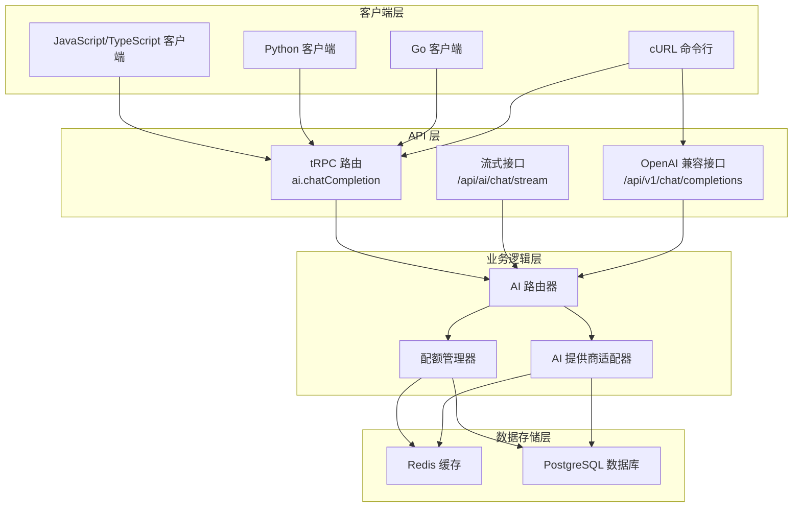
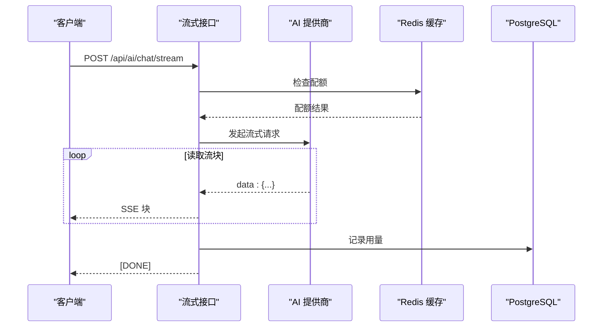
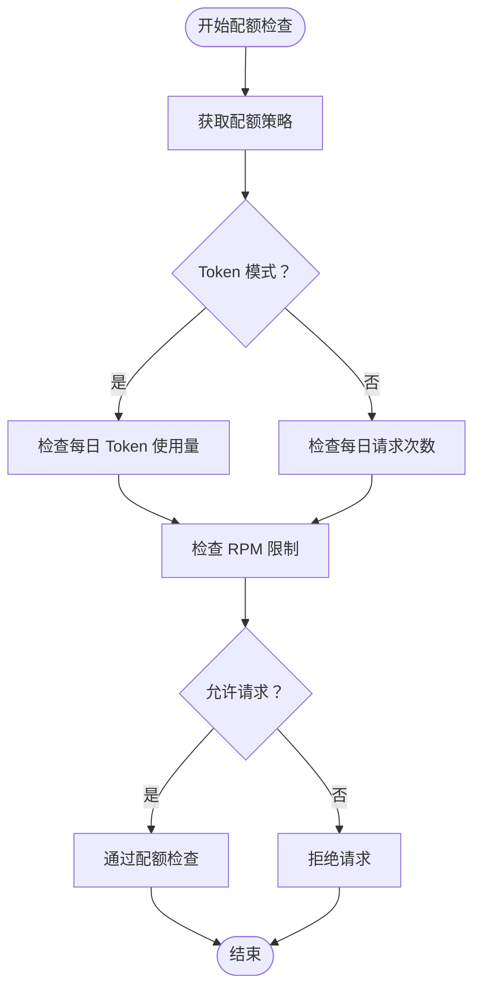

# 使用示例

<cite>
**本文引用的文件**
- [README.md](file://README.md)
- [docs/ai-api.md](file://docs/ai-api.md)
- [src/pages/api/ai/chat/stream.ts](file://src/pages/api/ai/chat/stream.ts)
- [src/lib/ai-providers.ts](file://src/lib/ai-providers.ts)
- [src/server/api/routers/ai.ts](file://src/server/api/routers/ai.ts)
- [src/lib/types.ts](file://src/lib/types.ts)
- [src/lib/quota.ts](file://src/lib/quota.ts)
- [src/lib/database.ts](file://src/lib/database.ts)
- [src/utils/api.ts](file://src/utils/api.ts)
- [package.json](file://package.json)
</cite>

## 更新摘要
**变更内容**
- 更新了项目架构概述，反映当前的API设计和功能实现
- 重新组织了API调用示例，基于现有的代码实现
- 修正了多语言客户端集成示例，确保与实际API兼容
- 更新了性能优化建议，基于当前的实现细节
- 移除了过时的示例代码，保持文档的准确性

## 目录
1. [简介](#简介)
2. [项目架构概览](#项目架构概览)
3. [核心API接口](#核心api接口)
4. [多语言客户端集成](#多语言客户端集成)
5. [流式响应处理](#流式响应处理)
6. [配额管理与最佳实践](#配额管理与最佳实践)
7. [故障排查指南](#故障排查指南)
8. [性能优化建议](#性能优化建议)
9. [总结](#总结)

## 简介

AIGate 是一个基于 Next.js 16 + tRPC + Redis 构建的智能 AI 网关管理系统。它提供了统一的 API 接口，支持多提供商 AI 服务代理、智能配额管理和实时监控功能。

本指南面向希望在生产环境中集成 AIGate AI 网关的开发者，提供基于现有代码实现的准确使用示例和集成指导。

## 项目架构概览

AIGate 采用现代化的技术栈构建，核心架构包括：



**图表来源**
- [src/server/api/routers/ai.ts:88-301](file://src/server/api/routers/ai.ts#L88-L301)
- [src/pages/api/ai/chat/stream.ts:12-124](file://src/pages/api/ai/chat/stream.ts#L12-L124)
- [README.md:57-88](file://README.md#L57-L88)

## 核心API接口

### tRPC 聊天补全接口

**接口路径**: `ai.chatCompletion` (mutation)

这是主要的聊天补全接口，支持非流式响应和多种 AI 提供商。

**请求参数**:
```typescript
{
  userId: string;           // 必需 - 用户标识
  apiKeyId: string;         // 必需 - API Key 标识
  request: {
    model: string;          // 必需 - 模型名称
    messages: Array<{       // 必需 - 消息数组
      role: 'system' | 'user' | 'assistant';
      content: string;
    }>;
    temperature?: number;   // 可选 - 采样温度 (0-2)
    max_tokens?: number;    // 可选 - 最大 token 数
    stream?: boolean;       // 可选 - 是否流式响应
  }
}
```

**响应格式**:
```typescript
{
  id: string;
  object: string;
  created: number;
  model: string;
  choices: Array<{
    index: number;
    message: {
      role: string;
      content: string;
    };
    finish_reason: string;
  }>;
  usage?: {
    prompt_tokens: number;
    completion_tokens: number;
    total_tokens: number;
  };
  aigate_metadata: {
    requestId: string;
    provider: string;
    processingTime: number;
    quotaRemaining: {
      tokens?: number;
      requests?: number;
    };
  };
}
```

**调用示例**:

**TypeScript (tRPC 客户端)**:
```typescript
const response = await trpc.ai.chatCompletion.mutate({
  userId: 'user@example.com',
  apiKeyId: 'key-id-abc123',
  request: {
    model: 'gpt-4o',
    messages: [
      {
        role: 'system',
        content: '你是一个有帮助的编程助手',
      },
      {
        role: 'user',
        content: '用 TypeScript 写一个快速排序函数',
      },
    ],
    temperature: 0.7,
    max_tokens: 2000,
  },
});

console.log('AI 回复:', response.choices[0].message.content);
console.log('消耗 Token:', response.usage?.total_tokens);
console.log('剩余配额:', response.aigate_metadata.quotaRemaining.tokens);
console.log('处理耗时:', response.aigate_metadata.processingTime, 'ms');
```

**cURL 示例**:
```bash
curl -X POST http://localhost:3000/api/trpc/ai.chatCompletion \
  -H "Content-Type: application/json" \
  -d '{
    "json": {
      "userId": "user@example.com",
      "apiKeyId": "key-id-abc123",
      "request": {
        "model": "gpt-4o",
        "messages": [
          {
            "role": "system",
            "content": "你是一个翻译助手"
          },
          {
            "role": "user",
            "content": "请将以下英文翻译成中文: Hello, how are you?"
          }
        ],
        "temperature": 0.3,
        "max_tokens": 1000
      }
    }
  }'
```

**Python (requests)**:
```python
import requests
import json

url = "http://localhost:3000/api/trpc/ai.chatCompletion"
headers = {"Content-Type": "application/json"}

payload = {
    "json": {
        "userId": "user@example.com",
        "apiKeyId": "key-id-abc123",
        "request": {
            "model": "gpt-4o",
            "messages": [
                {"role": "user", "content": "你好世界！"}
            ],
            "temperature": 0.7
        }
    }
}

response = requests.post(url, json=payload, headers=headers)
data = response.json()

if data["result"]["ok"]:
    result = data["result"]["data"]
    print("AI 回复:", result["choices"][0]["message"]["content"])
else:
    print("错误:", data["result"]["error"])
```

**章节来源**
- [docs/ai-api.md:18-116](file://docs/ai-api.md#L18-L116)
- [src/server/api/routers/ai.ts:88-213](file://src/server/api/routers/ai.ts#L88-L213)

### 流式聊天接口

**接口路径**: `/api/ai/chat/stream` (POST)

用于获取实时流式响应，适合需要逐字显示 AI 回复的场景。

**请求参数**:
```typescript
{
  userId: string;           // 必需 - 用户标识
  apiKeyId: string;         // 必需 - API Key 标识
  request: {
    model: string;          // 必需 - 模型名称
    messages: Array<{       // 必需 - 消息数组
      role: 'system' | 'user' | 'assistant';
      content: string;
    }>;
    temperature?: number;   // 可选 - 采样温度
    max_tokens?: number;    // 可选 - 最大 token 数
    stream: true;           // 必需 - 必须设置为 true
  }
}
```

**响应格式**: Server-Sent Events (SSE)，每条消息格式：
```
data: {"choices":[{"delta":{"content":"Hello"}}]}

data: {"choices":[{"delta":{"content":" "}}]}

data: {"choices":[{"delta":{"content":"world"}}]}

data: [DONE]
```

**JavaScript (EventSource)**:
```javascript
const eventSource = new EventSource('/api/ai/chat/stream?userId=user@example.com&apiKeyId=key-id');

let fullContent = '';

eventSource.addEventListener('message', (event) => {
  if (event.data === '[DONE]') {
    console.log('流式响应完成');
    eventSource.close();
    return;
  }

  try {
    const data = JSON.parse(event.data);
    const content = data.choices?.[0]?.delta?.content;
    if (content) {
      fullContent += content;
      // 实时更新 UI
      document.getElementById('response').textContent = fullContent;
    }
  } catch (e) {
    console.error('解析失败:', e);
  }
});

eventSource.addEventListener('error', (event) => {
  console.error('Stream 错误:', event);
  eventSource.close();
});
```

**章节来源**
- [docs/ai-api.md:245-380](file://docs/ai-api.md#L245-L380)
- [src/pages/api/ai/chat/stream.ts:12-124](file://src/pages/api/ai/chat/stream.ts#L12-L124)

## 多语言客户端集成

### JavaScript/TypeScript (Fetch API)

**非流式调用**:
```javascript
async function callAI() {
  const response = await fetch('/api/trpc/ai.chatCompletion', {
    method: 'POST',
    headers: {
      'Content-Type': 'application/json',
    },
    body: JSON.stringify({
      json: {
        userId: 'user@example.com',
        apiKeyId: 'key-id-abc123',
        request: {
          model: 'gpt-4o',
          messages: [{ role: 'user', content: '今天天气如何？' }],
          temperature: 0.7,
        },
      },
    }),
  });

  const data = await response.json();
  if (data.result.ok) {
    console.log('回复:', data.result.data.choices[0].message.content);
  } else {
    console.error('错误:', data.result.error);
  }
}
```

**流式调用**:
```javascript
async function streamChat() {
  const response = await fetch('/api/ai/chat/stream', {
    method: 'POST',
    headers: { 'Content-Type': 'application/json' },
    body: JSON.stringify({
      userId: 'user@example.com',
      apiKeyId: 'key-id-abc123',
      request: {
        model: 'gpt-4o',
        messages: [{ role: 'user', content: '讲个故事' }],
        stream: true,
      },
    }),
  });

  const reader = response.body.getReader();
  const decoder = new TextDecoder();
  let fullContent = '';

  try {
    while (true) {
      const { done, value } = await reader.read();
      if (done) break;

      const chunk = decoder.decode(value);
      const lines = chunk.split('\n');

      for (const line of lines) {
        if (line.startsWith('data: ')) {
          const data = line.slice(6);
          if (data === '[DONE]') {
            console.log('完成');
            return;
          }

          try {
            const parsed = JSON.parse(data);
            const content = parsed.choices?.[0]?.delta?.content;
            if (content) {
              fullContent += content;
              console.log('收到:', content);
            }
          } catch (e) {
            // 忽略解析错误
          }
        }
      }
    }
  } finally {
    reader.releaseLock();
  }
}
```

### Python 客户端

**非流式调用**:
```python
import requests
import json

def call_ai_api():
    url = "http://localhost:3000/api/trpc/ai.chatCompletion"
    headers = {"Content-Type": "application/json"}
    
    payload = {
        "json": {
            "userId": "user@example.com",
            "apiKeyId": "key-id-abc123",
            "request": {
                "model": "gpt-4o",
                "messages": [
                    {"role": "user", "content": "解释量子计算"},
                    {"role": "assistant", "content": "量子计算是一种基于量子力学原理的计算方式..."}
                ],
                "temperature": 0.7,
                "max_tokens": 1000
            }
        }
    }
    
    response = requests.post(url, json=payload, headers=headers)
    
    if response.status_code == 200:
        data = response.json()
        if data["result"]["ok"]:
            result = data["result"]["data"]
            return result["choices"][0]["message"]["content"]
        else:
            print(f"API 错误: {data['result']['error']}")
    else:
        print(f"HTTP 错误: {response.status_code}")

# 使用示例
reply = call_ai_api()
print(reply)
```

### Go 客户端

**非流式调用**:
```go
package main

import (
    "bytes"
    "encoding/json"
    "fmt"
    "io"
    "net/http"
    "time"
)

type ChatRequest struct {
    UserId   string `json:"userId"`
    ApiKeyId string `json:"apiKeyId"`
    Request  struct {
        Model       string `json:"model"`
        Messages    []struct {
            Role    string `json:"role"`
            Content string `json:"content"`
        } `json:"messages"`
        Temperature float64 `json:"temperature,omitempty"`
        MaxTokens int     `json:"max_tokens,omitempty"`
    } `json:"request"`
}

func callAI() error {
    url := "http://localhost:3000/api/trpc/ai.chatCompletion"
    
    reqBody := ChatRequest{
        UserId:   "user@example.com",
        ApiKeyId: "key-id-abc123",
        Request: struct {
            Model       string `json:"model"`
            Messages    []struct {
                Role    string `json:"role"`
                Content string `json:"content"`
            } `json:"messages"`
            Temperature float64 `json:"temperature,omitempty"`
            MaxTokens int     `json:"max_tokens,omitempty"`
        }{
            Model: "gpt-4o",
            Messages: []struct {
                Role    string `json:"role"`
                Content string `json:"content"`
            }{
                {Role: "user", Content: "你好世界！"},
            },
            Temperature: 0.7,
            MaxTokens:   1000,
        },
    }
    
    jsonData, err := json.Marshal(reqBody)
    if err != nil {
        return err
    }
    
    resp, err := http.Post(url, "application/json", bytes.NewBuffer(jsonData))
    if err != nil {
        return err
    }
    defer resp.Body.Close()
    
    body, err := io.ReadAll(resp.Body)
    if err != nil {
        return err
    }
    
    fmt.Printf("响应: %s\n", body)
    return nil
}

func main() {
    if err := callAI(); err != nil {
        fmt.Printf("错误: %v\n", err)
    }
}
```

**章节来源**
- [docs/ai-api.md:119-241](file://docs/ai-api.md#L119-L241)
- [src/server/api/routers/ai.ts:88-213](file://src/server/api/routers/ai.ts#L88-L213)

## 流式响应处理

### 流式接口的工作原理

AIGate 的流式接口基于 Server-Sent Events (SSE) 协议，提供实时的数据传输：



**图表来源**
- [src/pages/api/ai/chat/stream.ts:67-115](file://src/pages/api/ai/chat/stream.ts#L67-L115)
- [src/lib/ai-providers.ts:58-95](file://src/lib/ai-providers.ts#L58-L95)

### 流式响应的最佳实践

**错误处理**:
```javascript
function handleStreamResponse(userId, apiKeyId, messages) {
  const controller = new AbortController();
  
  const stream = new ReadableStream({
    async start(controller) {
      const response = await fetch('/api/ai/chat/stream', {
        method: 'POST',
        headers: { 'Content-Type': 'application/json' },
        body: JSON.stringify({ userId, apiKeyId, request: { model: 'gpt-4o', messages, stream: true } }),
        signal: controller.signal
      });
      
      const reader = response.body.getReader();
      const decoder = new TextDecoder();
      
      try {
        while (true) {
          const { done, value } = await reader.read();
          if (done) break;
          
          const chunk = decoder.decode(value);
          const lines = chunk.split('\n');
          
          for (const line of lines) {
            if (line.startsWith('data: ')) {
              const data = line.slice(6);
              if (data === '[DONE]') {
                controller.close();
                return;
              }
              
              try {
                const parsed = JSON.parse(data);
                const content = parsed.choices?.[0]?.delta?.content;
                if (content) {
                  controller.enqueue(new TextEncoder().encode(content));
                }
              } catch (e) {
                console.error('解析错误:', e);
              }
            }
          }
        }
      } finally {
        reader.releaseLock();
      }
    }
  });
  
  return stream;
}
```

**章节来源**
- [docs/ai-api.md:291-380](file://docs/ai-api.md#L291-L380)
- [src/pages/api/ai/chat/stream.ts:67-115](file://src/pages/api/ai/chat/stream.ts#L67-L115)

## 配额管理与最佳实践

### 配额策略类型

AIGate 支持两种配额限制模式：

1. **Token 限制模式**: 基于每日/每月消耗的 Token 数量限制
2. **请求次数限制模式**: 基于每日请求次数限制

### 配额检查流程



**图表来源**
- [src/lib/quota.ts:78-200](file://src/lib/quota.ts#L78-L200)

### 预估 Token 消耗

在发送请求前估算 Token 消耗有助于避免配额超限：

**TypeScript 示例**:
```typescript
async function estimateCost(messages: any[], model: string) {
  const estimate = await trpc.ai.estimateTokens.query({
    model,
    messages,
  });

  // 根据模型定价计算成本（示例价格）
  const prices: Record<string, { input: number; output: number }> = {
    'gpt-4o': { input: 0.005, output: 0.015 },
    'gpt-4o-mini': { input: 0.00015, output: 0.0006 },
  };

  const price = prices[model];
  if (!price) return 0;

  // 假设输入和输出各占一半
  const inputTokens = estimate.estimatedTokens * 0.7;
  const outputTokens = estimate.estimatedTokens * 0.3;

  return inputTokens * price.input + outputTokens * price.output;
}
```

**章节来源**
- [docs/ai-api.md:529-595](file://docs/ai-api.md#L529-L595)
- [src/lib/quota.ts:78-200](file://src/lib/quota.ts#L78-L200)

## 故障排查指南

### 常见错误及解决方案

| HTTP 状态码 | 错误码 | 说明 | 解决方案 |
|-------------|--------|------|----------|
| 403 | FORBIDDEN | 用户校验未通过，用户不在白名单或已被禁用 | 检查用户是否在白名单中，是否被禁用 |
| 400 | BAD_REQUEST | API Key 不存在/已禁用 或 不支持的提供商 | 检查 apiKeyId 是否正确，provider 是否有效 |
| 429 | TOO_MANY_REQUESTS | 配额已用完（达到每日限制或 RPM 限制） | 等待配额重置或升级用户配额 |
| 500 | INTERNAL_SERVER_ERROR | 服务器内部错误 | 检查服务器日志，联系管理员 |

### 错误处理最佳实践

**TypeScript 错误处理**:
```typescript
async function safeAICall(params: any) {
  try {
    return await trpc.ai.chatCompletion.mutate(params);
  } catch (error: any) {
    const code = error.data?.code;

    if (code === 'TOO_MANY_REQUESTS') {
      // 配额已用完 - 提示升级或等待
      throw new Error('配额已用完');
    } else if (code === 'FORBIDDEN') {
      // 用户未授权 - 检查白名单
      throw new Error('用户未授权');
    } else if (code === 'BAD_REQUEST') {
      // 参数错误 - 检查输入
      throw new Error(`参数错误: ${error.message}`);
    } else {
      // 其他错误
      throw new Error(`请求失败: ${error.message}`);
    }
  }
}
```

**章节来源**
- [docs/ai-api.md:108-116](file://docs/ai-api.md#L108-L116)
- [src/server/api/routers/ai.ts:108-213](file://src/server/api/routers/ai.ts#L108-L213)

## 性能优化建议

### 流式响应优化

1. **优先使用流式接口**: 流式响应可以显著降低首字延迟
2. **合理设置温度和最大 token 数**: 控制响应长度和复杂度
3. **使用连接池**: 复用网络连接减少建立连接的开销

### 配额和缓存优化

1. **预估 Token 消耗**: 在发送前检查配额，避免不必要的请求
2. **利用 Redis 缓存**: API Key 和配额策略在 Redis 中缓存
3. **合理的缓存过期时间**: 平衡数据新鲜度和性能

### 监控和日志

1. **跟踪 processingTime**: 结合 aigate_metadata 中的 processingTime 字段进行性能观测
2. **监控配额使用**: 定期检查配额使用情况，及时预警
3. **错误日志分析**: 分析错误模式，优化系统稳定性

**章节来源**
- [docs/ai-api.md:653-788](file://docs/ai-api.md#L653-L788)
- [src/lib/quota.ts:78-200](file://src/lib/quota.ts#L78-L200)

## 总结

AIGate 提供了一个功能完整、性能优异的 AI 网关解决方案。通过 tRPC 和流式接口，开发者可以轻松集成多种 AI 提供商的服务，同时享受智能配额管理和实时监控功能。

**关键优势**:
- 统一的 API 接口，支持多提供商
- 智能配额管理，防止资源滥用
- 流式响应支持，优秀的用户体验
- 完善的监控和日志系统
- 易于扩展的架构设计

**实施建议**:
1. 从简单的非流式接口开始，逐步迁移到流式接口
2. 建立完善的错误处理和重试机制
3. 实施合理的配额策略和监控告警
4. 定期优化和调整配置参数

通过遵循本文档的指导和最佳实践，您可以在生产环境中成功部署和使用 AIGate AI 网关系统。