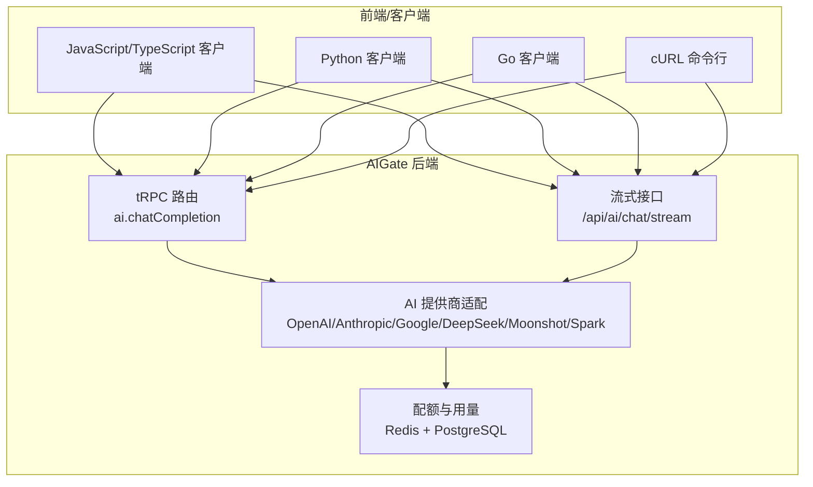
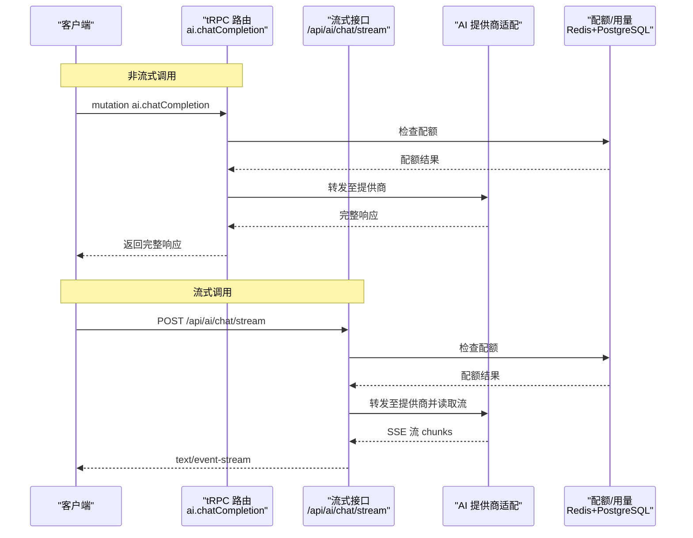
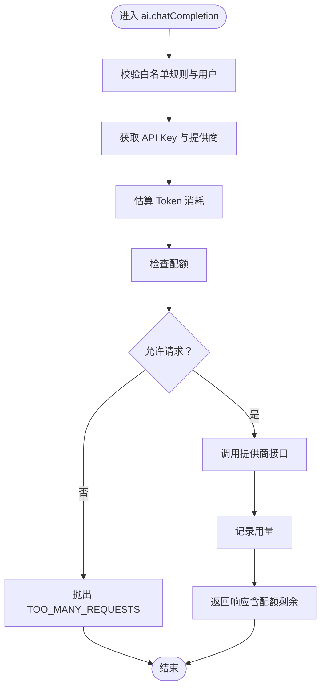
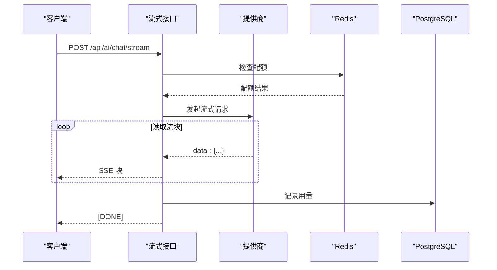
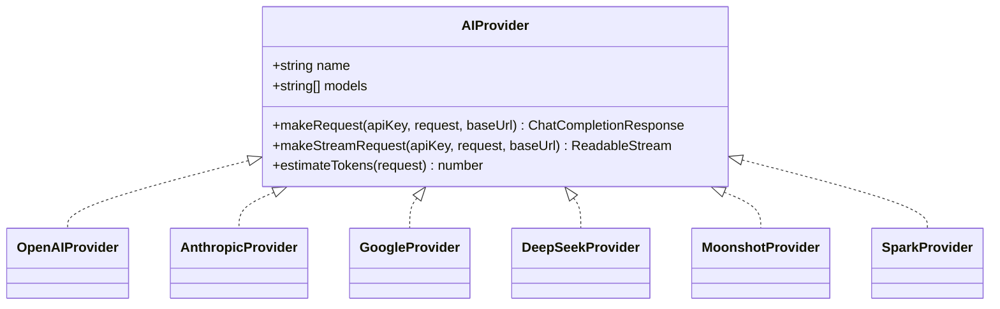
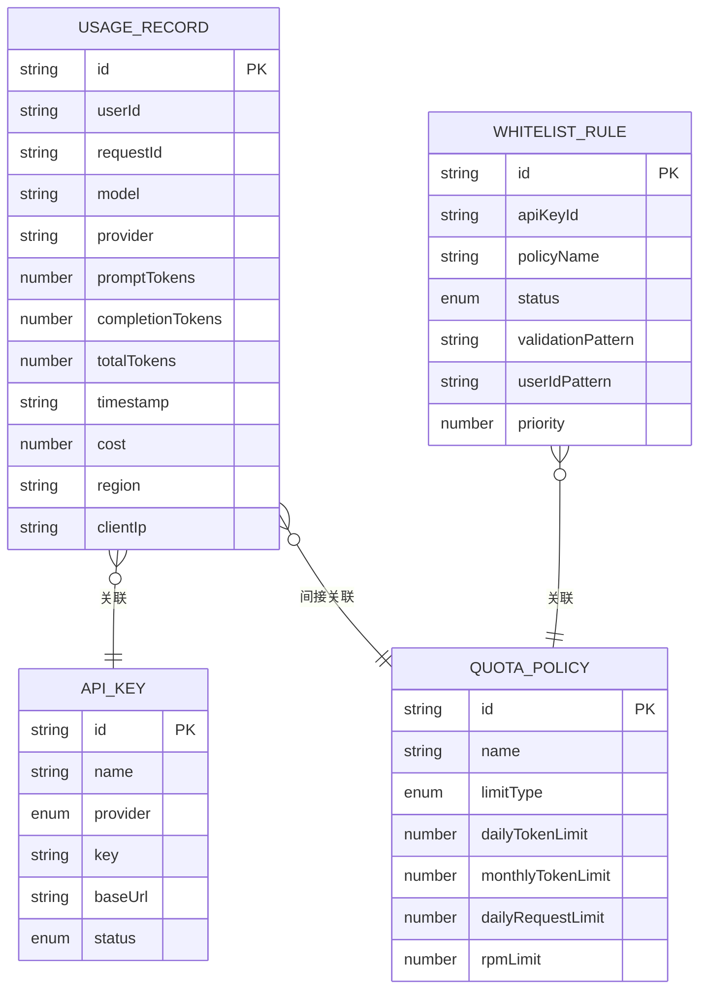
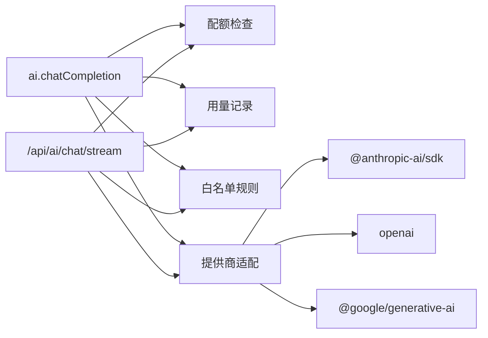

# 使用示例

<cite>
**本文引用的文件**
- [README.md](file://README.md)
- [docs/ai-api.md](file://docs/ai-api.md)
- [src/pages/api/ai/chat/stream.ts](file://src/pages/api/ai/chat/stream.ts)
- [src/lib/ai-providers.ts](file://src/lib/ai-providers.ts)
- [src/server/api/routers/ai.ts](file://src/server/api/routers/ai.ts)
- [src/lib/types.ts](file://src/lib/types.ts)
- [src/lib/quota.ts](file://src/lib/quota.ts)
- [src/lib/database.ts](file://src/lib/database.ts)
- [src/utils/api.ts](file://src/utils/api.ts)
- [package.json](file://package.json)
</cite>

## 目录
1. [简介](#简介)
2. [项目结构](#项目结构)
3. [核心组件](#核心组件)
4. [架构总览](#架构总览)
5. [详细组件分析](#详细组件分析)
6. [依赖关系分析](#依赖关系分析)
7. [性能考虑](#性能考虑)
8. [故障排查指南](#故障排查指南)
9. [结论](#结论)
10. [附录](#附录)

## 简介
本指南面向希望在生产环境中集成 AIGate AI 网关的开发者，提供多语言客户端集成示例与端到端使用流程，涵盖：
- 从获取 API Key 到成功调用 AI 服务的完整链路
- 多语言客户端示例：JavaScript/TypeScript、Python、Go、curl
- 认证头与请求参数设置
- 流式响应处理与错误处理
- 性能优化建议与最佳实践

## 项目结构
AIGate 基于 Next.js 14 + tRPC + Redis 构建，后端通过 tRPC 暴露类型安全的 API，并在特定场景下提供原生 HTTP 流式接口（Server-Sent Events）。核心目录与文件如下：
- 文档与说明：README.md、docs/ai-api.md
- tRPC 路由：src/server/api/routers/ai.ts
- 流式接口：src/pages/api/ai/chat/stream.ts
- AI 提供商适配：src/lib/ai-providers.ts
- 类型定义：src/lib/types.ts
- 配额与用量：src/lib/quota.ts、src/lib/database.ts
- tRPC 类型推断工具：src/utils/api.ts
- 依赖与包管理：package.json

图表来源
- [src/server/api/routers/ai.ts](file://src/server/api/routers/ai.ts#L88-L213)
- [src/pages/api/ai/chat/stream.ts](file://src/pages/api/ai/chat/stream.ts#L10-L183)
- [src/lib/ai-providers.ts](file://src/lib/ai-providers.ts#L688-L759)
- [src/lib/quota.ts](file://src/lib/quota.ts#L78-L200)

章节来源
- [README.md](file://README.md#L52-L83)
- [docs/ai-api.md](file://docs/ai-api.md#L1-L16)

## 核心组件
- tRPC 路由：提供类型安全的聊天补全接口（非流式）、模型列表查询、Token 估算、配额信息查询等。
- 流式接口：基于 Server-Sent Events 的实时流式响应，适合逐字显示的交互体验。
- AI 提供商适配：统一封装 OpenAI、Anthropic、Google、DeepSeek、Moonshot、Spark 的请求与流式转换。
- 配额与用量：基于 Redis 的每日 Token/请求次数限制与 RPM 限制，结合 PostgreSQL 记录用量明细。

章节来源
- [src/server/api/routers/ai.ts](file://src/server/api/routers/ai.ts#L88-L301)
- [src/pages/api/ai/chat/stream.ts](file://src/pages/api/ai/chat/stream.ts#L10-L183)
- [src/lib/ai-providers.ts](file://src/lib/ai-providers.ts#L12-L759)
- [src/lib/quota.ts](file://src/lib/quota.ts#L78-L327)

## 架构总览
AIGate 的调用链路分为两类：
- tRPC 非流式：ai.chatCompletion mutation，返回完整响应。
- 流式：/api/ai/chat/stream，返回 text/event-stream。

图表来源
- [src/server/api/routers/ai.ts](file://src/server/api/routers/ai.ts#L98-L213)
- [src/pages/api/ai/chat/stream.ts](file://src/pages/api/ai/chat/stream.ts#L20-L183)
- [src/lib/ai-providers.ts](file://src/lib/ai-providers.ts#L12-L759)
- [src/lib/quota.ts](file://src/lib/quota.ts#L78-L200)

## 详细组件分析

### tRPC 路由：聊天补全（非流式）
- 路径：ai.chatCompletion（mutation）
- 关键流程：
  - 校验白名单规则与用户合法性
  - 获取 API Key 与提供商
  - 估算 Token 消耗并检查配额
  - 调用提供商接口并记录用量
  - 返回带配额剩余信息的响应

图表来源
- [src/server/api/routers/ai.ts](file://src/server/api/routers/ai.ts#L98-L213)
- [src/lib/quota.ts](file://src/lib/quota.ts#L78-L200)
- [src/lib/ai-providers.ts](file://src/lib/ai-providers.ts#L12-L759)

章节来源
- [src/server/api/routers/ai.ts](file://src/server/api/routers/ai.ts#L88-L213)
- [docs/ai-api.md](file://docs/ai-api.md#L18-L116)

### 流式接口：/api/ai/chat/stream
- 协议：Server-Sent Events（text/event-stream）
- 关键流程：
  - 校验白名单与用户
  - 获取 API Key 与提供商（必须支持流式）
  - 估算 Token 并检查配额
  - 读取提供商流并转发给客户端
  - 统计实际用量并记录

图表来源
- [src/pages/api/ai/chat/stream.ts](file://src/pages/api/ai/chat/stream.ts#L20-L183)
- [src/lib/ai-providers.ts](file://src/lib/ai-providers.ts#L12-L759)
- [src/lib/quota.ts](file://src/lib/quota.ts#L202-L260)

章节来源
- [src/pages/api/ai/chat/stream.ts](file://src/pages/api/ai/chat/stream.ts#L10-L183)
- [docs/ai-api.md](file://docs/ai-api.md#L245-L380)

### AI 提供商适配
- 统一接口：makeRequest、makeStreamRequest、estimateTokens
- 支持提供商：OpenAI、Anthropic、Google、DeepSeek、Moonshot、Spark
- 流式转换：将各提供商的 SSE/流格式转换为 OpenAI 兼容格式

图表来源
- [src/lib/ai-providers.ts](file://src/lib/ai-providers.ts#L12-L759)

章节来源
- [src/lib/ai-providers.ts](file://src/lib/ai-providers.ts#L12-L759)
- [docs/ai-api.md](file://docs/ai-api.md#L49-L66)

### 类型与数据模型
- 请求/响应类型：ChatCompletionRequest、ChatCompletionResponse、UsageRecord、QuotaCheckResult
- tRPC 类型推断：RouterInputs、RouterOutputs

图表来源
- [src/lib/types.ts](file://src/lib/types.ts#L4-L117)
- [src/lib/database.ts](file://src/lib/database.ts#L1-L692)

章节来源
- [src/lib/types.ts](file://src/lib/types.ts#L47-L117)
- [src/utils/api.ts](file://src/utils/api.ts#L1-L17)

## 依赖关系分析
- tRPC 路由依赖：配额检查、用量记录、白名单规则、提供商适配
- 流式接口依赖：同上，且依赖提供商的流式实现
- 提供商适配依赖：第三方 SDK（如 openai、@anthropic-ai/sdk、@google/generative-ai）

图表来源
- [src/server/api/routers/ai.ts](file://src/server/api/routers/ai.ts#L1-L14)
- [src/pages/api/ai/chat/stream.ts](file://src/pages/api/ai/chat/stream.ts#L1-L9)
- [src/lib/ai-providers.ts](file://src/lib/ai-providers.ts#L1-L6)

章节来源
- [package.json](file://package.json#L18-L68)

## 性能考虑
- 流式响应：优先使用流式接口以降低首字延迟，提升用户体验。
- 预估 Token：在发送前估算 Token，避免超限导致的失败与重试。
- 缓存策略：API Key 与配额策略在 Redis 中缓存，减少数据库压力。
- RPM 限制：注意每分钟请求限制，避免触发限流。
- 日志与监控：结合 aigate_metadata 中的 processingTime 字段进行性能观测。

章节来源
- [docs/ai-api.md](file://docs/ai-api.md#L629-L649)
- [src/lib/quota.ts](file://src/lib/quota.ts#L78-L200)
- [src/lib/ai-providers.ts](file://src/lib/ai-providers.ts#L709-L759)

## 故障排查指南
常见错误与处理建议：
- 403 FORBIDDEN：用户不在白名单或被禁用；检查白名单规则与用户格式。
- 400 BAD_REQUEST：API Key 不存在/已禁用或提供商不支持；确认 apiKeyId 与 provider。
- 429 TOO_MANY_REQUESTS：配额已用完；使用配额查询接口或等待重置。
- 500 INTERNAL_SERVER_ERROR：服务器内部错误；查看日志并联系管理员。

章节来源
- [docs/ai-api.md](file://docs/ai-api.md#L108-L116)
- [src/server/api/routers/ai.ts](file://src/server/api/routers/ai.ts#L108-L213)
- [src/pages/api/ai/chat/stream.ts](file://src/pages/api/ai/chat/stream.ts#L20-L183)

## 结论
AIGate 提供了统一、可扩展的 AI 网关能力，支持多提供商与多模式（流式/非流式）。通过 tRPC 与流式接口，开发者可以快速集成并优化用户体验。建议在生产中结合配额预估、流式响应与缓存策略，确保稳定与高性能。

## 附录

### 多语言客户端集成示例与最佳实践

- JavaScript/TypeScript（fetch）
  - 非流式：调用 tRPC 路由 ai.chatCompletion，处理响应中的 choices 与 aigate_metadata。
  - 流式：调用 /api/ai/chat/stream，使用 ReadableStream 逐块解析 data: 行，直到 [DONE]。
  - 错误处理：捕获 TRPCError 或 HTTP 错误，按错误码分类处理。
  - 参考示例路径：
    - [docs/ai-api.md](file://docs/ai-api.md#L119-L182)
    - [docs/ai-api.md](file://docs/ai-api.md#L291-L379)

- Python
  - 非流式：使用 requests 发送 JSON 至 /api/trpc/ai.chatCompletion，解析 result.data。
  - 流式：使用 requests 以流模式接收 text/event-stream，逐行解析 data: 行。
  - 错误处理：根据 HTTP 状态码与响应体中的错误信息分类处理。
  - 参考示例路径：
    - [docs/ai-api.md](file://docs/ai-api.md#L184-L241)

- Go
  - 非流式：使用 net/http 发送 JSON 至 /api/trpc/ai.chatCompletion，解析响应。
  - 流式：使用 io.ReadCloser 读取 text/event-stream，逐行解析 data: 行。
  - 错误处理：根据 HTTP 状态码与响应体中的错误信息分类处理。
  - 参考示例路径：
    - [docs/ai-api.md](file://docs/ai-api.md#L184-L241)

- curl
  - 非流式：参考 README 中的 OpenAI 兼容接口示例，设置 Content-Type 与必要头部。
  - 流式：使用 curl -N 与自定义事件监听器解析 SSE。
  - 参考示例路径：
    - [README.md](file://README.md#L56-L68)
    - [docs/ai-api.md](file://docs/ai-api.md#L184-L210)

- 认证头与参数设置
  - userId：用于身份验证与配额检查
  - apiKeyId：用于选择提供商与密钥
  - request：包含 model、messages、temperature、max_tokens、stream 等
  - 参考示例路径：
    - [docs/ai-api.md](file://docs/ai-api.md#L28-L47)

- 端到端使用场景（从 API Key 获取到成功调用）
  - 在管理后台创建/绑定 API Key 与白名单规则
  - 使用 tRPC 或流式接口发起请求
  - 解析响应并记录用量与配额剩余
  - 参考示例路径：
    - [docs/ai-api.md](file://docs/ai-api.md#L18-L116)
    - [docs/ai-api.md](file://docs/ai-api.md#L245-L380)

- 性能优化与最佳实践
  - 优先使用流式接口
  - 发送前估算 Token 并检查配额
  - 合理设置 temperature 与 max_tokens
  - 使用缓存与连接池，避免频繁初始化
  - 参考示例路径：
    - [docs/ai-api.md](file://docs/ai-api.md#L653-L788)