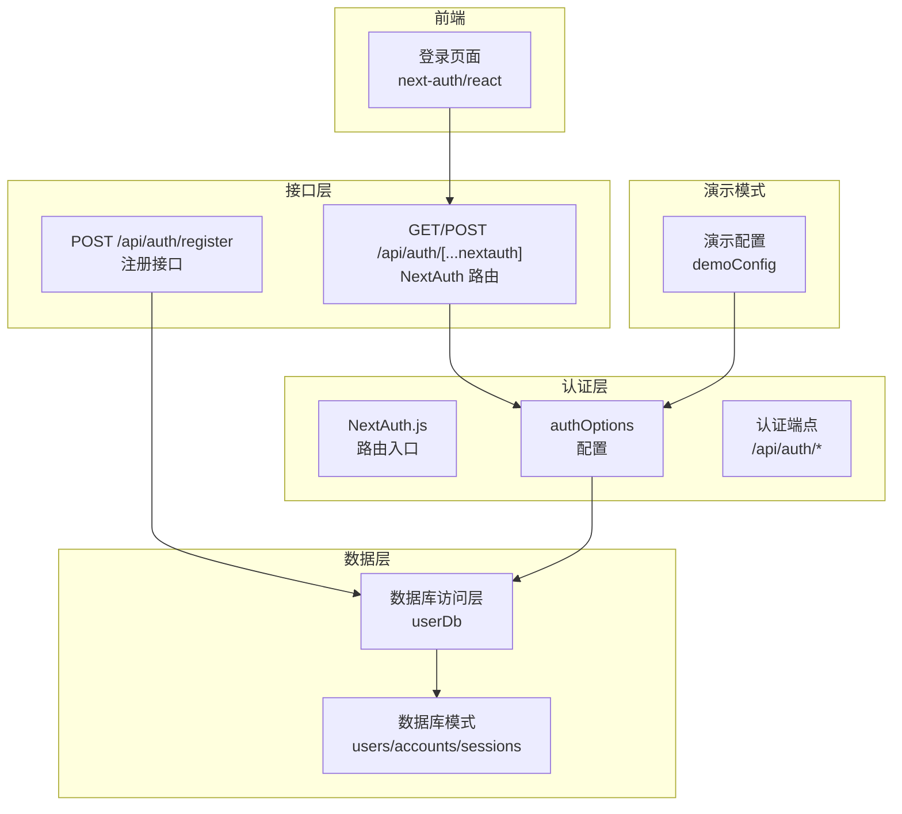
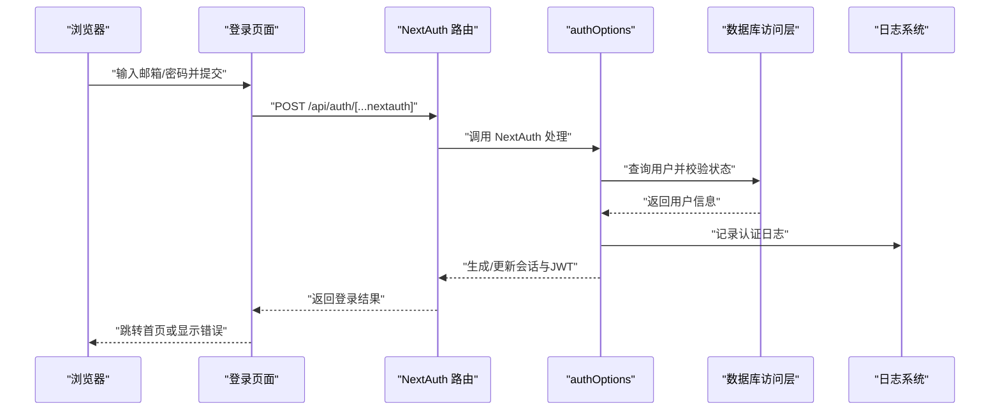
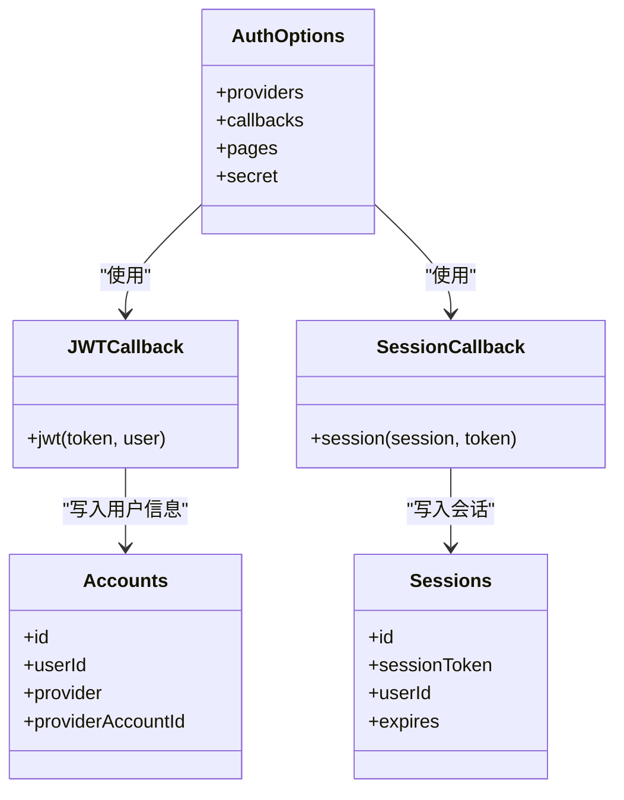
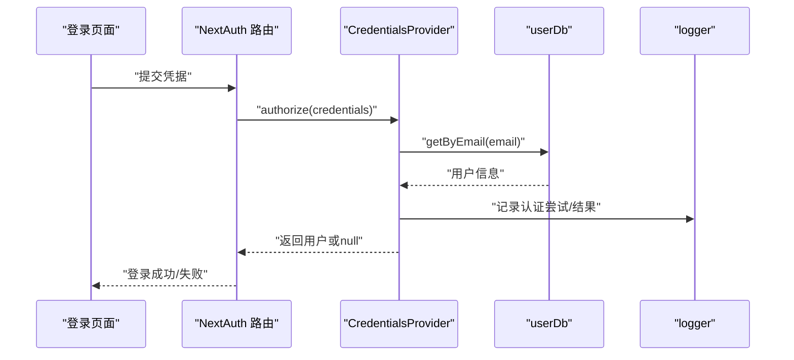
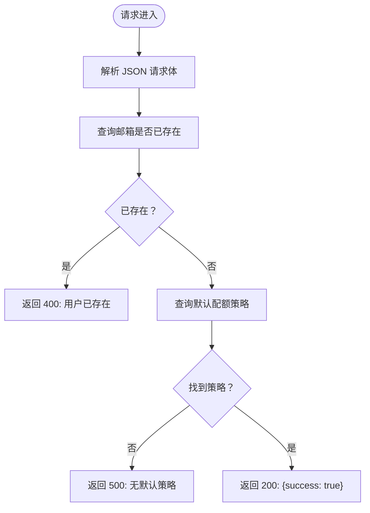
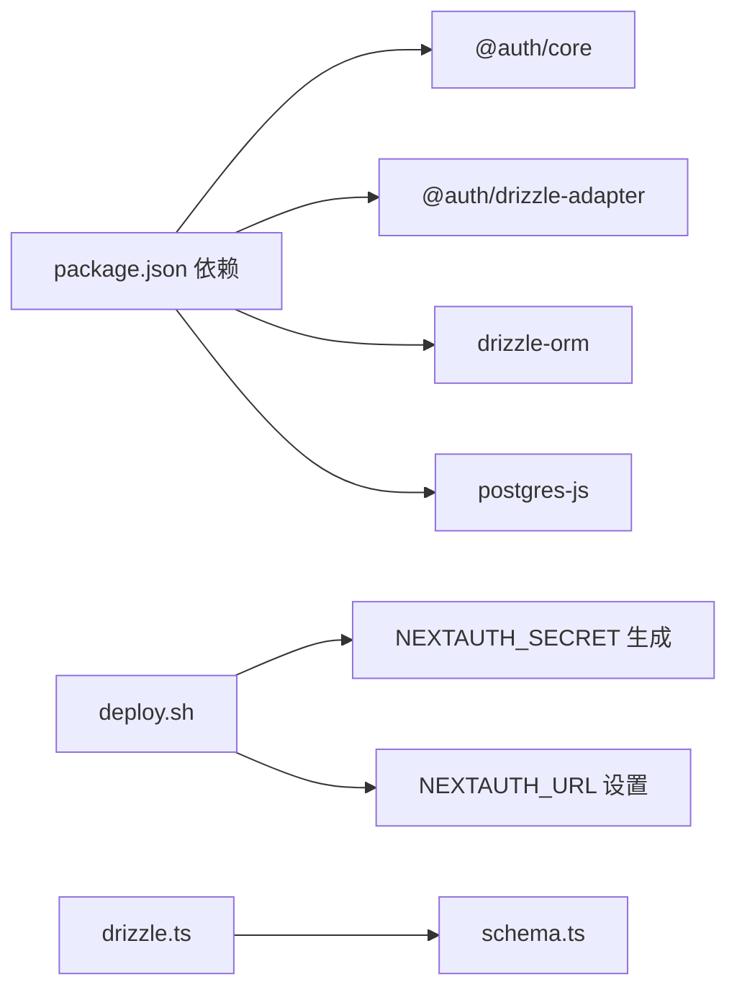

# 认证接口

<cite>
**本文档引用的文件**
- [src/app/api/auth/[...nextauth]/route.ts](file://src/app/api/auth/[...nextauth]/route.ts)
- [src/auth.ts](file://src/auth.ts)
- [src/app/api/auth/register/route.ts](file://src/app/api/auth/register/route.ts)
- [src/app/login/page.tsx](file://src/app/login/page.tsx)
- [src/lib/schema.ts](file://src/lib/schema.ts)
- [src/lib/database.ts](file://src/lib/database.ts)
- [src/lib/logger.ts](file://src/lib/logger.ts)
- [src/lib/demo-config.ts](file://src/lib/demo-config.ts)
- [src/lib/validations/auth.ts](file://src/lib/validations/auth.ts)
- [src/lib/drizzle.ts](file://src/lib/drizzle.ts)
- [package.json](file://package.json)
- [deploy.sh](file://deploy.sh)
</cite>

## 更新摘要
**所做更改**
- 更新了 NextAuth.js 配置的详细分析，包括演示模式支持
- 完善了凭据认证流程的技术细节
- 添加了 JWT 令牌生成与验证机制的完整说明
- 更新了注册接口的当前实现状态
- 增强了登录页面的前端交互说明
- 完善了数据库模式和会话存储的技术细节

## 目录
1. [简介](#简介)
2. [项目结构](#项目结构)
3. [核心组件](#核心组件)
4. [架构总览](#架构总览)
5. [详细组件分析](#详细组件分析)
6. [依赖关系分析](#依赖关系分析)
7. [性能考虑](#性能考虑)
8. [故障排除指南](#故障排除指南)
9. [结论](#结论)

## 简介
本文件面向开发者与运维人员，系统化梳理基于 NextAuth.js 的认证体系在本项目中的实现与使用方式。重点覆盖以下方面：
- NextAuth.js 集成的认证端点与流程（登录、注册、登出、会话管理）
- OAuth 提供商集成现状与扩展建议
- JWT 令牌生成与验证机制
- 完整认证流程示例与错误处理方案
- 用户注册流程、密码重置与账户激活的 API 规范

说明：
- 当前仓库实现了基于"凭据（用户名/密码）"的认证流程，并通过 NextAuth.js 管理会话与 JWT 生命周期。
- OAuth 提供商未在此仓库中实际启用，但 NextAuth.js 配置已预留扩展空间。
- 支持演示模式，提供特殊的演示用户登录体验。

## 项目结构
与认证直接相关的文件组织如下：
- NextAuth.js 路由入口：统一暴露 `[...nextauth]` 路由，内部委托给 NextAuth.js 处理
- 认证配置：集中于 `authOptions`，定义提供商、回调、页面重定向与密钥
- 注册路由：提供用户注册接口（当前逻辑需完善）
- 登录页面：前端使用 `next-auth/react` 发起登录
- 数据模型与数据库：用户、会话、账户等表结构
- 日志与安全：统一日志记录与 NEXTAUTH_SECRET 管理

**图表来源**
- [src/app/api/auth/[...nextauth]/route.ts](file://src/app/api/auth/[...nextauth]/route.ts#L1-L7)
- [src/auth.ts:7-143](file://src/auth.ts#L7-L143)
- [src/app/api/auth/register/route.ts:1-30](file://src/app/api/auth/register/route.ts#L1-L30)
- [src/app/login/page.tsx:1-165](file://src/app/login/page.tsx#L1-L165)
- [src/lib/schema.ts:70-137](file://src/lib/schema.ts#L70-L137)
- [src/lib/database.ts:712-740](file://src/lib/database.ts#L712-L740)
- [src/lib/demo-config.ts:1-57](file://src/lib/demo-config.ts#L1-L57)

**章节来源**
- [src/app/api/auth/[...nextauth]/route.ts](file://src/app/api/auth/[...nextauth]/route.ts#L1-L7)
- [src/auth.ts:7-143](file://src/auth.ts#L7-L143)
- [src/app/api/auth/register/route.ts:1-30](file://src/app/api/auth/register/route.ts#L1-L30)
- [src/app/login/page.tsx:1-165](file://src/app/login/page.tsx#L1-L165)
- [src/lib/schema.ts:70-137](file://src/lib/schema.ts#L70-L137)
- [src/lib/database.ts:712-740](file://src/lib/database.ts#L712-L740)
- [src/lib/demo-config.ts:1-57](file://src/lib/demo-config.ts#L1-L57)

## 核心组件
- NextAuth.js 路由入口
  - 将 `/api/auth/[...nextauth]` 路由交由 NextAuth.js 处理，支持 GET/POST
  - 参考路径：[src/app/api/auth/[...nextauth]/route.ts](file://src/app/api/auth/[...nextauth]/route.ts#L1-L7)
- 认证配置（authOptions）
  - 提供商：CredentialsProvider（用户名/密码）
  - 回调：jwt/session 回调注入用户角色与状态
  - 页面：登录页与错误页重定向
  - 密钥：NEXTAUTH_SECRET（生产环境必须设置）
  - 参考路径：[src/auth.ts:7-143](file://src/auth.ts#L7-L143)
- 注册接口
  - POST /api/auth/register：校验邮箱是否存在，关联默认配额策略
  - 注意：当前实现返回占位响应，业务逻辑需完善
  - 参考路径：[src/app/api/auth/register/route.ts:1-30](file://src/app/api/auth/register/route.ts#L1-L30)
- 登录页面
  - 使用 next-auth/react 的 signIn 方法提交凭据
  - 参考路径：[src/app/login/page.tsx:39-61](file://src/app/login/page.tsx#L39-L61)
- 数据模型与数据库
  - 用户表、会话表、账户表等
  - 用户数据库访问层（userDb）
  - 参考路径：[src/lib/schema.ts:70-137](file://src/lib/schema.ts#L70-L137)，[src/lib/database.ts:712-740](file://src/lib/database.ts#L712-L740)
- 日志与安全
  - 统一日志记录（认证、配额、HTTP 等）
  - NEXTAUTH_SECRET 自动生成与校验脚本
  - 参考路径：[src/lib/logger.ts:113-191](file://src/lib/logger.ts#L113-L191)，[deploy.sh:177-183](file://deploy.sh#L177-L183)
- 演示模式支持
  - 支持演示用户登录和特殊权限控制
  - 参考路径：[src/lib/demo-config.ts:1-57](file://src/lib/demo-config.ts#L1-L57)

**章节来源**
- [src/app/api/auth/[...nextauth]/route.ts](file://src/app/api/auth/[...nextauth]/route.ts#L1-L7)
- [src/auth.ts:7-143](file://src/auth.ts#L7-L143)
- [src/app/api/auth/register/route.ts:1-30](file://src/app/api/auth/register/route.ts#L1-L30)
- [src/app/login/page.tsx:39-61](file://src/app/login/page.tsx#L39-L61)
- [src/lib/schema.ts:70-137](file://src/lib/schema.ts#L70-L137)
- [src/lib/database.ts:712-740](file://src/lib/database.ts#L712-L740)
- [src/lib/logger.ts:113-191](file://src/lib/logger.ts#L113-L191)
- [deploy.sh:177-183](file://deploy.sh#L177-L183)
- [src/lib/demo-config.ts:1-57](file://src/lib/demo-config.ts#L1-L57)

## 架构总览
下图展示认证系统的整体交互：前端登录、NextAuth.js 处理、数据库访问与会话存储。

**图表来源**
- [src/app/login/page.tsx:39-61](file://src/app/login/page.tsx#L39-L61)
- [src/app/api/auth/[...nextauth]/route.ts](file://src/app/api/auth/[...nextauth]/route.ts#L1-L7)
- [src/auth.ts:15-117](file://src/auth.ts#L15-L117)
- [src/lib/database.ts:712-740](file://src/lib/database.ts#L712-L740)
- [src/lib/logger.ts:113-191](file://src/lib/logger.ts#L113-L191)

## 详细组件分析

### NextAuth.js 路由与会话管理
- 路由入口
  - 统一导出 GET/POST，内部委托 NextAuth(authOptions)
  - 参考路径：[src/app/api/auth/[...nextauth]/route.ts](file://src/app/api/auth/[...nextauth]/route.ts#L1-L7)
- 会话与 JWT
  - jwt 回调：将用户 id、role、status 写入 token
  - session 回调：将 token 中的用户信息注入 session.user
  - 参考路径：[src/auth.ts:120-137](file://src/auth.ts#L120-L137)
- 登录页与错误页
  - signIn 指向 /login，错误时也重定向到 /login
  - 参考路径：[src/auth.ts:138-142](file://src/auth.ts#L138-L142)
- 会话存储
  - NextAuth.js 默认使用数据库适配器（由 @auth/drizzle-adapter 支持）
  - 数据库模式包含 accounts 与 sessions 表
  - 参考路径：[src/lib/schema.ts:100-125](file://src/lib/schema.ts#L100-L125)

**图表来源**
- [src/auth.ts:7-143](file://src/auth.ts#L7-L143)
- [src/lib/schema.ts:100-125](file://src/lib/schema.ts#L100-L125)

**章节来源**
- [src/app/api/auth/[...nextauth]/route.ts](file://src/app/api/auth/[...nextauth]/route.ts#L1-L7)
- [src/auth.ts:120-137](file://src/auth.ts#L120-L137)
- [src/lib/schema.ts:100-125](file://src/lib/schema.ts#L100-L125)

### 登录接口（凭据认证）
- 前端调用
  - 使用 next-auth/react 的 signIn('credentials', { email, password, redirect: false })
  - 成功后跳转首页，失败显示错误
  - 参考路径：[src/app/login/page.tsx:39-61](file://src/app/login/page.tsx#L39-L61)
- 后端授权
  - CredentialsProvider.authorize：校验邮箱/密码、用户状态与角色
  - 支持演示模式下的特殊用户登录
  - 记录认证日志（成功/失败）
  - 参考路径：[src/auth.ts:15-117](file://src/auth.ts#L15-L117)，[src/lib/logger.ts:173-191](file://src/lib/logger.ts#L173-L191)
- 数据访问
  - userDb.getByEmail 查询用户
  - 参考路径：[src/lib/database.ts:712-740](file://src/lib/database.ts#L712-L740)

**图表来源**
- [src/app/login/page.tsx:39-61](file://src/app/login/page.tsx#L39-L61)
- [src/auth.ts:15-117](file://src/auth.ts#L15-L117)
- [src/lib/database.ts:712-740](file://src/lib/database.ts#L712-L740)
- [src/lib/logger.ts:173-191](file://src/lib/logger.ts#L173-L191)

**章节来源**
- [src/app/login/page.tsx:39-61](file://src/app/login/page.tsx#L39-L61)
- [src/auth.ts:15-117](file://src/auth.ts#L15-L117)
- [src/lib/database.ts:712-740](file://src/lib/database.ts#L712-L740)
- [src/lib/logger.ts:173-191](file://src/lib/logger.ts#L173-L191)

### 注册接口规范
- 端点
  - POST /api/auth/register
- 请求体
  - email: string（必填）
- 响应
  - 成功：{ success: true }
  - 失败：{ error: string }（状态码 400/500）
- 业务逻辑
  - 校验邮箱是否已存在
  - 关联默认配额策略（当前实现返回占位响应，业务逻辑需完善）
- 参考路径
  - [src/app/api/auth/register/route.ts:1-30](file://src/app/api/auth/register/route.ts#L1-L30)

**图表来源**
- [src/app/api/auth/register/route.ts:1-30](file://src/app/api/auth/register/route.ts#L1-L30)

**章节来源**
- [src/app/api/auth/register/route.ts:1-30](file://src/app/api/auth/register/route.ts#L1-L30)

### OAuth 提供商集成
- 现状
  - 本仓库未启用任何 OAuth 提供商
  - NextAuth.js 配置中仅定义了 CredentialsProvider
- 扩展建议
  - 在 authOptions.providers 中添加所需 OAuth 提供商（如 Google、GitHub 等）
  - 配置回调以处理用户信息持久化与会话注入
  - 参考路径：[src/auth.ts:7-119](file://src/auth.ts#L7-L119)

**章节来源**
- [src/auth.ts:7-119](file://src/auth.ts#L7-L119)

### JWT 令牌生成与验证机制
- 生成
  - 登录成功后，NextAuth.js 在 jwt 回调中将用户 id、role、status 写入 token
  - 参考路径：[src/auth.ts:120-127](file://src/auth.ts#L120-L127)
- 注入
  - session 回调将 token 中的用户信息注入 session.user
  - 参考路径：[src/auth.ts:128-136](file://src/auth.ts#L128-L136)
- 验证
  - 服务器端通过 getServerSession 获取当前会话
  - 前端通过 next-auth/react 的 useSession 获取会话
  - 参考路径：[src/auth.ts:145-147](file://src/auth.ts#L145-L147)，[src/app/login/page.tsx:1-165](file://src/app/login/page.tsx#L1-L165)

**章节来源**
- [src/auth.ts:120-147](file://src/auth.ts#L120-L147)
- [src/app/login/page.tsx:1-165](file://src/app/login/page.tsx#L1-L165)

### 会话管理与登出
- 会话存储
  - NextAuth.js 使用数据库适配器存储会话与账户信息
  - 参考路径：[src/lib/schema.ts:100-125](file://src/lib/schema.ts#L100-L125)
- 登出
  - 可通过 next-auth/react 的 signOut 或调用 NextAuth 的登出路由实现
  - 登出后会清理会话与相关 cookie
  - 参考路径：[src/app/login/page.tsx:1-165](file://src/app/login/page.tsx#L1-L165)

**章节来源**
- [src/lib/schema.ts:100-125](file://src/lib/schema.ts#L100-L125)
- [src/app/login/page.tsx:1-165](file://src/app/login/page.tsx#L1-L165)

### 演示模式认证系统
- 演示模式支持
  - 支持演示用户登录（demo@example.com/demo123）
  - 自动创建演示用户并赋予 ADMIN 权限
  - 参考路径：[src/lib/demo-config.ts:12-36](file://src/lib/demo-config.ts#L12-L36)
- 认证流程
  - 演示模式下优先检查演示用户
  - 支持从数据库用户登录
  - 参考路径：[src/auth.ts:21-54](file://src/auth.ts#L21-L54)
- 权限控制
  - 演示用户默认为 ADMIN 角色
  - 可配置演示模式下的权限限制
  - 参考路径：[src/lib/demo-config.ts:38-56](file://src/lib/demo-config.ts#L38-L56)

**章节来源**
- [src/lib/demo-config.ts:12-56](file://src/lib/demo-config.ts#L12-L56)
- [src/auth.ts:21-54](file://src/auth.ts#L21-L54)

### 密码重置与账户激活
- 现状
  - 本仓库未提供密码重置与账户激活的专用接口
- 建议实现
  - 密码重置：生成一次性验证码/令牌，发送邮件，校验后更新用户密码
  - 账户激活：注册后发送激活链接，点击后更新用户状态为 ACTIVE
  - 可参考 verification_tokens 表结构设计
  - 参考路径：[src/lib/schema.ts:127-137](file://src/lib/schema.ts#L127-L137)

**章节来源**
- [src/lib/schema.ts:127-137](file://src/lib/schema.ts#L127-L137)

## 依赖关系分析
- NextAuth.js 版本与适配器
  - 依赖 @auth/core 与 @auth/drizzle-adapter
  - 参考路径：[package.json:22-23](file://package.json#L22-L23)
- Drizzle ORM 集成
  - 使用 drizzle-orm/postgres-js 进行数据库操作
  - 参考路径：[src/lib/drizzle.ts:1-9](file://src/lib/drizzle.ts#L1-L9)
- 部署与密钥
  - 部署脚本自动检测并生成 NEXTAUTH_SECRET 与 NEXTAUTH_URL
  - 参考路径：[deploy.sh:177-183](file://deploy.sh#L177-L183)

**图表来源**
- [package.json:22-23](file://package.json#L22-L23)
- [src/lib/drizzle.ts:1-9](file://src/lib/drizzle.ts#L1-L9)
- [deploy.sh:177-183](file://deploy.sh#L177-L183)

**章节来源**
- [package.json:22-23](file://package.json#L22-L23)
- [src/lib/drizzle.ts:1-9](file://src/lib/drizzle.ts#L1-L9)
- [deploy.sh:177-183](file://deploy.sh#L177-L183)

## 性能考虑
- 会话查询优化
  - 使用数据库索引与合适的查询条件，避免全表扫描
- 日志开销控制
  - 生产环境启用文件轮转，避免日志过大影响 IO
  - 参考路径：[src/lib/logger.ts:50-99](file://src/lib/logger.ts#L50-L99)
- 并发登录与令牌刷新
  - 合理设置会话过期时间与刷新策略，减少无效会话占用
- OAuth 扩展
  - 如启用第三方 OAuth，注意提供商限流与缓存策略
- 演示模式优化
  - 演示模式下禁用日志记录以提升性能
  - 参考路径：[src/lib/logger.ts:20-21](file://src/lib/logger.ts#L20-L21)

**章节来源**
- [src/lib/logger.ts:50-99](file://src/lib/logger.ts#L50-L99)
- [src/lib/logger.ts:20-21](file://src/lib/logger.ts#L20-L21)

## 故障排除指南
- NEXTAUTH_SECRET 未设置
  - 现象：会话异常或运行报错
  - 处理：通过部署脚本生成或手动设置环境变量
  - 参考路径：[deploy.sh:177-183](file://deploy.sh#L177-L183)
- 登录失败
  - 检查邮箱/密码是否正确、用户状态是否为 ACTIVE、角色是否为 ADMIN
  - 查看认证日志定位问题
  - 参考路径：[src/auth.ts:15-117](file://src/auth.ts#L15-L117)，[src/lib/logger.ts:173-191](file://src/lib/logger.ts#L173-L191)
- 注册接口异常
  - 检查默认配额策略是否存在、数据库连接是否正常
  - 参考路径：[src/app/api/auth/register/route.ts:1-30](file://src/app/api/auth/register/route.ts#L1-L30)
- OAuth 无法使用
  - 确认 providers 已正确配置，回调与环境变量已设置
  - 参考路径：[src/auth.ts:7-119](file://src/auth.ts#L7-L119)
- 演示模式问题
  - 检查 DEMO_MODE 和 NEXT_PUBLIC_DEMO_MODE 环境变量
  - 验证演示用户配置是否正确
  - 参考路径：[src/lib/demo-config.ts:6-9](file://src/lib/demo-config.ts#L6-L9)

**章节来源**
- [deploy.sh:177-183](file://deploy.sh#L177-L183)
- [src/auth.ts:15-117](file://src/auth.ts#L15-L117)
- [src/lib/logger.ts:173-191](file://src/lib/logger.ts#L173-L191)
- [src/app/api/auth/register/route.ts:1-30](file://src/app/api/auth/register/route.ts#L1-L30)
- [src/auth.ts:7-119](file://src/auth.ts#L7-L119)
- [src/lib/demo-config.ts:6-9](file://src/lib/demo-config.ts#L6-L9)

## 结论
本项目基于 NextAuth.js 实现了完善的会话与 JWT 管理，当前以"凭据认证"为主，具备良好的扩展性。系统还支持演示模式，为开发和测试提供了便利。建议后续完善注册流程、密码重置与账户激活接口，并可按需引入 OAuth 提供商以增强用户体验。同时，务必在生产环境正确配置 NEXTAUTH_SECRET 与 NEXTAUTH_URL，确保认证安全与稳定。演示模式的加入使得系统在开发阶段更加灵活，但需要注意在生产环境中禁用演示模式以确保安全性。