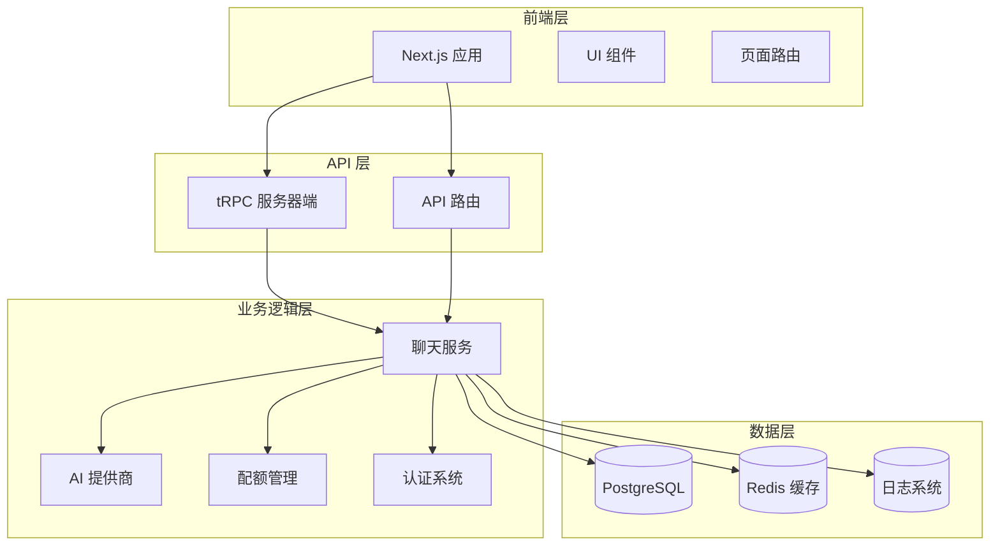
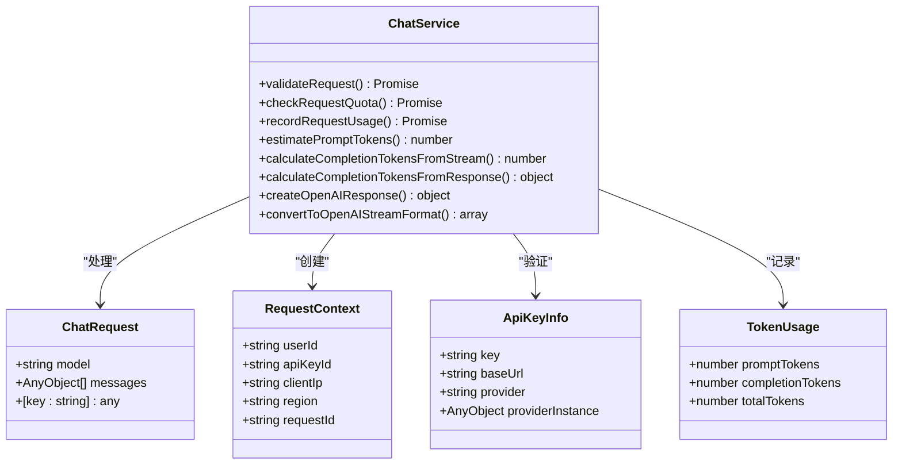
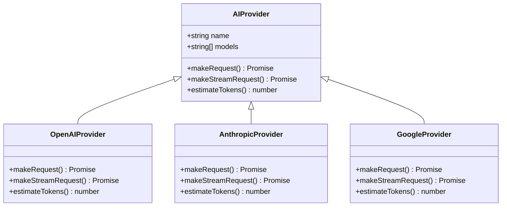
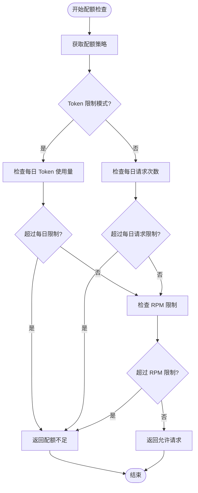
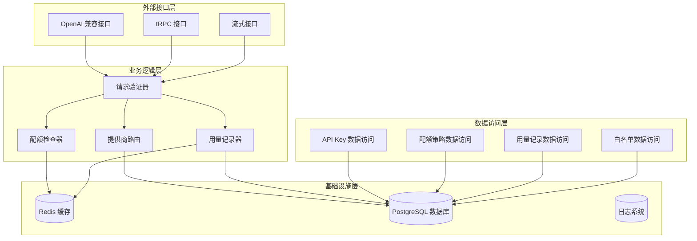
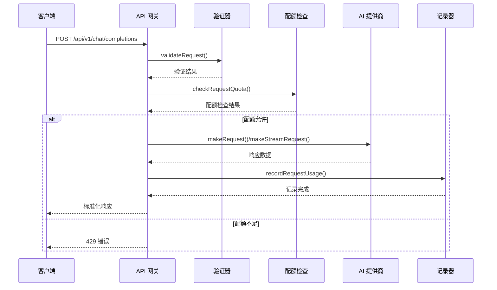
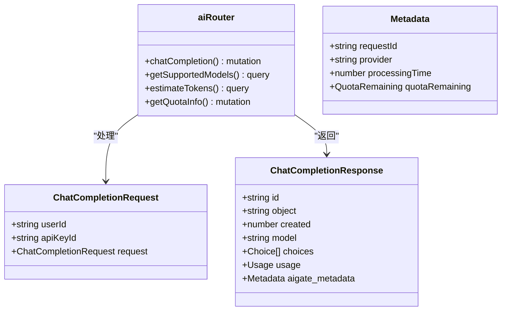
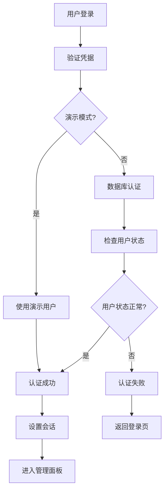
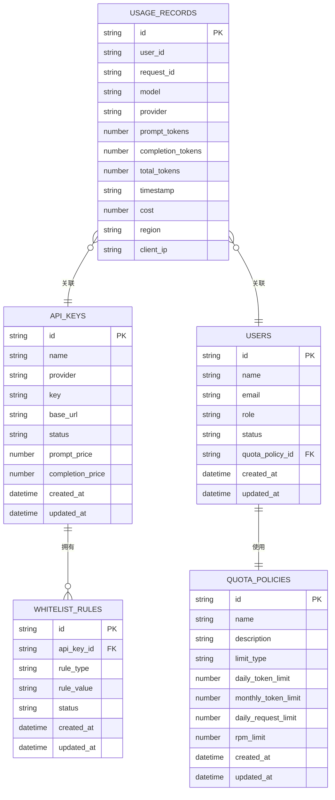

# Chat Service Integration

<cite>
**本文档引用的文件**
- [src/lib/chat-service.ts](file://src/lib/chat-service.ts)
- [src/pages/api/ai/chat/completions.ts](file://src/pages/api/ai/chat/completions.ts)
- [src/pages/api/ai/chat/stream.ts](file://src/pages/api/ai/chat/stream.ts)
- [src/server/api/routers/ai.ts](file://src/server/api/routers/ai.ts)
- [src/lib/ai-providers.ts](file://src/lib/ai-providers.ts)
- [src/lib/types.ts](file://src/lib/types.ts)
- [src/lib/quota.ts](file://src/lib/quota.ts)
- [src/lib/database.ts](file://src/lib/database.ts)
- [src/lib/provider-utils.ts](file://src/lib/provider-utils.ts)
- [src/auth.ts](file://src/auth.ts)
- [docs/ai-api.md](file://docs/ai-api.md)
- [README.md](file://README.md)
</cite>

## 目录
1. [简介](#简介)
2. [项目结构](#项目结构)
3. [核心组件](#核心组件)
4. [架构概览](#架构概览)
5. [详细组件分析](#详细组件分析)
6. [依赖关系分析](#依赖关系分析)
7. [性能考虑](#性能考虑)
8. [故障排除指南](#故障排除指南)
9. [结论](#结论)

## 简介

AIGate 是一个基于 Next.js 16 + tRPC + Redis 的智能 AI 网关管理系统，专门设计用于集成和管理多种 AI 服务提供商的聊天服务。该项目提供了统一的 API 接口，支持 OpenAI、Anthropic、Google、DeepSeek、Moonshot 和 Spark 等主流 AI 服务提供商。

该系统的核心功能包括：
- 智能配额管理：基于 Redis 的实时配额检查，支持 Token 和请求次数双重限制
- 多模型代理：统一接入多家 AI 服务提供商
- 高性能架构：tRPC 类型安全 API + Redis 缓存，毫秒级响应
- 安全认证：NextAuth.js 身份验证，支持管理员账户动态配置
- 实时监控：仪表板展示请求趋势、地区分布、IP 记录等关键指标

## 项目结构

项目采用模块化架构设计，主要分为以下几个核心层次：



**图表来源**
- [src/lib/chat-service.ts:1-287](file://src/lib/chat-service.ts#L1-L287)
- [src/server/api/routers/ai.ts:1-301](file://src/server/api/routers/ai.ts#L1-L301)
- [src/lib/ai-providers.ts:1-759](file://src/lib/ai-providers.ts#L1-L759)

**章节来源**
- [README.md:1-88](file://README.md#L1-L88)
- [src/lib/chat-service.ts:1-287](file://src/lib/chat-service.ts#L1-L287)

## 核心组件

### 聊天服务核心模块

聊天服务是整个系统的核心，负责处理所有 AI 聊天请求的生命周期管理。

#### 主要职责
- 请求验证和授权
- 配额检查和限制
- 多提供商 API 调用
- 流式和非流式响应处理
- 使用量统计和成本计算

#### 关键接口定义



**图表来源**
- [src/lib/chat-service.ts:12-47](file://src/lib/chat-service.ts#L12-L47)

**章节来源**
- [src/lib/chat-service.ts:1-287](file://src/lib/chat-service.ts#L1-L287)

### AI 提供商集成

系统支持多家 AI 服务提供商，通过统一的接口抽象实现标准化调用。

#### 支持的提供商
- OpenAI：gpt-4o, gpt-4o-mini, gpt-4-turbo 等
- Anthropic：claude-3-opus, claude-3-sonnet, claude-3-haiku 等
- Google：gemini-pro, gemini-pro-vision 等
- DeepSeek：deepseek-chat, deepseek-coder 等
- Moonshot：moonshot-v1-8k, moonshot-v1-32k, moonshot-v1-128k 等
- Spark：spark-3.5, spark-3.0, spark-2.0, spark-lite 等

#### 提供商接口规范



**图表来源**
- [src/lib/ai-providers.ts:13-27](file://src/lib/ai-providers.ts#L13-L27)

**章节来源**
- [src/lib/ai-providers.ts:1-759](file://src/lib/ai-providers.ts#L1-L759)

### 配额管理系统

系统实现了灵活的配额管理机制，支持多种限制模式和策略配置。

#### 配额策略类型
- Token 限制模式：基于每日/每月消耗的 Token 数量限制
- 请求次数限制模式：基于每日请求次数限制
- RPM 限制：每分钟请求次数限制

#### 配额检查流程



**图表来源**
- [src/lib/quota.ts:79-200](file://src/lib/quota.ts#L79-L200)

**章节来源**
- [src/lib/quota.ts:1-327](file://src/lib/quota.ts#L1-L327)

## 架构概览

系统采用分层架构设计，确保了良好的可维护性和扩展性。



**图表来源**
- [src/pages/api/ai/chat/completions.ts:23-96](file://src/pages/api/ai/chat/completions.ts#L23-L96)
- [src/server/api/routers/ai.ts:88-213](file://src/server/api/routers/ai.ts#L88-L213)

**章节来源**
- [src/pages/api/ai/chat/completions.ts:1-226](file://src/pages/api/ai/chat/completions.ts#L1-L226)
- [src/server/api/routers/ai.ts:1-301](file://src/server/api/routers/ai.ts#L1-L301)

## 详细组件分析

### OpenAI 兼容接口

系统提供了完整的 OpenAI 兼容接口，确保与现有 OpenAI SDK 的无缝集成。

#### 接口特性
- 支持标准 OpenAI 请求格式
- 完整的消息历史管理
- 流式和非流式响应支持
- 统一的错误处理机制

#### 请求处理流程



**图表来源**
- [src/pages/api/ai/chat/completions.ts:46-96](file://src/pages/api/ai/chat/completions.ts#L46-L96)

**章节来源**
- [src/pages/api/ai/chat/completions.ts:1-226](file://src/pages/api/ai/chat/completions.ts#L1-L226)

### tRPC 服务器端接口

系统还提供了基于 tRPC 的服务器端接口，支持类型安全的客户端调用。

#### 接口设计特点
- 类型安全的客户端生成
- 内置错误处理和重试机制
- 支持流式和非流式响应
- 内置配额检查和使用量统计

#### tRPC 路由结构



**图表来源**
- [src/server/api/routers/ai.ts:88-213](file://src/server/api/routers/ai.ts#L88-L213)

**章节来源**
- [src/server/api/routers/ai.ts:1-301](file://src/server/api/routers/ai.ts#L1-L301)

### 认证和授权系统

系统集成了 NextAuth.js 提供的完整认证解决方案。

#### 认证流程



**图表来源**
- [src/auth.ts:15-117](file://src/auth.ts#L15-L117)

**章节来源**
- [src/auth.ts:1-150](file://src/auth.ts#L1-L150)

### 数据库和缓存架构

系统采用 PostgreSQL 作为主数据库，Redis 作为缓存层，实现了高性能的数据访问。

#### 数据模型关系



**图表来源**
- [src/lib/database.ts:1-200](file://src/lib/database.ts#L1-L200)

**章节来源**
- [src/lib/database.ts:1-850](file://src/lib/database.ts#L1-L850)

## 依赖关系分析

系统的设计充分考虑了模块间的解耦和依赖管理。

```mermaid
graph TB
subgraph "核心依赖"
NextJS[Next.js 16]
tRPC[tRPC 10.45]
Redis[Redis 4.6]
PostgreSQL[PostgreSQL]
end
subgraph "AI 服务依赖"
OpenAI[openai ^4.20]
Anthropic[@anthropic-ai/sdk ^0.9]
Google["@google/generative-ai ^0.1"]
DeepSeek[openai 兼容]
Moonshot[openai 兼容]
Spark[openai 兼容]
end
subgraph "UI 依赖"
TailwindCSS[tailwindcss ^4]
shadcn[shadcn/ui]
Radix[Radix UI]
end
subgraph "工具依赖"
Drizzle[drizzle-orm ^0.45]
Zod[zod ^4.36]
UUID[uuid ^9.0]
Winston[winston ^3.19]
end
NextJS --> tRPC
tRPC --> Redis
tRPC --> PostgreSQL
tRPC --> OpenAI
tRPC --> Anthropic
tRPC --> Google
UI --> TailwindCSS
UI --> shadcn
UI --> Radix
```

**图表来源**
- [package.json:20-94](file://package.json#L20-L94)

**章节来源**
- [package.json:1-96](file://package.json#L1-L96)

## 性能考虑

系统在设计时充分考虑了性能优化，采用了多种技术手段提升响应速度和吞吐量。

### 缓存策略
- Redis 缓存配额策略，减少数据库查询
- API Key 缓存，避免频繁数据库访问
- 使用量统计缓存，提升读取性能

### 连接池管理
- 数据库连接池配置
- Redis 连接池优化
- AI 服务连接复用

### 异步处理
- 流式响应处理，降低内存占用
- 异步配额检查，避免阻塞请求
- 后台用量记录，不影响请求响应

## 故障排除指南

### 常见问题诊断

#### 配额相关问题
- **问题**：429 Too Many Requests 错误
- **原因**：用户配额已用完或超过 RPM 限制
- **解决**：检查配额策略配置，等待配额重置或升级用户等级

#### 认证失败
- **问题**：401 未授权错误
- **原因**：用户凭据无效或状态异常
- **解决**：验证用户邮箱和密码，检查用户状态是否为 ACTIVE

#### AI 服务调用失败
- **问题**：AI 服务响应超时或错误
- **原因**：API Key 无效、网络连接问题、服务不可用
- **解决**：检查 API Key 配置，验证网络连接，查看服务状态

#### 数据库连接问题
- **问题**：数据库连接失败
- **原因**：连接字符串错误、数据库服务不可用
- **解决**：验证数据库连接配置，检查数据库服务状态

**章节来源**
- [src/lib/quota.ts:79-200](file://src/lib/quota.ts#L79-L200)
- [src/auth.ts:15-117](file://src/auth.ts#L15-L117)

## 结论

AIGate AI 网关管理系统提供了一个完整、可扩展的解决方案，用于集成和管理多种 AI 服务提供商。系统的设计充分考虑了安全性、性能和可维护性，适用于各种规模的应用场景。

### 主要优势
- **统一接口**：提供 OpenAI 兼容接口，简化集成过程
- **灵活配额**：支持多种配额策略，满足不同业务需求
- **高性能架构**：基于 Redis 缓存和 tRPC，确保低延迟响应
- **安全可靠**：完整的认证授权机制和审计日志
- **易于扩展**：模块化设计，支持新增 AI 服务提供商

### 适用场景
- SaaS 应用的 AI 功能集成
- 企业内部 AI 工具的统一管理
- 教育平台的 AI 辅助教学
- 开发者的 AI 应用原型开发

该系统为开发者提供了一个强大的基础设施，可以快速构建基于 AI 的应用程序，同时确保资源的有效管理和成本控制。