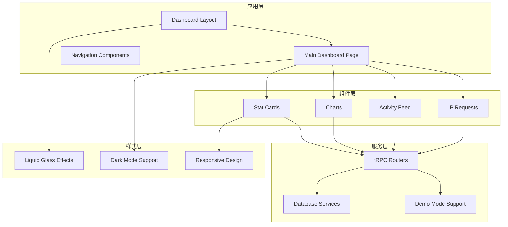
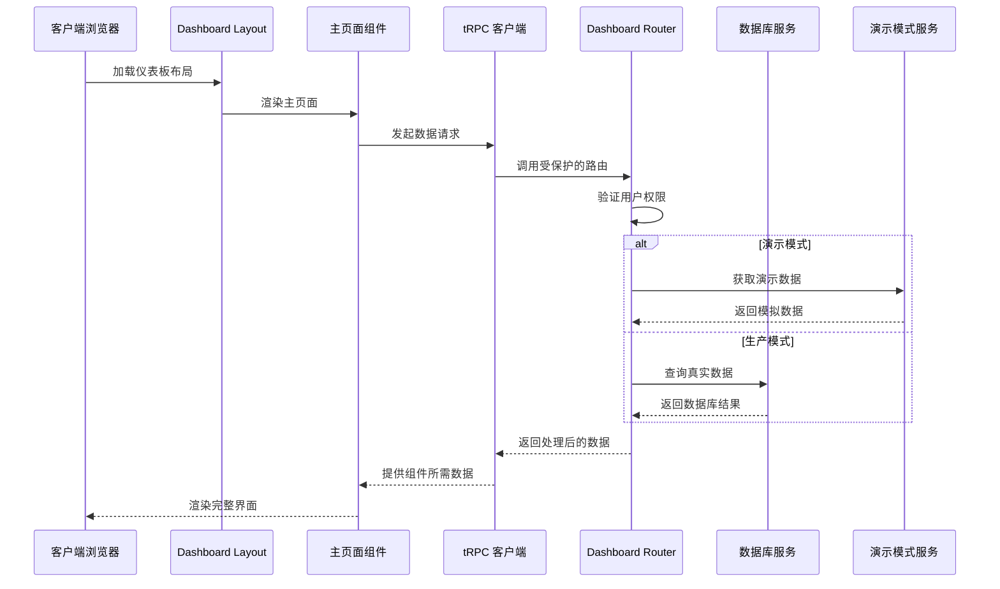
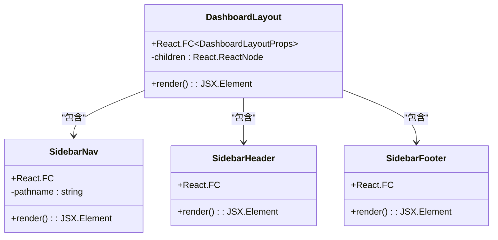
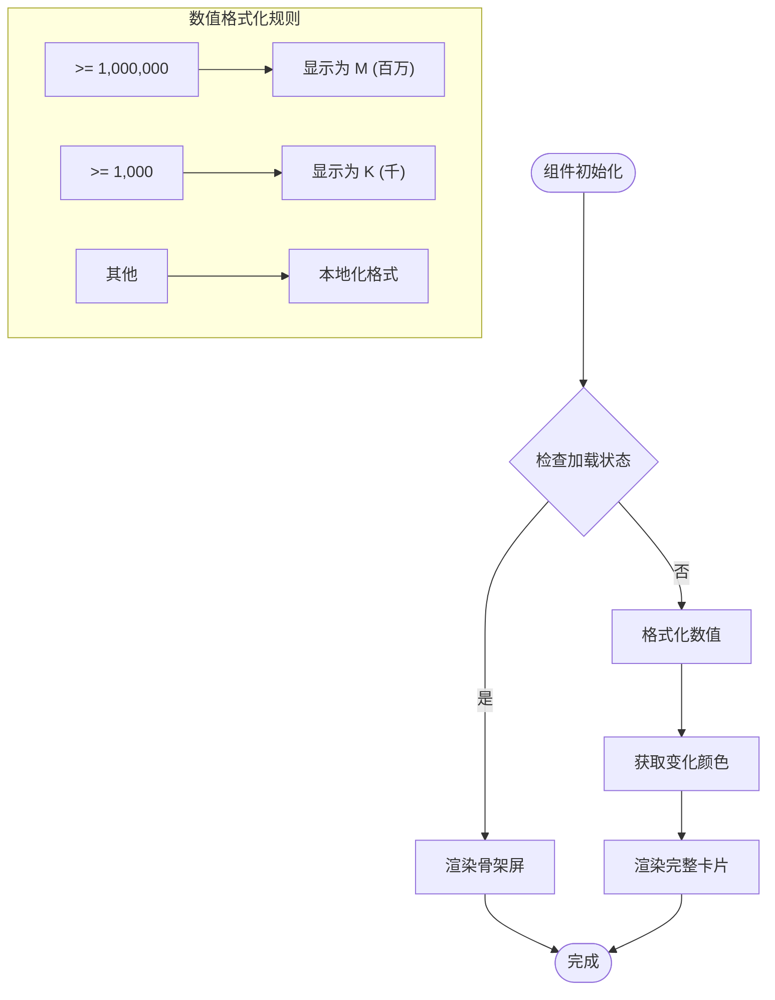
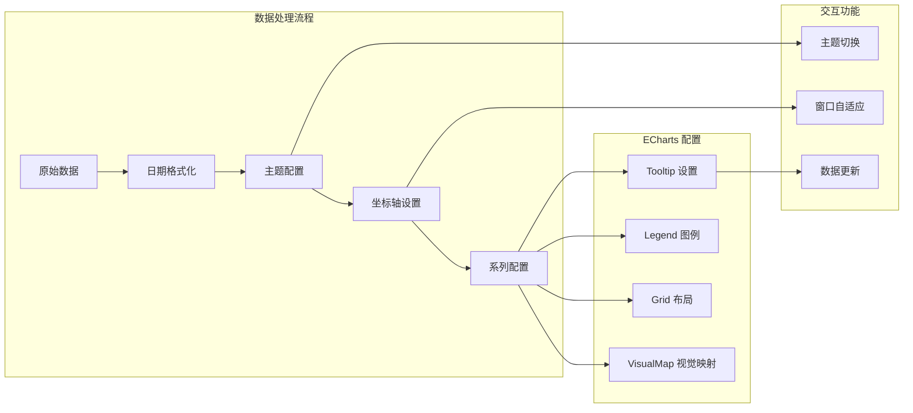
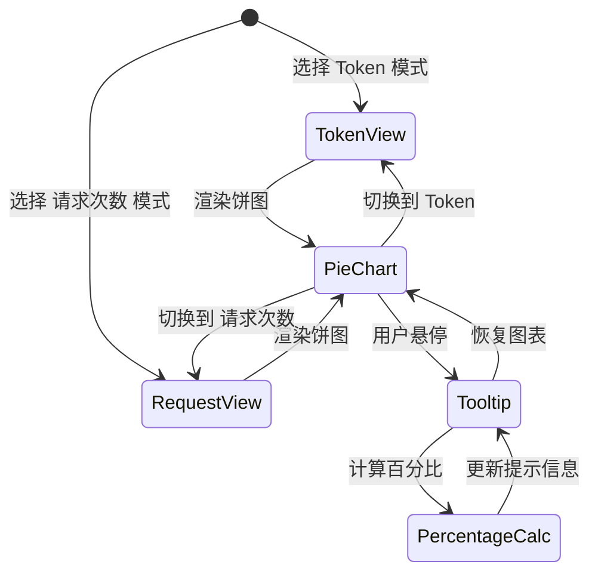
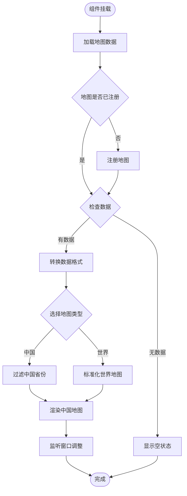
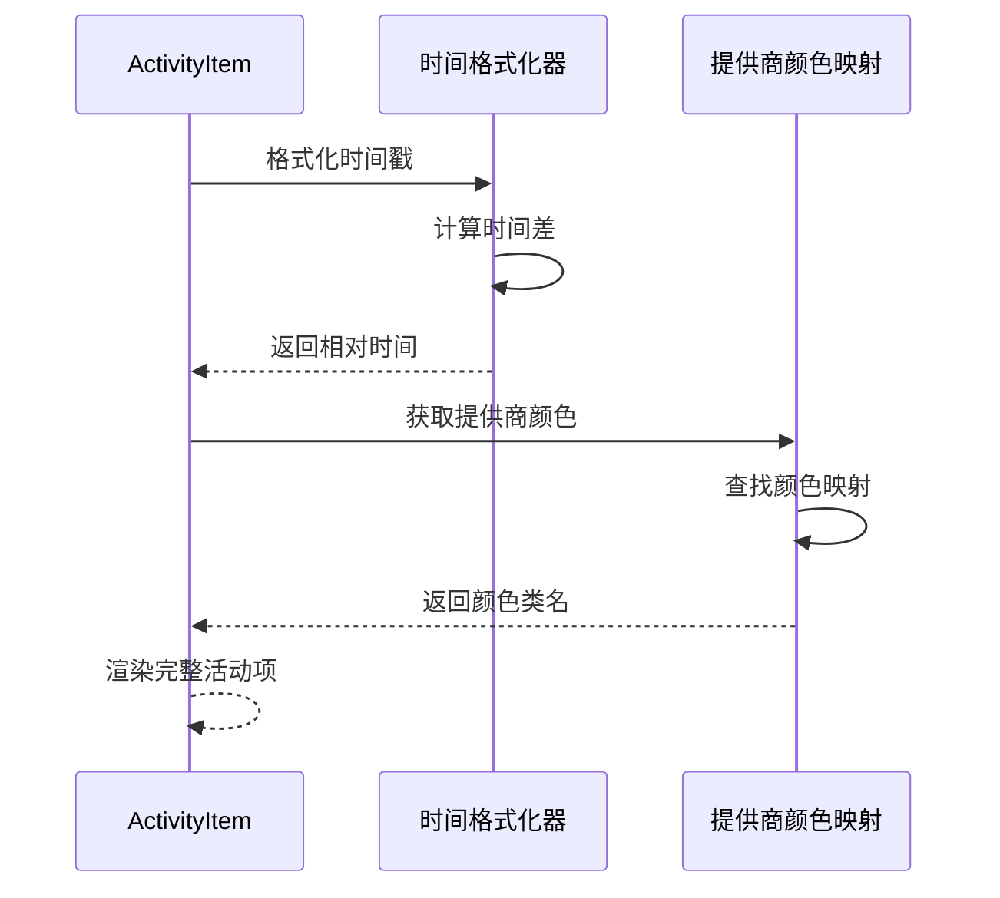
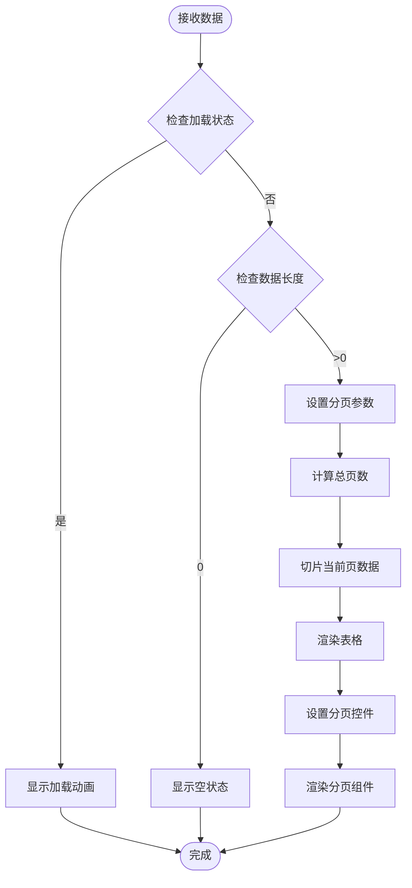
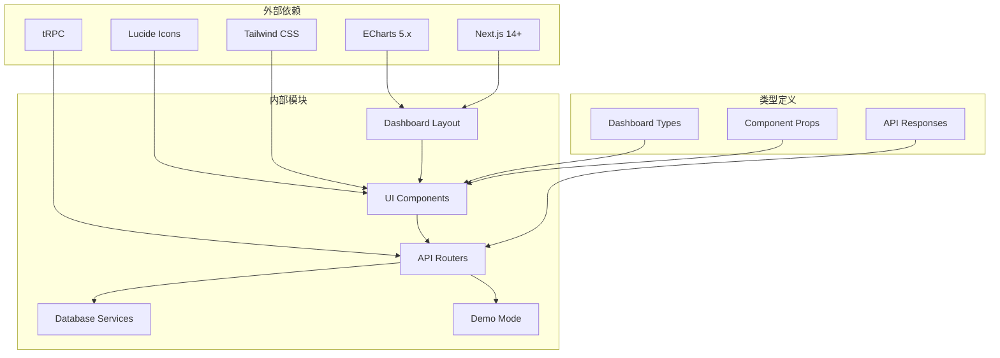

# 仪表板组件

<cite>
**本文档引用的文件**
- [src/app/(dashboard)/layout.tsx](file://src/app/(dashboard)/layout.tsx)
- [src/components/dashboard-layout/index.tsx](file://src/components/dashboard-layout/index.tsx)
- [src/app/(dashboard)/page.tsx](file://src/app/(dashboard)/page.tsx)
- [src/types/dashboard.ts](file://src/types/dashboard.ts)
- [src/lib/demo-stats.ts](file://src/lib/demo-stats.ts)
- [src/app/(dashboard)/components/stat-card.tsx](file://src/app/(dashboard)/components/stat-card.tsx)
- [src/app/(dashboard)/components/combined-trend-chart.tsx](file://src/app/(dashboard)/components/combined-trend-chart.tsx)
- [src/app/(dashboard)/components/model-distribution-chart.tsx](file://src/app/(dashboard)/components/model-distribution-chart.tsx)
- [src/app/(dashboard)/components/region-headmap-chart/index.tsx](file://src/app/(dashboard)/components/region-headmap-chart/index.tsx)
- [src/app/(dashboard)/components/recent-activity.tsx](file://src/app/(dashboard)/components/recent-activity.tsx)
- [src/app/(dashboard)/components/activity-item.tsx](file://src/app/(dashboard)/components/activity-item.tsx)
- [src/app/(dashboard)/components/recent-ip-requests.tsx](file://src/app/(dashboard)/components/recent-ip-requests.tsx)
- [src/app/(dashboard)/components/region-headmap-chart/utils.ts](file://src/app/(dashboard)/components/region-headmap-chart/utils.ts)
- [src/server/api/routers/dashboard.ts](file://src/server/api/routers/dashboard.ts)
- [src/components/dashboard-layout/sidebar-nav.tsx](file://src/components/dashboard-layout/sidebar-nav.tsx)
</cite>

## 目录
1. [简介](#简介)
2. [项目结构](#项目结构)
3. [核心组件](#核心组件)
4. [架构概览](#架构概览)
5. [详细组件分析](#详细组件分析)
6. [依赖关系分析](#依赖关系分析)
7. [性能考虑](#性能考虑)
8. [故障排除指南](#故障排除指南)
9. [结论](#结论)

## 简介

这是一个基于 Next.js 和 TypeScript 构建的企业级 AI 服务仪表板系统。该仪表板提供了实时的使用统计、趋势分析、区域分布和用户活动监控功能。系统采用现代化的设计理念，结合了液态玻璃效果、深色模式支持和响应式布局，为用户提供直观的数据可视化体验。

## 项目结构

仪表板系统采用模块化的文件组织方式，主要分为以下几个层次：

**图表来源**
- [src/app/(dashboard)/layout.tsx](file://src/app/(dashboard)/layout.tsx#L1-L19)
- [src/components/dashboard-layout/index.tsx:1-29](file://src/components/dashboard-layout/index.tsx#L1-L29)

**章节来源**
- [src/app/(dashboard)/layout.tsx](file://src/app/(dashboard)/layout.tsx#L1-L19)
- [src/components/dashboard-layout/index.tsx:1-29](file://src/components/dashboard-layout/index.tsx#L1-L29)

## 核心组件

### 仪表板布局系统

仪表板采用双栏布局设计，左侧为导航侧边栏，右侧为主内容区域。整体设计采用了先进的液态玻璃效果技术，通过 backdrop-blur 和半透明背景实现现代感十足的视觉效果。

### 数据可视化组件

系统集成了多种数据可视化组件，包括：
- **统计卡片**：展示关键指标的数值和变化趋势
- **组合趋势图**：同时显示请求数量、Token 消耗和费用趋势
- **模型分布饼图**：展示不同模型的使用占比
- **区域热力图**：显示全球或中国地区的使用分布
- **活动列表**：展示最近的系统活动
- **IP 请求表格**：展示最近的 IP 访问记录

**章节来源**
- [src/app/(dashboard)/page.tsx](file://src/app/(dashboard)/page.tsx#L1-L243)
- [src/types/dashboard.ts:1-48](file://src/types/dashboard.ts#L1-L48)

## 架构概览

系统采用客户端-服务器分离的架构模式，结合了 tRPC 进行类型安全的 API 调用：

**图表来源**
- [src/app/(dashboard)/layout.tsx](file://src/app/(dashboard)/layout.tsx#L10-L18)
- [src/app/(dashboard)/page.tsx](file://src/app/(dashboard)/page.tsx#L73-L107)
- [src/server/api/routers/dashboard.ts:13-220](file://src/server/api/routers/dashboard.ts#L13-L220)

## 详细组件分析

### 仪表板布局组件

仪表板布局组件实现了完整的页面框架结构，包括侧边栏导航、主内容区域和响应式设计：

**图表来源**
- [src/components/dashboard-layout/index.tsx:12-28](file://src/components/dashboard-layout/index.tsx#L12-L28)
- [src/components/dashboard-layout/sidebar-nav.tsx:42-68](file://src/components/dashboard-layout/sidebar-nav.tsx#L42-L68)

### 统计卡片组件

统计卡片组件提供了统一的数据展示格式，支持加载状态、数值格式化和趋势指示：

**图表来源**
- [src/app/(dashboard)/components/stat-card.tsx](file://src/app/(dashboard)/components/stat-card.tsx#L14-L76)

**章节来源**
- [src/app/(dashboard)/components/stat-card.tsx](file://src/app/(dashboard)/components/stat-card.tsx#L1-L76)

### 组合趋势图表组件

组合趋势图表组件使用 ECharts 实现了复杂的数据可视化需求：

**图表来源**
- [src/app/(dashboard)/components/combined-trend-chart.tsx](file://src/app/(dashboard)/components/combined-trend-chart.tsx#L18-L394)

**章节来源**
- [src/app/(dashboard)/components/combined-trend-chart.tsx](file://src/app/(dashboard)/components/combined-trend-chart.tsx#L1-L394)

### 模型分布图表组件

模型分布图表组件提供了两种视图模式的饼图展示：

**图表来源**
- [src/app/(dashboard)/components/model-distribution-chart.tsx](file://src/app/(dashboard)/components/model-distribution-chart.tsx#L28-L147)

**章节来源**
- [src/app/(dashboard)/components/model-distribution-chart.tsx](file://src/app/(dashboard)/components/model-distribution-chart.tsx#L1-L147)

### 区域热力地图组件

区域热力地图组件支持中国地图和世界地图两种视图模式：

**图表来源**
- [src/app/(dashboard)/components/region-headmap-chart/index.tsx](file://src/app/(dashboard)/components/region-headmap-chart/index.tsx#L27-L255)

**章节来源**
- [src/app/(dashboard)/components/region-headmap-chart/index.tsx](file://src/app/(dashboard)/components/region-headmap-chart/index.tsx#L1-L255)

### 最近活动组件

最近活动组件提供了动态的时间格式化和详细的活动信息展示：

**图表来源**
- [src/app/(dashboard)/components/activity-item.tsx](file://src/app/(dashboard)/components/activity-item.tsx#L17-L87)

**章节来源**
- [src/app/(dashboard)/components/recent-activity.tsx](file://src/app/(dashboard)/components/recent-activity.tsx#L1-L53)
- [src/app/(dashboard)/components/activity-item.tsx](file://src/app/(dashboard)/components/activity-item.tsx#L1-L87)

### 最近 IP 请求组件

最近 IP 请求组件实现了完整的表格展示和分页功能：

**图表来源**
- [src/app/(dashboard)/components/recent-ip-requests.tsx](file://src/app/(dashboard)/components/recent-ip-requests.tsx#L40-L216)

**章节来源**
- [src/app/(dashboard)/components/recent-ip-requests.tsx](file://src/app/(dashboard)/components/recent-ip-requests.tsx#L1-L216)

## 依赖关系分析

系统的核心依赖关系如下：

**图表来源**
- [src/app/(dashboard)/components/combined-trend-chart.tsx](file://src/app/(dashboard)/components/combined-trend-chart.tsx#L4)
- [src/server/api/routers/dashboard.ts:1-10](file://src/server/api/routers/dashboard.ts#L1-L10)

**章节来源**
- [src/types/dashboard.ts:1-48](file://src/types/dashboard.ts#L1-L48)
- [src/lib/demo-stats.ts:1-117](file://src/lib/demo-stats.ts#L1-L117)

## 性能考虑

### 数据加载优化

系统采用了多种性能优化策略：

1. **并发数据请求**：使用 `Promise.all` 并行获取多个数据源
2. **缓存机制**：ECharts 实例的复用避免重复创建
3. **虚拟滚动**：长列表组件的懒加载实现
4. **防抖处理**：窗口大小调整的事件处理优化

### 渲染性能

- **组件拆分**：每个图表组件独立渲染，避免全局重绘
- **条件渲染**：根据数据状态选择性渲染组件
- **CSS 动画**：使用硬件加速的 CSS 过渡效果

### 内存管理

- **事件清理**：自动清理 ECharts 实例和事件监听器
- **数据清理**：组件卸载时释放内存资源

## 故障排除指南

### 常见问题及解决方案

#### 地图数据加载失败

**问题描述**：区域热力图无法显示地图数据

**解决步骤**：
1. 检查网络连接是否正常
2. 验证地图数据文件路径是否正确
3. 确认 CORS 配置允许访问地图数据
4. 检查浏览器控制台是否有跨域错误

#### 图表渲染异常

**问题描述**：ECharts 图表无法正常显示

**解决步骤**：
1. 确认 ECharts 库版本兼容性
2. 检查容器元素的尺寸设置
3. 验证数据格式是否符合要求
4. 查看浏览器控制台的 JavaScript 错误

#### 数据获取超时

**问题描述**：仪表板数据长时间加载

**解决步骤**：
1. 检查数据库连接状态
2. 优化查询语句和索引
3. 实现合理的超时处理机制
4. 添加数据缓存策略

**章节来源**
- [src/app/(dashboard)/components/region-headmap-chart/index.tsx](file://src/app/(dashboard)/components/region-headmap-chart/index.tsx#L178-L216)
- [src/app/(dashboard)/components/combined-trend-chart.tsx](file://src/app/(dashboard)/components/combined-trend-chart.tsx#L36-L44)

## 结论

这个仪表板系统展现了现代前端开发的最佳实践，通过精心设计的组件架构、丰富的数据可视化能力和完善的性能优化策略，为用户提供了优秀的数据分析体验。系统的模块化设计使得各个组件可以独立开发和测试，而强大的 tRPC 集成确保了类型安全和开发效率。

未来可以考虑的功能扩展包括：
- 更高级的图表交互功能
- 自定义报表生成功能
- 实时数据推送支持
- 多租户数据隔离
- 更丰富的主题定制选项