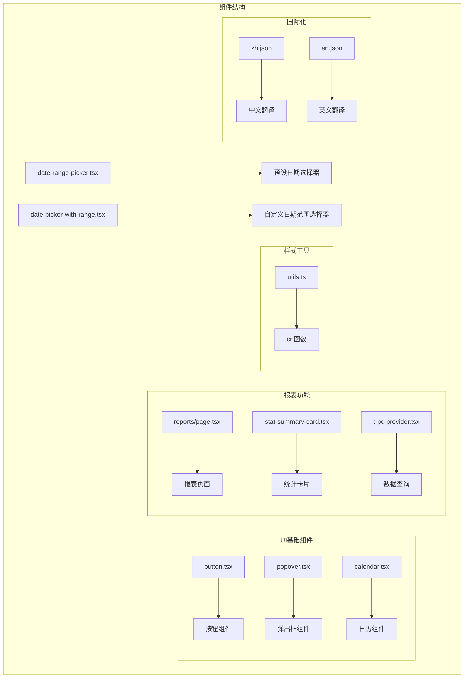
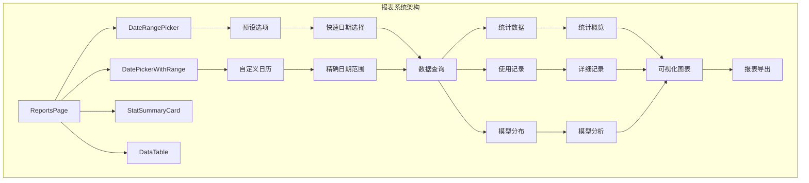
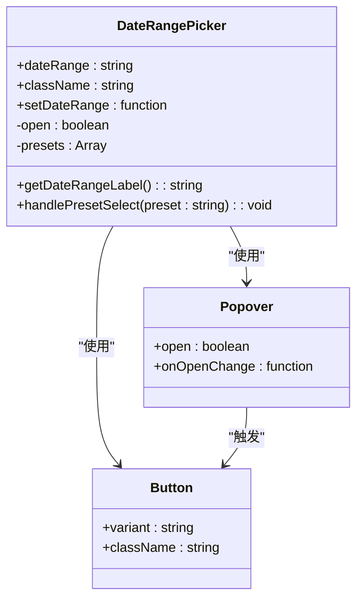
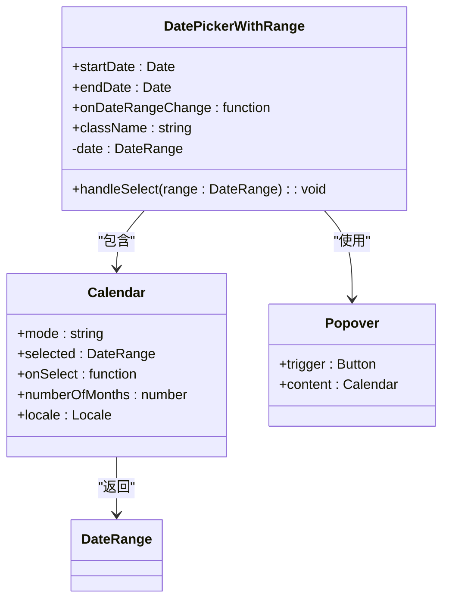
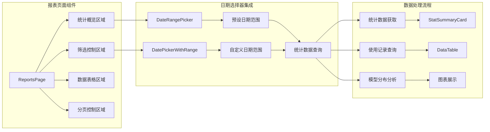
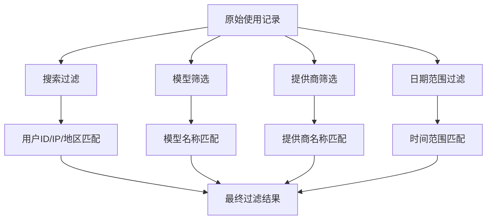
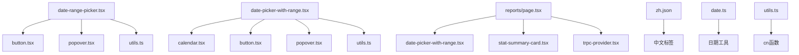

# 日期范围选择器组件

<cite>
**本文档引用的文件**
- [date-range-picker.tsx](file://src/components/date-range-picker.tsx)
- [date-picker-with-range.tsx](file://src/components/date-picker-with-range.tsx)
- [button.tsx](file://src/components/ui/button.tsx)
- [popover.tsx](file://src/components/ui/popover.tsx)
- [calendar.tsx](file://src/components/ui/calendar.tsx)
- [page.tsx](file://src/app/(dashboard)/reports/page.tsx)
- [date.ts](file://src/lib/date.ts)
- [utils.ts](file://src/lib/utils.ts)
- [zh.json](file://src/messages/zh.json)
- [package.json](file://package.json)
</cite>

## 更新摘要
**所做更改**
- 新增报表功能集成章节，展示日期范围选择器在实际业务场景中的应用
- 更新组件架构图，反映与报表页面的数据流关系
- 增强数据过滤功能说明，包括搜索、筛选和分页机制
- 补充国际化支持和本地化配置细节
- 更新依赖关系分析，包含新增的报表相关依赖

## 目录
1. [简介](#简介)
2. [项目结构](#项目结构)
3. [核心组件](#核心组件)
4. [架构概览](#架构概览)
5. [详细组件分析](#详细组件分析)
6. [报表功能集成](#报表功能集成)
7. [数据过滤与处理](#数据过滤与处理)
8. [依赖关系分析](#依赖关系分析)
9. [性能考虑](#性能考虑)
10. [故障排除指南](#故障排除指南)
11. [结论](#结论)

## 简介

本文档详细介绍 AIGate 项目中的日期范围选择器组件，这是一个基于 React 和 Next.js 构建的现代化日期选择器，采用 Liquid Glass 设计风格。该组件提供了两种日期选择模式：预设日期范围选择和自定义日期范围选择，支持中英文国际化，并集成了丰富的视觉效果和用户体验优化。

**更新** 组件现已深度集成到报表功能中，为用户提供完整的数据分析和报告生成功能，包括数据筛选、导出和可视化展示。

## 项目结构

日期范围选择器组件位于项目的组件目录中，与 UI 基础组件紧密集成，并深度服务于报表功能：



**图表来源**
- [date-range-picker.tsx:1-100](file://src/components/date-range-picker.tsx#L1-L100)
- [date-picker-with-range.tsx:1-92](file://src/components/date-picker-with-range.tsx#L1-L92)
- [page.tsx:1-478](file://src/app/(dashboard)/reports/page.tsx#L1-L478)

**章节来源**
- [date-range-picker.tsx:1-100](file://src/components/date-range-picker.tsx#L1-L100)
- [date-picker-with-range.tsx:1-92](file://src/components/date-picker-with-range.tsx#L1-L92)
- [page.tsx:1-478](file://src/app/(dashboard)/reports/page.tsx#L1-L478)

## 核心组件

### 预设日期范围选择器

预设日期范围选择器提供了快速选择常用日期范围的功能，包括今日、昨日、近7天、近30天和自定义日期范围。该组件采用毛玻璃效果设计，提供流畅的用户体验。

### 自定义日期范围选择器

自定义日期范围选择器基于 react-day-picker 库，提供了直观的日历界面供用户选择具体的日期范围。组件支持双月显示、范围选择和本地化配置。

### UI基础组件

组件依赖于一系列精心设计的 UI 基础组件，包括按钮、弹出框和日历组件，这些组件都采用了 Liquid Glass 设计风格，确保视觉一致性和用户体验的统一性。

**章节来源**
- [date-range-picker.tsx:9-13](file://src/components/date-range-picker.tsx#L9-L13)
- [date-picker-with-range.tsx:13-18](file://src/components/date-picker-with-range.tsx#L13-L18)

## 架构概览

日期范围选择器组件采用模块化设计，通过清晰的组件边界和依赖关系实现了高度的可维护性和可扩展性。组件现已深度集成到报表系统中，形成完整的数据查询和展示架构：



**图表来源**
- [page.tsx:41-478](file://src/app/(dashboard)/reports/page.tsx#L41-L478)
- [date-range-picker.tsx:15-99](file://src/components/date-range-picker.tsx#L15-L99)
- [date-picker-with-range.tsx:20-89](file://src/components/date-picker-with-range.tsx#L20-L89)

## 详细组件分析

### DateRangePicker 组件

#### 组件结构



**图表来源**
- [date-range-picker.tsx:15-99](file://src/components/date-range-picker.tsx#L15-L99)

#### 预设选项配置

组件支持五种预设日期范围，每种预设都有对应的中文标签和功能描述：

| 预设值 | 中文标签 | 英文标签 | 功能描述 |
|--------|----------|----------|----------|
| today | 今日 | Today | 当前日期 |
| yesterday | 昨日 | Yesterday | 昨天日期 |
| 7days | 近7天 | Last 7 Days | 当前日期前7天 |
| 30days | 近30天 | Last 30 Days | 当前日期前30天 |
| custom | 自定义 | Custom | 用户自定义日期范围 |

#### 视觉设计特点

组件采用了独特的 Liquid Glass 设计风格，具有以下特征：

- 半透明背景 (`bg-white/40` 到 `bg-white/5`)
- 毛玻璃效果 (`backdrop-blur-lg`)
- 多层阴影效果 (`shadow-[0_2px_8px_rgba(0,0,0,0.06)]`)
- 边框渐变 (`border border-white/25`)
- 悬停动画效果 (`hover:bg-white/50`)

**章节来源**
- [date-range-picker.tsx:22-28](file://src/components/date-range-picker.tsx#L22-L28)
- [date-range-picker.tsx:56-71](file://src/components/date-range-picker.tsx#L56-L71)

### DatePickerWithRange 组件

#### 组件结构



**图表来源**
- [date-picker-with-range.tsx:20-89](file://src/components/date-picker-with-range.tsx#L20-L89)

#### 日历配置

组件使用 react-day-picker 库，配置了以下特性：

- **显示模式**: `range` - 支持日期范围选择
- **月份数量**: 2 - 同时显示两个相邻月份
- **语言环境**: zhCN - 中文本地化
- **外部日期**: `showOutsideDays=false` - 不显示非当月日期
- **初始焦点**: `initialFocus=true` - 打开时自动聚焦

#### 日期格式化

使用 date-fns 库进行日期格式化，支持：

- 中文日期格式 (`yyyy-MM-dd`)
- 本地化支持 (`zhCN` locale)
- 动态格式化 (`format(date, 'yyyy-MM-dd', { locale: zhCN })`)

**章节来源**
- [date-picker-with-range.tsx:74-84](file://src/components/date-picker-with-range.tsx#L74-L84)
- [date-picker-with-range.tsx:56-67](file://src/components/date-picker-with-range.tsx#L56-L67)

### UI 组件集成

#### Button 组件变体

组件使用了多种按钮变体来实现不同的视觉效果：

| 变体名称 | 特征 | 用途 |
|----------|------|------|
| outline | 边框样式 | 主要按钮，支持半透明背景 |
| glass | 毛玻璃效果 | 弹出框中的选中项 |
| ghost | 透明样式 | 弹出框中的普通选项 |

#### Popover 组件

弹出框组件提供了以下特性：

- **动画效果**: `data-[state=open]:animate-in` - 打开时的淡入动画
- **毛玻璃背景**: `backdrop-blur-2xl` - 半透明模糊效果
- **阴影效果**: `shadow-[0_16px_48px_rgba(0,0,0,0.15)]` - 深层阴影
- **定位**: `align="start"` - 左对齐显示

#### Calendar 组件

日历组件具有丰富的视觉层次：

- **边框**: `border border-white/25` - 浅色边框
- **背景**: `bg-white/15` - 半透明背景
- **阴影**: `shadow-[0_12px_40px_rgba(0,0,0,0.12)]` - 柔和阴影
- **圆角**: `rounded-2xl` - 大圆角设计

**章节来源**
- [button.tsx:7-54](file://src/components/ui/button.tsx#L7-L54)
- [popover.tsx:12-28](file://src/components/ui/popover.tsx#L12-L28)
- [calendar.tsx:15-184](file://src/components/ui/calendar.tsx#L15-L184)

## 报表功能集成

### 报表页面架构

日期范围选择器已深度集成到报表页面中，为用户提供完整的数据分析功能：



**图表来源**
- [page.tsx:221-292](file://src/app/(dashboard)/reports/page.tsx#L221-L292)
- [page.tsx:41-86](file://src/app/(dashboard)/reports/page.tsx#L41-L86)

### 数据查询集成

组件与报表系统的数据查询机制紧密集成：

- **实时查询**: 日期范围变化时自动触发数据查询
- **条件查询**: 结合搜索、模型筛选和提供商筛选条件
- **分页支持**: 支持大数据量的分页显示
- **导出功能**: 支持CSV格式数据导出

**章节来源**
- [page.tsx:54-86](file://src/app/(dashboard)/reports/page.tsx#L54-L86)
- [page.tsx:122-143](file://src/app/(dashboard)/reports/page.tsx#L122-L143)

## 数据过滤与处理

### 多维度数据过滤

报表系统实现了多层次的数据过滤机制：



**图表来源**
- [page.tsx:122-137](file://src/app/(dashboard)/reports/page.tsx#L122-L137)

### 过滤算法实现

组件使用 React.memo 和 useMemo 优化过滤性能：

- **搜索过滤**: 支持用户ID、IP地址、地区关键词搜索
- **模型筛选**: 基于模型分布数据动态生成筛选选项
- **提供商筛选**: 基于使用记录动态生成筛选选项
- **日期范围**: 精确的时间范围匹配

### 分页处理机制

系统实现了智能分页处理：

- **自动重置**: 筛选条件变化时自动重置到第一页
- **性能优化**: 使用 useMemo 缓存过滤结果
- **用户体验**: 提供详细的分页信息显示

**章节来源**
- [page.tsx:139-161](file://src/app/(dashboard)/reports/page.tsx#L139-L161)
- [page.tsx:409-453](file://src/app/(dashboard)/reports/page.tsx#L409-L453)

## 依赖关系分析

### 外部依赖

组件依赖于以下关键外部库：

```mermaid
graph LR
subgraph "核心依赖"
A[react] --> B[React 19.2.3]
C[date-fns] --> D[日期格式化]
E[react-day-picker] --> F[日历组件]
G[lucide-react] --> H[图标库]
I[@tanstack/react-query] --> J[数据查询]
K[@trpc/react-query] --> L[远程过程调用]
end
subgraph "UI框架"
M[@radix-ui/react-popover] --> N[弹出框]
O[tailwind-merge] --> P[样式合并]
Q[clsx] --> R[条件样式]
end
subgraph "报表功能"
S[echarts] --> T[图表可视化]
U[react-table] --> V[表格组件]
W[next-intl] --> X[国际化]
end
```

**图表来源**
- [package.json:20-72](file://package.json#L20-L72)
- [date-range-picker.tsx:3-7](file://src/components/date-range-picker.tsx#L3-L7)

### 内部依赖关系



**图表来源**
- [date-range-picker.tsx:4-7](file://src/components/date-range-picker.tsx#L4-L7)
- [date-picker-with-range.tsx:9-11](file://src/components/date-picker-with-range.tsx#L9-L11)

**章节来源**
- [package.json:20-72](file://package.json#L20-L72)

## 性能考虑

### 渲染优化

组件采用了多项性能优化策略：

1. **条件渲染**: 自定义日期选择器仅在需要时渲染
2. **状态管理**: 使用 React hooks 进行高效的状态管理
3. **样式合并**: 通过 `cn` 函数合并多个样式类，减少 DOM 属性数量
4. **记忆化**: 使用 useMemo 和 useCallback 优化渲染性能
5. **懒加载**: 日期选择器按需加载，不影响初始页面性能

### 内存管理

- **事件处理**: 使用箭头函数避免不必要的绑定
- **组件卸载**: 正确清理 popper 实例和事件监听器
- **状态更新**: 避免不必要的状态更新和重渲染
- **数据缓存**: 使用 React Query 缓存查询结果

### 加载性能

- **CSS 优化**: 使用 Tailwind CSS 的原子化样式，减少 CSS 文件大小
- **图标优化**: lucide-react 提供轻量级 SVG 图标
- **图片优化**: 使用现代图片格式和懒加载
- **代码分割**: 按需加载报表相关组件

## 故障排除指南

### 常见问题及解决方案

#### 日期格式问题

**问题**: 日期格式显示异常
**解决方案**: 
- 确保使用正确的本地化配置 (`zhCN`)
- 检查 date-fns 版本兼容性
- 验证日期对象的有效性

#### 样式冲突

**问题**: 组件样式与其他样式冲突
**解决方案**:
- 检查 `cn` 函数的样式合并逻辑
- 确认 Tailwind CSS 配置正确
- 验证组件的样式优先级

#### 交互问题

**问题**: 弹出框无法正常显示
**解决方案**:
- 检查 Radix UI 的 Popover 组件配置
- 验证 Portal 渲染是否正确
- 确认 z-index 层级设置

#### 报表数据问题

**问题**: 报表数据查询失败
**解决方案**:
- 检查 tRPC 服务器连接
- 验证日期范围参数有效性
- 确认用户权限和认证状态

### 调试技巧

1. **开发者工具**: 使用浏览器开发者工具检查元素样式
2. **控制台日志**: 添加必要的日志输出进行调试
3. **组件检查**: 验证 props 传递和状态更新
4. **网络检查**: 确认国际化资源加载正常
5. **性能监控**: 使用 React DevTools 分析渲染性能

**章节来源**
- [date.ts:1-17](file://src/lib/date.ts#L1-L17)

## 结论

日期范围选择器组件是 AIGate 项目中一个精心设计的 UI 组件，它成功地结合了功能性、美观性和易用性。通过采用 Liquid Glass 设计风格和现代 React 开发实践，该组件为用户提供了优秀的日期选择体验。

**更新** 组件现已深度集成到报表功能中，成为整个数据分析系统的核心组件之一。通过与 tRPC 数据查询、React Query 缓存机制和国际化系统的无缝集成，组件为用户提供了完整的数据筛选、分析和导出功能。

组件的主要优势包括：

- **模块化设计**: 清晰的组件边界和职责分离
- **国际化支持**: 完整的中英文支持
- **报表集成**: 深度集成到数据分析系统
- **性能优化**: 高效的渲染和内存管理
- **可扩展性**: 良好的架构便于功能扩展
- **用户体验**: 流畅的交互和视觉反馈

该组件不仅满足了当前的功能需求，还为未来的功能增强奠定了坚实的基础。通过持续的优化和改进，它将继续为用户提供优质的日期选择和数据分析体验。