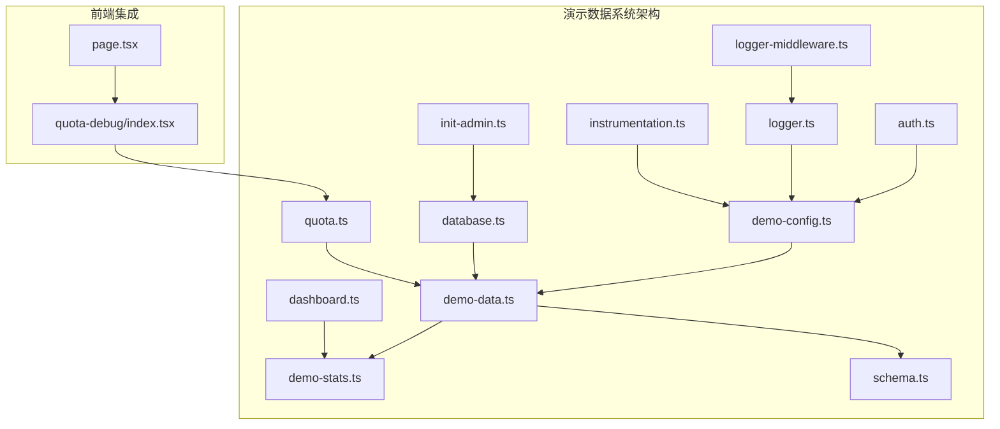
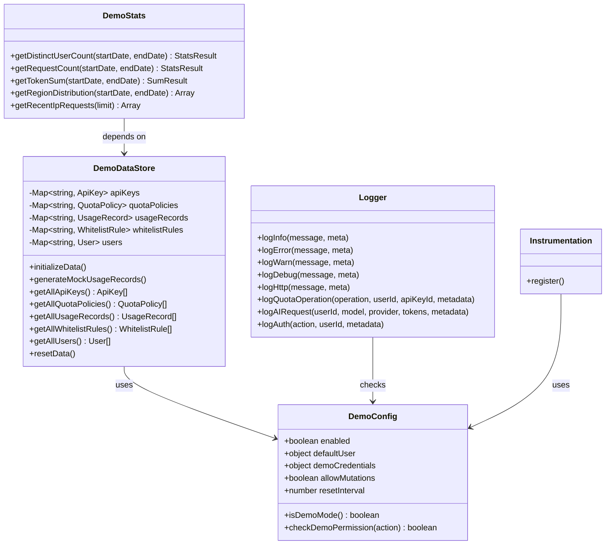
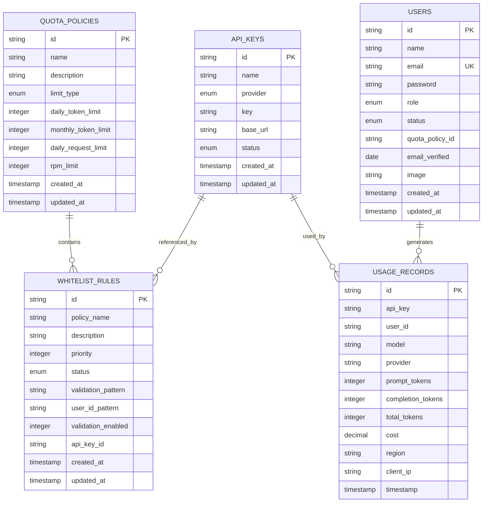
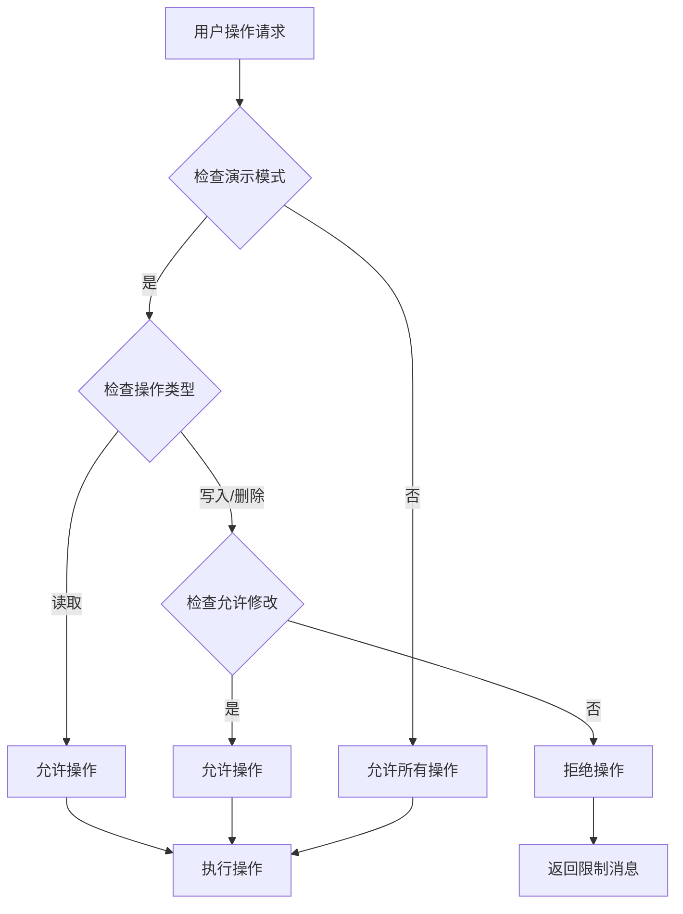
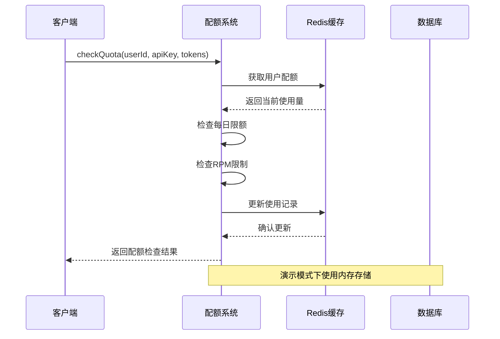
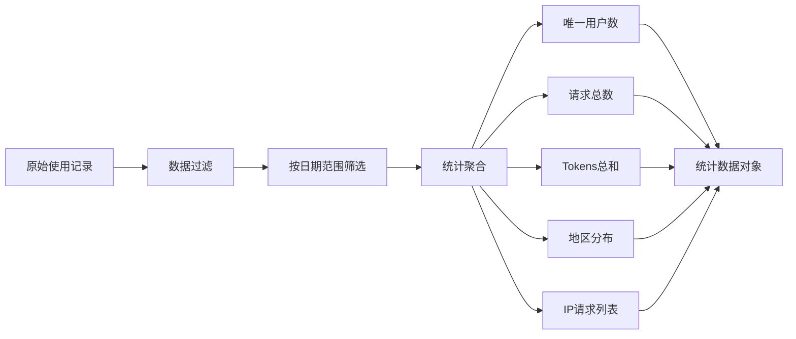
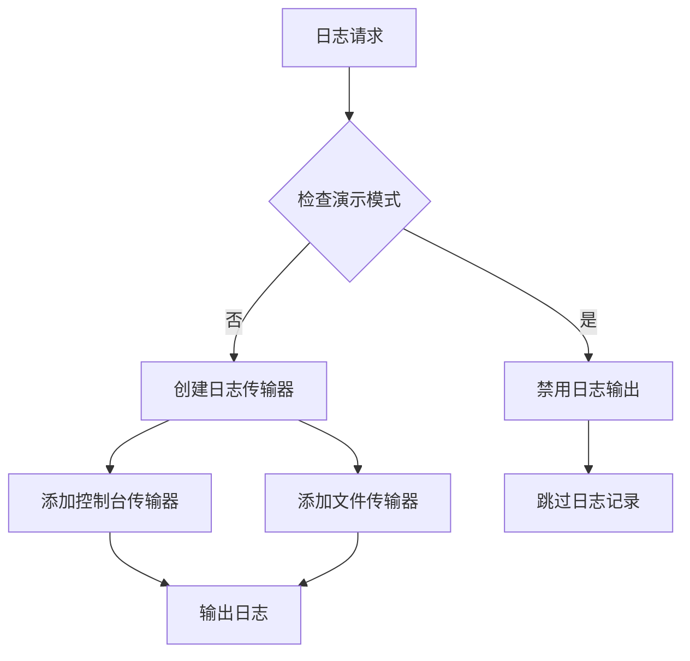
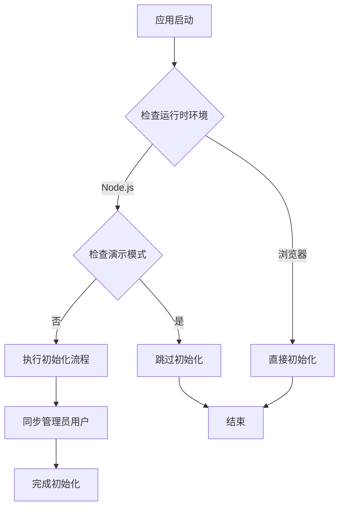
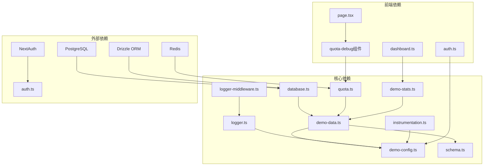

# 演示数据系统

<cite>
**本文档引用的文件**
- [demo-data.ts](file://src/lib/demo-data.ts)
- [demo-config.ts](file://src/lib/demo-config.ts)
- [demo-stats.ts](file://src/lib/demo-stats.ts)
- [schema.ts](file://src/lib/schema.ts)
- [database.ts](file://src/lib/database.ts)
- [quota.ts](file://src/lib/quota.ts)
- [dashboard.ts](file://src/server/api/routers/dashboard.ts)
- [init-admin.ts](file://src/lib/init-admin.ts)
- [package.json](file://package.json)
- [auth.ts](file://src/auth.ts)
- [page.tsx](file://src/app/(dashboard)/debug/page.tsx)
- [index.tsx](file://src/app/(dashboard)/debug/components/quota-debug/index.tsx)
- [logger.ts](file://src/lib/logger.ts)
- [instrumentation.ts](file://src/instrumentation.ts)
- [logger-middleware.ts](file://src/lib/logger-middleware.ts)
</cite>

## 更新摘要
**变更内容**
- 增强了演示模式配置功能，包括更灵活的 `isDemoMode` 函数
- 实现了演示模式下的日志禁用机制
- 添加了演示环境的条件初始化流程
- 更新了权限控制系统和统计系统的演示模式支持

## 目录
1. [简介](#简介)
2. [项目结构](#项目结构)
3. [核心组件](#核心组件)
4. [架构概览](#架构概览)
5. [详细组件分析](#详细组件分析)
6. [依赖关系分析](#依赖关系分析)
7. [性能考虑](#性能考虑)
8. [故障排除指南](#故障排除指南)
9. [结论](#结论)

## 简介

演示数据系统是 AIGate 项目中的一个关键组件，专门设计用于在演示模式下提供完整的数据管理功能。该系统通过内存存储机制模拟真实的数据库操作，为开发者和用户提供了一个无需真实数据库即可体验完整功能的环境。

系统的核心目标包括：
- 提供演示模式下的数据持久化能力
- 支持完整的 CRUD 操作
- 实现配额管理和白名单验证
- 提供统计数据计算和可视化支持
- 确保与真实数据库操作的兼容性
- 实现演示模式下的日志禁用机制
- 支持条件化的环境初始化流程

## 项目结构

演示数据系统主要分布在以下目录和文件中：

**图表来源**
- [demo-config.ts:1-57](file://src/lib/demo-config.ts#L1-L57)
- [demo-data.ts:1-435](file://src/lib/demo-data.ts#L1-L435)
- [database.ts:1-850](file://src/lib/database.ts#L1-L850)

**章节来源**
- [demo-config.ts:1-57](file://src/lib/demo-config.ts#L1-L57)
- [demo-data.ts:1-435](file://src/lib/demo-data.ts#L1-L435)
- [schema.ts:1-162](file://src/lib/schema.ts#L1-L162)

## 核心组件

### 演示模式配置系统

演示模式配置系统通过增强的 `isDemoMode` 函数控制整个系统的运行模式，提供了灵活的配置选项：

- **双重环境变量支持**：通过 `DEMO_MODE` 和 `NEXT_PUBLIC_DEMO_MODE` 环境变量控制，确保前后端都能正确识别演示模式
- **权限管理**：支持只读模式和读写模式的切换
- **数据重置**：可配置自动重置间隔时间
- **默认凭据**：提供演示用的默认管理员账户

**更新** 新增了更灵活的 `isDemoMode` 函数，同时检查客户端和服务器端的演示模式标志。

### 内存数据存储层

DemoDataStore 类实现了完整的内存数据管理功能：

- **多表支持**：支持 API Key、配额策略、使用记录、白名单规则、用户等五种数据表
- **初始化机制**：自动创建演示数据和默认配置
- **CRUD 操作**：提供完整的数据增删改查功能
- **数据验证**：内置数据验证和格式化逻辑

### 统计数据服务

演示统计系统提供了多种数据分析功能：

- **用户统计**：计算唯一用户数量和活跃用户数
- **请求统计**：统计请求次数和 Token 消耗总量
- **区域分析**：按地区统计请求分布
- **IP 追踪**：监控最近的 IP 请求记录

### 日志管理系统

**新增** 演示模式下的日志禁用机制：

- **条件日志输出**：在演示模式下完全禁用日志输出
- **生产环境日志**：仅在非演示模式下启用完整的日志记录
- **性能优化**：避免演示模式下的日志开销

### 条件初始化系统

**新增** 演示环境的条件初始化流程：

- **服务端初始化**：仅在 Node.js 运行时且非演示模式下执行
- **管理员同步**：在应用启动时同步管理员用户
- **资源优化**：避免演示模式下的不必要的初始化操作

**章节来源**
- [demo-config.ts:7-56](file://src/lib/demo-config.ts#L7-L56)
- [demo-data.ts:20-431](file://src/lib/demo-data.ts#L20-L431)
- [demo-stats.ts:19-110](file://src/lib/demo-stats.ts#L19-L110)
- [logger.ts:20-100](file://src/lib/logger.ts#L20-L100)
- [instrumentation.ts:4-10](file://src/instrumentation.ts#L4-L10)

## 架构概览

演示数据系统采用分层架构设计，确保了良好的模块化和可维护性：

**图表来源**
- [demo-data.ts:20-431](file://src/lib/demo-data.ts#L20-L431)
- [demo-config.ts:12-56](file://src/lib/demo-config.ts#L12-L56)
- [demo-stats.ts:19-110](file://src/lib/demo-stats.ts#L19-L110)
- [logger.ts:102-192](file://src/lib/logger.ts#L102-L192)
- [instrumentation.ts:1-11](file://src/instrumentation.ts#L1-L11)

## 详细组件分析

### 数据模型设计

系统基于统一的数据库模式定义，确保演示模式与真实数据库的一致性：

**图表来源**
- [schema.ts:29-98](file://src/lib/schema.ts#L29-L98)

### 权限控制系统

演示模式的权限控制机制确保了系统的安全性和可控性：

**更新** 权限控制系统现在更加严格，演示模式下默认只允许读取操作，除非明确配置允许修改。

**图表来源**
- [demo-config.ts:39-56](file://src/lib/demo-config.ts#L39-L56)

**章节来源**
- [schema.ts:12-162](file://src/lib/schema.ts#L12-L162)
- [demo-config.ts:38-56](file://src/lib/demo-config.ts#L38-L56)

### 配额管理系统

配额管理系统实现了复杂的限额控制逻辑：

**图表来源**
- [quota.ts:79-200](file://src/lib/quota.ts#L79-L200)
- [database.ts:178-374](file://src/lib/database.ts#L178-L374)

**章节来源**
- [quota.ts:17-76](file://src/lib/quota.ts#L17-L76)
- [database.ts:178-374](file://src/lib/database.ts#L178-L374)

### 统计数据计算

演示统计系统提供了多种维度的数据分析能力：

**更新** 统计系统现在支持演示模式和生产模式的双路径处理，演示模式使用内存数据进行统计。

**图表来源**
- [demo-stats.ts:21-110](file://src/lib/demo-stats.ts#L21-L110)

**章节来源**
- [demo-stats.ts:19-110](file://src/lib/demo-stats.ts#L19-L110)

### 日志系统集成

**新增** 演示模式下的日志禁用机制：

**更新** 日志系统现在在演示模式下完全禁用，避免产生不必要的日志输出。

**图表来源**
- [logger.ts:50-100](file://src/lib/logger.ts#L50-L100)

**章节来源**
- [logger.ts:1-192](file://src/lib/logger.ts#L1-L192)

### 条件初始化流程

**新增** 演示环境的条件初始化流程：

**更新** 初始化系统现在支持条件执行，仅在非演示模式下执行必要的初始化操作。

**图表来源**
- [instrumentation.ts:4-10](file://src/instrumentation.ts#L4-L10)

**章节来源**
- [instrumentation.ts:1-11](file://src/instrumentation.ts#L1-L11)
- [init-admin.ts:9-71](file://src/lib/init-admin.ts#L9-L71)

## 依赖关系分析

演示数据系统与其他组件的依赖关系如下：

**更新** 新增了日志系统和初始化系统的依赖关系。

**图表来源**
- [database.ts:1-20](file://src/lib/database.ts#L1-L20)
- [quota.ts:1-6](file://src/lib/quota.ts#L1-L6)

**章节来源**
- [database.ts:1-20](file://src/lib/database.ts#L1-L20)
- [quota.ts:1-6](file://src/lib/quota.ts#L1-L6)

## 性能考虑

演示数据系统在设计时充分考虑了性能优化：

### 内存优化策略
- **Map 数据结构**：使用 Map 替代数组进行 O(1) 时间复杂度的查找
- **懒加载机制**：仅在需要时初始化演示数据
- **数据压缩**：对重复数据进行去重处理

### 缓存策略
- **Redis 集成**：配额信息和策略数据使用 Redis 缓存
- **智能过期**：设置合理的缓存过期时间
- **批量操作**：支持批量数据处理减少内存占用

### 并发处理
- **线程安全**：内存数据结构支持并发访问
- **锁机制**：关键操作使用适当的锁保护
- **异步处理**：长时间操作使用异步执行避免阻塞

### 演示模式优化
**新增** 演示模式下的性能优化：

- **日志禁用**：避免演示模式下的日志开销
- **条件初始化**：仅在必要时执行初始化操作
- **内存优化**：使用内存存储替代数据库操作

## 故障排除指南

### 常见问题及解决方案

**演示模式无法启用**
- 检查环境变量 `DEMO_MODE` 和 `NEXT_PUBLIC_DEMO_MODE` 设置
- 确认 `package.json` 中的脚本配置正确
- 验证 Vercel 部署配置

**数据重置问题**
- 检查 `DEMO_RESET_INTERVAL` 环境变量设置
- 验证定时任务配置
- 确认内存存储状态

**权限控制异常**
- 检查 `DEMO_ALLOW_MUTATIONS` 配置
- 验证用户角色和权限设置
- 确认演示模式下的权限检查逻辑

**统计数据不准确**
- 检查日期范围参数设置
- 验证数据过滤逻辑
- 确认统计计算方法

**日志输出异常**
- 检查演示模式配置
- 验证日志级别设置
- 确认日志传输器配置

**初始化流程问题**
- 检查运行时环境变量
- 验证演示模式检测逻辑
- 确认初始化条件判断

**章节来源**
- [demo-config.ts:7-56](file://src/lib/demo-config.ts#L7-L56)
- [demo-data.ts:213-221](file://src/lib/demo-data.ts#L213-L221)
- [logger.ts:20-100](file://src/lib/logger.ts#L20-L100)
- [instrumentation.ts:4-10](file://src/instrumentation.ts#L4-L10)

## 结论

演示数据系统通过精心设计的架构和实现，成功地为 AIGate 项目提供了一个功能完整、性能优异的演示环境。系统的主要优势包括：

1. **完全兼容性**：与真实数据库操作保持一致的接口和行为
2. **灵活配置**：支持多种运行模式和权限控制
3. **高性能**：基于内存存储和缓存优化确保快速响应
4. **易于维护**：清晰的代码结构和完善的错误处理机制
5. **扩展性强**：模块化设计便于功能扩展和定制
6. **性能优化**：演示模式下的日志禁用和条件初始化减少资源消耗
7. **安全可靠**：严格的权限控制和演示模式隔离

该系统不仅满足了演示需求，还为开发和测试提供了强大的支持，是 AIGate 项目中不可或缺的重要组成部分。通过增强的演示模式配置、日志禁用机制和条件初始化流程，系统在保持功能完整性的同时，进一步提升了性能和用户体验。