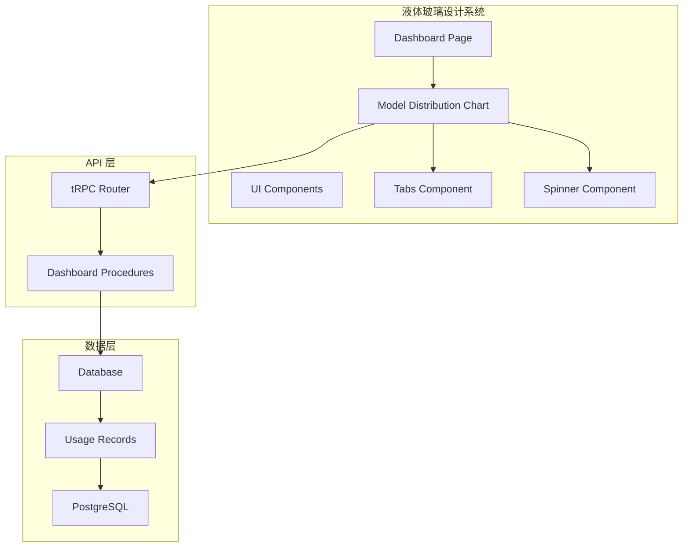
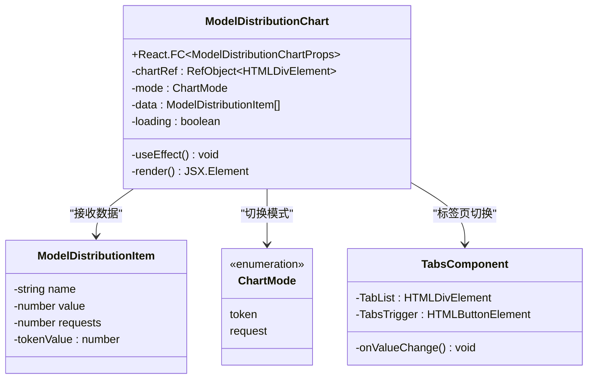
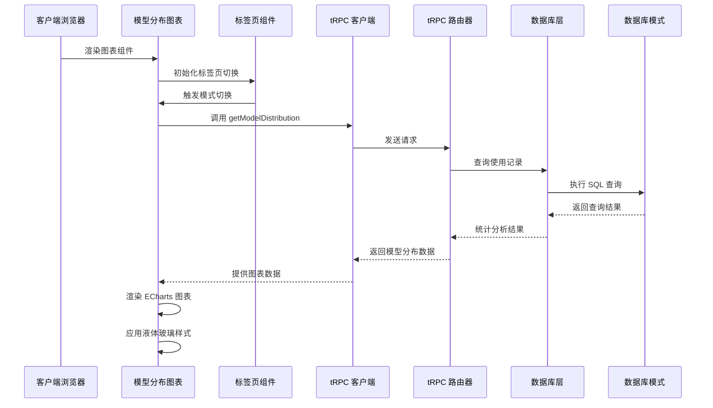
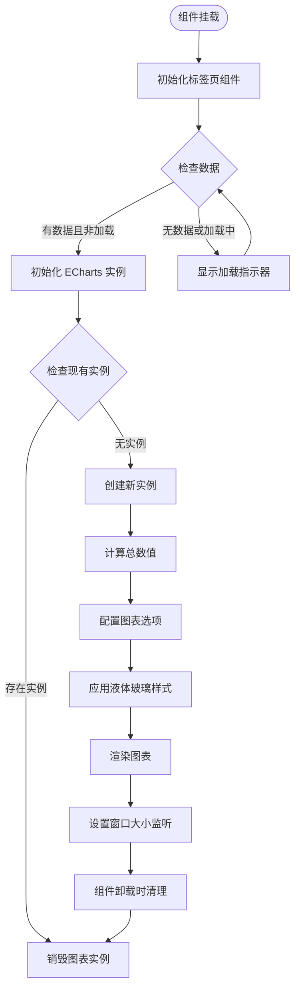
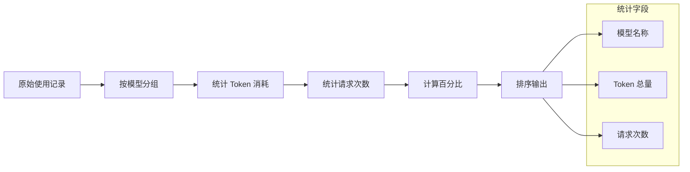

# 模型分布图表

<cite>
**本文档引用的文件**
- [model-distribution-chart.tsx](file://src/app/(dashboard)/components/model-distribution-chart.tsx)
- [dashboard.ts](file://src/server/api/routers/dashboard.ts)
- [dashboard.ts](file://src/types/dashboard.ts)
- [page.tsx](file://src/app/(dashboard)/page.tsx)
- [region-heatmap-chart.tsx](file://src/app/(dashboard)/components/region-heatmap-chart.tsx)
- [usage-trend-chart.tsx](file://src/app/(dashboard)/components/usage-trend-chart.tsx)
- [globals.css](file://src/app/globals.css)
- [tabs.tsx](file://src/components/ui/tabs.tsx)
- [spinner.tsx](file://src/components/ui/spinner.tsx)
- [database.ts](file://src/lib/database.ts)
- [schema.ts](file://src/lib/schema.ts)
- [package.json](file://package.json)
</cite>

## 更新摘要
**变更内容**
- 新增液体玻璃设计系统集成说明
- 添加标签页切换功能的详细分析
- 更新图表组件的UI设计规范
- 增强数据可视化交互功能描述

## 目录
1. [简介](#简介)
2. [项目结构](#项目结构)
3. [核心组件](#核心组件)
4. [架构概览](#架构概览)
5. [详细组件分析](#详细组件分析)
6. [液体玻璃设计系统](#液体玻璃设计系统)
7. [数据流分析](#数据流分析)
8. [性能考虑](#性能考虑)
9. [故障排除指南](#故障排除指南)
10. [结论](#结论)

## 简介

模型分布图表是 AIGate 仪表板中的关键可视化组件，作为统一液体玻璃设计系统的重要组成部分，用于展示不同 AI 模型的使用情况分布。该组件基于 ECharts 库构建，提供了两种维度的分析视角：按 Token 消耗占比和按请求次数占比的饼状图展示，并集成了现代化的标签页切换功能。

该图表帮助管理员和开发者：
- 了解各 AI 模型的使用频率和资源消耗
- 识别主要的模型使用模式
- 优化模型选择和资源配置
- 进行成本控制和预算管理
- 享受一致的液体玻璃视觉体验

## 项目结构

模型分布图表位于项目的前端组件目录中，采用模块化设计，与后端 API 和数据库层紧密集成，并完全融入液体玻璃设计系统。



**图表来源**
- [page.tsx](file://src/app/(dashboard)/page.tsx#L105-L226)
- [model-distribution-chart.tsx](file://src/app/(dashboard)/components/model-distribution-chart.tsx#L1-L147)
- [dashboard.ts](file://src/server/api/routers/dashboard.ts#L399-L452)

**章节来源**
- [page.tsx](file://src/app/(dashboard)/page.tsx#L105-L226)
- [model-distribution-chart.tsx](file://src/app/(dashboard)/components/model-distribution-chart.tsx#L1-L147)

## 核心组件

### 模型分布图表组件

模型分布图表是一个 React 函数组件，使用 ECharts 实现交互式饼状图可视化，并集成了标签页切换功能。



**图表来源**
- [model-distribution-chart.tsx](file://src/app/(dashboard)/components/model-distribution-chart.tsx#L8-L26)
- [tabs.tsx](file://src/components/ui/tabs.tsx#L10-L38)

### 数据类型定义

组件使用 TypeScript 接口确保类型安全：

- `ModelDistributionItem`: 表示单个模型的使用数据，包含名称、Token 消耗值和请求次数
- `ChartDataItem`: ECharts 图表数据项扩展，支持额外的 tokenValue 字段
- `ChartMode`: 图表显示模式枚举，支持 token 和 request 两种模式

**章节来源**
- [model-distribution_chart.tsx](file://src/app/(dashboard)/components/model-distribution-chart.tsx#L8-L26)
- [dashboard.ts](file://src/types/dashboard.ts#L43-L48)

## 架构概览

模型分布图表采用前后端分离的架构模式，通过 tRPC 实现类型安全的 API 调用，并完全集成液体玻璃设计系统。



**图表来源**
- [page.tsx](file://src/app/(dashboard)/page.tsx#L87-L92)
- [dashboard.ts](file://src/server/api/routers/dashboard.ts#L399-L452)
- [database.ts](file://src/lib/database.ts#L191-L216)

## 详细组件分析

### 前端渲染逻辑

模型分布图表组件实现了完整的生命周期管理和响应式更新机制，完全融入液体玻璃设计系统：



**图表来源**
- [model-distribution-chart.tsx](file://src/app/(dashboard)/components/model-distribution-chart.tsx#L33-L115)

### 图表配置选项

组件使用 ECharts 的高级配置选项实现丰富的交互功能，并支持液体玻璃设计风格：

| 配置项 | 功能描述 | 默认值 | 液体玻璃样式 |
|--------|----------|--------|-------------|
| `tooltip.trigger` | 提示框触发方式 | `'item'` | 透明背景，模糊效果 |
| `legend.orient` | 图例排列方向 | `'vertical'` | 深色主题适配 |
| `series.radius` | 饼图内外半径 | `['40%', '70%']` | 圆角边框，白色描边 |
| `label.position` | 标签位置 | `'outside'` | 透明文本，深色背景 |
| `itemStyle.borderRadius` | 边框圆角 | `10` | 模糊阴影效果 |

### 数据处理流程

后端 API 对原始使用记录进行聚合分析：



**图表来源**
- [dashboard.ts](file://src/server/api/routers/dashboard.ts#L428-L447)

**章节来源**
- [model-distribution-chart.tsx](file://src/app/(dashboard)/components/model-distribution-chart.tsx#L44-L104)
- [dashboard.ts](file://src/server/api/routers/dashboard.ts#L408-L452)

## 液体玻璃设计系统

### 设计理念

AIGate 仪表板完全采用液体玻璃设计系统，营造现代、通透的视觉体验：

- **背景透明度**: 使用 `bg-white/60` 到 `bg-white/40` 的透明度设置
- **模糊效果**: 应用 `backdrop-blur-xl` 创建毛玻璃效果
- **边框设计**: 采用 `border border-white/30` 的微妙边框
- **阴影层次**: 使用 `shadow-[0_8px_32px_rgba(0,0,0,0.08)]` 的柔和阴影

### 组件样式规范

所有图表组件都遵循统一的液体玻璃设计规范：

```css
/* 液体玻璃卡片样式 */
.rounded-2xl.p-6.backdrop-blur-xl.bg-white/50.dark:bg-black/25.border.border-white/30.dark:border-white/10.shadow-[0_8px_32px_rgba(0,0,0,0.1)]
```

### 主题适配

液体玻璃设计系统支持明暗主题切换：

- **浅色模式**: `rgba(255, 255, 255, 0.7)` 背景，`rgba(203, 213, 225, 0.4)` 边框
- **深色模式**: `rgba(30, 41, 59, 0.6)` 背景，`rgba(255, 255, 255, 0.1)` 边框

**章节来源**
- [page.tsx](file://src/app/(dashboard)/page.tsx#L107-L226)
- [globals.css](file://src/app/globals.css#L5-L129)

## 数据流分析

### 前端数据流

模型分布图表的数据流从页面组件传递到图表组件，完全集成液体玻璃设计系统：

```mermaid
graph TD
A[Dashboard Page] --> B[trpc.dashboard.getModelDistribution]
B --> C[API 响应数据]
C --> D[ModelDistributionItem[]]
D --> E[Model Distribution Chart]
E --> F[标签页组件初始化]
F --> G[ECharts 渲染]
G --> H[液体玻璃样式应用]
subgraph "数据转换"
I[日期范围计算]
J[API 参数构建]
K[数据格式化]
L[标签页状态管理]
end
A --> I
I --> J
J --> K
K --> D
D --> L
L --> F
```

**图表来源**
- [page.tsx](file://src/app/(dashboard)/page.tsx#L66-L92)
- [model-distribution-chart.tsx](file://src/app/(dashboard)/components/model-distribution-chart.tsx#L28-L32)

### 后端数据处理

后端 API 处理复杂的数据库查询和数据聚合：

| 步骤 | 操作 | 时间复杂度 | 描述 |
|------|------|------------|------|
| 1 | 日期范围验证 | O(1) | 确定查询时间范围 |
| 2 | 使用记录查询 | O(n) | 获取指定时间范围内的记录 |
| 3 | 模型分组统计 | O(n) | 按模型聚合使用数据 |
| 4 | 百分比计算 | O(m) | m 为模型数量 |
| 5 | 结果排序 | O(m log m) | 按 Token 消耗降序排列 |

**章节来源**
- [page.tsx](file://src/app/(dashboard)/page.tsx#L68-L92)
- [dashboard.ts](file://src/server/api/routers/dashboard.ts#L408-L452)

## 性能考虑

### 前端性能优化

模型分布图表实现了多项性能优化措施，完全集成液体玻璃设计系统：

1. **实例管理**: 自动释放旧的 ECharts 实例，避免内存泄漏
2. **条件渲染**: 在数据加载期间显示加载指示器，使用 `Spinner` 组件
3. **窗口自适应**: 监听窗口大小变化自动调整图表尺寸
4. **懒加载**: 仅在组件挂载时初始化图表
5. **标签页优化**: 使用 `Tabs` 组件实现高效的模式切换

### 后端性能优化

后端 API 采用高效的数据库查询策略：

1. **批量查询**: 使用 Promise.all 并行执行多个统计查询
2. **索引优化**: 利用数据库索引加速时间范围查询
3. **聚合函数**: 使用 SQL 聚合函数减少数据传输量
4. **分页处理**: 限制返回数据量防止内存溢出

## 故障排除指南

### 常见问题及解决方案

| 问题类型 | 症状 | 可能原因 | 解决方案 |
|----------|------|----------|----------|
| 图表不显示 | 空白图表 | 数据为空或加载中 | 检查 API 调用和数据格式 |
| 图表重叠 | SVG 冲突 | 实例未正确释放 | 确保调用 dispose 方法 |
| 性能问题 | 页面卡顿 | 数据量过大 | 实施数据分页和缓存策略 |
| 样式异常 | 显示错误 | 主题切换问题 | 检查 CSS 变量和主题配置 |
| 标签页失效 | 无法切换 | Tabs 组件问题 | 验证标签页状态管理 |

### 调试工具

1. **浏览器开发者工具**: 检查网络请求和 JavaScript 错误
2. **ECharts 调试**: 使用官方调试工具查看图表配置
3. **CSS 调试**: 检查液体玻璃样式的应用情况
4. **数据库查询**: 验证 SQL 查询的正确性和性能

**章节来源**
- [model-distribution-chart.tsx](file://src/app/(dashboard)/components/model-distribution-chart.tsx#L36-L40)
- [dashboard.ts](file://src/server/api/routers/dashboard.ts#L192-L195)

## 结论

模型分布图表作为 AIGate 仪表板的核心组件，成功实现了以下目标：

1. **功能完整性**: 提供了双维度的模型使用分析能力，支持标签页切换
2. **用户体验**: 通过液体玻璃设计系统提升了整体视觉体验
3. **技术架构**: 采用了现代化的全栈技术栈，完全集成液体玻璃设计
4. **性能表现**: 实现了高效的前后端协作机制和优化的渲染策略
5. **设计一致性**: 与其他图表组件保持统一的液体玻璃设计风格

该组件展现了良好的代码组织结构、清晰的数据流设计、完善的错误处理机制和一致的液体玻璃视觉体验，为后续的功能扩展奠定了坚实基础。通过持续的优化和改进，模型分布图表将继续为用户提供价值洞察和优秀的分析体验。