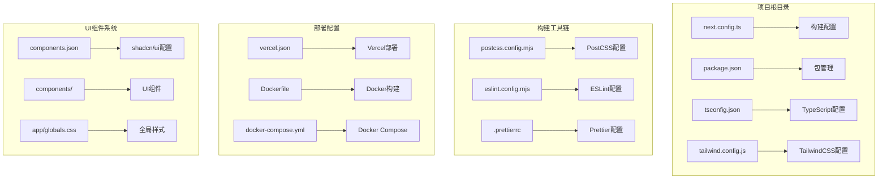
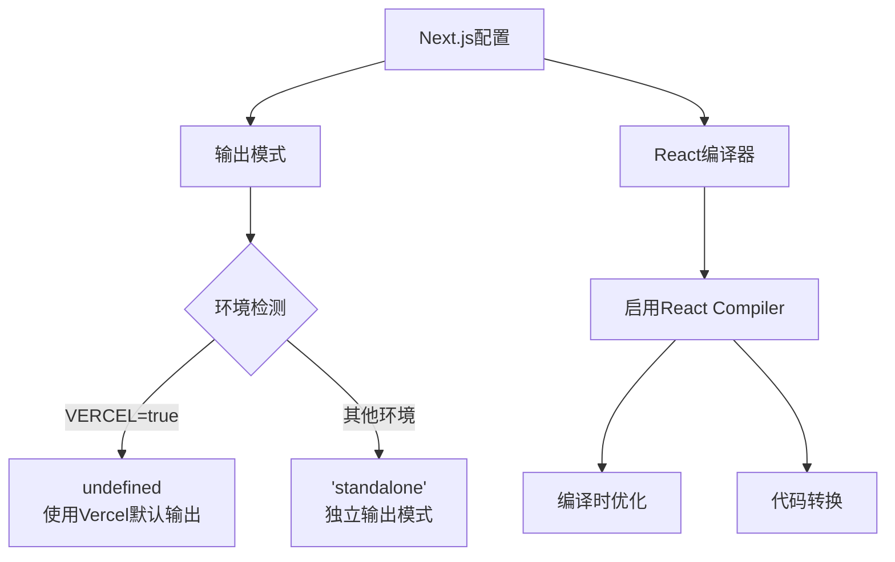
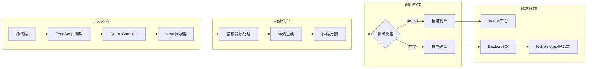
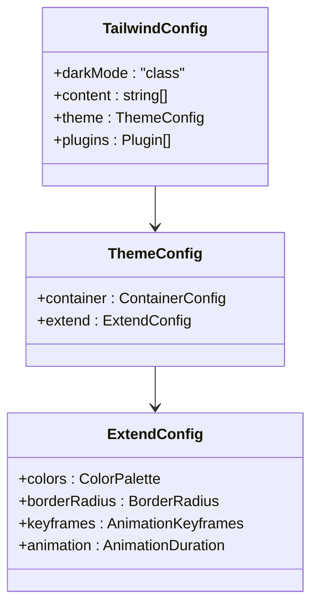
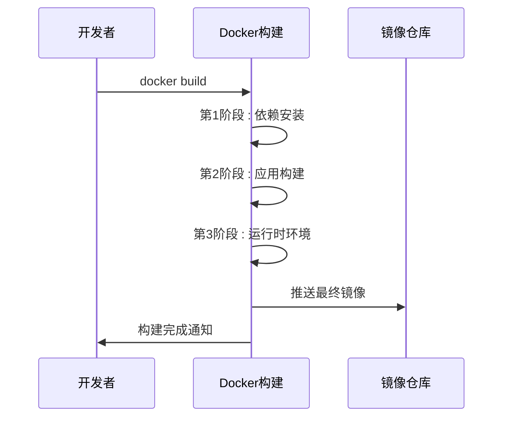
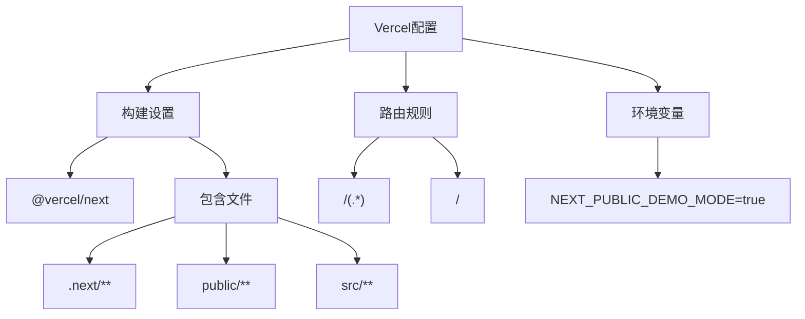
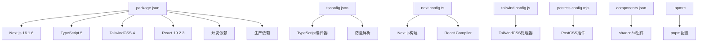

# Nextjs 构建配置文档

<cite>
**本文档中引用的文件**
- [next.config.ts](file://next.config.ts)
- [package.json](file://package.json)
- [tsconfig.json](file://tsconfig.json)
- [tailwind.config.js](file://tailwind.config.js)
- [postcss.config.mjs](file://postcss.config.mjs)
- [vercel.json](file://vercel.json)
- [Dockerfile](file://Dockerfile)
- [docker-compose.yml](file://docker-compose.yml)
- [.npmrc](file://.npmrc)
- [eslint.config.mjs](file://eslint.config.mjs)
- [.prettierrc](file://.prettierrc)
- [components.json](file://components.json)
</cite>

## 目录
1. [简介](#简介)
2. [项目结构概览](#项目结构概览)
3. [核心构建配置](#核心构建配置)
4. [架构总览](#架构总览)
5. [详细组件分析](#详细组件分析)
6. [依赖关系分析](#依赖关系分析)
7. [性能考虑](#性能考虑)
8. [故障排除指南](#故障排除指南)
9. [结论](#结论)

## 简介

AIGate 是一个基于 Next.js 16 + tRPC + Redis 的智能 AI 网关管理系统。该项目采用现代化的前端技术栈，支持配额控制和多模型代理，具备高性能架构和安全认证机制。

本项目在构建配置方面采用了多种优化策略，包括 React Compiler、Standalone 输出、Docker 多阶段构建等，以确保开发效率和生产环境的稳定性。

## 项目结构概览

项目采用标准的 Next.js 16 App Router 结构，主要包含以下关键目录：



**图表来源**
- [next.config.ts:1-9](file://next.config.ts#L1-L9)
- [package.json:1-94](file://package.json#L1-L94)
- [tsconfig.json:1-42](file://tsconfig.json#L1-L42)

## 核心构建配置

### Next.js 构建配置

Next.js 的核心构建配置位于 `next.config.ts` 文件中，主要包含以下关键设置：



**图表来源**
- [next.config.ts:3-6](file://next.config.ts#L3-L6)

### 包管理配置

项目使用 pnpm 作为包管理器，版本锁定在 9.0.0。主要配置特点：

- **包管理器**: pnpm@9.0.0
- **脚本命令**: 
  - 开发模式: `next dev`
  - 生产构建: `next build`
  - 启动服务: `next start`
  - 演示模式: 支持 DEMO_MODE 环境变量

**章节来源**
- [package.json:6-18](file://package.json#L6-L18)
- [package.json:20-71](file://package.json#L20-L71)

### TypeScript 配置

TypeScript 配置采用严格模式，支持现代 JavaScript 特性：

- **目标版本**: ES2017
- **模块系统**: esnext + bundler
- **路径映射**: `@/*` -> `./src/*`
- **插件支持**: Next.js 内置 TypeScript 插件

**章节来源**
- [tsconfig.json:2-29](file://tsconfig.json#L2-L29)

## 架构总览

项目的整体构建架构采用多层设计，从开发到生产的完整流程如下：



**图表来源**
- [next.config.ts:4-5](file://next.config.ts#L4-L5)
- [Dockerfile:20-42](file://Dockerfile#L20-L42)

## 详细组件分析

### TailwindCSS 配置分析

TailwindCSS 配置提供了完整的样式系统支持：



**图表来源**
- [tailwind.config.js:2-77](file://tailwind.config.js#L2-L77)

### PostCSS 配置分析

PostCSS 配置相对简洁，专注于与 TailwindCSS 的集成：

```mermaid
flowchart TD
A[PostCSS配置] --> B[@tailwindcss/postcss]
B --> C[样式预处理]
C --> D[自动前缀]
D --> E[优化输出]
```

**图表来源**
- [postcss.config.mjs:1-7](file://postcss.config.mjs#L1-L7)

### Docker 构建配置分析

Docker 采用多阶段构建策略，优化镜像大小和构建时间：



**图表来源**
- [Dockerfile:1-54](file://Dockerfile#L1-L54)

**章节来源**
- [Dockerfile:6-11](file://Dockerfile#L6-L11)
- [Dockerfile:13-22](file://Dockerfile#L13-L22)
- [Dockerfile:24-53](file://Dockerfile#L24-L53)

### Vercel 部署配置分析

Vercel 配置提供了云端部署的完整支持：



**图表来源**
- [vercel.json:4-26](file://vercel.json#L4-L26)

**章节来源**
- [vercel.json:19-26](file://vercel.json#L19-L26)

## 依赖关系分析

项目构建配置之间的依赖关系如下：



**图表来源**
- [package.json:20-91](file://package.json#L20-L91)
- [tsconfig.json:14-28](file://tsconfig.json#L14-L28)

**章节来源**
- [package.json:73-91](file://package.json#L73-L91)

## 性能考虑

### 构建性能优化

项目在多个层面实现了性能优化：

1. **React Compiler**: 自动代码优化和转换
2. **Standalone 输出**: 减少运行时依赖
3. **多阶段 Docker 构建**: 优化镜像大小
4. **TypeScript 模块解析**: 使用 bundler 提高解析效率

### 开发体验优化

- **快速刷新**: Next.js 的热重载功能
- **类型安全**: 完整的 TypeScript 支持
- **代码格式化**: Prettier + ESLint 统一规范

## 故障排除指南

### 常见构建问题

1. **依赖安装失败**
   - 检查 `.npmrc` 配置
   - 确认 pnpm 版本兼容性

2. **TypeScript 编译错误**
   - 验证 tsconfig.json 配置
   - 检查路径映射设置

3. **Docker 构建失败**
   - 确认 Dockerfile 多阶段构建顺序
   - 检查 .dockerignore 文件

### 调试建议

- 使用 `next dev` 进行开发调试
- 检查浏览器开发者工具中的网络请求
- 查看 Next.js 控制台输出信息

**章节来源**
- [.npmrc:1-5](file://.npmrc#L1-L5)

## 结论

AIGate 项目的 Next.js 构建配置展现了现代化前端工程的最佳实践。通过合理的配置组合，实现了：

- **高效的开发体验**: 完善的类型系统和热重载
- **优化的构建性能**: React Compiler 和多阶段构建
- **灵活的部署选项**: 支持本地 Docker 和 Vercel 云部署
- **一致的代码质量**: ESLint + Prettier + TypeScript 的完整工具链

这些配置为项目的长期维护和发展奠定了坚实的基础，同时也为类似项目的构建配置提供了优秀的参考模板。