# OpenAI 兼容聊天完成 API

<cite>
**本文档引用的文件**
- [README.md](file://README.md)
- [package.json](file://package.json)
- [completions.ts](file://src/pages/api/ai/chat/completions.ts)
- [stream.ts](file://src/pages/api/ai/chat/stream.ts)
- [ai-providers.ts](file://src/lib/ai-providers.ts)
- [quota.ts](file://src/lib/quota.ts)
- [database.ts](file://src/lib/database.ts)
- [types.ts](file://src/lib/types.ts)
- [cors.ts](file://src/lib/cors.ts)
- [ip-region.ts](file://src/lib/ip-region.ts)
- [redis.ts](file://src/lib/redis.ts)
- [logger.ts](file://src/lib/logger.ts)
- [schema.ts](file://src/lib/schema.ts)
- [provider-utils.ts](file://src/lib/provider-utils.ts)
- [ai-api.md](file://docs/ai-api.md)
- [project-description.md](file://readme/project-description.md)
- [trpc.ts](file://src/server/api/trpc.ts)
- [root.ts](file://src/server/api/root.ts)
- [ai.ts](file://src/server/api/routers/ai.ts)
- [quota.ts](file://src/server/api/routers/quota.ts)
- [trpc-handler.ts](file://src/pages/api/trpc/[trpc].ts)
- [demo-config.ts](file://src/lib/demo-config.ts)
- [demo-data.ts](file://src/lib/demo-data.ts)
- [demo-stats.ts](file://src/lib/demo-stats.ts)
- [init-admin.ts](file://src/lib/init-admin.ts)
- [logger-middleware.ts](file://src/lib/logger-middleware.ts)
- [whitelist.ts](file://src/server/api/routers/whitelist.ts)
- [chat-service.ts](file://src/lib/chat-service.ts)
</cite>

## 更新摘要
**变更内容**
- 新增演示模式检测机制和权限控制系统架构
- 完善日志系统架构和配额管理模块详细说明
- 更新 AI API 文档以反映最新的架构图和功能模块
- 增强 tRPC API 调用指南和流式响应处理细节
- 补充白名单规则管理和数据库操作的完整实现

## 目录
1. [简介](#简介)
2. [项目结构](#项目结构)
3. [核心组件](#核心组件)
4. [架构概览](#架构概览)
5. [详细组件分析](#详细组件分析)
6. [tRPC API 调用指南](#trpc-api-调用指南)
7. [流式响应处理](#流式响应处理)
8. [配额管理系统](#配额管理系统)
9. [演示模式与权限控制](#演示模式与权限控制)
10. [日志系统架构](#日志系统架构)
11. [依赖关系分析](#依赖关系分析)
12. [性能考虑](#性能考虑)
13. [故障排除指南](#故障排除指南)
14. [结论](#结论)

## 简介

AIGate 是一个基于 Next.js 14 + tRPC + Redis 的智能 AI 网关管理系统，专门设计用于提供 OpenAI 兼容的聊天完成 API。该项目的核心目标是为多用户提供安全、可控的 AI 模型访问能力，支持配额管理和多模型代理。

### 主要特性

- **智能配额管理**：基于 Redis 的实时配额检查，支持 Token 和请求次数双重限制
- **多模型代理**：统一接入 OpenAI、Anthropic、Google、DeepSeek 等主流 AI 服务商
- **高性能架构**：tRPC 类型安全 API + Redis 缓存，毫秒级响应
- **安全认证**：NextAuth.js 身份验证，支持管理员账户动态配置
- **实时监控**：仪表板展示请求趋势、地区分布、IP 记录等关键指标
- **完整的 tRPC 支持**：提供类型安全的 tRPC API 接口，支持多种调用方式
- **演示模式支持**：内置演示模式检测和权限控制机制
- **完善日志系统**：基于 Winston 的结构化日志记录和审计功能

### OpenAI 兼容接口

项目提供了完整的 OpenAI 兼容聊天完成 API，支持标准的 `/v1/chat/completions` 端点，完全兼容 OpenAI SDK 和客户端库。同时新增了基于 tRPC 的类型安全 API 接口，提供更好的开发体验。

## 项目结构

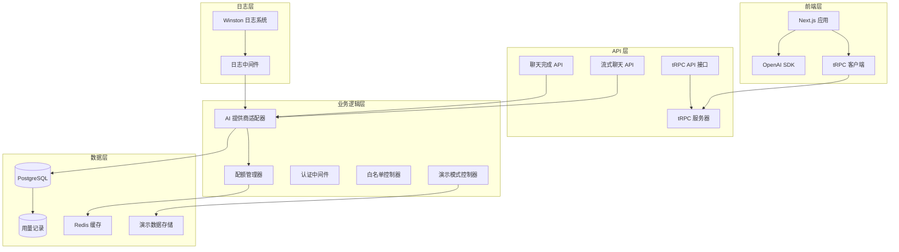

**图表来源**
- [completions.ts:1-226](file://src/pages/api/ai/chat/completions.ts#L1-L226)
- [stream.ts:1-124](file://src/pages/api/ai/chat/stream.ts#L1-L124)
- [ai-providers.ts:1-759](file://src/lib/ai-providers.ts#L1-L759)
- [trpc.ts:1-153](file://src/server/api/trpc.ts#L1-L153)
- [root.ts:1-25](file://src/server/api/root.ts#L1-L25)
- [demo-config.ts:1-57](file://src/lib/demo-config.ts#L1-L57)
- [logger.ts:1-192](file://src/lib/logger.ts#L1-L192)

**章节来源**
- [README.md:1-83](file://README.md#L1-L83)
- [package.json:1-91](file://package.json#L1-L91)

## 核心组件

### API 网关层

系统实现了三个主要的 API 端点：

1. **聊天完成端点** (`/api/ai/chat/completions`)
   - 支持同步和流式响应
   - 完全兼容 OpenAI 标准格式
   - 内置配额检查和使用量记录

2. **流式聊天端点** (`/api/ai/chat/stream`)
   - 专用的 Server-Sent Events (SSE) 实现
   - 直接转发提供商的流式响应
   - 支持实时内容传输

3. **tRPC API 端点** (`/api/trpc/*`)
   - 类型安全的 tRPC 接口
   - 支持 ai.chatCompletion、ai.getSupportedModels 等操作
   - 提供更好的开发体验和错误处理

### AI 提供商适配器

系统内置了六个主流 AI 提供商的支持：

| 提供商 | 模型支持 | 特殊功能 |
|--------|----------|----------|
| OpenAI | GPT-4, GPT-4o, GPT-3.5-turbo | 完整 OpenAI 功能 |
| Anthropic | Claude 3 Opus, Sonnet, Haiku | 安全过滤和内容控制 |
| Google | Gemini Pro, Gemini Ultra | 多模态支持 |
| DeepSeek | DeepSeek Chat, Coder | 代码优化 |
| Moonshot | Moonshot v1系列 | 长上下文窗口 |
| Spark | Spark v3.5, v3.0 | 国产模型 |

### 配额管理系统

采用多维度配额控制策略：

- **Token 限制模式**：基于每日/每月消耗的 Token 数量
- **请求次数限制模式**：基于每日请求次数
- **RPM 限制**：每分钟请求次数控制
- **用户级配额**：基于 `userId + apiKeyId` 组合的独立配额

### 演示模式控制系统

提供完整的演示模式支持：

- **演示模式检测**：通过环境变量控制演示模式启用
- **权限控制**：演示模式下的读写权限限制
- **数据隔离**：演示模式使用内存数据存储
- **自动重置**：支持定时重置演示数据

### 日志系统架构

基于 Winston 的结构化日志系统：

- **多级别日志**：error、warn、info、http、debug
- **文件轮转**：按日期自动轮转日志文件
- **结构化格式**：JSON 格式便于分析和检索
- **操作审计**：记录配额操作、AI 请求、认证等关键操作

**章节来源**
- [completions.ts:1-226](file://src/pages/api/ai/chat/completions.ts#L1-L226)
- [stream.ts:1-124](file://src/pages/api/ai/chat/stream.ts#L1-L124)
- [ai-providers.ts:1-759](file://src/lib/ai-providers.ts#L1-L759)
- [quota.ts:1-327](file://src/lib/quota.ts#L1-L327)
- [demo-config.ts:1-57](file://src/lib/demo-config.ts#L1-L57)
- [logger.ts:1-192](file://src/lib/logger.ts#L1-L192)

## 架构概览

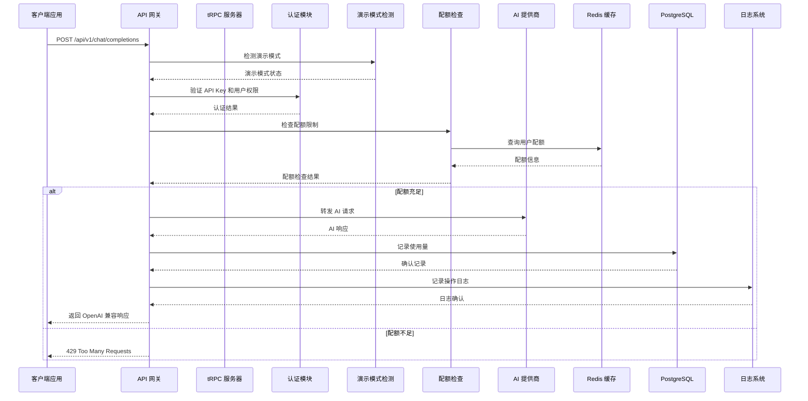

**图表来源**
- [completions.ts:34-96](file://src/pages/api/ai/chat/completions.ts#L34-L96)
- [quota.ts:79-200](file://src/lib/quota.ts#L79-L200)
- [ai-providers.ts:34-100](file://src/lib/ai-providers.ts#L34-L100)
- [demo-config.ts:7-9](file://src/lib/demo-config.ts#L7-L9)
- [logger.ts:134-153](file://src/lib/logger.ts#L134-L153)

## 详细组件分析

### 聊天完成 API 组件

#### 请求处理流程

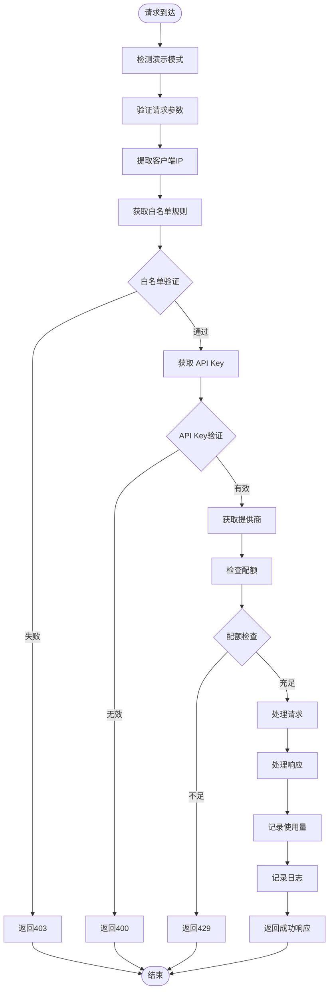

**图表来源**
- [completions.ts:34-96](file://src/pages/api/ai/chat/completions.ts#L34-L96)

#### 同步响应处理

同步响应遵循 OpenAI 标准格式，包含完整的响应头信息和使用统计：

| 字段 | 类型 | 描述 |
|------|------|------|
| id | string | 响应唯一标识符 |
| object | string | 对象类型（chat.completion） |
| created | number | 创建时间戳 |
| model | string | 使用的模型名称 |
| choices | array | 生成的选项数组 |
| usage | object | Token 使用统计（可选） |

#### 流式响应处理

流式响应使用 Server-Sent Events (SSE) 协议，逐字传输 AI 生成的内容：

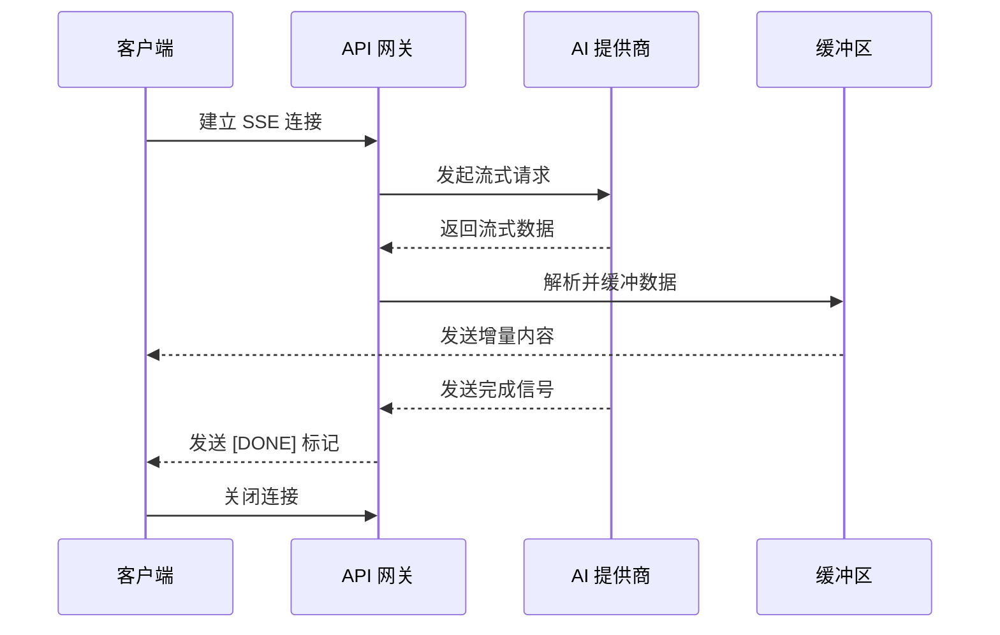

**图表来源**
- [stream.ts:68-115](file://src/pages/api/ai/chat/stream.ts#L68-L115)

**章节来源**
- [completions.ts:98-200](file://src/pages/api/ai/chat/completions.ts#L98-L200)
- [stream.ts:12-124](file://src/pages/api/ai/chat/stream.ts#L12-L124)

### AI 提供商适配器组件

#### 提供商接口设计

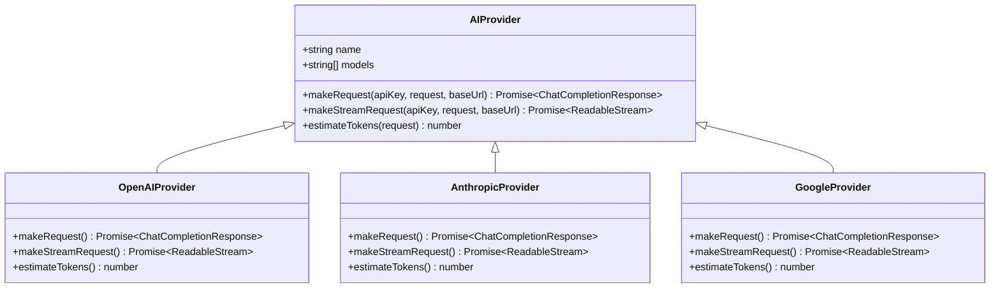

**图表来源**
- [ai-providers.ts:12-27](file://src/lib/ai-providers.ts#L12-L27)

#### Token 估算算法

系统采用简单的字符计数算法进行 Token 估算：

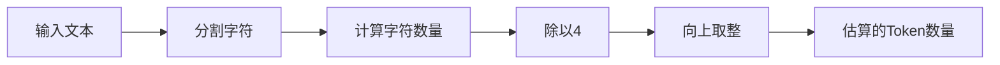

**图表来源**
- [ai-providers.ts:29-32](file://src/lib/ai-providers.ts#L29-L32)

**章节来源**
- [ai-providers.ts:34-759](file://src/lib/ai-providers.ts#L34-L759)

### 配额管理系统组件

#### 配额检查流程

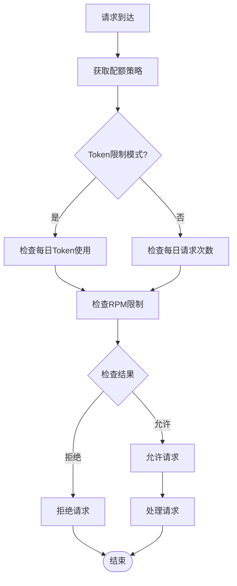

**图表来源**
- [quota.ts:79-200](file://src/lib/quota.ts#L79-L200)

#### Redis 缓存策略

系统使用 Redis 进行高性能缓存：

| 缓存键类型 | 键格式 | 过期时间 | 用途 |
|------------|--------|----------|------|
| 用户配额 | `user_quota:{userId}:{date}:{apiKey}` | 7天 | 每日Token使用量 |
| 用户请求 | `user_requests:{userId}:{date}:{apiKey}` | 7天 | 每日请求次数 |
| RPM限制 | `user_rpm:{userId}:{apiKey}:{minute}` | 2分钟 | 每分钟请求次数 |
| API Key缓存 | `api_keys:{provider}` | 1小时 | API Key缓存 |
| 策略缓存 | `policy:apiKey:{apiKeyId}` | 1小时 | 配额策略缓存 |

**章节来源**
- [quota.ts:1-327](file://src/lib/quota.ts#L1-L327)
- [redis.ts:17-43](file://src/lib/redis.ts#L17-L43)

### 数据库设计组件

#### 核心数据表结构

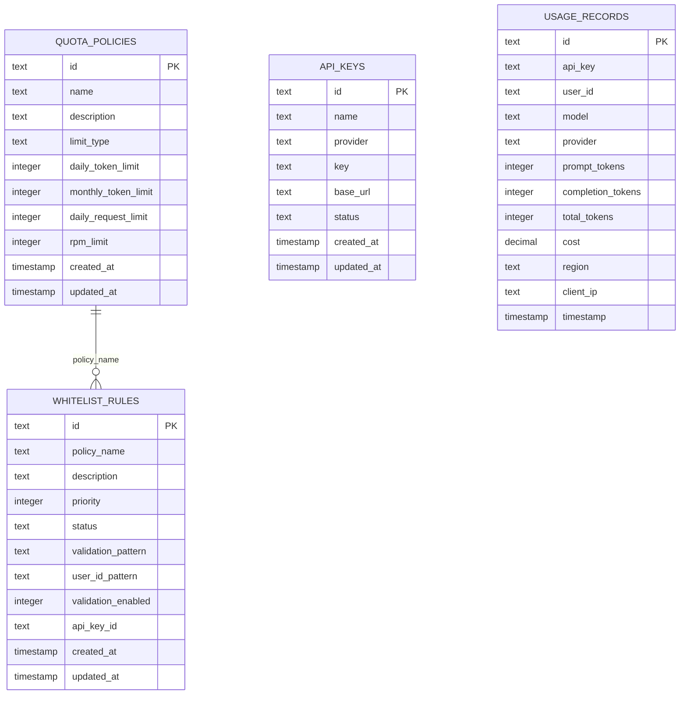

**图表来源**
- [schema.ts:28-98](file://src/lib/schema.ts#L28-L98)

**章节来源**
- [schema.ts:1-162](file://src/lib/schema.ts#L1-L162)
- [database.ts:1-850](file://src/lib/database.ts#L1-L850)

## tRPC API 调用指南

### tRPC 服务器架构

AIGate 提供了完整的 tRPC API 接口，支持类型安全的远程过程调用：

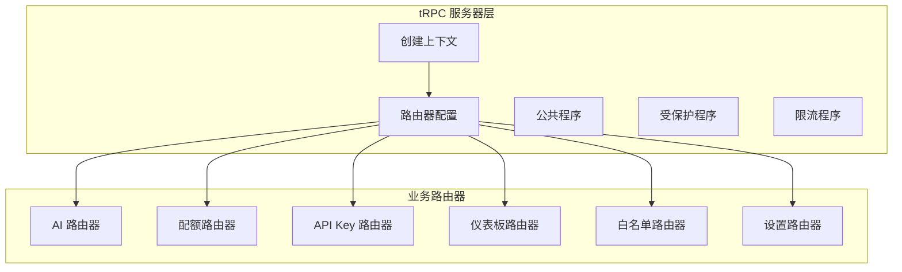

**图表来源**
- [trpc.ts:84-153](file://src/server/api/trpc.ts#L84-L153)
- [root.ts:14-21](file://src/server/api/root.ts#L14-L21)

### AI 路由器接口

AI 路由器提供了三个核心接口：

1. **chatCompletion** - 聊天完成接口
2. **getSupportedModels** - 获取支持的模型列表
3. **estimateTokens** - 估算 Token 消耗
4. **getQuotaInfo** - 获取配额信息

#### chatCompletion 接口

```typescript
// 请求参数
interface ChatCompletionInput {
  userId: string;
  apiKeyId: string;
  request: ChatCompletionRequest;
}

// 响应格式
interface ChatCompletionResponse {
  id: string;
  object: string;
  created: number;
  model: string;
  choices: Choice[];
  usage?: Usage;
  aigate_metadata: {
    requestId: string;
    provider: string;
    processingTime: number;
    quotaRemaining: {
      tokens?: number;
      requests?: number;
    };
  };
}
```

**章节来源**
- [ai.ts:88-213](file://src/server/api/routers/ai.ts#L88-L213)
- [types.ts:48-118](file://src/lib/types.ts#L48-L118)

### 配额路由器接口

配额路由器提供了完整的配额管理功能：

```typescript
// 用户使用情况查询
getUserUsage: protectedProcedure
  .input(z.object({ userId: z.string(), apiKeyId: z.string() }))
  .query(async ({ input }) => {
    // 实现获取用户今日使用情况
  });

// 配额重置
resetQuota: protectedProcedure
  .input(z.object({ userId: z.string(), apiKeyId: z.string() }))
  .mutation(async ({ input }) => {
    // 实现重置用户配额
  });

// 获取所有配额策略
getAllPolicies: protectedProcedure.query(async () => {
  // 实现获取配额策略列表
});
```

**章节来源**
- [quota.ts:39-221](file://src/server/api/routers/quota.ts#L39-L221)

### tRPC 客户端调用示例

#### TypeScript 客户端

```typescript
// 基础调用
const response = await trpc.ai.chatCompletion.mutate({
  userId: 'user@example.com',
  apiKeyId: 'key-id-abc123',
  request: {
    model: 'gpt-4o',
    messages: [
      {
        role: 'system',
        content: '你是一个有帮助的编程助手',
      },
      {
        role: 'user',
        content: '用 TypeScript 写一个快速排序函数',
      },
    ],
    temperature: 0.7,
    max_tokens: 2000,
  },
});

// 处理响应
console.log('AI 回复:', response.choices[0].message.content);
console.log('消耗 Token:', response.usage?.total_tokens);
console.log('剩余配额:', response.aigate_metadata.quotaRemaining.tokens);
console.log('处理耗时:', response.aigate_metadata.processingTime, 'ms');
```

#### 错误处理

```typescript
try {
  const response = await trpc.ai.chatCompletion.mutate({
    userId: 'user@example.com',
    apiKeyId: 'key-id-abc123',
    request: {
      model: 'gpt-4o',
      messages: [{ role: 'user', content: '你好' }],
    },
  });

  console.log(response.choices[0].message.content);
} catch (error: any) {
  switch (error.data?.code) {
    case 'TOO_MANY_REQUESTS':
      console.error('❌ 配额已用完:', error.message);
      // 显示用户升级提示
      break;
    case 'FORBIDDEN':
      console.error('❌ 用户未授权:', error.message);
      // 重定向到登录或授权页面
      break;
    case 'BAD_REQUEST':
      console.error('❌ 请求参数错误:', error.message);
      // 检查参数是否正确
      break;
    default:
      console.error('❌ 请求失败:', error.message);
  }
}
```

**章节来源**
- [ai-api.md:119-182](file://docs/ai-api.md#L119-L182)

## 流式响应处理

### SSE 流式接口

AIGate 提供了专门的流式聊天接口，支持实时内容传输：

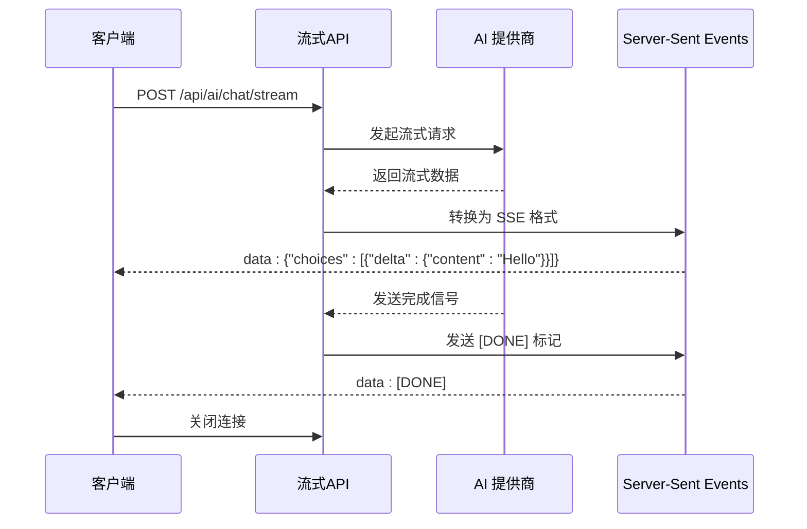

**图表来源**
- [stream.ts:68-115](file://src/pages/api/ai/chat/stream.ts#L68-L115)

### 流式响应格式

SSE 流式数据采用标准格式：

```
data: {"choices":[{"delta":{"content":"Hello"}}]}

data: {"choices":[{"delta":{"content":" "}}]}

data: {"choices":[{"delta":{"content":"world"}}]}

data: [DONE]
```

### 流式响应处理示例

#### JavaScript - EventSource API

```javascript
const eventSource = new EventSource('/api/ai/chat/stream?userId=user@example.com&apiKeyId=key-id');

let fullContent = '';

eventSource.addEventListener('message', (event) => {
  if (event.data === '[DONE]') {
    console.log('流式响应完成');
    eventSource.close();
    return;
  }

  try {
    const data = JSON.parse(event.data);
    const content = data.choices?.[0]?.delta?.content;
    if (content) {
      fullContent += content;
      // 实时更新 UI
      document.getElementById('response').textContent = fullContent;
    }
  } catch (e) {
    console.error('解析失败:', e);
  }
});

eventSource.addEventListener('error', (event) => {
  console.error('Stream 错误:', event);
  eventSource.close();
});
```

#### JavaScript - fetch + ReadableStream

```javascript
async function streamChat() {
  const response = await fetch('/api/ai/chat/stream', {
    method: 'POST',
    headers: { 'Content-Type': 'application/json' },
    body: JSON.stringify({
      userId: 'user@example.com',
      apiKeyId: 'key-id-abc123',
      request: {
        model: 'gpt-4o',
        messages: [{ role: 'user', content: '讲个故事' }],
        stream: true,
      },
    }),
  });

  const reader = response.body.getReader();
  const decoder = new TextDecoder();
  let fullContent = '';

  try {
    while (true) {
      const { done, value } = await reader.read();
      if (done) break;

      const chunk = decoder.decode(value);
      const lines = chunk.split('\n');

      for (const line of lines) {
        if (line.startsWith('data: ')) {
          const data = line.slice(6);
          if (data === '[DONE]') {
            console.log('完成');
            return;
          }

          try {
            const parsed = JSON.parse(data);
            const content = parsed.choices?.[0]?.delta?.content;
            if (content) {
              fullContent += content;
              console.log('收到:', content);
            }
          } catch (e) {
            // 忽略解析错误
          }
        }
      }
    }
  } finally {
    reader.releaseLock();
  }
}
```

**章节来源**
- [ai-api.md:245-476](file://docs/ai-api.md#L245-L476)

## 配额管理系统

### 配额限制模式

系统支持两种配额限制方式：

#### 1. Token 限制模式

- 根据每日/每月消耗的 Token 数量限制
- 适用于 Token 消耗不均匀的场景

#### 2. 请求次数限制模式

- 根据每日请求次数限制
- 适用于需要控制调用频率的场景

### 配额标识逻辑

配额基于 **`userId + apiKeyId`** 的组合计算：

```
配额标识符 = `${userId}:${apiKeyId}`
```

**含义**:

- 同一用户使用不同的 API Key，配额分开计算
- 同一 API Key 被不同用户使用，配额也分开计算
- 每个组合都有独立的每日配额和 RPM 限制

### 从响应中获取配额信息

```typescript
const response = await trpc.ai.chatCompletion.mutate({...});

// 在 aigate_metadata 中获取剩余配额
const { quotaRemaining } = response.aigate_metadata;

if (quotaRemaining.tokens !== undefined) {
  // Token 限制模式
  console.log(`剩余 Token: ${quotaRemaining.tokens}`);
} else if (quotaRemaining.requests !== undefined) {
  // 请求次数限制模式
  console.log(`剩余请求次数: ${quotaRemaining.requests}`);
}

// 配额即将用完时的提醒
if (quotaRemaining.tokens < 1000) {
  showWarning('配额即将用完，请联系管理员');
}
```

### 配额检查最佳实践

```typescript
// 发送前先检查配额
async function quotaAwareCall(params: any) {
  // 先估算 token
  const estimate = await trpc.ai.estimateTokens.query(params.request);

  // 从配额接口检查是否有足够配额
  const quotaInfo = await trpc.quota.getQuotaInfo.query({
    userId: params.userId,
    apiKeyId: params.apiKeyId,
  });

  const remaining = quotaInfo.remaining.daily || quotaInfo.remaining.monthly;

  if (remaining && estimate.estimatedTokens > remaining) {
    throw new Error('配额不足，无法处理此请求');
  }

  // 配额充足，发送请求
  return await trpc.ai.chatCompletion.mutate(params);
}
```

**章节来源**
- [ai-api.md:599-730](file://docs/ai-api.md#L599-L730)
- [ai.ts:242-299](file://src/server/api/routers/ai.ts#L242-L299)

## 演示模式与权限控制

### 演示模式检测机制

系统提供了完整的演示模式支持，通过环境变量控制演示模式的启用和行为：

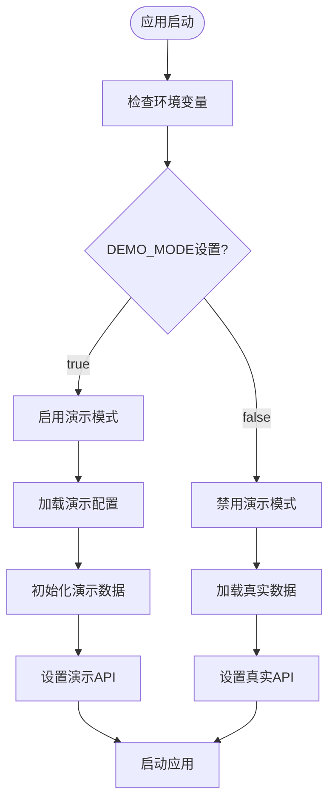

**图表来源**
- [demo-config.ts:7-9](file://src/lib/demo-config.ts#L7-L9)

### 权限控制系统

演示模式下的权限控制机制：

| 操作类型 | 演示模式权限 | 真实模式权限 | 说明 |
|----------|--------------|--------------|------|
| 读取操作 | ✅ 允许 | ✅ 允许 | 所有读取操作 |
| 写入操作 | ❌ 禁止 | ✅ 允许 | 演示模式下禁止修改 |
| 删除操作 | ❌ 禁止 | ✅ 允许 | 演示模式下禁止删除 |
| 数据重置 | ⚠️ 可选 | ❌ 禁止 | 演示模式可定时重置 |

### 演示数据管理

系统使用内存数据存储提供演示模式的数据支持：

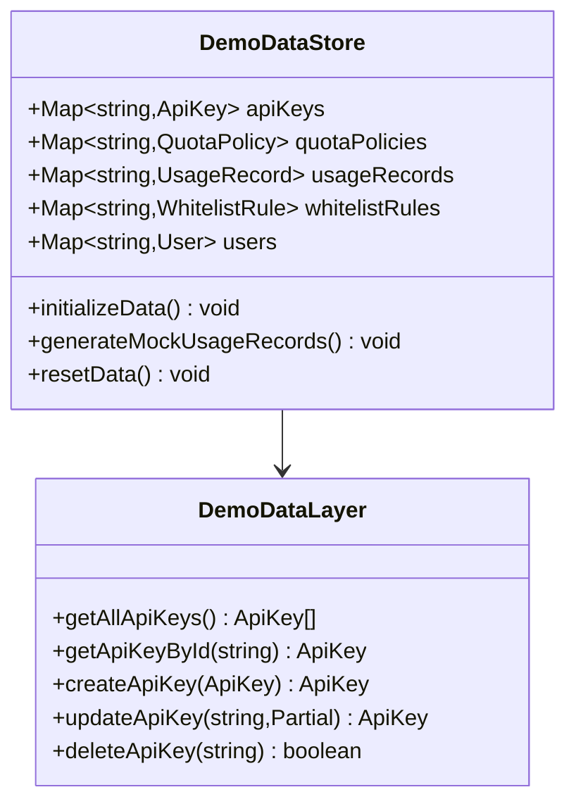

**图表来源**
- [demo-data.ts:20-435](file://src/lib/demo-data.ts#L20-L435)

### 管理员账户同步

系统支持启动时自动同步管理员用户：

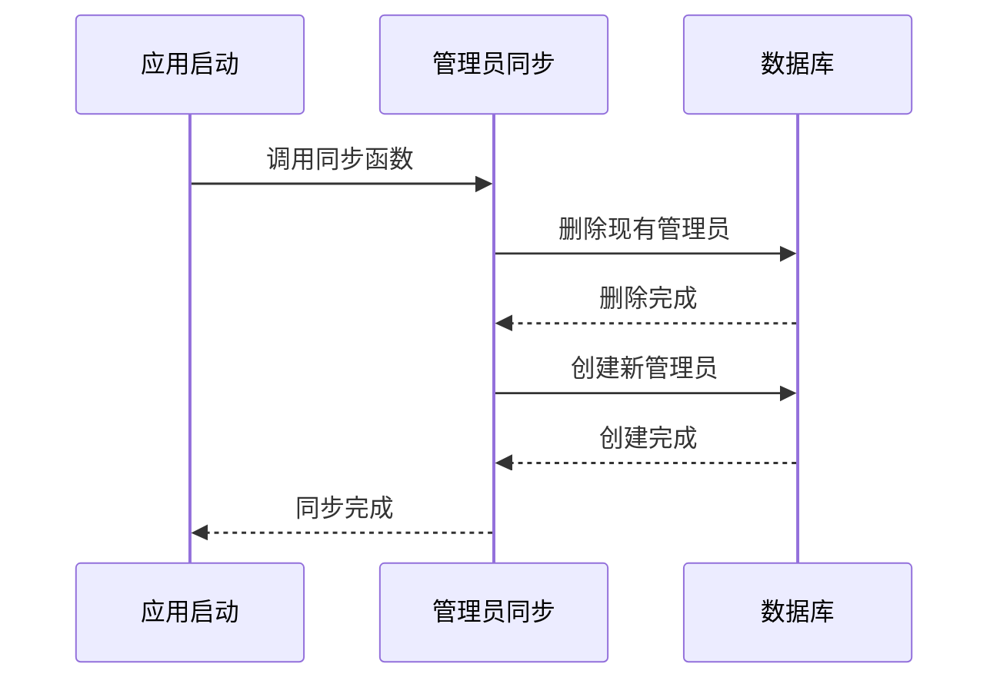

**图表来源**
- [init-admin.ts:9-71](file://src/lib/init-admin.ts#L9-L71)

**章节来源**
- [demo-config.ts:1-57](file://src/lib/demo-config.ts#L1-L57)
- [demo-data.ts:1-435](file://src/lib/demo-data.ts#L1-L435)
- [demo-stats.ts:1-111](file://src/lib/demo-stats.ts#L1-L111)
- [init-admin.ts:1-71](file://src/lib/init-admin.ts#L1-L71)

## 日志系统架构

### 日志级别和格式

系统基于 Winston 提供了完整的日志记录功能：

```mermaid
graph TB
subgraph "日志级别"
Error[错误日志]
Warn[警告日志]
Info[信息日志]
Http[HTTP请求日志]
Debug[调试日志]
end
subgraph "日志格式"
ConsoleFormat[控制台格式]
FileFormat[文件格式(JSON)]
end
subgraph "日志输出"
ConsoleTransport[控制台输出]
ErrorFile[错误文件]
CombinedFile[合并文件]
HttpFile[HTTP文件]
end
Error --> ConsoleTransport
Warn --> ConsoleTransport
Info --> ConsoleTransport
Http --> ConsoleTransport
Debug --> ConsoleTransport
ConsoleFormat --> ConsoleTransport
FileFormat --> ErrorFile
FileFormat --> CombinedFile
FileFormat --> HttpFile
```

**图表来源**
- [logger.ts:5-18](file://src/lib/logger.ts#L5-L18)
- [logger.ts:35-45](file://src/lib/logger.ts#L35-L45)

### 日志中间件

提供统一的日志记录中间件：

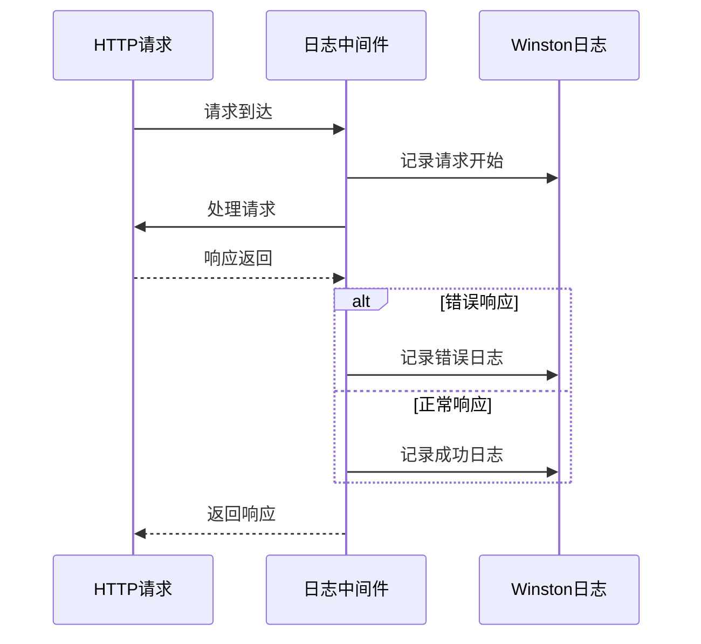

**图表来源**
- [logger-middleware.ts:5-29](file://src/lib/logger-middleware.ts#L5-L29)

### 专用日志记录函数

系统提供了针对不同操作类型的专用日志记录函数：

| 日志类型 | 函数名 | 用途 | 示例 |
|----------|--------|------|------|
| 配额操作 | logQuotaOperation | 记录配额检查、更新、重置 | `logQuotaOperation('check', userId, apiKey)` |
| AI 请求 | logAIRequest | 记录AI请求详情 | `logAIRequest(userId, model, provider, tokens)` |
| 认证操作 | logAuth | 记录用户认证状态 | `logAuth('login', userId)` |
| 业务操作 | logOperation | 记录一般业务操作 | `logOperation('info', '用户注册')` |

**章节来源**
- [logger.ts:1-192](file://src/lib/logger.ts#L1-L192)
- [logger-middleware.ts:1-138](file://src/lib/logger-middleware.ts#L1-L138)

## 依赖关系分析

### 外部依赖关系

```mermaid
graph TB
subgraph "核心依赖"
NextJS[Next.js 16.1.6]
tRPC[tRPC 10.45.2]
Redis[Redis 4.6.10]
PostgreSQL[PostgreSQL]
End
subgraph "AI 提供商 SDK"
OpenAI[OpenAI SDK]
Anthropic[Anthropic SDK]
Google[Google Generative AI]
DeepSeek[DeepSeek SDK]
end
subgraph "工具库"
Winston[Winston 日志]
Drizzle[Drizzle ORM]
Zod[Zod 类型验证]
UUID[UUID 生成]
End
NextJS --> tRPC
tRPC --> Redis
tRPC --> PostgreSQL
tRPC --> OpenAI
tRPC --> Anthropic
tRPC --> Google
tRPC --> DeepSeek
NextJS --> Winston
NextJS --> Drizzle
NextJS --> Zod
NextJS --> UUID
```

**图表来源**
- [package.json:18-68](file://package.json#L18-L68)

### 内部模块依赖

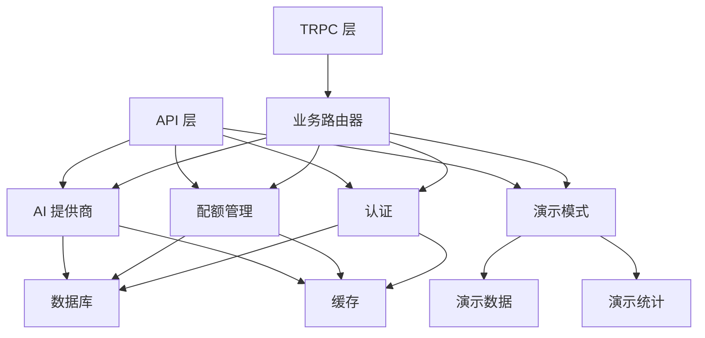

**图表来源**
- [completions.ts:1-13](file://src/pages/api/ai/chat/completions.ts#L1-L13)
- [ai-providers.ts:1-5](file://src/lib/ai-providers.ts#L1-L5)
- [trpc.ts:1-153](file://src/server/api/trpc.ts#L1-L153)
- [demo-data.ts:1-17](file://src/lib/demo-data.ts#L1-L17)

**章节来源**
- [package.json:1-91](file://package.json#L1-L91)

## 性能考虑

### 缓存策略优化

1. **Redis 缓存层次**
   - API Key 缓存：1小时过期，减少数据库查询
   - 配额策略缓存：1小时过期，避免频繁策略计算
   - 用户配额缓存：7天过期，支持长期使用统计

2. **连接池管理**
   - Redis 连接池：自动重连和错误处理
   - 数据库连接池：优化并发查询性能
   - HTTP 客户端连接复用

### 响应时间优化

1. **异步处理**
   - 配额检查使用 Redis 异步查询
   - AI 请求转发采用流式处理
   - 日志记录异步写入

2. **内存管理**
   - 流式响应使用 ReadableStream
   - 避免大对象的重复创建
   - 及时释放临时资源

### 扩展性设计

1. **水平扩展**
   - 无状态设计，支持多实例部署
   - Redis 作为共享状态存储
   - 数据库支持主从复制

2. **负载均衡**
   - Nginx 反向代理
   - 多实例负载分发
   - 健康检查机制

## 故障排除指南

### 常见错误类型

| 错误代码 | 错误类型 | 可能原因 | 解决方案 |
|----------|----------|----------|----------|
| 400 | BAD_REQUEST | API Key 无效或提供商不支持 | 检查 API Key 配置和提供商支持 |
| 403 | FORBIDDEN | 用户不在白名单或校验失败 | 验证白名单规则和用户格式 |
| 429 | TOO_MANY_REQUESTS | 配额不足或RPM限制 | 检查配额使用情况，等待重置 |
| 500 | INTERNAL_SERVER_ERROR | 服务器内部错误 | 查看日志，检查依赖服务 |

### 调试工具

1. **日志分析**
   ```bash
   # 查看应用日志
   ./deploy.sh logs
   
   # 查看特定服务日志
   docker-compose logs -f api
   ```

2. **配额监控**
   ```bash
   # 检查用户配额使用
   curl http://localhost:3000/api/v1/quota/status
   
   # 查看 Redis 缓存状态
   redis-cli info memory
   ```

3. **API 测试**
   ```bash
   # 基本 API 测试
   curl -X POST http://localhost:3000/api/v1/chat/completions \
     -H "Content-Type: application/json" \
     -d '{"apiKeyId":"test","userId":"user","model":"gpt-3.5-turbo","messages":[{"role":"user","content":"Hello"}]}'
   ```

### 性能诊断

1. **Redis 性能**
   ```bash
   # 检查 Redis 性能指标
   redis-cli info stats
   
   # 查看慢查询日志
   redis-cli slowlog get 10
   ```

2. **数据库性能**
   ```bash
   # 分析慢查询
   EXPLAIN ANALYZE SELECT * FROM usage_records WHERE user_id = 'test';
   
   # 检查索引使用情况
   \d usage_records
   ```

**章节来源**
- [logger.ts:1-192](file://src/lib/logger.ts#L1-L192)
- [quota.ts:189-199](file://src/lib/quota.ts#L189-L199)

## 结论

AIGate 提供了一个完整、高性能的 OpenAI 兼容聊天完成 API 解决方案，具有以下优势：

### 技术优势

1. **完全兼容**：严格遵循 OpenAI API 标准，无缝集成现有应用
2. **高性能**：基于 Redis 缓存和流式处理，确保低延迟响应
3. **可扩展**：模块化设计支持多提供商接入和水平扩展
4. **安全可靠**：完善的认证、授权和审计机制
5. **类型安全**：基于 tRPC 的类型安全 API 接口
6. **实时流式**：完整的流式响应支持，适合实时应用场景
7. **演示模式**：内置演示模式支持，便于测试和演示
8. **结构化日志**：基于 Winston 的完整日志记录系统

### 业务价值

1. **成本控制**：精细化的配额管理帮助控制 AI 使用成本
2. **合规保障**：白名单机制确保用户访问的合规性
3. **监控可视化**：实时仪表板提供全面的使用情况监控
4. **易于集成**：标准化的 API 接口降低集成复杂度
5. **开发友好**：tRPC 提供更好的开发体验和错误处理
6. **演示支持**：完整的演示模式支持，便于产品展示

### 未来发展

1. **模型扩展**：持续支持新的 AI 模型和提供商
2. **功能增强**：添加更多高级功能如模型路由、A/B 测试等
3. **性能优化**：进一步提升并发处理能力和响应速度
4. **生态建设**：构建更丰富的插件和集成生态系统
5. **安全加固**：持续改进安全机制和权限控制

AIGate 为需要在生产环境中安全、可控地使用 AI 模型的企业和个人开发者提供了一个可靠的基础设施解决方案。其完整的 tRPC API 支持、流式响应处理、配额管理功能、演示模式支持和结构化日志系统，使其成为现代 AI 应用开发的理想选择。