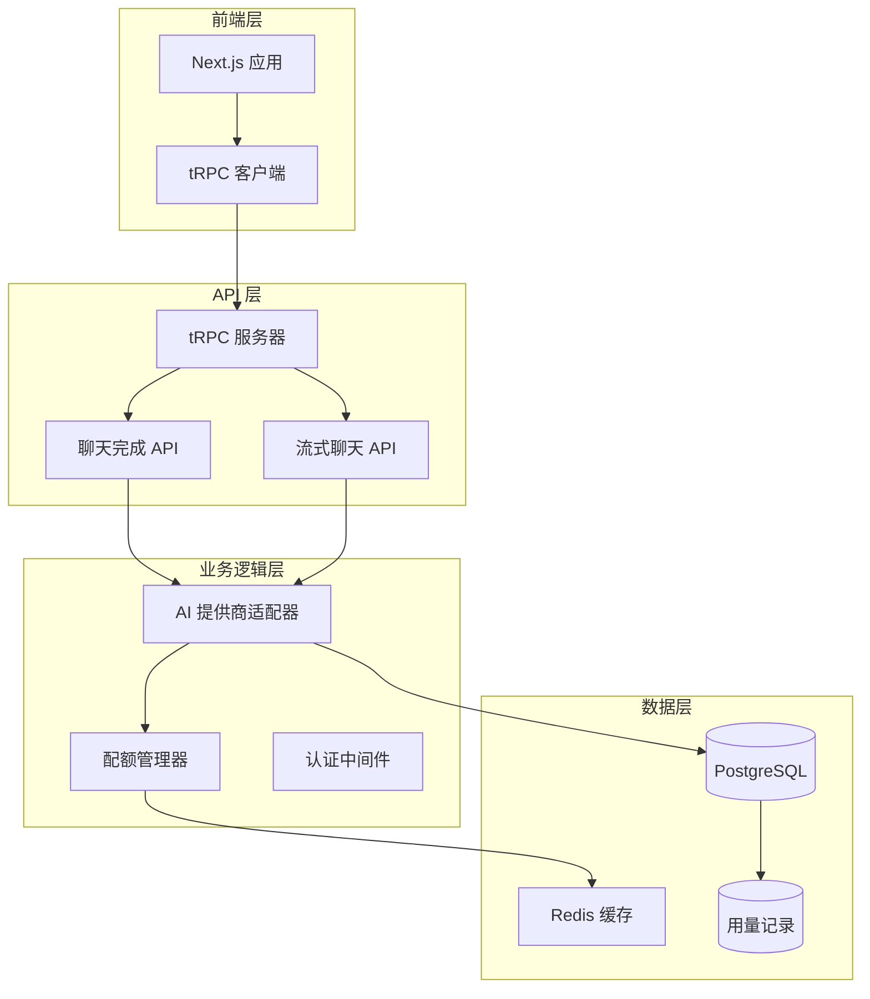
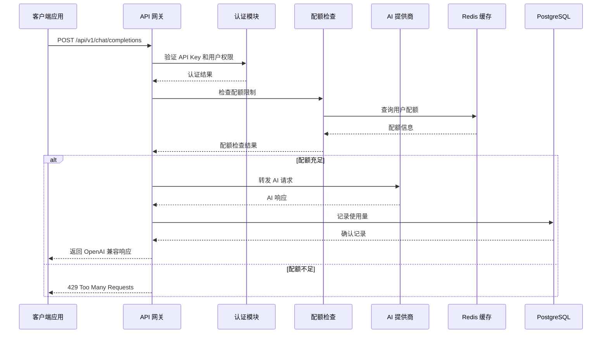
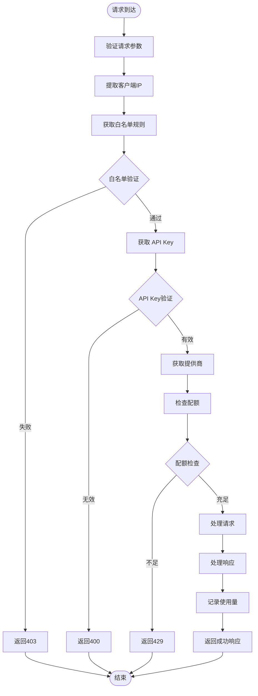
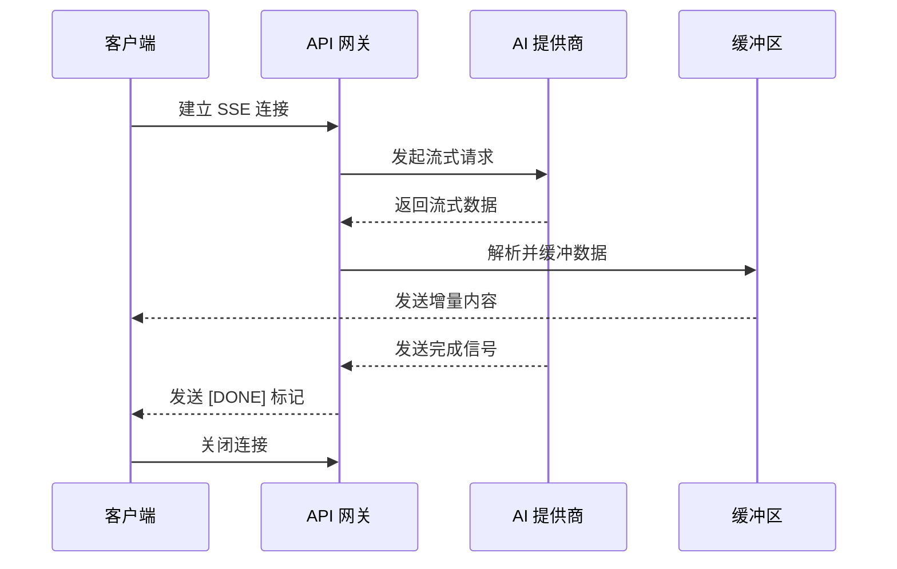
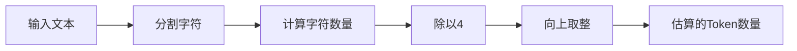
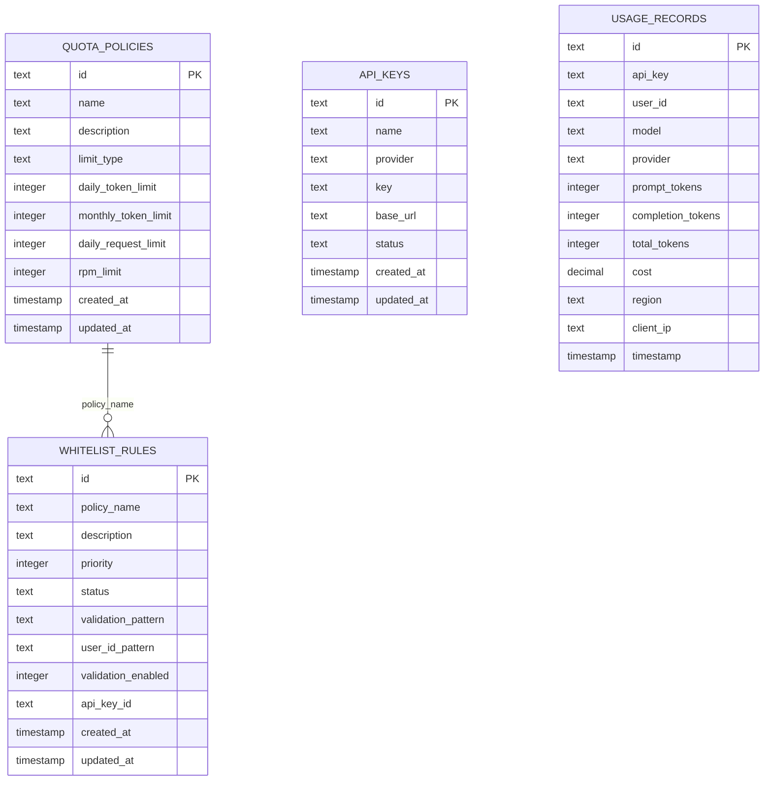
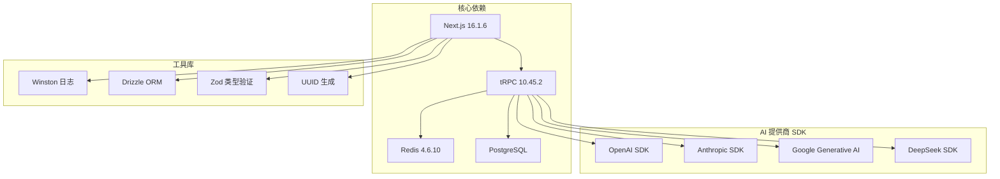
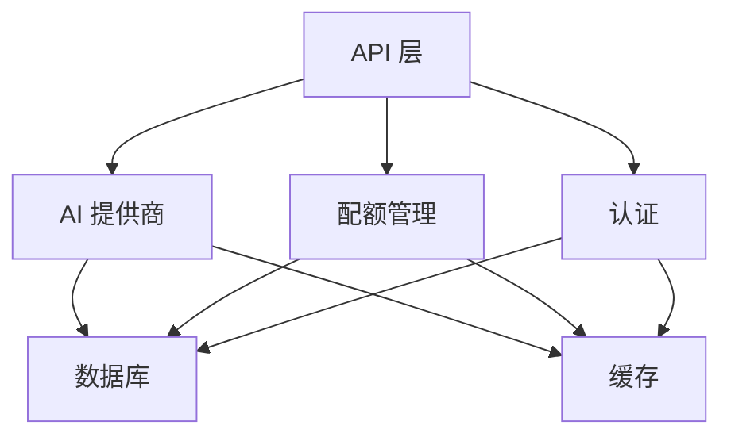

# OpenAI 兼容聊天完成 API

<cite>
**本文档引用的文件**
- [README.md](file://README.md)
- [package.json](file://package.json)
- [completions.ts](file://src/pages/api/ai/chat/completions.ts)
- [stream.ts](file://src/pages/api/ai/chat/stream.ts)
- [ai-providers.ts](file://src/lib/ai-providers.ts)
- [quota.ts](file://src/lib/quota.ts)
- [database.ts](file://src/lib/database.ts)
- [types.ts](file://src/lib/types.ts)
- [cors.ts](file://src/lib/cors.ts)
- [ip-region.ts](file://src/lib/ip-region.ts)
- [redis.ts](file://src/lib/redis.ts)
- [logger.ts](file://src/lib/logger.ts)
- [schema.ts](file://src/lib/schema.ts)
- [provider-utils.ts](file://src/lib/provider-utils.ts)
- [ai-api.md](file://docs/ai-api.md)
- [project-description.md](file://readme/project-description.md)
</cite>

## 目录
1. [简介](#简介)
2. [项目结构](#项目结构)
3. [核心组件](#核心组件)
4. [架构概览](#架构概览)
5. [详细组件分析](#详细组件分析)
6. [依赖关系分析](#依赖关系分析)
7. [性能考虑](#性能考虑)
8. [故障排除指南](#故障排除指南)
9. [结论](#结论)

## 简介

AIGate 是一个基于 Next.js 14 + tRPC + Redis 的智能 AI 网关管理系统，专门设计用于提供 OpenAI 兼容的聊天完成 API。该项目的核心目标是为多用户提供安全、可控的 AI 模型访问能力，支持配额管理和多模型代理。

### 主要特性

- **智能配额管理**：基于 Redis 的实时配额检查，支持 Token 和请求次数双重限制
- **多模型代理**：统一接入 OpenAI、Anthropic、Google、DeepSeek 等主流 AI 服务商
- **高性能架构**：tRPC 类型安全 API + Redis 缓存，毫秒级响应
- **安全认证**：NextAuth.js 身份验证，支持管理员账户动态配置
- **实时监控**：仪表板展示请求趋势、地区分布、IP 记录等关键指标

### OpenAI 兼容接口

项目提供了完整的 OpenAI 兼容聊天完成 API，支持标准的 `/v1/chat/completions` 端点，完全兼容 OpenAI SDK 和客户端库。

## 项目结构



**图表来源**
- [completions.ts](file://src/pages/api/ai/chat/completions.ts#L1-L350)
- [stream.ts](file://src/pages/api/ai/chat/stream.ts#L1-L184)
- [ai-providers.ts](file://src/lib/ai-providers.ts#L1-L759)

**章节来源**
- [README.md](file://README.md#L1-L83)
- [package.json](file://package.json#L1-L91)

## 核心组件

### API 网关层

系统实现了两个主要的 API 端点：

1. **聊天完成端点** (`/api/ai/chat/completions`)
   - 支持同步和流式响应
   - 完全兼容 OpenAI 标准格式
   - 内置配额检查和使用量记录

2. **流式聊天端点** (`/api/ai/chat/stream`)
   - 专用的 Server-Sent Events (SSE) 实现
   - 直接转发提供商的流式响应
   - 支持实时内容传输

### AI 提供商适配器

系统内置了六个主流 AI 提供商的支持：

| 提供商 | 模型支持 | 特殊功能 |
|--------|----------|----------|
| OpenAI | GPT-4, GPT-4o, GPT-3.5-turbo | 完整 OpenAI 功能 |
| Anthropic | Claude 3 Opus, Sonnet, Haiku | 安全过滤和内容控制 |
| Google | Gemini Pro, Gemini Ultra | 多模态支持 |
| DeepSeek | DeepSeek Chat, Coder | 代码优化 |
| Moonshot | Moonshot v1系列 | 长上下文窗口 |
| Spark | Spark v3.5, v3.0 | 国产模型 |

### 配额管理系统

采用多维度配额控制策略：

- **Token 限制模式**：基于每日/每月消耗的 Token 数量
- **请求次数限制模式**：基于每日请求次数
- **RPM 限制**：每分钟请求次数控制
- **用户级配额**：基于 `userId + apiKeyId` 组合的独立配额

**章节来源**
- [completions.ts](file://src/pages/api/ai/chat/completions.ts#L1-L350)
- [stream.ts](file://src/pages/api/ai/chat/stream.ts#L1-L184)
- [ai-providers.ts](file://src/lib/ai-providers.ts#L1-L759)
- [quota.ts](file://src/lib/quota.ts#L1-L327)

## 架构概览



**图表来源**
- [completions.ts](file://src/pages/api/ai/chat/completions.ts#L20-L131)
- [quota.ts](file://src/lib/quota.ts#L79-L200)
- [ai-providers.ts](file://src/lib/ai-providers.ts#L34-L100)

## 详细组件分析

### 聊天完成 API 组件

#### 请求处理流程



**图表来源**
- [completions.ts](file://src/pages/api/ai/chat/completions.ts#L20-L131)

#### 同步响应处理

同步响应遵循 OpenAI 标准格式，包含完整的响应头信息和使用统计：

| 字段 | 类型 | 描述 |
|------|------|------|
| id | string | 响应唯一标识符 |
| object | string | 对象类型（chat.completion） |
| created | number | 创建时间戳 |
| model | string | 使用的模型名称 |
| choices | array | 生成的选项数组 |
| usage | object | Token 使用统计（可选） |

#### 流式响应处理

流式响应使用 Server-Sent Events (SSE) 协议，逐字传输 AI 生成的内容：



**图表来源**
- [stream.ts](file://src/pages/api/ai/chat/stream.ts#L105-L175)

**章节来源**
- [completions.ts](file://src/pages/api/ai/chat/completions.ts#L133-L310)
- [stream.ts](file://src/pages/api/ai/chat/stream.ts#L88-L183)

### AI 提供商适配器组件

#### 提供商接口设计


**图表来源**
- [ai-providers.ts](file://src/lib/ai-providers.ts#L12-L27)

#### Token 估算算法

系统采用简单的字符计数算法进行 Token 估算：



**图表来源**
- [ai-providers.ts](file://src/lib/ai-providers.ts#L29-L32)

**章节来源**
- [ai-providers.ts](file://src/lib/ai-providers.ts#L34-L759)

### 配额管理系统组件

#### 配额检查流程


**图表来源**
- [quota.ts](file://src/lib/quota.ts#L79-L200)

#### Redis 缓存策略

系统使用 Redis 进行高性能缓存：

| 缓存键类型 | 键格式 | 过期时间 | 用途 |
|------------|--------|----------|------|
| 用户配额 | `user_quota:{userId}:{date}:{apiKey}` | 7天 | 每日Token使用量 |
| 用户请求 | `user_requests:{userId}:{date}:{apiKey}` | 7天 | 每日请求次数 |
| RPM限制 | `user_rpm:{userId}:{apiKey}:{minute}` | 2分钟 | 每分钟请求次数 |
| API Key缓存 | `api_keys:{provider}` | 1小时 | API Key缓存 |
| 策略缓存 | `policy:apiKey:{apiKeyId}` | 1小时 | 配额策略缓存 |

**章节来源**
- [quota.ts](file://src/lib/quota.ts#L1-L327)
- [redis.ts](file://src/lib/redis.ts#L17-L43)

### 数据库设计组件

#### 核心数据表结构



**图表来源**
- [schema.ts](file://src/lib/schema.ts#L28-L98)

**章节来源**
- [schema.ts](file://src/lib/schema.ts#L1-L162)
- [database.ts](file://src/lib/database.ts#L1-L692)

## 依赖关系分析

### 外部依赖关系



**图表来源**
- [package.json](file://package.json#L18-L68)

### 内部模块依赖



**图表来源**
- [completions.ts](file://src/pages/api/ai/chat/completions.ts#L1-L10)
- [ai-providers.ts](file://src/lib/ai-providers.ts#L1-L5)

**章节来源**
- [package.json](file://package.json#L1-L91)

## 性能考虑

### 缓存策略优化

1. **Redis 缓存层次**
   - API Key 缓存：1小时过期，减少数据库查询
   - 配额策略缓存：1小时过期，避免频繁策略计算
   - 用户配额缓存：7天过期，支持长期使用统计

2. **连接池管理**
   - Redis 连接池：自动重连和错误处理
   - 数据库连接池：优化并发查询性能
   - HTTP 客户端连接复用

### 响应时间优化

1. **异步处理**
   - 配额检查使用 Redis 异步查询
   - AI 请求转发采用流式处理
   - 日志记录异步写入

2. **内存管理**
   - 流式响应使用 ReadableStream
   - 避免大对象的重复创建
   - 及时释放临时资源

### 扩展性设计

1. **水平扩展**
   - 无状态设计，支持多实例部署
   - Redis 作为共享状态存储
   - 数据库支持主从复制

2. **负载均衡**
   - Nginx 反向代理
   - 多实例负载分发
   - 健康检查机制

## 故障排除指南

### 常见错误类型

| 错误代码 | 错误类型 | 可能原因 | 解决方案 |
|----------|----------|----------|----------|
| 400 | BAD_REQUEST | API Key 无效或提供商不支持 | 检查 API Key 配置和提供商支持 |
| 403 | FORBIDDEN | 用户不在白名单或校验失败 | 验证白名单规则和用户格式 |
| 429 | TOO_MANY_REQUESTS | 配额不足或RPM限制 | 检查配额使用情况，等待重置 |
| 500 | INTERNAL_SERVER_ERROR | 服务器内部错误 | 查看日志，检查依赖服务 |

### 调试工具

1. **日志分析**
   ```bash
   # 查看应用日志
   ./deploy.sh logs
   
   # 查看特定服务日志
   docker-compose logs -f api
   ```

2. **配额监控**
   ```bash
   # 检查用户配额使用
   curl http://localhost:3000/api/v1/quota/status
   
   # 查看 Redis 缓存状态
   redis-cli info memory
   ```

3. **API 测试**
   ```bash
   # 基本 API 测试
   curl -X POST http://localhost:3000/api/v1/chat/completions \
     -H "Content-Type: application/json" \
     -d '{"apiKeyId":"test","userId":"user","model":"gpt-3.5-turbo","messages":[{"role":"user","content":"Hello"}]}'
   ```

### 性能诊断

1. **Redis 性能**
   ```bash
   # 检查 Redis 性能指标
   redis-cli info stats
   
   # 查看慢查询日志
   redis-cli slowlog get 10
   ```

2. **数据库性能**
   ```bash
   # 分析慢查询
   EXPLAIN ANALYZE SELECT * FROM usage_records WHERE user_id = 'test';
   
   # 检查索引使用情况
   \d usage_records
   ```

**章节来源**
- [logger.ts](file://src/lib/logger.ts#L1-L184)
- [quota.ts](file://src/lib/quota.ts#L189-L199)

## 结论

AIGate 提供了一个完整、高性能的 OpenAI 兼容聊天完成 API 解决方案，具有以下优势：

### 技术优势

1. **完全兼容**：严格遵循 OpenAI API 标准，无缝集成现有应用
2. **高性能**：基于 Redis 缓存和流式处理，确保低延迟响应
3. **可扩展**：模块化设计支持多提供商接入和水平扩展
4. **安全可靠**：完善的认证、授权和审计机制

### 业务价值

1. **成本控制**：精细化的配额管理帮助控制 AI 使用成本
2. **合规保障**：白名单机制确保用户访问的合规性
3. **监控可视化**：实时仪表板提供全面的使用情况监控
4. **易于集成**：标准化的 API 接口降低集成复杂度

### 未来发展

1. **模型扩展**：持续支持新的 AI 模型和提供商
2. **功能增强**：添加更多高级功能如模型路由、A/B 测试等
3. **性能优化**：进一步提升并发处理能力和响应速度
4. **生态建设**：构建更丰富的插件和集成生态系统

AIGate 为需要在生产环境中安全、可控地使用 AI 模型的企业和个人开发者提供了一个可靠的基础设施解决方案。