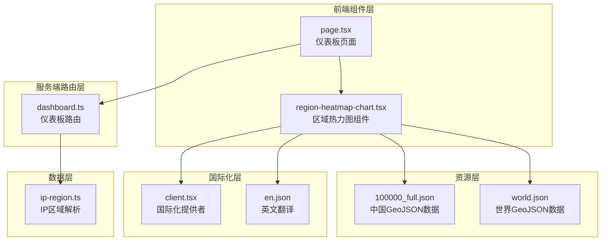
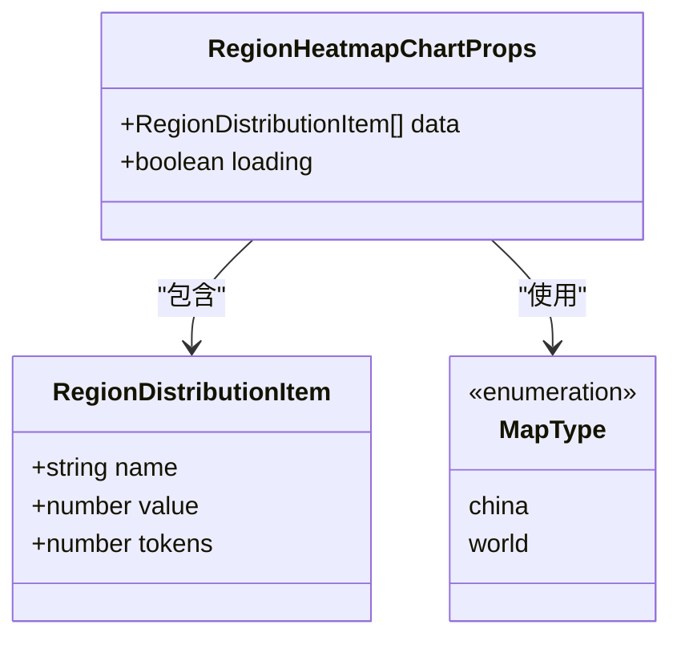
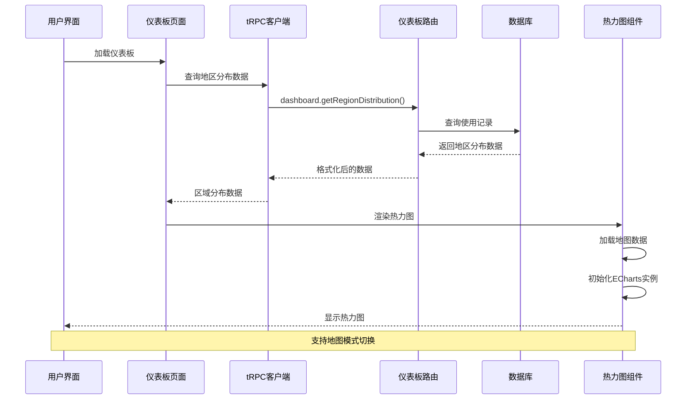
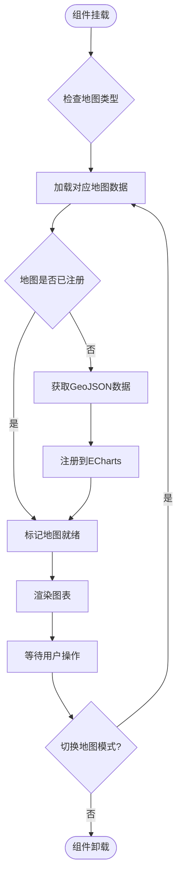
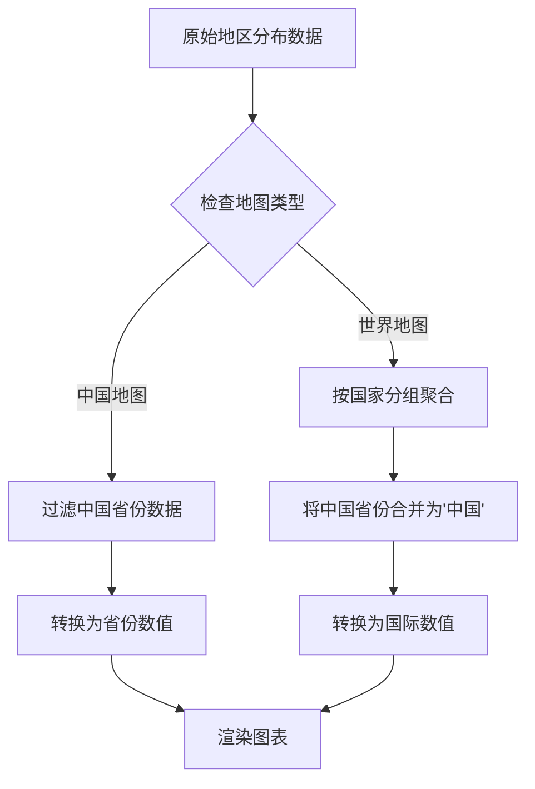
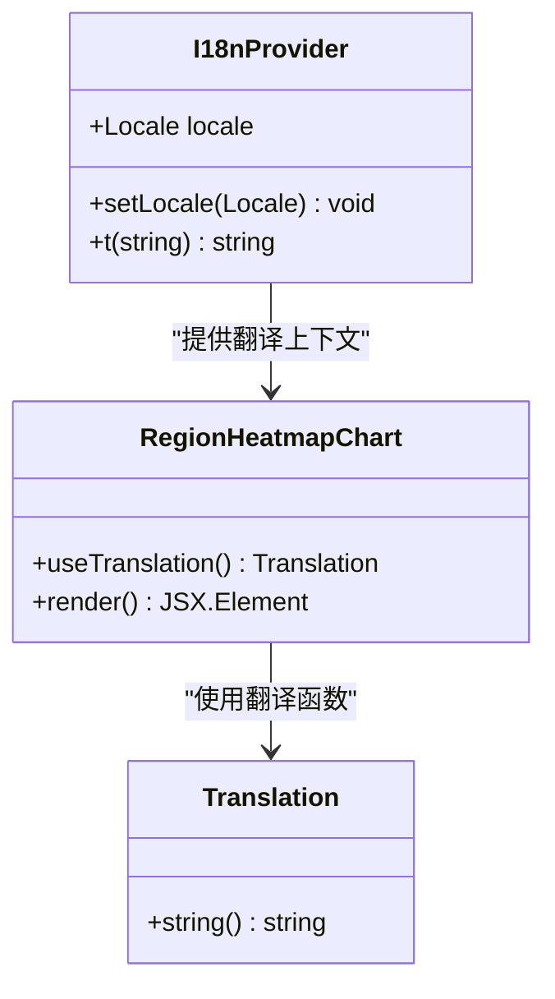
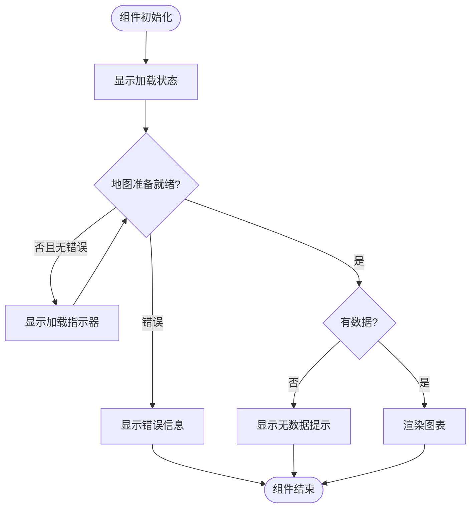
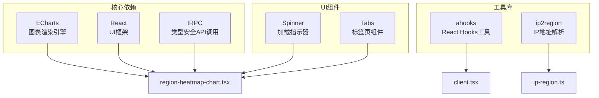

# 区域热力图图表

<cite>
**本文档引用的文件**
- [region-heatmap-chart.tsx](file://src/app/(dashboard)/components/region-heatmap-chart.tsx)
- [dashboard.ts](file://src/server/api/routers/dashboard.ts)
- [page.tsx](file://src/app/(dashboard)/page.tsx)
- [ip-region.ts](file://src/lib/ip-region.ts)
- [client.tsx](file://src/i18n/client.tsx)
- [en.json](file://src/messages/en.json)
- [100000_full.json](file://public/100000_full.json)
- [world.json](file://public/world.json)
</cite>

## 目录
1. [简介](#简介)
2. [项目结构](#项目结构)
3. [核心组件](#核心组件)
4. [架构概览](#架构概览)
5. [详细组件分析](#详细组件分析)
6. [依赖关系分析](#依赖关系分析)
7. [性能考虑](#性能考虑)
8. [故障排除指南](#故障排除指南)
9. [结论](#结论)

## 简介

区域热力图图表是 AIGate AI 网关管理系统中的一个关键可视化组件，用于展示全球或中国地区的请求分布情况。该组件基于 ECharts 库构建，能够实时显示不同地理区域的 API 请求频率和 Token 消耗量，为系统管理员提供直观的地理使用分布洞察。

该组件支持两种地图视图模式：
- **中国地图模式**：显示中国省级行政区的详细分布
- **世界地图模式**：显示全球各国的汇总分布

## 项目结构

区域热力图图表在项目中的组织结构如下：



**图表来源**
- [region-heatmap-chart.tsx:1-346](file://src/app/(dashboard)/components/region-heatmap-chart.tsx#L1-L346)
- [page.tsx:1-243](file://src/app/(dashboard)/page.tsx#L1-L243)
- [dashboard.ts:334-404](file://src/server/api/routers/dashboard.ts#L334-L404)

**章节来源**
- [region-heatmap-chart.tsx:1-346](file://src/app/(dashboard)/components/region-heatmap-chart.tsx#L1-L346)
- [page.tsx:1-243](file://src/app/(dashboard)/page.tsx#L1-L243)

## 核心组件

### 区域热力图组件架构

区域热力图组件采用 React 函数式组件设计，集成了多种高级功能：

#### 主要特性
- **动态地图切换**：支持中国地图和世界地图模式无缝切换
- **实时数据更新**：基于 ECharts 的动态数据渲染
- **多语言支持**：完整的国际化本地化支持
- **错误处理机制**：完善的地图数据加载错误处理
- **响应式设计**：自适应不同屏幕尺寸

#### 数据结构定义

组件使用以下接口定义数据结构：



**图表来源**
- [region-heatmap-chart.tsx:108-117](file://src/app/(dashboard)/components/region-heatmap-chart.tsx#L108-L117)

**章节来源**
- [region-heatmap-chart.tsx:108-117](file://src/app/(dashboard)/components/region-heatmap-chart.tsx#L108-L117)

## 架构概览

区域热力图图表的完整数据流架构如下：



**图表来源**
- [page.tsx:97-102](file://src/app/(dashboard)/page.tsx#L97-L102)
- [dashboard.ts:334-404](file://src/server/api/routers/dashboard.ts#L334-L404)
- [region-heatmap-chart.tsx:133-171](file://src/app/(dashboard)/components/region-heatmap-chart.tsx#L133-L171)

## 详细组件分析

### 组件实现细节

#### 地图数据管理

组件实现了智能的地图数据加载和缓存机制：



**图表来源**
- [region-heatmap-chart.tsx:133-171](file://src/app/(dashboard)/components/region-heatmap-chart.tsx#L133-L171)
- [region-heatmap-chart.tsx:215-307](file://src/app/(dashboard)/components/region-heatmap-chart.tsx#L215-L307)

#### 数据转换逻辑

组件根据不同的地图模式执行相应的数据转换：



**图表来源**
- [region-heatmap-chart.tsx:173-213](file://src/app/(dashboard)/components/region-heatmap-chart.tsx#L173-L213)

**章节来源**
- [region-heatmap-chart.tsx:133-307](file://src/app/(dashboard)/components/region-heatmap-chart.tsx#L133-L307)

### 国际化集成

组件深度集成了国际化系统，支持中英文双语显示：

#### 翻译键值映射
- `Dashboard.chinaMap`: "中国地图"
- `Dashboard.worldMap`: "世界地图"
- `Dashboard.regionDistribution`: "请求地区分布"

#### 国际化提供者配置



**图表来源**
- [client.tsx:53-93](file://src/i18n/client.tsx#L53-L93)
- [region-heatmap-chart.tsx:312-322](file://src/app/(dashboard)/components/region-heatmap-chart.tsx#L312-L322)

**章节来源**
- [client.tsx:1-102](file://src/i18n/client.tsx#L1-L102)
- [en.json:47-64](file://src/messages/en.json#L47-L64)

### 错误处理机制

组件实现了多层次的错误处理：



**图表来源**
- [region-heatmap-chart.tsx:325-339](file://src/app/(dashboard)/components/region-heatmap-chart.tsx#L325-L339)

**章节来源**
- [region-heatmap-chart.tsx:325-339](file://src/app/(dashboard)/components/region-heatmap-chart.tsx#L325-L339)

## 依赖关系分析

### 外部依赖

区域热力图组件依赖以下外部库：



**图表来源**
- [region-heatmap-chart.tsx:1-8](file://src/app/(dashboard)/components/region-heatmap-chart.tsx#L1-L8)
- [client.tsx:4](file://src/i18n/client.tsx#L4)

### 内部依赖关系

```mermaid
graph LR
subgraph "组件层次"
A[page.tsx<br/>仪表板页面]
B[region-heatmap-chart.tsx<br/>热力图组件]
C[dashboard.ts<br/>仪表板路由]
end
subgraph "数据流"
D[trpc.dashboard.getRegionDistribution<br/>数据获取]
E[RegionDistributionItem[]<br/>数据格式]
end
A --> B
A --> C
C --> D
D --> E
E --> B
```

**图表来源**
- [page.tsx:97-102](file://src/app/(dashboard)/page.tsx#L97-L102)
- [dashboard.ts:334-404](file://src/server/api/routers/dashboard.ts#L334-L404)

**章节来源**
- [page.tsx:97-102](file://src/app/(dashboard)/page.tsx#L97-L102)
- [dashboard.ts:334-404](file://src/server/api/routers/dashboard.ts#L334-L404)

## 性能考虑

### 优化策略

1. **地图数据缓存**
   - 已注册的地图数据会被缓存，避免重复加载
   - 使用 `loadedMaps` 状态跟踪已加载的地图类型

2. **内存管理**
   - 组件卸载时自动清理 ECharts 实例
   - 避免 SVG removeChild 冲突问题

3. **条件渲染**
   - 只在数据准备就绪时渲染图表
   - 提供加载状态和错误状态的占位符

4. **响应式设计**
   - 自动监听窗口大小变化并调整图表尺寸
   - 支持不同屏幕尺寸的适配

### 性能监控点

- **首次渲染时间**：从组件挂载到图表完全渲染的时间
- **数据更新延迟**：从数据变更到图表重新渲染的时间
- **内存占用**：ECharts 实例和地图数据的内存使用情况

## 故障排除指南

### 常见问题及解决方案

#### 地图数据加载失败

**症状**：显示"地图数据加载失败"提示

**可能原因**：
1. GeoJSON 文件路径错误
2. 网络连接问题
3. 服务器配置问题

**解决步骤**：
1. 检查 `/public/100000_full.json` 和 `/public/world.json` 文件是否存在
2. 验证文件访问权限
3. 检查网络连接和防火墙设置

#### 图表渲染异常

**症状**：图表无法正常显示或显示不完整

**可能原因**：
1. ECharts 实例冲突
2. DOM 元素未正确初始化
3. 数据格式不匹配

**解决步骤**：
1. 确保组件正确卸载和重新挂载
2. 检查 `chartRef` 是否正确绑定
3. 验证数据格式符合 `RegionDistributionItem` 接口

#### 国际化显示问题

**症状**：界面文本显示为键名而非实际内容

**可能原因**：
1. 翻译文件缺失
2. 翻译键值错误
3. 语言环境配置问题

**解决步骤**：
1. 检查 `src/messages/zh.json` 和 `src/messages/en.json` 文件
2. 验证翻译键值的正确性
3. 确认 `I18nProvider` 正确配置

**章节来源**
- [region-heatmap-chart.tsx:330-339](file://src/app/(dashboard)/components/region-heatmap-chart.tsx#L330-L339)

## 结论

区域热力图图表组件是 AIGate 系统中一个功能完整、设计精良的可视化组件。它成功地将复杂的地理数据可视化需求与现代前端技术栈相结合，提供了：

1. **强大的功能特性**：支持双模式地图切换、实时数据更新、完整的错误处理
2. **优秀的用户体验**：流畅的动画效果、响应式设计、多语言支持
3. **良好的架构设计**：清晰的组件分离、合理的数据流管理、可维护的代码结构
4. **完善的性能优化**：智能缓存机制、内存管理、条件渲染

该组件不仅满足了当前的功能需求，还为未来的扩展和定制提供了良好的基础。通过模块化的架构设计和清晰的接口定义，开发者可以轻松地对组件进行修改和增强，以适应不断变化的业务需求。