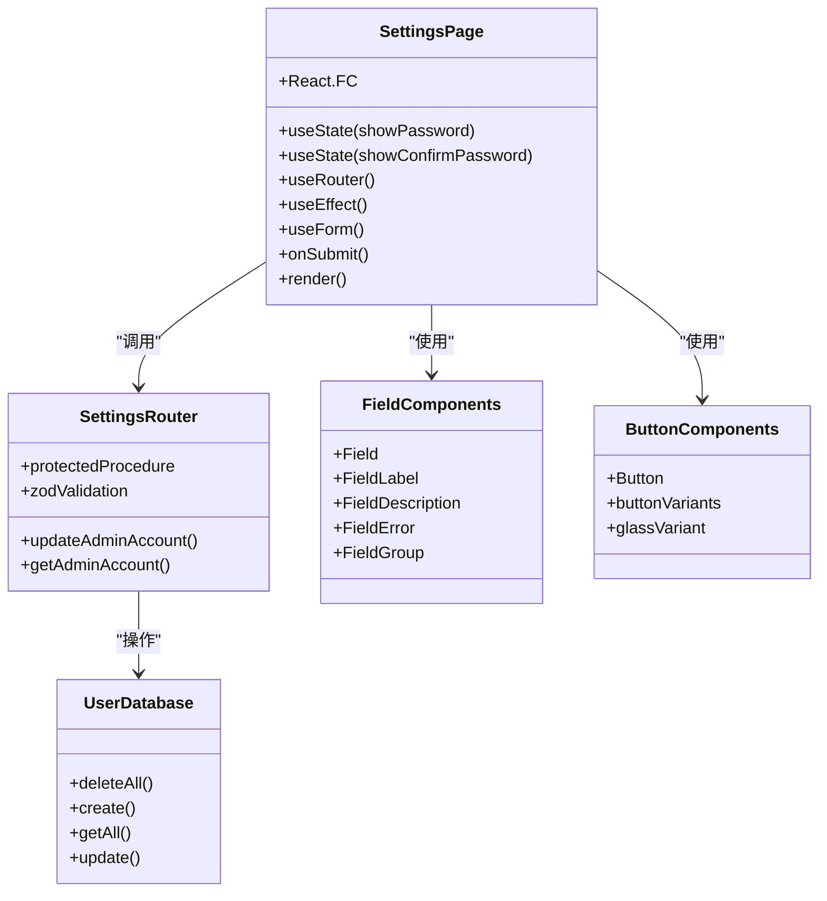
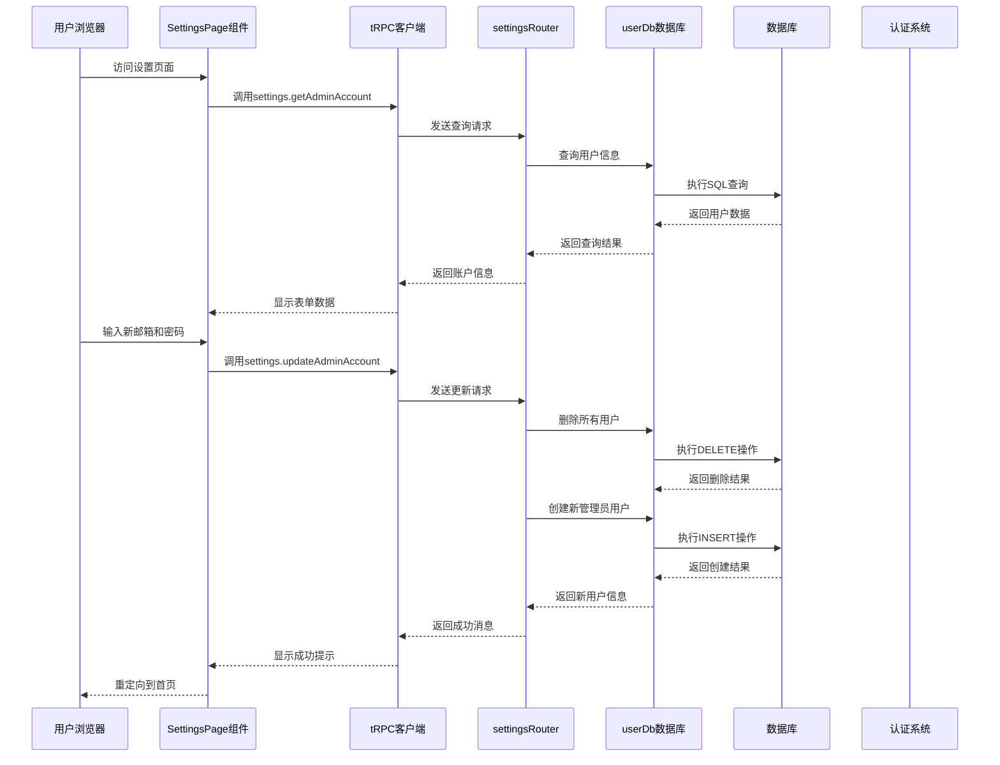
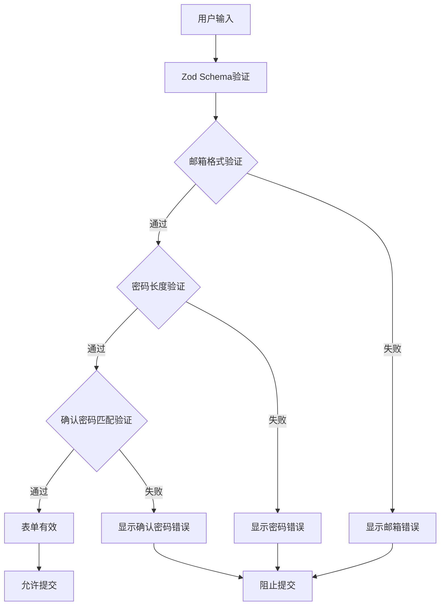
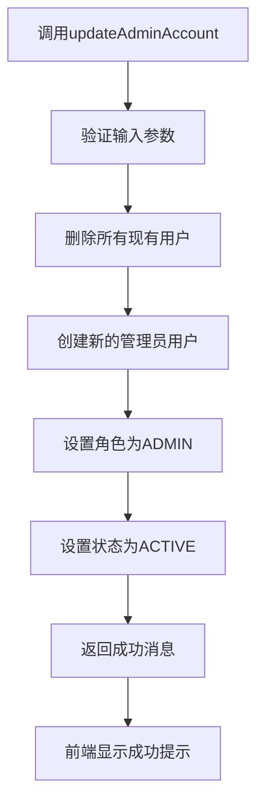
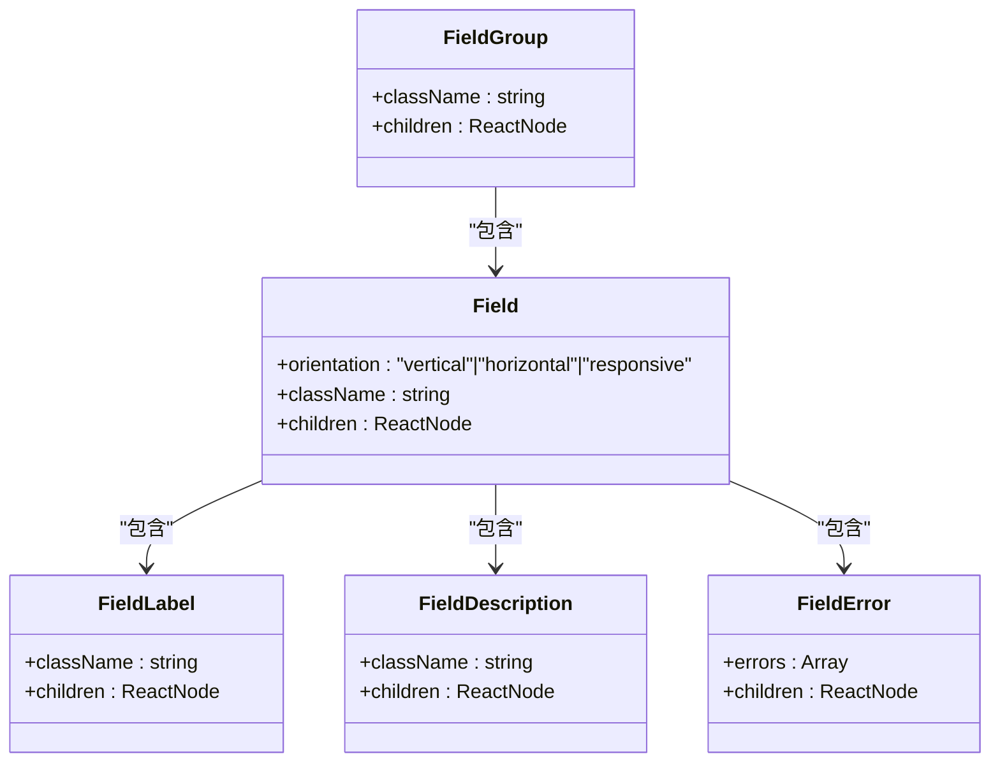
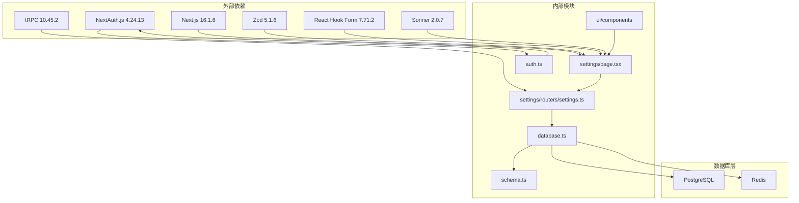

# 设置页面文档

<cite>
**本文档引用的文件**
- [src/app/settings/page.tsx](file://src/app/settings/page.tsx)
- [src/server/api/routers/settings.ts](file://src/server/api/routers/settings.ts)
- [src/lib/database.ts](file://src/lib/database.ts)
- [src/server/api/root.ts](file://src/server/api/root.ts)
- [src/server/api/trpc.ts](file://src/server/api/trpc.ts)
- [src/auth.ts](file://src/auth.ts)
- [src/components/ui/field.tsx](file://src/components/ui/field.tsx)
- [src/components/ui/button.tsx](file://src/components/ui/button.tsx)
- [src/components/dashboard-layout.tsx](file://src/components/dashboard-layout.tsx)
- [src/app/(dashboard)/layout.tsx](file://src/app/(dashboard)/layout.tsx)
- [src/lib/schema.ts](file://src/lib/schema.ts)
- [README.md](file://README.md)
- [package.json](file://package.json)
</cite>

## 目录
1. [简介](#简介)
2. [项目结构](#项目结构)
3. [核心组件](#核心组件)
4. [架构概览](#架构概览)
5. [详细组件分析](#详细组件分析)
6. [依赖关系分析](#依赖关系分析)
7. [性能考虑](#性能考虑)
8. [故障排除指南](#故障排除指南)
9. [结论](#结论)

## 简介

设置页面是 AIGate AI 网关管理系统中的核心管理功能之一，允许管理员动态修改管理员账户信息。该页面提供了直观的表单界面，支持邮箱地址和密码的实时验证与更新，采用现代化的 Liquid Glass 设计风格，确保良好的用户体验。

AIGate 是一个基于 Next.js 14 + tRPC + Redis 的智能 AI 网关管理系统，支持配额控制和多模型代理。设置页面作为管理后台的重要组成部分，为系统提供了灵活的账户管理能力。

## 项目结构

AIGate 项目采用模块化的架构设计，设置页面位于应用的路由系统中：

```mermaid
graph TB
subgraph "应用层"
A[src/app/settings/page.tsx]
B[src/app/(dashboard)/layout.tsx]
C[src/components/dashboard-layout.tsx]
end
subgraph "服务器端"
D[src/server/api/routers/settings.ts]
E[src/server/api/root.ts]
F[src/server/api/trpc.ts]
end
subgraph "数据层"
G[src/lib/database.ts]
H[src/lib/schema.ts]
end
subgraph "认证层"
I[src/auth.ts]
end
subgraph "UI组件"
J[src/components/ui/field.tsx]
K[src/components/ui/button.tsx]
end
A --> D
B --> C
D --> G
G --> H
F --> I
A --> J
A --> K
```

**图表来源**
- [src/app/settings/page.tsx](file://src/app/settings/page.tsx#L1-L202)
- [src/server/api/routers/settings.ts](file://src/server/api/routers/settings.ts#L1-L88)
- [src/lib/database.ts](file://src/lib/database.ts#L581-L692)

**章节来源**
- [src/app/settings/page.tsx](file://src/app/settings/page.tsx#L1-L202)
- [src/app/(dashboard)/layout.tsx](file://src/app/(dashboard)/layout.tsx#L1-L18)
- [src/components/dashboard-layout.tsx](file://src/components/dashboard-layout.tsx#L1-L191)

## 核心组件

设置页面由多个精心设计的组件构成，每个组件都有明确的职责和功能：

### 主要组件架构



**图表来源**
- [src/app/settings/page.tsx](file://src/app/settings/page.tsx#L29-L202)
- [src/server/api/routers/settings.ts](file://src/server/api/routers/settings.ts#L13-L88)
- [src/lib/database.ts](file://src/lib/database.ts#L681-L692)

### 数据流分析

设置页面的数据流遵循以下模式：

1. **初始化阶段**：页面加载时通过 tRPC 查询获取当前管理员账户信息
2. **用户交互**：用户在表单中输入新的邮箱和密码
3. **验证阶段**：前端使用 Zod 进行实时验证，后端进行二次验证
4. **提交处理**：通过 tRPC mutation 提交更新请求
5. **响应处理**：接收服务器响应并显示相应的提示信息

**章节来源**
- [src/app/settings/page.tsx](file://src/app/settings/page.tsx#L33-L69)
- [src/server/api/routers/settings.ts](file://src/server/api/routers/settings.ts#L14-L57)

## 架构概览

设置页面采用了完整的全栈架构设计，确保了安全性、可维护性和扩展性：



**图表来源**
- [src/app/settings/page.tsx](file://src/app/settings/page.tsx#L33-L69)
- [src/server/api/routers/settings.ts](file://src/server/api/routers/settings.ts#L14-L57)
- [src/lib/database.ts](file://src/lib/database.ts#L681-L692)

## 详细组件分析

### SettingsPage 组件分析

SettingsPage 是设置页面的核心组件，负责整个页面的渲染和交互逻辑：

#### 表单验证机制

组件使用 Zod 进行双重验证：



**图表来源**
- [src/app/settings/page.tsx](file://src/app/settings/page.tsx#L16-L25)

#### 状态管理策略

组件采用 React Hooks 进行状态管理：

| 状态类型 | 状态名称 | 用途 | 生命周期 |
|---------|----------|------|----------|
| 本地状态 | showPassword | 控制密码显示/隐藏 | 组件挂载 |
| 本地状态 | showConfirmPassword | 控制确认密码显示/隐藏 | 组件挂载 |
| 表单状态 | formState | 管理表单字段和验证状态 | 用户交互 |
| 查询状态 | accountInfo | 存储管理员账户信息 | 数据加载 |

**章节来源**
- [src/app/settings/page.tsx](file://src/app/settings/page.tsx#L30-L52)

### tRPC 路由器分析

settingsRouter 提供了两个核心 API 端点：

#### getAdminAccount 查询

该查询端点负责获取当前管理员账户信息：

```mermaid
flowchart TD
A[调用getAdminAccount] --> B[执行userDb.getAll()]
B --> C{检查用户列表}
C --> |为空| D[抛出NOT_FOUND错误]
C --> |非空| E[返回第一个用户信息]
E --> F[包含邮箱和姓名]
F --> G[返回给前端]
```

**图表来源**
- [src/server/api/routers/settings.ts](file://src/server/api/routers/settings.ts#L59-L86)

#### updateAdminAccount 变更

该变更端点实现了"删除所有用户并重建"的策略：



**图表来源**
- [src/server/api/routers/settings.ts](file://src/server/api/routers/settings.ts#L14-L57)

**章节来源**
- [src/server/api/routers/settings.ts](file://src/server/api/routers/settings.ts#L13-L88)

### 数据库操作分析

userDb 提供了完整的用户管理功能：

#### 用户操作方法

| 方法名 | 功能描述 | 参数类型 | 返回值 |
|--------|----------|----------|--------|
| deleteAll | 删除所有用户 | 无 | Promise<{deletedCount: number}> |
| create | 创建新用户 | NewUser | Promise<User> |
| getAll | 获取所有用户 | 无 | Promise<User[]> |
| update | 更新用户信息 | string, Partial<NewUser> | Promise<User\|null> |
| updatePassword | 更新用户密码 | string, string | Promise<boolean> |

**章节来源**
- [src/lib/database.ts](file://src/lib/database.ts#L681-L692)

### UI 组件集成

设置页面集成了多个自定义 UI 组件：

#### 字段组件体系



**图表来源**
- [src/components/ui/field.tsx](file://src/components/ui/field.tsx#L81-L244)

#### 按钮组件变体

按钮组件支持多种视觉变体：

| 变体类型 | 用途 | 特殊样式 |
|----------|------|----------|
| default | 主要操作按钮 | 使用主色调背景 |
| outline | 辅助操作按钮 | 边框样式，透明背景 |
| glass | 设置页面专用 | 半透明玻璃效果 |
| destructive | 危险操作按钮 | 红色警告样式 |

**章节来源**
- [src/components/ui/button.tsx](file://src/components/ui/button.tsx#L7-L35)

## 依赖关系分析

设置页面的依赖关系体现了清晰的分层架构：



**图表来源**
- [package.json](file://package.json#L18-L68)
- [src/app/settings/page.tsx](file://src/app/settings/page.tsx#L1-L13)
- [src/server/api/routers/settings.ts](file://src/server/api/routers/settings.ts#L1-L11)

### 核心依赖特性

| 依赖包 | 版本 | 主要功能 | 在设置页面中的作用 |
|--------|------|----------|-------------------|
| next | 16.1.6 | Web框架 | 提供页面路由和SSR |
| @trpc/server | 10.45.2 | 类型安全RPC | 后端API通信 |
| next-auth | 4.24.13 | 身份验证 | 管理员权限控制 |
| zod | 5.1.6 | 数据验证 | 表单验证 |
| react-hook-form | 7.71.2 | 表单管理 | 复杂表单状态 |
| sonner | 2.0.7 | 通知系统 | 用户反馈 |

**章节来源**
- [package.json](file://package.json#L18-L68)

## 性能考虑

设置页面在设计时充分考虑了性能优化：

### 加载性能优化

1. **懒加载策略**：仅在用户访问设置页面时加载相关代码
2. **缓存机制**：利用 tRPC 的查询缓存减少重复请求
3. **条件渲染**：使用 isLoading 状态避免不必要的重渲染

### 安全性能措施

1. **输入验证**：前后端双重验证确保数据安全
2. **权限控制**：使用 protectedProcedure 确保只有管理员可以访问
3. **最小权限原则**：只暴露必要的 API 端点

### 用户体验优化

1. **即时反馈**：使用 Sonner 提供实时操作反馈
2. **防抖处理**：避免频繁的 API 调用
3. **错误恢复**：优雅处理网络异常和服务器错误

## 故障排除指南

### 常见问题及解决方案

#### 表单验证错误

**问题症状**：表单提交时出现验证错误提示

**可能原因**：
- 邮箱格式不正确
- 密码长度不足6位
- 两次输入的密码不一致

**解决步骤**：
1. 检查邮箱格式是否符合标准
2. 确认密码长度至少6位
3. 验证两次输入的密码完全相同

#### 权限访问错误

**问题症状**：无法访问设置页面或收到权限错误

**可能原因**：
- 用户未登录
- 用户不是管理员角色
- 会话过期

**解决步骤**：
1. 确认用户已登录系统
2. 验证用户角色为 ADMIN
3. 重新登录系统

#### 数据库操作失败

**问题症状**：更新管理员账户信息时出现数据库错误

**可能原因**：
- 数据库连接异常
- 用户表结构问题
- 并发访问冲突

**解决步骤**：
1. 检查数据库连接状态
2. 验证用户表结构完整性
3. 重试操作或联系系统管理员

**章节来源**
- [src/app/settings/page.tsx](file://src/app/settings/page.tsx#L55-L62)
- [src/server/api/routers/settings.ts](file://src/server/api/routers/settings.ts#L46-L56)

### 调试技巧

1. **浏览器开发者工具**：检查网络请求和响应
2. **服务器日志**：查看 tRPC 和数据库操作日志
3. **状态检查**：使用 React DevTools 检查组件状态
4. **API 测试**：直接调用 tRPC 端点验证功能

## 结论

设置页面作为 AIGate 系统的核心管理功能，展现了现代 Web 应用的最佳实践。通过采用 tRPC 类型安全架构、严格的权限控制和优雅的 UI 设计，该页面为管理员提供了高效、安全的账户管理体验。

### 主要优势

1. **安全性**：完整的身份验证和授权机制
2. **可用性**：直观的用户界面和即时反馈
3. **可维护性**：清晰的代码结构和模块化设计
4. **扩展性**：灵活的架构支持未来功能扩展

### 技术亮点

- **类型安全**：端到端的 TypeScript 支持
- **实时验证**：前端和后端双重验证机制
- **现代化设计**：Liquid Glass 设计语言
- **性能优化**：高效的加载和渲染策略

设置页面不仅满足了当前的功能需求，还为系统的长期发展奠定了坚实的技术基础。其设计思路和实现方案为类似的管理后台开发提供了优秀的参考模板。