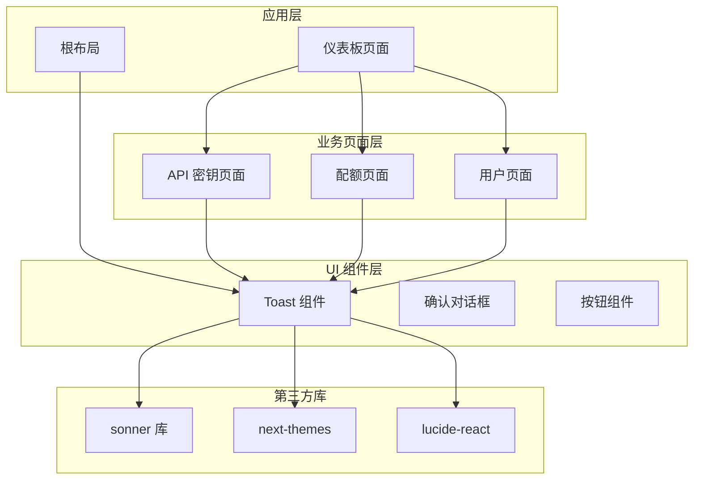
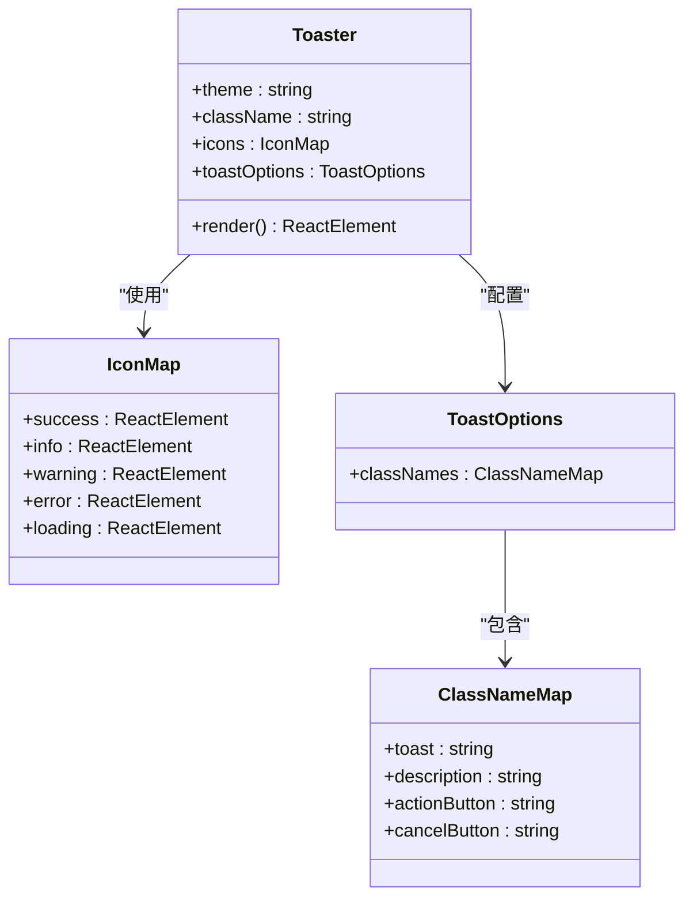
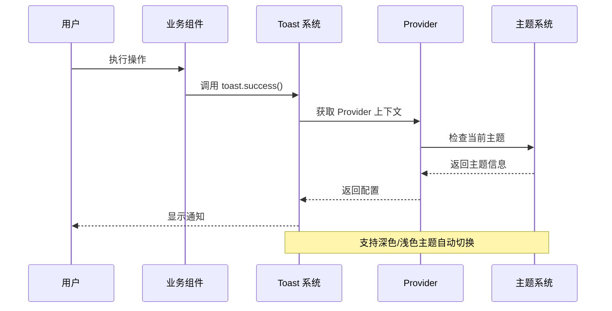
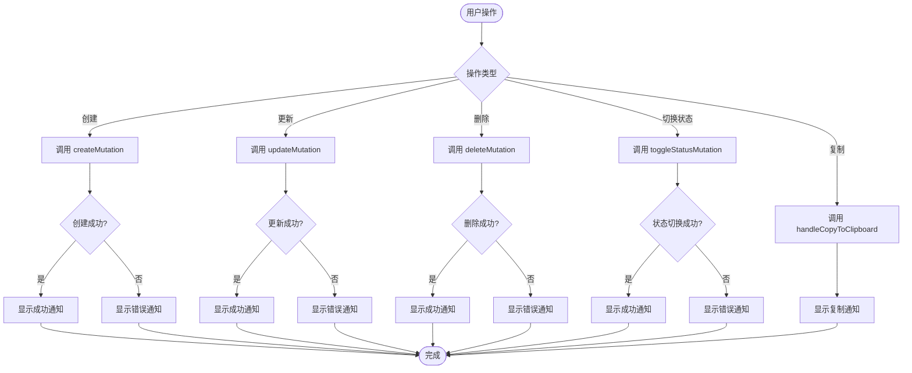
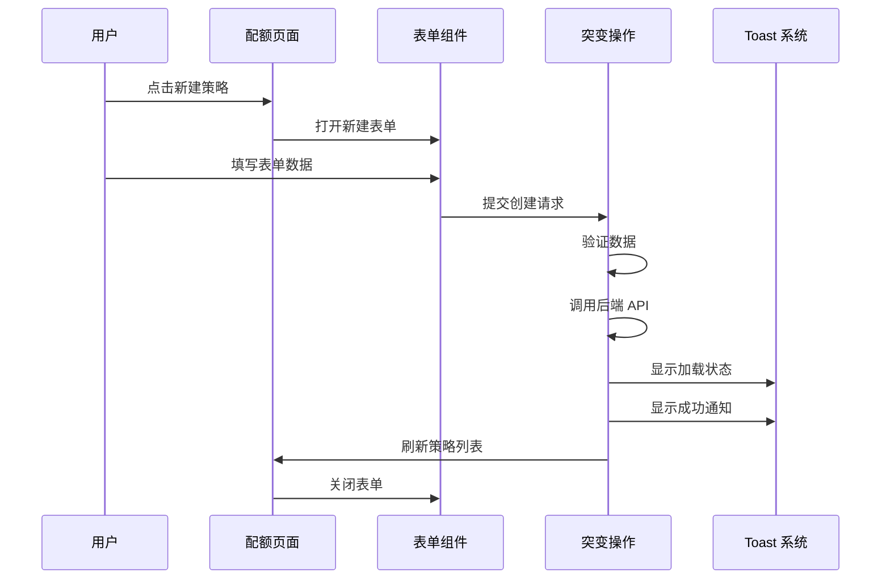
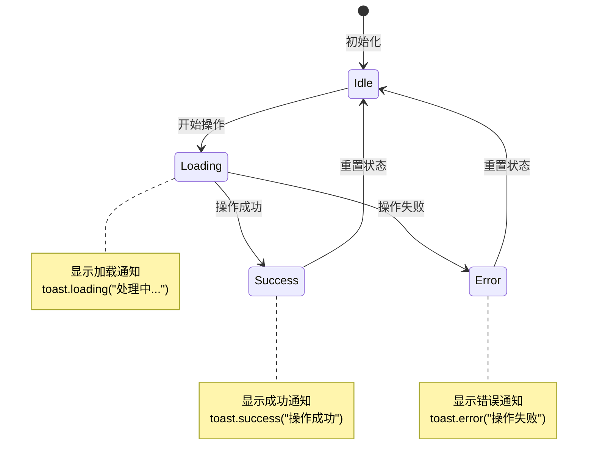
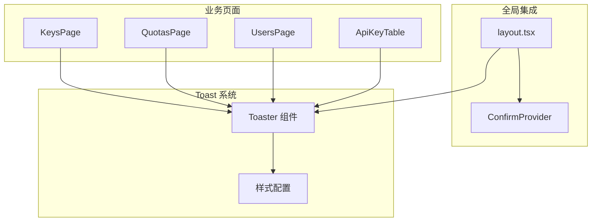

# Toast 通知系统

<cite>
**本文档引用的文件**
- [src/components/ui/sonner.tsx](file://src/components/ui/sonner.tsx)
- [src/app/layout.tsx](file://src/app/layout.tsx)
- [src/app/(dashboard)/keys/page.tsx](file://src/app/(dashboard)/keys/page.tsx)
- [src/app/(dashboard)/keys/components/api-key-table.tsx](file://src/app/(dashboard)/keys/components/api-key-table.tsx)
- [src/app/(dashboard)/quotas/page.tsx](file://src/app/(dashboard)/quotas/page.tsx)
- [src/app/(dashboard)/users/page.tsx](file://src/app/(dashboard)/users/page.tsx)
- [src/components/ui/confirm.tsx](file://src/components/ui/confirm.tsx)
- [package.json](file://package.json)
- [tailwind.config.js](file://tailwind.config.js)
</cite>

## 目录
1. [简介](#简介)
2. [项目结构](#项目结构)
3. [核心组件](#核心组件)
4. [架构概览](#架构概览)
5. [详细组件分析](#详细组件分析)
6. [依赖关系分析](#依赖关系分析)
7. [性能考虑](#性能考虑)
8. [故障排除指南](#故障排除指南)
9. [结论](#结论)

## 简介

Toast 通知系统是 AIGate AI 网关管理系统中的重要用户体验组件，基于 sonner 库构建，提供了轻量级、美观的通知提示功能。该系统在管理后台的各种操作中发挥着关键作用，包括 API 密钥管理、配额策略管理和用户白名单管理等场景。

系统采用现代化的设计理念，支持深色/浅色主题自动切换，提供多种通知类型（成功、错误、警告、信息、加载状态），并在整个应用中保持一致的视觉体验。

## 项目结构

AIGate 项目采用了模块化的架构设计，Toast 通知系统作为 UI 组件的一部分，被精心集成到应用的整体结构中：



**图表来源**
- [src/app/layout.tsx](file://src/app/layout.tsx#L1-L61)
- [src/components/ui/sonner.tsx](file://src/components/ui/sonner.tsx#L1-L46)

**章节来源**
- [src/app/layout.tsx](file://src/app/layout.tsx#L1-L61)
- [src/components/ui/sonner.tsx](file://src/components/ui/sonner.tsx#L1-L46)

## 核心组件

### Toaster 主组件

Toaster 是 Toast 系统的核心组件，负责渲染和管理所有通知消息。它基于 sonner 库构建，集成了主题系统和图标定制功能。



**图表来源**
- [src/components/ui/sonner.tsx](file://src/components/ui/sonner.tsx#L15-L43)

### 主题集成

系统通过 next-themes 实现深色/浅色主题的自动检测和切换，确保 Toast 在不同主题下都能保持良好的可读性和视觉效果。

**章节来源**
- [src/components/ui/sonner.tsx](file://src/components/ui/sonner.tsx#L1-L46)
- [src/app/layout.tsx](file://src/app/layout.tsx#L1-L61)

## 架构概览

Toast 通知系统在整个应用架构中的位置和交互关系如下：



**图表来源**
- [src/app/layout.tsx](file://src/app/layout.tsx#L53-L56)
- [src/components/ui/sonner.tsx](file://src/components/ui/sonner.tsx#L15-L17)

## 详细组件分析

### API 密钥管理页面

API 密钥管理页面是 Toast 系统使用最频繁的场景之一，涵盖了完整的 CRUD 操作通知：



**图表来源**
- [src/app/(dashboard)/keys/page.tsx](file://src/app/(dashboard)/keys/page.tsx#L16-L51)
- [src/app/(dashboard)/keys/components/api-key-table.tsx](file://src/app/(dashboard)/keys/components/api-key-table.tsx#L24-L27)

### 配额策略管理页面

配额策略管理页面展示了更复杂的业务逻辑处理流程：



**图表来源**
- [src/app/(dashboard)/quotas/page.tsx](file://src/app/(dashboard)/quotas/page.tsx#L33-L56)

### 用户白名单管理页面

用户白名单管理页面体现了复杂的状态管理和错误处理机制：



**图表来源**
- [src/app/(dashboard)/users/page.tsx](file://src/app/(dashboard)/users/page.tsx#L33-L78)

**章节来源**
- [src/app/(dashboard)/keys/page.tsx](file://src/app/(dashboard)/keys/page.tsx#L1-L141)
- [src/app/(dashboard)/keys/components/api-key-table.tsx](file://src/app/(dashboard)/keys/components/api-key-table.tsx#L1-L175)
- [src/app/(dashboard)/quotas/page.tsx](file://src/app/(dashboard)/quotas/page.tsx#L1-L147)
- [src/app/(dashboard)/users/page.tsx](file://src/app/(dashboard)/users/page.tsx#L1-L165)

## 依赖关系分析

### 外部依赖

Toast 系统依赖于多个关键的第三方库：

```mermaid
graph LR
subgraph "核心依赖"
Sonner[sonner@2.0.7]
Theme[next-themes@0.4.6]
Icons[lucide-react@0.575.0]
end
subgraph "UI 库"
Radix[Radix UI 组件]
Tailwind[Tailwind CSS]
end
subgraph "应用集成"
Toaster[Toaster 组件]
Layout[根布局]
Pages[业务页面]
end
Toaster --> Sonner
Toaster --> Theme
Toaster --> Icons
Layout --> Toaster
Pages --> Toaster
Sonner --> Radix
Theme --> Tailwind
```

**图表来源**
- [package.json](file://package.json#L61-L61)
- [package.json](file://package.json#L53-L53)
- [package.json](file://package.json#L49-L49)

### 内部依赖关系

Toast 系统与应用其他部分的集成关系：



**图表来源**
- [src/app/layout.tsx](file://src/app/layout.tsx#L4-L5)
- [src/components/ui/sonner.tsx](file://src/components/ui/sonner.tsx#L1-L11)

**章节来源**
- [package.json](file://package.json#L1-L91)
- [src/app/layout.tsx](file://src/app/layout.tsx#L1-L61)
- [src/components/ui/sonner.tsx](file://src/components/ui/sonner.tsx#L1-L46)

## 性能考虑

### 渲染优化

Toast 系统在性能方面采用了多项优化措施：

1. **按需渲染**：只有在需要时才渲染 Toast 组件
2. **主题缓存**：使用 next-themes 的主题缓存机制
3. **图标优化**：使用轻量级的 lucide-react 图标
4. **样式隔离**：通过 CSS 类名实现样式隔离

### 内存管理

系统实现了有效的内存管理策略：

- 自动清理已完成的通知
- 避免重复渲染相同内容
- 合理的生命周期管理

## 故障排除指南

### 常见问题及解决方案

#### 1. Toast 不显示问题

**症状**：调用 toast 函数但没有显示任何通知

**可能原因**：
- ConfirmProvider 未正确包装应用
- 主题系统配置错误
- 样式文件未正确加载

**解决方案**：
```typescript
// 确保在根布局中正确包装
export default function RootLayout({
  children,
}: {
  children: React.ReactNode;
}) {
  return (
    <html lang="zh-CN">
      <body>
        <Toaster />
        <ConfirmProvider>
          <TRPCProvider>
            {children}
          </TRPCProvider>
        </ConfirmProvider>
      </body>
    </html>
  );
}
```

#### 2. 主题显示异常

**症状**：Toast 在深色模式下难以阅读

**解决方案**：
检查 Tailwind CSS 配置中的颜色变量是否正确设置。

#### 3. 图标显示问题

**症状**：Toast 中的图标不显示或显示异常

**解决方案**：
确认 lucide-react 库版本兼容性，并检查图标导入路径。

**章节来源**
- [src/app/layout.tsx](file://src/app/layout.tsx#L53-L56)
- [src/components/ui/sonner.tsx](file://src/components/ui/sonner.tsx#L15-L17)

## 结论

AIGate 的 Toast 通知系统是一个设计精良、功能完善的用户体验组件。它成功地将现代化的设计理念与实用的功能需求相结合，为用户提供了一致且优雅的通知体验。

### 主要优势

1. **设计理念先进**：基于最新的 UI 设计原则，提供优秀的视觉体验
2. **集成度高**：与应用的整体架构无缝集成
3. **扩展性强**：支持多种通知类型和自定义配置
4. **性能优秀**：经过优化的渲染和内存管理
5. **维护友好**：清晰的代码结构和文档

### 技术亮点

- **主题系统集成**：完美支持深色/浅色主题自动切换
- **图标定制**：使用高质量的 lucide-react 图标
- **样式系统**：基于 Tailwind CSS 4 的现代化样式架构
- **响应式设计**：适配各种屏幕尺寸和设备

该 Toast 系统为 AIGate AI 网关管理系统的用户交互提供了坚实的基础，是整个应用用户体验的重要组成部分。