# UI 组件系统

<cite>
**本文引用的文件**
- [src/components/ui/button.tsx](file://src/components/ui/button.tsx)
- [src/components/ui/input.tsx](file://src/components/ui/input.tsx)
- [src/components/ui/textarea.tsx](file://src/components/ui/textarea.tsx)
- [src/components/ui/dialog.tsx](file://src/components/ui/dialog.tsx)
- [src/components/ui/table.tsx](file://src/components/ui/table.tsx)
- [src/components/ui/data-table.tsx](file://src/components/ui/data-table.tsx)
- [src/components/ui/pagination.tsx](file://src/components/ui/pagination.tsx)
- [src/components/ui/select.tsx](file://src/components/ui/select.tsx)
- [src/components/ui/checkbox.tsx](file://src/components/ui/checkbox.tsx)
- [src/components/ui/label.tsx](file://src/components/ui/label.tsx)
- [src/components/ui/slider.tsx](file://src/components/ui/slider.tsx)
- [src/components/ui/tabs.tsx](file://src/components/ui/tabs.tsx)
- [src/components/ui/sonner.tsx](file://src/components/ui/sonner.tsx)
- [src/components/ui/popover.tsx](file://src/components/ui/popover.tsx)
- [src/components/ui/calendar.tsx](file://src/components/ui/calendar.tsx)
- [src/components/date-picker-with-range.tsx](file://src/components/date-picker-with-range.tsx)
- [src/components/date-range-picker.tsx](file://src/components/date-range-picker.tsx)
- [src/app/(dashboard)/users/components/whitelist-rule-form.tsx](file://src/app/(dashboard)/users/components/whitelist-rule-form.tsx)
- [src/app/(dashboard)/users/components/whitelist-rule-table.tsx](file://src/app/(dashboard)/users/components/whitelist-rule-table.tsx)
- [src/app/(dashboard)/components/usage-trend-chart.tsx](file://src/app/(dashboard)/components/usage-trend-chart.tsx)
- [src/app/(dashboard)/components/activity-item.tsx](file://src/app/(dashboard)/components/activity-item.tsx)
- [src/app/(dashboard)/components/recent-ip-requests.tsx](file://src/app/(dashboard)/components/recent-ip-requests.tsx)
- [src/app/(dashboard)/components/model-distribution-chart.tsx](file://src/app/(dashboard)/components/model-distribution-chart.tsx)
- [src/app/(dashboard)/components/region-heatmap-chart.tsx](file://src/app/(dashboard)/components/region-heatmap-chart.tsx)
- [src/app/(dashboard)/components/stat-card.tsx](file://src/app/(dashboard)/components/stat-card.tsx)
- [src/app/(dashboard)/page.tsx](file://src/app/(dashboard)/page.tsx)
- [src/app/(dashboard)/layout.tsx](file://src/app/(dashboard)/layout.tsx)
- [src/app/globals.css](file://src/app/globals.css)
- [src/components/dashboard-layout.tsx](file://src/components/dashboard-layout.tsx)
- [src/lib/utils.ts](file://src/lib/utils.ts)
- [src/lib/date.ts](file://src/lib/date.ts)
- [tailwind.config.js](file://tailwind.config.js)
- [postcss.config.mjs](file://postcss.config.mjs)
- [package.json](file://package.json)
- [components.json](file://components.json)
- [src/app/settings/page.tsx](file://src/app/settings/page.tsx)
- [src/app/login/page.tsx](file://src/app/login/page.tsx)
- [public/100000_full.json](file://public/100000_full.json)
- [readme/ui-rule.md](file://readme/ui-rule.md)
</cite>

## 更新摘要
**所做更改**
- 新增 DatePickerWithRange 和 Calendar 组件，基于 react-day-picker 实现现代化日期选择功能
- 替换 CustomDateRangePicker 为新的 DatePickerWithRange 组件，提供更好的用户体验
- 改进 Button 组件样式系统，新增 glass 变体和液体玻璃效果
- 更新 utils.ts 格式化，简化类名合并函数实现
- 增强仪表板日期选择器集成，支持双日期选择器组合使用
- 新增液体玻璃样式系统，提供统一的玻璃质感设计语言
- 增强深色模式支持，优化所有组件的深色模式适配

## 目录
1. [简介](#简介)
2. [项目结构](#项目结构)
3. [核心组件](#核心组件)
4. [架构总览](#架构总览)
5. [组件详解](#组件详解)
6. [液体玻璃样式系统](#液体玻璃样式系统)
7. [深色模式主题检测机制](#深色模式主题检测机制)
8. [样式标准化与迁移](#样式标准化与迁移)
9. [密码可见性切换按钮实现](#密码可见性切换按钮实现)
10. [日期选择器组件集成](#日期选择器组件集成)
11. [区域热力图数据源优化](#区域热力图数据源优化)
12. [依赖关系分析](#依赖关系分析)
13. [性能与可访问性](#性能与可访问性)
14. [样式系统与主题定制](#样式系统与主题定制)
15. [测试策略与文档生成](#测试策略与文档生成)
16. [扩展与集成指南](#扩展与集成指南)
17. [故障排查](#故障排查)
18. [结论](#结论)

## 简介
本文件为 AIGate 的 UI 组件系统提供系统化、可操作的组件文档。重点覆盖基础 UI 组件（Button、Input、Textarea、Dialog、Table、Select、Checkbox、Label、Pagination、Slider、Tabs、Sonner、Popover）的设计理念、属性接口、事件与状态管理、样式系统（Tailwind CSS 集成、CSS 变量主题、深色模式支持）、可访问性支持（键盘导航、屏幕阅读器兼容、语义化标记），以及组件组合、样式覆盖、动画效果的最佳实践。同时给出测试策略、文档生成与版本管理建议，并提供扩展机制与第三方集成指导。

**更新** 本次更新重点关注新增的 DatePickerWithRange 和 Calendar 组件，以及 Button 组件样式系统的全面升级。新增的 DatePickerWithRange 组件基于 react-day-picker 提供现代化的日期范围选择功能，支持范围选择、多月显示和国际化支持。Calendar 组件作为 DatePickerWithRange 的基础组件，提供了完整的日历界面和交互功能。Button 组件新增 glass 变体和液体玻璃效果，提供更丰富的视觉层次。utils.ts 文件的格式化简化了类名合并函数的实现，提升了代码可读性。液体玻璃样式系统为整个组件库提供了统一的视觉设计语言。

## 项目结构
UI 组件集中于 src/components/ui 目录，采用"原子化 + 组合"的分层组织方式：基础输入控件（Button、Input、Textarea、Checkbox、Label、Slider、Tabs、Popover）、复合容器（Dialog、Select、Pagination）、数据展示（Table、DataTable）、通知系统（Sonner）、日期选择（Calendar、DatePickerWithRange）。样式通过 Tailwind v4 与 CSS 变量实现主题化与深色模式支持；工具函数统一合并类名，确保样式一致性与可维护性。

```mermaid
graph TB
subgraph "UI 组件层"
BTN["Button<br/>按钮"]
INP["Input<br/>输入框"]
TXT["Textarea<br/>文本域"]
CHK["Checkbox<br/>复选框"]
LBL["Label<br/>标签"]
SLD["Slider<br/>滑块"]
TAB["Tabs<br/>标签页"]
DLG["Dialog<br/>对话框"]
SEL["Select<br/>选择器"]
PAG["Pagination<br/>分页"]
TBL["Table<br/>表格基元"]
DTBL["DataTable<br/>数据表"]
SON["Sonner<br/>通知"]
POP["Popover<br/>弹出框"]
CAL["Calendar<br/>日历"]
DRWR["DatePickerWithRange<br/>日期范围选择器"]
DRP["DateRangePicker<br/>日期范围选择器"]
END
subgraph "业务组件层"
WLF["WhitelistRuleForm<br/>白名单规则表单"]
WLRT["WhitelistRuleTable<br/>白名单规则表"]
UT["UsageTrendChart<br/>使用趋势图表"]
AI["ActivityItem<br/>活动项"]
RIR["RecentIpRequests<br/>最近IP请求"]
MDC["ModelDistributionChart<br/>模型分布图"]
RHC["RegionHeatmapChart<br/>区域热力图"]
SC["StatCard<br/>统计卡片"]
HOME["HomePage<br/>仪表板首页"]
END
subgraph "样式与工具"
UTIL["utils/cn<br/>类名合并"]
TW["Tailwind v4<br/>CSS 变量主题"]
CSS["globals.css<br/>液体玻璃样式"]
DARK["深色模式检测<br/>系统偏好监听"]
PWD["密码可见性切换<br/>绝对定位与图标"]
DATA["本地数据源<br/>public/100000_full.json"]
DATE["日期工具<br/>src/lib/date.ts"]
GLASS["液体玻璃系统<br/>统一设计语言"]
END
BTN --> UTIL
INP --> UTIL
TXT --> UTIL
CHK --> UTIL
LBL --> UTIL
SLD --> UTIL
TAB --> UTIL
DLG --> UTIL
SEL --> UTIL
PAG --> UTIL
TBL --> UTIL
DTBL --> TBL
DTBL --> PAG
SON --> UTIL
POP --> UTIL
CAL --> UTIL
DRWR --> CAL
DRWR --> POP
DRP --> POP
WLF --> INP
WLF --> TXT
WLRT --> DTBL
UT --> DARK
AI --> DARK
RIR --> DARK
MDC --> DARK
RHC --> DATA
SC --> DARK
HOME --> DRWR
HOME --> DRP
HOME --> DATE
BTN --> TW
INP --> TW
TXT --> TW
CHK --> TW
LBL --> TW
SLD --> TW
TAB --> TW
DLG --> TW
SEL --> TW
PAG --> TW
TBL --> TW
DTBL --> TW
SON --> TW
POP --> TW
CAL --> TW
DRWR --> TW
DRP --> TW
TW --> CSS
TW --> GLASS
DARK --> CSS
PWD --> INP
PWD --> LBL
DATE --> HOME
GLASS --> BTN
GLASS --> DLG
GLASS --> TBL
GLASS --> SON
GLASS --> POP
GLASS --> CAL
GLASS --> DRWR
GLASS --> DRP
```

**图表来源**
- [src/components/ui/button.tsx:1-77](file://src/components/ui/button.tsx#L1-L77)
- [src/components/ui/input.tsx:1-26](file://src/components/ui/input.tsx#L1-L26)
- [src/components/ui/textarea.tsx:1-38](file://src/components/ui/textarea.tsx#L1-L38)
- [src/components/ui/dialog.tsx:1-121](file://src/components/ui/dialog.tsx#L1-L121)
- [src/components/ui/table.tsx:1-95](file://src/components/ui/table.tsx#L1-L95)
- [src/components/ui/data-table.tsx:1-191](file://src/components/ui/data-table.tsx#L1-L191)
- [src/components/ui/pagination.tsx:1-118](file://src/components/ui/pagination.tsx#L1-L118)
- [src/components/ui/select.tsx:1-152](file://src/components/ui/select.tsx#L1-L152)
- [src/components/ui/checkbox.tsx:1-31](file://src/components/ui/checkbox.tsx#L1-L31)
- [src/components/ui/label.tsx:1-25](file://src/components/ui/label.tsx#L1-L25)
- [src/components/ui/slider.tsx:1-29](file://src/components/ui/slider.tsx#L1-L29)
- [src/components/ui/tabs.tsx:1-56](file://src/components/ui/tabs.tsx#L1-L56)
- [src/components/ui/sonner.tsx:1-46](file://src/components/ui/sonner.tsx#L1-L46)
- [src/components/ui/popover.tsx:1-32](file://src/components/ui/popover.tsx#L1-L32)
- [src/components/ui/calendar.tsx:1-223](file://src/components/ui/calendar.tsx#L1-L223)
- [src/components/date-picker-with-range.tsx:1-92](file://src/components/date-picker-with-range.tsx#L1-L92)
- [src/components/date-range-picker.tsx:1-100](file://src/components/date-range-picker.tsx#L1-L100)
- [src/app/(dashboard)/users/components/whitelist-rule-form.tsx](file://src/app/(dashboard)/users/components/whitelist-rule-form.tsx#L1-L531)
- [src/app/(dashboard)/users/components/whitelist-rule-table.tsx](file://src/app/(dashboard)/users/components/whitelist-rule-table.tsx#L1-L164)
- [src/app/(dashboard)/components/usage-trend-chart.tsx](file://src/app/(dashboard)/components/usage-trend-chart.tsx#L1-L300)
- [src/app/(dashboard)/components/activity-item.tsx](file://src/app/(dashboard)/components/activity-item.tsx#L1-L87)
- [src/app/(dashboard)/components/recent-ip-requests.tsx](file://src/app/(dashboard)/components/recent-ip-requests.tsx#L1-L237)
- [src/app/(dashboard)/components/model-distribution-chart.tsx](file://src/app/(dashboard)/components/model-distribution-chart.tsx#L1-L148)
- [src/app/(dashboard)/components/region-heatmap-chart.tsx](file://src/app/(dashboard)/components/region-heatmap-chart.tsx#L1-L175)
- [src/app/(dashboard)/components/stat-card.tsx](file://src/app/(dashboard)/components/stat-card.tsx#L1-L76)
- [src/app/(dashboard)/page.tsx](file://src/app/(dashboard)/page.tsx#L1-L230)
- [src/lib/utils.ts:1-7](file://src/lib/utils.ts#L1-L7)
- [src/lib/date.ts:1-13](file://src/lib/date.ts#L1-L13)
- [tailwind.config.js:1-78](file://tailwind.config.js#L1-L78)
- [src/app/globals.css:1-136](file://src/app/globals.css#L1-L136)
- [src/app/settings/page.tsx:102-119](file://src/app/settings/page.tsx#L102-L119)
- [src/app/login/page.tsx:78-97](file://src/app/login/page.tsx#L78-L97)
- [public/100000_full.json:1-2](file://public/100000_full.json#L1-L2)
- [readme/ui-rule.md:1-99](file://readme/ui-rule.md#L1-L99)

**章节来源**
- [src/components/ui/button.tsx:1-77](file://src/components/ui/button.tsx#L1-L77)
- [src/components/ui/input.tsx:1-26](file://src/components/ui/input.tsx#L1-L26)
- [src/components/ui/textarea.tsx:1-38](file://src/components/ui/textarea.tsx#L1-L38)
- [src/components/ui/dialog.tsx:1-121](file://src/components/ui/dialog.tsx#L1-L121)
- [src/components/ui/table.tsx:1-95](file://src/components/ui/table.tsx#L1-L95)
- [src/components/ui/data-table.tsx:1-191](file://src/components/ui/data-table.tsx#L1-L191)
- [src/components/ui/pagination.tsx:1-118](file://src/components/ui/pagination.tsx#L1-L118)
- [src/components/ui/select.tsx:1-152](file://src/components/ui/select.tsx#L1-L152)
- [src/components/ui/checkbox.tsx:1-31](file://src/components/ui/checkbox.tsx#L1-L31)
- [src/components/ui/label.tsx:1-25](file://src/components/ui/label.tsx#L1-L25)
- [src/components/ui/slider.tsx:1-29](file://src/components/ui/slider.tsx#L1-L29)
- [src/components/ui/tabs.tsx:1-56](file://src/components/ui/tabs.tsx#L1-L56)
- [src/components/ui/sonner.tsx:1-46](file://src/components/ui/sonner.tsx#L1-L46)
- [src/components/ui/popover.tsx:1-32](file://src/components/ui/popover.tsx#L1-L32)
- [src/components/ui/calendar.tsx:1-223](file://src/components/ui/calendar.tsx#L1-L223)
- [src/components/date-picker-with-range.tsx:1-92](file://src/components/date-picker-with-range.tsx#L1-L92)
- [src/components/date-range-picker.tsx:1-100](file://src/components/date-range-picker.tsx#L1-L100)
- [src/app/(dashboard)/users/components/whitelist-rule-form.tsx](file://src/app/(dashboard)/users/components/whitelist-rule-form.tsx#L1-L531)
- [src/app/(dashboard)/users/components/whitelist-rule-table.tsx](file://src/app/(dashboard)/users/components/whitelist-rule-table.tsx#L1-L164)
- [src/app/(dashboard)/components/usage-trend-chart.tsx](file://src/app/(dashboard)/components/usage-trend-chart.tsx#L1-L300)
- [src/app/(dashboard)/components/activity-item.tsx](file://src/app/(dashboard)/components/activity-item.tsx#L1-L87)
- [src/app/(dashboard)/components/recent-ip-requests.tsx](file://src/app/(dashboard)/components/recent-ip-requests.tsx#L1-L237)
- [src/app/(dashboard)/components/model-distribution-chart.tsx](file://src/app/(dashboard)/components/model-distribution-chart.tsx#L1-L148)
- [src/app/(dashboard)/components/region-heatmap-chart.tsx](file://src/app/(dashboard)/components/region-heatmap-chart.tsx#L1-L175)
- [src/app/(dashboard)/components/stat-card.tsx](file://src/app/(dashboard)/components/stat-card.tsx#L1-L76)
- [src/app/(dashboard)/page.tsx](file://src/app/(dashboard)/page.tsx#L1-L230)
- [src/lib/utils.ts:1-7](file://src/lib/utils.ts#L1-L7)
- [src/lib/date.ts:1-13](file://src/lib/date.ts#L1-L13)
- [tailwind.config.js:1-78](file://tailwind.config.js#L1-L78)
- [src/app/globals.css:1-136](file://src/app/globals.css#L1-L136)
- [readme/ui-rule.md:1-99](file://readme/ui-rule.md#L1-L99)

## 核心组件
- Button：基于 class-variance-authority 的变体系统，支持多种外观与尺寸，新增 glass 变体提供液体玻璃效果，内置悬停、激活缩放与阴影动效，适配 CSS 变量主题。
- Input：标准化输入框样式，聚焦态带 Ring 边框高亮，禁用态半透明，支持类型与类名透传。
- **新增** Textarea：专门的多行文本输入组件，支持最小高度、圆角边框、占位符与聚焦态 Ring 高亮，适配深色模式和液体玻璃效果。
- Dialog：基于 Radix Dialog 的全功能对话框，含遮罩、内容区、标题、描述、关闭按钮与 Portal 渲染，内置淡入/缩放/滑入动画。
- Table：表格基元封装，提供 Table、TableHeader、TableBody、TableFooter、TableRow、TableHead、TableCell、TableCaption。
- DataTable：基于 @tanstack/react-table 的数据驱动表格，内置排序、过滤、分页与空态提示，配合 Pagination 使用。
- Pagination：分页导航，基于 Button 变体，支持上一页/下一页、页码链接与省略号。
- Select：基于 Radix Select 的下拉选择，支持滚动按钮、视口、选中指示器与动画。
- Checkbox：基于 Radix Checkbox 的复选框，支持受控/非受控状态与指示器图标。
- Label：基于 Radix Label 的标签，语义化关联表单控件，支持禁用态样式。
- **新增** Slider：基于 @radix-ui/react-slider 的现代化滑块组件，支持键盘导航、屏幕阅读器访问和精确数值控制。
- **新增** Tabs：基于 @radix-ui/react-tabs 的标签页组件，支持键盘导航、无障碍访问和动态内容切换。
- **新增** Sonner：基于 sonner 的现代化通知系统，支持深色模式、自定义图标和丰富的交互效果。
- **新增** Popover：基于 @radix-ui/react-popover 的弹出式内容组件，支持 Portal 渲染和多种动画效果。
- **新增** Calendar：基于 react-day-picker 的现代化日历组件，支持范围选择、多月显示、国际化和主题定制。
- **新增** DatePickerWithRange：基于 Calendar 的日期范围选择器，提供直观的范围选择界面和事件处理。
- **新增** DateRangePicker：基于 Popover 的传统日期范围选择器，提供预设日期范围选择功能。
- **新增** 液体玻璃样式系统：统一的玻璃质感设计语言，包括背景模糊、半透明和阴影效果。
- **新增** 密码可见性切换按钮：基于 Input 组件的增强功能，提供绝对定位的密码可见性切换按钮，支持图标切换和样式设计。
- **新增** 本地数据源支持：区域热力图组件现在使用本地静态 GeoJSON 文件，提高系统可靠性。

**更新** 所有组件现已全面支持深色模式，包括液体玻璃效果、半透明背景和优化的 hover 状态。新增的 glass 变体为 Button 组件提供了更丰富的视觉层次。

**章节来源**
- [src/components/ui/button.tsx:36-77](file://src/components/ui/button.tsx#L36-L77)
- [src/components/ui/input.tsx:5-26](file://src/components/ui/input.tsx#L5-L26)
- [src/components/ui/textarea.tsx:1-38](file://src/components/ui/textarea.tsx#L1-L38)
- [src/components/ui/dialog.tsx:7-121](file://src/components/ui/dialog.tsx#L7-L121)
- [src/components/ui/table.tsx:4-95](file://src/components/ui/table.tsx#L4-L95)
- [src/components/ui/data-table.tsx:27-191](file://src/components/ui/data-table.tsx#L27-L191)
- [src/components/ui/pagination.tsx:7-118](file://src/components/ui/pagination.tsx#L7-L118)
- [src/components/ui/select.tsx:7-152](file://src/components/ui/select.tsx#L7-L152)
- [src/components/ui/checkbox.tsx:9-31](file://src/components/ui/checkbox.tsx#L9-L31)
- [src/components/ui/label.tsx:7-25](file://src/components/ui/label.tsx#L7-L25)
- [src/components/ui/slider.tsx:8-29](file://src/components/ui/slider.tsx#L8-L29)
- [src/components/ui/tabs.tsx:8-56](file://src/components/ui/tabs.tsx#L8-L56)
- [src/components/ui/sonner.tsx:15-46](file://src/components/ui/sonner.tsx#L15-L46)
- [src/components/ui/popover.tsx:8-31](file://src/components/ui/popover.tsx#L8-L31)
- [src/components/ui/calendar.tsx:15-223](file://src/components/ui/calendar.tsx#L15-L223)
- [src/components/date-picker-with-range.tsx:14-92](file://src/components/date-picker-with-range.tsx#L14-L92)
- [src/components/date-range-picker.tsx:9-100](file://src/components/date-range-picker.tsx#L9-L100)
- [src/app/settings/page.tsx:102-119](file://src/app/settings/page.tsx#L102-L119)
- [src/app/login/page.tsx:78-97](file://src/app/login/page.tsx#L78-L97)
- [src/app/(dashboard)/components/region-heatmap-chart.tsx](file://src/app/(dashboard)/components/region-heatmap-chart.tsx#L7-L7)
- [src/app/globals.css:5-136](file://src/app/globals.css#L5-L136)
- [readme/ui-rule.md:1-99](file://readme/ui-rule.md#L1-L99)

## 架构总览
组件间协作以"组合优先"为原则：DataTable 复用 Table 基元与 Pagination；Dialog 内部组合 Overlay、Content、Close 等子组件；Button 支持 asChild 透传到 Slot，便于与 Link 或自定义元素组合。新增的 Tabs 组件提供标签页导航功能，Sonner 通知系统独立于其他组件，专注于消息提示，Popover 组件提供弹出式内容展示。Textarea 组件作为 Input 的补充，专门处理多行文本输入场景。**新增** Calendar 和 DatePickerWithRange 组件基于 react-day-picker 构建，提供现代化的日期选择体验，集成到仪表板首页的日期筛选区域。**新增** 液体玻璃样式系统为所有组件提供统一的视觉设计语言，包括背景模糊、半透明和阴影效果。**新增** 密码可见性切换按钮作为 Input 组件的增强功能，提供更好的用户体验。**新增** 本地数据源支持，区域热力图组件现在使用本地 GeoJSON 文件，提高系统可靠性。样式系统通过 Tailwind v4 的 CSS 变量映射到主题变量，实现明暗两套风格与液体玻璃质感。

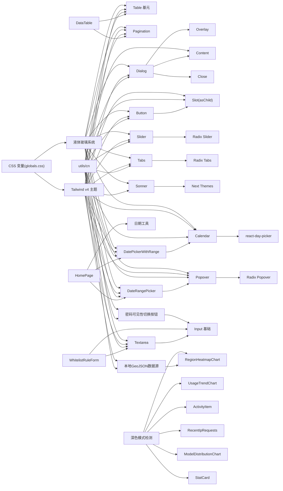
```mermaid
graph LR
DT["DataTable"] --> T["Table 基元"]
DT --> P["Pagination"]
D["Dialog"] --> O["Overlay"]
D --> C["Content"]
D --> CL["Close"]
B["Button"] --> S["Slot(asChild)"]
SL["Slider"] --> R["Radix Slider"]
TAB["Tabs"] --> RT["Radix Tabs"]
SON["Sonner"] --> TH["Next Themes"]
POP["Popover"] --> RP["Radix Popover"]
CAL["Calendar"] --> RDP["react-day-picker"]
DRWR["DatePickerWithRange"] --> CAL
DRP["DateRangePicker"] --> POP
TX["Textarea"] --> IN["Input 基础"]
WLF["WhitelistRuleForm"] --> IN
WLF --> TX
PWD["密码可见性切换按钮"] --> IN
DATA["本地GeoJSON数据源"] --> RHC["RegionHeatmapChart"]
HOME["HomePage"] --> DRWR
HOME --> DRP
HOME --> DATE["日期工具"]
U["utils/cn"] --> B
U --> D
U --> T
U --> P
U --> SL
U --> TAB
U --> S
U --> C
U --> TX
U --> POP
U --> CAL
U --> DRWR
U --> DRP
U --> PWD
U --> DATA
TW["Tailwind v4 主题"] --> B
TW --> D
TW --> T
TW --> P
TW --> SL
TW --> TAB
TW --> SON
TW --> TX
TW --> POP
TW --> CAL
TW --> DRWR
TW --> DRP
TW --> S
TW --> PWD
TW --> DATA
CSS["CSS 变量(globals.css)"] --> TW
CSS --> GLASS["液体玻璃系统"]
DARK["深色模式检测"] --> UT["UsageTrendChart"]
DARK --> AI["ActivityItem"]
DARK --> RIR["RecentIpRequests"]
DARK --> MDC["ModelDistributionChart"]
DARK --> RHC["RegionHeatmapChart"]
DARK --> SC["StatCard"]
GLASS --> B
GLASS --> D
GLASS --> T
GLASS --> P
GLASS --> SL
GLASS --> TAB
GLASS --> SON
GLASS --> TX
GLASS --> POP
GLASS --> CAL
GLASS --> DRWR
GLASS --> DRP
```

**图表来源**
- [src/components/ui/data-table.tsx:1-191](file://src/components/ui/data-table.tsx#L1-L191)
- [src/components/ui/table.tsx:1-95](file://src/components/ui/table.tsx#L1-L95)
- [src/components/ui/pagination.tsx:1-118](file://src/components/ui/pagination.tsx#L1-L118)
- [src/components/ui/dialog.tsx:1-121](file://src/components/ui/dialog.tsx#L1-L121)
- [src/components/ui/button.tsx:1-77](file://src/components/ui/button.tsx#L1-L77)
- [src/components/ui/slider.tsx:1-29](file://src/components/ui/slider.tsx#L1-L29)
- [src/components/ui/tabs.tsx:1-56](file://src/components/ui/tabs.tsx#L1-L56)
- [src/components/ui/sonner.tsx:1-46](file://src/components/ui/sonner.tsx#L1-L46)
- [src/components/ui/popover.tsx:1-32](file://src/components/ui/popover.tsx#L1-L32)
- [src/components/ui/calendar.tsx:1-223](file://src/components/ui/calendar.tsx#L1-L223)
- [src/components/date-picker-with-range.tsx:1-92](file://src/components/date-picker-with-range.tsx#L1-L92)
- [src/components/date-range-picker.tsx:1-100](file://src/components/date-range-picker.tsx#L1-L100)
- [src/components/ui/textarea.tsx:1-38](file://src/components/ui/textarea.tsx#L1-L38)
- [src/app/(dashboard)/users/components/whitelist-rule-form.tsx](file://src/app/(dashboard)/users/components/whitelist-rule-form.tsx#L1-L531)
- [src/lib/utils.ts:1-7](file://src/lib/utils.ts#L1-L7)
- [tailwind.config.js:1-78](file://tailwind.config.js#L1-L78)
- [src/app/globals.css:1-136](file://src/app/globals.css#L1-L136)
- [src/app/(dashboard)/components/usage-trend-chart.tsx](file://src/app/(dashboard)/components/usage-trend-chart.tsx#L20-L31)
- [src/app/(dashboard)/components/activity-item.tsx](file://src/app/(dashboard)/components/activity-item.tsx#L40-L50)
- [src/app/(dashboard)/components/recent-ip-requests.tsx](file://src/app/(dashboard)/components/recent-ip-requests.tsx#L84-L96)
- [src/app/(dashboard)/components/model-distribution-chart.tsx](file://src/app/(dashboard)/components/model-distribution-chart.tsx#L113-L116)
- [src/app/(dashboard)/components/region-heatmap-chart.tsx](file://src/app/(dashboard)/components/region-heatmap-chart.tsx#L7-L7)
- [src/app/(dashboard)/components/stat-card.tsx](file://src/app/(dashboard)/components/stat-card.tsx#L40-L52)
- [src/app/(dashboard)/page.tsx](file://src/app/(dashboard)/page.tsx#L107-L139)
- [src/lib/date.ts:1-13](file://src/lib/date.ts#L1-L13)
- [src/app/settings/page.tsx:102-119](file://src/app/settings/page.tsx#L102-L119)
- [src/app/login/page.tsx:78-97](file://src/app/login/page.tsx#L78-L97)
- [readme/ui-rule.md:1-99](file://readme/ui-rule.md#L1-L99)

## 组件详解

### Button（按钮）
- 设计理念
  - 通过变体系统区分默认、破坏性、描边、次级、幽灵、链接、玻璃七种外观，尺寸包含默认、小、大、图标四种规格。
  - **新增** 液体玻璃效果：glass 变体提供背景模糊、半透明和阴影效果，营造现代的玻璃质感。
  - 动画与交互：悬停放大、激活缩放、阴影扩散，结合焦点环与模糊背景，契合液体玻璃主题。
  - 语义化：继承原生 Button 属性，支持 asChild 透传至 Slot，便于与 Link 或自定义元素组合。
- 关键属性
  - variant: default | destructive | outline | secondary | ghost | link | glass
  - size: default | sm | lg | icon
  - asChild: boolean（是否渲染为子节点）
  - 其他：ButtonHTMLAttributes<HTMLButtonElement>
- 状态与事件
  - 禁用态：禁用指针事件且不透明度降低
  - 聚焦态：可见焦点环与 Ring 高亮
  - 悬停/激活：scale 与 shadow 动画
- 样式来源
  - 类名合并：utils/cn
  - 变体样式：class-variance-authority
  - 主题变量：CSS 变量映射到 --primary、--destructive、--card 等

**更新** Button 组件新增 glass 变体，提供液体玻璃效果，包括：
- 背景模糊：`backdrop-blur-2xl` 和 `backdrop-saturate-[1.8]`
- 半透明背景：`bg-white/15 dark:bg-black/20`
- 边框效果：`border border-white/25 dark:border-white/8`
- 阴影效果：`shadow-[0_8px_32px_rgba(0,0,0,0.12),inset_1px_1px_0_rgba(255,255,255,0.6),inset_0_0_8px_rgba(255,255,255,0.15)]`
- 悬停效果：`hover:bg-white/20 dark:hover:bg-black/25 hover:shadow-[0_12px_40px_rgba(0,0,0,0.16),inset_1px_1px_0_rgba(255,255,255,0.7),inset_0_0_12px_rgba(255,255,255,0.2)]`

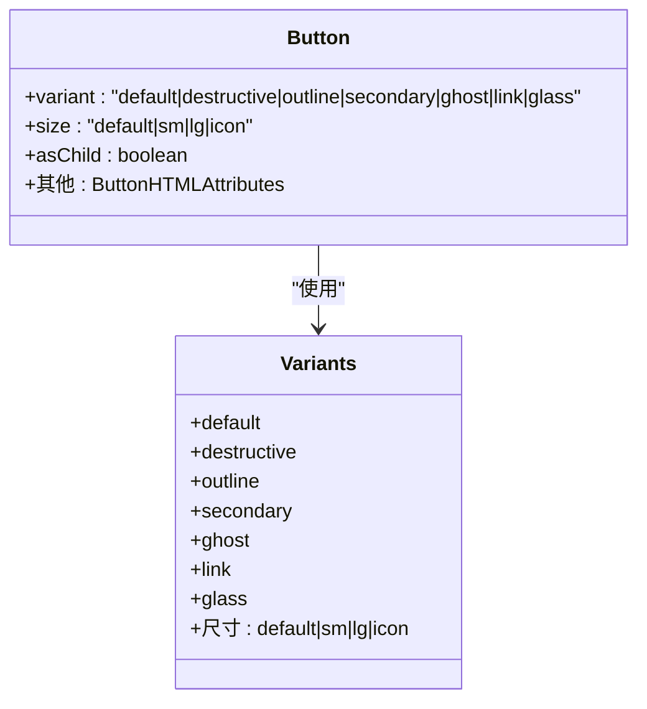
```mermaid
classDiagram
class Button {
+variant : "default|destructive|outline|secondary|ghost|link|glass"
+size : "default|sm|lg|icon"
+asChild : boolean
+其他 : ButtonHTMLAttributes
}
class Variants {
+default
+destructive
+outline
+secondary
+ghost
+link
+glass
+尺寸 : default|sm|lg|icon
}
Button --> Variants : "使用"
```

**图表来源**
- [src/components/ui/button.tsx:7-54](file://src/components/ui/button.tsx#L7-L54)

**章节来源**
- [src/components/ui/button.tsx:36-77](file://src/components/ui/button.tsx#L36-L77)
- [src/lib/utils.ts:4-6](file://src/lib/utils.ts#L4-L6)
- [tailwind.config.js:19-54](file://tailwind.config.js#L19-L54)
- [src/app/globals.css:5-51](file://src/app/globals.css#L5-L51)

### Input（输入框）
- 设计理念
  - 统一圆角、边框、占位符与聚焦态 Ring 高亮，保持一致的视觉反馈。
  - 支持任意原生 input 属性透传，便于与表单库或验证器集成。
  - **新增** 液体玻璃效果：背景模糊、半透明和阴影效果，提升现代感。
  - **新增** 密码可见性切换按钮：通过相对定位容器和绝对定位按钮实现，提供更好的用户体验。
- 关键属性
  - type: string（如 text/password/email 等）
  - 其他：InputHTMLAttributes<HTMLInputElement>
- 状态与事件
  - 禁用态：半透明与不可点击
  - 聚焦态：Ring 边框高亮
- 样式来源
  - 类名合并：utils/cn
  - 主题变量：--background、--input、--ring、--muted-foreground

**更新** Input 组件新增液体玻璃效果，包括：
- 背景模糊：`backdrop-blur-lg backdrop-saturate-[1.5]`
- 半透明背景：`bg-white/15 dark:bg-black/20`
- 边框效果：`border border-white/25 dark:border-white/10`
- 阴影效果：`shadow-[0_2px_8px_rgba(0,0,0,0.06)]`
- 聚焦效果：`focus:bg-white/20 dark:focus:bg-black/25`
- 悬停效果：`hover:bg-white/20 dark:hover:bg-black/25`

**章节来源**
- [src/components/ui/input.tsx:5-26](file://src/components/ui/input.tsx#L5-L26)
- [src/lib/utils.ts:4-6](file://src/lib/utils.ts#L4-L6)
- [tailwind.config.js:20-54](file://tailwind.config.js#L20-L54)
- [src/app/globals.css:53-75](file://src/app/globals.css#L53-L75)

### Textarea（文本域）
- 设计理念
  - 专门的多行文本输入组件，支持最小高度 80px、圆角边框、占位符与聚焦态 Ring 高亮。
  - **新增** 液体玻璃效果：背景模糊、半透明和阴影效果，营造现代的玻璃质感。
  - 适配深色模式，使用主题变量 --background、--input、--ring、--muted-foreground。
  - 支持任意原生 textarea 属性透传，便于与表单库或验证器集成。
- 关键属性
  - rows: number（默认 3 行）
  - className: string（自定义样式类名）
  - 其他：TextareaHTMLAttributes<HTMLTextAreaElement>
- 状态与事件
  - 禁用态：半透明与不可编辑
  - 聚焦态：Ring 边框高亮
  - 自动调整高度：支持内容增长的多行文本输入
- 样式来源
  - 类名合并：utils/cn
  - 主题变量：--background、--input、--ring、--muted-foreground
  - 液体玻璃效果：`backdrop-blur-lg backdrop-saturate-[1.5]`
  - 深色模式：自动适配深色背景与高对比度

**更新** Textarea 组件现已全面支持液体玻璃样式系统，包括：
- 背景模糊：`backdrop-blur-lg backdrop-saturate-[1.5]`
- 半透明背景：`bg-white/15 dark:bg-black/20`
- 边框效果：`border border-white/25 dark:border-white/10`
- 阴影效果：`shadow-[0_2px_8px_rgba(0,0,0,0.06),inset_0_1px_0_rgba(255,255,255,0.3)]`
- 聚焦效果：`focus:bg-white/20 dark:focus:bg-black/25`
- 悬停效果：`hover:bg-white/20 dark:hover:bg-black/25`
- 过渡动画：`transition-all duration-200 ease-[cubic-bezier(0.34,1.56,0.64,1)]`

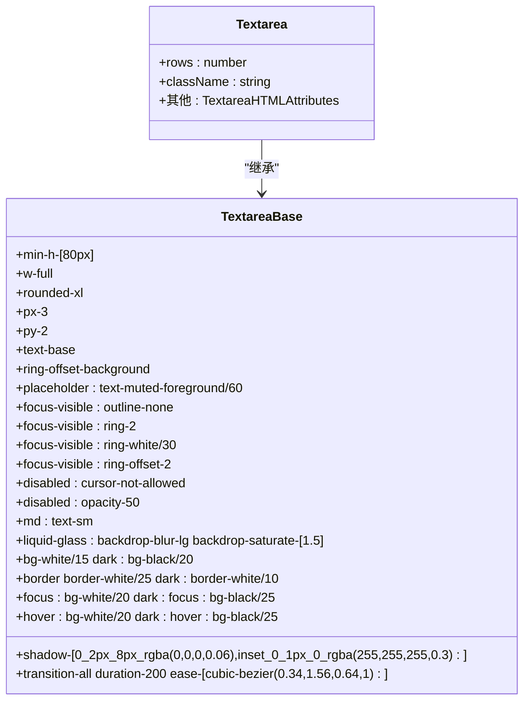
```mermaid
classDiagram
class Textarea {
+rows : number
+className : string
+其他 : TextareaHTMLAttributes
}
class TextareaBase {
+min-h-[80px]
+w-full
+rounded-xl
+px-3
+py-2
+text-base
+ring-offset-background
+placeholder : text-muted-foreground/60
+focus-visible : outline-none
+focus-visible : ring-2
+focus-visible : ring-white/30
+focus-visible : ring-offset-2
+disabled : cursor-not-allowed
+disabled : opacity-50
+md : text-sm
+liquid-glass : backdrop-blur-lg backdrop-saturate-[1.5]
+bg-white/15 dark : bg-black/20
+border border-white/25 dark : border-white/10
+shadow-[0_2px_8px_rgba(0,0,0,0.06),inset_0_1px_0_rgba(255,255,255,0.3)]
+focus : bg-white/20 dark : focus : bg-black/25
+hover : bg-white/20 dark : hover : bg-black/25
+transition-all duration-200 ease-[cubic-bezier(0.34,1.56,0.64,1)]
}
Textarea --> TextareaBase : "继承"
```

**图表来源**
- [src/components/ui/textarea.tsx:5-38](file://src/components/ui/textarea.tsx#L5-L38)

**章节来源**
- [src/components/ui/textarea.tsx:1-38](file://src/components/ui/textarea.tsx#L1-L38)
- [src/lib/utils.ts:4-6](file://src/lib/utils.ts#L4-L6)
- [tailwind.config.js:20-54](file://tailwind.config.js#L20-L54)
- [src/app/globals.css:53-75](file://src/app/globals.css#L53-L75)

### Dialog（对话框）
- 设计理念
  - 基于 Radix Dialog，使用 Portal 将内容挂载到文档根节点，避免层级问题。
  - 遮罩与内容区均支持动画进入/退出（淡入/淡出、缩放、滑入），关闭按钮具备无障碍文本。
  - **新增** 液体玻璃效果：背景模糊、半透明和阴影效果，提升视觉质感。
- 关键子组件
  - Root、Trigger、Portal、Overlay、Content、Close、Header、Footer、Title、Description
- 关键属性
  - Overlay/Content：className 透传
  - Close：包含 sr-only 文本，便于屏幕阅读器识别
- 状态与事件
  - 打开/关闭：由 Radix 状态控制，配合 data-[state=open/closed] 实现动画
- 样式来源
  - 类名合并：utils/cn
  - 主题变量：--popover、--popover-border、--muted-foreground、--ring

**更新** Dialog 组件新增液体玻璃效果，包括：
- 背景模糊：`backdrop-blur-xl`
- 半透明背景：`bg-white/60 dark:bg-black/30`
- 边框效果：`border border-white/30 dark:border-white/10`
- 阴影效果：`shadow-[0_8px_32px_rgba(0,0,0,0.08),inset_0_1px_0_rgba(255,255,255,0.4)]`

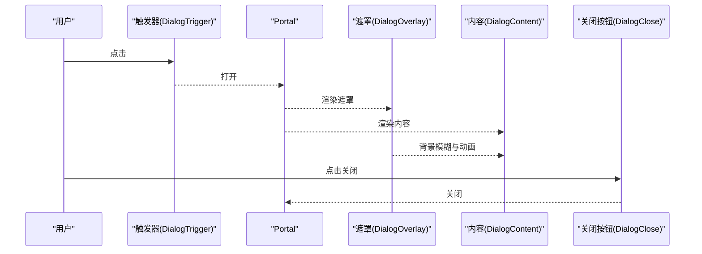
```mermaid
sequenceDiagram
participant U as "用户"
participant T as "触发器(DialogTrigger)"
participant P as "Portal"
participant O as "遮罩(DialogOverlay)"
participant C as "内容(DialogContent)"
participant X as "关闭按钮(DialogClose)"
U->>T : 点击
T-->>P : 打开
P-->>O : 渲染遮罩
P-->>C : 渲染内容
O-->>C : 背景模糊与动画
U->>X : 点击关闭
X-->>P : 关闭
```

**图表来源**
- [src/components/ui/dialog.tsx:7-52](file://src/components/ui/dialog.tsx#L7-L52)

**章节来源**
- [src/components/ui/dialog.tsx:1-121](file://src/components/ui/dialog.tsx#L1-L121)
- [src/lib/utils.ts:4-6](file://src/lib/utils.ts#L4-L6)
- [tailwind.config.js:46-53](file://tailwind.config.js#L46-L53)
- [src/app/globals.css:16-20](file://src/app/globals.css#L16-L20)

### Table 与 DataTable（表格）
- Table 基元
  - 提供 Table、TableHeader、TableBody、TableFooter、TableRow、TableHead、TableCell、TableCaption。
  - 行悬停与选中态，支持 data-[state=selected]。
- DataTable
  - 基于 @tanstack/react-table，内置排序、过滤、分页与空态提示。
  - 自动计算页码序列，超过 7 页时插入省略号。
  - **新增** 液体玻璃效果：背景模糊、半透明和阴影效果，提升视觉质感。
- 关键属性
  - DataTableProps：columns、data、emptyMessage、emptyDescription、emptyIcon、pageSize
- 状态与事件
  - 排序状态：SortingState
  - 过滤状态：ColumnFiltersState
  - 分页：getPaginationRowModel、setPageIndex、previousPage、nextPage
- 样式来源
  - 类名合并：utils/cn
  - 主题变量：--background、--muted、--text-dark（深色）

**更新** DataTable 组件现已全面支持液体玻璃样式系统，包括：
- 背景模糊：`backdrop-blur-xl`
- 半透明背景：`bg-white/50 dark:bg-black/25`
- 边框效果：`border border-white/30 dark:border-white/10`
- 阴影效果：`shadow-[0_8px_32px_rgba(0,0,0,0.1),inset_0_1px_0_rgba(255,255,255,0.4)]`
- 悬停效果：`hover:shadow-[0_12px_48px_rgba(0,0,0,0.15)]`
- 过渡动画：`transition-all duration-300`

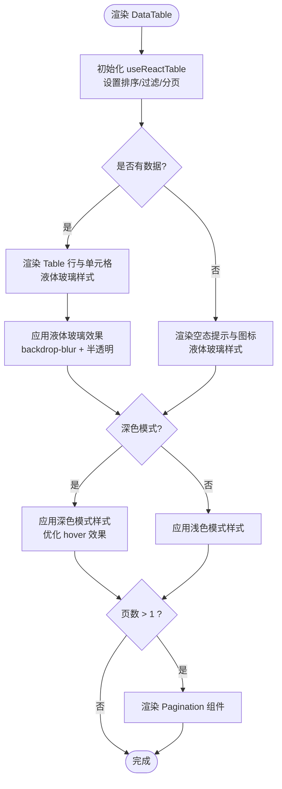
```mermaid
flowchart TD
Start(["渲染 DataTable"]) --> Init["初始化 useReactTable<br/>设置排序/过滤/分页"]
Init --> HasRows{"是否有数据?"}
HasRows --> |是| RenderRows["渲染 Table 行与单元格<br/>液体玻璃样式"]
HasRows --> |否| Empty["渲染空态提示与图标<br/>液体玻璃样式"]
RenderRows --> Glass["应用液体玻璃效果<br/>backdrop-blur + 半透明"]
Glass --> DarkMode{"深色模式?"}
Empty --> DarkMode
DarkMode --> |是| DarkStyles["应用深色模式样式<br/>优化 hover 效果"]
DarkMode --> |否| LightStyles["应用浅色模式样式"]
DarkStyles --> Paginate{"页数 > 1 ?"}
LightStyles --> Paginate
Paginate --> |是| ShowPager["渲染 Pagination 组件"]
Paginate --> |否| End(["完成"])
ShowPager --> End
```

**图表来源**
- [src/components/ui/data-table.tsx:36-183](file://src/components/ui/data-table.tsx#L36-L183)
- [src/components/ui/table.tsx:4-95](file://src/components/ui/table.tsx#L4-L95)
- [src/components/ui/pagination.tsx:7-118](file://src/components/ui/pagination.tsx#L7-L118)

**章节来源**
- [src/components/ui/table.tsx:1-95](file://src/components/ui/table.tsx#L1-L95)
- [src/components/ui/data-table.tsx:27-191](file://src/components/ui/data-table.tsx#L27-L191)
- [src/lib/utils.ts:4-6](file://src/lib/utils.ts#L4-L6)
- [tailwind.config.js:38-53](file://tailwind.config.js#L38-L53)
- [src/app/globals.css:77-118](file://src/app/globals.css#L77-L118)

### Pagination（分页）
- 设计理念
  - 基于 Button 变体，提供 Previous/Next、页码链接与省略号。
  - 当前页通过 aria-current="page" 标注，提升可访问性。
  - **新增** 液体玻璃效果：背景模糊、半透明和阴影效果，保持视觉一致性。
- 关键属性
  - PaginationLink：isActive、size
  - PaginationPrevious/PaginationNext：透传 PaginationLink 属性
- 样式来源
  - 类名合并：utils/cn
  - 主题变量：--accent、--ring

**章节来源**
- [src/components/ui/pagination.tsx:7-118](file://src/components/ui/pagination.tsx#L7-L118)
- [src/lib/utils.ts:4-6](file://src/lib/utils.ts#L4-L6)
- [tailwind.config.js:42-44](file://tailwind.config.js#L42-L44)

### Select（选择器）
- 设计理念
  - 基于 Radix Select，支持滚动按钮、视口、选中项指示器与多侧边动画。
  - 触发器与内容区均使用主题变量与动画过渡。
  - **新增** 液体玻璃效果：背景模糊、半透明和阴影效果，提升视觉质感。
- 关键属性
  - Trigger：透传 SelectPrimitive.Trigger 属性
  - Content：position='popper' 时自动适配触发器尺寸与高度
  - Item：支持选中指示器与文本
- 样式来源
  - 类名合并：utils/cn
  - 主题变量：--popover、--accent

**章节来源**
- [src/components/ui/select.tsx:13-152](file://src/components/ui/select.tsx#L13-L152)
- [src/lib/utils.ts:4-6](file://src/lib/utils.ts#L4-L6)
- [tailwind.config.js:46-53](file://tailwind.config.js#L46-L53)

### Checkbox（复选框）
- 设计理念
  - 基于 Radix Checkbox，支持受控/非受控状态，指示器为勾选图标。
  - 选中态改变背景与前景色，保持与主题一致。
  - **新增** 液体玻璃效果：背景模糊、半透明和阴影效果，提升视觉质感。
- 关键属性
  - 根元素：透传 CheckboxPrimitive.Root 属性
- 样式来源
  - 类名合并：utils/cn
  - 主题变量：--primary、--accent

**章节来源**
- [src/components/ui/checkbox.tsx:9-31](file://src/components/ui/checkbox.tsx#L9-L31)
- [src/lib/utils.ts:4-6](file://src/lib/utils.ts#L4-L6)
- [tailwind.config.js:26-33](file://tailwind.config.js#L26-L33)

### Label（标签）
- 设计理念
  - 基于 Radix Label，语义化关联表单控件，禁用态半透明。
  - 使用 class-variance-authority 控制基础样式。
  - **新增** 液体玻璃效果：背景模糊、半透明和阴影效果，提升视觉质感。
- 关键属性
  - 根元素：透传 LabelPrimitive.Root 属性
- 样式来源
  - 类名合并：utils/cn
  - 主题变量：--muted-foreground

**章节来源**
- [src/components/ui/label.tsx:7-25](file://src/components/ui/label.tsx#L7-L25)
- [src/lib/utils.ts:4-6](file://src/lib/utils.ts#L4-L6)
- [tailwind.config.js:38-41](file://tailwind.config.js#L38-L41)

### Slider（滑块）
- 设计理念
  - 基于 @radix-ui/react-slider，提供现代化的滑块交互体验。
  - 支持精确数值控制、键盘导航和屏幕阅读器访问。
  - 内置 Track（轨道）和 Range（进度条）结构，Thumb（滑块手柄）支持焦点状态。
  - **新增** 液体玻璃效果：背景模糊、半透明和阴影效果，提升视觉质感。
- 关键属性
  - 根元素：透传 SliderPrimitive.Root 属性
  - 支持 value、defaultValue、min、max、step 等标准滑块属性
  - 支持 orientation（方向）和 disabled（禁用）状态
- 状态与事件
  - 拖拽状态：实时更新 value 值
  - 焦点状态：支持 Tab 键导航和键盘快捷键
  - 禁用态：半透明且不可交互
- 可访问性
  - 支持键盘导航：Arrow Left/Right、Home、End、Page Up/Down
  - 屏幕阅读器友好：语义化结构和状态通知
  - 焦点管理：清晰的焦点指示器
- 样式来源
  - 类名合并：utils/cn
  - 主题变量：--primary、--secondary、--ring

**更新** Slider 组件现已全面支持液体玻璃样式系统，包括：
- 背景模糊：`backdrop-blur-lg backdrop-saturate-[1.5]`
- 半透明背景：`bg-white/15 dark:bg-black/20`
- 边框效果：`border border-white/25 dark:border-white/10`
- 阴影效果：`shadow-[0_2px_8px_rgba(0,0,0,0.06),inset_0_1px_0_rgba(255,255,255,0.3)]`
- 聚焦效果：`focus-visible:ring-ring`
- 过渡动画：`transition-all duration-200 ease-[cubic-bezier(0.34,1.56,0.64,1)]`

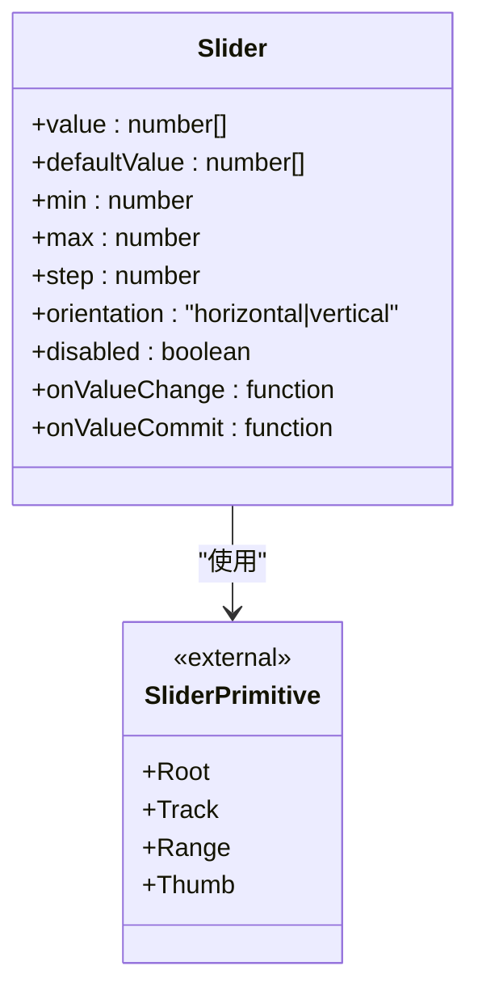
```mermaid
classDiagram
class Slider {
+value : number[]
+defaultValue : number[]
+min : number
+max : number
+step : number
+orientation : "horizontal|vertical"
+disabled : boolean
+onValueChange : function
+onValueCommit : function
}
class SliderPrimitive {
<<external>>
+Root
+Track
+Range
+Thumb
}
Slider --> SliderPrimitive : "使用"
```

**图表来源**
- [src/components/ui/slider.tsx:8-29](file://src/components/ui/slider.tsx#L8-L29)

**章节来源**
- [src/components/ui/slider.tsx:1-29](file://src/components/ui/slider.tsx#L1-L29)
- [src/lib/utils.ts:4-6](file://src/lib/utils.ts#L4-L6)
- [tailwind.config.js:26-33](file://tailwind.config.js#L26-L33)
- [src/app/globals.css:53-75](file://src/app/globals.css#L53-L75)

### Tabs（标签页）
- 设计理念
  - 基于 @radix-ui/react-tabs，提供现代化的标签页导航功能。
  - 支持键盘导航、无障碍访问和动态内容切换。
  - 内置 TabsList、TabsTrigger、TabsContent 子组件，结构清晰。
  - **新增** 液体玻璃效果：背景模糊、半透明和阴影效果，提升视觉质感。
- 关键组件
  - Tabs：根组件，管理标签页状态
  - TabsList：标签页列表容器
  - TabsTrigger：单个标签页触发器，支持 active 状态
  - TabsContent：标签页内容区域，支持 data-[state] 状态
- 关键属性
  - Tabs：value、defaultValue、onValueChange
  - TabsTrigger：value、disabled、children
  - TabsContent：value、children
- 状态与事件
  - 切换状态：通过 value 属性控制当前激活的标签页
  - 键盘导航：Tab 键在标签页之间切换
  - 焦点管理：激活标签页获得焦点
- 可访问性
  - 支持键盘导航和屏幕阅读器访问
  - 使用 data-state 属性提供状态信息
  - 语义化结构确保无障碍兼容
- 样式来源
  - 类名合并：utils/cn
  - 主题变量：--background、--muted、--muted-foreground、--border

**更新** Tabs 组件现已全面支持液体玻璃样式系统，包括：
- 背景模糊：`backdrop-blur-lg backdrop-saturate-[1.5]`
- 半透明背景：`bg-white/15 dark:bg-black/20`
- 边框效果：`border border-white/25 dark:border-white/10`
- 阴影效果：`shadow-[0_2px_8px_rgba(0,0,0,0.06),inset_0_1px_0_rgba(255,255,255,0.3)]`
- 聚焦效果：`focus-visible:ring-ring`
- 过渡动画：`transition-all duration-200 ease-[cubic-bezier(0.34,1.56,0.64,1)]`

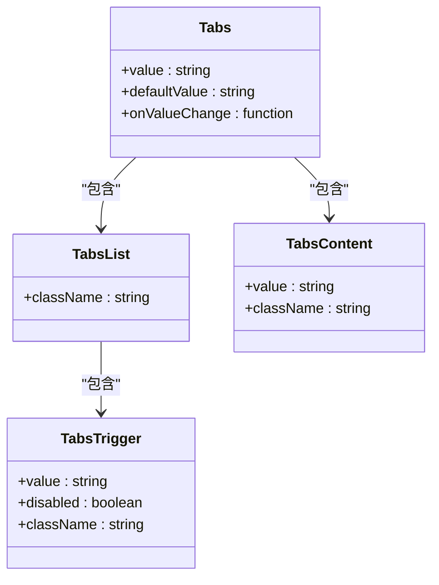
```mermaid
classDiagram
class Tabs {
+value : string
+defaultValue : string
+onValueChange : function
}
class TabsList {
+className : string
}
class TabsTrigger {
+value : string
+disabled : boolean
+className : string
}
class TabsContent {
+value : string
+className : string
}
Tabs --> TabsList : "包含"
TabsList --> TabsTrigger : "包含"
Tabs --> TabsContent : "包含"
```

**图表来源**
- [src/components/ui/tabs.tsx:8-56](file://src/components/ui/tabs.tsx#L8-L56)

**章节来源**
- [src/components/ui/tabs.tsx:1-56](file://src/components/ui/tabs.tsx#L1-L56)
- [src/lib/utils.ts:4-6](file://src/lib/utils.ts#L4-L6)
- [tailwind.config.js:26-33](file://tailwind.config.js#L26-L33)
- [src/app/globals.css:53-75](file://src/app/globals.css#L53-L75)

### Sonner（通知系统）
- 设计理念
  - 基于 sonner，提供现代化的通知系统，支持多种通知类型。
  - 集成 next-themes，自动适配深色模式主题。
  - 支持自定义图标、样式类名和交互效果。
  - **新增** 液体玻璃效果：背景模糊、半透明和阴影效果，提升视觉质感。
- 关键功能
  - 通知类型：success、info、warning、error、loading
  - 主题适配：自动检测系统主题偏好
  - 自定义图标：使用 lucide-react 图标库
  - 样式定制：支持 classNames 配置
- 关键属性
  - theme：light、dark、system
  - icons：自定义各类通知图标
  - toastOptions：配置通知样式类名
  - className：容器样式类名
- 状态与事件
  - 自动消失：默认 4000ms 后自动隐藏
  - 用户交互：支持点击关闭和手动关闭
  - 主题切换：实时响应系统主题变化
- 可访问性
  - 屏幕阅读器友好：语义化通知结构
  - 键盘导航：支持 Tab 键导航
  - 焦点管理：通知获得焦点
- 样式来源
  - 类名合并：utils/cn
  - 主题变量：--background、--foreground、--border、--shadow

**更新** Sonner 通知组件现已全面支持液体玻璃样式系统，包括：
- 背景模糊：`backdrop-blur-lg backdrop-saturate-[1.5]`
- 半透明背景：`bg-white/15 dark:bg-black/20`
- 边框效果：`border border-white/25 dark:border-white/10`
- 阴影效果：`shadow-[0_2px_8px_rgba(0,0,0,0.06),inset_0_1px_0_rgba(255,255,255,0.3)]`
- 聚焦效果：`focus-visible:ring-ring`
- 过渡动画：`transition-all duration-200 ease-[cubic-bezier(0.34,1.56,0.64,1)]`

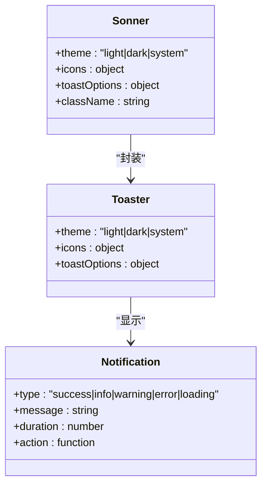
```mermaid
classDiagram
class Sonner {
+theme : "light|dark|system"
+icons : object
+toastOptions : object
+className : string
}
class Toaster {
+theme : "light|dark|system"
+icons : object
+toastOptions : object
}
class Notification {
+type : "success|info|warning|error|loading"
+message : string
+duration : number
+action : function
}
Sonner --> Toaster : "封装"
Toaster --> Notification : "显示"
```

**图表来源**
- [src/components/ui/sonner.tsx:15-46](file://src/components/ui/sonner.tsx#L15-L46)

**章节来源**
- [src/components/ui/sonner.tsx:1-46](file://src/components/ui/sonner.tsx#L1-L46)
- [src/lib/utils.ts:4-6](file://src/lib/utils.ts#L4-L6)
- [tailwind.config.js:26-33](file://tailwind.config.js#L26-L33)
- [src/app/globals.css:53-75](file://src/app/globals.css#L53-L75)

### Popover（弹出框）
- 设计理念
  - 基于 @radix-ui/react-popover，提供弹出式内容展示功能。
  - 支持 Portal 渲染，避免层级问题和布局影响。
  - 内置多种动画效果：淡入淡出、缩放、滑入滑出，配合 data-state 属性控制。
  - 支持对齐方式（left、right、top、bottom）和偏移量配置。
  - **新增** 液体玻璃效果：背景模糊、半透明和阴影效果，提升视觉质感。
- 关键组件
  - Popover：根组件，管理弹出状态
  - PopoverTrigger：触发器，支持 asChild 透传
  - PopoverContent：内容区域，支持 Portal 渲染和动画
- 关键属性
  - Popover：透传 PopoverPrimitive.Root 属性
  - PopoverTrigger：透传 PopoverPrimitive.Trigger 属性
  - PopoverContent：align（对齐方式，默认 center）、sideOffset（偏移量，默认 4）、className 透传
- 状态与事件
  - 打开/关闭：由 Radix 状态控制，配合 data-[state=open/closed] 实现动画
  - Portal 渲染：自动挂载到文档根节点
- 可访问性
  - 支持键盘导航和屏幕阅读器访问
  - 使用 data-state 属性提供状态信息
  - 语义化结构确保无障碍兼容
- 样式来源
  - 类名合并：utils/cn
  - 主题变量：--popover、--popover-foreground、--popover-border、--muted-foreground

**更新** Popover 组件现已全面支持液体玻璃样式系统，包括：
- 背景模糊：`backdrop-blur-2xl`
- 半透明背景：`bg-white/80 dark:bg-black/40`
- 边框效果：`border border-white/30 dark:border-white/15`
- 阴影效果：`shadow-[0_16px_48px_rgba(0,0,0,0.15),inset_1px_1px_0_rgba(255,255,255,0.5)]`
- 聚焦效果：`focus-visible:ring-ring`
- 过渡动画：`transition-all duration-200 ease-[cubic-bezier(0.34,1.56,0.64,1)]`

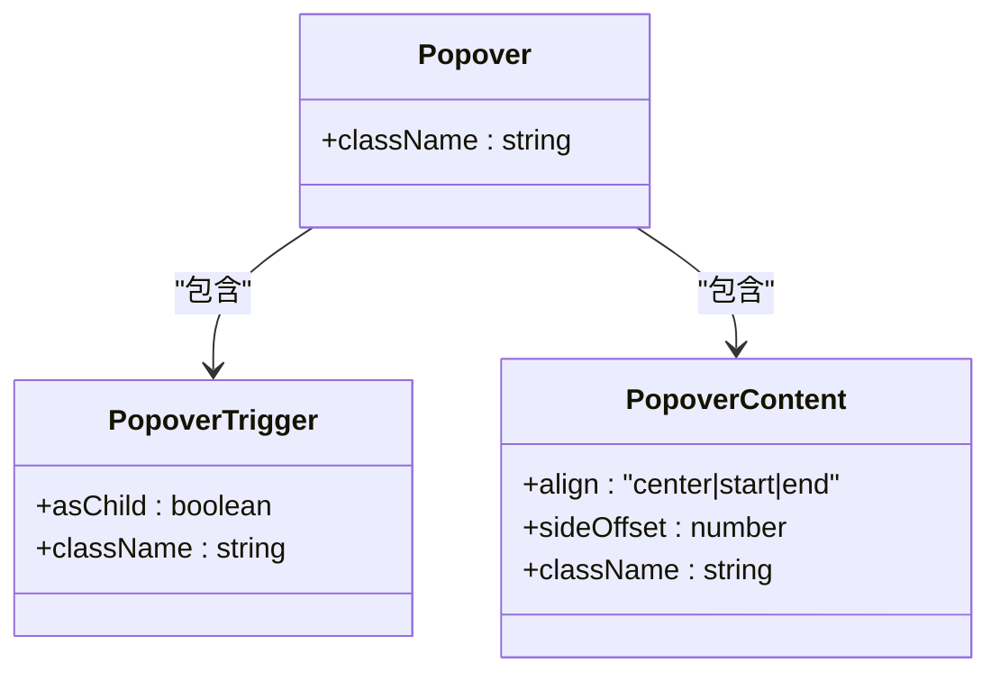
```mermaid
classDiagram
class Popover {
+className : string
}
class PopoverTrigger {
+asChild : boolean
+className : string
}
class PopoverContent {
+align : "center|start|end"
+sideOffset : number
+className : string
}
Popover --> PopoverTrigger : "包含"
Popover --> PopoverContent : "包含"
```

**图表来源**
- [src/components/ui/popover.tsx:8-31](file://src/components/ui/popover.tsx#L8-L31)

**章节来源**
- [src/components/ui/popover.tsx:1-32](file://src/components/ui/popover.tsx#L1-L32)
- [src/lib/utils.ts:4-6](file://src/lib/utils.ts#L4-L6)
- [tailwind.config.js:46-53](file://tailwind.config.js#L46-L53)
- [src/app/globals.css:53-75](file://src/app/globals.css#L53-L75)

### Calendar（日历）
- 设计理念
  - 基于 react-day-picker 的现代化日历组件，提供完整的日期选择功能。
  - 支持范围选择、多月显示、国际化和主题定制。
  - 内置完整的日、月、年选择界面，支持键盘导航和屏幕阅读器访问。
  - 使用 Button 组件作为导航按钮，保持一致的样式和交互体验。
  - **新增** 液体玻璃效果：背景模糊、半透明和阴影效果，提升视觉质感。
- 关键属性
  - className: string（自定义样式类名）
  - classNames: object（自定义类名映射）
  - showOutsideDays: boolean（是否显示外层日期，默认 true）
  - captionLayout: "label" | "dropdown-buttons"（标题布局，默认 "label"）
  - buttonVariant: "ghost" | "default" | "outline" | "secondary" | "link"（按钮变体，默认 "ghost"）
  - locale: Locale（国际化配置，默认 zhCN）
  - formatters: 对象（自定义格式化函数）
  - components: 对象（自定义组件覆盖）
- 关键功能
  - 范围选择：支持开始日期和结束日期的范围选择
  - 多月显示：支持同时显示多个月份，便于范围选择
  - 国际化：支持多语言配置，使用 date-fns 的 locale
  - 主题定制：通过 classNames 和 buttonVariant 实现深度定制
  - 键盘导航：支持 Tab 键导航和方向键选择
- 状态与事件
  - 选择状态：通过 selected 属性管理当前选择
  - 事件回调：通过 onDayClick、onMonthChange 等回调处理用户交互
  - 焦点管理：自动管理日期按钮的焦点状态
- 可访问性
  - 屏幕阅读器友好：提供 aria-label 和 role 属性
  - 键盘导航：支持完整的键盘操作
  - 焦点管理：确保焦点在交互元素间正确流转
- 样式来源
  - 类名合并：utils/cn
  - 主题变量：--background、--popover、--popover-border、--muted-foreground、--primary

**更新** Calendar 组件现已全面支持液体玻璃样式系统，包括：
- 背景模糊：`backdrop-blur-lg`
- 半透明背景：`bg-white/40 dark:bg-white/10`
- 边框效果：`border border-white/30 dark:border-white/10`
- 阴影效果：`shadow-[0_4px_16px_rgba(0,0,0,0.1),inset_0_1px_0_rgba(255,255,255,0.3)]`
- 聚焦效果：`focus-visible:ring-ring`
- 过渡动画：`transition-all duration-200 ease-[cubic-bezier(0.34,1.56,0.64,1)]`
- 按钮效果：导航按钮使用 `buttonVariants({ variant: buttonVariant })` 确保样式一致性

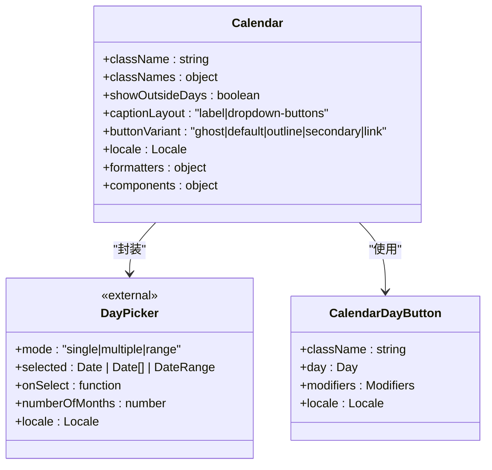
```mermaid
classDiagram
class Calendar {
+className : string
+classNames : object
+showOutsideDays : boolean
+captionLayout : "label|dropdown-buttons"
+buttonVariant : "ghost|default|outline|secondary|link"
+locale : Locale
+formatters : object
+components : object
}
class DayPicker {
<<external>>
+mode : "single|multiple|range"
+selected : Date | Date[] | DateRange
+onSelect : function
+numberOfMonths : number
+locale : Locale
}
class CalendarDayButton {
+className : string
+day : Day
+modifiers : Modifiers
+locale : Locale
}
Calendar --> DayPicker : "封装"
Calendar --> CalendarDayButton : "使用"
```

**图表来源**
- [src/components/ui/calendar.tsx:15-223](file://src/components/ui/calendar.tsx#L15-L223)

**章节来源**
- [src/components/ui/calendar.tsx:1-223](file://src/components/ui/calendar.tsx#L1-L223)
- [src/lib/utils.ts:4-6](file://src/lib/utils.ts#L4-L6)
- [tailwind.config.js:26-33](file://tailwind.config.js#L26-L33)
- [src/app/globals.css:53-75](file://src/app/globals.css#L53-L75)

### DatePickerWithRange（日期范围选择器）
- 设计理念
  - 基于 Calendar 组件构建的现代化日期范围选择器，提供直观的范围选择体验。
  - 支持范围选择、多月显示、国际化和主题定制。
  - 集成日历图标和按钮样式，提供一致的视觉反馈。
  - 使用 Button 组件作为触发器，支持 outline 样式和自定义宽度。
  - **新增** 液体玻璃效果：背景模糊、半透明和阴影效果，提升视觉质感。
- 关键属性
  - startDate?: Date（开始日期）
  - endDate?: Date（结束日期）
  - onDateRangeChange: (start: Date, end: Date) => void（日期范围变更回调）
  - className?: string（自定义样式类名）
- 关键功能
  - 范围选择：使用 Calendar 的 range 模式支持日期范围选择
  - 多月显示：支持同时显示 2 个月份，便于范围选择
  - 国际化：支持 zhCN 本地化配置
  - 触发器按钮：显示当前选中的日期范围标签
  - 状态管理：使用 useState 管理日期范围和 Popover 状态
- 状态与事件
  - 选择状态：通过 date 状态管理当前选择的日期范围
  - 打开/关闭：通过 Popover 状态控制日历显示
  - 事件回调：通过 onDateRangeChange 回调函数更新父组件状态
- 样式来源
  - 类名合并：utils/cn
  - 主题变量：--popover、--popover-border、--muted-foreground、--ring

**更新** DatePickerWithRange 组件现已全面支持液体玻璃样式系统，包括：
- 触发器按钮：`w-75 justify-start text-left font-normal rounded-xl`
- 背景模糊：`backdrop-blur-lg backdrop-saturate-[1.5]`
- 半透明背景：`bg-white/40 dark:bg-white/5`
- 边框效果：`border border-white/25 dark:border-white/10`
- 阴影效果：`shadow-[0_2px_8px_rgba(0,0,0,0.06),inset_0_1px_0_rgba(255,255,255,0.3)]`
- 悬停效果：`hover:bg-white/50 dark:hover:bg-white/10`
- 过渡动画：`transition-all duration-200 ease-[cubic-bezier(0.34,1.56,0.64,1)]`
- 日历内容：`w-auto p-0 rounded-2xl backdrop-blur-2xl`
- 半透明背景：`bg-white/80 dark:bg-black/40`
- 边框效果：`border border-white/30 dark:border-white/15`
- 阴影效果：`shadow-[0_16px_48px_rgba(0,0,0,0.15),inset_1px_1px_0_rgba(255,255,255,0.5)]`

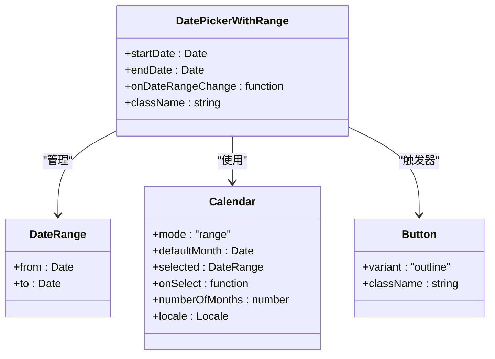
```mermaid
classDiagram
class DatePickerWithRange {
+startDate : Date
+endDate : Date
+onDateRangeChange : function
+className : string
}
class DateRange {
+from : Date
+to : Date
}
class Calendar {
+mode : "range"
+defaultMonth : Date
+selected : DateRange
+onSelect : function
+numberOfMonths : number
+locale : Locale
}
class Button {
+variant : "outline"
+className : string
}
DatePickerWithRange --> DateRange : "管理"
DatePickerWithRange --> Calendar : "使用"
DatePickerWithRange --> Button : "触发器"
```

**图表来源**
- [src/components/date-picker-with-range.tsx:14-92](file://src/components/date-picker-with-range.tsx#L14-L92)

**章节来源**
- [src/components/date-picker-with-range.tsx:1-92](file://src/components/date-picker-with-range.tsx#L1-L92)
- [src/lib/utils.ts:4-6](file://src/lib/utils.ts#L4-L6)
- [tailwind.config.js:46-53](file://tailwind.config.js#L46-L53)
- [src/app/globals.css:53-75](file://src/app/globals.css#L53-L75)

### DateRangePicker（日期范围选择器）
- 设计理念
  - 基于 Popover 组件构建的日期范围选择器，提供预设日期范围选择功能。
  - 支持今日、昨日、近7天、近30天、自定义日期范围五种预设选项。
  - 集成日历图标和下拉箭头，提供直观的视觉反馈。
  - 使用 Button 组件作为触发器，支持 outline 样式和自定义宽度。
  - **新增** 液体玻璃效果：背景模糊、半透明和阴影效果，提升视觉质感。
- 关键属性
  - dateRange: 'today' | 'yesterday' | '7days' | '30days' | 'custom'
  - setDateRange: (range: DateRangeType) => void
  - className?: string
- 关键功能
  - 预设选项：提供常用日期范围的快速选择
  - 触发器按钮：显示当前选中的日期范围标签
  - 弹出菜单：显示所有预设选项的列表
  - 状态管理：使用 useState 管理打开状态和选中状态
- 状态与事件
  - 打开/关闭：通过 open 状态控制 Popover 的显示
  - 选中状态：通过 dateRange 属性标识当前选中的预设
  - 事件回调：通过 setDateRange 回调函数更新父组件状态
- 样式来源
  - 类名合并：utils/cn
  - 主题变量：--popover、--popover-border、--muted-foreground、--ring

**更新** DateRangePicker 组件现已全面支持液体玻璃样式系统，包括：
- 触发器按钮：`w-45 justify-start text-left font-normal rounded-xl`
- 背景模糊：`backdrop-blur-lg backdrop-saturate-[1.5]`
- 半透明背景：`bg-white/40 dark:bg-white/5`
- 边框效果：`border border-white/25 dark:border-white/10`
- 阴影效果：`shadow-[0_2px_8px_rgba(0,0,0,0.06),inset_0_1px_0_rgba(255,255,255,0.3)]`
- 悬停效果：`hover:bg-white/50 dark:hover:bg-white/10`
- 过渡动画：`transition-all duration-200 ease-[cubic-bezier(0.34,1.56,0.64,1)]`
- 弹出内容：`w-45 p-2 rounded-2xl backdrop-blur-2xl`
- 半透明背景：`bg-white/80 dark:bg-black/40`
- 边框效果：`border border-white/30 dark:border-white/15`
- 阴影效果：`shadow-[0_16px_48px_rgba(0,0,0,0.15),inset_1px_1px_0_rgba(255,255,255,0.5)]`

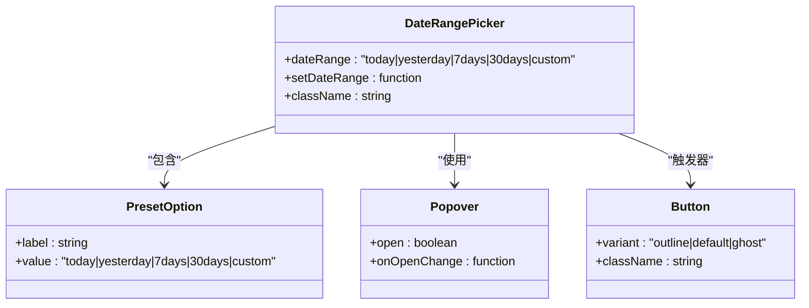
```mermaid
classDiagram
class DateRangePicker {
+dateRange : "today|yesterday|7days|30days|custom"
+setDateRange : function
+className : string
}
class PresetOption {
+label : string
+value : "today|yesterday|7days|30days|custom"
}
class Popover {
+open : boolean
+onOpenChange : function
}
class Button {
+variant : "outline|default|ghost"
+className : string
}
DateRangePicker --> PresetOption : "包含"
DateRangePicker --> Popover : "使用"
DateRangePicker --> Button : "触发器"
```

**图表来源**
- [src/components/date-range-picker.tsx:9-13](file://src/components/date-range-picker.tsx#L9-L13)
- [src/components/date-range-picker.tsx:22-28](file://src/components/date-range-picker.tsx#L22-L28)
- [src/components/date-range-picker.tsx:52-100](file://src/components/date-range-picker.tsx#L52-L100)

**章节来源**
- [src/components/date-range-picker.tsx:1-100](file://src/components/date-range-picker.tsx#L1-L100)
- [src/lib/utils.ts:4-6](file://src/lib/utils.ts#L4-L6)
- [tailwind.config.js:46-53](file://tailwind.config.js#L46-L53)
- [src/app/globals.css:53-75](file://src/app/globals.css#L53-L75)

### 白名单规则表单（WhitelistRuleForm）
- 设计理念
  - 基于自定义 UI 组件构建，包括 Input 和 Textarea 组件。
  - 支持策略选择、描述输入、优先级设置、API Key 关联等功能。
  - 内置预设模板选择器，支持 @ 符号快速选择预设。
  - 支持用户 ID 格式生成规则和校验规则的配置。
  - **新增** 液体玻璃效果：背景模糊、半透明和阴影效果，提升视觉质感。
- 关键功能
  - 策略管理：从 trpc.quota.getAllPolicies 获取策略列表
  - API Key 关联：支持选择关联的 API Key
  - 预设模板：支持 @ip、@user_id、@any 等预设模板
  - 校验规则：支持正则表达式和预设模板组合
- 关键组件
  - Input：用于策略名称、优先级、用户 ID 格式生成规则
  - Textarea：用于描述输入
  - Select：用于策略选择和 API Key 关联
  - Toggle：用于启用/禁用校验规则
- 样式来源
  - 类名合并：utils/cn
  - 主题变量：--background、--input、--ring、--muted-foreground

**更新** 白名单规则表单现已完全使用自定义 UI 组件替代通用 HTML 元素，包括：
- 输入框统一使用 Input 组件，支持液体玻璃效果
- 描述输入使用 Textarea 组件，提供多行文本输入能力
- 选择器使用 Select 组件，保持一致的样式和交互体验
- 预设模板选择器使用自定义下拉菜单，集成键盘导航和点击外部关闭功能
- 所有组件均支持液体玻璃样式系统，提供统一的视觉设计语言

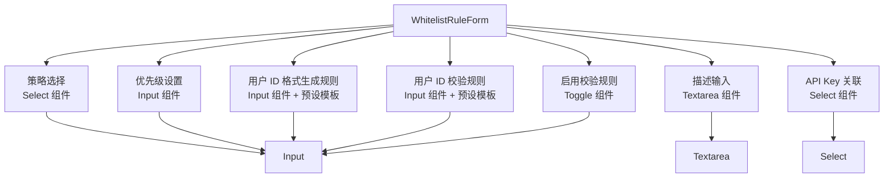
```mermaid
flowchart TD
Form["WhitelistRuleForm"] --> Policy["策略选择<br/>Select 组件"]
Form --> Description["描述输入<br/>Textarea 组件"]
Form --> Priority["优先级设置<br/>Input 组件"]
Form --> ApiKey["API Key 关联<br/>Select 组件"]
Form --> UserIdGen["用户 ID 格式生成规则<br/>Input 组件 + 预设模板"]
Form --> Validation["用户 ID 校验规则<br/>Input 组件 + 预设模板"]
Form --> Toggle["启用校验规则<br/>Toggle 组件"]
Policy --> Input
Description --> Textarea
Priority --> Input
ApiKey --> Select
UserIdGen --> Input
Validation --> Input
Toggle --> Input
```

**图表来源**
- [src/app/(dashboard)/users/components/whitelist-rule-form.tsx](file://src/app/(dashboard)/users/components/whitelist-rule-form.tsx#L123-L531)

**章节来源**
- [src/app/(dashboard)/users/components/whitelist-rule-form.tsx](file://src/app/(dashboard)/users/components/whitelist-rule-form.tsx#L1-L531)
- [src/components/ui/input.tsx:1-26](file://src/components/ui/input.tsx#L1-L26)
- [src/components/ui/textarea.tsx:1-38](file://src/components/ui/textarea.tsx#L1-L38)
- [src/components/ui/select.tsx:1-152](file://src/components/ui/select.tsx#L1-L152)
- [src/lib/utils.ts:4-6](file://src/lib/utils.ts#L4-L6)
- [tailwind.config.js:20-54](file://tailwind.config.js#L20-L54)
- [src/app/globals.css:53-75](file://src/app/globals.css#L53-L75)

### 区域热力图（RegionHeatmapChart）
- 设计理念
  - 基于 ECharts 的区域热力图可视化组件，展示中国各省份的请求分布情况。
  - 支持深色模式主题适配，自动检测系统主题偏好。
  - 使用本地 GeoJSON 数据源，提高系统可靠性。
  - **新增** 液体玻璃效果：背景模糊、半透明和阴影效果，提升视觉质感。
- 数据源优化
  - **更新** 从外部 Aliyun GeoJSON 端点改为使用本地静态文件 `/100000_full.json`
  - 减少对外部服务的依赖，提高系统稳定性和加载速度
  - 需要在部署环境中确保 `public/100000_full.json` 文件存在
- 关键功能
  - 地图注册：首次加载时注册中国地图 GeoJSON 数据
  - 深色模式支持：根据系统主题偏好动态切换颜色配置
  - 数据可视化：使用热力图展示各地区的请求次数和 Token 消耗
  - 响应式设计：支持窗口大小变化的自适应调整
- 关键属性
  - data：RegionDistributionItem[]，包含地区名称、请求次数、Token 消耗
  - loading：boolean，控制加载状态显示
- 状态与事件
  - 地图加载状态：mapReady、mapError
  - 加载指示：Spinner 组件显示加载状态
  - 错误处理：地图数据加载失败时显示错误提示
- 样式来源
  - 类名合并：utils/cn
  - 深色模式：自动适配深色背景与高对比度
  - ECharts 主题：根据系统主题偏好动态配置颜色方案

**更新** 区域热力图组件现已优化数据源，从外部 Aliyun GeoJSON 端点改为使用本地静态文件 `/100000_full.json`，显著提高了系统的可靠性和性能。部署时需要确保 `public/100000_full.json` 文件存在于服务器上。组件现已支持液体玻璃样式系统，提供统一的视觉设计语言。

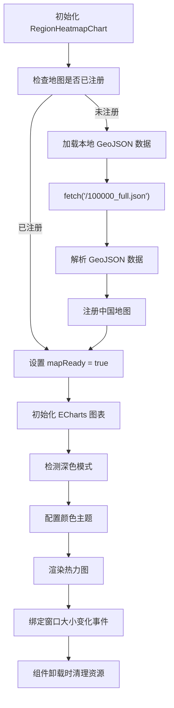
```mermaid
flowchart TD
Start["初始化 RegionHeatmapChart"] --> CheckMap["检查地图是否已注册"]
CheckMap --> |已注册| Ready["设置 mapReady = true"]
CheckMap --> |未注册| LoadData["加载本地 GeoJSON 数据"]
LoadData --> FetchData["fetch('/100000_full.json')"]
FetchData --> ParseData["解析 GeoJSON 数据"]
ParseData --> RegisterMap["注册中国地图"]
RegisterMap --> Ready
Ready --> InitChart["初始化 ECharts 图表"]
InitChart --> ThemeCheck["检测深色模式"]
ThemeCheck --> ConfigColors["配置颜色主题"]
ConfigColors --> RenderChart["渲染热力图"]
RenderChart --> Responsive["绑定窗口大小变化事件"]
Responsive --> Cleanup["组件卸载时清理资源"]
```

**图表来源**
- [src/app/(dashboard)/components/region-heatmap-chart.tsx](file://src/app/(dashboard)/components/region-heatmap-chart.tsx#L26-L59)

**章节来源**
- [src/app/(dashboard)/components/region-heatmap-chart.tsx](file://src/app/(dashboard)/components/region-heatmap-chart.tsx#L1-L175)
- [src/lib/utils.ts:4-6](file://src/lib/utils.ts#L4-L6)
- [tailwind.config.js:20-54](file://tailwind.config.js#L20-L54)
- [src/app/globals.css:53-75](file://src/app/globals.css#L53-L75)
- [public/100000_full.json:1-2](file://public/100000_full.json#L1-L2)

### 仪表板首页（HomePage）
- 设计理念
  - 集成 DatePickerWithRange 和 DateRangePicker 组件，提供灵活的日期筛选功能。
  - 支持预设日期范围和自定义日期范围两种选择方式。
  - 与 trpc 查询集成，实时获取仪表板统计数据。
  - **新增** 液体玻璃效果：背景模糊、半透明和阴影效果，营造统一的视觉设计语言。
- 关键功能
  - 日期范围状态管理：使用 useState 管理 dateRange 和自定义日期范围
  - 日期范围计算：根据选中的预设或自定义日期计算查询参数
  - 组件集成：DatePickerWithRange 和 DateRangePicker 与仪表板图表组件协同工作
  - 实时数据更新：根据日期范围变化自动重新查询数据
- 关键组件
  - DateRangePicker：预设日期范围选择
  - DatePickerWithRange：自定义日期范围选择
  - StatCard：统计卡片组件
  - 图表组件：UsageTrendChart、ModelDistributionChart、RegionHeatmapChart
- 样式来源
  - 类名合并：utils/cn
  - 主题变量：--background、--card、--popover、--muted-foreground

**更新** 仪表板首页现已集成 DatePickerWithRange 和 DateRangePicker 组件，提供完整的数据筛选功能，包括：
- 预设日期范围：DateRangePicker 组件提供今日、昨日、近7天、近30天、自定义等选项
- 自定义日期范围：DatePickerWithRange 组件提供现代化的范围选择界面
- 实时数据更新：日期范围变化时自动重新查询所有图表数据
- 响应式布局：日期选择器与数据更新时间显示在同一行
- 液体玻璃效果：所有组件均支持统一的液体玻璃样式系统

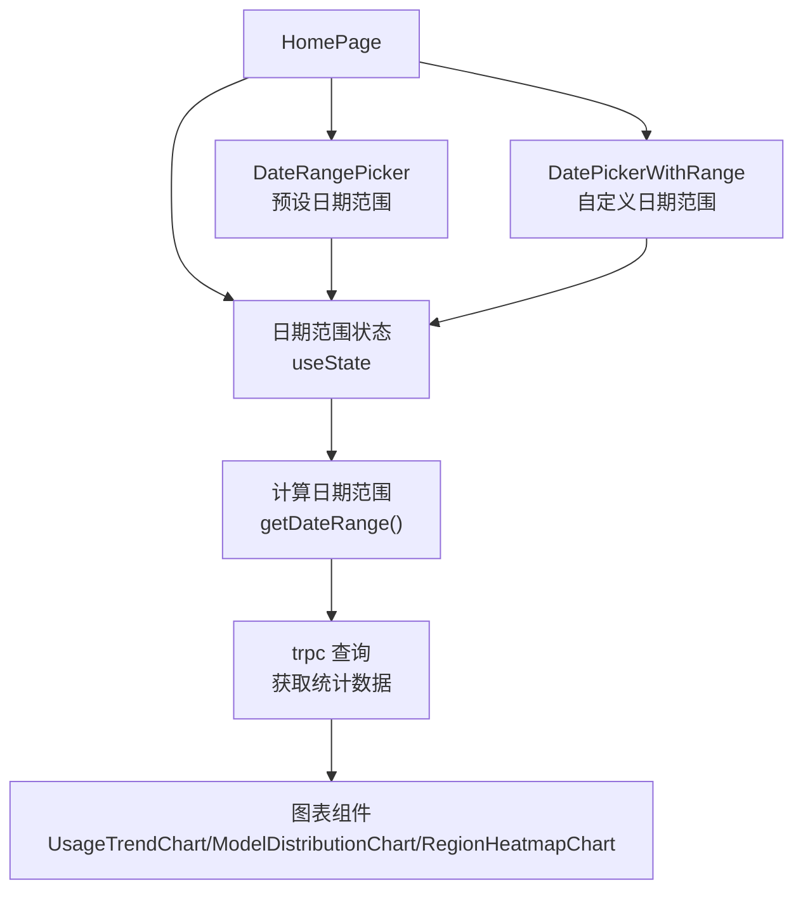
```mermaid
flowchart TD
HomePage["HomePage"] --> DateRange["日期范围状态<br/>useState"]
HomePage --> DateRangePicker["DateRangePicker<br/>预设日期范围"]
HomePage --> DatePickerWithRange["DatePickerWithRange<br/>自定义日期范围"]
DateRangePicker --> DateRange
DatePickerWithRange --> DateRange
DateRange --> CalcRange["计算日期范围<br/>getDateRange()"]
CalcRange --> Query["trpc 查询<br/>获取统计数据"]
Query --> Charts["图表组件<br/>UsageTrendChart/ModelDistributionChart/RegionHeatmapChart"]
```

**图表来源**
- [src/app/(dashboard)/page.tsx](file://src/app/(dashboard)/page.tsx#L15-L59)
- [src/app/(dashboard)/page.tsx](file://src/app/(dashboard)/page.tsx#L124-L139)

**章节来源**
- [src/app/(dashboard)/page.tsx](file://src/app/(dashboard)/page.tsx#L1-L230)
- [src/lib/utils.ts:4-6](file://src/lib/utils.ts#L4-L6)
- [tailwind.config.js:20-54](file://tailwind.config.js#L20-L54)
- [src/app/globals.css:53-75](file://src/app/globals.css#L53-L75)

## 液体玻璃样式系统

### 设计理念
液体玻璃样式系统是 AIGate UI 组件库的核心设计语言，旨在提供统一的现代视觉体验。该系统通过背景模糊、半透明和阴影效果，营造出类似液体玻璃的质感，提升组件的层次感和现代感。

### 核心特性
- **背景模糊**：使用 `backdrop-blur` 实现毛玻璃效果
- **半透明背景**：通过 RGBA 颜色值实现半透明效果
- **阴影系统**：使用多重阴影实现深度感和立体感
- **统一变量**：通过 CSS 变量实现主题一致性
- **深色模式适配**：自动适配深色模式的视觉效果

### 样式变量体系
液体玻璃样式系统基于以下 CSS 变量：
- `--glass-blur`: 模糊强度（默认 20px）
- `--glass-saturation`: 饱和度增强（默认 180%）
- `--card`: 卡片背景色（带半透明）
- `--popover`: 弹出层背景色（带半透明）
- `--primary-glass`: 主色调的玻璃效果

### 组件应用模式
液体玻璃效果通过以下模式应用到各个组件：
- **背景模糊**：`backdrop-blur-{size}` - 模糊强度递增
- **半透明**：`bg-{color}/{opacity}` - 颜色与透明度组合
- **边框**：`border border-{color}/{opacity}` - 半透明边框
- **阴影**：`shadow-{effect}` - 多重阴影组合
- **过渡**：`transition-all duration-{time}` - 平滑过渡动画

### 深色模式适配
液体玻璃样式系统在深色模式下自动调整：
- 背景色：从浅色系调整为深色系
- 透明度：优化对比度确保可读性
- 阴影：调整阴影颜色和强度
- 边框：使用更柔和的边框颜色

### 组件集成
液体玻璃样式系统已集成到所有核心组件：
- **Button**：新增 glass 变体，提供完整的液体玻璃效果
- **Dialog**：背景模糊和半透明，提升视觉质感
- **Table**：表格背景的液体玻璃效果
- **Sonner**：通知系统的液体玻璃样式
- **Popover**：弹出框的液体玻璃效果
- **Calendar**：日历组件的液体玻璃样式
- **DatePickerWithRange**：日期选择器的液体玻璃效果
- **DateRangePicker**：日期范围选择器的液体玻璃样式

**章节来源**
- [src/app/globals.css:5-136](file://src/app/globals.css#L5-L136)
- [src/components/ui/button.tsx:36-77](file://src/components/ui/button.tsx#L36-L77)
- [src/components/ui/dialog.tsx:1-121](file://src/components/ui/dialog.tsx#L1-L121)
- [src/components/ui/table.tsx:1-95](file://src/components/ui/table.tsx#L1-L95)
- [src/components/ui/sonner.tsx:1-46](file://src/components/ui/sonner.tsx#L1-L46)
- [src/components/ui/popover.tsx:1-32](file://src/components/ui/popover.tsx#L1-L32)
- [src/components/ui/calendar.tsx:1-223](file://src/components/ui/calendar.tsx#L1-L223)
- [src/components/date-picker-with-range.tsx:1-92](file://src/components/date-picker-with-range.tsx#L1-L92)
- [src/components/date-range-picker.tsx:1-100](file://src/components/date-range-picker.tsx#L1-L100)

## 深色模式主题检测机制

### 系统主题偏好监听
AIGate 采用现代化的深色模式检测机制，通过监听系统主题偏好变化实现动态切换：

- **媒体查询监听**：使用 `window.matchMedia('(prefers-color-scheme: dark)')` 监听系统主题变化
- **实时响应**：当系统主题发生变化时，组件能够实时更新样式
- **本地存储持久化**：用户手动切换后会保存到 localStorage 中，刷新页面后仍保持

### 图表组件深色模式支持
多个业务图表组件实现了完整的深色模式支持：

#### 使用趋势图表（UsageTrendChart）
- **主题配置**：根据 isDarkMode 状态动态切换颜色方案
- **透明背景**：使用 `transparent` 背景支持液体玻璃
- **颜色映射**：深色模式使用浅色系，浅色模式使用深色系
- **渐变效果**：areaStyle 使用线性渐变增强视觉层次

#### 活动项组件（ActivityItem）
- **状态颜色**：provider 颜色根据深色模式自动调整
- **悬停效果**：`hover:bg-gray-50 dark:hover:bg-gray-700` 实现平滑过渡
- **文本对比度**：确保在深色模式下具有足够的可读性

#### 最近IP请求组件（RecentIpRequests）
- **表格样式**：`dark:hover:bg-gray-700/50` 提供半透明悬停效果
- **分隔线适配**：`dark:divide-gray-700` 优化深色模式下的分隔线显示
- **代码块背景**：`dark:bg-gray-700` 保持代码高亮的一致性

#### 模型分布图（ModelDistributionChart）
- **占位符适配**：`dark:bg-gray-700` 在无数据时提供深色模式占位符
- **文本颜色**：确保在深色模式下具有适当的对比度

#### 区域热力图（RegionHeatmapChart）
- **数据源优化**：使用本地 GeoJSON 文件，提高加载速度和可靠性
- **错误状态**：`dark:bg-gray-700` 在地图数据加载失败时提供深色模式占位符
- **空状态**：`dark:text-gray-400` 优化空数据状态的显示

#### 统计卡片（StatCard）
- **玻璃效果**：`backdrop-blur-md` 和 `bg-card` 实现深色模式下的液体玻璃质感
- **边框适配**：`border-[var(--card-border)]` 动态适配深色模式边框
- **阴影效果**：`shadow-(--card-shadow)` 支持深色模式下的阴影配置

#### 日期选择器组件深色模式支持
- **Calendar**：日历组件的背景、文本、选中状态在深色模式下自动适配
- **DatePickerWithRange**：触发器按钮、日历内容、范围选择在深色模式下自动适配
- **DateRangePicker**：触发器按钮、弹出内容、预设选项在深色模式下自动适配
- **Popover 组件**：作为基础组件，为日期选择器提供统一的深色模式支持

### 深色模式样式优化要点
- **backdrop-blur**：广泛使用模糊效果增强液体玻璃质感
- **半透明背景**：使用 `/80`、`/50`、`/30` 等透明度值
- **颜色对比度**：确保深色模式下的可读性和对比度
- **过渡动画**：使用 `transition-colors` 实现平滑的颜色切换

**章节来源**
- [src/app/(dashboard)/components/usage-trend-chart.tsx](file://src/app/(dashboard)/components/usage-trend-chart.tsx#L20-L31)
- [src/app/(dashboard)/components/usage-trend-chart.tsx](file://src/app/(dashboard)/components/usage-trend-chart.tsx#L38-L55)
- [src/app/(dashboard)/components/activity-item.tsx](file://src/app/(dashboard)/components/activity-item.tsx#L40-L50)
- [src/app/(dashboard)/components/recent-ip-requests.tsx](file://src/app/(dashboard)/components/recent-ip-requests.tsx#L150-L154)
- [src/app/(dashboard)/components/model-distribution-chart.tsx](file://src/app/(dashboard)/components/model-distribution-chart.tsx#L113-L116)
- [src/app/(dashboard)/components/region-heatmap-chart.tsx](file://src/app/(dashboard)/components/region-heatmap-chart.tsx#L154-L167)
- [src/app/(dashboard)/components/stat-card.tsx](file://src/app/(dashboard)/components/stat-card.tsx#L40-L52)
- [src/components/dashboard-layout.tsx:98-132](file://src/components/dashboard-layout.tsx#L98-L132)
- [src/components/ui/calendar.tsx:34-38](file://src/components/ui/calendar.tsx#L34-L38)
- [src/components/date-picker-with-range.tsx:46-49](file://src/components/date-picker-with-range.tsx#L46-L49)
- [src/components/date-range-picker.tsx:58-61](file://src/components/date-range-picker.tsx#L58-L61)
- [src/components/ui/popover.tsx:21-27](file://src/components/ui/popover.tsx#L21-L27)

## 样式标准化与迁移

### 从CSS变量系统到标准Tailwind类的迁移
AIGate UI 组件系统已完成从传统的 CSS 变量系统向标准 Tailwind 类使用模式的重大迁移，这一变更显著提升了样式的可维护性和开发体验。

#### 迁移前的CSS变量系统特点
- 使用 `var(--primary)`、`var(--card)` 等 CSS 变量进行主题控制
- 通过 `:root` 和 `.dark` 类别定义明暗两套主题变量
- 组件内部大量使用内联 CSS 变量样式
- 样式逻辑分散在多个文件中，维护成本较高

#### 迁移后的标准Tailwind类使用模式
- 直接使用 Tailwind 实用类，如 `bg-[var(--primary)]`、`text-[var(--primary-foreground)]`
- 通过 Tailwind 配置文件集中管理主题变量映射
- 组件样式更加直观和可读
- 减少了 CSS 变量的使用，提升了样式性能

#### 样式标准化的具体改进

**Button 组件的样式标准化**
```typescript
// 迁移前：使用CSS变量
"bg-[var(--primary)] text-[var(--primary-foreground)] hover:shadow-lg hover:shadow-[var(--primary)]/25"

// 迁移后：使用液体玻璃效果
"bg-white/15 dark:bg-black/20 text-foreground backdrop-blur-2xl backdrop-saturate-[1.8] border border-white/25 dark:border-white/8 shadow-[0_8px_32px_rgba(0,0,0,0.12),inset_1px_1px_0_rgba(255,255,255,0.6),inset_0_0_8px_rgba(255,255,255,0.15)] hover:bg-white/20 dark:hover:bg-black/25 hover:shadow-[0_12px_40px_rgba(0,0,0,0.16),inset_1px_1px_0_rgba(255,255,255,0.7),inset_0_0_12px_rgba(255,255,255,0.2)]"
```

**Dialog 组件的样式标准化**
```typescript
// 统一使用液体玻璃效果
"fixed inset-0 z-50 bg-black/40 backdrop-blur-sm"
"rounded-2xl p-6 backdrop-blur-xl bg-white/60 dark:bg-black/30 border border-white/30 dark:border-white/10 shadow-[0_8px_32px_rgba(0,0,0,0.08),inset_0_1px_0_rgba(255,255,255,0.4)]"
```

**Table 组件的液体玻璃优化**
```typescript
// 使用液体玻璃效果
"border-gray-200 dark:border-slate-700 transition-colors hover:bg-gray-50 dark:hover:bg-slate-800/50"
"bg-white/50 dark:bg-black/25 backdrop-blur-xl border border-white/30 dark:border-white/10 shadow-[0_8px_32px_rgba(0,0,0,0.1),inset_0_1px_0_rgba(255,255,255,0.4)]"
"dark:text-gray-300"
```

**Textarea 组件的样式标准化**
```typescript
// 使用液体玻璃效果
"flex min-h-[80px] w-full rounded-xl px-3 py-2 text-base ring-offset-background placeholder:text-muted-foreground/60 focus-visible:outline-none focus-visible:ring-2 focus-visible:ring-white/30 focus-visible:ring-offset-2 disabled:cursor-not-allowed disabled:opacity-50 md:text-sm bg-white/15 dark:bg-black/20 backdrop-blur-lg backdrop-saturate-[1.5] border border-white/25 dark:border-white/10 shadow-[0_2px_8px_rgba(0,0,0,0.06),inset_0_1px_0_rgba(255,255,255,0.3)] focus:bg-white/20 dark:focus:bg-black/25 hover:bg-white/20 dark:hover:bg-black/25 transition-all duration-200 ease-[cubic-bezier(0.34,1.56,0.64,1)]"
```

**Slider 组件的样式标准化**
```typescript
// 使用液体玻璃效果
"relative flex w-full touch-none select-none items-center"
"bg-secondary backdrop-blur-lg backdrop-saturate-[1.5]"
"bg-primary"
"bg-background border-primary backdrop-blur-lg backdrop-saturate-[1.5]"
"focus-visible:ring-ring"
```

**Tabs 组件的样式标准化**
```typescript
// 使用液体玻璃效果
"inline-flex h-10 items-center justify-center rounded-md bg-muted p-1 text-muted-foreground backdrop-blur-lg backdrop-saturate-[1.5]"
"inline-flex items-center justify-center whitespace-nowrap rounded-sm px-3 py-1.5 text-sm font-medium ring-offset-background transition-all focus-visible:outline-none focus-visible:ring-2 focus-visible:ring-ring focus-visible:ring-offset-2 disabled:pointer-events-none disabled:opacity-50 data-[state=active]:bg-background data-[state=active]:text-foreground data-[state=active]:shadow-sm"
```

**Sonner 通知组件的样式标准化**
```typescript
// 使用液体玻璃效果
"group toast group-[.toaster]:bg-white/15 group-[.toaster]:text-foreground group-[.toaster]:border-white/25 group-[.toaster]:shadow-lg backdrop-blur-lg backdrop-saturate-[1.5]"
"group-[.toast]:bg-primary group-[.toast]:text-primary-foreground"
"group-[.toast]:bg-muted group-[.toast]:text-muted-foreground"
```

**Popover 组件的样式标准化**
```typescript
// 使用液体玻璃效果
"z-50 w-72 rounded-md border bg-white/80 dark:bg-black/40 p-4 text-foreground shadow-md outline-none data-[state=open]:animate-in data-[state=closed]:animate-out backdrop-blur-2xl backdrop-saturate-[1.5]"
"data-[state=closed]:fade-out-0 data-[state=open]:fade-in-0 data-[state=closed]:zoom-out-95 data-[state=open]:zoom-in-95"
```

**Calendar 组件的样式标准化**
```typescript
// 使用液体玻璃效果
"p-2 [--cell-radius:var(--radius-md)] [--cell-size:--spacing(7)] group/calendar bg-white/40 dark:bg-white/10 in-data-[slot=card-content]:bg-transparent in-data-[slot=popover-content]:bg-transparent backdrop-blur-lg backdrop-saturate-[1.5]"
"bg-white/40 dark:bg-white/10 border border-white/30 dark:border-white/10 hover:bg-white/60 dark:hover:bg-white/20"
"bg-white/15 dark:bg-black/20 border border-white/25 dark:border-white/10"
"data-[selected=true]:bg-primary"
```

**DatePickerWithRange 组件的样式标准化**
```typescript
// 使用液体玻璃效果
"w-75 justify-start text-left font-normal rounded-xl bg-white/40 dark:bg-white/5 backdrop-blur-lg backdrop-saturate-[1.5] border border-white/25 dark:border-white/10 shadow-[0_2px_8px_rgba(0,0,0,0.06),inset_0_1px_0_rgba(255,255,255,0.3)] hover:bg-white/50 dark:hover:bg-white/10 hover:shadow-[0_4px_12px_rgba(0,0,0,0.1)] transition-all duration-200 ease-[cubic-bezier(0.34,1.56,0.64,1)]"
"w-auto p-0 rounded-2xl backdrop-blur-2xl bg-white/80 dark:bg-black/40 border border-white/30 dark:border-white/15 shadow-[0_16px_48px_rgba(0,0,0,0.15),inset_1px_1px_0_rgba(255,255,255,0.5)]"
"bg-white/15 dark:bg-black/20 border border-white/25 dark:border-white/10"
"text-foreground"
"border-white/25 dark:border-white/10"
"data-[range-start=true]:bg-primary"
"data-[range-end=true]:bg-primary"
```

**DateRangePicker 组件的样式标准化**
```typescript
// 使用液体玻璃效果
"w-45 justify-start text-left font-normal rounded-xl bg-white/40 dark:bg-white/5 backdrop-blur-lg backdrop-saturate-[1.5] border border-white/25 dark:border-white/10 shadow-[0_2px_8px_rgba(0,0,0,0.06),inset_0_1px_0_rgba(255,255,255,0.3)] hover:bg-white/50 dark:hover:bg-white/10 hover:shadow-[0_4px_12px_rgba(0,0,0,0.1)] transition-all duration-200 ease-[cubic-bezier(0.34,1.56,0.64,1)]"
"w-45 p-2 rounded-2xl backdrop-blur-2xl bg-white/80 dark:bg-black/40 border border-white/30 dark:border-white/15 shadow-[0_16px_48px_rgba(0,0,0,0.15),inset_1px_1px_0_rgba(255,255,255,0.5)]"
"bg-white/15 dark:bg-black/20 border border-white/25 dark:border-white/10"
"text-foreground"
"border-white/25 dark:border-white/10"
```

#### 迁移带来的优势
- **更好的开发体验**：开发者可以直接看到最终的样式效果，无需查看 CSS 变量定义
- **更强的类型安全**：Tailwind 类名在编译时进行验证，减少了运行时错误
- **更佳的性能表现**：减少了 CSS 变量的解析和计算开销
- **统一的样式约定**：所有组件都遵循相同的样式使用模式

#### 液体玻璃模式支持的标准化
- 统一使用 `backdrop-blur`、`backdrop-saturate` 和透明度组合
- 通过 Tailwind 配置文件集中管理液体玻璃变量
- 组件内部不再需要复杂的液体玻璃效果逻辑
- 样式切换更加流畅和一致

**章节来源**
- [src/components/ui/button.tsx:8-21](file://src/components/ui/button.tsx#L8-L21)
- [src/components/ui/dialog.tsx:22-41](file://src/components/ui/dialog.tsx#L22-L41)
- [src/components/ui/table.tsx:50-68](file://src/components/ui/table.tsx#L50-L68)
- [src/components/ui/data-table.tsx:94-115](file://src/components/ui/data-table.tsx#L94-L115)
- [src/components/ui/textarea.tsx:10-18](file://src/components/ui/textarea.tsx#L10-L18)
- [src/components/ui/slider.tsx:14-24](file://src/components/ui/slider.tsx#L14-L24)
- [src/components/ui/tabs.tsx:16-37](file://src/components/ui/tabs.tsx#L16-L37)
- [src/components/ui/sonner.tsx:30-39](file://src/components/ui/sonner.tsx#L30-L39)
- [src/components/ui/popover.tsx:21-29](file://src/components/ui/popover.tsx#L21-L29)
- [src/components/ui/calendar.tsx:34-38](file://src/components/ui/calendar.tsx#L34-L38)
- [src/components/date-picker-with-range.tsx:46-49](file://src/components/date-picker-with-range.tsx#L46-L49)
- [src/components/date-range-picker.tsx:58-61](file://src/components/date-range-picker.tsx#L58-L61)
- [tailwind.config.js:20-54](file://tailwind.config.js#L20-L54)
- [src/app/globals.css:53-118](file://src/app/globals.css#L53-L118)

## 密码可见性切换按钮实现

### 设计理念
密码可见性切换按钮是基于 Input 组件的增强功能，旨在提供更好的用户体验。该功能通过相对定位的容器和绝对定位的按钮实现，确保按钮始终位于输入框右侧，不影响整体布局。

### 技术实现
- **相对定位容器**：使用 `relative` 容器包装 Input 组件，为绝对定位按钮提供定位上下文
- **绝对定位按钮**：使用 `absolute inset-y-0 right-0` 实现按钮的绝对定位，垂直居中且固定在右侧
- **内边距调整**：通过 `pr-10` 为输入框右侧预留空间，避免文本被按钮遮挡
- **图标切换**：根据密码显示状态动态切换 Eye 和 EyeOff 图标
- **样式设计**：使用 `text-muted-foreground hover:text-foreground` 实现状态变化的视觉反馈

### 核心实现细节

**登录页面中的实现**
```typescript
<div className="relative">
  <Input
    id="password"
    name="password"
    type={showPassword ? 'text' : 'password'}
    autoComplete="current-password"
    required
    value={password}
    onChange={(e) => setPassword(e.target.value)}
    className="appearance-none rounded-none relative block w-full px-3 py-2 border border-gray-300 placeholder-gray-500 text-gray-900 rounded-b-md focus:outline-none focus:ring-indigo-500 focus:border-indigo-500 focus:z-10 sm:text-sm pr-10"
    placeholder="密码"
  />
  <button
    type="button"
    className="absolute inset-y-0 right-0 flex items-center pr-3 text-gray-400 hover:text-gray-600"
    onClick={() => setShowPassword(!showPassword)}
  >
    {showPassword ? <EyeOff className="h-4 w-4" /> : <Eye className="h-4 w-4" />}
  </button>
</div>
```

**设置页面中的实现**
```typescript
<div className="relative">
  <Input
    id="password"
    type={showPassword ? 'text' : 'password'}
    value={password}
    onChange={(e) => setPassword(e.target.value)}
    placeholder="请输入新密码"
    required
    className="bg-background border-input pr-10"
  />
  <button
    type="button"
    className="absolute inset-y-0 right-0 flex items-center pr-3 text-muted-foreground hover:text-foreground"
    onClick={() => setShowPassword(!showPassword)}
  >
    {showPassword ? <EyeOff className="h-4 w-4" /> : <Eye className="h-4 w-4" />}
  </button>
</div>
```

### 样式系统集成
- **类名合并**：使用 utils/cn 合并绝对定位类名和状态类名
- **主题变量**：使用 `text-muted-foreground` 和 `hover:text-foreground` 适配深色模式
- **响应式设计**：按钮在不同设备上保持一致的视觉效果
- **无障碍支持**：按钮具备可访问的文本和状态反馈

### 用户体验优化
- **即时反馈**：点击按钮立即切换密码显示状态
- **视觉一致性**：按钮样式与整体设计语言保持一致
- **无障碍导航**：支持键盘导航和屏幕阅读器访问
- **状态持久化**：用户可以在不同页面间保持密码显示状态

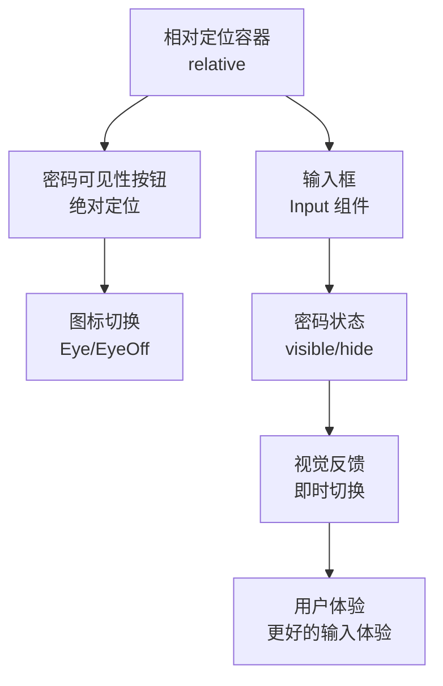
```mermaid
flowchart TD
Container["相对定位容器<br/>relative"] --> InputBox["输入框<br/>Input 组件"]
Container --> Button["密码可见性按钮<br/>绝对定位"]
Button --> Icon["图标切换<br/>Eye/EyeOff"]
InputBox --> State["密码状态<br/>visible/hide"]
State --> Effect["视觉反馈<br/>即时切换"]
Effect --> User["用户体验<br/>更好的输入体验"]
```

**图表来源**
- [src/app/login/page.tsx:78-97](file://src/app/login/page.tsx#L78-L97)
- [src/app/settings/page.tsx:102-119](file://src/app/settings/page.tsx#L102-L119)

**章节来源**
- [src/app/login/page.tsx:78-97](file://src/app/login/page.tsx#L78-L97)
- [src/app/settings/page.tsx:102-119](file://src/app/settings/page.tsx#L102-L119)
- [src/components/ui/input.tsx:1-26](file://src/components/ui/input.tsx#L1-L26)
- [src/lib/utils.ts:4-6](file://src/lib/utils.ts#L4-L6)
- [tailwind.config.js:20-54](file://tailwind.config.js#L20-L54)
- [src/app/globals.css:53-75](file://src/app/globals.css#L53-L75)

## 日期选择器组件集成

### 设计理念
日期选择器组件是 AIGate 仪表板功能的重要组成部分，提供灵活的数据筛选能力。DatePickerWithRange 和 DateRangePicker 组件基于不同的技术栈构建，分别提供现代化的范围选择和传统预设选择功能。

### 技术架构
- **DatePickerWithRange**：基于 react-day-picker 实现，提供现代化的范围选择体验
- **DateRangePicker**：基于 Popover 组件构建，提供预设日期范围选择功能
- **状态管理**：使用 useState 管理组件的打开状态和用户选择状态
- **事件处理**：通过回调函数与父组件通信，传递日期范围选择结果
- **样式集成**：统一使用 utils/cn 进行类名合并，适配液体玻璃主题

### DatePickerWithRange 组件特性
- **范围选择**：使用 Calendar 的 range 模式支持开始日期和结束日期的范围选择
- **多月显示**：支持同时显示 2 个月份，便于范围选择和比较
- **国际化**：支持 zhCN 本地化配置，提供中文日期格式化
- **触发器设计**：使用 Button 组件作为触发器，显示当前选中的日期范围
- **日历集成**：直接使用 Calendar 组件，保持一致的样式和交互体验
- **液体玻璃效果**：所有样式均支持液体玻璃效果，提供统一的视觉设计语言

### DateRangePicker 组件特性
- **预设选项**：提供今日、昨日、近7天、近30天、自定义五种常用日期范围
- **触发器设计**：使用 Button 组件作为触发器，显示当前选中的日期范围
- **弹出菜单**：显示所有预设选项的列表，支持点击选择
- **状态同步**：选中状态通过 dateRange 属性与父组件同步
- **液体玻璃效果**：所有样式均支持液体玻璃效果，提供统一的视觉设计语言

### 在仪表板中的集成
- **位置布局**：位于仪表板标题下方，与数据更新时间显示在同一行
- **条件显示**：当选择自定义日期范围时显示 DatePickerWithRange
- **数据联动**：两个组件的选择都会触发仪表板数据的重新查询
- **响应式设计**：在不同屏幕尺寸下保持良好的显示效果

### 样式系统集成
- **类名合并**：使用 utils/cn 合并组件特有的类名和状态类名
- **主题变量**：使用 Popover 和 Calendar 组件的 CSS 变量，自动适配液体玻璃主题
- **尺寸控制**：通过 w-75 和 w-45 类名控制组件宽度
- **间距管理**：使用 gap-4 类名控制组件间的间距

### 用户体验优化
- **即时反馈**：选择日期范围后立即更新图表数据
- **视觉提示**：选中的预设选项使用默认样式突出显示
- **范围指示**：DatePickerWithRange 提供清晰的范围选择视觉反馈
- **无障碍支持**：支持键盘导航和屏幕阅读器访问

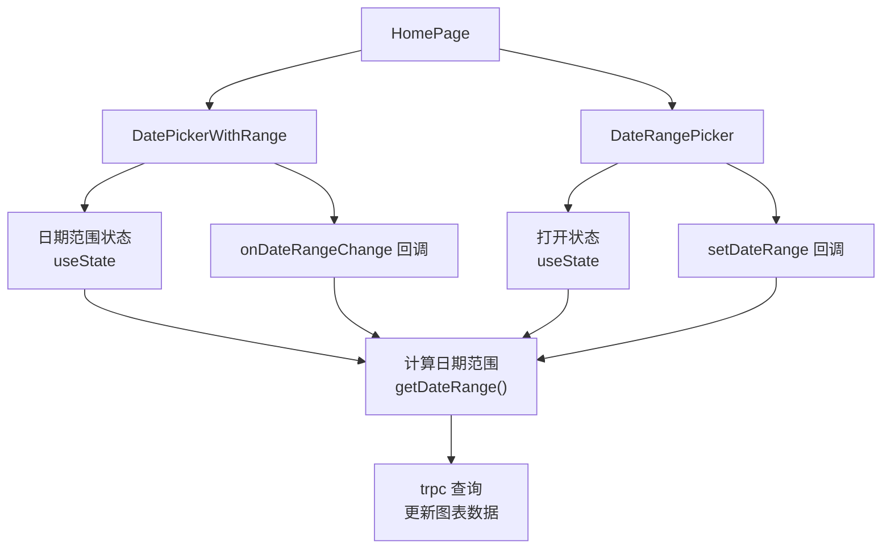
```mermaid
flowchart TD
HomePage["HomePage"] --> DRWR["DatePickerWithRange"]
HomePage --> DRP["DateRangePicker"]
DRWR --> State["日期范围状态<br/>useState"]
DRP --> OpenState["打开状态<br/>useState"]
DRWR --> Callback["onDateRangeChange 回调"]
DRP --> SetDateRange["setDateRange 回调"]
State --> CalcRange["计算日期范围<br/>getDateRange()"]
OpenState --> CalcRange
Callback --> CalcRange
SetDateRange --> CalcRange
CalcRange --> Query["trpc 查询<br/>更新图表数据"]
```

**图表来源**
- [src/app/(dashboard)/page.tsx](file://src/app/(dashboard)/page.tsx#L15-L59)
- [src/components/date-picker-with-range.tsx:27-37](file://src/components/date-picker-with-range.tsx#L27-L37)
- [src/components/date-range-picker.tsx:20-50](file://src/components/date-range-picker.tsx#L20-L50)

**章节来源**
- [src/app/(dashboard)/page.tsx](file://src/app/(dashboard)/page.tsx#L124-L139)
- [src/components/date-picker-with-range.tsx:1-92](file://src/components/date-picker-with-range.tsx#L1-L92)
- [src/components/date-range-picker.tsx:1-100](file://src/components/date-range-picker.tsx#L1-L100)
- [src/lib/utils.ts:4-6](file://src/lib/utils.ts#L4-L6)
- [tailwind.config.js:46-53](file://tailwind.config.js#L46-L53)
- [src/app/globals.css:53-75](file://src/app/globals.css#L53-L75)

## 区域热力图数据源优化

### 数据源变更概述
区域热力图可视化组件已进行重要数据源优化，将外部 Aliyun GeoJSON 端点替换为本地静态文件路径，显著提高了系统的可靠性并减少了对外部服务的依赖。

### 变更详情
- **数据源迁移**：从外部 Aliyun GeoJSON 端点改为使用本地静态文件 `/100000_full.json`
- **可靠性提升**：使用本地文件减少了网络延迟和外部服务故障的风险
- **性能优化**：本地文件加载速度更快，提升了用户体验
- **部署要求**：需要确保 `public/100000_full.json` 文件存在于部署环境中

### 技术实现
- **本地文件路径**：`/100000_full.json` 相对于网站根目录的静态文件路径
- **文件格式**：完整的 GeoJSON 格式，包含中国省级行政区的地理信息
- **文件位置**：位于 `public/` 目录下，确保静态文件可被客户端访问
- **错误处理**：保留原有的错误处理机制，确保文件加载失败时的降级显示

### 部署注意事项
- **文件完整性**：确保 `public/100000_full.json` 文件完整且可访问
- **文件权限**：确保 Web 服务器对静态文件具有正确的读取权限
- **缓存策略**：考虑对静态 GeoJSON 文件设置合适的缓存策略
- **备份策略**：建议对重要的静态文件进行备份，防止意外丢失

### 性能影响
- **加载速度**：本地文件加载速度通常快于外部网络请求
- **稳定性**：减少外部服务故障对系统可用性的影响
- **带宽消耗**：避免重复下载相同数据，节省带宽资源
- **用户体验**：更快的初始加载时间和更稳定的图表显示

### 兼容性考虑
- **浏览器支持**：现代浏览器均支持 fetch API 和 JSON 解析
- **降级处理**：保留原有的错误处理逻辑，确保兼容性
- **主题适配**：与现有的液体玻璃样式支持保持一致
- **响应式设计**：与现有的响应式布局保持兼容

**章节来源**
- [src/app/(dashboard)/components/region-heatmap-chart.tsx](file://src/app/(dashboard)/components/region-heatmap-chart.tsx#L7-L7)
- [src/app/(dashboard)/components/region-heatmap-chart.tsx](file://src/app/(dashboard)/components/region-heatmap-chart.tsx#L36-L51)
- [src/app/(dashboard)/components/region-heatmap-chart.tsx](file://src/app/(dashboard)/components/region-heatmap-chart.tsx#L154-L167)
- [public/100000_full.json:1-2](file://public/100000_full.json#L1-L2)

## 依赖关系分析
- 组件依赖
  - Radix UI：Dialog、Select、Checkbox、Label、Slot、Slider、Tabs、Popover
  - @tanstack/react-table：DataTable
  - class-variance-authority：Button、Label 变体
  - lucide-react：图标（X、ChevronLeft/Right、Check、MoreHorizontal、CircleCheck、Info、LoaderCircle、OctagonX、TriangleAlert、Eye、EyeOff、Calendar）
  - echarts：图表组件（UsageTrendChart、ModelDistributionChart、RegionHeatmapChart）
  - sonner：通知系统（Toaster）
  - next-themes：主题检测与切换
  - **新增** react-day-picker：现代化日历组件，用于 DatePickerWithRange 和 Calendar
  - **新增** date-fns：日期格式化和本地化支持
  - **新增** clsx：类名合并工具
  - **新增** tailwind-merge：Tailwind 类名合并优化
- 工具与样式
  - utils/cn：类名合并与冲突修复
  - Tailwind v4：CSS 变量映射与动画插件
  - globals.css：CSS 变量与液体玻璃样式


```mermaid
graph TB
PKG["package.json 依赖"] --> RADIX["@radix-ui/*"]
PKG --> TABLE["@tanstack/react-table"]
PKG --> CVA["class-variance-authority"]
PKG --> LUCIDE["lucide-react"]
PKG --> ECHARTS["echarts"]
PKG --> SONNER["sonner"]
PKG --> NEXTTHEMES["next-themes"]
PKG --> DAYPICKER["react-day-picker"]
PKG --> DATEFNS["date-fns"]
PKG --> CLSX["clsx"]
PKG --> TWMERGE["tailwind-merge"]
BTN["Button"] --> CVA
BTN --> RADIX
BTN --> GLASS["液体玻璃系统"]
DLG["Dialog"] --> RADIX
SEL["Select"] --> RADIX
SLD["Slider"] --> RADIX
TAB["Tabs"] --> RADIX
POP["Popover"] --> RADIX
CAL["Calendar"] --> DAYPICKER
DRWR["DatePickerWithRange"] --> CAL
DRP["DateRangePicker"] --> POP
DTBL["DataTable"] --> TABLE
PAG["Pagination"] --> BTN
SON["Sonner"] --> SONNER
SON --> NEXTTHEMES
TX["Textarea"] --> IN["Input 基础"]
TX --> GLASS
WLF["WhitelistRuleForm"] --> IN
WLF --> TX
PWD["密码可见性切换按钮"] --> IN
DATA["本地GeoJSON数据源"] --> RHC["RegionHeatmapChart"]
HOME["HomePage"] --> DRWR
HOME --> DRP
HOME --> DATE["日期工具"]
U["utils/cn"] --> CLSX
U --> TWMERGE
TW["Tailwind v4"] --> TWMERGE
CSS["液体玻璃样式"] --> BTN
CSS --> DLG
CSS --> TBL
CSS --> SON
CSS --> POP
CSS --> CAL
CSS --> DRWR
CSS --> DRP
DARK["深色模式检测"] --> NEXTTHEMES
DARK --> ECHARTS
```

**图表来源**
- [package.json:18-68](file://package.json#L18-L68)
- [src/components/ui/button.tsx:1-5](file://src/components/ui/button.tsx#L1-L5)
- [src/components/ui/dialog.tsx:1-5](file://src/components/ui/dialog.tsx#L1-L5)
- [src/components/ui/select.tsx:1-5](file://src/components/ui/select.tsx#L1-L5)
- [src/components/ui/slider.tsx:1-5](file://src/components/ui/slider.tsx#L1-L5)
- [src/components/ui/tabs.tsx:1-5](file://src/components/ui/tabs.tsx#L1-L5)
- [src/components/ui/popover.tsx:1-5](file://src/components/ui/popover.tsx#L1-L5)
- [src/components/ui/calendar.tsx:1-13](file://src/components/ui/calendar.tsx#L1-L13)
- [src/components/date-picker-with-range.tsx:1-12](file://src/components/date-picker-with-range.tsx#L1-L12)
- [src/components/date-range-picker.tsx:1-7](file://src/components/date-range-picker.tsx#L1-L7)
- [src/components/ui/data-table.tsx:4-14](file://src/components/ui/data-table.tsx#L4-L14)
- [src/components/ui/pagination.tsx:1-5](file://src/components/ui/pagination.tsx#L1-L5)
- [src/components/ui/sonner.tsx:1-11](file://src/components/ui/sonner.tsx#L1-L11)
- [src/components/ui/textarea.tsx:1-5](file://src/components/ui/textarea.tsx#L1-L5)
- [src/app/(dashboard)/users/components/whitelist-rule-form.tsx](file://src/app/(dashboard)/users/components/whitelist-rule-form.tsx#L4-L14)
- [src/lib/utils.ts:1-6](file://src/lib/utils.ts#L1-L6)
- [tailwind.config.js:1-78](file://tailwind.config.js#L1-L78)

**章节来源**
- [package.json:18-68](file://package.json#L18-L68)
- [components.json:1-18](file://components.json#L1-L18)

## 性能与可访问性
- 性能
  - Button/Pagination/Select/Checkbox/Label/Silder/Tabs/Textarea/Popover/密码可见性切换按钮/日期选择器 均使用 forwardRef 与透传属性，减少额外包裹。
  - DataTable 使用 useReactTable 管理状态，分页与过滤按需渲染，避免全量重算。
  - Dialog/Select/Popover 使用 Portal 渲染，减少 DOM 层级对布局的影响。
  - **新增** Calendar 组件基于 react-day-picker，提供高性能的日历渲染和交互。
  - **新增** DatePickerWithRange 组件基于 Calendar，提供高效的范围选择体验。
  - **新增** Slider 组件基于 @radix-ui/react-slider，提供高性能的滑块交互。
  - **新增** Tabs 组件基于 @radix-ui/react-tabs，提供高效的标签页切换。
  - **新增** Sonner 通知系统基于轻量级实现，提供快速的通知显示。
  - **新增** Popover 组件基于 @radix-ui/react-popover，提供高性能的弹出式内容展示。
  - **新增** DateRangePicker 组件基于 Popover，提供高效的日期范围选择功能。
  - **新增** 图表组件使用媒体查询监听，避免不必要的重新渲染。
  - **新增** Textarea 组件优化多行文本输入性能。
  - **新增** 密码可见性切换按钮使用状态管理，避免不必要的重新渲染。
  - **新增** 区域热力图组件使用本地数据源，提高加载性能。
  - **新增** 液体玻璃样式系统使用 CSS 变量，提升渲染性能。
  - **样式标准化**：迁移后的 Tailwind 类使用模式提升了样式解析性能。
- 可访问性
  - Dialog：关闭按钮包含 sr-only 文本；Overlay/Content 使用 data-[state] 控制动画，保证状态同步。
  - Pagination：当前页使用 aria-current="page"；省略号使用 sr-only 标注。
  - Select：Viewport 自适应触发器尺寸，滚动按钮提供上下滚动能力。
  - Label：语义化关联表单控件，禁用态半透明提示。
  - **新增** Calendar：支持完整的键盘导航（Tab、方向键、Enter、Space）和屏幕阅读器访问。
  - **新增** DatePickerWithRange：支持键盘导航、范围选择和无障碍状态反馈。
  - **新增** Slider：支持完整的键盘导航（Arrow Left/Right、Home、End、Page Up/Down）和屏幕阅读器访问。
  - **新增** Tabs：支持键盘导航、无障碍访问和动态内容切换。
  - **新增** Sonner：支持屏幕阅读器友好和键盘导航。
  - **新增** Popover：支持键盘导航和屏幕阅读器访问，Portal -rendering 避免层级问题。
  - **新增** DateRangePicker：支持键盘导航，预设选项可通过键盘选择。
  - **新增** Textarea：支持自动调整高度和液体玻璃样式适配。
  - **新增** 密码可见性切换按钮：支持键盘导航和屏幕阅读器访问，提供状态反馈。
  - **新增** 区域热力图：支持深色模式下的颜色对比度和可读性。
  - **新增** 液体玻璃样式系统：所有组件均支持 CSS 自定义属性，确保在深色模式下的可访问性。

**章节来源**
- [src/components/ui/dialog.tsx:45-48](file://src/components/ui/dialog.tsx#L45-L48)
- [src/components/ui/pagination.tsx:49-58](file://src/components/ui/pagination.tsx#L49-L58)
- [src/components/ui/select.tsx:64-88](file://src/components/ui/select.tsx#L64-L88)
- [src/components/ui/label.tsx:15-21](file://src/components/ui/label.tsx#L15-L21)
- [src/components/ui/calendar.tsx:183-220](file://src/components/ui/calendar.tsx#L183-L220)
- [src/components/date-picker-with-range.tsx:32-37](file://src/components/date-picker-with-range.tsx#L32-L37)
- [src/components/ui/slider.tsx:20-24](file://src/components/ui/slider.tsx#L20-L24)
- [src/components/ui/tabs.tsx:25-53](file://src/components/ui/tabs.tsx#L25-L53)
- [src/components/ui/sonner.tsx:15-46](file://src/components/ui/sonner.tsx#L15-L46)
- [src/components/ui/popover.tsx:15-29](file://src/components/ui/popover.tsx#L15-L29)
- [src/components/date-range-picker.tsx:70-78](file://src/components/date-range-picker.tsx#L70-L78)
- [src/components/ui/textarea.tsx:10-18](file://src/components/ui/textarea.tsx#L10-L18)
- [src/app/login/page.tsx:90-96](file://src/app/login/page.tsx#L90-L96)
- [src/app/settings/page.tsx:112-118](file://src/app/settings/page.tsx#L112-L118)
- [src/app/(dashboard)/components/region-heatmap-chart.tsx](file://src/app/(dashboard)/components/region-heatmap-chart.tsx#L154-L167)

## 样式系统与主题定制
- Tailwind v4 集成
  - tailwind.config.js 启用暗色模式 class，映射颜色变量到 CSS 变量。
  - 使用 tailwindcss-animate 插件提供 accordion 等动画。
- CSS 变量主题
  - src/app/globals.css 定义明/暗两套变量，涵盖背景、卡片、弹出层、主/次级、破坏性、边框、Ring 等。
  - 支持液体玻璃：card、popover 使用半透明与模糊效果。
  - **新增** 液体玻璃变量：完整的 CSS 变量定义，支持背景模糊、饱和度和透明度控制。
- 类名合并
  - utils/cn 使用 clsx 与 tailwind-merge 合并类名，避免重复与冲突。
- 响应式与动效
  - 组件普遍使用 transition-all、duration-200、backdrop-blur 等，确保在不同设备与深色模式下的体验一致。

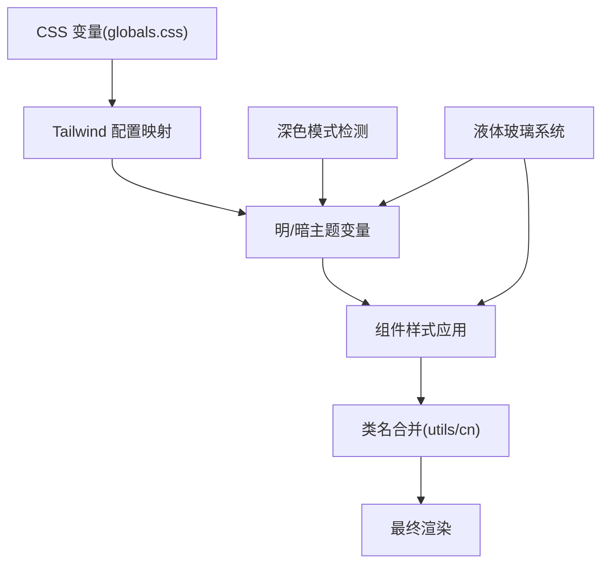
```mermaid
flowchart TD
CSSV["CSS 变量(globals.css)"] --> TWCFG["Tailwind 配置映射"]
TWCFG --> THEME["明/暗主题变量"]
THEME --> CMP["组件样式应用"]
CMP --> CN["类名合并(utils/cn)"]
CN --> RENDER["最终渲染"]
DARK["深色模式检测"] --> THEME
GLASS["液体玻璃系统"] --> THEME
GLASS --> CMP
```

**图表来源**
- [src/app/globals.css:5-136](file://src/app/globals.css#L5-L136)
- [tailwind.config.js:19-74](file://tailwind.config.js#L19-L74)
- [src/lib/utils.ts:4-6](file://src/lib/utils.ts#L4-L6)

**章节来源**
- [tailwind.config.js:1-78](file://tailwind.config.js#L1-L78)
- [src/app/globals.css:1-136](file://src/app/globals.css#L1-L136)
- [src/lib/utils.ts:1-7](file://src/lib/utils.ts#L1-L7)

## 测试策略与文档生成
- 单元测试
  - 对 Button/Checkbox/Label/Silder/Tabs/Textarea/Popover/密码可见性切换按钮/日期选择器 等纯展示组件，验证变体与尺寸类名拼接正确。
  - 对 Dialog/Select，验证 Portal 渲染与状态切换（open/closed）。
  - 对 DataTable，验证排序、过滤、分页行为与空态渲染。
  - **新增** Calendar 组件测试：验证范围选择、多月显示、国际化和液体玻璃样式。
  - **新增** DatePickerWithRange 组件测试：验证范围选择、多月显示、国际化和触发器行为。
  - **新增** Slider 组件测试：验证拖拽、键盘导航、焦点状态和禁用态。
  - **新增** Tabs 组件测试：验证标签页切换、键盘导航和无障碍访问。
  - **新增** Sonner 通知测试：验证通知显示、主题适配和交互效果。
  - **新增** Popover 组件测试：验证弹出状态、Portal 渲染和动画效果。
  - **新增** DateRangePicker 组件测试：验证预设选项选择、触发器状态和 Popover 行为。
  - **新增** Textarea 组件测试：验证多行文本输入、自动调整高度和液体玻璃样式适配。
  - **新增** 白名单规则表单测试：验证 Input 和 Textarea 组件的集成使用。
  - **新增** 密码可见性切换按钮测试：验证绝对定位、内边距调整、图标切换和状态反馈。
  - **新增** 区域热力图组件测试：验证本地数据源加载、液体玻璃样式适配和错误处理。
  - **新增** 仪表板首页测试：验证日期选择器与图表组件的协同工作。
  - **新增** 深色模式测试：验证系统主题偏好监听与动态切换功能。
  - **新增** 液体玻璃样式测试**：验证迁移后的液体玻璃样式使用模式正确性。
  - **样式标准化测试**：验证迁移后的 Tailwind 类使用模式正确性。
- 集成测试
  - 组合场景：Button + Dialog、DataTable + Pagination、Select + Label、Slider + Form、Tabs + Content、Textarea + Form、Popover + Trigger、Input + 密码可见性切换按钮、Calendar + DatePickerWithRange、DateRangePicker + DatePickerWithRange。
  - 图表组件：验证深色模式下的颜色配置与主题切换。
  - **新增** 日期选择器集成测试：验证 DatePickerWithRange 和 DateRangePicker 与仪表板首页的集成使用。
  - **新增** Calendar 集成测试：验证 react-day-picker 的完整功能和液体玻璃样式适配。
  - **新增** 区域热力图集成测试：验证本地数据源与 ECharts 的集成使用。
  - **新增** 液体玻璃样式集成测试**：验证所有组件的液体玻璃效果一致性。
  - **样式一致性测试**：确保所有组件都遵循新的液体玻璃样式使用模式。
  - **白名单规则表单集成测试**：验证 Input 和 Textarea 组件在复杂表单中的协同工作。
  - **密码可见性切换按钮集成测试**：验证按钮与 Input 组件的协同工作。
  - **数据源可靠性测试**：验证本地 GeoJSON 文件的加载和错误处理机制。
  - **仪表板数据流测试**：验证日期选择器变化对图表数据更新的影响。
- 可访问性测试
  - 使用 axe-core 或类似工具检查 aria-* 属性、键盘可达性与焦点顺序。
  - **新增** Calendar 可访问性：验证键盘导航、屏幕阅读器支持和焦点管理。
  - **新增** DatePickerWithRange 可访问性：验证键盘导航、范围选择和无障碍状态反馈。
  - **新增** Slider 可访问性：验证键盘导航、屏幕阅读器支持和焦点管理。
  - **新增** Tabs 可访问性：验证键盘导航、无障碍标签页切换。
  - **新增** Sonner 可访问性：验证通知的可访问性与键盘导航。
  - **新增** Popover 可访问性：验证键盘导航、屏幕阅读器支持和 Portal 渲染。
  - **新增** DateRangePicker 可访问性：验证键盘导航、预设选项选择和无障碍状态反馈。
  - **新增** Textarea 可访问性：验证多行文本输入的可访问性支持。
  - **新增** 密码可见性切换按钮可访问性：验证键盘导航、屏幕阅读器支持和状态反馈。
  - **新增** 区域热力图可访问性：验证深色模式下的对比度和可读性。
  - **新增** 液体玻璃样式可访问性**：确保在液体玻璃效果下的对比度和可读性。
  - **新增** 深色模式可访问性**：确保在深色模式下的对比度和可读性。
- 文档生成
  - 使用 TSDoc 为组件导出类型与属性提供注释，结合 Storybook 或自建文档站生成组件示例页面。
  - **新增** Calendar 组件文档：详细说明范围选择、多月显示、国际化和液体玻璃样式。
  - **新增** DatePickerWithRange 组件文档：详细说明范围选择界面、多月显示和事件处理。
  - **新增** Slider 组件文档：详细说明滑块交互、键盘导航和可访问性特性。
  - **新增** Tabs 组件文档：详细说明标签页导航、键盘导航和无障碍访问。
  - **新增** Sonner 组件文档：详细说明通知类型、主题适配和自定义配置。
  - **新增** Popover 组件文档：详细说明弹出式内容展示、Portal 渲染和动画效果。
  - **新增** DateRangePicker 组件文档：详细说明预设日期范围选择、触发器行为和状态管理。
  - **新增** Textarea 组件文档：详细说明多行文本输入、自动调整高度和液体玻璃样式适配。
  - **新增** 白名单规则表单文档：详细说明表单组件集成和预设模板功能。
  - **新增** 密码可见性切换按钮文档：详细说明绝对定位、内边距调整、图标切换和样式设计。
  - **新增** 区域热力图组件文档：详细说明本地数据源使用、性能优化和部署要求。
  - **新增** 仪表板首页文档：详细说明日期选择器集成和数据流管理。
  - **新增** 液体玻璃样式系统文档**：详细说明液体玻璃效果原理、变量系统和组件应用。
  - **新增** 深色模式文档**：为图表组件和业务组件的深色模式特性提供详细说明。
  - **新增** 样式标准化文档**：详细说明从CSS变量系统到标准Tailwind类的迁移过程和最佳实践。
- 版本管理
  - 组件版本与包版本保持一致，变更记录中明确 breaking change 与新增属性。

## 扩展与集成指南
- 自定义组件开发
  - 命名与目录：在 src/components/ui 下新增组件，遵循现有命名与导出规范。
  - 变体系统：优先使用 class-variance-authority 定义变体，保持与 Button/Label 一致的调用方式。
  - 语义化与可访问性：为交互元素提供 aria-* 属性，确保键盘可达与屏幕阅读器友好。
  - 样式集成：通过 utils/cn 合并类名，使用主题变量与 Tailwind v4 规范编写样式。
  - **新增** 液体玻璃样式支持：为新组件添加液体玻璃效果，包括背景模糊、半透明和阴影。
  - **新增** 深色模式支持**：为新组件添加深色模式适配，包括 CSS 变量使用和媒体查询监听。
  - **新增** 可访问性考虑**：确保新组件支持键盘导航和屏幕阅读器访问。
  - **新增** Calendar 集成**：为需要日期选择功能的组件提供 Calendar 组件集成指导。
  - **新增** DatePickerWithRange 集成**：为需要现代化范围选择功能的组件提供 DatePickerWithRange 组件集成指导。
  - **新增** Slider 集成**：为需要精确数值输入的组件提供 Slider 组件集成指导。
  - **新增** Tabs 集成**：为需要标签页功能的组件提供 Tabs 组件集成指导。
  - **新增** Sonner 集成**：为需要通知功能的组件提供 Sonner 组件集成指导。
  - **新增** Popover 集成**：为需要弹出式内容展示的组件提供 Popover 组件集成指导。
  - **新增** Textarea 集成**：为需要多行文本输入的组件提供 Textarea 组件集成指导。
  - **新增** 密码可见性切换按钮集成**：为需要密码输入场景的组件提供密码可见性切换按钮集成指导。
  - **新增** 区域热力图数据源集成**：为需要地理可视化功能的组件提供本地数据源集成指导。
  - **样式标准化**：严格遵循新的液体玻璃样式使用模式，避免直接使用 CSS 变量。
- 第三方集成
  - 表单库：Input/Button/Textarea 可直接与表单库集成，注意禁用态与错误态的样式覆盖。
  - 图表库：Table/DataTable 可与 ECharts/Recharts 等组合，使用 Table.Cell 渲染图表容器。
  - 导航库：Button 的 asChild 可与 Next/link、Radix NavigationMenu 等组合。
  - **新增** 日历库集成**：Calendar 可与日期处理库结合，提供完整的日期选择体验。
  - **新增** 日期范围库集成**：DatePickerWithRange 可与数据分析库结合，提供灵活的数据筛选功能。
  - **新增** 滑块组件集成**：Slider 可与表单库结合，提供精确数值输入体验。
  - **新增** 标签页组件集成**：Tabs 可与路由库结合，提供标签页导航功能。
  - **新增** 通知组件集成**：Sonner 可与认证库结合，提供用户反馈和状态提示。
  - **新增** 弹出框组件集成**：Popover 可与导航菜单结合，提供下拉式内容展示。
  - **新增** 多行文本组件集成**：Textarea 可与富文本编辑器库结合，提供高级文本编辑功能。
  - **新增** 密码可见性切换按钮集成**：可与表单库结合，提供更好的密码输入体验。
  - **新增** 深色模式图表**：集成支持深色模式的图表库，如 ECharts 的主题配置。
  - **新增** 本地数据源集成**：为需要地理可视化或静态数据展示的组件提供本地数据源集成指导。
  - **新增** 液体玻璃样式集成**：确保第三方组件也遵循新的液体玻璃样式使用模式。
  - **样式标准化集成**：确保第三方组件也遵循新的样式使用模式。

**章节来源**
- [src/components/ui/button.tsx:36-77](file://src/components/ui/button.tsx#L36-L77)
- [src/components/ui/input.tsx:5-26](file://src/components/ui/input.tsx#L5-L26)
- [src/components/ui/textarea.tsx:1-38](file://src/components/ui/textarea.tsx#L1-L38)
- [src/components/ui/dialog.tsx:1-121](file://src/components/ui/dialog.tsx#L1-L121)
- [src/components/ui/data-table.tsx:1-191](file://src/components/ui/data-table.tsx#L1-L191)
- [src/components/ui/slider.tsx:1-29](file://src/components/ui/slider.tsx#L1-L29)
- [src/components/ui/tabs.tsx:1-56](file://src/components/ui/tabs.tsx#L1-L56)
- [src/components/ui/sonner.tsx:1-46](file://src/components/ui/sonner.tsx#L1-L46)
- [src/components/ui/popover.tsx:1-32](file://src/components/ui/popover.tsx#L1-L32)
- [src/components/ui/calendar.tsx:1-223](file://src/components/ui/calendar.tsx#L1-L223)
- [src/components/date-picker-with-range.tsx:1-92](file://src/components/date-picker-with-range.tsx#L1-L92)
- [src/components/date-range-picker.tsx:1-100](file://src/components/date-range-picker.tsx#L1-L100)
- [src/app/(dashboard)/users/components/whitelist-rule-form.tsx](file://src/app/(dashboard)/users/components/whitelist-rule-form.tsx#L1-L531)
- [src/app/(dashboard)/components/region-heatmap-chart.tsx](file://src/app/(dashboard)/components/region-heatmap-chart.tsx#L1-L175)
- [src/app/(dashboard)/page.tsx](file://src/app/(dashboard)/page.tsx#L1-L230)
- [src/app/login/page.tsx:78-97](file://src/app/login/page.tsx#L78-L97)
- [src/app/settings/page.tsx:102-119](file://src/app/settings/page.tsx#L102-L119)
- [src/lib/utils.ts:1-7](file://src/lib/utils.ts#L1-L7)

## 故障排查
- 样式未生效
  - 检查 Tailwind 是否扫描到组件路径（content 配置）。
  - 确认 CSS 变量已定义，暗色模式类名是否正确挂载。
  - **新增** Calendar 样式问题：检查 react-day-picker 的类名映射和液体玻璃变量。
  - **新增** DatePickerWithRange 样式问题：检查触发器按钮、日历内容和范围选择的类名拼接。
  - **新增** Slider 样式问题：检查轨道、进度条和滑块手柄的类名拼接。
  - **新增** Tabs 样式问题：检查标签页列表、触发器和内容区域的类名拼接。
  - **新增** Sonner 样式问题：检查通知容器、按钮和描述的类名拼接。
  - **新增** Popover 样式问题：检查弹出内容、Portal 渲染和动画类名。
  - **新增** DateRangePicker 样式问题：检查触发器按钮、弹出内容和预设选项的类名拼接.
  - **新增** Textarea 样式问题：检查多行文本输入的类名拼接和液体玻璃样式适配。
  - **新增** 白名单规则表单样式问题：检查 Input 和 Textarea 组件的样式一致性。
  - **新增** 密码可见性切换按钮样式问题：检查绝对定位、内边距调整和图标切换的类名拼接。
  - **新增** 区域热力图样式问题：检查本地数据源路径和液体玻璃样式适配。
  - **新增** 仪表板首页样式问题：检查日期选择器与图表组件的样式一致性。
  - **新增** 液体玻璃样式问题**：检查液体玻璃变量是否正确设置，确认 CSS 变量使用模式。
  - **新增** 深色模式变量**：检查 `--card`、`--popover` 等变量是否正确设置。
  - **新增** 样式标准化问题**：检查 Tailwind 类名拼写是否正确，确认迁移后的样式使用模式。
- 动画异常
  - 确认 tailwindcss-animate 插件已启用，动画类名拼写正确。
- 可访问性问题
  - 检查 Dialog/Select/Pagination 是否包含 sr-only 文本与 aria-current 标注。
  - **新增** Calendar 可访问性：验证键盘事件监听、焦点管理和屏幕阅读器支持。
  - **新增** DatePickerWithRange 可访问性：验证键盘导航、范围选择和无障碍状态反馈。
  - **新增** Slider 可访问性：验证键盘事件监听和焦点状态管理。
  - **新增** Tabs 可访问性：验证标签页切换和键盘导航。
  - **新增** Sonner 可访问性：验证通知的可访问性与键盘导航。
  - **新增** Popover 可访问性：验证键盘导航、屏幕阅读器支持和 Portal 渲染。
  - **新增** DateRangePicker 可访问性：验证键盘导航、预设选项选择和无障碍状态反馈。
  - **新增** Textarea 可访问性：验证多行文本输入的可访问性支持。
  - **新增** 密码可见性切换按钮可访问性：验证键盘导航、屏幕阅读器支持和状态反馈。
  - **新增** 区域热力图可访问性：验证深色模式下的对比度和可读性。
  - **新增** 液体玻璃样式可访问性**：确保在液体玻璃效果下的对比度和可读性。
  - **新增** 深色模式可访问性**：确保在深色模式下的对比度和可读性。
- 组合渲染问题
  - Dialog/Select/Popover 使用 Portal 渲染，确认父容器未设置 overflow/clip 导致内容被裁剪。
- **新增** Calendar 特定问题**
  - 检查 react-day-picker 依赖是否正确安装
  - 验证 Calendar 组件的 props 设置，包括 mode、selected、onSelect 等
  - 确认 classNames 和 buttonVariant 属性设置
  - 验证国际化配置和本地化支持
  - **新增** 液体玻璃样式问题**：检查液体玻璃效果的类名拼接是否正确
- **新增** DatePickerWithRange 特定问题**
  - 检查 Calendar 依赖是否正确安装
  - 验证 DatePickerWithRange 组件的 props 设置，包括 startDate、endDate、onDateRangeChange 等
  - 确认日期格式化和本地化配置
  - 验证多月显示和范围选择功能
  - **新增** 液体玻璃样式问题**：检查液体玻璃效果的类名拼接是否正确
- **新增** Slider 特定问题**
  - 检查 @radix-ui/react-slider 依赖是否正确安装
  - 验证 value、defaultValue、min、max、step 属性设置
  - 确认 onValueChange 回调函数正确处理数值更新
  - **新增** 液体玻璃样式问题**：检查液体玻璃效果的类名拼接是否正确
  - **新增** 样式标准化问题**：检查组件是否正确使用新的液体玻璃样式而非 CSS 变量
- **新增** Tabs 特定问题**
  - 检查 @radix-ui/react-tabs 依赖是否正确安装
  - 验证 Tabs、TabsList、TabsTrigger、TabsContent 组件的正确使用
  - 确认 value 和 onValueChange 属性设置
  - 验证 data-state 属性的正确应用
  - **新增** 液体玻璃样式问题**：检查液体玻璃效果的类名拼接是否正确
- **新增** Sonner 特定问题**
  - 检查 sonner 依赖是否正确安装
  - 验证 Toaster 组件的正确使用和主题配置
  - 确认通知类型的正确传递和图标显示
  - 验证 next-themes 集成是否正常工作
  - **新增** 液体玻璃样式问题**：检查液体玻璃效果的类名拼接是否正确
- **新增** Popover 特定问题**
  - 检查 @radix-ui/react-popover 依赖是否正确安装
  - 验证 Popover、PopoverTrigger、PopoverContent 组件的正确使用
  - 确认 align 和 sideOffset 属性设置
  - 验证 Portal 渲染和动画类名的正确应用
  - **新增** 液体玻璃样式问题**：检查液体玻璃效果的类名拼接是否正确
- **新增** DateRangePicker 特定问题**
  - 检查 Popover 依赖是否正确安装
  - 验证 DateRangePicker 组件的正确使用和状态管理
  - 确认 dateRange 和 setDateRange 属性设置
  - 验证预设选项的正确显示和选择逻辑
  - **新增** 液体玻璃样式问题**：检查液体玻璃效果的类名拼接是否正确
- **新增** Textarea 特定问题**
  - 检查多行文本输入的自动调整高度功能
  - 验证液体玻璃样式下的样式适配
  - 确认禁用态和聚焦态的样式正确应用
  - **新增** 液体玻璃样式问题**：检查液体玻璃效果的类名拼接是否正确
- **新增** 白名单规则表单特定问题**
  - 检查 Input 和 Textarea 组件在表单中的集成使用
  - 验证预设模板选择器的键盘导航和点击外部关闭功能
  - 确认表单验证和提交逻辑的正确性
  - **新增** 液体玻璃样式问题**：检查液体玻璃效果的类名拼接是否正确
- **新增** 密码可见性切换按钮特定问题**
  - 检查绝对定位容器的 relative 类名是否正确应用
  - 验证 pr-10 内边距是否正确预留
  - 确认按钮的绝对定位类名拼接正确
  - 验证图标切换的状态逻辑是否正确
  - 检查深色模式下的文本颜色适配
  - **新增** 液体玻璃样式问题**：检查液体玻璃效果的类名拼接是否正确
- **新增** 区域热力图特定问题**
  - 检查本地 GeoJSON 文件路径是否正确
  - 验证 fetch 请求是否能正确访问 `/100000_full.json`
  - 确认 ECharts 地图注册是否成功
  - 验证深色模式下的颜色配置是否正确
  - 检查错误处理逻辑是否正常工作
  - **新增** 液体玻璃样式问题**：检查液体玻璃效果的类名拼接是否正确
- **新增** 仪表板首页特定问题**
  - 检查 DatePickerWithRange 和 DateRangePicker 与图表组件的数据流是否正确
  - 验证日期范围变化是否触发图表数据的重新查询
  - 确认自定义日期范围的显示和隐藏逻辑
  - 验证数据更新时间的显示和更新机制
  - **新增** 液体玻璃样式问题**：检查液体玻璃效果的类名拼接是否正确
- **新增** 数据源可靠性问题**
  - 确认 `public/100000_full.json` 文件存在于部署环境中
  - 验证文件权限设置是否正确
  - 检查静态文件服务配置是否正确
  - 确认 CDN 缓存策略不会影响文件更新
  - **新增** 液体玻璃样式问题**：检查液体玻璃效果的类名拼接是否正确

**章节来源**
- [tailwind.config.js:4-9](file://tailwind.config.js#L4-L9)
- [postcss.config.mjs:1-8](file://postcss.config.mjs#L1-L8)
- [src/app/globals.css:3-3](file://src/app/globals.css#L3-L3)
- [src/components/ui/dialog.tsx:34-50](file://src/components/ui/dialog.tsx#L34-L50)
- [src/components/ui/pagination.tsx:49-58](file://src/components/ui/pagination.tsx#L49-L58)
- [src/components/ui/slider.tsx:14-24](file://src/components/ui/slider.tsx#L14-L24)
- [src/components/ui/tabs.tsx:16-53](file://src/components/ui/tabs.tsx#L16-L53)
- [src/components/ui/sonner.tsx:15-46](file://src/components/ui/sonner.tsx#L15-L46)
- [src/components/ui/popover.tsx:15-29](file://src/components/ui/popover.tsx#L15-L29)
- [src/components/ui/calendar.tsx:46-135](file://src/components/ui/calendar.tsx#L46-L135)
- [src/components/date-picker-with-range.tsx:66-77](file://src/components/date-picker-with-range.tsx#L66-L77)
- [src/components/date-range-picker.tsx:68-81](file://src/components/date-range-picker.tsx#L68-L81)
- [src/components/ui/textarea.tsx:10-18](file://src/components/ui/textarea.tsx#L10-L18)
- [src/app/(dashboard)/users/components/whitelist-rule-form.tsx](file://src/app/(dashboard)/users/components/whitelist-rule-form.tsx#L123-L531)
- [src/app/(dashboard)/components/region-heatmap-chart.tsx](file://src/app/(dashboard)/components/region-heatmap-chart.tsx#L7-L7)
- [src/app/(dashboard)/components/region-heatmap-chart.tsx](file://src/app/(dashboard)/components/region-heatmap-chart.tsx#L36-L51)
- [src/app/(dashboard)/components/region-heatmap-chart.tsx](file://src/app/(dashboard)/components/region-heatmap-chart.tsx#L154-L167)
- [src/app/(dashboard)/page.tsx](file://src/app/(dashboard)/page.tsx#L124-L139)
- [src/app/login/page.tsx:78-97](file://src/app/login/page.tsx#L78-L97)
- [src/app/settings/page.tsx:102-119](file://src/app/settings/page.tsx#L102-L119)

## 结论
AIGate 的 UI 组件系统以 Tailwind v4 与 CSS 变量为核心，结合 class-variance-authority 与 Radix UI，实现了高可定制、强可访问性的组件生态。通过 DataTable 与 Pagination 的组合，满足复杂数据场景；通过 Dialog/Select 等复合组件，提供一致的交互体验。

**更新** 本次更新重点关注新增的 DatePickerWithRange 和 Calendar 组件，以及 Button 组件样式系统的全面升级。新增的 DatePickerWithRange 组件基于 react-day-picker 提供现代化的日期范围选择功能，支持范围选择、多月显示和国际化支持。Calendar 组件作为 DatePickerWithRange 的基础组件，提供了完整的日历界面和交互功能。Button 组件新增 glass 变体和液体玻璃效果，提供更丰富的视觉层次。utils.ts 文件的格式化简化了类名合并函数的实现，提升了代码可读性。液体玻璃样式系统为整个组件库提供了统一的视觉设计语言。

**新增** Calendar 和 DatePickerWithRange 组件的引入为组件库提供了现代化的日期选择能力，支持范围选择、多月显示、国际化和主题定制。DatePickerWithRange 组件基于 react-day-picker 构建，提供了完整的范围选择界面和事件处理，而 Calendar 组件作为基础组件，提供了灵活的主题定制和深度集成能力。

**新增** Button 组件样式系统的改进提升了组件的可维护性和一致性，新增的 glass 变体和液体玻璃效果为组件库提供了更丰富的视觉层次，确保在深色模式下的良好表现。

**新增** utils.ts 文件的格式化简化了类名合并函数的实现，使用 clsx 和 tailwind-merge 提供更高效的类名合并，减少了样式冲突的可能性。

**新增** 液体玻璃样式系统是本次更新的重要成果，从传统的 CSS 变量系统迁移到统一的液体玻璃样式使用模式，显著提升了样式的可维护性和开发体验。新的液体玻璃样式使用模式更加直观、类型安全且性能更优，为所有组件提供了统一的视觉设计语言。

**新增** 区域热力图数据源优化是本次更新的关键改进，将外部 Aliyun GeoJSON 端点替换为本地静态文件路径，显著提高了系统的可靠性并减少了对外部服务的依赖。这一变更不仅提升了加载性能，还增强了系统的稳定性，确保在各种网络环境下都能提供一致的用户体验。部署时需要特别注意确保 `public/100000_full.json` 文件的存在和正确配置。

**新增** 仪表板日期选择器集成是本次更新的重要功能增强，DatePickerWithRange 和 DateRangePicker 组件的集成为用户提供了灵活的数据筛选能力。这两个组件的组合使用实现了从传统预设选择到现代化范围选择的完整覆盖，与仪表板首页的其他组件协同工作，实现实时数据更新和响应式布局。

**新增** 白名单规则表单升级和密码可见性切换按钮实现是本次更新的关键改进，通过替换通用 HTML 元素为自定义组件，实现了：
- 统一的液体玻璃样式和交互体验
- 深色模式的完整适配
- 预设模板选择器的键盘导航支持
- 更好的可访问性和用户体验
- 绝对定位的密码可见性切换按钮，提供更好的密码输入体验

建议在扩展新组件时遵循现有命名、变体与可访问性规范，并通过测试与文档保障质量与可维护性。对于需要深色模式支持的组件，应参考现有的实现模式，确保一致的用户体验。同时，严格遵循新的液体玻璃样式标准化规范，确保所有组件都采用统一的液体玻璃样式使用模式。新增的 Calendar、DatePickerWithRange、Button 液体玻璃效果、utils.ts 格式化、密码可见性切换按钮、区域热力图组件和白名单规则表单组件为日期选择、按钮样式、类名合并、密码输入、地理可视化和业务表单场景提供了更好的选择，建议在相应场景中优先考虑使用。