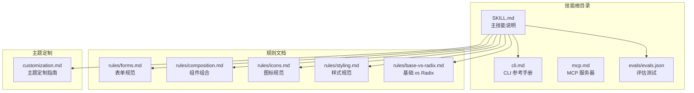
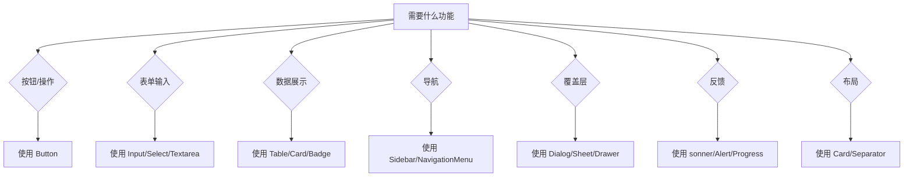
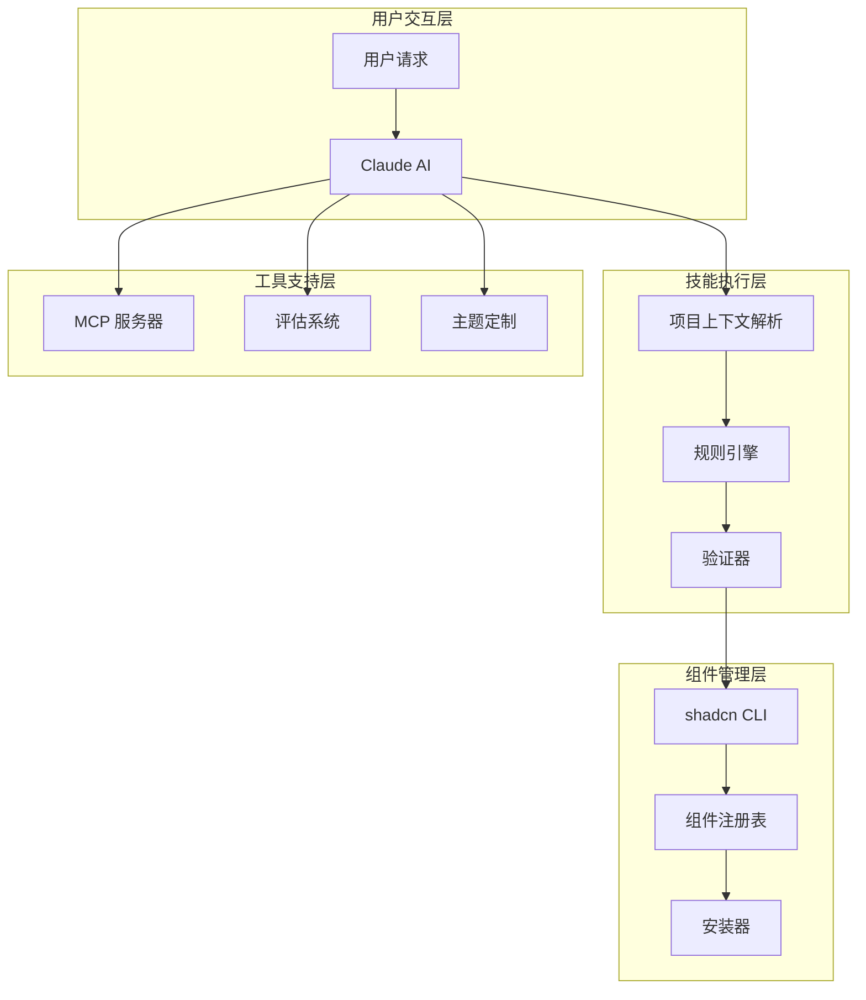
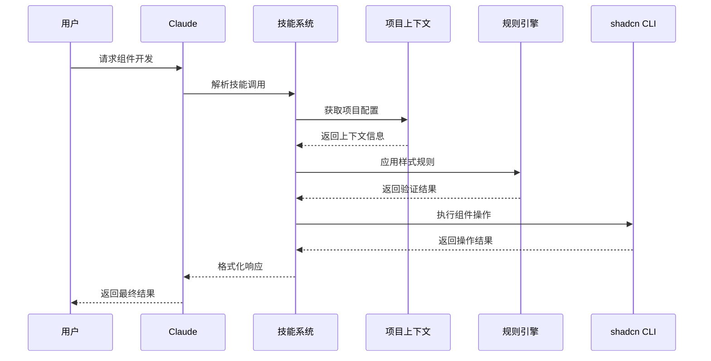
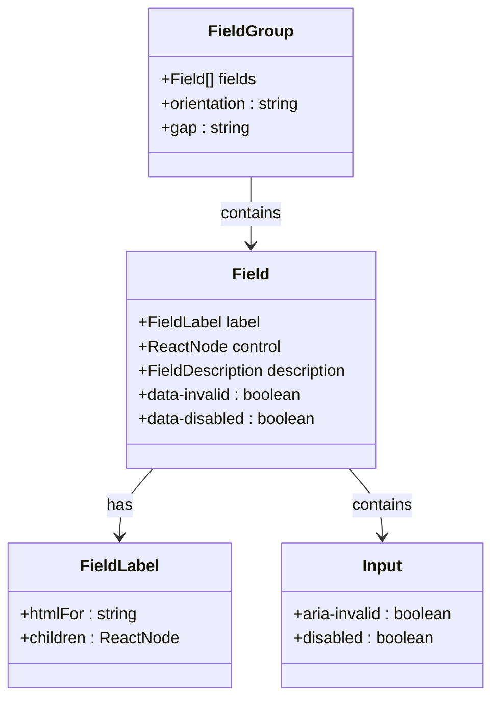
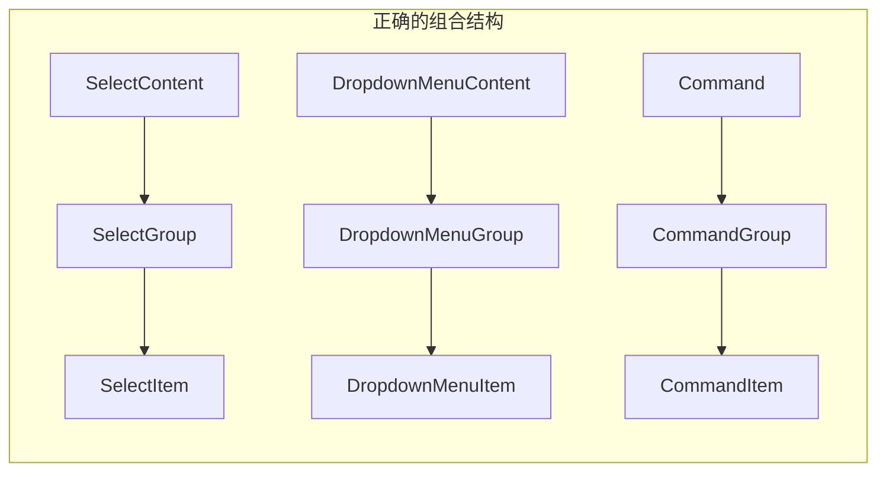
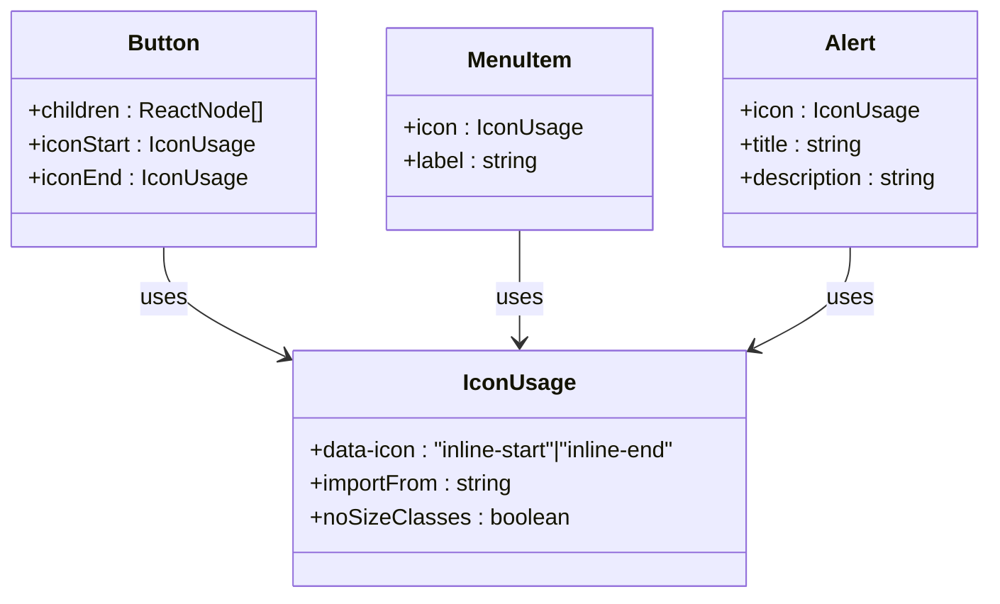
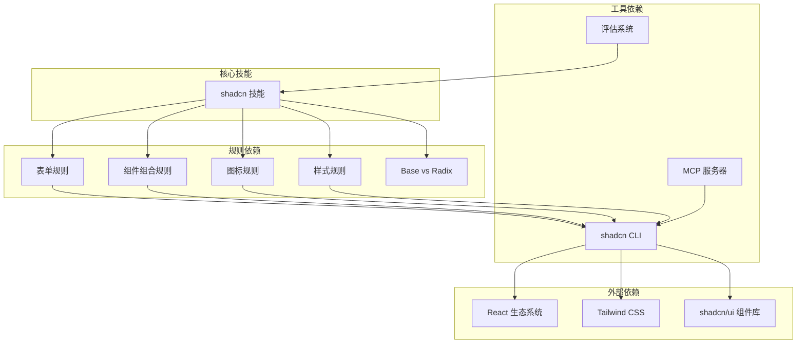
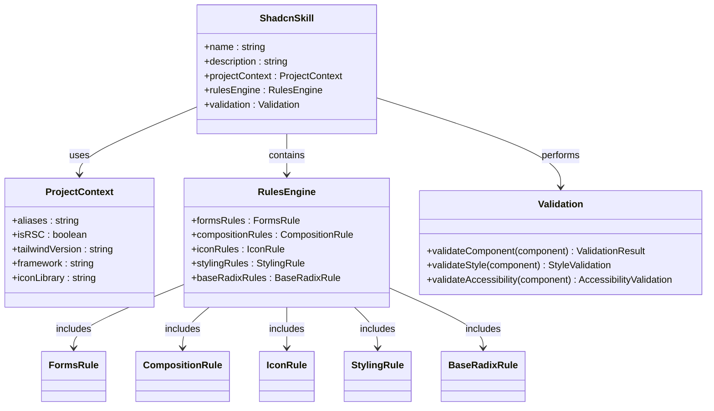
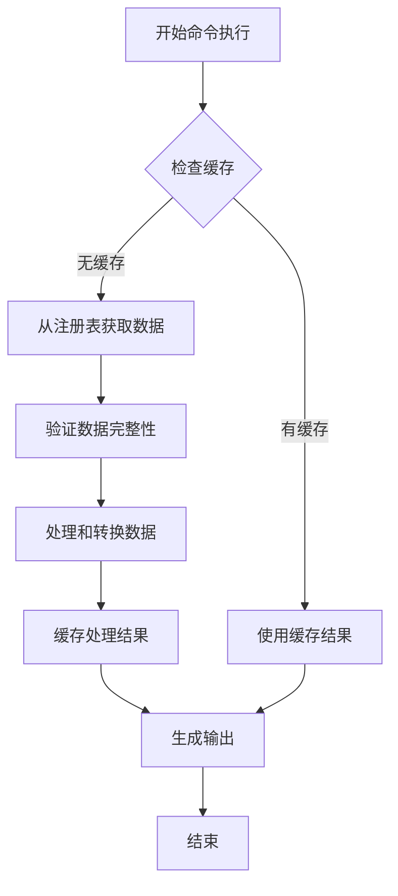

# shadcn/UI 代理技能系统

<cite>
**本文档引用的文件**
- [.agents/skills/shadcn/SKILL.md](file://.agents/skills/shadcn/SKILL.md)
- [.agents/skills/shadcn/cli.md](file://.agents/skills/shadcn/cli.md)
- [.agents/skills/shadcn/customization.md](file://.agents/skills/shadcn/customization.md)
- [.agents/skills/shadcn/mcp.md](file://.agents/skills/shadcn/mcp.md)
- [.agents/skills/shadcn/evals/evals.json](file://.agents/skills/shadcn/evals/evals.json)
- [.agents/skills/shadcn/rules/base-vs-radix.md](file://.agents/skills/shadcn/rules/base-vs-radix.md)
- [.agents/skills/shadcn/rules/forms.md](file://.agents/skills/shadcn/rules/forms.md)
- [.agents/skills/shadcn/rules/composition.md](file://.agents/skills/shadcn/rules/composition.md)
- [.agents/skills/shadcn/rules/icons.md](file://.agents/skills/shadcn/rules/icons.md)
- [.agents/skills/shadcn/rules/styling.md](file://.agents/skills/shadcn/rules/styling.md)
</cite>

## 目录
1. [简介](#简介)
2. [项目结构](#项目结构)
3. [核心组件](#核心组件)
4. [架构概览](#架构概览)
5. [详细组件分析](#详细组件分析)
6. [依赖关系分析](#依赖关系分析)
7. [性能考虑](#性能考虑)
8. [故障排除指南](#故障排除指南)
9. [结论](#结论)

## 简介

shadcn/UI 代理技能系统是一个专为 Claude AI 助手设计的智能技能，旨在管理和优化 shadcn/ui 组件生态系统。该技能提供了完整的组件管理、样式规范、表单处理和图标使用指导，确保开发者能够创建符合最佳实践的 React 用户界面。

该技能系统的核心价值在于：
- **标准化组件开发**：提供统一的组件选择和使用规范
- **智能项目集成**：自动检测和适配不同的项目配置
- **全面的样式指导**：基于语义化颜色和 Tailwind 实用类的样式规范
- **MCP 服务器支持**：提供 AI 驱动的组件搜索和安装功能

## 项目结构

shadcn 技能系统采用模块化的文件组织方式，主要包含以下核心目录：



**图表来源**
- [.agents/skills/shadcn/SKILL.md](file://.agents/skills/shadcn/SKILL.md#L1-L241)
- [.agents/skills/shadcn/cli.md](file://.agents/skills/shadcn/cli.md#L1-L256)

**章节来源**
- [.agents/skills/shadcn/SKILL.md](file://.agents/skills/shadcn/SKILL.md#L1-L241)
- [.agents/skills/shadcn/cli.md](file://.agents/skills/shadcn/cli.md#L1-L256)

## 核心组件

### 1. 项目上下文管理系统

技能系统通过注入项目上下文信息来提供个性化的组件管理建议：

| 上下文字段 | 类型 | 描述 | 示例值 |
|------------|------|------|--------|
| `aliases` | string | 导入别名前缀 | `@/`, `~/` |
| `isRSC` | boolean | React Server Components 标志 | true/false |
| `tailwindVersion` | string | Tailwind 版本 | `"v3"`, `"v4"` |
| `tailwindCssFile` | string | 全局 CSS 文件路径 | `./app/globals.css` |
| `style` | string | 组件视觉风格 | `nova`, `vega` |
| `base` | string | 基础库类型 | `radix`, `base` |
| `iconLibrary` | string | 图标库配置 | `lucide`, `tabler` |
| `framework` | string | 框架类型 | `next`, `vite` |
| `packageManager` | string | 包管理器 | `npm`, `pnpm`, `yarn` |

### 2. 组件选择策略

技能系统提供了基于需求的组件选择指南：



**图表来源**
- [.agents/skills/shadcn/SKILL.md](file://.agents/skills/shadcn/SKILL.md#L120-L137)

### 3. 样式规范体系

系统建立了完整的样式规范体系，包括：

- **语义化颜色系统**：使用 `bg-primary`, `text-muted-foreground` 等语义化类名
- **间距规范**：优先使用 `gap-*` 而非 `space-x-*` 或 `space-y-*`
- **尺寸规范**：等宽高时使用 `size-*` 而非 `w-* h-*`
- **条件类名**：使用 `cn()` 工具函数而非手动模板字符串

**章节来源**
- [.agents/skills/shadcn/SKILL.md](file://.agents/skills/shadcn/SKILL.md#L138-L153)
- [.agents/skills/shadcn/rules/styling.md](file://.agents/skills/shadcn/rules/styling.md#L1-L163)

## 架构概览

### 整体架构设计



**图表来源**
- [.agents/skills/shadcn/SKILL.md](file://.agents/skills/shadcn/SKILL.md#L1-L241)
- [.agents/skills/shadcn/mcp.md](file://.agents/skills/shadcn/mcp.md#L1-L95)

### 数据流架构



**图表来源**
- [.agents/skills/shadcn/SKILL.md](file://.agents/skills/shadcn/SKILL.md#L165-L179)

## 详细组件分析

### 表单组件规范

#### FieldGroup + Field 模式

表单组件必须使用 `FieldGroup` 和 `Field` 组合模式，而不是直接使用 `div` + `space-y-*`：



**图表来源**
- [.agents/skills/shadcn/rules/forms.md](file://.agents/skills/shadcn/rules/forms.md#L14-L32)

#### 输入组规范

输入组必须使用专门的组件结构：

| 错误做法 | 正确做法 | 说明 |
|----------|----------|------|
| 直接使用 `Input` | 使用 `InputGroup` + `InputGroupInput` | 确保一致的外观和行为 |
| 自定义定位按钮 | 使用 `InputGroupAddon` | 提供标准的附加元素容器 |
| 手动添加图标 | 使用 `data-icon` 属性 | 确保图标大小一致性 |

**章节来源**
- [.agents/skills/shadcn/rules/forms.md](file://.agents/skills/shadcn/rules/forms.md#L47-L100)

### 组件组合规范

#### 组合容器原则

所有项目都必须包含在相应的组容器中：



**图表来源**
- [.agents/skills/shadcn/rules/composition.md](file://.agents/skills/shadcn/rules/composition.md#L21-L54)

#### 可访问性要求

覆盖层组件必须包含标题组件：

| 组件类型 | 必需标题 | 用途 |
|----------|----------|------|
| Dialog | DialogTitle | 模态对话框的主要标题 |
| Sheet | SheetTitle | 侧边面板的标题 |
| Drawer | DrawerTitle | 底部抽屉的标题 |
| AlertDialog | AlertDialogTitle | 确认对话框的标题 |

**章节来源**
- [.agents/skills/shadcn/rules/composition.md](file://.agents/skills/shadcn/rules/composition.md#L112-L125)

### 图标系统规范

#### 图标使用原则



**图表来源**
- [.agents/skills/shadcn/rules/icons.md](file://.agents/skills/shadcn/rules/icons.md#L7-L33)

#### 图标库配置

| 图标库 | 导入库 | 使用场景 |
|--------|--------|----------|
| lucide | `lucide-react` | 默认图标库 |
| tabler | `@tabler/icons-react` | 替代图标库 |
| heroicons | `@heroicons/react` | 英雄图标 |
| phosphor | `@phosphor-icons/react` | 磷光图标 |

**章节来源**
- [.agents/skills/shadcn/rules/icons.md](file://.agents/skills/shadcn/rules/icons.md#L1-L102)

### 样式系统规范

#### 语义化颜色系统

```mermaid
graph TB
subgraph "颜色变量体系"
BACKGROUND[--background / --foreground<br/>页面背景和默认文本]
CARD[--card / --card-foreground<br/>卡片表面]
PRIMARY[--primary / --primary-foreground<br/>主要按钮和动作]
SECONDARY[--secondary / --secondary-foreground<br/>次要动作]
MUTED[--muted / --muted-foreground<br/>静音/禁用状态]
ACCENT[--accent / --accent-foreground<br/>悬停和强调状态]
DESTRUCTIVE[--destructive / --destructive-foreground<br/>错误和破坏性动作]
end
subgraph "OKLCH 颜色格式"
COLOR_FORMAT[oklch(0.205 0 0)<br/>亮度/色度/色相]
end
BACKGROUND --> COLOR_FORMAT
PRIMARY --> COLOR_FORMAT
SECONDARY --> COLOR_FORMAT
```

**图表来源**
- [.agents/skills/shadcn/customization.md](file://.agents/skills/shadcn/customization.md#L26-L47)

#### Tailwind v3 vs v4 差异

| 特性 | Tailwind v3 | Tailwind v4 |
|------|-------------|-------------|
| 配置文件 | `tailwind.config.js` | `@theme inline` |
| 颜色注册 | `colors: { warning: "oklch(var(--warning) / <alpha-value>)" }` | `@theme inline { --color-warning: var(--warning) }` |
| CSS 变量 | 传统 CSS 变量 | 内联主题声明 |
| 性能 | 标准构建 | 更快的编译速度 |

**章节来源**
- [.agents/skills/shadcn/customization.md](file://.agents/skills/shadcn/customization.md#L82-L127)

## 依赖关系分析

### 技能依赖图



**图表来源**
- [.agents/skills/shadcn/SKILL.md](file://.agents/skills/shadcn/SKILL.md#L1-L241)
- [.agents/skills/shadcn/rules/base-vs-radix.md](file://.agents/skills/shadcn/rules/base-vs-radix.md#L1-L307)

### 组件关系图



**图表来源**
- [.agents/skills/shadcn/SKILL.md](file://.agents/skills/shadcn/SKILL.md#L1-L241)

**章节来源**
- [.agents/skills/shadcn/SKILL.md](file://.agents/skills/shadcn/SKILL.md#L1-L241)
- [.agents/skills/shadcn/rules/base-vs-radix.md](file://.agents/skills/shadcn/rules/base-vs-radix.md#L1-L307)

## 性能考虑

### 组件加载优化

1. **按需导入**：只导入实际使用的组件，避免全量导入
2. **代码分割**：对于大型组件使用动态导入
3. **缓存策略**：利用浏览器缓存和 CDN 加速静态资源
4. **Tree Shaking**：确保未使用的代码被正确移除

### 样式性能优化

1. **语义化类名**：使用语义化类名减少重复定义
2. **CSS 变量**：通过 CSS 变量实现主题切换而无需重绘
3. **Tailwind 优化**：合理使用 Tailwind 实用类，避免过度嵌套
4. **组件复用**：通过组合现有组件减少自定义样式

### CLI 命令优化



**图表来源**
- [.agents/skills/shadcn/cli.md](file://.agents/skills/shadcn/cli.md#L67-L102)

## 故障排除指南

### 常见问题诊断

#### 组件安装失败

**症状**：`npx shadcn@latest add` 命令执行失败

**可能原因**：
1. 网络连接问题
2. 权限不足
3. 依赖版本冲突
4. 注册表配置错误

**解决方案**：
1. 检查网络连接和代理设置
2. 运行 `npx shadcn@latest info` 查看项目配置
3. 清理包管理器缓存
4. 更新到最新版本的 shadcn CLI

#### 样式不生效

**症状**：组件样式与预期不符

**可能原因**：
1. CSS 变量未正确配置
2. Tailwind 配置问题
3. 组件导入路径错误
4. 缺少必要的 CSS 文件

**解决方案**：
1. 检查 `globals.css` 中的 CSS 变量定义
2. 验证 Tailwind 配置文件
3. 确认组件导入路径使用正确的别名
4. 确保 `tailwindCssFile` 字段指向正确的文件

#### 图标显示异常

**症状**：图标不显示或显示错误

**可能原因**：
1. 图标库配置错误
2. 图标导入路径问题
3. 图标大小设置错误
4. 图标属性使用不当

**解决方案**：
1. 检查 `iconLibrary` 字段配置
2. 使用正确的图标导入语句
3. 移除图标上的尺寸类名
4. 使用 `data-icon` 属性指定图标位置

### 调试工具

#### 项目信息检查

```bash
# 获取完整的项目信息
npx shadcn@latest info

# 检查特定组件的文档链接
npx shadcn@latest docs button dialog

# 预览组件更新差异
npx shadcn@latest add button --dry-run
npx shadcn@latest add button --diff
```

#### MCP 服务器调试

```bash
# 启动 MCP 服务器
shadcn mcp

# 生成编辑器配置
shadcn mcp init
```

**章节来源**
- [.agents/skills/shadcn/cli.md](file://.agents/skills/shadcn/cli.md#L159-L208)
- [.agents/skills/shadcn/mcp.md](file://.agents/skills/shadcn/mcp.md#L1-L95)

## 结论

shadcn/UI 代理技能系统提供了一个完整、标准化的组件开发和管理框架。通过严格的规则约束和智能化的项目上下文感知，该系统能够：

1. **提升开发效率**：通过标准化的组件选择和使用模式，减少开发时间
2. **保证代码质量**：严格的规则检查和验证机制确保代码的一致性和可维护性
3. **增强用户体验**：语义化的设计系统和可访问性支持提供更好的用户体验
4. **简化团队协作**：统一的开发规范和工具链促进团队间的协作

该技能系统特别适合需要快速构建高质量 React 应用的开发团队，它不仅提供了技术指导，更重要的是建立了一套完整的开发流程和质量保障体系。通过持续的评估和改进，该系统将继续演进以满足不断变化的前端开发需求。