# 反馈与对话组件

<cite>
**本文引用的文件**
- [src/components/ui/dialog.tsx](file://src/components/ui/dialog.tsx)
- [src/components/ui/sonner.tsx](file://src/components/ui/sonner.tsx)
- [src/components/ui/confirm.tsx](file://src/components/ui/confirm.tsx)
- [src/app/(dashboard)/keys/components/add-api-key-dialog.tsx](file://src/app/(dashboard)/keys/components/add-api-key-dialog.tsx)
- [src/app/(dashboard)/debug/components/code-modal.tsx](file://src/app/(dashboard)/debug/components/code-modal.tsx)
- [src/app/(dashboard)/keys/components/delete-confirm-modal.tsx](file://src/app/(dashboard)/keys/components/delete-confirm-modal.tsx)
- [src/app/(dashboard)/keys/page.tsx](file://src/app/(dashboard)/keys/page.tsx)
- [src/app/(dashboard)/users/page.tsx](file://src/app/(dashboard)/users/page.tsx)
- [src/app/(dashboard)/quotas/page.tsx](file://src/app/(dashboard)/quotas/page.tsx)
- [src/app/layout.tsx](file://src/app/layout.tsx)
- [src/components/ui/button.tsx](file://src/components/ui/button.tsx)
- [src/components/ui/input.tsx](file://src/components/ui/input.tsx)
- [src/components/ui/select.tsx](file://src/components/ui/select.tsx)
- [src/lib/utils.ts](file://src/lib/utils.ts)
- [package.json](file://package.json)
</cite>

## 更新摘要
**变更内容**
- 新增 ConfirmProvider 系统，替代原有的 DeleteConfirmModal 组件
- 在应用布局中集成 ConfirmProvider，提供全局确认对话框服务
- 扩展反馈系统，结合 Dialog、Confirm 和 Toast 形成完整的用户反馈体系
- 更新使用示例，展示 confirm 函数在不同业务场景中的应用
- 保留 DeleteConfirmModal 组件作为备用方案

## 目录
1. [简介](#简介)
2. [项目结构](#项目结构)
3. [核心组件](#核心组件)
4. [架构总览](#架构总览)
5. [组件详解](#组件详解)
6. [依赖关系分析](#依赖关系分析)
7. [性能考量](#性能考量)
8. [故障排查指南](#故障排查指南)
9. [结论](#结论)
10. [附录](#附录)

## 简介
本文件围绕 AIGate 的反馈与对话组件进行系统化文档化，重点聚焦于 Dialog 对话框组件、ConfirmProvider 确认对话框系统以及 Toast 通知系统的设计理念、实现架构与使用范式。内容涵盖：
- 打开/关闭机制：触发器、模态管理、焦点控制
- 内容组织：头部、主体、底部操作按钮的设计
- 使用示例：确认对话框、表单对话框、信息提示对话框
- 可访问性支持：键盘导航、焦点陷阱、ARIA 属性
- 动画与过渡：入场/出场动画、缩放与滑入滑出
- 集成模式：与表单提交、确认操作、信息展示的协同
- **新增**：ConfirmProvider 确认对话框系统：基于 AlertDialog 的可编程确认对话框服务，支持异步操作和加载状态
- **新增**：Toast 通知系统：基于 Sonner 库的即时反馈通知，支持成功、错误、警告、信息和加载状态

## 项目结构
反馈与对话组件体系位于通用 UI 层，作为可复用的基础能力被业务页面广泛采用。其典型使用路径如下：
- 通用 UI 层：对话框基础组件（根、触发器、门户、覆盖层、内容、标题、描述、页眉、页脚等）
- **新增**：确认对话框系统：ConfirmProvider 提供可编程的确认对话框服务，集成在应用布局中
- **新增**：通知系统：Toaster 组件提供全局通知服务，集成在应用布局中
- 业务页面层：在仪表盘 Keys、Users、Quotas 页面中，分别以"添加 API 密钥"、"添加白名单规则"、"新建配额策略"等场景使用 Dialog
- 交互与表单：结合 Button、Input、Select 等组件完成表单输入与提交流程
- **新增**：业务层集成：在 API Key 管理、白名单规则管理、配额管理等页面中集成 confirm 函数和 toast 通知

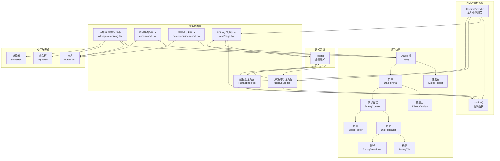

**图表来源**
- [src/components/ui/dialog.tsx](file://src/components/ui/dialog.tsx#L7-L120)
- [src/components/ui/confirm.tsx](file://src/components/ui/confirm.tsx#L36-L153)
- [src/components/ui/sonner.tsx](file://src/components/ui/sonner.tsx#L1-L45)
- [src/app/(dashboard)/keys/components/add-api-key-dialog.tsx](file://src/app/(dashboard)/keys/components/add-api-key-dialog.tsx#L33-L261)
- [src/app/(dashboard)/debug/components/code-modal.tsx](file://src/app/(dashboard)/debug/components/code-modal.tsx#L14-L51)
- [src/app/(dashboard)/keys/components/delete-confirm-modal.tsx](file://src/app/(dashboard)/keys/components/delete-confirm-modal.tsx#L15-L60)
- [src/app/(dashboard)/keys/page.tsx](file://src/app/(dashboard)/keys/page.tsx#L65-L75)
- [src/app/(dashboard)/users/page.tsx](file://src/app/(dashboard)/users/page.tsx#L94-L98)
- [src/app/(dashboard)/quotas/page.tsx](file://src/app/(dashboard)/quotas/page.tsx#L71-L75)
- [src/app/layout.tsx](file://src/app/layout.tsx#L54-L56)

**章节来源**
- [src/components/ui/dialog.tsx](file://src/components/ui/dialog.tsx#L1-L121)
- [src/components/ui/confirm.tsx](file://src/components/ui/confirm.tsx#L1-L170)
- [src/components/ui/sonner.tsx](file://src/components/ui/sonner.tsx#L1-L45)
- [src/app/(dashboard)/keys/components/add-api-key-dialog.tsx](file://src/app/(dashboard)/keys/components/add-api-key-dialog.tsx#L1-L265)
- [src/app/(dashboard)/debug/components/code-modal.tsx](file://src/app/(dashboard)/debug/components/code-modal.tsx#L1-L55)
- [src/app/(dashboard)/keys/components/delete-confirm-modal.tsx](file://src/app/(dashboard)/keys/components/delete-confirm-modal.tsx#L1-L63)
- [src/app/(dashboard)/keys/page.tsx](file://src/app/(dashboard)/keys/page.tsx#L1-L142)
- [src/app/(dashboard)/users/page.tsx](file://src/app/(dashboard)/users/page.tsx#L1-L165)
- [src/app/(dashboard)/quotas/page.tsx](file://src/app/(dashboard)/quotas/page.tsx#L1-L147)
- [src/app/layout.tsx](file://src/app/layout.tsx#L1-L61)
- [src/components/ui/button.tsx](file://src/components/ui/button.tsx#L1-L58)
- [src/components/ui/input.tsx](file://src/components/ui/input.tsx#L1-L26)
- [src/components/ui/select.tsx](file://src/components/ui/select.tsx#L1-L152)

## 核心组件
- 根组件与触发器：提供受控/非受控的打开/关闭状态与事件回调
- 门户与覆盖层：确保对话框在全局层级正确渲染，并提供背景遮罩
- 内容容器：居中布局、圆角、阴影、模糊背景、动画入场/出场
- 页眉与页脚：语义化分组，页脚支持响应式按钮排列
- 标题与描述：语义化标签，便于屏幕阅读器识别
- **新增**：ConfirmProvider 组件：基于 AlertDialog 的全局确认对话框服务，支持异步操作和加载状态
- **新增**：confirm 函数：可编程的确认对话框调用函数，支持字符串和选项对象两种调用方式
- **新增**：Toaster 组件：基于 Sonner 库的全局通知服务，支持多种通知类型和主题适配

**章节来源**
- [src/components/ui/dialog.tsx](file://src/components/ui/dialog.tsx#L7-L120)
- [src/components/ui/confirm.tsx](file://src/components/ui/confirm.tsx#L36-L153)
- [src/components/ui/sonner.tsx](file://src/components/ui/sonner.tsx#L1-L45)

## 架构总览
反馈与对话组件体系基于 Radix UI 的无障碍原生语义与状态机，配合 Tailwind/CSS 变量与动画库，形成统一的视觉与交互风格。下图展示了从触发到渲染的关键调用链：

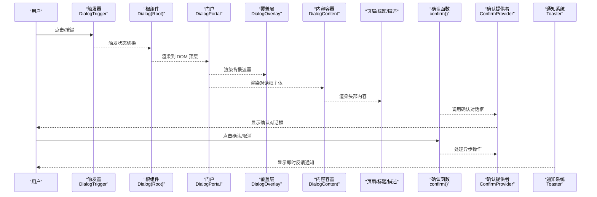

**图表来源**
- [src/components/ui/dialog.tsx](file://src/components/ui/dialog.tsx#L9-L51)
- [src/components/ui/confirm.tsx](file://src/components/ui/confirm.tsx#L44-L60)
- [src/components/ui/sonner.tsx](file://src/components/ui/sonner.tsx#L15-L43)

**章节来源**
- [src/components/ui/dialog.tsx](file://src/components/ui/dialog.tsx#L1-L121)
- [src/components/ui/confirm.tsx](file://src/components/ui/confirm.tsx#L1-L170)
- [src/components/ui/sonner.tsx](file://src/components/ui/sonner.tsx#L1-L45)

## 组件详解

### 设计理念与实现要点
- 无障碍优先：基于 Radix UI 的可访问性基座，提供键盘可达、焦点陷阱与 ARIA 属性
- 状态驱动：通过 open/onOpenChange 实现受控模式，便于上层业务精确控制
- 动效一致：统一的入场/出场动画（淡入淡出、缩放、滑入滑出），提升感知质量
- 主题适配：使用 CSS 变量承载主题色值，保证深浅色模式一致性
- 结构清晰：页眉/主体/页脚的语义化划分，便于扩展复杂表单与信息面板
- **新增**：确认服务：ConfirmProvider 提供可编程的确认对话框，支持异步操作和加载状态
- **新增**：通知统一：基于 Sonner 的通知系统，提供一致的视觉和交互体验
- **新增**：双轨并行：既有传统的 DeleteConfirmModal 作为备用方案，又有新的 ConfirmProvider 系统

**章节来源**
- [src/components/ui/dialog.tsx](file://src/components/ui/dialog.tsx#L15-L107)
- [src/components/ui/confirm.tsx](file://src/components/ui/confirm.tsx#L36-L153)
- [src/components/ui/sonner.tsx](file://src/components/ui/sonner.tsx#L15-L43)

### 打开/关闭机制与焦点控制
- 触发器：使用 DialogTrigger 包裹任意可点击元素，内部委托状态切换
- 模态管理：DialogPortal 将内容渲染至 DOM 顶层，确保层级与遮罩覆盖
- 焦点控制：对话框打开时自动聚焦到可交互元素；关闭时返回触发源
- 关闭方式：右上角关闭按钮、背景点击（由覆盖层触发）、Esc 键（Radix 默认行为）

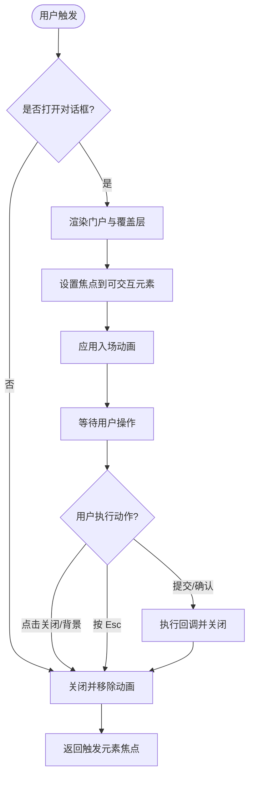

**图表来源**
- [src/components/ui/dialog.tsx](file://src/components/ui/dialog.tsx#L9-L51)

**章节来源**
- [src/components/ui/dialog.tsx](file://src/components/ui/dialog.tsx#L9-L51)

### 内容组织：头部、主体、底部
- 页眉（DialogHeader）：标题与描述的容器，默认居中/左对齐组合
- 标题（DialogTitle）：语义化标题标签，建议简短明确
- 描述（DialogDescription）：补充说明，辅助理解上下文
- 页脚（DialogFooter）：按钮区，移动端纵向堆叠，桌面端横向右对齐
- 内容容器（DialogContent）：居中定位、圆角、阴影、模糊背景、动画类

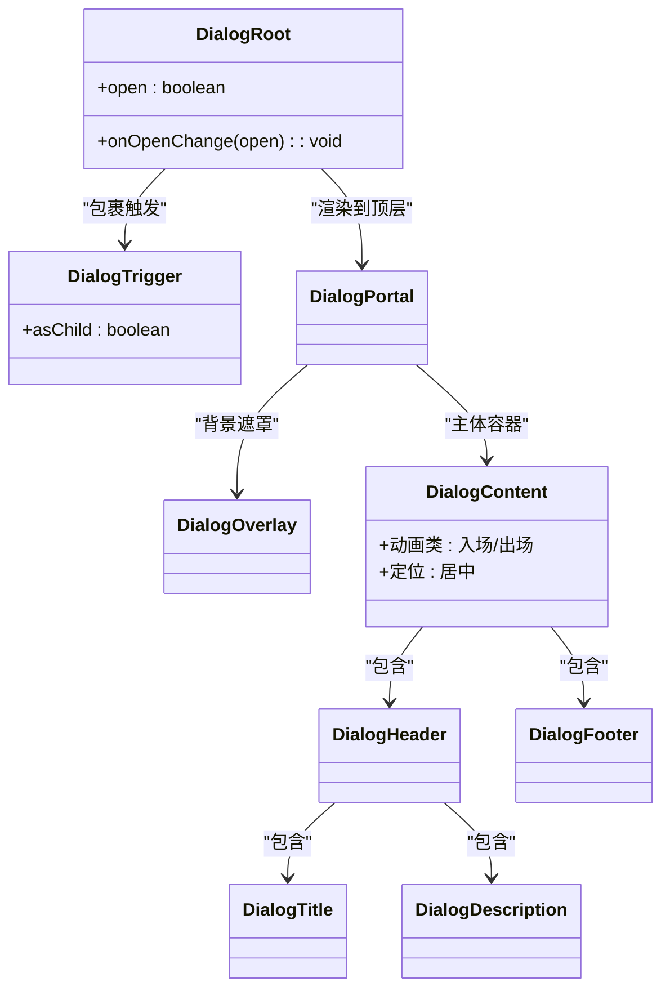

**图表来源**
- [src/components/ui/dialog.tsx](file://src/components/ui/dialog.tsx#L7-L120)

**章节来源**
- [src/components/ui/dialog.tsx](file://src/components/ui/dialog.tsx#L54-L107)

### 确认对话框系统

#### 设计理念
- **可编程性**：通过 confirm 函数提供编程式的确认对话框调用方式
- **异步支持**：支持 onConfirm 回调的异步操作，自动处理加载状态
- **可定制性**：支持自定义标题、描述、按钮文本和样式变体
- **全局可用**：通过 ConfirmProvider 在整个应用范围内提供服务

#### 核心组件
- **ConfirmProvider**：全局确认对话框提供者，维护确认对话框的状态
- **confirm 函数**：可编程的确认对话框调用函数，支持字符串和选项对象
- **ConfirmOptions 接口**：确认对话框的配置选项

#### 使用方式
- **简单调用**：`confirm('确定要执行此操作吗？')`
- **高级配置**：`confirm({ title: '删除确认', description: '...', variant: 'destructive', onConfirm: async () => {} })`

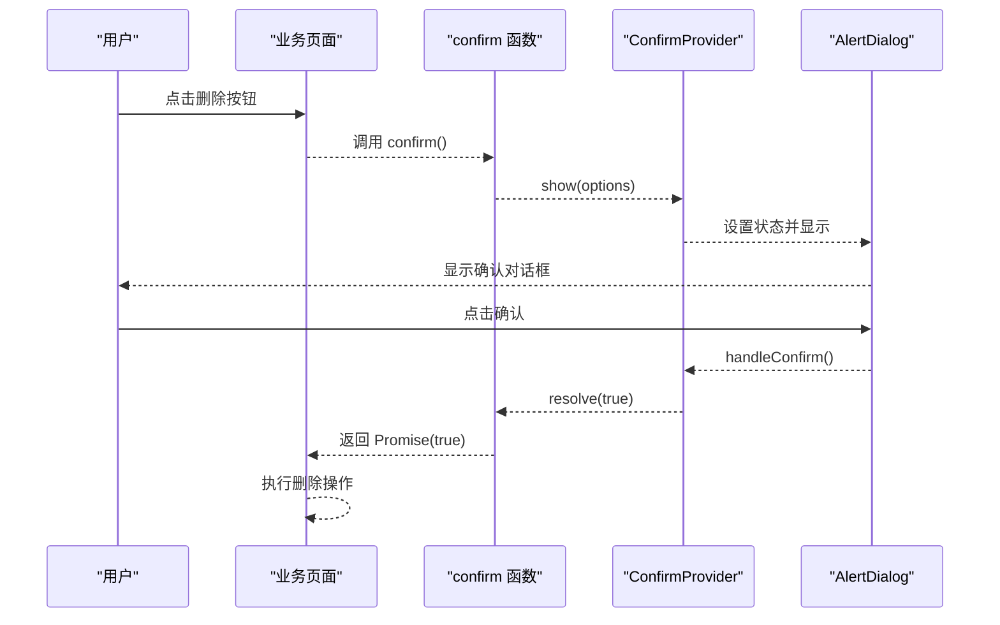

**图表来源**
- [src/components/ui/confirm.tsx](file://src/components/ui/confirm.tsx#L44-L85)

**章节来源**
- [src/components/ui/confirm.tsx](file://src/components/ui/confirm.tsx#L1-L170)

### 使用示例

#### 示例一：确认对话框（删除 API Key）
- **新方式**：使用 confirm 函数替代 DeleteConfirmModal 组件
- **适用场景**：危险操作前的二次确认
- **组件构成**：ConfirmProvider + AlertDialog + confirm 函数
- **关键点**：异步删除操作、加载态提示、错误处理

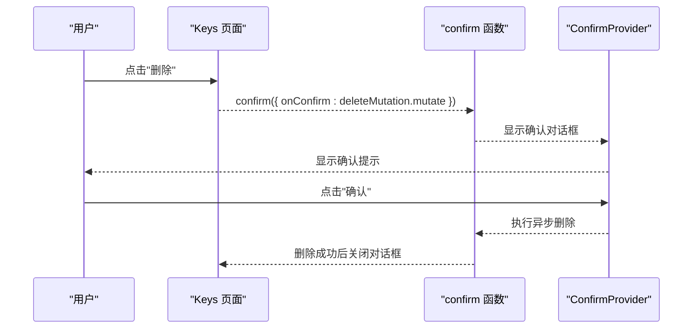

**图表来源**
- [src/app/(dashboard)/keys/page.tsx](file://src/app/(dashboard)/keys/page.tsx#L65-L75)
- [src/components/ui/confirm.tsx](file://src/components/ui/confirm.tsx#L62-L79)

**章节来源**
- [src/app/(dashboard)/keys/page.tsx](file://src/app/(dashboard)/keys/page.tsx#L65-L75)
- [src/components/ui/confirm.tsx](file://src/components/ui/confirm.tsx#L155-L169)

#### 示例二：表单对话框（添加/编辑 API Key）
- 适用场景：新增或修改配置项
- 组件构成：Dialog + 表单域（Input/Select/Label）+ 页脚按钮
- 关键点：受控表单、实时校验、加载态、错误提示

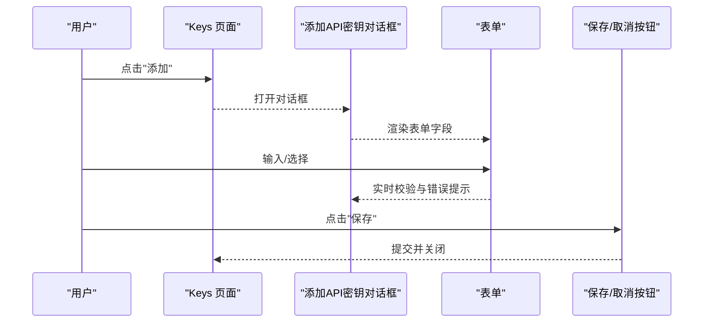

**图表来源**
- [src/app/(dashboard)/keys/components/add-api-key-dialog.tsx](file://src/app/(dashboard)/keys/components/add-api-key-dialog.tsx#L33-L261)
- [src/components/ui/input.tsx](file://src/components/ui/input.tsx#L8-L21)
- [src/components/ui/select.tsx](file://src/components/ui/select.tsx#L13-L31)
- [src/components/ui/button.tsx](file://src/components/ui/button.tsx#L43-L54)

**章节来源**
- [src/app/(dashboard)/keys/components/add-api-key-dialog.tsx](file://src/app/(dashboard)/keys/components/add-api-key-dialog.tsx#L1-L265)
- [src/components/ui/input.tsx](file://src/components/ui/input.tsx#L1-L26)
- [src/components/ui/select.tsx](file://src/components/ui/select.tsx#L1-L152)
- [src/components/ui/button.tsx](file://src/components/ui/button.tsx#L1-L58)

#### 示例三：信息提示对话框（查看生成代码）
- 适用场景：展示只读信息与辅助操作
- 组件构成：Dialog + 页眉（含复制按钮）+ 内容区域（代码块）
- 关键点：最大宽度/高度限制、滚动区域、说明性提示

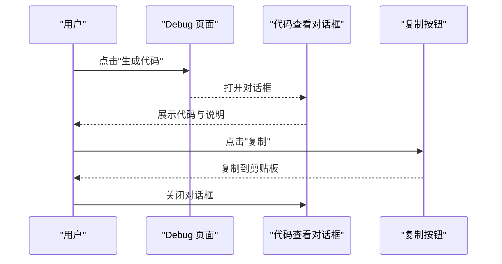

**图表来源**
- [src/app/(dashboard)/debug/components/code-modal.tsx](file://src/app/(dashboard)/debug/components/code-modal.tsx#L14-L51)

**章节来源**
- [src/app/(dashboard)/debug/components/code-modal.tsx](file://src/app/(dashboard)/debug/components/code-modal.tsx#L1-L55)

#### 示例四：即时通知反馈（API Key 管理）
- 适用场景：表单提交后的即时反馈
- 组件构成：trpc mutation + toast.success/error
- 关键点：成功/失败状态的即时通知，支持中文提示

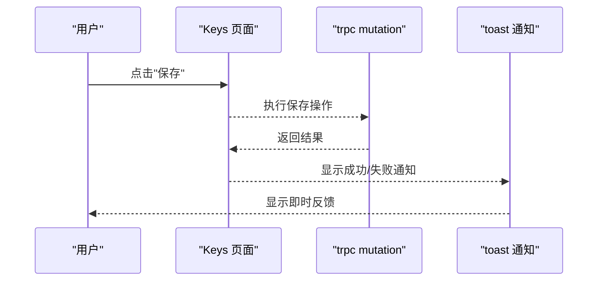

**图表来源**
- [src/app/(dashboard)/keys/page.tsx](file://src/app/(dashboard)/keys/page.tsx#L16-L51)
- [src/components/ui/sonner.tsx](file://src/components/ui/sonner.tsx#L15-L43)

**章节来源**
- [src/app/(dashboard)/keys/page.tsx](file://src/app/(dashboard)/keys/page.tsx#L1-L142)
- [src/app/(dashboard)/users/page.tsx](file://src/app/(dashboard)/users/page.tsx#L33-L78)
- [src/app/(dashboard)/quotas/page.tsx](file://src/app/(dashboard)/quotas/page.tsx#L33-L56)

#### 示例五：确认对话框（删除白名单规则）
- **新方式**：使用 confirm 函数替代传统模态框
- 适用场景：删除白名单规则前的确认
- 组件构成：confirm 函数 + ConfirmProvider
- 关键点：简单字符串调用、Promise 返回值处理

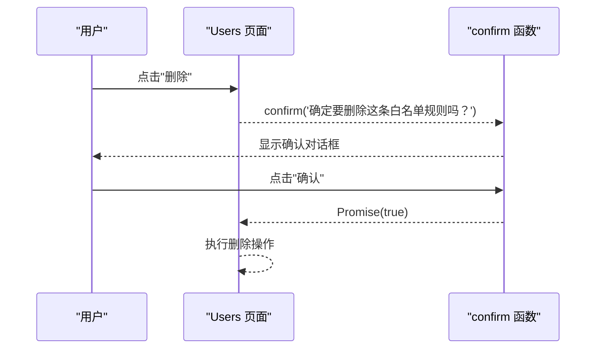

**图表来源**
- [src/app/(dashboard)/users/page.tsx](file://src/app/(dashboard)/users/page.tsx#L94-L98)
- [src/components/ui/confirm.tsx](file://src/components/ui/confirm.tsx#L155-L169)

**章节来源**
- [src/app/(dashboard)/users/page.tsx](file://src/app/(dashboard)/users/page.tsx#L94-L98)

### 可访问性支持
- 键盘导航：支持 Tab 切换、Shift+Tab 反向切换、Esc 关闭
- 焦点陷阱：打开时聚焦到首个可交互元素，关闭时返回触发源
- ARIA 属性：标题与描述通过语义化标签提供上下文，覆盖层与内容容器具备状态类名供屏幕阅读器识别
- 低视力友好：高对比度与颜色变量适配深浅色模式
- **新增**：确认对话框可访问性：ConfirmProvider 基于 AlertDialog，提供完善的键盘导航和焦点管理
- **新增**：通知可访问性：Sonner 提供适当的 ARIA 属性和键盘导航支持

**章节来源**
- [src/components/ui/dialog.tsx](file://src/components/ui/dialog.tsx#L15-L51)
- [src/components/ui/confirm.tsx](file://src/components/ui/confirm.tsx#L98-L150)
- [src/components/ui/sonner.tsx](file://src/components/ui/sonner.tsx#L15-L43)

### 动画与过渡效果
- 背景遮罩：淡入淡出，配合模糊背景
- 对话框主体：同时具备淡入淡出、缩放与滑入滑出的复合动画
- 过渡时长：统一的持续时间，保证流畅体验
- 动画类：基于状态类名（open/closed）自动切换
- **新增**：确认对话框动画：ConfirmProvider 使用 AlertDialog，提供平滑的确认对话框进入和退出动画
- **新增**：通知动画：Sonner 提供平滑的通知进入和退出动画

**章节来源**
- [src/components/ui/dialog.tsx](file://src/components/ui/dialog.tsx#L19-L41)
- [src/components/ui/confirm.tsx](file://src/components/ui/confirm.tsx#L98-L150)
- [src/components/ui/sonner.tsx](file://src/components/ui/sonner.tsx#L15-L43)

### 通知系统集成
- **Toaster 组件**：基于 Sonner 库的全局通知服务，支持多种通知类型
- **通知类型**：success（成功）、error（错误）、warning（警告）、info（信息）、loading（加载）
- **图标定制**：使用 lucide-react 图标库提供语义化图标
- **主题适配**：集成 next-themes，自动适配深浅色模式
- **样式定制**：通过 classNames 自定义通知外观，保持与整体设计风格一致

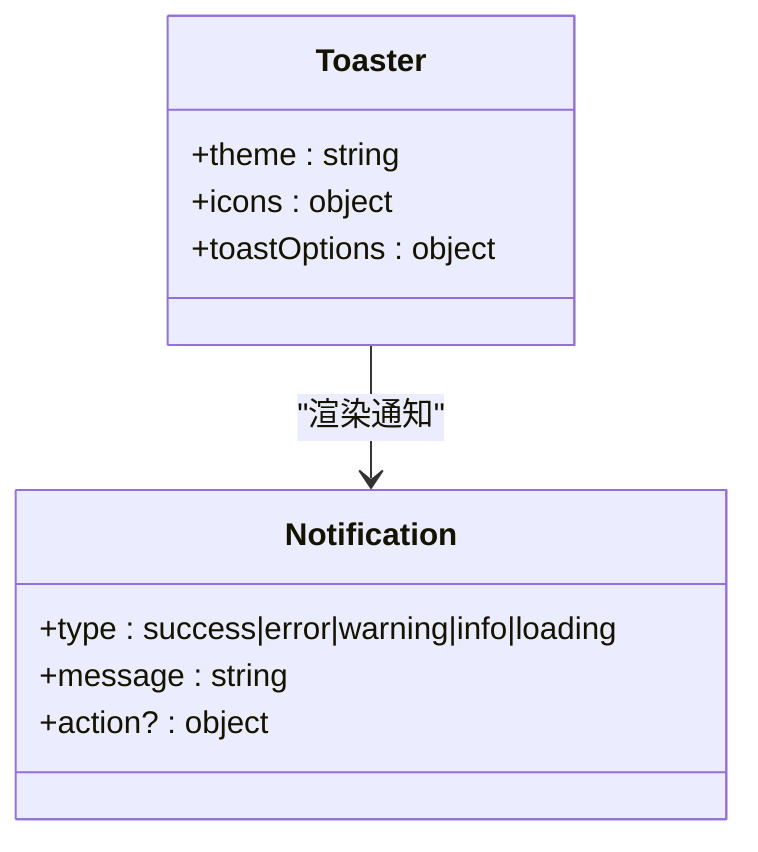

**图表来源**
- [src/components/ui/sonner.tsx](file://src/components/ui/sonner.tsx#L15-L43)

**章节来源**
- [src/components/ui/sonner.tsx](file://src/components/ui/sonner.tsx#L1-L45)
- [src/app/layout.tsx](file://src/app/layout.tsx#L53-L56)

### 与其他组件的集成模式
- 表单提交：在 Dialog 内嵌入 Input/Select/Button，通过受控状态与校验函数实现提交
- 确认操作：使用 confirm 函数替代传统的模态框组件，支持异步操作和加载状态
- 信息展示：在头部放置标题与辅助按钮，在主体区域放置只读内容与说明
- **新增**：即时反馈：在业务操作完成后通过 toast 显示即时反馈
- **新增**：确认服务：使用 ConfirmProvider 替代传统的浏览器确认框，提供更好的用户体验

**章节来源**
- [src/app/(dashboard)/keys/components/add-api-key-dialog.tsx](file://src/app/(dashboard)/keys/components/add-api-key-dialog.tsx#L161-L258)
- [src/app/(dashboard)/debug/components/code-modal.tsx](file://src/app/(dashboard)/debug/components/code-modal.tsx#L19-L48)
- [src/app/(dashboard)/keys/components/delete-confirm-modal.tsx](file://src/app/(dashboard)/keys/components/delete-confirm-modal.tsx#L42-L56)
- [src/components/ui/confirm.tsx](file://src/components/ui/confirm.tsx#L36-L153)

## 依赖关系分析
- 组件依赖：Dialog 基于 @radix-ui/react-dialog；工具函数 cn 来自 src/lib/utils.ts
- **新增**：确认对话框依赖：ConfirmProvider 基于 @radix-ui/react-alert-dialog，集成 ahooks hooks
- **新增**：通知依赖：Toaster 基于 sonner 库，集成 lucide-react 图标和 next-themes 主题
- 样式与主题：Tailwind 类名 + CSS 变量（如 --popover、--accent、--ring 等）
- 动画库：tailwindcss-animate 提供动画类
- 图标库：lucide-react 提供图标（X、Eye、EyeOff、Copy 等）

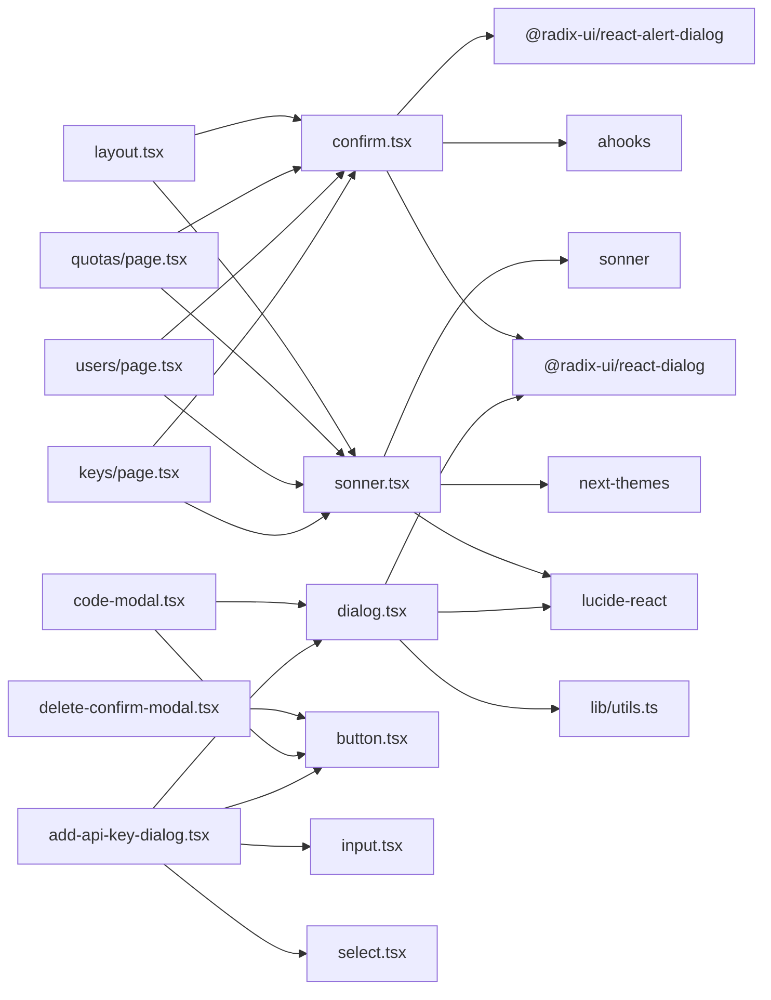

**图表来源**
- [src/components/ui/dialog.tsx](file://src/components/ui/dialog.tsx#L1-L6)
- [src/components/ui/confirm.tsx](file://src/components/ui/confirm.tsx#L1-L14)
- [src/components/ui/sonner.tsx](file://src/components/ui/sonner.tsx#L1-L11)
- [src/lib/utils.ts](file://src/lib/utils.ts#L4-L6)
- [package.json](file://package.json#L24-L55)

**章节来源**
- [src/components/ui/dialog.tsx](file://src/components/ui/dialog.tsx#L1-L121)
- [src/components/ui/confirm.tsx](file://src/components/ui/confirm.tsx#L1-L170)
- [src/components/ui/sonner.tsx](file://src/components/ui/sonner.tsx#L1-L45)
- [src/lib/utils.ts](file://src/lib/utils.ts#L1-L7)
- [package.json](file://package.json#L18-L56)

## 性能考量
- 渲染策略：通过 Portal 将内容挂载到顶层，避免层级与定位计算开销
- 动画优化：使用 CSS 动画而非 JS 动画，减少主线程压力
- 状态最小化：仅在 open 状态变化时重渲染，避免不必要的子树更新
- 样式合并：使用 cn 合并类名，减少重复与冲突
- **新增**：确认对话框性能：ConfirmProvider 使用单例模式，避免重复实例化
- **新增**：通知性能：Sonner 优化的通知渲染，避免阻塞主线程
- **新增**：异步处理：confirm 函数支持异步操作，自动处理加载状态

## 故障排查指南
- 对话框无法打开/关闭
  - 检查受控属性 open 与回调 onOpenChange 是否正确传递
  - 确认 DialogTrigger 是否包裹了可交互元素
- 焦点未正确捕获
  - 确保内容容器内存在可聚焦元素；检查禁用态与可见性
- 背景遮罩无效
  - 检查 Portal 是否成功渲染到顶层；确认 z-index 与定位
- 动画不生效
  - 检查状态类名（open/closed）是否正确；确认 tailwindcss-animate 已引入
- 深浅色模式显示异常
  - 检查 CSS 变量是否在根节点正确注入；确认主题切换逻辑
- **新增**：确认对话框不工作
  - 检查 ConfirmProvider 是否包裹了整个应用
  - 确认 confirm 函数的调用时机和参数
  - 检查 onConfirm 回调是否正确处理异步操作
- **新增**：确认对话框样式异常
  - 检查 variant 属性是否正确设置
  - 确认按钮样式类名是否正确应用
- **新增**：通知不显示
  - 检查 Toaster 是否在应用布局中正确渲染
  - 确认 toast 函数是否正确导入和使用

**章节来源**
- [src/components/ui/dialog.tsx](file://src/components/ui/dialog.tsx#L15-L51)
- [src/components/ui/confirm.tsx](file://src/components/ui/confirm.tsx#L36-L153)
- [src/components/ui/sonner.tsx](file://src/components/ui/sonner.tsx#L15-L43)
- [src/lib/utils.ts](file://src/lib/utils.ts#L4-L6)

## 结论
AIGate 的反馈与对话组件体系以 Radix UI 为基础，结合 Tailwind/CSS 变量与动画库，构建了高可访问性、强一致性的对话框体系。通过在 Keys、Users 与 Quotas 页面中的实践，Dialog 在表单、确认与信息展示三大场景中均实现了良好的用户体验与开发效率。

**新增的 ConfirmProvider 确认对话框系统**进一步完善了用户交互体验，提供了可编程、可定制、支持异步操作的确认对话框服务。该系统替代了原有的 DeleteConfirmModal 组件，为 API Key 管理、白名单规则管理和配额管理等关键业务场景提供了更加灵活和强大的确认机制。

**新增的 Sonner toast 库集成**进一步完善了用户体验反馈体系，为各个业务场景提供了即时、直观的反馈通知。结合 ConfirmProvider 的可编程确认对话框服务，形成了从用户交互到即时反馈的完整闭环。

建议在后续迭代中进一步完善 confirm 函数的错误处理机制、ConfirmProvider 的配置选项扩展，以及通知系统的批量处理和多语言支持，以增强国际化与可访问性。

## 附录
- 快速参考
  - 打开/关闭：通过 open/onOpenChange 控制
  - 触发器：包裹任意元素，触发状态切换
  - 页眉/页脚：语义化分组，便于扩展复杂交互
  - 动画：入场/出场动画统一，过渡时长一致
  - 可访问性：键盘可达、焦点陷阱、ARIA 属性完备
  - **新增**：确认对话框：通过 confirm() 函数显示可编程的确认对话框
  - **新增**：确认选项：支持自定义标题、描述、按钮文本和样式变体
  - **新增**：异步支持：onConfirm 回调支持 Promise 异步操作
  - **新增**：通知：通过 toast.success/error/warning/info/loading 显示即时反馈
  - **新增**：主题：自动适配深浅色模式，保持视觉一致性