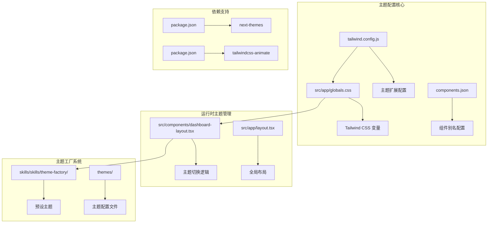
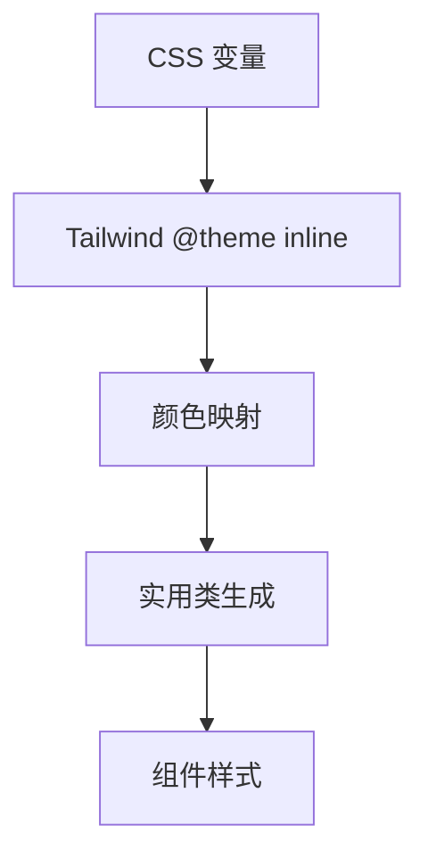
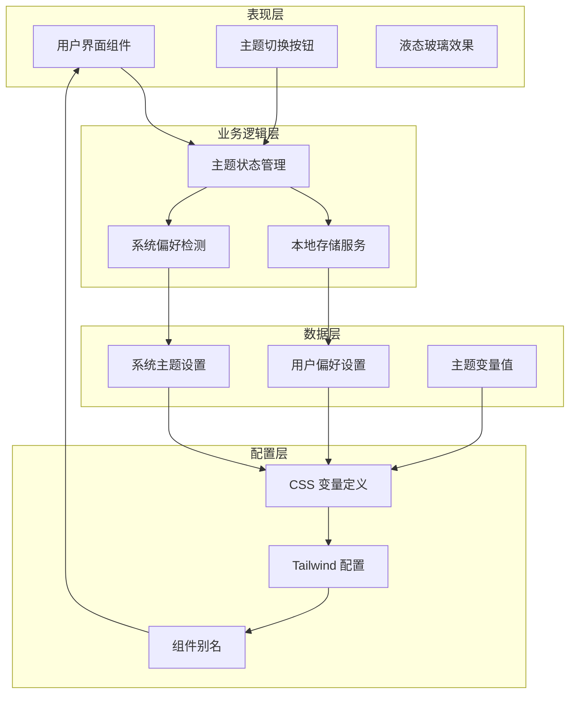
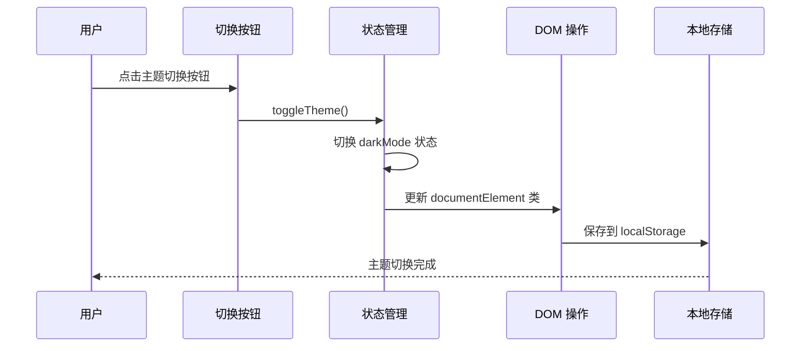
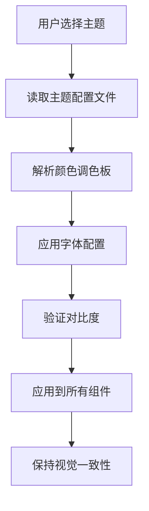
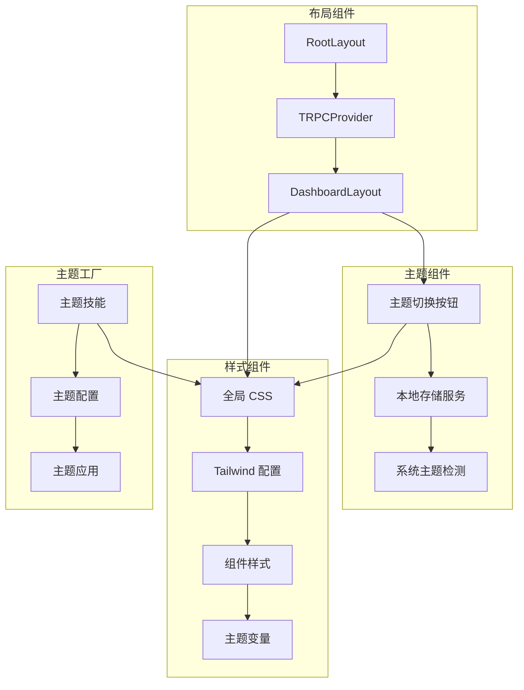

# 增强的主题配置系统

<cite>
**本文档引用的文件**
- [package.json](file://package.json)
- [tailwind.config.js](file://tailwind.config.js)
- [components.json](file://components.json)
- [src/app/globals.css](file://src/app/globals.css)
- [src/app/layout.tsx](file://src/app/layout.tsx)
- [src/components/dashboard-layout.tsx](file://src/components/dashboard-layout.tsx)
- [skills/skills/theme-factory/SKILL.md](file://skills/skills/theme-factory/SKILL.md)
- [skills/skills/theme-factory/themes/ocean-depths.md](file://skills/skills/theme-factory/themes/ocean-depths.md)
- [skills/skills/theme-factory/themes/sunset-boulevard.md](file://skills/skills/theme-factory/themes/sunset-boulevard.md)
- [readme/ui-rule.md](file://readme/ui-rule.md)
- [.agents/skills/shadcn/customization.md](file://.agents/skills/shadcn/customization.md)
</cite>

## 目录
1. [简介](#简介)
2. [项目结构](#项目结构)
3. [核心组件](#核心组件)
4. [架构概览](#架构概览)
5. [详细组件分析](#详细组件分析)
6. [依赖关系分析](#依赖关系分析)
7. [性能考虑](#性能考虑)
8. [故障排除指南](#故障排除指南)
9. [结论](#结论)

## 简介

AIGate 是一个基于 Next.js 16.1.6 构建的 AI 网关管理后台系统，采用了先进的主题配置系统。该系统实现了现代化的液态玻璃（Liquid Glass）视觉效果，结合深色/浅色主题切换，为用户提供沉浸式的用户体验。

本系统的核心特色包括：
- **CSS 变量驱动的主题系统**：通过 `:root` 和 `.dark` 类实现主题切换
- **液态玻璃视觉效果**：利用 backdrop-filter 实现毛玻璃效果
- **响应式主题切换**：支持系统偏好检测和手动切换
- **主题工厂系统**：提供预设主题和自定义主题能力
- **Tailwind CSS 集成**：完整的 CSS 工具类系统支持

## 项目结构

AIGate 项目的主题配置系统主要分布在以下几个关键目录中：



**图表来源**
- [src/app/globals.css](file://src/app/globals.css#L1-L136)
- [tailwind.config.js](file://tailwind.config.js#L1-L78)
- [src/components/dashboard-layout.tsx](file://src/components/dashboard-layout.tsx#L1-L197)

**章节来源**
- [package.json](file://package.json#L1-L90)
- [tailwind.config.js](file://tailwind.config.js#L1-L78)
- [components.json](file://components.json#L1-L18)

## 核心组件

### CSS 变量主题系统

系统采用 CSS 自定义属性（CSS Variables）作为主题配置的核心机制。通过 `:root` 和 `.dark` 类定义主题变量，实现深色和浅色模式的无缝切换。

关键特性：
- **语义化变量命名**：`--background`、`--foreground`、`--primary` 等
- **双模式支持**：同时定义浅色和深色模式变量
- **液态玻璃效果**：专门的 `--glass-*` 变量实现毛玻璃效果
- **字体变量**：`--font-sans` 和 `--font-mono` 支持字体主题

### Tailwind CSS 集成

Tailwind CSS 通过配置文件扩展了主题系统，将 CSS 变量映射到实用类：



**图表来源**
- [src/app/globals.css](file://src/app/globals.css#L53-L86)
- [tailwind.config.js](file://tailwind.config.js#L19-L74)

### 主题切换组件

Dashboard 布局组件实现了完整的主题切换功能：

- **本地存储持久化**：使用 `localStorage` 保存用户偏好
- **系统偏好检测**：自动检测用户的系统主题设置
- **实时切换动画**：平滑的主题切换过渡效果
- **液态玻璃头部**：使用 `backdrop-blur-2xl` 实现毛玻璃效果

**章节来源**
- [src/components/dashboard-layout.tsx](file://src/components/dashboard-layout.tsx#L58-L90)
- [src/app/globals.css](file://src/app/globals.css#L127-L136)

## 架构概览

AIGate 的主题配置系统采用分层架构设计，从底层的 CSS 变量到顶层的用户交互形成了完整的主题生态系统：



**图表来源**
- [src/components/dashboard-layout.tsx](file://src/components/dashboard-layout.tsx#L53-L90)
- [src/app/globals.css](file://src/app/globals.css#L5-L136)
- [tailwind.config.js](file://tailwind.config.js#L1-L78)

## 详细组件分析

### Dashboard 布局主题系统

Dashboard 布局组件是主题系统的核心实现，包含了完整的主题切换逻辑：

#### 主题切换流程



**图表来源**
- [src/components/dashboard-layout.tsx](file://src/components/dashboard-layout.tsx#L58-L90)

#### 初始化主题检测

系统在组件挂载时会执行主题初始化逻辑：

1. **读取本地存储**：检查用户之前的偏好设置
2. **检测系统偏好**：获取系统的深色模式设置
3. **应用主题**：根据检测结果应用相应的主题类
4. **更新状态**：设置组件的内部状态

**章节来源**
- [src/components/dashboard-layout.tsx](file://src/components/dashboard-layout.tsx#L64-L81)

### CSS 变量主题定义

系统通过 CSS 变量实现了完整的主题配置机制：

#### 变量分类

| 分类 | 变量名称 | 用途描述 |
|------|----------|----------|
| 基础颜色 | `--background`、`--foreground` | 页面背景和文本颜色 |
| 卡片组件 | `--card`、`--card-foreground` | 卡片表面和前景色 |
| 主要强调 | `--primary`、`--primary-foreground` | 主要按钮和操作 |
| 次要强调 | `--secondary`、`--secondary-foreground` | 次要操作和状态 |
| 突出显示 | `--accent`、`--accent-foreground` | 悬停和强调状态 |
| 错误状态 | `--destructive`、`--destructive-foreground` | 错误和危险操作 |

#### 液态玻璃变量

系统特别定义了用于实现毛玻璃效果的变量：

- `--glass-blur`: 模糊效果强度（默认 20px）
- `--glass-saturation`: 饱和度调整（默认 180%）

**章节来源**
- [src/app/globals.css](file://src/app/globals.css#L5-L51)
- [src/app/globals.css](file://src/app/globals.css#L88-L129)

### Tailwind CSS 配置集成

Tailwind CSS 通过配置文件扩展了主题系统，实现了 CSS 变量到实用类的映射：

#### 颜色扩展配置

Tailwind 配置文件中的颜色扩展定义了如何将 CSS 变量映射到实用类：

- **基础颜色映射**：将 `hsl(var(--color-name))` 映射到 `bg-color-name`
- **圆角半径**：使用 `calc(var(--radius) - npx)` 实现动态圆角
- **动画配置**：定义了手风琴展开收起的动画效果

#### 主题变量注册

通过 `@theme inline` 指令，系统将 CSS 变量注册为 Tailwind 的主题变量：

```css
@theme inline {
  --color-background: var(--background);
  --color-foreground: var(--foreground);
  --color-primary: var(--primary);
  --color-secondary: var(--secondary);
  --color-muted: var(--muted);
  --color-accent: var(--accent);
  --color-destructive: var(--destructive);
  --color-border: var(--border);
  --color-input: var(--input);
  --color-ring: var(--ring);
  --font-sans: var(--font-geist-sans);
  --font-mono: var(--font-geist-mono);
}
```

**章节来源**
- [tailwind.config.js](file://tailwind.config.js#L19-L74)
- [src/app/globals.css](file://src/app/globals.css#L53-L86)

### 主题工厂系统

主题工厂技能提供了预设主题和自定义主题的能力：

#### 预设主题集合

系统包含 10 个精心设计的预设主题：

| 主题名称 | 风格特点 | 适用场景 |
|----------|----------|----------|
| Ocean Depths | 深海宁静感 | 企业演示、财务报告 |
| Sunset Boulevard | 温暖活力 | 创意提案、营销演示 |
| Forest Canopy | 自然质朴 | 科研报告、教育材料 |
| Modern Minimalist | 现代简约 | 技术演示、数据分析 |
| Golden Hour | 温暖秋色 | 商业计划、投资演示 |
| Arctic Frost | 冷峻清新 | 科技产品、数据分析 |
| Desert Rose | 柔和优雅 | 时尚品牌、生活方式 |
| Tech Innovation | 现代科技 | 技术发布、产品演示 |
| Botanical Garden | 新鲜自然 | 生态环境、健康主题 |
| Midnight Galaxy | 宇宙深邃 | 科幻主题、创意作品 |

#### 主题应用流程



**图表来源**
- [skills/skills/theme-factory/SKILL.md](file://skills/skills/theme-factory/SKILL.md#L20-L57)

**章节来源**
- [skills/skills/theme-factory/SKILL.md](file://skills/skills/theme-factory/SKILL.md#L28-L60)
- [skills/skills/theme-factory/themes/ocean-depths.md](file://skills/skills/theme-factory/themes/ocean-depths.md#L1-L20)
- [skills/skills/theme-factory/themes/sunset-boulevard.md](file://skills/skills/theme-factory/themes/sunset-boulevard.md#L1-L20)

## 依赖关系分析

### 核心依赖关系

AIGate 的主题配置系统依赖于多个关键库和框架：

```mermaid
graph LR
subgraph "主题系统依赖"
A[next-themes] --> B[主题提供者]
C[tailwindcss-animate] --> D[动画支持]
E[class-variance-authority] --> F[组件变体]
G[clsx] --> H[类名合并]
end
subgraph "UI 组件库"
I[lucide-react] --> J[图标系统]
K[@radix-ui/*] --> L[无障碍组件]
M[sonner] --> N[通知系统]
end
subgraph "构建工具"
O[Next.js 16.1.6] --> P[SSR 支持]
Q[Tailwind CSS v4] --> R[CSS 工具类]
S[TypeScript] --> T[类型安全]
end
A --> B
C --> D
E --> F
G --> H
I --> J
K --> L
M --> N
O --> P
Q --> R
S --> T
```

**图表来源**
- [package.json](file://package.json#L18-L68)

### 组件间依赖关系

系统中各组件之间的依赖关系如下：



**图表来源**
- [src/app/layout.tsx](file://src/app/layout.tsx#L25-L57)
- [src/components/dashboard-layout.tsx](file://src/components/dashboard-layout.tsx#L53-L90)

**章节来源**
- [package.json](file://package.json#L18-L68)

## 性能考虑

### 主题切换性能优化

系统在主题切换方面采用了多项性能优化措施：

#### CSS 变量的优势

- **零 JavaScript 计算**：主题切换完全由 CSS 处理
- **硬件加速**：backdrop-filter 使用 GPU 加速
- **内存效率**：单个 CSS 文件包含所有主题变量

#### 组件渲染优化

- **最小重绘**：只更新必要的 DOM 属性
- **防抖处理**：避免频繁的主题切换导致的性能问题
- **懒加载**：主题相关的资源按需加载

### 主题工厂性能特性

主题工厂系统在处理大量主题时也考虑了性能因素：

- **文件缓存**：主题配置文件可以被浏览器缓存
- **增量应用**：只应用发生变化的主题部分
- **批量更新**：支持批量主题切换操作

## 故障排除指南

### 常见问题及解决方案

#### 主题切换不生效

**问题描述**：用户切换主题后界面没有变化

**可能原因**：
1. CSS 变量未正确更新
2. Tailwind 编译缓存问题
3. 浏览器兼容性问题

**解决步骤**：
1. 检查浏览器控制台是否有 CSS 错误
2. 清除浏览器缓存重新加载页面
3. 验证 CSS 变量是否正确应用到根元素

#### 液态玻璃效果异常

**问题描述**：backdrop-filter 效果在某些浏览器中不显示

**可能原因**：
1. 浏览器不支持 backdrop-filter
2. CSS 语法错误
3. 父容器遮挡问题

**解决方法**：
1. 检查浏览器兼容性支持情况
2. 验证 CSS 语法正确性
3. 确保父容器没有遮挡效果

#### 主题持久化失败

**问题描述**：用户刷新页面后主题设置丢失

**解决步骤**：
1. 检查浏览器是否禁用 localStorage
2. 验证 localStorage 是否有存储空间
3. 确认主题切换函数是否正确执行

**章节来源**
- [src/components/dashboard-layout.tsx](file://src/components/dashboard-layout.tsx#L58-L90)
- [src/app/globals.css](file://src/app/globals.css#L1-L136)

## 结论

AIGate 的增强主题配置系统展现了现代前端开发的最佳实践，通过以下关键特性实现了卓越的用户体验：

### 系统优势

1. **完整的主题生命周期**：从变量定义到组件应用的完整链路
2. **高性能实现**：纯 CSS 实现的主题切换，无额外 JavaScript 开销
3. **灵活的定制能力**：支持预设主题和自定义主题的双重机制
4. **优秀的用户体验**：流畅的主题切换动画和一致的视觉效果

### 技术创新

- **液态玻璃效果**：通过 CSS backdrop-filter 实现的现代视觉效果
- **响应式主题系统**：自动适应系统偏好和用户偏好的智能切换
- **组件化主题设计**：基于 CSS 变量的模块化主题架构

### 应用价值

该主题配置系统不仅适用于 AIGate 项目，还可以作为其他类似管理后台系统的参考模板，为开发者提供了一个完整的、可扩展的主题解决方案。通过合理的架构设计和技术选型，系统在保证功能完整性的同时，也确保了良好的性能表现和用户体验。