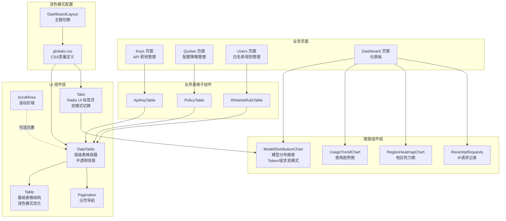
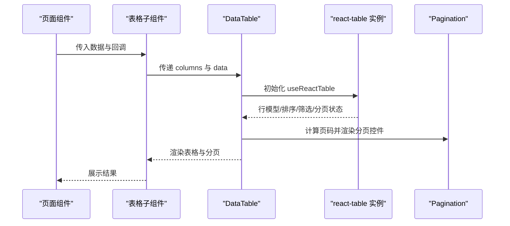
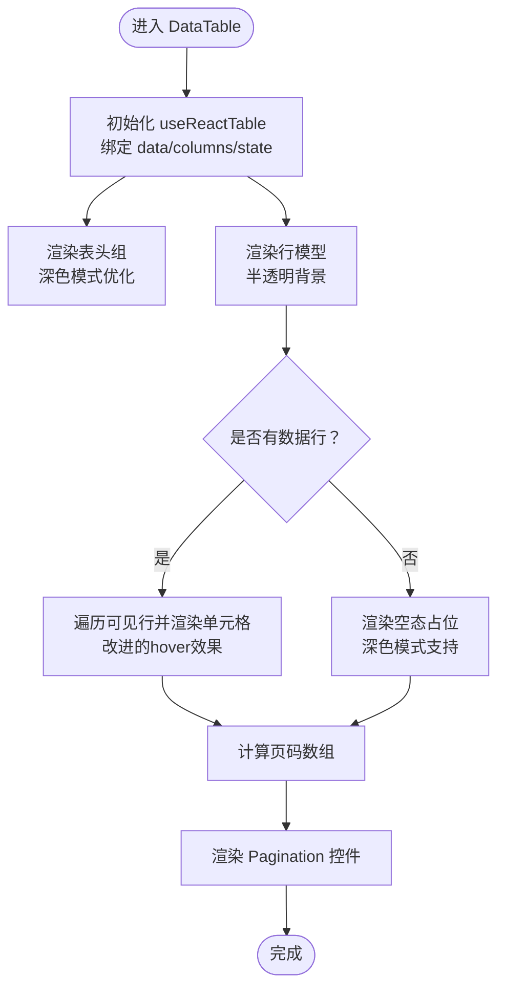
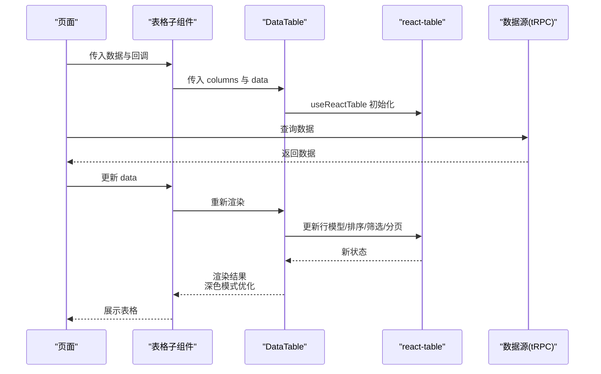
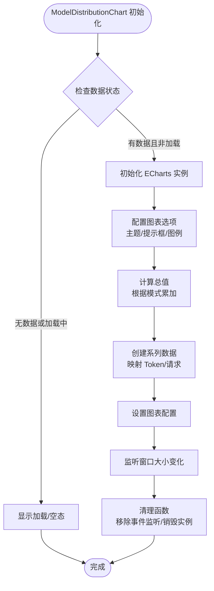
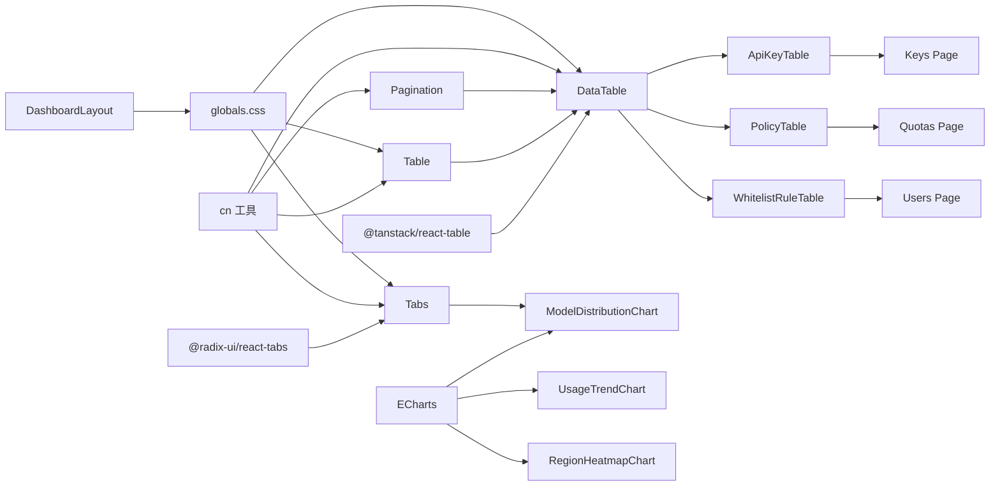

# 数据展示组件

<cite>
**本文引用的文件**
- [src/components/ui/table.tsx](file://src/components/ui/table.tsx)
- [src/components/ui/data-table.tsx](file://src/components/ui/data-table.tsx)
- [src/components/ui/pagination.tsx](file://src/components/ui/pagination.tsx)
- [src/components/ui/scroll-area.tsx](file://src/components/ui/scroll-area.tsx)
- [src/components/ui/tabs.tsx](file://src/components/ui/tabs.tsx)
- [src/app/(dashboard)/components/model-distribution-chart.tsx](file://src/app/(dashboard)/components/model-distribution-chart.tsx)
- [src/app/(dashboard)/components/usage-trend-chart.tsx](file://src/app/(dashboard)/components/usage-trend-chart.tsx)
- [src/app/(dashboard)/components/region-heatmap-chart.tsx](file://src/app/(dashboard)/components/region-heatmap-chart.tsx)
- [src/app/(dashboard)/components/recent-ip-requests.tsx](file://src/app/(dashboard)/components/recent-ip-requests.tsx)
- [src/app/(dashboard)/page.tsx](file://src/app/(dashboard)/page.tsx)
- [src/app/(dashboard)/keys/components/api-key-table.tsx](file://src/app/(dashboard)/keys/components/api-key-table.tsx)
- [src/app/(dashboard)/quotas/components/policy-table.tsx](file://src/app/(dashboard)/quotas/components/policy-table.tsx)
- [src/app/(dashboard)/users/components/whitelist-rule-table.tsx](file://src/app/(dashboard)/users/components/whitelist-rule-table.tsx)
- [src/app/(dashboard)/keys/page.tsx](file://src/app/(dashboard)/keys/page.tsx)
- [src/app/(dashboard)/quotas/page.tsx](file://src/app/(dashboard)/quotas/page.tsx)
- [src/app/(dashboard)/users/page.tsx](file://src/app/(dashboard)/users/page.tsx)
- [src/types/api-key.ts](file://src/types/api-key.ts)
- [src/types/dashboard.ts](file://src/types/dashboard.ts)
- [src/lib/utils.ts](file://src/lib/utils.ts)
- [src/app/globals.css](file://src/app/globals.css)
- [src/components/dashboard-layout.tsx](file://src/components/dashboard-layout.tsx)
</cite>

## 更新摘要
**变更内容**
- 新增模型分布图表组件，集成 Radix UI 标签页，支持 Token 消耗分布和请求次数分布双模式显示
- 仪表板页面集成了新的图表组件，提供更丰富的数据可视化能力
- 扩展了图表组件生态系统，包括使用趋势图、地区热力图等
- 更新了 DataTable 组件的深色模式样式优化，包括半透明背景、backdrop blur 效果、改进的 hover 和 selected 状态样式

## 目录
1. [简介](#简介)
2. [项目结构](#项目结构)
3. [核心组件](#核心组件)
4. [架构总览](#架构总览)
5. [组件详解](#组件详解)
6. [图表组件生态系统](#图表组件生态系统)
7. [深色模式优化](#深色模式优化)
8. [依赖关系分析](#依赖关系分析)
9. [性能考量](#性能考量)
10. [故障排查指南](#故障排查指南)
11. [结论](#结论)
12. [附录](#附录)

## 简介
本文件面向 AIGate 的数据展示组件，系统性解析 Table、DataTable、Pagination、ScrollArea 四大组件的数据处理与渲染机制，覆盖静态数据、动态数据与异步数据的绑定模式；阐述排序、筛选与分页功能的实现；提供表格列配置、分页控制与滚动区域设置的使用范式；总结虚拟滚动、懒加载与数据缓存等性能优化策略；说明响应式设计与移动端适配、触摸交互；并解释可访问性特性（语义化表格、键盘导航、屏幕阅读器支持）。

**更新** 本版本重点介绍了深色模式的全面优化，包括半透明背景、backdrop blur 效果和改进的交互状态样式。同时新增了模型分布图表组件，集成了 Radix UI 标签页，支持 Token 消耗分布和请求次数分布双模式显示。

## 项目结构
围绕数据展示的核心文件组织如下：
- UI 基础组件：Table、Pagination、ScrollArea、Tabs
- 高阶组件：DataTable（基于 @tanstack/react-table）
- 图表组件：模型分布图、使用趋势图、地区热力图等
- 页面与业务组件：各模块的表格页面与表格子组件
- 类型与工具：通用类型定义与样式合并工具
- 深色模式配置：全局CSS变量和主题切换

**图表来源**
- [src/components/ui/table.tsx](file://src/components/ui/table.tsx#L1-L95)
- [src/components/ui/data-table.tsx](file://src/components/ui/data-table.tsx#L1-L191)
- [src/components/ui/pagination.tsx](file://src/components/ui/pagination.tsx#L1-L118)
- [src/components/ui/scroll-area.tsx](file://src/components/ui/scroll-area.tsx#L1-L49)
- [src/components/ui/tabs.tsx](file://src/components/ui/tabs.tsx#L1-L56)
- [src/app/(dashboard)/components/model-distribution-chart.tsx](file://src/app/(dashboard)/components/model-distribution-chart.tsx#L1-L148)
- [src/app/(dashboard)/components/usage-trend-chart.tsx](file://src/app/(dashboard)/components/usage-trend-chart.tsx#L1-L200)
- [src/app/(dashboard)/components/region-heatmap-chart.tsx](file://src/app/(dashboard)/components/region-heatmap-chart.tsx#L1-L174)
- [src/app/(dashboard)/page.tsx](file://src/app/(dashboard)/page.tsx#L1-L138)

**章节来源**
- [src/components/ui/table.tsx](file://src/components/ui/table.tsx#L1-L95)
- [src/components/ui/data-table.tsx](file://src/components/ui/data-table.tsx#L1-L191)
- [src/components/ui/pagination.tsx](file://src/components/ui/pagination.tsx#L1-L118)
- [src/components/ui/scroll-area.tsx](file://src/components/ui/scroll-area.tsx#L1-L49)
- [src/components/ui/tabs.tsx](file://src/components/ui/tabs.tsx#L1-L56)

## 核心组件
- Table：提供语义化表格骨架（表头、表体、行、单元格、标题、脚注），内置深色主题与悬停态样式，支持半透明背景和backdrop blur效果。
- DataTable：封装 @tanstack/react-table，提供排序、筛选、分页、空态展示与页码生成逻辑，采用半透明背景和改进的交互样式。
- Pagination：语义化分页导航，支持"上一页/下一页""页码链接""省略号"。
- ScrollArea：Radix UI 滚动区域，支持垂直/水平滚动条与触摸手势。
- Tabs：Radix UI 标签页组件，提供可访问的标签切换功能，支持键盘导航和状态管理。

**更新** DataTable和Table组件现在具有增强的深色模式支持，包括半透明背景、backdrop blur效果和改进的hover状态。新增的Tabs组件提供了可访问的标签切换功能。

**章节来源**
- [src/components/ui/table.tsx](file://src/components/ui/table.tsx#L1-L95)
- [src/components/ui/data-table.tsx](file://src/components/ui/data-table.tsx#L1-L191)
- [src/components/ui/pagination.tsx](file://src/components/ui/pagination.tsx#L1-L118)
- [src/components/ui/scroll-area.tsx](file://src/components/ui/scroll-area.tsx#L1-L49)
- [src/components/ui/tabs.tsx](file://src/components/ui/tabs.tsx#L1-L56)

## 架构总览
下图展示了从页面到表格子组件再到 DataTable 的调用链路，以及 DataTable 内部对 react-table 的集成与分页渲染。

**图表来源**
- [src/app/(dashboard)/keys/page.tsx](file://src/app/(dashboard)/keys/page.tsx#L123-L233)
- [src/app/(dashboard)/keys/components/api-key-table.tsx](file://src/app/(dashboard)/keys/components/api-key-table.tsx#L180-L188)
- [src/components/ui/data-table.tsx](file://src/components/ui/data-table.tsx#L36-L183)
- [src/components/ui/pagination.tsx](file://src/components/ui/pagination.tsx#L7-L118)

## 组件详解

### Table 组件
- 设计要点
  - 外层容器提供相对定位与横向溢出隐藏，内部表格宽度自适应。
  - 表头、表体、表尾、行、单元格、标题、脚注均提供语义化标签与样式类名。
  - 行具备悬停态与选中态，深色模式下使用半透明背景和backdrop blur效果。
- 深色模式优化
  - 悬停效果：`dark:hover:bg-slate-800/50` 提供柔和的半透明背景
  - 选中状态：`dark:data-[state=selected]:bg-slate-800` 使用深色半透明背景
  - 边框优化：`dark:border-slate-700` 与深色模式协调的边框颜色
- 使用建议
  - 在需要语义化表格时直接使用 Table 子组件组合。
  - 若需横向滚动，配合外层容器或 ScrollArea 使用。

**更新** Table组件现在具有完整的深色模式支持，包括改进的悬停和选中状态样式。

**章节来源**
- [src/components/ui/table.tsx](file://src/components/ui/table.tsx#L4-L95)

### DataTable 组件
- 数据绑定模式
  - 静态数据：直接传入 data 数组，适合小规模固定数据。
  - 动态数据：通过外部状态更新 data，组件自动重渲染。
  - 异步数据：结合查询钩子（如 tRPC）获取数据后传入，支持空态与加载态。
- 排序、筛选与分页
  - 排序：通过 state.sorting 与 getSortedRowModel 驱动；列定义可声明排序能力。
  - 筛选：通过 state.columnFilters 与 getFilteredRowModel 驱动；列定义可声明过滤器。
  - 分页：通过 getPaginationRowModel 与 initialState.pagination.pageSize 控制每页数量。
- 页码生成策略
  - 总页数 ≤7：显示全部页码。
  - 总页数 >7：根据当前页位置在两端或中间插入省略号，保持可视页码数量稳定。
- 空态展示
  - 当 rows 为空时，渲染统一的空态布局，支持自定义图标、标题与描述。
- 与 Pagination 协作
  - 通过 table 的方法控制上一页/下一页与跳转页码；根据是否可翻页禁用/激活控件。
- 深色模式优化
  - 半透明背景：`dark:bg-slate-900/80` 提供玻璃效果的半透明背景
  - backdrop blur：`backdrop-blur-sm` 增强视觉层次感
  - 改进的行样式：`dark:bg-slate-900/30 dark:hover:bg-slate-800/50` 提供更好的交互反馈
  - 选中状态：`dark:data-[state=selected]:bg-slate-800` 使用深色半透明背景
  - 表头优化：`dark:bg-slate-800/50` 与深色模式协调的表头背景

**更新** DataTable组件现在具有全面的深色模式优化，包括半透明背景、backdrop blur效果和改进的交互样式。

**图表来源**
- [src/components/ui/data-table.tsx](file://src/components/ui/data-table.tsx#L36-L183)

**章节来源**
- [src/components/ui/data-table.tsx](file://src/components/ui/data-table.tsx#L27-L191)

### Pagination 组件
- 角色与语义
  - 作为导航容器，提供 aria-label；各页码链接设置 aria-current。
  - 上一页/下一页按钮提供 aria-label 提示。
- 交互行为
  - 通过点击事件触发上一页/下一页或跳转指定页。
  - 根据当前页与可用页范围决定激活态与禁用态。
- 省略号处理
  - 通过 ellipsis 节点在页码序列中插入省略号，提升可读性。

**章节来源**
- [src/components/ui/pagination.tsx](file://src/components/ui/pagination.tsx#L7-L118)

### ScrollArea 组件
- 滚动机制
  - Root 容器提供相对定位与溢出隐藏；Viewport 承载内容。
  - ScrollBar 支持垂直/水平方向，随滚动状态过渡。
- 触摸与无障碍
  - 支持触摸拖拽滚动；滚动条与角落元素按需渲染。
- 适用场景
  - 需要在有限高度内展示大量内容时，优先考虑 ScrollArea 包裹以避免布局抖动。

**章节来源**
- [src/components/ui/scroll-area.tsx](file://src/components/ui/scroll-area.tsx#L8-L49)

### Tabs 组件
- 设计要点
  - 基于 Radix UI 实现，提供可访问的标签切换功能。
  - TabsList 提供标签容器，TabsTrigger 提供单个标签项。
  - TabsContent 提供标签内容区域。
- 深色模式支持
  - 使用 `dark:` 前缀类名实现深色模式下的样式切换。
  - 活跃状态使用 `data-[state=active]` 属性进行样式控制。
- 无障碍特性
  - 支持键盘导航（Tab、Arrow Keys）。
  - 提供适当的 ARIA 属性和角色。
- 使用场景
  - 双模式数据展示（如 Token 消耗 vs 请求次数）。
  - 多面板内容切换。

**更新** Tabs组件提供了完整的可访问性和深色模式支持。

**章节来源**
- [src/components/ui/tabs.tsx](file://src/components/ui/tabs.tsx#L1-L56)

### 业务表格子组件与页面集成
- API Key 表格
  - 列定义包含名称、服务商、API Key、Base URL、创建时间、最后使用、状态与操作。
  - 支持复制 API Key、测试密钥、启用/禁用、编辑与删除。
  - 通过 DataTable 渲染，空态提供专属图标与文案。
  - 深色模式下使用改进的文本颜色和交互样式。
- 配额策略表格
  - 列定义包含策略名称、描述、限制类型、日限额/月限额/RPM 限制、创建时间与操作。
  - 根据限制类型动态展示不同限额字段。
  - 深色模式下使用半透明背景和改进的文本颜色。
- 白名单规则表格
  - 列定义包含优先级、策略名称、描述、校验规则、状态、创建时间与操作。
  - 对规则状态与校验启用进行可视化标识。
  - 深色模式下使用改进的状态指示器样式。

**更新** 业务表格组件现在充分利用了深色模式优化，提供一致的视觉体验。

**图表来源**
- [src/app/(dashboard)/keys/page.tsx](file://src/app/(dashboard)/keys/page.tsx#L12-L233)
- [src/app/(dashboard)/keys/components/api-key-table.tsx](file://src/app/(dashboard)/keys/components/api-key-table.tsx#L20-L189)
- [src/app/(dashboard)/quotas/page.tsx](file://src/app/(dashboard)/quotas/page.tsx#L24-L135)
- [src/app/(dashboard)/quotas/components/policy-table.tsx](file://src/app/(dashboard)/quotas/components/policy-table.tsx#L28-L177)
- [src/app/(dashboard)/users/page.tsx](file://src/app/(dashboard)/users/page.tsx#L22-L141)
- [src/app/(dashboard)/users/components/whitelist-rule-table.tsx](file://src/app/(dashboard)/users/components/whitelist-rule-table.tsx#L27-L174)

**章节来源**
- [src/app/(dashboard)/keys/components/api-key-table.tsx](file://src/app/(dashboard)/keys/components/api-key-table.tsx#L1-L192)
- [src/app/(dashboard)/quotas/components/policy-table.tsx](file://src/app/(dashboard)/quotas/components/policy-table.tsx#L1-L181)
- [src/app/(dashboard)/users/components/whitelist-rule-table.tsx](file://src/app/(dashboard)/users/components/whitelist-rule-table.tsx#L1-L178)
- [src/app/(dashboard)/keys/page.tsx](file://src/app/(dashboard)/keys/page.tsx#L1-L261)
- [src/app/(dashboard)/quotas/page.tsx](file://src/app/(dashboard)/quotas/page.tsx#L1-L141)
- [src/app/(dashboard)/users/page.tsx](file://src/app/(dashboard)/users/page.tsx#L1-L146)
- [src/types/api-key.ts](file://src/types/api-key.ts#L1-L19)

## 图表组件生态系统

### ModelDistributionChart 组件
- 功能概述
  - 基于 ECharts 实现的模型使用分布图表。
  - 集成 Radix UI Tabs，支持 Token 消耗分布和请求次数分布双模式切换。
  - 提供动态数据更新和响应式布局。
- 数据结构
  - `ModelDistributionItem`: `{ name: string, value: number, requests: number }`
  - 支持动态计算总值和百分比显示。
- 双模式切换
  - Token 模式：显示 Token 消耗占比
  - Request 模式：显示请求次数占比
- ECharts 配置
  - 饼图类型，内外半径设置为 40%-70%
  - 圆角边框，白色描边
  - 悬停提示框显示详细信息
  - 图例位于左侧，垂直排列
- 深色模式支持
  - 自动检测系统主题偏好
  - 深色模式下使用浅色文本和背景
  - 支持 backdrop blur 效果

**更新** 新增的模型分布图表组件是本次更新的核心内容，集成了 Radix UI 标签页和 ECharts 数据可视化。

**图表来源**
- [src/app/(dashboard)/components/model-distribution-chart.tsx](file://src/app/(dashboard)/components/model-distribution-chart.tsx#L33-L118)

**章节来源**
- [src/app/(dashboard)/components/model-distribution-chart.tsx](file://src/app/(dashboard)/components/model-distribution-chart.tsx#L1-L148)
- [src/types/dashboard.ts](file://src/types/dashboard.ts#L43-L47)

### UsageTrendChart 组件
- 功能概述
  - 展示近期请求趋势的折线图。
  - 支持双轴显示请求数和 Token 消耗。
  - 自动检测深色/浅色主题并调整配色方案。
- 技术特点
  - 使用 ECharts 实现多系列折线图。
  - 支持日期格式化和数值缩放。
  - 响应式布局，支持窗口大小变化。
- 主题适配
  - 深色模式：蓝色系主色调，浅色文本
  - 浅色模式：蓝色系主色调，深色文本
  - 支持系统主题偏好检测

**章节来源**
- [src/app/(dashboard)/components/usage-trend-chart.tsx](file://src/app/(dashboard)/components/usage-trend-chart.tsx#L1-L200)

### RegionHeatmapChart 组件
- 功能概述
  - 展示中国地区请求分布的热力图。
  - 动态加载中国地图 GeoJSON 数据。
  - 支持缩放和平移交互。
- 技术特点
  - 基于 ECharts 地图组件。
  - 动态注册地图数据，避免重复加载。
  - 支持错误处理和加载状态管理。
- 可视化设计
  - 渐变色彩表示请求密度。
  - 支持区域高亮和标签显示。
  - 响应式地图尺寸。

**章节来源**
- [src/app/(dashboard)/components/region-heatmap-chart.tsx](file://src/app/(dashboard)/components/region-heatmap-chart.tsx#L1-L174)

### RecentIpRequests 组件
- 功能概述
  - 展示最近 IP 请求记录的表格组件。
  - 支持分页显示大量记录。
  - 集成自定义分页组件。
- 设计特点
  - 每页固定显示 10 条记录。
  - 支持分页导航和页码跳转。
  - 提供加载状态和空态显示。

**章节来源**
- [src/app/(dashboard)/components/recent-ip-requests.tsx](file://src/app/(dashboard)/components/recent-ip-requests.tsx#L1-L40)

### 仪表板页面集成
- 页面结构
  - 统一的统计卡片网格布局。
  - 图表区域采用卡片式设计，支持 backdrop blur 效果。
  - 响应式网格布局，支持不同屏幕尺寸。
- 组件集成
  - 使用 tRPC 获取实时数据。
  - 支持加载状态和错误处理。
  - 统一的深色模式支持。

**章节来源**
- [src/app/(dashboard)/page.tsx](file://src/app/(dashboard)/page.tsx#L1-L138)

## 深色模式优化

### 全局深色模式配置
- CSS变量定义
  - 深色模式颜色值：`--background: #0f172a`、`--foreground: #f1f5f9`
  - 玻璃效果颜色：`--card: rgba(30, 41, 59, 0.6)`、`--popover: rgba(30, 41, 59, 0.85)`
  - 主色调：`--primary: #818cf8`（深色模式下的蓝色）
  - 边框颜色：`--border: rgba(71, 85, 105, 0.5)`
- Liquid Glass效果
  - 深色模式下的半透明背景和模糊效果
  - 支持 `backdrop-blur` 和 `backdrop-saturate` 属性

### 组件级深色模式实现
- DataTable组件
  - 容器背景：`dark:bg-slate-900/80`（80%透明度的深色背景）
  - 行样式：`dark:bg-slate-900/30`（30%透明度）、`dark:hover:bg-slate-800/50`（50%透明度hover）
  - 表头：`dark:bg-slate-800/50`（50%透明度）
  - 文本：`dark:text-gray-200`（浅灰色文本）
- Table组件
  - 行悬停：`dark:hover:bg-slate-800/50`
  - 选中状态：`dark:data-[state=selected]:bg-slate-800`
  - 边框：`dark:border-slate-700`
- Tabs组件
  - 标签列表：`dark:bg-slate-800/50`
  - 触发器：`dark:data-[state=active]:bg-slate-700`
  - 文本：`dark:text-gray-200`
- 图表组件
  - 模型分布图：`dark:bg-gray-700`（空态背景）
  - 使用趋势图：自动检测深色模式主题
  - 地区热力图：透明背景支持深色模式
- 业务组件
  - 状态指示器：使用深色模式下的半透明背景
  - 按钮样式：`dark:hover:bg-indigo-900/20`、`dark:hover:bg-red-900/20`等
  - 文本颜色：`dark:text-white`、`dark:text-gray-300`等

### 主题切换机制
- DashboardLayout组件
  - 支持本地存储的主题偏好设置
  - 响应系统深色模式偏好
  - 动态切换 `dark` 类到 `html` 元素
- 用户体验
  - 平滑的主题切换动画
  - 保持用户偏好的持久化
  - 自动检测系统主题设置

**新增章节** 本节详细介绍了AIGate数据展示组件的深色模式优化，包括全局配置、组件级实现和主题切换机制。新增的图表组件也完全支持深色模式。

**章节来源**
- [src/app/globals.css](file://src/app/globals.css#L77-L118)
- [src/components/ui/data-table.tsx](file://src/components/ui/data-table.tsx#L94-L115)
- [src/components/ui/table.tsx](file://src/components/ui/table.tsx#L45-L56)
- [src/components/ui/tabs.tsx](file://src/components/ui/tabs.tsx#L17-L34)
- [src/app/(dashboard)/components/model-distribution-chart.tsx](file://src/app/(dashboard)/components/model-distribution-chart.tsx#L136-L138)
- [src/components/dashboard-layout.tsx](file://src/components/dashboard-layout.tsx#L95-L200)

## 依赖关系分析
- DataTable 依赖
  - @tanstack/react-table：提供核心行模型、排序、筛选、分页能力。
  - 自身封装 Table、Pagination 子组件，形成统一的表格容器。
- 图表组件依赖
  - ECharts：提供数据可视化能力（饼图、折线图、地图）。
  - Radix UI Tabs：提供可访问的标签切换功能。
  - tRPC：提供异步数据获取能力。
- 页面与子组件
  - 页面通过 tRPC 获取异步数据，传递给表格子组件。
  - 子组件负责列定义与单元格渲染，最终由 DataTable 统一渲染。
- 工具与样式
  - 使用 cn 合并样式类，确保 Tailwind 与条件类名正确合并。
- 深色模式支持
  - 全局CSS变量提供深色模式颜色值
  - DashboardLayout管理主题切换
  - 组件级样式使用 `dark:` 前缀

**更新** 依赖关系现在包括图表组件和Radix UI标签页的相关依赖。

**图表来源**
- [src/components/ui/data-table.tsx](file://src/components/ui/data-table.tsx#L4-L25)
- [src/app/(dashboard)/components/model-distribution-chart.tsx](file://src/app/(dashboard)/components/model-distribution-chart.tsx#L4-L6)
- [src/components/ui/tabs.tsx](file://src/components/ui/tabs.tsx#L4)
- [src/lib/utils.ts](file://src/lib/utils.ts#L4-L6)
- [src/app/globals.css](file://src/app/globals.css#L1-L125)
- [src/components/dashboard-layout.tsx](file://src/components/dashboard-layout.tsx#L95-L200)

**章节来源**
- [src/components/ui/data-table.tsx](file://src/components/ui/data-table.tsx#L1-L191)
- [src/app/(dashboard)/components/model-distribution-chart.tsx](file://src/app/(dashboard)/components/model-distribution-chart.tsx#L1-L148)
- [src/components/ui/tabs.tsx](file://src/components/ui/tabs.tsx#L1-L56)
- [src/lib/utils.ts](file://src/lib/utils.ts#L1-L7)
- [src/app/globals.css](file://src/app/globals.css#L1-L125)
- [src/components/dashboard-layout.tsx](file://src/components/dashboard-layout.tsx#L95-L200)

## 性能考量
- 虚拟滚动
  - 当前 DataTable 未内置虚拟滚动；建议在大数据量场景引入虚拟化方案（如 react-window 或 react-virtualized）以降低 DOM 节点数量与重排成本。
- 懒加载
  - 列定义中仅渲染可见列，减少不必要的 cell 渲染；结合分页与筛选，避免一次性渲染全部数据。
- 数据缓存
  - 页面侧通过 tRPC 缓存与 refetch 机制减少重复请求；DataTable 本身不缓存数据，应由上游数据源管理。
- 渲染优化
  - 使用 React.memo 包装复杂 cell；对列定义使用 useMemo，避免每次渲染都创建新对象。
- 滚动性能
  - ScrollArea 采用 Radix UI，滚动条与视口分离，减少布局抖动；在移动端开启触摸惯性滚动以提升体验。
- 深色模式性能
  - CSS变量和 `dark:` 前缀的使用避免了JavaScript运行时的样式计算
  - backdrop blur效果在现代浏览器中得到良好支持，但可能影响低端设备性能
- 图表性能
  - ECharts 实例在组件卸载时正确销毁，避免内存泄漏。
  - 窗口大小变化时及时 resize，避免图表变形。
  - 地图数据动态加载，避免阻塞主线程。

**更新** 性能考量现在包括图表组件的性能优化策略。

[本节为通用性能指导，不直接分析具体文件]

## 故障排查指南
- 表格空白
  - 检查 data 是否为空或未更新；确认 columns 与 accessorKey 是否匹配。
- 分页异常
  - 确认每页大小与总数据量；检查页码生成逻辑与边界条件。
- 排序/筛选无效
  - 确认列定义声明了排序/过滤能力；检查 state 与 get*RowModel 的绑定。
- 无障碍问题
  - 确保 Pagination 设置了 aria-label 与 aria-current；表格语义化标签完整。
- 样式冲突
  - 检查 cn 合并顺序与 Tailwind 片段是否覆盖冲突类名。
- 深色模式问题
  - 确认 `dark` 类正确添加到 `html` 元素
  - 检查 CSS变量是否正确加载
  - 验证 `backdrop-blur` 属性在目标浏览器中的支持情况
- 图表问题
  - 检查 ECharts 实例是否正确初始化和销毁
  - 确认数据格式符合图表要求
  - 验证窗口大小变化事件监听是否正确清理
- Tabs组件问题
  - 确认 Tabs、TabsList、TabsTrigger 的正确嵌套
  - 检查 value 和 onValueChange 的双向绑定
  - 验证深色模式下的样式类名

**更新** 故障排查指南现在包括图表组件和Tabs组件相关的常见问题。

**章节来源**
- [src/components/ui/data-table.tsx](file://src/components/ui/data-table.tsx#L68-L90)
- [src/components/ui/pagination.tsx](file://src/components/ui/pagination.tsx#L8-L58)
- [src/app/(dashboard)/components/model-distribution-chart.tsx](file://src/app/(dashboard)/components/model-distribution-chart.tsx#L109-L113)
- [src/components/ui/tabs.tsx](file://src/components/ui/tabs.tsx#L10-L23)

## 结论
AIGate 的数据展示体系以 Table 为基础，通过 DataTable 将排序、筛选、分页与空态统一整合，并与 Pagination 协同工作；业务页面通过 tRPC 提供异步数据，子组件聚焦列定义与渲染细节。新增的图表组件生态系统进一步丰富了数据可视化能力，特别是模型分布图表集成了 Radix UI 标签页，支持多种数据维度的灵活展示。整体架构清晰、职责明确，具备良好的扩展性与可维护性。

**更新** 本版本的深色模式优化显著提升了数据展示组件在深色模式下的视觉质量和用户体验，包括半透明背景、backdrop blur效果和改进的交互状态样式。新增的图表组件生态系统提供了更丰富的数据可视化选项，特别是模型分布图表支持双模式切换。建议在海量数据场景引入虚拟滚动与更精细的缓存策略，持续提升性能与用户体验。

[本节为总结性内容，不直接分析具体文件]

## 附录

### 使用示例与最佳实践
- 表格列配置
  - 使用 ColumnDef 定义 accessorKey、header 与 cell 渲染；复杂列可返回自定义组件。
  - 示例路径参考：[列定义示例](file://src/app/(dashboard)/keys/components/api-key-table.tsx#L27-L161)
- 分页控制
  - 通过 DataTable 的 setPageSize 与 setPagination 控制分页；结合 Pagination 组件实现页码导航。
  - 示例路径参考：[分页渲染](file://src/components/ui/data-table.tsx#L139-L181)
- 滚动区域设置
  - 在需要横向或纵向滚动的场景使用 ScrollArea 包裹内容，确保滚动条与触摸手势正常。
  - 示例路径参考：[滚动区域](file://src/components/ui/scroll-area.tsx#L8-L49)
- 数据绑定模式
  - 静态数据：直接传入 data；动态数据：外部状态驱动；异步数据：tRPC 查询后传入。
  - 示例路径参考：[页面数据流](file://src/app/(dashboard)/keys/page.tsx#L12-L233)
- 深色模式使用
  - 确保 `dark` 类正确设置到 `html` 元素
  - 利用 `dark:` 前缀类名实现条件样式
  - 验证 CSS变量在目标环境中正确加载
- 图表组件使用
  - ModelDistributionChart：传入模型分布数据，支持 Token/Request 双模式切换
  - UsageTrendChart：传入时间序列数据，自动适配深色模式
  - RegionHeatmapChart：传入地区分布数据，支持地图动态加载
  - 示例路径参考：[仪表板集成](file://src/app/(dashboard)/page.tsx#L103-L137)

**更新** 附录现在包括图表组件的使用示例和最佳实践。

### 可访问性特性
- 语义化表格
  - 使用 TableHeader/TableBody/TableHead/TableRow/TableCell 等语义化标签。
- 键盘导航
  - Pagination 链接支持键盘激活与跳转；建议在自定义 cell 中保留可聚焦元素。
- 屏幕阅读器
  - Pagination 设置 aria-label 与 aria-current；空态提供标题与描述文本。
- 深色模式可访问性
  - 确保深色模式下的对比度符合WCAG标准
  - 提供手动切换深色/浅色模式的选项
  - 支持系统主题偏好设置
- Tabs组件可访问性
  - 支持键盘导航（Tab、Arrow Keys）
  - 提供适当的 ARIA 属性和角色
  - 支持焦点管理和状态同步

**更新** 可访问性特性现在包括Tabs组件和图表组件的可访问性考虑。

**章节来源**
- [src/components/ui/table.tsx](file://src/components/ui/table.tsx#L17-L92)
- [src/components/ui/pagination.tsx](file://src/components/ui/pagination.tsx#L8-L58)
- [src/app/(dashboard)/keys/components/api-key-table.tsx](file://src/app/(dashboard)/keys/components/api-key-table.tsx#L163-L178)
- [src/app/globals.css](file://src/app/globals.css#L77-L118)
- [src/components/ui/tabs.tsx](file://src/components/ui/tabs.tsx#L25-L37)