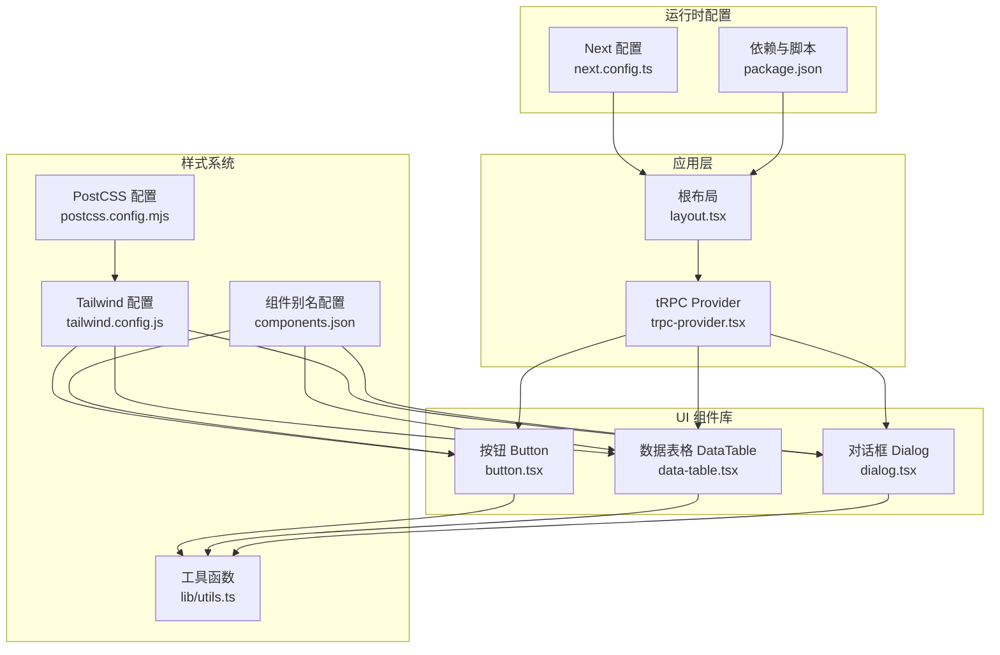
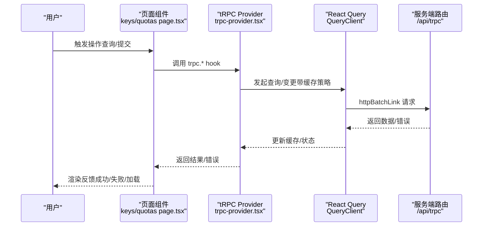
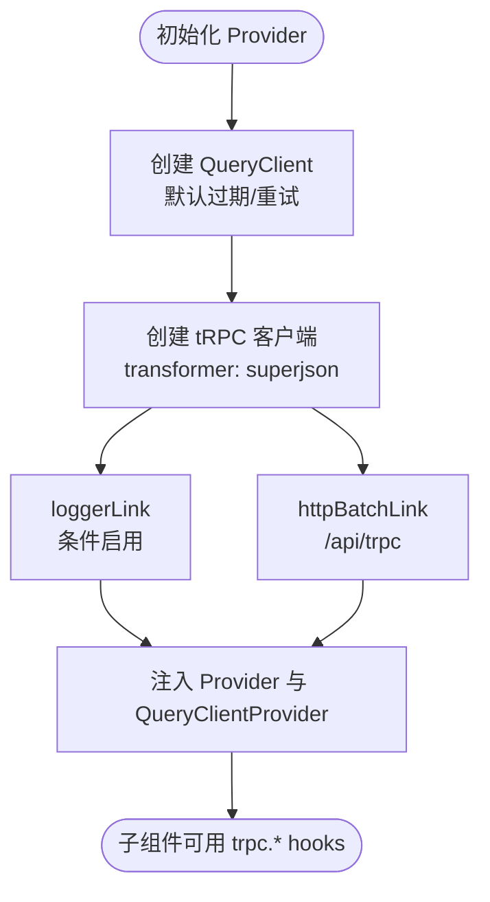
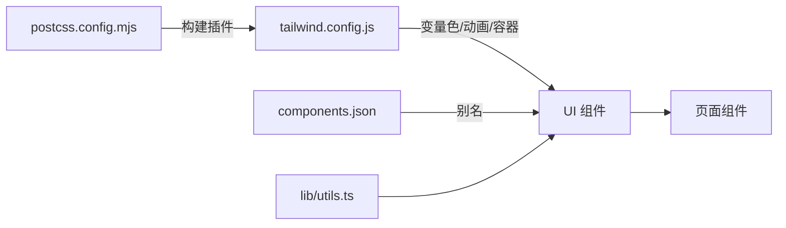
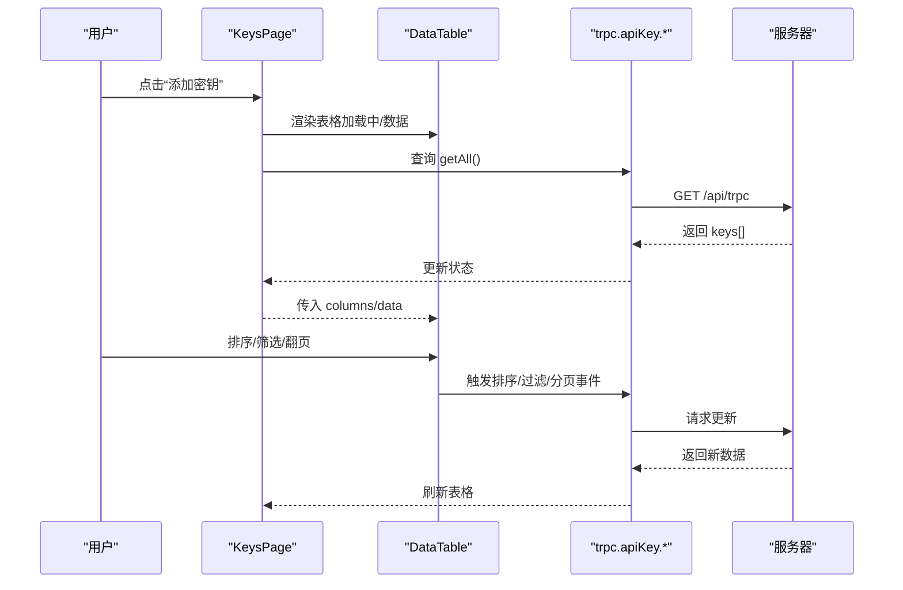
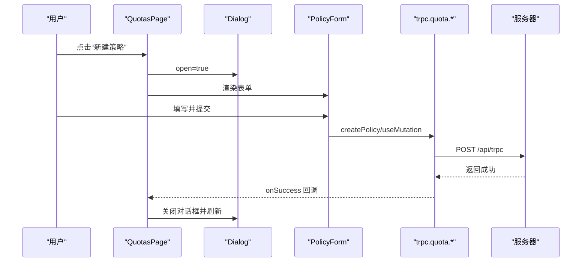
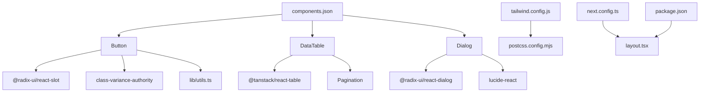

# 组件集成与使用

<cite>
**本文引用的文件**
- [src/components/trpc-provider.tsx](file://src/components/trpc-provider.tsx)
- [src/app/layout.tsx](file://src/app/layout.tsx)
- [tailwind.config.js](file://tailwind.config.js)
- [postcss.config.mjs](file://postcss.config.mjs)
- [components.json](file://components.json)
- [next.config.ts](file://next.config.ts)
- [src/lib/utils.ts](file://src/lib/utils.ts)
- [src/components/ui/button.tsx](file://src/components/ui/button.tsx)
- [src/components/ui/data-table.tsx](file://src/components/ui/data-table.tsx)
- [src/components/ui/dialog.tsx](file://src/components/ui/dialog.tsx)
- [src/app/(dashboard)/keys/page.tsx](file://src/app/(dashboard)/keys/page.tsx)
- [src/app/(dashboard)/quotas/page.tsx](file://src/app/(dashboard)/quotas/page.tsx)
- [package.json](file://package.json)
</cite>

## 目录
1. [简介](#简介)
2. [项目结构](#项目结构)
3. [核心组件](#核心组件)
4. [架构总览](#架构总览)
5. [组件详解](#组件详解)
6. [依赖关系分析](#依赖关系分析)
7. [性能考量](#性能考量)
8. [故障排查指南](#故障排查指南)
9. [结论](#结论)
10. [附录](#附录)

## 简介
本文件面向 AIGate 的前端组件集成与使用，围绕以下目标展开：
- tRPC Provider 的配置与使用：包括客户端状态管理、错误处理与日志链路。
- 组件库集成流程：Tailwind CSS 配置、组件导入与样式系统设置。
- 组件组合使用模式：表单组合、数据表格集成、对话框联动。
- 最佳实践：性能优化、内存管理、用户体验设计。
- 主题定制：颜色系统、字体配置、间距规范。
- 测试策略：单元测试、集成测试、视觉回归测试。
- 版本管理与升级：向后兼容性与破坏性变更处理。

## 项目结构
AIGate 基于 Next.js 16 应用，采用 App Router 结构，组件库基于 Radix UI 与自研 UI 组件（如 Button、DataTable、Dialog），并以 Tailwind CSS v4 进行样式系统构建。tRPC 作为全栈 RPC 框架，通过 Provider 在根布局注入全局客户端与查询缓存。

**图表来源**
- [src/app/layout.tsx](file://src/app/layout.tsx#L17-L29)
- [src/components/trpc-provider.tsx](file://src/components/trpc-provider.tsx#L22-L61)
- [src/components/ui/button.tsx](file://src/components/ui/button.tsx#L1-L58)
- [src/components/ui/data-table.tsx](file://src/components/ui/data-table.tsx#L1-L187)
- [src/components/ui/dialog.tsx](file://src/components/ui/dialog.tsx#L1-L121)
- [tailwind.config.js](file://tailwind.config.js#L1-L78)
- [postcss.config.mjs](file://postcss.config.mjs#L1-L8)
- [components.json](file://components.json#L1-L18)
- [next.config.ts](file://next.config.ts#L1-L9)
- [package.json](file://package.json#L1-L75)

**章节来源**
- [src/app/layout.tsx](file://src/app/layout.tsx#L17-L29)
- [src/components/trpc-provider.tsx](file://src/components/trpc-provider.tsx#L1-L64)
- [tailwind.config.js](file://tailwind.config.js#L1-L78)
- [postcss.config.mjs](file://postcss.config.mjs#L1-L8)
- [components.json](file://components.json#L1-L18)
- [next.config.ts](file://next.config.ts#L1-L9)
- [package.json](file://package.json#L1-L75)

## 核心组件
- tRPC Provider：在根布局注入 tRPC 客户端与 React Query 缓存，统一管理请求、重试、过期时间与日志链路。
- UI 组件库：Button、DataTable、Dialog 等，均使用 Tailwind 变量色与 Radix UI 原语，具备主题一致性与可访问性。
- 样式系统：Tailwind v4 + PostCSS 插件，通过变量色与动画插件实现主题化与动效。

**章节来源**
- [src/components/trpc-provider.tsx](file://src/components/trpc-provider.tsx#L14-L54)
- [src/components/ui/button.tsx](file://src/components/ui/button.tsx#L7-L35)
- [src/components/ui/data-table.tsx](file://src/components/ui/data-table.tsx#L48-L66)
- [src/components/ui/dialog.tsx](file://src/components/ui/dialog.tsx#L30-L51)
- [tailwind.config.js](file://tailwind.config.js#L19-L74)

## 架构总览
tRPC Provider 将客户端、查询缓存与日志链路整合，页面通过 trpc.* hooks 访问服务端路由；UI 组件通过 Tailwind 变量色与工具类实现一致风格；样式系统由 Tailwind v4 与 PostCSS 插件驱动。

**图表来源**
- [src/app/(dashboard)/keys/page.tsx](file://src/app/(dashboard)/keys/page.tsx#L14-L20)
- [src/app/(dashboard)/quotas/page.tsx](file://src/app/(dashboard)/quotas/page.tsx#L25-L51)
- [src/components/trpc-provider.tsx](file://src/components/trpc-provider.tsx#L38-L54)

## 组件详解

### tRPC Provider：配置与使用
- 客户端状态管理
  - QueryClient 默认选项：过期时间与重试次数，减少重复请求与提升稳定性。
  - 使用 React.useMemo 稳定化客户端与查询实例，避免不必要的重建。
- 错误处理与日志
  - loggerLink 条件启用：开发环境或下行错误时输出日志，便于调试。
  - httpBatchLink 批处理请求，降低网络开销。
- 基础 URL 自适应：浏览器相对路径、SSR Vercel 域名、本地回退，确保不同环境正确路由到 /api/trpc。
- 在根布局注入 Provider，使子组件可直接使用 trpc.* hooks。

**图表来源**
- [src/components/trpc-provider.tsx](file://src/components/trpc-provider.tsx#L25-L54)

**章节来源**
- [src/components/trpc-provider.tsx](file://src/components/trpc-provider.tsx#L14-L64)
- [src/app/layout.tsx](file://src/app/layout.tsx#L22-L26)

### 组件库集成：Tailwind CSS、导入与样式系统
- Tailwind v4 配置
  - 启用暗色模式 class 选择器，内容扫描路径覆盖 pages、components、app、src。
  - 使用 HSL 变量色系统，扩展圆角、动画与容器尺寸。
  - 引入 tailwindcss-animate 动画插件。
- PostCSS 配置
  - 使用 @tailwindcss/postcss 插件，确保构建时生成所需样式。
- 组件别名与工具
  - components.json 指定组件与工具别名，便于按需引入与主题化。
  - utils.ts 提供 cn 组合类名工具，结合 tailwind-merge 实现冲突覆盖。
- 组件导入
  - 页面通过相对路径导入 UI 组件，如 Button、DataTable、Dialog。

**图表来源**
- [tailwind.config.js](file://tailwind.config.js#L1-L78)
- [postcss.config.mjs](file://postcss.config.mjs#L1-L8)
- [components.json](file://components.json#L1-L18)
- [src/lib/utils.ts](file://src/lib/utils.ts#L1-L7)

**章节来源**
- [tailwind.config.js](file://tailwind.config.js#L1-L78)
- [postcss.config.mjs](file://postcss.config.mjs#L1-L8)
- [components.json](file://components.json#L1-L18)
- [src/lib/utils.ts](file://src/lib/utils.ts#L1-L7)

### 组件组合使用模式

#### 表单组合与数据表格集成
- 数据表格 DataTable
  - 支持排序、过滤、分页与空态展示，内置页码生成逻辑。
  - 与 Pagination 组件联动，提供上一页/下一页与中间页码跳转。
- 页面示例：KeysPage
  - 使用 trpc.apiKey.* hooks 获取/增删改查数据，结合状态管理与消息提示。
  - 通过 DataTable 展示列表，配合按钮触发新增/编辑/删除/测试等操作。

**图表来源**
- [src/app/(dashboard)/keys/page.tsx](file://src/app/(dashboard)/keys/page.tsx#L14-L233)
- [src/components/ui/data-table.tsx](file://src/components/ui/data-table.tsx#L48-L181)

**章节来源**
- [src/app/(dashboard)/keys/page.tsx](file://src/app/(dashboard)/keys/page.tsx#L1-L261)
- [src/components/ui/data-table.tsx](file://src/components/ui/data-table.tsx#L1-L187)

#### 对话框联动与表单提交
- 对话框 Dialog
  - 基于 Radix UI 原语，支持门户渲染、遮罩、关闭按钮与动画入场/出场。
  - 通过 open/onOpenChange 控制显隐，内部嵌套表单组件进行编辑/新增。
- 页面示例：QuotasPage
  - 新建/编辑配额策略时打开 Dialog，提交成功后自动关闭并刷新列表。
  - 删除策略通过 mutation 成功回调刷新数据。

**图表来源**
- [src/app/(dashboard)/quotas/page.tsx](file://src/app/(dashboard)/quotas/page.tsx#L53-L108)
- [src/components/ui/dialog.tsx](file://src/components/ui/dialog.tsx#L30-L51)

**章节来源**
- [src/app/(dashboard)/quotas/page.tsx](file://src/app/(dashboard)/quotas/page.tsx#L1-L141)
- [src/components/ui/dialog.tsx](file://src/components/ui/dialog.tsx#L1-L121)

### 主题定制：颜色、字体与间距
- 颜色系统
  - 使用 HSL 变量色（如 --background、--foreground、--primary、--secondary 等），在组件中通过 var(--...) 引用，实现明暗主题一致风格。
  - Button、Dialog 等组件广泛使用变量色，保证与 Tailwind 配置一致。
- 字体与字号
  - 组件内使用语义化字号与字重，如标题、正文、辅助信息等，保持层级清晰。
- 间距与圆角
  - 通过 Tailwind 扩展的圆角与容器间距，统一卡片、表格、对话框等组件的边角与留白。

**章节来源**
- [tailwind.config.js](file://tailwind.config.js#L20-L54)
- [src/components/ui/button.tsx](file://src/components/ui/button.tsx#L10-L22)
- [src/components/ui/dialog.tsx](file://src/components/ui/dialog.tsx#L38-L49)
- [src/components/ui/data-table.tsx](file://src/components/ui/data-table.tsx#L94-L137)

### 组件使用最佳实践
- 性能优化
  - 使用 React Query 缓存与过期策略，减少重复请求；合理设置 staleTime 与 retry。
  - DataTable 使用分页与过滤，避免一次性渲染大量数据。
- 内存管理
  - Provider 使用 useMemo 稳定化客户端与查询实例，避免频繁重建导致的内存浪费。
- 用户体验
  - 加载态使用 Spinner，错误与成功消息通过状态提示组件反馈。
  - 对话框与表格联动时，提交成功后自动关闭并刷新，减少用户操作成本。

**章节来源**
- [src/components/trpc-provider.tsx](file://src/components/trpc-provider.tsx#L25-L36)
- [src/components/ui/data-table.tsx](file://src/components/ui/data-table.tsx#L140-L181)
- [src/app/(dashboard)/keys/page.tsx](file://src/app/(dashboard)/keys/page.tsx#L213-L233)
- [src/app/(dashboard)/quotas/page.tsx](file://src/app/(dashboard)/quotas/page.tsx#L110-L135)

## 依赖关系分析
- 组件依赖
  - UI 组件依赖 Radix UI 原语与 class-variance-authority，使用 utils.cn 组合样式。
  - DataTable 依赖 @tanstack/react-table 与自研 Pagination。
  - Dialog 依赖 @radix-ui/react-dialog 与 lucide-react 图标。
- 样式依赖
  - Tailwind v4 与 tailwindcss-animate 插件，PostCSS 通过 @tailwindcss/postcss 注入。
  - components.json 提供组件与工具别名，简化导入路径。
- 运行时配置
  - next.config.ts 开启 standalone 输出与 React Compiler。
  - package.json 管理依赖与脚本，涵盖数据库迁移、格式化与构建。

**图表来源**
- [src/components/ui/button.tsx](file://src/components/ui/button.tsx#L1-L6)
- [src/components/ui/data-table.tsx](file://src/components/ui/data-table.tsx#L4-L25)
- [src/components/ui/dialog.tsx](file://src/components/ui/dialog.tsx#L1-L5)
- [tailwind.config.js](file://tailwind.config.js#L1-L78)
- [postcss.config.mjs](file://postcss.config.mjs#L1-L8)
- [components.json](file://components.json#L1-L18)
- [next.config.ts](file://next.config.ts#L1-L9)
- [package.json](file://package.json#L1-L75)

**章节来源**
- [src/components/ui/button.tsx](file://src/components/ui/button.tsx#L1-L58)
- [src/components/ui/data-table.tsx](file://src/components/ui/data-table.tsx#L1-L187)
- [src/components/ui/dialog.tsx](file://src/components/ui/dialog.tsx#L1-L121)
- [tailwind.config.js](file://tailwind.config.js#L1-L78)
- [postcss.config.mjs](file://postcss.config.mjs#L1-L8)
- [components.json](file://components.json#L1-L18)
- [next.config.ts](file://next.config.ts#L1-L9)
- [package.json](file://package.json#L1-L75)

## 性能考量
- tRPC 与 QueryClient
  - 合理设置 staleTime 与 retry，平衡实时性与网络压力。
  - 使用 httpBatchLink 减少请求数量，提升吞吐。
- UI 组件
  - DataTable 分页与过滤避免大数据集一次性渲染。
  - Button、Dialog 等组件使用变量色与轻量动画，减少重排与重绘。
- 构建与运行
  - Next.js standalone 输出与 React Compiler 提升启动与运行效率。

**章节来源**
- [src/components/trpc-provider.tsx](file://src/components/trpc-provider.tsx#L28-L33)
- [src/components/ui/data-table.tsx](file://src/components/ui/data-table.tsx#L48-L66)
- [next.config.ts](file://next.config.ts#L3-L6)

## 故障排查指南
- tRPC 日志
  - 开发环境或下行错误时启用 loggerLink，定位请求/响应异常。
- 环境 URL
  - 确认 getBaseUrl 在不同环境返回正确路径，避免跨域或 404。
- 样式未生效
  - 检查 tailwind.config.js 内容扫描路径与 components.json 别名是否匹配。
  - 确认 PostCSS 插件已正确安装与配置。
- 对话框与表格联动
  - 确保 Dialog 的 open/onOpenChange 与表格的提交成功回调同步，避免状态不一致。

**章节来源**
- [src/components/trpc-provider.tsx](file://src/components/trpc-provider.tsx#L43-L50)
- [tailwind.config.js](file://tailwind.config.js#L4-L9)
- [components.json](file://components.json#L13-L16)

## 结论
AIGate 的组件体系以 tRPC Provider 为核心，结合 Tailwind v4 与 Radix UI 原语，形成一致、可维护且高性能的前端架构。通过合理的缓存策略、分页与过滤、以及主题变量色系统，能够满足复杂业务场景下的交互与视觉需求。建议在后续迭代中持续完善测试策略与版本升级流程，确保向后兼容与平滑演进。

## 附录

### 测试策略
- 单元测试
  - 针对 UI 组件（Button、Dialog、DataTable）进行快照与交互测试，验证变量色与动画表现。
- 集成测试
  - 使用 tRPC hooks 与 Mock 服务器，验证页面级流程（新增/编辑/删除/测试）与状态反馈。
- 视觉回归测试
  - 在暗色模式与不同分辨率下截图对比，确保主题一致性与布局稳定性。

[本节为通用指导，无需具体文件引用]

### 版本管理与升级指南
- 依赖版本
  - Next.js、React、tRPC、React Query、Tailwind v4 等均在 package.json 中声明，升级前先执行依赖检查与兼容性验证。
- 破坏性变更
  - tRPC 与 React Query 版本升级可能影响链接与缓存 API，需对照官方迁移指南调整 Provider 配置。
  - Tailwind v4 与插件升级需检查变量色与动画语法变化，确保组件样式不受影响。
- 向后兼容
  - 通过别名与工具函数（如 utils.cn）抽象样式组合，降低升级对业务代码的影响。

**章节来源**
- [package.json](file://package.json#L18-L56)
- [src/lib/utils.ts](file://src/lib/utils.ts#L1-L7)