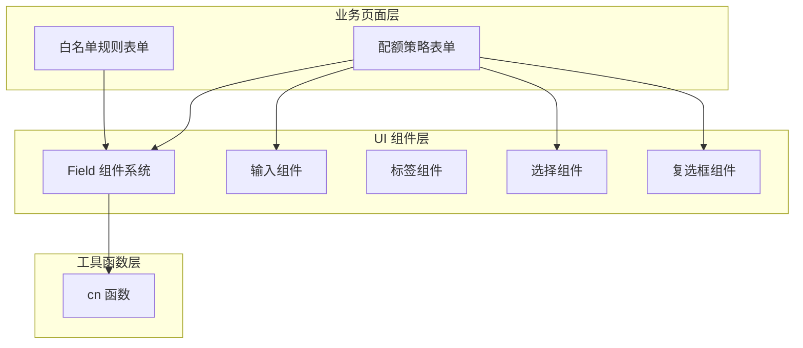
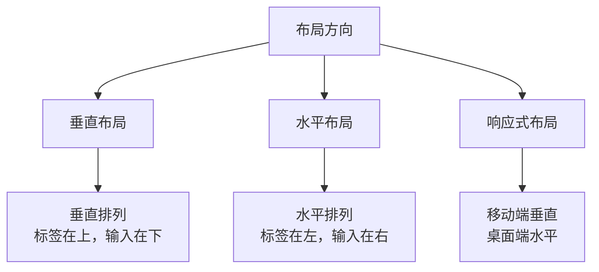
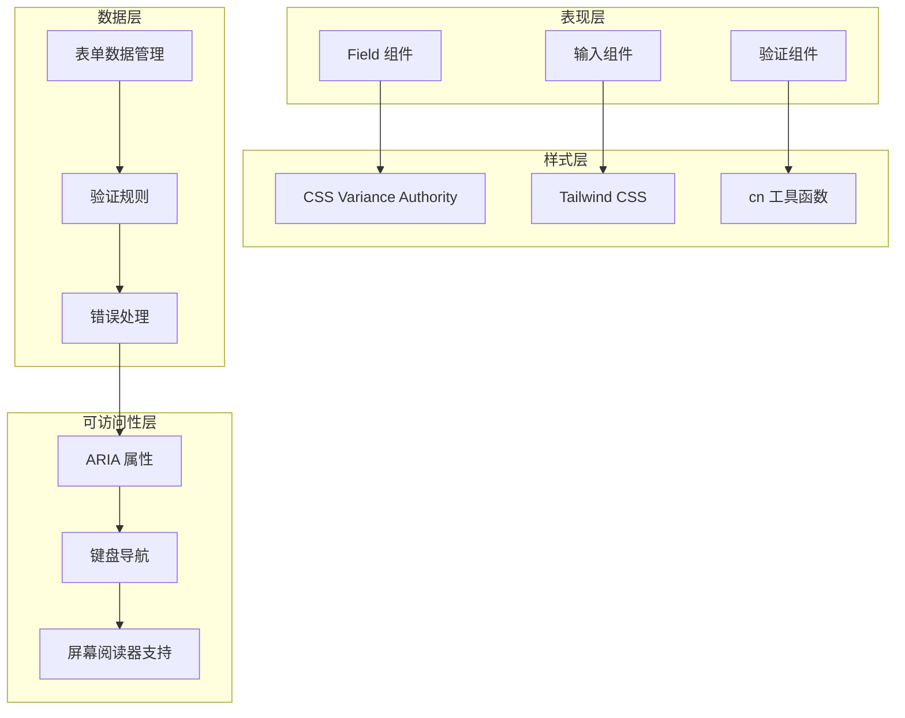
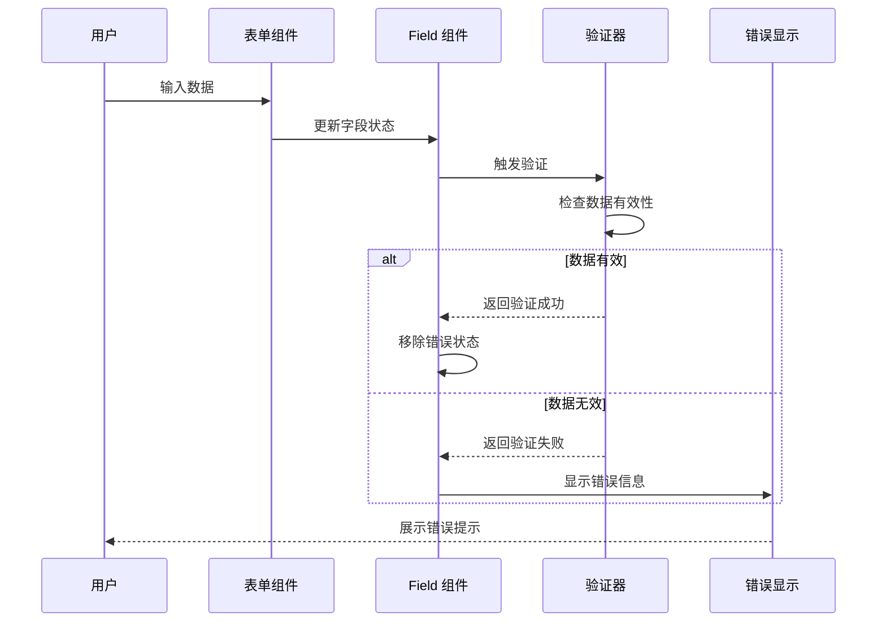
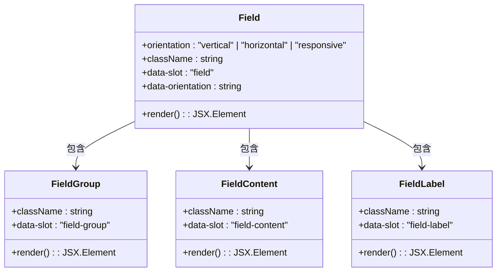
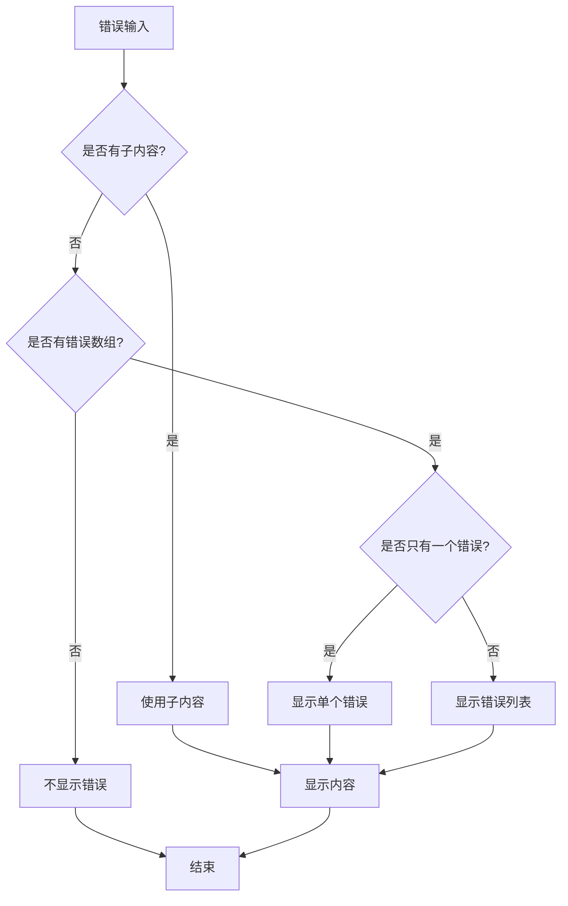
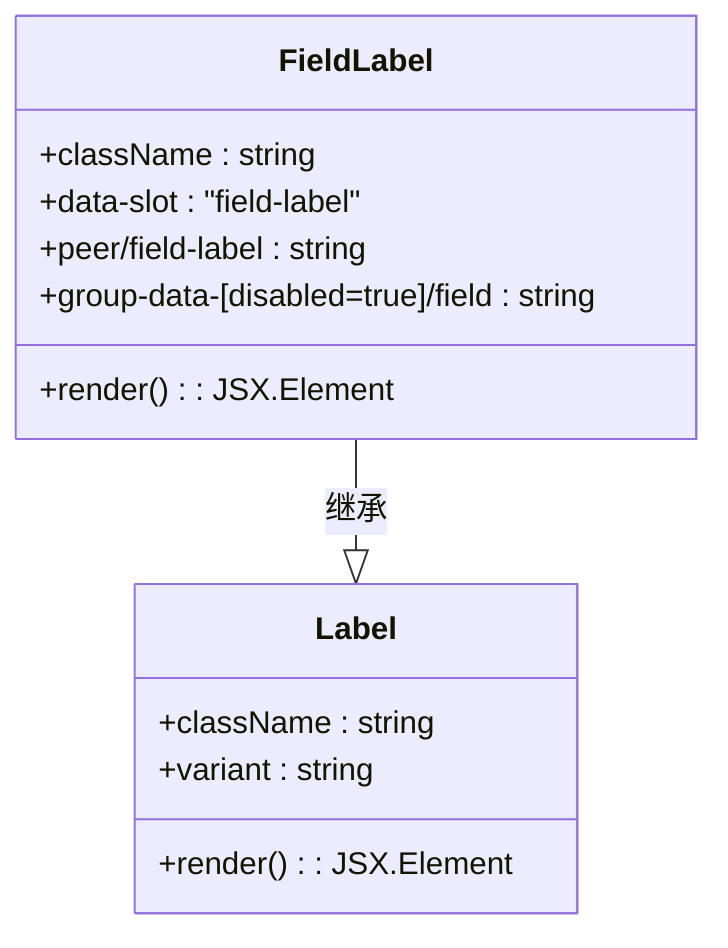
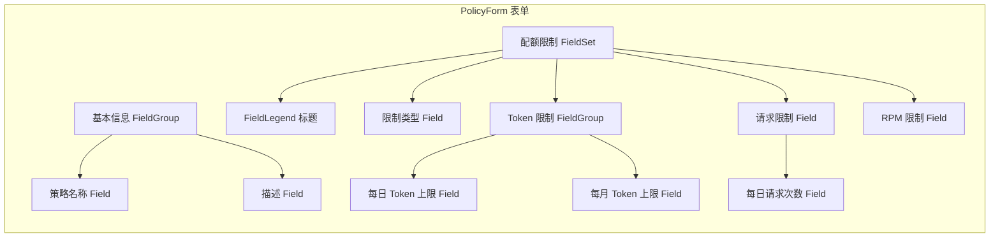

# Field 组件系统

<cite>
**本文档引用的文件**
- [src/components/ui/field.tsx](file://src/components/ui/field.tsx)
- [src/components/ui/input.tsx](file://src/components/ui/input.tsx)
- [src/components/ui/label.tsx](file://src/components/ui/label.tsx)
- [src/components/ui/select.tsx](file://src/components/ui/select.tsx)
- [src/components/ui/checkbox.tsx](file://src/components/ui/checkbox.tsx)
- [src/lib/utils.ts](file://src/lib/utils.ts)
- [.agents/skills/shadcn/SKILL.md](file://.agents/skills/shadcn/SKILL.md)
- [src/app/(dashboard)/quotas/components/policy-form.tsx](file://src/app/(dashboard)/quotas/components/policy-form.tsx)
- [src/app/(dashboard)/users/components/whitelist-rule-form.tsx](file://src/app/(dashboard)/users/components/whitelist-rule-form.tsx)
- [readme/ui-rule.md](file://readme/ui-rule.md)
</cite>

## 目录
1. [简介](#简介)
2. [项目结构](#项目结构)
3. [核心组件](#核心组件)
4. [架构概览](#架构概览)
5. [详细组件分析](#详细组件分析)
6. [依赖关系分析](#依赖关系分析)
7. [性能考虑](#性能考虑)
8. [故障排除指南](#故障排除指南)
9. [结论](#结论)

## 简介

Field 组件系统是 AIGate 项目中的表单构建核心，基于 shadcn/ui 设计理念构建，提供了完整的表单布局、标签、描述、错误处理和验证机制。该系统采用语义化标记和 CSS 变体架构，确保了良好的可访问性和一致的用户体验。

系统遵循"布局使用 className，样式使用语义化令牌"的设计原则，通过 data-slot 属性和语义化类名实现了高度可定制的表单组件体系。

## 项目结构

Field 组件系统主要分布在以下位置：



**图表来源**
- [src/components/ui/field.tsx](file://src/components/ui/field.tsx#L1-L245)
- [src/lib/utils.ts](file://src/lib/utils.ts#L1-L7)

**章节来源**
- [src/components/ui/field.tsx](file://src/components/ui/field.tsx#L1-L245)
- [src/lib/utils.ts](file://src/lib/utils.ts#L1-L7)

## 核心组件

Field 组件系统包含以下核心组件：

### 主要组件清单

| 组件名称 | 功能描述 | 使用场景 |
|---------|----------|----------|
| Field | 表单字段容器，支持垂直、水平、响应式布局 | 所有表单字段的基础容器 |
| FieldGroup | 字段分组容器，支持嵌套和响应式布局 | 复杂表单的逻辑分组 |
| FieldLabel | 字段标签，继承 Label 组件特性 | 表单字段的标题标识 |
| FieldDescription | 字段描述文本 | 提供字段使用说明 |
| FieldError | 错误信息显示，支持单个和多个错误 | 表单验证错误展示 |
| FieldSet | 字段集合容器，用于分组相关字段 | 复选框、单选框分组 |
| FieldLegend | 字段集合标题，支持 legend 和 label 两种变体 | FieldSet 的标题 |
| FieldContent | 字段内容容器，用于组织标签和输入控件 | 字段内容的统一布局 |
| FieldTitle | 简单的标题显示组件 | 简单的标题展示 |

### 布局变体系统

Field 组件支持三种主要布局变体：



**图表来源**
- [src/components/ui/field.tsx](file://src/components/ui/field.tsx#L57-L79)

**章节来源**
- [src/components/ui/field.tsx](file://src/components/ui/field.tsx#L81-L95)

## 架构概览

Field 组件系统采用分层架构设计，确保了组件间的松耦合和高内聚：



**图表来源**
- [src/components/ui/field.tsx](file://src/components/ui/field.tsx#L1-L245)
- [src/lib/utils.ts](file://src/lib/utils.ts#L1-L7)

### 数据流架构



**图表来源**
- [src/components/ui/field.tsx](file://src/components/ui/field.tsx#L186-L231)

## 详细组件分析

### Field 容器组件

Field 组件是整个表单系统的核心，提供了灵活的布局能力和状态管理：



**图表来源**
- [src/components/ui/field.tsx](file://src/components/ui/field.tsx#L81-L126)

#### 布局变体实现

Field 组件通过 CSS Variance Authority 实现了三种布局变体：

| 变体类型 | 特征 | 适用场景 |
|---------|------|----------|
| vertical | 垂直排列，标签在上 | 移动端表单、简单表单 |
| horizontal | 水平排列，标签在左 | 桌面端表单、密集信息表单 |
| responsive | 响应式布局，移动端垂直桌面端水平 | 自适应表单设计 |

**章节来源**
- [src/components/ui/field.tsx](file://src/components/ui/field.tsx#L57-L79)

### 错误处理系统

Field 组件的错误处理系统提供了灵活的错误信息展示机制：



**图表来源**
- [src/components/ui/field.tsx](file://src/components/ui/field.tsx#L194-L215)

#### 错误处理特性

- **条件渲染**：根据是否存在子内容或错误数组决定显示方式
- **格式化输出**：单个错误直接显示，多个错误以列表形式展示
- **无障碍支持**：使用 `role="alert"` 确保屏幕阅读器正确识别
- **样式定制**：通过 `cn` 工具函数支持自定义样式

**章节来源**
- [src/components/ui/field.tsx](file://src/components/ui/field.tsx#L186-L231)

### 标签系统

FieldLabel 组件继承了 Label 组件的功能，并增加了表单特定的样式：



**图表来源**
- [src/components/ui/label.tsx](file://src/components/ui/label.tsx#L13-L23)
- [src/components/ui/field.tsx](file://src/components/ui/field.tsx#L110-L126)

#### 标签特性

- **语义化标记**：使用 `data-slot="field-label"` 标识组件角色
- **状态感知**：根据字段禁用状态自动调整样式
- **组合支持**：支持与其他 Field 组件的嵌套组合
- **无障碍访问**：继承 Radix UI 的可访问性特性

**章节来源**
- [src/components/ui/field.tsx](file://src/components/ui/field.tsx#L110-L126)

### 实际应用示例

#### 配额策略表单

在配额管理页面中，Field 组件系统被广泛应用于复杂的表单场景：



**图表来源**
- [src/app/(dashboard)/quotas/components/policy-form.tsx](file://src/app/(dashboard)/quotas/components/policy-form.tsx#L83-L197)

#### 白名单规则表单

在用户管理页面中，Field 组件系统用于构建复杂的规则配置表单：

**章节来源**
- [src/app/(dashboard)/quotas/components/policy-form.tsx](file://src/app/(dashboard)/quotas/components/policy-form.tsx#L1-L201)
- [src/app/(dashboard)/users/components/whitelist-rule-form.tsx](file://src/app/(dashboard)/users/components/whitelist-rule-form.tsx#L171-L499)

## 依赖关系分析

Field 组件系统具有清晰的依赖层次结构：

```mermaid
graph TB
subgraph "外部依赖"
RadixUI[@radix-ui/react-label]
ClassVariation[class-variance-authority]
Lucide[lucide-react]
end
subgraph "内部依赖"
Utils[utils.ts - cn 函数]
Components[其他 UI 组件]
end
subgraph "Field 系统"
Field[Field 组件]
Label[Label 组件]
Input[Input 组件]
Select[Select 组件]
Checkbox[Checkbox 组件]
end
Field --> RadixUI
Field --> ClassVariation
Field --> Utils
Field --> Components
Label --> RadixUI
Label --> ClassVariation
Label --> Utils
Input --> Utils
Select --> Utils
Checkbox --> Utils
```

**图表来源**
- [src/components/ui/field.tsx](file://src/components/ui/field.tsx#L1-L9)
- [src/components/ui/label.tsx](file://src/components/ui/label.tsx#L1-L8)

### 关键依赖特性

- **最小依赖**：仅依赖必要的外部库，减少包体积
- **类型安全**：充分利用 TypeScript 提供的类型检查
- **可扩展性**：通过 Variance Authority 支持样式变体扩展
- **可维护性**：清晰的模块边界和职责分离

**章节来源**
- [src/components/ui/field.tsx](file://src/components/ui/field.tsx#L1-L9)
- [src/lib/utils.ts](file://src/lib/utils.ts#L1-L7)

## 性能考虑

Field 组件系统在设计时充分考虑了性能优化：

### 渲染优化

- **Memoization 使用**：错误处理组件使用 `useMemo` 优化渲染
- **条件渲染**：根据状态动态决定组件渲染，避免不必要的 DOM 操作
- **样式合并**：通过 `cn` 函数智能合并样式类，减少样式冲突

### 访问性优化

- **语义化标记**：使用适当的 HTML 语义和 ARIA 属性
- **键盘导航**：支持完整的键盘操作体验
- **屏幕阅读器**：确保与辅助技术的兼容性

### 样式优化

- **原子化 CSS**：使用 Tailwind CSS 实现高效的样式管理
- **变体系统**：通过 CSS Variance Authority 实现样式的模块化
- **响应式设计**：内置响应式支持，减少媒体查询的使用

## 故障排除指南

### 常见问题及解决方案

#### 错误信息不显示

**问题症状**：表单验证失败但没有错误提示

**可能原因**：
- 缺少 `FieldError` 组件
- 错误数据格式不正确
- `data-invalid` 属性未正确设置

**解决方案**：
1. 确保在表单中包含 `FieldError` 组件
2. 检查错误数据结构是否符合预期
3. 验证 `Field` 组件的 `data-invalid` 属性状态

#### 布局错乱

**问题症状**：表单布局不符合预期

**可能原因**：
- 布局变体参数设置错误
- 样式覆盖冲突
- 响应式断点配置问题

**解决方案**：
1. 检查 `orientation` 参数设置
2. 验证自定义样式的优先级
3. 确认响应式断点的正确配置

#### 可访问性问题

**问题症状**：屏幕阅读器无法正确读取表单信息

**可能原因**：
- 缺少适当的 ARIA 属性
- 标签与输入控件关联不正确
- 键盘导航支持缺失

**解决方案**：
1. 确保正确的 ARIA 属性设置
2. 使用语义化的标签关联
3. 实现完整的键盘导航支持

**章节来源**
- [src/components/ui/field.tsx](file://src/components/ui/field.tsx#L186-L231)

## 结论

Field 组件系统展现了现代前端开发的最佳实践，通过精心设计的架构和丰富的功能特性，为 AIGate 项目提供了强大而灵活的表单解决方案。

### 系统优势

- **设计理念先进**：基于 shadcn/ui 的设计哲学，注重实用性和可访问性
- **架构清晰**：分层设计确保了组件间的低耦合和高内聚
- **功能完整**：涵盖了表单开发的所有核心需求
- **性能优秀**：通过多种优化技术确保了良好的运行性能
- **易于扩展**：灵活的变体系统支持未来的功能扩展

### 技术特色

- **语义化标记**：使用 data-slot 属性和语义化类名
- **样式系统**：基于 CSS Variance Authority 的变体架构
- **可访问性**：全面的无障碍支持和键盘导航
- **响应式设计**：内置的响应式布局能力
- **类型安全**：完整的 TypeScript 类型定义

Field 组件系统不仅满足了当前项目的需求，更为未来的功能扩展和技术演进奠定了坚实的基础。其设计思路和实现方式为类似的表单系统开发提供了宝贵的参考价值。