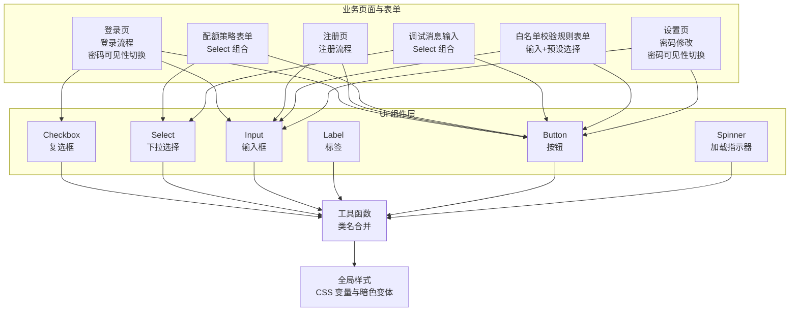
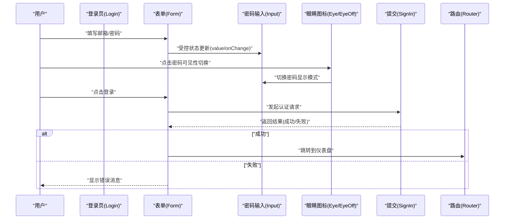
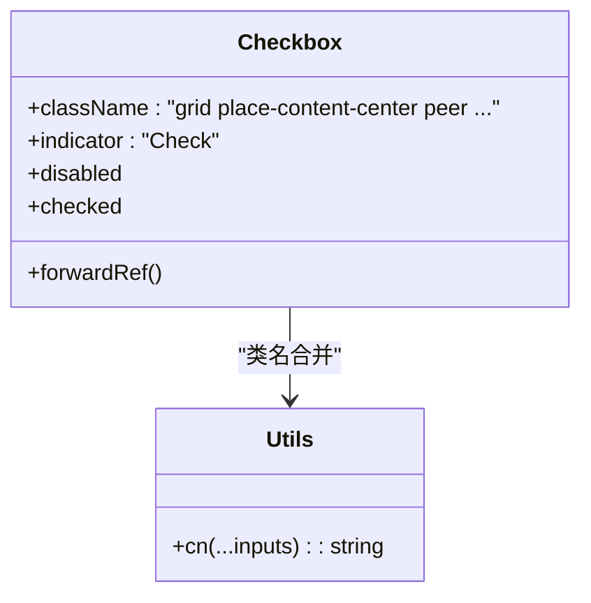
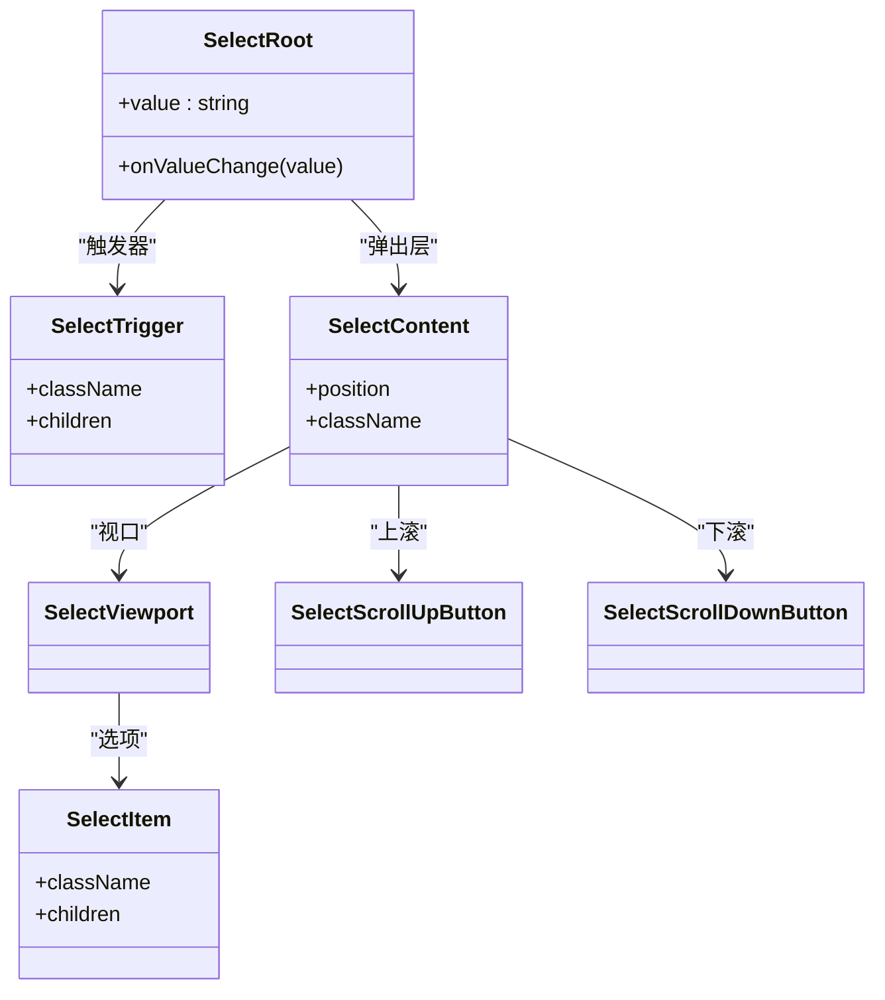
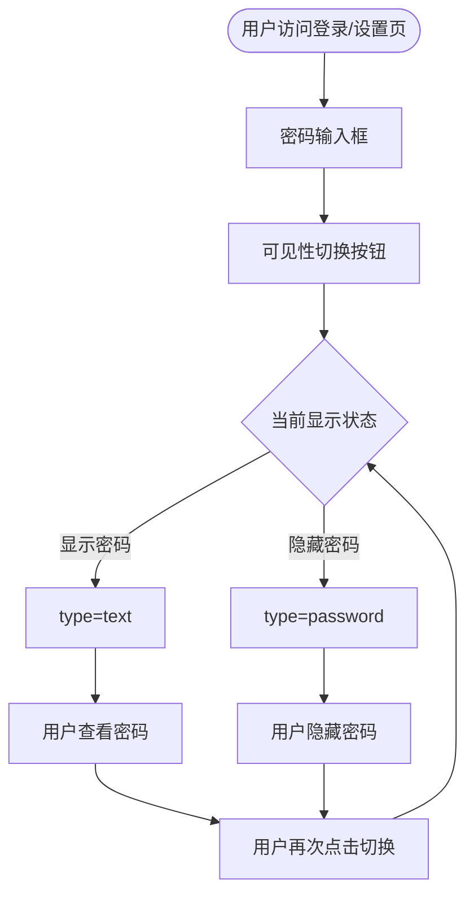
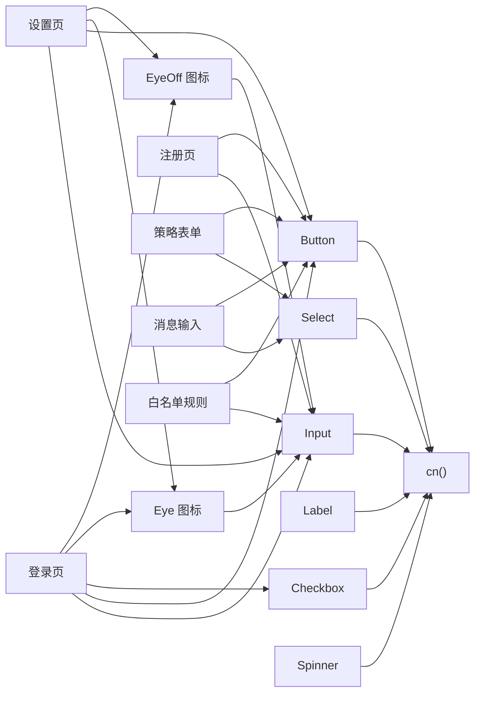
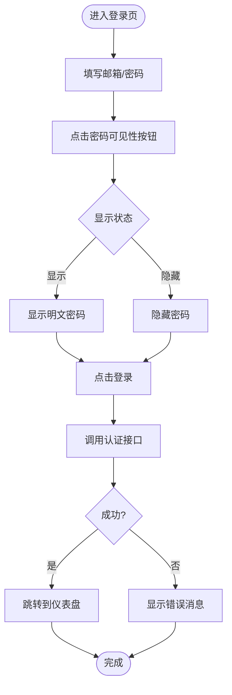

# 表单组件

<cite>
**本文引用的文件**
- [src/components/ui/checkbox.tsx](file://src/components/ui/checkbox.tsx)
- [src/components/ui/select.tsx](file://src/components/ui/select.tsx)
- [src/components/ui/input.tsx](file://src/components/ui/input.tsx)
- [src/components/ui/label.tsx](file://src/components/ui/label.tsx)
- [src/components/ui/button.tsx](file://src/components/ui/button.tsx)
- [src/components/ui/spinner.tsx](file://src/components/ui/spinner.tsx)
- [src/lib/utils.ts](file://src/lib/utils.ts)
- [src/app/globals.css](file://src/app/globals.css)
- [src/app/login/page.tsx](file://src/app/login/page.tsx)
- [src/app/settings/page.tsx](file://src/app/settings/page.tsx)
- [src/app/register/page.tsx](file://src/app/register/page.tsx)
- [src/app/(dashboard)/quotas/components/policy-form.tsx](file://src/app/(dashboard)/quotas/components/policy-form.tsx)
- [src/app/(dashboard)/debug/components/message-input.tsx](file://src/app/(dashboard)/debug/components/message-input.tsx)
- [src/app/(dashboard)/users/components/whitelist-rule-form.tsx](file://src/app/(dashboard)/users/components/whitelist-rule-form.tsx)
</cite>

## 更新摘要
**变更内容**
- 新增密码可见性切换功能章节，涵盖登录页和设置页的密码输入增强
- 更新输入组件章节，增加相对定位和内嵌按钮的使用模式
- 新增可访问性最佳实践，包含密码可见性切换的无障碍支持
- 更新使用示例，添加密码可见性切换的实际应用场景

## 目录
1. [简介](#简介)
2. [项目结构](#项目结构)
3. [核心组件](#核心组件)
4. [架构总览](#架构总览)
5. [组件详解](#组件详解)
6. [密码可见性切换功能](#密码可见性切换功能)
7. [依赖关系分析](#依赖关系分析)
8. [性能与可扩展性](#性能与可扩展性)
9. [故障排查指南](#故障排查指南)
10. [结论](#结论)
11. [附录：使用示例与最佳实践](#附录使用示例与最佳实践)

## 简介
本文件系统化梳理 AIGate 中的表单组件体系，重点覆盖 Checkbox 与 Select 组件的设计模式与交互行为；阐释受控与非受控组件在项目中的实现方式；总结表单验证机制（内置规则、错误消息展示与用户反馈）；给出多选框组、下拉选择与表单组合的实际使用范式；并说明可访问性支持（标签关联、键盘操作、屏幕阅读器兼容），以及样式定制（主题切换、尺寸调整、视觉反馈）。**新增**密码可见性切换功能，显著改善密码输入的安全性和用户体验。

## 项目结构
- UI 组件集中在 src/components/ui 下，采用 Radix UI 原子能力进行封装，统一通过工具函数合并类名，保证一致的外观与交互。
- 页面与业务表单集中在 src/app 下，演示了多种表单场景：登录、注册、配额策略、调试消息输入、白名单校验规则等。
- 全局样式通过 CSS 自定义属性与暗色变体实现主题切换，组件样式以变量驱动，便于统一风格与扩展。
- **新增**密码可见性切换功能在登录页和设置页中实现，提供安全的密码输入体验。

**图表来源**
- [src/components/ui/checkbox.tsx](file://src/components/ui/checkbox.tsx#L1-L31)
- [src/components/ui/select.tsx](file://src/components/ui/select.tsx#L1-L152)
- [src/components/ui/input.tsx](file://src/components/ui/input.tsx#L1-L26)
- [src/components/ui/label.tsx](file://src/components/ui/label.tsx#L1-L25)
- [src/components/ui/button.tsx](file://src/components/ui/button.tsx#L1-L58)
- [src/components/ui/spinner.tsx](file://src/components/ui/spinner.tsx#L1-L16)
- [src/lib/utils.ts](file://src/lib/utils.ts#L1-L7)
- [src/app/globals.css](file://src/app/globals.css#L1-L125)
- [src/app/login/page.tsx](file://src/app/login/page.tsx#L1-L117)
- [src/app/settings/page.tsx](file://src/app/settings/page.tsx#L1-L174)
- [src/app/register/page.tsx](file://src/app/register/page.tsx#L1-L128)
- [src/app/(dashboard)/quotas/components/policy-form.tsx](file://src/app/(dashboard)/quotas/components/policy-form.tsx#L1-L219)
- [src/app/(dashboard)/debug/components/message-input.tsx](file://src/app/(dashboard)/debug/components/message-input.tsx#L1-L63)
- [src/app/(dashboard)/users/components/whitelist-rule-form.tsx](file://src/app/(dashboard)/users/components/whitelist-rule-form.tsx#L121-L300)

**章节来源**
- [src/components/ui/checkbox.tsx](file://src/components/ui/checkbox.tsx#L1-L31)
- [src/components/ui/select.tsx](file://src/components/ui/select.tsx#L1-L152)
- [src/components/ui/input.tsx](file://src/components/ui/input.tsx#L1-L26)
- [src/components/ui/label.tsx](file://src/components/ui/label.tsx#L1-L25)
- [src/components/ui/button.tsx](file://src/components/ui/button.tsx#L1-L58)
- [src/components/ui/spinner.tsx](file://src/components/ui/spinner.tsx#L1-L16)
- [src/lib/utils.ts](file://src/lib/utils.ts#L1-L7)
- [src/app/globals.css](file://src/app/globals.css#L1-L125)

## 核心组件
- Checkbox：基于 Radix UI Checkbox 封装，提供受控渲染与状态指示，支持禁用态与焦点态样式，结合类名工具函数实现主题化。
- Select：由多个子组件构成（Root、Trigger、Content、Viewport、Item、Label、Separator、ScrollUp/DownButton 等），提供完整的下拉选择体验，支持滚动、动画、定位与键盘导航。
- Input：基础输入封装，继承原生 input 能力，统一聚焦与禁用态样式，**新增**支持相对定位和内嵌按钮的布局模式。
- Label：标签组件，配合表单控件实现语义化关联与可访问性。
- Button：按钮组件，支持多种变体与尺寸，用于提交、取消、操作触发等。
- Spinner：加载指示器，具备无障碍角色与标签，适合表单提交与异步过程反馈。

**章节来源**
- [src/components/ui/checkbox.tsx](file://src/components/ui/checkbox.tsx#L1-L31)
- [src/components/ui/select.tsx](file://src/components/ui/select.tsx#L1-L152)
- [src/components/ui/input.tsx](file://src/components/ui/input.tsx#L1-L26)
- [src/components/ui/label.tsx](file://src/components/ui/label.tsx#L1-L25)
- [src/components/ui/button.tsx](file://src/components/ui/button.tsx#L1-L58)
- [src/components/ui/spinner.tsx](file://src/components/ui/spinner.tsx#L1-L16)

## 架构总览
- 设计基础：以 Radix UI 作为无障碍与可访问性的底层保障，结合 Tailwind/CSS 变量实现主题化与一致性。
- 状态管理：页面级表单普遍采用 React useState 进行受控状态管理；Select 使用受控 value/onValueChange 实现双向绑定；**新增**密码可见性状态管理。
- 数据流：用户输入 → 状态更新 → 表单校验/提交 → 错误/成功反馈 → UI 更新。
- 可访问性：Label 与 Input/Select 的 htmlFor/id 关联；Select 支持键盘导航与焦点管理；Spinner 提供 aria-label/role；**新增**密码可见性切换的无障碍支持。

**图表来源**
- [src/app/login/page.tsx](file://src/app/login/page.tsx#L17-L40)

## 组件详解

### Checkbox 组件
- 设计要点
  - 使用 forwardRef 暴露原生根节点引用，确保可访问性与样式透传。
  - 通过数据属性 [data-state=checked] 表达选中状态，结合 Tailwind 类实现视觉反馈。
  - 支持禁用态与焦点态（ring、outline、ring-offset）。
- 受控/非受控
  - 在业务表单中通常以受控方式使用（value/checked 与 onChange 组合），确保状态可控与可追踪。
- 可访问性
  - 与 Label 配合，通过 htmlFor/id 关联，提升屏幕阅读器可用性。
- 样式定制
  - 通过主题变量与类名合并函数实现尺寸、颜色与边框的一致化。

**图表来源**
- [src/components/ui/checkbox.tsx](file://src/components/ui/checkbox.tsx#L9-L27)
- [src/lib/utils.ts](file://src/lib/utils.ts#L4-L6)

**章节来源**
- [src/components/ui/checkbox.tsx](file://src/components/ui/checkbox.tsx#L1-L31)
- [src/lib/utils.ts](file://src/lib/utils.ts#L1-L7)

### Select 组件
- 设计要点
  - 子组件解耦：Trigger、Content、Viewport、Item、Label、Separator、ScrollUp/DownButton 等，职责清晰。
  - Portal 渲染与位置计算：Content 支持 popper 定位与侧向滑入/缩放动画。
  - 视口滚动：提供 ScrollUp/DownButton 与 Viewport，适配长列表。
  - 选中指示：ItemIndicator 显示当前选中项。
- 受控/非受控
  - 通过 Select.Root 的 value/onValueChange 实现受控选择；在业务表单中常见于策略类型切换、角色选择等。
- 可访问性
  - 内置键盘导航（上下箭头、回车、Esc）；焦点管理与 ARIA 属性由 Radix UI 提供。
- 样式定制
  - Trigger/Content/Item 等均支持 className 扩展；整体风格与主题变量保持一致。

**图表来源**
- [src/components/ui/select.tsx](file://src/components/ui/select.tsx#L7-L151)

**章节来源**
- [src/components/ui/select.tsx](file://src/components/ui/select.tsx#L1-L152)

### Input/Label/Button/Spinner
- Input：统一输入框样式，聚焦态 ring 与禁用态处理，**新增**支持相对定位布局和内嵌按钮。
- Label：peer 相关样式与禁用态控制，配合表单控件实现语义化关联。
- Button：多变体与多尺寸，支持 asChild/SVG 图标等扩展。
- Spinner：加载指示器，具备无障碍角色与标签，适合异步提交场景。

**章节来源**
- [src/components/ui/input.tsx](file://src/components/ui/input.tsx#L1-L26)
- [src/components/ui/label.tsx](file://src/components/ui/label.tsx#L1-L25)
- [src/components/ui/button.tsx](file://src/components/ui/button.tsx#L1-L58)
- [src/components/ui/spinner.tsx](file://src/components/ui/spinner.tsx#L1-L16)

## 密码可见性切换功能

### 功能概述
AIGate 在登录页和设置页实现了密码可见性切换功能，通过在密码输入框右侧添加眼睛图标按钮，允许用户临时查看输入的密码，显著提升用户体验和安全性。

### 技术实现
- **状态管理**：使用 React useState 管理密码显示状态（showPassword/showConfirmPassword）
- **条件渲染**：根据状态动态切换 input 的 type 属性（text/password）
- **图标切换**：根据状态显示 Eye 或 EyeOff 图标
- **相对定位布局**：使用相对定位容器和绝对定位按钮实现内嵌图标

### 登录页密码可见性
- 在登录表单中，密码输入框右侧添加可见性切换按钮
- 支持临时查看密码，便于用户确认输入准确性
- 使用 Lucide React 的 Eye 和 EyeOff 图标组件

### 设置页密码可见性
- 在管理员账户设置中，同时为新密码和确认密码提供可见性切换
- 支持双重密码输入场景下的可视性控制
- 提供一致的用户体验和界面风格

### 可访问性支持
- 图标按钮使用适当的 ARIA 属性
- 支持键盘操作（Tab 键导航、Enter 键激活）
- 屏幕阅读器友好的按钮描述
- 焦点管理确保可操作性

**图表来源**
- [src/app/login/page.tsx](file://src/app/login/page.tsx#L78-L98)
- [src/app/settings/page.tsx](file://src/app/settings/page.tsx#L102-L147)

**章节来源**
- [src/app/login/page.tsx](file://src/app/login/page.tsx#L1-L117)
- [src/app/settings/page.tsx](file://src/app/settings/page.tsx#L1-L174)

## 依赖关系分析
- 组件依赖
  - Checkbox/Select/Input/Label/Button 均依赖工具函数 cn 进行类名合并，确保样式一致性。
  - Select 依赖 Radix UI 原子组件，提供无障碍与交互能力。
  - **新增**密码可见性功能依赖 Lucide React 图标库（Eye/EyeOff）。
- 页面依赖
  - 登录页与注册页直接使用 Input/Label/Button，并通过 useState 管理受控状态。
  - **新增**登录页和设置页集成密码可见性切换功能。
  - 配额策略表单使用 Select 进行"限制类型"切换，动态显隐不同字段。
  - 调试消息输入使用 Select 控制消息角色。
  - 白名单规则表单使用输入框与开关按钮，结合键盘事件与预设选择增强输入体验。

**图表来源**
- [src/components/ui/checkbox.tsx](file://src/components/ui/checkbox.tsx#L7-L7)
- [src/components/ui/select.tsx](file://src/components/ui/select.tsx#L5-L5)
- [src/components/ui/input.tsx](file://src/components/ui/input.tsx#L3-L3)
- [src/components/ui/label.tsx](file://src/components/ui/label.tsx#L5-L5)
- [src/components/ui/button.tsx](file://src/components/ui/button.tsx#L5-L5)
- [src/components/ui/spinner.tsx](file://src/components/ui/spinner.tsx#L3-L3)
- [src/lib/utils.ts](file://src/lib/utils.ts#L4-L6)
- [src/app/login/page.tsx](file://src/app/login/page.tsx#L6-L9)
- [src/app/settings/page.tsx](file://src/app/settings/page.tsx#L6-L10)
- [src/app/register/page.tsx](file://src/app/register/page.tsx#L3-L3)
- [src/app/(dashboard)/quotas/components/policy-form.tsx](file://src/app/(dashboard)/quotas/components/policy-form.tsx#L4-L11)
- [src/app/(dashboard)/debug/components/message-input.tsx](file://src/app/(dashboard)/debug/components/message-input.tsx#L4-L10)
- [src/app/(dashboard)/users/components/whitelist-rule-form.tsx](file://src/app/(dashboard)/users/components/whitelist-rule-form.tsx#L121-L129)

**章节来源**
- [src/lib/utils.ts](file://src/lib/utils.ts#L1-L7)
- [src/app/login/page.tsx](file://src/app/login/page.tsx#L1-L117)
- [src/app/settings/page.tsx](file://src/app/settings/page.tsx#L1-L174)
- [src/app/register/page.tsx](file://src/app/register/page.tsx#L1-L128)
- [src/app/(dashboard)/quotas/components/policy-form.tsx](file://src/app/(dashboard)/quotas/components/policy-form.tsx#L1-L219)
- [src/app/(dashboard)/debug/components/message-input.tsx](file://src/app/(dashboard)/debug/components/message-input.tsx#L1-L63)
- [src/app/(dashboard)/users/components/whitelist-rule-form.tsx](file://src/app/(dashboard)/users/components/whitelist-rule-form.tsx#L121-L300)

## 性能与可扩展性
- 性能特性
  - 组件均采用 forwardRef 与最小化渲染策略，避免不必要重绘。
  - Select 的 Portal 与动画在大数据集下需注意 viewport 计算与滚动优化。
  - **新增**密码可见性切换使用轻量级状态管理，性能开销极小。
- 可扩展性
  - 通过 CSS 变量与主题系统，可轻松实现主题切换与品牌化定制。
  - Button 的变体与尺寸体系便于扩展更多按钮形态。
  - Select 的子组件拆分利于按需引入与二次封装。
  - **新增**密码可见性功能可扩展到其他敏感信息输入场景。

## 故障排查指南
- 输入状态未更新
  - 检查是否正确使用受控属性（如 value/onChange 或 Select 的 value/onValueChange）。
  - 确认事件处理器中对状态的更新逻辑（如数字字段转换）。
  - **新增**检查密码可见性状态切换函数是否正确绑定。
- 错误消息未显示
  - 确认页面中存在错误消息渲染分支，并检查条件判断与消息拼接。
- 键盘导航异常
  - 确保 Select 的键盘事件处理未被外部阻止（如 preventDefault 使用）。
  - 检查是否正确处理 Esc/Enter/ArrowUp/ArrowDown 等键。
  - **新增**确认密码可见性按钮的键盘可达性。
- 可访问性问题
  - 确保 Label 的 htmlFor 与对应控件 id 匹配。
  - 对动态加载的内容，确认 Spinner 的 role/aria-label 设置。
  - **新增**检查密码可见性按钮的 ARIA 属性和屏幕阅读器支持。
- **新增**密码可见性功能问题
  - 确认 Eye/EyeOff 图标组件正确导入和渲染。
  - 检查相对定位布局是否影响按钮点击区域。
  - 验证密码显示模式切换的视觉反馈。

**章节来源**
- [src/app/login/page.tsx](file://src/app/login/page.tsx#L17-L40)
- [src/app/register/page.tsx](file://src/app/register/page.tsx#L14-L41)
- [src/app/settings/page.tsx](file://src/app/settings/page.tsx#L112-L147)
- [src/app/(dashboard)/users/components/whitelist-rule-form.tsx](file://src/app/(dashboard)/users/components/whitelist-rule-form.tsx#L160-L175)

## 结论
AIGate 的表单组件以 Radix UI 为基础，结合工具函数与主题变量，实现了高可访问性、一致的视觉风格与灵活的受控状态管理。Checkbox 与 Select 在多场景表单中承担关键角色，配合 Input/Label/Button/Spinner 形成完整的表单生态。**新增**的密码可见性切换功能进一步提升了用户体验和安全性，通过相对定位布局和图标切换实现了优雅的交互效果。通过主题变量与尺寸变体，可快速实现品牌化与响应式适配；通过键盘事件与无障碍属性，保障跨设备与辅助技术的可用性。

## 附录：使用示例与最佳实践

### 示例一：登录表单（受控输入 + 提交反馈 + 密码可见性）
- 场景说明
  - 使用 Input/Label/Button 构建登录表单，useState 管理邮箱/密码状态；**新增**密码可见性切换功能；提交时调用认证接口并处理错误与跳转。
- 关键点
  - 受控输入：value/onChange 绑定。
  - **新增**密码可见性：通过 showPassword 状态控制密码显示模式。
  - 错误消息：根据返回结果设置并展示。
  - 加载状态：提交按钮禁用与 Spinner 显示。

**图表来源**
- [src/app/login/page.tsx](file://src/app/login/page.tsx#L17-L40)

**章节来源**
- [src/app/login/page.tsx](file://src/app/login/page.tsx#L1-L117)

### 示例二：注册表单（受控输入 + 成功/失败提示）
- 场景说明
  - 使用受控输入收集姓名/邮箱/密码，提交至服务端；根据响应显示成功或失败消息。
- 关键点
  - 受控输入：useState 管理表单数据。
  - 消息展示：根据响应状态设置消息文本与颜色。

**章节来源**
- [src/app/register/page.tsx](file://src/app/register/page.tsx#L1-L128)

### 示例三：配额策略表单（Select 组合与动态字段）
- 场景说明
  - 使用 Select 切换"限制类型"，动态显隐"每日/每月 Token 上限"或"每日请求次数上限"，并统一保存。
- 关键点
  - 受控 Select：value/onValueChange。
  - 动态字段：根据类型切换清空/保留相关字段。
  - 提交：统一序列化并保存。

**章节来源**
- [src/app/(dashboard)/quotas/components/policy-form.tsx](file://src/app/(dashboard)/quotas/components/policy-form.tsx#L109-L139)
- [src/app/(dashboard)/quotas/components/policy-form.tsx](file://src/app/(dashboard)/quotas/components/policy-form.tsx#L142-L190)

### 示例四：调试消息输入（Select 角色 + 文本域）
- 场景说明
  - 每条消息包含角色选择与内容编辑，支持删除与新增。
- 关键点
  - Select 控制角色（system/user/assistant）。
  - 受控文本域：onChange 更新内容。

**章节来源**
- [src/app/(dashboard)/debug/components/message-input.tsx](file://src/app/(dashboard)/debug/components/message-input.tsx#L27-L57)

### 示例五：白名单校验规则（输入+预设选择+键盘导航）
- 场景说明
  - 输入框支持正则表达式，输入"@"触发预设选择；支持上下箭头选择、回车确认、Esc 关闭。
- 关键点
  - 受控输入：onChange 更新规则。
  - 预设过滤：根据"@"后的片段筛选。
  - 键盘事件：ArrowUp/ArrowDown/Enter/Esc。
  - 点击外部关闭：useEffect 监听文档点击。

**章节来源**
- [src/app/(dashboard)/users/components/whitelist-rule-form.tsx](file://src/app/(dashboard)/users/components/whitelist-rule-form.tsx#L131-L158)
- [src/app/(dashboard)/users/components/whitelist-rule-form.tsx](file://src/app/(dashboard)/users/components/whitelist-rule-form.tsx#L160-L175)
- [src/app/(dashboard)/users/components/whitelist-rule-form.tsx](file://src/app/(dashboard)/users/components/whitelist-rule-form.tsx#L186-L194)

### 示例六：设置页密码修改（受控输入 + 密码可见性 + 验证）
- 场景说明
  - 管理员账户设置页面，支持修改邮箱和密码；**新增**密码可见性切换功能；包含密码强度验证。
- 关键点
  - **新增**双密码输入框：新密码和确认密码，均支持可见性切换。
  - **新增**密码强度验证：长度至少6位，两次输入必须一致。
  - **新增**密码可见性：通过独立状态管理两个密码输入框的显示模式。
  - 受控输入：useState 管理表单数据。
  - 错误处理：根据验证结果显示相应错误消息。

**章节来源**
- [src/app/settings/page.tsx](file://src/app/settings/page.tsx#L1-L174)

### 可访问性最佳实践
- 标签关联
  - 使用 Label 的 htmlFor 与 Input/Select 的 id 对应，确保屏幕阅读器正确读取。
- 键盘操作
  - Select 支持键盘导航；自定义输入框需自行实现 ArrowUp/ArrowDown/Enter/Esc 的处理。
  - **新增**密码可见性按钮支持键盘激活（Enter/Space）。
- 屏幕阅读器
  - Spinner 提供 aria-label/role；错误/成功消息区域具备可读性描述。
  - **新增**密码可见性按钮提供适当的 ARIA 属性和屏幕阅读器描述。
- **新增**密码可见性可访问性
  - 图标按钮使用适当的 title 属性描述功能。
  - 支持键盘导航和焦点管理。
  - 屏幕阅读器能够正确读取按钮状态变化。

**章节来源**
- [src/components/ui/label.tsx](file://src/components/ui/label.tsx#L15-L20)
- [src/components/ui/spinner.tsx](file://src/components/ui/spinner.tsx#L5-L12)
- [src/app/(dashboard)/users/components/whitelist-rule-form.tsx](file://src/app/(dashboard)/users/components/whitelist-rule-form.tsx#L160-L175)
- [src/app/login/page.tsx](file://src/app/login/page.tsx#L90-L96)
- [src/app/settings/page.tsx](file://src/app/settings/page.tsx#L112-L147)

### 样式定制与主题切换
- 主题变量
  - 通过 CSS 变量定义背景、前景、卡片、弹出层、主色、次色、强调色、破坏色、边框与环形光晕等。
  - 暗色变体 .dark 下重新定义各变量，实现一键切换。
- 尺寸与变体
  - Button 支持 default/sm/lg/icon 与多种变体（default/destructive/outline/secondary/ghost/link/glass），满足不同场景。
  - Select/Checkbox/Input 的尺寸与边框由主题变量统一控制。
- 类名合并
  - 使用工具函数 cn 合并 Tailwind 类，确保覆盖优先级与可维护性。
- **新增**密码可见性样式
  - 使用相对定位实现内嵌按钮布局。
  - 悬停效果：文本颜色从灰色变为深色。
  - 响应式设计：确保在不同屏幕尺寸下的可用性。

**章节来源**
- [src/app/globals.css](file://src/app/globals.css#L5-L118)
- [src/components/ui/button.tsx](file://src/components/ui/button.tsx#L7-L35)
- [src/lib/utils.ts](file://src/lib/utils.ts#L4-L6)
- [src/app/login/page.tsx](file://src/app/login/page.tsx#L78-L98)
- [src/app/settings/page.tsx](file://src/app/settings/page.tsx#L102-L147)