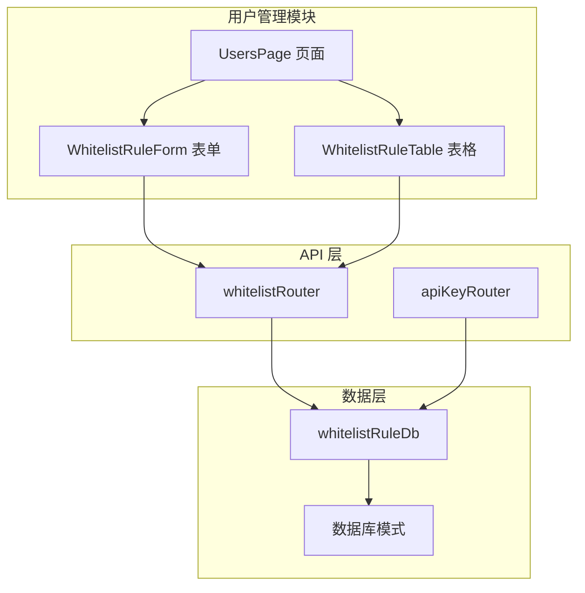
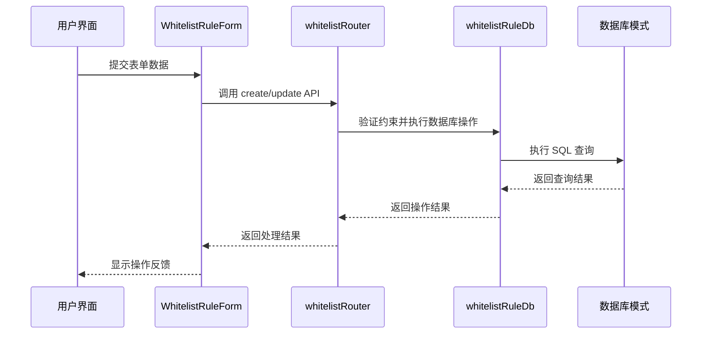
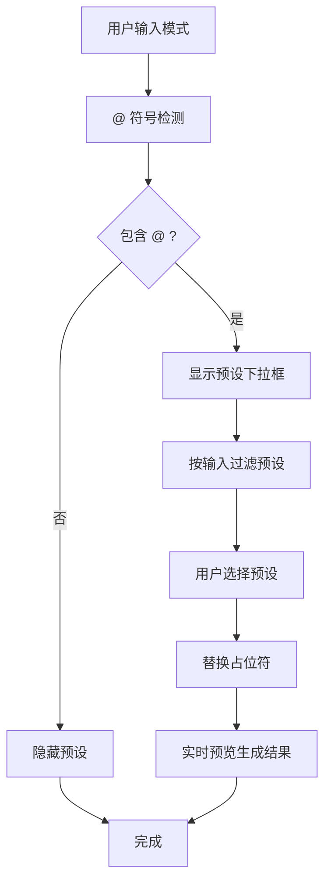
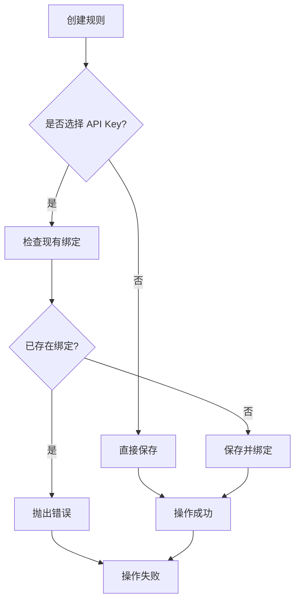
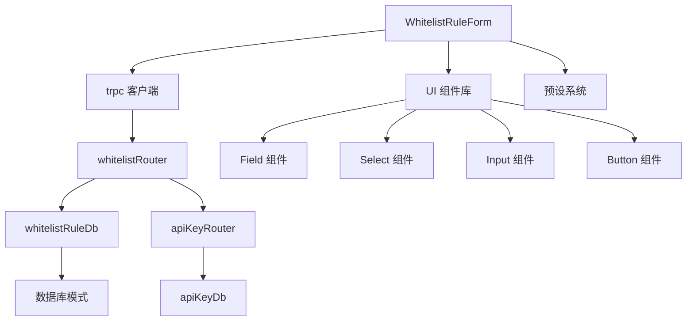

# 白名单规则表单

<cite>
**本文档引用的文件**
- [whitelist-rule-form.tsx](file://src/app/(dashboard)/users/components/whitelist-rule-form.tsx)
- [whitelist.ts](file://src/server/api/routers/whitelist.ts)
- [database.ts](file://src/lib/database.ts)
- [schema.ts](file://src/lib/schema.ts)
- [page.tsx](file://src/app/(dashboard)/users/page.tsx)
- [whitelist-rule-table.tsx](file://src/app/(dashboard)/users/components/whitelist-rule-table.tsx)
- [api-key.ts](file://src/server/api/routers/api-key.ts)
</cite>

## 目录
1. [简介](#简介)
2. [项目结构](#项目结构)
3. [核心组件](#核心组件)
4. [架构概览](#架构概览)
5. [详细组件分析](#详细组件分析)
6. [依赖关系分析](#依赖关系分析)
7. [性能考虑](#性能考虑)
8. [故障排除指南](#故障排除指南)
9. [结论](#结论)

## 简介

白名单规则表单是 AIGate 系统中用于管理用户访问控制的核心组件。该表单允许管理员创建、编辑和管理白名单规则，通过复杂的模式匹配机制来控制用户访问权限。系统支持多种预设模式、动态模式生成和严格的 API Key 绑定约束。

## 项目结构

白名单规则表单位于应用的用户管理模块中，采用模块化的组件设计：

**图表来源**
- [page.tsx](file://src/app/(dashboard)/users/page.tsx#L22-L146)
- [whitelist.ts](file://src/server/api/routers/whitelist.ts#L22-L222)
- [database.ts](file://src/lib/database.ts#L293-L579)

**章节来源**
- [page.tsx](file://src/app/(dashboard)/users/page.tsx#L1-L146)

## 核心组件

### 白名单规则表单组件

白名单规则表单是一个高度交互的 React 组件，提供以下核心功能：

- **策略配置**：选择关联的配额策略
- **优先级管理**：设置规则优先级（数值越大优先级越高）
- **状态控制**：启用/禁用规则
- **模式生成**：动态生成用户 ID 格式
- **校验规则**：基于正则表达式的用户 ID 校验
- **API Key 绑定**：将规则与特定 API Key 关联

### 数据模型

白名单规则包含以下关键字段：

| 字段名 | 类型 | 描述 | 默认值 |
|--------|------|------|--------|
| id | string | 规则唯一标识符 | 自动生成 |
| policyName | string | 关联的配额策略名称 | 必填 |
| priority | number | 规则优先级 | 1 |
| status | enum | 规则状态 | 'active' |
| validationPattern | string | 校验规则正则表达式 | null |
| userIdPattern | string | 用户 ID 生成规则 | null |
| validationEnabled | boolean | 是否启用校验 | false |
| apiKeyId | string | 关联的 API Key ID | null |
| description | string | 规则描述 | null |

**章节来源**
- [whitelist-rule-form.tsx](file://src/app/(dashboard)/users/components/whitelist-rule-form.tsx#L24-L35)
- [schema.ts](file://src/lib/schema.ts#L85-L98)

## 架构概览

系统采用分层架构设计，确保职责分离和可维护性：

**图表来源**
- [whitelist.ts](file://src/server/api/routers/whitelist.ts#L67-L102)
- [database.ts](file://src/lib/database.ts#L354-L365)

## 详细组件分析

### 表单交互逻辑

白名单规则表单实现了复杂的用户交互模式：

#### 预设模式系统

系统提供两套预设模式系统：

1. **校验规则预设**（validationPattern）
   - @ip：IPv4 地址格式
   - @user_id：用户 ID 占位符
   - @any：匹配任意非空字符串

2. **用户 ID 生成预设**（userIdPattern）
   - @ip：客户端 IP 地址
   - @user_id：原始用户 ID
   - @email：邮箱格式
   - @origin：HTTP 来源地址
   - @numeric：纯数字 ID
   - @uuid：UUID 格式
   - @prefix：带前缀的 ID

#### 动态模式生成

表单支持实时模式生成和预览：

**图表来源**
- [whitelist-rule-form.tsx](file://src/app/(dashboard)/users/components/whitelist-rule-form.tsx#L183-L273)

#### API Key 绑定约束

系统实施严格的 API Key 绑定约束：

**图表来源**
- [whitelist.ts](file://src/server/api/routers/whitelist.ts#L73-L82)

**章节来源**
- [whitelist-rule-form.tsx](file://src/app/(dashboard)/users/components/whitelist-rule-form.tsx#L50-L126)
- [whitelist.ts](file://src/server/api/routers/whitelist.ts#L73-L82)

### 数据验证和处理

#### 前端验证

表单在客户端进行基础验证：

- 必填字段验证
- 数字范围验证（优先级必须 ≥ 1）
- 正则表达式有效性检查
- API Key 唯一性验证

#### 后端验证

服务器端实施更严格的数据验证：

- Zod Schema 验证
- 数据库约束检查
- 业务逻辑验证
- 错误处理和回滚

**章节来源**
- [whitelist.ts](file://src/server/api/routers/whitelist.ts#L8-L20)
- [database.ts](file://src/lib/database.ts#L354-L365)

### 用户体验优化

#### 实时预览功能

表单提供实时预览功能，帮助用户理解模式生成效果：

- 实时显示生成的用户 ID
- 预设模式的详细说明
- 键盘导航支持（上下箭头、Enter、Escape）

#### 响应式设计

组件采用响应式设计，适配不同屏幕尺寸：

- 移动端友好的布局
- 触摸友好的交互元素
- 自适应的表单宽度

**章节来源**
- [whitelist-rule-form.tsx](file://src/app/(dashboard)/users/components/whitelist-rule-form.tsx#L241-L273)

## 依赖关系分析

### 组件间依赖

**图表来源**
- [whitelist-rule-form.tsx](file://src/app/(dashboard)/users/components/whitelist-rule-form.tsx#L3-L22)
- [whitelist.ts](file://src/server/api/routers/whitelist.ts#L1-L5)

### 外部依赖

系统依赖以下外部库和服务：

- **React**：核心框架
- **tRPC**：类型安全的 API 调用
- **Drizzle ORM**：数据库抽象层
- **Zod**：数据验证
- **NextAuth.js**：身份认证

**章节来源**
- [whitelist.ts](file://src/server/api/routers/whitelist.ts#L1-L5)
- [database.ts](file://src/lib/database.ts#L1-L17)

## 性能考虑

### 数据加载优化

- **懒加载**：API Key 和策略数据按需加载
- **缓存策略**：合理使用缓存减少重复请求
- **分页处理**：大量数据的分页展示

### 渲染性能

- **虚拟滚动**：表格组件使用虚拟滚动优化大数据集
- **状态管理**：最小化不必要的重新渲染
- **防抖处理**：输入框的防抖处理减少频繁更新

### 数据库性能

- **索引优化**：关键字段建立适当索引
- **批量操作**：支持批量数据操作
- **连接池管理**：合理管理数据库连接

## 故障排除指南

### 常见问题及解决方案

#### API Key 绑定冲突

**问题**：尝试将 API Key 绑定到多个白名单规则
**解决**：确保每个 API Key 只能绑定一个白名单规则

#### 正则表达式无效

**问题**：校验规则正则表达式导致验证失败
**解决**：检查正则表达式语法，使用预设模式作为参考

#### 模式生成错误

**问题**：用户 ID 生成失败
**解决**：检查 userIdPattern 中的占位符是否正确，确认客户端 IP 可用性

#### 权限不足

**问题**：无法访问某些功能
**解决**：确认用户角色为 ADMIN，检查 NextAuth.js 配置

**章节来源**
- [whitelist.ts](file://src/server/api/routers/whitelist.ts#L77-L81)
- [database.ts](file://src/lib/database.ts#L494-L497)

### 调试技巧

1. **浏览器开发者工具**：监控网络请求和响应
2. **日志分析**：查看服务器端错误日志
3. **数据库查询**：直接查询数据库验证数据一致性
4. **单元测试**：编写测试用例验证核心逻辑

## 结论

白名单规则表单是一个功能完整、用户体验优秀的访问控制管理组件。它通过精心设计的预设系统、实时交互和严格的业务约束，为系统提供了强大的用户访问控制能力。

系统的主要优势包括：
- **直观的用户界面**：清晰的表单布局和实时反馈
- **灵活的模式系统**：支持复杂的用户 ID 生成和校验
- **严格的约束机制**：确保数据一致性和系统稳定性
- **良好的扩展性**：模块化设计便于功能扩展

未来可以考虑的功能增强：
- 更多的预设模式选项
- 批量操作功能
- 更详细的审计日志
- 高级搜索和筛选功能