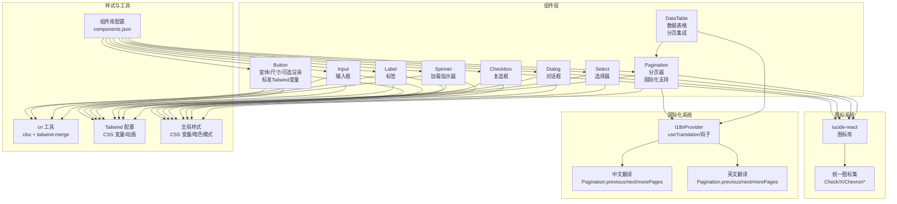
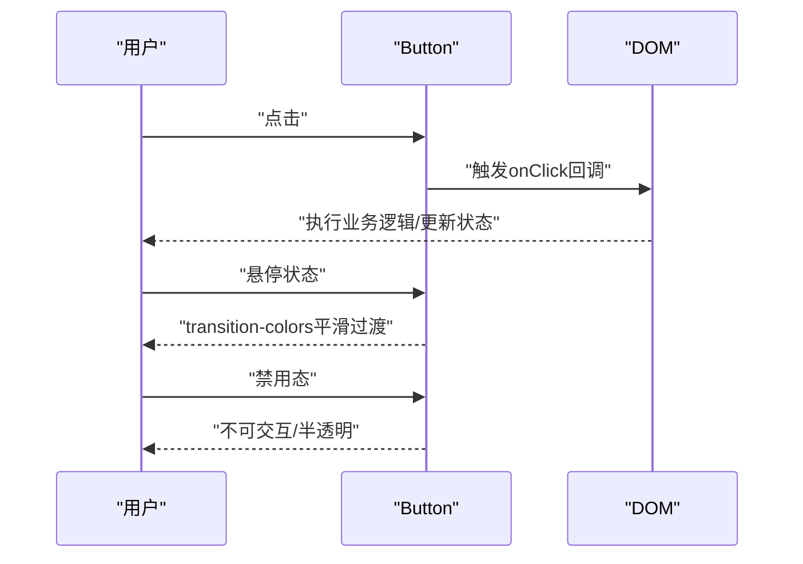
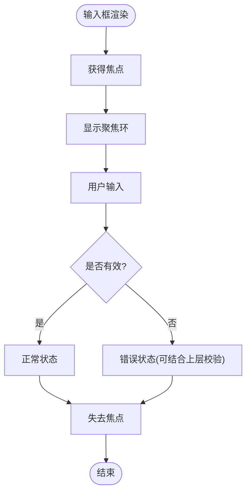
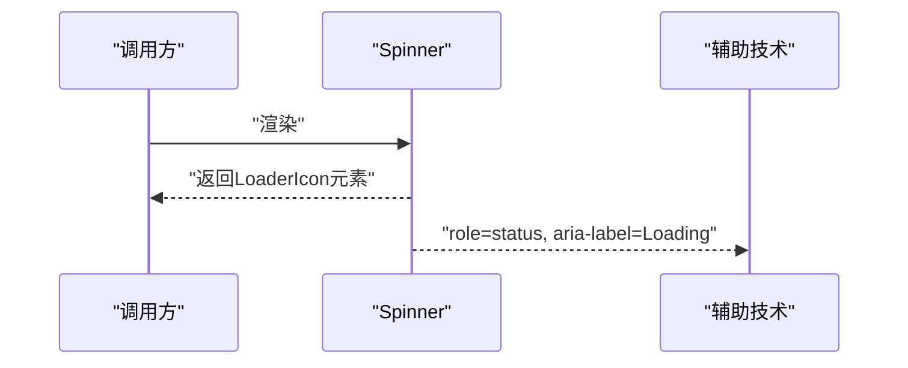
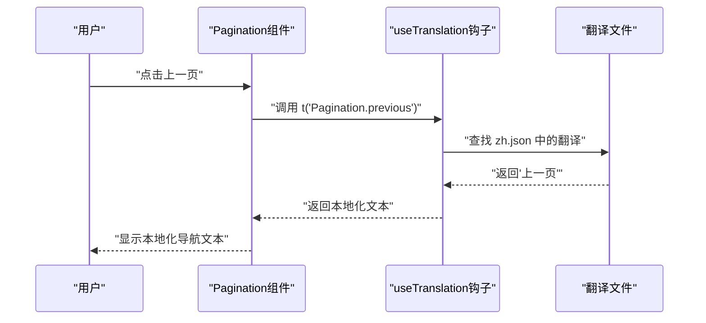
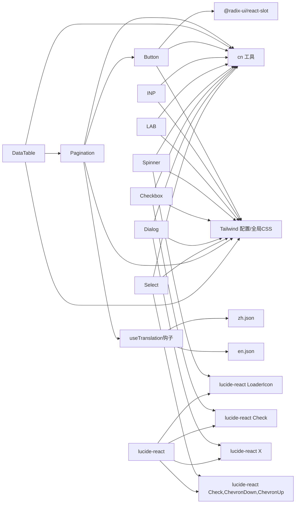

# 基础组件

<cite>
**本文引用的文件**
- [src/components/ui/button.tsx](file://src/components/ui/button.tsx)
- [src/components/ui/input.tsx](file://src/components/ui/input.tsx)
- [src/components/ui/label.tsx](file://src/components/ui/label.tsx)
- [src/components/ui/spinner.tsx](file://src/components/ui/spinner.tsx)
- [src/components/ui/checkbox.tsx](file://src/components/ui/checkbox.tsx)
- [src/components/ui/dialog.tsx](file://src/components/ui/dialog.tsx)
- [src/components/ui/select.tsx](file://src/components/ui/select.tsx)
- [src/components/ui/pagination.tsx](file://src/components/ui/pagination.tsx)
- [src/components/ui/data-table.tsx](file://src/components/ui/data-table.tsx)
- [src/i18n/client.tsx](file://src/i18n/client.tsx)
- [src/messages/zh.json](file://src/messages/zh.json)
- [src/messages/en.json](file://src/messages/en.json)
- [src/lib/utils.ts](file://src/lib/utils.ts)
- [tailwind.config.js](file://tailwind.config.js)
- [src/app/globals.css](file://src/app/globals.css)
- [components.json](file://components.json)
- [package.json](file://package.json)
- [src/app/(dashboard)/debug/components/response-result.tsx](file://src/app/(dashboard)/debug/components/response-result.tsx)
- [src/app/(dashboard)/page.tsx](file://src/app/(dashboard)/page.tsx)
- [src/components/dashboard-layout.tsx](file://src/components/dashboard-layout.tsx)
- [src/app/(dashboard)/debug/components/request-config.tsx](file://src/app/(dashboard)/debug/components/request-config.tsx)
- [src/app/(dashboard)/users/components/whitelist-rule-form.tsx](file://src/app/(dashboard)/users/components/whitelist-rule-form.tsx)
- [src/app/(dashboard)/users/components/whitelist-rule-table.tsx](file://src/app/(dashboard)/users/components/whitelist-rule-table.tsx)
</cite>

## 更新摘要
**变更内容**
- 更新 Button 组件样式系统，使用标准 Tailwind CSS 变量替代自定义 CSS 属性
- 改进图标间距和悬停状态的过渡效果
- **新增** Pagination 组件国际化扩展，增加 useTranslation 钩子支持本地化导航控制标签和屏幕阅读器文本
- 保持原有的 CSS 变量系统与主题支持
- 增强组件的可访问性与一致性

## 目录
1. [简介](#简介)
2. [项目结构](#项目结构)
3. [核心组件](#核心组件)
4. [架构总览](#架构总览)
5. [详细组件分析](#详细组件分析)
6. [图标库集成](#图标库集成)
7. [国际化系统](#国际化系统)
8. [依赖关系分析](#依赖关系分析)
9. [性能考量](#性能考量)
10. [故障排查指南](#故障排查指南)
11. [结论](#结论)
12. [附录](#附录)

## 简介
本文件面向 AIGate 的基础 UI 组件，围绕 Button、Input、Label、Spinner 四个核心组件进行系统化说明。内容涵盖设计理念、属性接口、事件与状态管理、样式系统（Tailwind CSS 变体与尺寸）、可访问性支持、定制化选项以及使用示例与最佳实践。特别关注 Button 组件样式系统的现代化改进，使用标准 Tailwind CSS 变量替代自定义 CSS 属性，改善图标间距和悬停状态，提升了代码的可维护性和组件的一致性。**最新更新**包括 Pagination 组件的国际化扩展，通过 useTranslation 钩子支持本地化的导航控制标签和屏幕阅读器文本，进一步增强了组件的可访问性和用户体验。

## 项目结构
基础组件位于 src/components/ui 下，采用"原子化组件"风格：每个组件独立封装，统一通过 cn 工具函数合并类名，并以 Tailwind CSS 与 CSS 变量驱动视觉表现。全局样式通过 src/app/globals.css 定义 CSS 变量与暗色模式切换，tailwind.config.js 提供主题扩展与动画插件。项目现已全面集成 lucide-react 图标库，为所有组件提供统一的图标系统。**新增**国际化系统通过 I18nProvider 和 useTranslation 钩子实现多语言支持。

**图表来源**
- [src/components/ui/button.tsx:1-57](file://src/components/ui/button.tsx#L1-L57)
- [src/components/ui/spinner.tsx:1-17](file://src/components/ui/spinner.tsx#L1-L17)
- [src/components/ui/checkbox.tsx:1-31](file://src/components/ui/checkbox.tsx#L1-L31)
- [src/components/ui/dialog.tsx:1-121](file://src/components/ui/dialog.tsx#L1-L121)
- [src/components/ui/select.tsx:1-152](file://src/components/ui/select.tsx#L1-L152)
- [src/components/ui/pagination.tsx:1-130](file://src/components/ui/pagination.tsx#L1-L130)
- [src/components/ui/data-table.tsx:1-191](file://src/components/ui/data-table.tsx#L1-L191)
- [src/i18n/client.tsx:1-102](file://src/i18n/client.tsx#L1-L102)
- [src/lib/utils.ts:1-7](file://src/lib/utils.ts#L1-L7)
- [tailwind.config.js:1-78](file://tailwind.config.js#L1-L78)
- [src/app/globals.css:1-125](file://src/app/globals.css#L1-L125)
- [components.json:1-18](file://components.json#L1-L18)

**章节来源**
- [src/components/ui/button.tsx:1-57](file://src/components/ui/button.tsx#L1-L57)
- [src/components/ui/input.tsx:1-26](file://src/components/ui/input.tsx#L1-L26)
- [src/components/ui/label.tsx:1-25](file://src/components/ui/label.tsx#L1-L25)
- [src/components/ui/spinner.tsx:1-17](file://src/components/ui/spinner.tsx#L1-L17)
- [src/components/ui/checkbox.tsx:1-31](file://src/components/ui/checkbox.tsx#L1-L31)
- [src/components/ui/dialog.tsx:1-121](file://src/components/ui/dialog.tsx#L1-L121)
- [src/components/ui/select.tsx:1-152](file://src/components/ui/select.tsx#L1-L152)
- [src/components/ui/pagination.tsx:1-130](file://src/components/ui/pagination.tsx#L1-L130)
- [src/components/ui/data-table.tsx:1-191](file://src/components/ui/data-table.tsx#L1-L191)
- [src/i18n/client.tsx:1-102](file://src/i18n/client.tsx#L1-L102)
- [src/lib/utils.ts:1-7](file://src/lib/utils.ts#L1-L7)
- [tailwind.config.js:1-78](file://tailwind.config.js#L1-L78)
- [src/app/globals.css:1-125](file://src/app/globals.css#L1-L125)
- [components.json:1-18](file://components.json#L1-L18)

## 核心组件
- **Button**：支持多种变体（默认、破坏性、描边、次级、幽灵、链接）与尺寸（默认、小、大、图标），支持作为子节点渲染（asChild）。使用标准 Tailwind CSS 变量（bg-primary、text-primary-foreground 等）替代自定义 CSS 属性，内置 gap-2 图标间距和 transition-colors 悬停过渡效果。
- **Input**：通用输入框，内置聚焦环、禁用态与文件样式重置，支持类型与自定义类名。
- **Label**：基于 Radix UI Label，提供禁用态样式，配合表单控件使用。
- **Spinner**：基于 lucide-react 的 LoaderIcon，带 role 与 aria-label，支持尺寸与类名覆盖。
- **Checkbox**：基于 Radix UI Checkbox，使用 lucide-react 的 Check 图标，提供统一的复选框体验。
- **Dialog**：基于 Radix UI Dialog，使用 lucide-react 的 X 图标关闭按钮，提供模态对话框功能。
- **Select**：基于 Radix UI Select，使用 lucide-react 的 Check、ChevronDown、ChevronUp 图标，提供下拉选择功能。
- **Pagination**：分页组件，使用 lucide-react 的 ChevronLeft、ChevronRight、MoreHorizontal 图标。**更新**：增加 useTranslation 钩子支持本地化导航控制标签和屏幕阅读器文本。
- **DataTable**：数据表格组件，集成 Pagination 组件实现分页功能，支持国际化。

**章节来源**
- [src/components/ui/button.tsx:37-57](file://src/components/ui/button.tsx#L37-L57)
- [src/components/ui/input.tsx:5-25](file://src/components/ui/input.tsx#L5-L25)
- [src/components/ui/label.tsx:7-24](file://src/components/ui/label.tsx#L7-L24)
- [src/components/ui/spinner.tsx:5-16](file://src/components/ui/spinner.tsx#L5-L16)
- [src/components/ui/checkbox.tsx:9-27](file://src/components/ui/checkbox.tsx#L9-L27)
- [src/components/ui/dialog.tsx:15-52](file://src/components/ui/dialog.tsx#L15-L52)
- [src/components/ui/select.tsx:13-126](file://src/components/ui/select.tsx#L13-L126)
- [src/components/ui/pagination.tsx:1-130](file://src/components/ui/pagination.tsx#L1-L130)
- [src/components/ui/data-table.tsx:1-191](file://src/components/ui/data-table.tsx#L1-L191)

## 架构总览
组件样式体系由五部分构成：
- **组件内部类名**：通过 cva 定义变体与尺寸，cn 合并传入 className。
- **图标系统**：统一使用 lucide-react 图标库，确保图标一致性与可维护性。
- **国际化系统**：通过 I18nProvider 和 useTranslation 钩子实现多语言支持。
- **Tailwind 主题扩展**：tailwind.config.js 扩展颜色、圆角、动画等。
- **CSS 变量与暗色模式**：src/app/globals.css 定义 --primary、--card 等变量，并在 .dark 中切换。

```mermaid
classDiagram
class Button {
+属性 : variant,size,asChild,className
+行为 : 渲染button或Slot
+样式 : 标准Tailwind变量/图标间距/过渡效果
}
class Input {
+属性 : type,className
+行为 : 渲染input
+样式 : 聚焦环/禁用态
}
class Label {
+属性 : className
+行为 : 渲染Label原语
+样式 : 禁用态
}
class Spinner {
+属性 : className
+行为 : 渲染LoaderIcon
+可访问性 : role=status,aria-label
+图标 : lucide-react LoaderIcon
}
class Checkbox {
+属性 : className
+行为 : 渲染Checkbox原语
+图标 : lucide-react Check
+样式 : 复选框状态
}
class Dialog {
+属性 : className
+行为 : 渲染Dialog
+图标 : lucide-react X
+样式 : 模态对话框
}
class Select {
+属性 : className
+行为 : 渲染Select
+图标 : lucide-react Check,ChevronDown,ChevronUp
+样式 : 下拉选择
}
class Pagination {
+属性 : className
+行为 : 渲染Pagination
+图标 : lucide-react ChevronLeft,ChevronRight,MoreHorizontal
+样式 : 分页导航
+国际化 : useTranslation钩子
}
class DataTable {
+属性 : columns,data,pageSize
+行为 : 渲染表格+分页
+集成 : Pagination组件
+国际化 : 通过Pagination实现
}
class I18nProvider {
+属性 : locale,t,locale切换
+行为 : 提供翻译上下文
+数据 : zh.json,en.json
}
class Utils {
+cn(...inputs) : 合并类名
}
class Theme {
+Tailwind配置
+CSS变量/暗色模式
}
class IconSystem {
+lucide-react 图标库
+统一图标集
+可定制图标
}
Button --> Utils : "使用"
Input --> Utils : "使用"
Label --> Utils : "使用"
Spinner --> Utils : "使用"
Checkbox --> Utils : "使用"
Dialog --> Utils : "使用"
Select --> Utils : "使用"
Pagination --> Utils : "使用"
DataTable --> Utils : "使用"
Pagination --> I18nProvider : "使用"
DataTable --> I18nProvider : "使用"
Button --> Theme : "依赖"
Input --> Theme : "依赖"
Label --> Theme : "依赖"
Spinner --> Theme : "依赖"
Checkbox --> Theme : "依赖"
Dialog --> Theme : "依赖"
Select --> Theme : "依赖"
Pagination --> Theme : "依赖"
DataTable --> Theme : "依赖"
Spinner --> IconSystem : "使用"
Checkbox --> IconSystem : "使用"
Dialog --> IconSystem : "使用"
Select --> IconSystem : "使用"
Pagination --> IconSystem : "使用"
DataTable --> IconSystem : "使用"
```

**图表来源**
- [src/components/ui/button.tsx:1-57](file://src/components/ui/button.tsx#L1-L57)
- [src/components/ui/input.tsx:1-26](file://src/components/ui/input.tsx#L1-L26)
- [src/components/ui/label.tsx:1-25](file://src/components/ui/label.tsx#L1-L25)
- [src/components/ui/spinner.tsx:1-17](file://src/components/ui/spinner.tsx#L1-L17)
- [src/components/ui/checkbox.tsx:1-31](file://src/components/ui/checkbox.tsx#L1-L31)
- [src/components/ui/dialog.tsx:1-121](file://src/components/ui/dialog.tsx#L1-L121)
- [src/components/ui/select.tsx:1-152](file://src/components/ui/select.tsx#L1-L152)
- [src/components/ui/pagination.tsx:1-130](file://src/components/ui/pagination.tsx#L1-L130)
- [src/components/ui/data-table.tsx:1-191](file://src/components/ui/data-table.tsx#L1-L191)
- [src/i18n/client.tsx:1-102](file://src/i18n/client.tsx#L1-L102)
- [src/lib/utils.ts:1-7](file://src/lib/utils.ts#L1-L7)
- [tailwind.config.js:1-78](file://tailwind.config.js#L1-L78)
- [src/app/globals.css:1-125](file://src/app/globals.css#L1-L125)

## 详细组件分析

### Button 组件
- **设计理念**
  - 使用 cva 定义变体与尺寸，确保一致的交互反馈（悬停过渡、阴影、激活缩放）。
  - 支持 asChild，可将 Button 渲染为任意元素（如 Link 或自定义容器），保持语义与无障碍一致性。
  - **更新**：采用标准 Tailwind CSS 变量（bg-primary、text-primary-foreground 等）替代自定义 CSS 属性，提升代码可维护性。
  - **更新**：内置 gap-2 图标间距，确保图标与文字之间的一致间距。
  - **更新**：使用 transition-colors 实现平滑的悬停状态过渡效果。
- **属性接口**
  - 继承原生 button 属性，新增 variant、size、asChild。
  - 变体：default、destructive、outline、secondary、ghost、link。
  - 尺寸：default、sm、lg、icon。
- **事件与状态**
  - 通过原生 button 事件（onClick 等）处理用户交互；禁用态自动应用 pointer-events:none 与不透明度。
- **样式系统**
  - **更新**：使用标准 Tailwind CSS 变量映射主题色（bg-primary、text-primary-foreground 等），在不同变体中动态呈现。
  - **更新**：通过 gap-2 确保图标与文字之间的间距一致，&[_svg]:size-4 确保图标尺寸标准化。
  - **更新**：transition-colors 提供平滑的颜色过渡效果，改善用户体验。
  - 尺寸通过高度/内边距组合，保证视觉比例一致。
- **可访问性**
  - 内置焦点可见环（ring），支持键盘导航；作为子节点时可承载语义化标签。
- **自定义化**
  - 通过 className 覆盖类名；通过 variant/size 切换预设外观；支持 asChild 适配复杂布局。
- **使用示例与最佳实践**
  - 在调试面板中使用 secondary/sm 按钮加载示例；在表格中使用 ghost/sm 按钮切换状态；在表单中使用 destructive 按钮执行危险操作。

**图表来源**
- [src/components/ui/button.tsx:37-57](file://src/components/ui/button.tsx#L37-L57)
- [src/app/(dashboard)/debug/components/request-config.tsx](file://src/app/(dashboard)/debug/components/request-config.tsx#L315-L331)
- [src/app/(dashboard)/users/components/whitelist-rule-table.tsx](file://src/app/(dashboard)/users/components/whitelist-rule-table.tsx#L93-L107)

**章节来源**
- [src/components/ui/button.tsx:7-35](file://src/components/ui/button.tsx#L7-L35)
- [src/components/ui/button.tsx:37-57](file://src/components/ui/button.tsx#L37-L57)
- [src/app/(dashboard)/debug/components/request-config.tsx](file://src/app/(dashboard)/debug/components/request-config.tsx#L315-L331)
- [src/app/(dashboard)/users/components/whitelist-rule-table.tsx](file://src/app/(dashboard)/users/components/whitelist-rule-table.tsx#L93-L107)

### Input 组件
- **设计理念**
  - 提供统一的输入框基线样式，包含聚焦环、禁用态、文件上传样式重置，便于在表单中复用。
- **属性接口**
  - 继承原生 input 属性，新增 className。
- **事件与状态**
  - 通过原生事件处理值变更与交互；禁用态阻止输入。
- **样式系统**
  - 使用 CSS 变量与 Tailwind 类组合，确保与主题一致。
- **可访问性**
  - 保持原生 input 的可访问性语义；聚焦时提供可见环。
- **自定义化**
  - 通过 className 覆盖默认样式；支持 type 控制输入类型。

**图表来源**
- [src/components/ui/input.tsx:5-25](file://src/components/ui/input.tsx#L5-L25)

**章节来源**
- [src/components/ui/input.tsx:5-25](file://src/components/ui/input.tsx#L5-L25)
- [src/app/(dashboard)/users/components/whitelist-rule-form.tsx](file://src/app/(dashboard)/users/components/whitelist-rule-form.tsx#L285-L300)

### Label 组件
- **设计理念**
  - 基于 Radix UI Label，提供禁用态样式，配合表单控件提升可访问性。
- **属性接口**
  - 继承原生 label 属性，新增 className。
- **样式系统**
  - 使用 cva 定义禁用态样式，与表单控件联动。
- **可访问性**
  - 通过原生 label 关联控件，提升屏幕阅读器体验。
- **自定义化**
  - 通过 className 覆盖文本大小、字体与对齐等。

**章节来源**
- [src/components/ui/label.tsx:7-24](file://src/components/ui/label.tsx#L7-L24)

### Spinner 组件
- **设计理念**
  - 以 lucide-react 的 LoaderIcon 为基础，提供统一的加载指示器，支持 role 与 aria-label，便于无障碍识别。
  - 从自定义 SVG 实现迁移到标准化图标库，提升可维护性和一致性。
- **属性接口**
  - 接收 className 与其他 SVG 属性。
- **样式系统**
  - 默认 size-4 与 animate-spin，可叠加自定义类名。
- **可访问性**
  - role="status" 与 aria-label="Loading" 明确加载状态。
- **自定义化**
  - 通过 className 调整尺寸、颜色与动画。
- **图标集成**
  - 使用 lucide-react 的 LoaderIcon，确保图标质量与一致性。

**图表来源**
- [src/components/ui/spinner.tsx:5-16](file://src/components/ui/spinner.tsx#L5-L16)

**章节来源**
- [src/components/ui/spinner.tsx:1-17](file://src/components/ui/spinner.tsx#L1-L17)

### Checkbox 组件
- **设计理念**
  - 基于 Radix UI Checkbox，使用 lucide-react 的 Check 图标，提供统一的复选框体验。
  - 图标系统标准化，确保视觉一致性。
- **属性接口**
  - 继承原生 checkbox 属性，新增 className。
- **样式系统**
  - 使用 CSS 变量与 Tailwind 类组合，确保与主题一致。
- **可访问性**
  - 保持原生 checkbox 的可访问性语义；支持键盘导航。
- **自定义化**
  - 通过 className 覆盖默认样式；支持 checked/unchecked 状态。

**章节来源**
- [src/components/ui/checkbox.tsx:1-31](file://src/components/ui/checkbox.tsx#L1-L31)

### Dialog 组件
- **设计理念**
  - 基于 Radix UI Dialog，使用 lucide-react 的 X 图标作为关闭按钮，提供模态对话框功能。
  - 图标系统标准化，提升用户体验一致性。
- **属性接口**
  - 继承原生 dialog 属性，新增 className。
- **样式系统**
  - 使用 CSS 变量与 Tailwind 类组合，确保与主题一致。
- **可访问性**
  - 保持原生 dialog 的可访问性语义；支持键盘导航与焦点管理。
- **自定义化**
  - 通过 className 覆盖默认样式；支持不同位置与动画效果。

**章节来源**
- [src/components/ui/dialog.tsx:1-121](file://src/components/ui/dialog.tsx#L1-L121)

### Select 组件
- **设计理念**
  - 基于 Radix UI Select，使用 lucide-react 的 Check、ChevronDown、ChevronUp 图标，提供下拉选择功能。
  - 图标系统标准化，确保视觉一致性与交互反馈。
- **属性接口**
  - 继承原生 select 属性，新增 className。
- **样式系统**
  - 使用 CSS 变量与 Tailwind 类组合，确保与主题一致。
- **可访问性**
  - 保持原生 select 的可访问性语义；支持键盘导航与焦点管理。
- **自定义化**
  - 通过 className 覆盖默认样式；支持不同位置与动画效果。

**章节来源**
- [src/components/ui/select.tsx:1-152](file://src/components/ui/select.tsx#L1-L152)

### Pagination 组件
- **设计理念**
  - 分页组件，使用 lucide-react 的 ChevronLeft、ChevronRight、MoreHorizontal 图标，提供分页导航功能。
  - 图标系统标准化，确保导航体验一致性。
  - **更新**：增加 useTranslation 钩子支持本地化导航控制标签和屏幕阅读器文本。
- **属性接口**
  - 继承原生 nav 属性，新增 className。
- **国际化支持**
  - **新增**：使用 useTranslation 钩子从国际化系统获取本地化文本。
  - **新增**：支持 Pagination.previous、Pagination.next、Pagination.morePages 翻译键。
  - **新增**：通过 t('Pagination.previous')、t('Pagination.next')、t('Pagination.morePages') 获取本地化文本。
- **样式系统**
  - 使用 CSS 变量与 Tailwind 类组合，确保与主题一致。
- **可访问性**
  - 保持原生 nav 的可访问性语义；支持键盘导航与焦点管理。
  - **更新**：PaginationPrevious 和 PaginationNext 组件提供 aria-label 属性。
  - **更新**：PaginationEllipsis 组件提供 sr-only 屏幕阅读器文本。
- **自定义化**
  - 通过 className 覆盖默认样式；支持不同尺寸与布局。

**章节来源**
- [src/components/ui/pagination.tsx:1-130](file://src/components/ui/pagination.tsx#L1-L130)

### DataTable 组件
- **设计理念**
  - 数据表格组件，集成 Pagination 组件实现分页功能。
  - 使用 @tanstack/react-table 库提供强大的表格功能。
  - **更新**：通过 Pagination 组件实现国际化分页导航。
- **属性接口**
  - columns：表格列定义
  - data：表格数据
  - pageSize：每页显示数量，默认10
  - emptyMessage/emptyDescription/emptyIcon：空状态配置
- **国际化集成**
  - **更新**：通过 Pagination 组件继承国际化支持。
  - **更新**：Pagination 组件的本地化文本自动应用于数据表格分页。
- **功能特性**
  - 支持排序、过滤、分页等高级表格功能。
  - 自动根据数据量生成页码数组。
  - 支持省略号（ellipsis）显示长列表的页码。
- **可访问性**
  - 集成 Pagination 组件的可访问性特性。
  - 支持键盘导航和屏幕阅读器识别。

**章节来源**
- [src/components/ui/data-table.tsx:1-191](file://src/components/ui/data-table.tsx#L1-L191)

## 图标库集成

### lucide-react 集成概述
项目已全面集成 lucide-react 图标库，版本为 ^0.575.0，为所有组件提供统一的图标系统。这一集成显著提升了代码可维护性和图标一致性。

### 图标使用范围
- **基础组件**：Spinner 使用 LoaderIcon，Checkbox 使用 Check，Dialog 使用 X，Select 使用 Check、ChevronDown、ChevronUp，Pagination 使用 ChevronLeft、ChevronRight、MoreHorizontal。
- **业务组件**：大量业务组件使用 lucide-react 图标进行状态显示和界面美化。
- **仪表板组件**：首页统计卡片使用 Users、BarChart3、Coins、UserCheck 等图标。

### 图标集成优势
- **标准化**：统一的图标风格和尺寸规范。
- **可维护性**：集中管理图标，便于更新和维护。
- **一致性**：确保所有组件使用相同的图标风格。
- **可访问性**：图标具备适当的语义化标记。

### 图标使用最佳实践
- **尺寸控制**：使用标准尺寸（h-4、h-5、h-6 等）确保视觉一致性。
- **颜色继承**：使用 text-current 或具体颜色类确保与主题一致。
- **语义化**：为重要图标添加适当的 aria-label 和 role 属性。
- **性能优化**：按需导入图标，避免不必要的包体积增加。

**章节来源**
- [package.json:43-43](file://package.json#L43-L43)
- [src/components/ui/spinner.tsx:1-1](file://src/components/ui/spinner.tsx#L1-L1)
- [src/components/ui/checkbox.tsx:5-5](file://src/components/ui/checkbox.tsx#L5-L5)
- [src/components/ui/dialog.tsx:3-3](file://src/components/ui/dialog.tsx#L3-L3)
- [src/components/ui/select.tsx:3-3](file://src/components/ui/select.tsx#L3-L3)
- [src/components/ui/pagination.tsx:2-2](file://src/components/ui/pagination.tsx#L2-L2)
- [src/app/(dashboard)/debug/components/response-result.tsx](file://src/app/(dashboard)/debug/components/response-result.tsx#L4-L4)
- [src/app/(dashboard)/page.tsx](file://src/app/(dashboard)/page.tsx#L11-L11)
- [src/components/dashboard-layout.tsx:5-5](file://src/components/dashboard-layout.tsx#L5-L5)

## 国际化系统

### I18nProvider 和 useTranslation 钩子
项目实现了完整的国际化系统，通过 I18nProvider 和 useTranslation 钩子提供多语言支持。

### 国际化架构
- **I18nProvider**：提供国际化上下文，管理当前语言和翻译函数。
- **useTranslation**：自定义钩子，封装国际化逻辑，提供 t 函数和语言切换功能。
- **消息文件**：分别维护中文（zh.json）和英文（en.json）翻译文件。
- **本地存储**：使用 localStorage 存储用户语言偏好。

### Translation 键值结构
- **Pagination.previous**：上一页导航文本
- **Pagination.next**：下一页导航文本  
- **Pagination.morePages**：更多页省略号的屏幕阅读器文本

### 国际化实现细节
- **动态语言切换**：通过 setLocale 函数切换语言，自动更新 html lang 属性。
- **嵌套键值查找**：支持点号分隔的嵌套键值结构（如 Pagination.previous）。
- **回退机制**：当翻译键不存在时，返回键名本身并输出警告信息。
- **类型安全**：使用 TypeScript 定义 Locale 类型和消息映射。

### Pagination 组件国际化集成
- **PaginationPrevious**：使用 t('Pagination.previous') 获取本地化文本，设置 aria-label。
- **PaginationNext**：使用 t('Pagination.next') 获取本地化文本，设置 aria-label。
- **PaginationEllipsis**：使用 t('Pagination.morePages') 为屏幕阅读器提供文本。
- **自动适配**：所有使用 Pagination 组件的页面自动获得国际化支持。

### 国际化最佳实践
- **键值命名**：使用清晰的命名空间（如 Pagination.*）组织翻译键。
- **占位符处理**：在翻译文本中使用占位符时，确保与原文一致。
- **上下文敏感**：根据使用场景提供合适的翻译文本。
- **测试覆盖**：为新添加的翻译键编写单元测试。

**图表来源**
- [src/components/ui/pagination.tsx:65-81](file://src/components/ui/pagination.tsx#L65-L81)
- [src/i18n/client.tsx:58-77](file://src/i18n/client.tsx#L58-L77)
- [src/messages/zh.json:173-177](file://src/messages/zh.json#L173-L177)

**章节来源**
- [src/i18n/client.tsx:1-102](file://src/i18n/client.tsx#L1-L102)
- [src/messages/zh.json:173-177](file://src/messages/zh.json#L173-L177)
- [src/messages/en.json:173-177](file://src/messages/en.json#L173-L177)
- [src/components/ui/pagination.tsx:65-118](file://src/components/ui/pagination.tsx#L65-L118)

## 依赖关系分析
- **组件到工具**
  - Button/Input/Label/Spinner/Checkbox/Dialog/Select/Pagination 均依赖 cn 工具进行类名合并，避免冲突并支持变体叠加。
- **组件到主题**
  - Tailwind 配置提供颜色、圆角与动画扩展；全局 CSS 定义 CSS 变量并在 .dark 中切换。
- **组件到第三方**
  - Button 使用 @radix-ui/react-slot 实现 asChild；Spinner 使用 lucide-react 的 LoaderIcon；Label 使用 @radix-ui/react-label；Checkbox 使用 @radix-ui/react-checkbox；Dialog 使用 @radix-ui/react-dialog；Select 使用 @radix-ui/react-select；Pagination 使用 Button 组件。
- **组件到图标库**
  - 所有使用图标的组件都依赖 lucide-react 图标库，确保图标的一致性和可维护性。
- **组件到国际化系统**
  - **新增**：Pagination 组件依赖 useTranslation 钩子实现国际化。
  - **新增**：DataTable 组件通过 Pagination 组件间接获得国际化支持。
- **组件到业务页面**
  - Button 在调试面板与用户白名单规则页面中被广泛使用，体现其在交互与状态切换中的作用。
  - **新增**：Pagination 组件在数据表格和IP请求列表等页面中提供国际化分页导航。

**图表来源**
- [src/components/ui/button.tsx:1-57](file://src/components/ui/button.tsx#L1-L57)
- [src/components/ui/spinner.tsx:1-17](file://src/components/ui/spinner.tsx#L1-L17)
- [src/components/ui/checkbox.tsx:1-31](file://src/components/ui/checkbox.tsx#L1-L31)
- [src/components/ui/dialog.tsx:1-121](file://src/components/ui/dialog.tsx#L1-L121)
- [src/components/ui/select.tsx:1-152](file://src/components/ui/select.tsx#L1-L152)
- [src/components/ui/pagination.tsx:1-130](file://src/components/ui/pagination.tsx#L1-L130)
- [src/components/ui/data-table.tsx:1-191](file://src/components/ui/data-table.tsx#L1-L191)
- [src/i18n/client.tsx:1-102](file://src/i18n/client.tsx#L1-L102)
- [src/lib/utils.ts:1-7](file://src/lib/utils.ts#L1-L7)
- [tailwind.config.js:1-78](file://tailwind.config.js#L1-L78)
- [src/app/globals.css:1-125](file://src/app/globals.css#L1-L125)
- [package.json:43-43](file://package.json#L43-L43)

**章节来源**
- [src/components/ui/button.tsx:1-57](file://src/components/ui/button.tsx#L1-L57)
- [src/components/ui/spinner.tsx:1-17](file://src/components/ui/spinner.tsx#L1-L17)
- [src/components/ui/checkbox.tsx:1-31](file://src/components/ui/checkbox.tsx#L1-L31)
- [src/components/ui/dialog.tsx:1-121](file://src/components/ui/dialog.tsx#L1-L121)
- [src/components/ui/select.tsx:1-152](file://src/components/ui/select.tsx#L1-L152)
- [src/components/ui/pagination.tsx:1-130](file://src/components/ui/pagination.tsx#L1-L130)
- [src/components/ui/data-table.tsx:1-191](file://src/components/ui/data-table.tsx#L1-L191)
- [src/i18n/client.tsx:1-102](file://src/i18n/client.tsx#L1-L102)
- [src/lib/utils.ts:1-7](file://src/lib/utils.ts#L1-L7)
- [tailwind.config.js:1-78](file://tailwind.config.js#L1-L78)
- [src/app/globals.css:1-125](file://src/app/globals.css#L1-L125)
- [package.json:43-43](file://package.json#L43-L43)

## 性能考量
- **类名合并**：cn 使用 clsx 与 tailwind-merge，减少重复类名与冲突，降低样式计算开销。
- **动画与过渡**：**更新**：Button 的 transition-colors 悬停过渡效果基于 CSS 变量与过渡时间，提供流畅的用户体验，建议在低端设备上谨慎使用复杂的颜色过渡。
- **渲染策略**：Button 的 asChild 允许将按钮渲染为更轻量的元素，减少不必要的包裹层级。
- **主题切换**：CSS 变量与暗色模式切换在运行时仅改变变量值，避免重绘大面积区域。
- **图标性能**：lucide-react 图标库经过优化，按需导入可减少包体积；图标组件渲染性能良好。
- **图标缓存**：React.memo 化的图标组件可避免不必要的重新渲染。
- **国际化性能**：**新增**：useTranslation 钩子使用 useCallback 优化性能，避免不必要的重新渲染。
- **翻译缓存**：**新增**：翻译函数 t 使用 memoized 缓存，提高重复翻译的性能。

## 故障排查指南
- **按钮点击无效**
  - 检查是否处于 disabled 状态；确认事件绑定与状态更新逻辑。
  - 参考路径：[按钮禁用态样式:8-35](file://src/components/ui/button.tsx#L8-L35)
- **输入框无法聚焦**
  - 确认未被父级遮挡或禁用；检查 className 是否覆盖了聚焦环。
  - 参考路径：[输入框聚焦环样式:13-16](file://src/components/ui/input.tsx#L13-L16)
- **加载指示器不可见**
  - 确认 role 与 aria-label 是否存在；检查尺寸与颜色类名是否被覆盖。
  - 参考路径：[Spinner 可访问性属性:7-10](file://src/components/ui/spinner.tsx#L7-L10)
- **图标显示异常**
  - 确认 lucide-react 依赖是否正确安装；检查图标导入是否正确。
  - 参考路径：[图标导入:1-1](file://src/components/ui/spinner.tsx#L1-L1)
- **样式不生效或冲突**
  - 检查 cn 合并顺序与优先级；确认 Tailwind 配置与 CSS 变量是否正确引入。
  - **更新**：确认是否正确使用标准 Tailwind CSS 变量（如 bg-primary、text-primary-foreground 等）而非自定义 CSS 属性。
  - 参考路径：[cn 工具:4-6](file://src/lib/utils.ts#L4-L6)，[Tailwind 配置:1-78](file://tailwind.config.js#L1-L78)，[全局 CSS:1-125](file://src/app/globals.css#L1-L125)
- **分页导航文本未本地化**
  - **新增**：检查 useTranslation 钩子是否正确导入；确认翻译键是否存在。
  - **新增**：验证 zh.json 和 en.json 文件中的 Pagination.* 键值。
  - **新增**：确认 I18nProvider 是否正确包装应用。
  - 参考路径：[Pagination 组件国际化:65-118](file://src/components/ui/pagination.tsx#L65-L118)，[useTranslation 钩子:95-101](file://src/i18n/client.tsx#L95-L101)

**章节来源**
- [src/components/ui/button.tsx:8-35](file://src/components/ui/button.tsx#L8-L35)
- [src/components/ui/input.tsx:13-16](file://src/components/ui/input.tsx#L13-L16)
- [src/components/ui/spinner.tsx:7-10](file://src/components/ui/spinner.tsx#L7-L10)
- [src/components/ui/spinner.tsx:1-1](file://src/components/ui/spinner.tsx#L1-L1)
- [src/lib/utils.ts:4-6](file://src/lib/utils.ts#L4-L6)
- [tailwind.config.js:1-78](file://tailwind.config.js#L1-L78)
- [src/app/globals.css:1-125](file://src/app/globals.css#L1-L125)
- [src/components/ui/pagination.tsx:65-118](file://src/components/ui/pagination.tsx#L65-L118)
- [src/i18n/client.tsx:95-101](file://src/i18n/client.tsx#L95-L101)

## 结论
AIGate 的基础组件以简洁、可组合为核心设计原则：通过 cva 与 CSS 变量实现一致的视觉与交互体验，借助 cn 工具保障类名合并的确定性，配合 Tailwind 与全局 CSS 变量完成主题与暗色模式支持。**最新的改进**包括 Button 组件样式系统的现代化升级，使用标准 Tailwind CSS 变量替代自定义 CSS 属性，改善图标间距和悬停状态的过渡效果，进一步提升了代码的可维护性和组件的一致性。**新增的重要功能**是 Pagination 组件的国际化扩展，通过 useTranslation 钩子和完整的翻译系统，支持本地化的导航控制标签和屏幕阅读器文本，显著提升了组件的可访问性和用户体验。随着 lucide-react 图标库的大规模集成，组件系统实现了图标标准化和可维护性提升。**国际化系统的引入**使得 AIGate 能够更好地服务于多语言用户群体，为全球化部署奠定了坚实基础。Button、Input、Label、Spinner、Checkbox、Dialog、Select、Pagination、DataTable 在真实业务中承担关键角色，既满足可用性与可访问性要求，又提供灵活的定制能力。图标库的集成与样式系统的现代化改进，以及国际化系统的完善，进一步增强了用户体验的一致性和开发效率。

## 附录
- **与基础组件协同使用的其他组件**
  - **Checkbox**：用于表单开关场景，样式与主题色一致。
    - 参考路径：[Checkbox:9-27](file://src/components/ui/checkbox.tsx#L9-L27)
  - **Dialog**：用于模态对话框场景，样式与主题色一致。
    - 参考路径：[Dialog:15-52](file://src/components/ui/dialog.tsx#L15-L52)
  - **Select**：用于下拉选择场景，样式与主题色一致。
    - 参考路径：[Select:13-126](file://src/components/ui/select.tsx#L13-L126)
  - **Pagination**：用于分页导航场景，样式与主题色一致。**更新**：支持国际化本地化文本。
    - 参考路径：[Pagination:1-130](file://src/components/ui/pagination.tsx#L1-L130)
  - **DataTable**：用于数据表格场景，集成 Pagination 组件。**更新**：通过 Pagination 组件获得国际化支持。
    - 参考路径：[DataTable:1-191](file://src/components/ui/data-table.tsx#L1-L191)
- **图标库配置**
  - package.json 指定 lucide-react 版本为 ^0.575.0，确保图标库稳定性。
    - 参考路径：[package.json:43-43](file://package.json#L43-L43)
- **国际化配置**
  - **新增**：I18nProvider 提供国际化上下文，支持 zh 和 en 两种语言。
  - **新增**：useTranslation 钩子封装翻译逻辑，提供 t 函数和语言切换功能。
  - **新增**：Pagination 组件通过 useTranslation 钩子实现国际化导航文本。
  - 参考路径：[I18nProvider:53-93](file://src/i18n/client.tsx#L53-L93)，[useTranslation:95-101](file://src/i18n/client.tsx#L95-L101)
- **组件库配置**
  - components.json 指定样式风格、Tailwind 配置与别名，确保组件库一致性。
    - 参考路径：[components.json:1-18](file://components.json#L1-L18)
- **使用示例**
  - **调试面板**：使用 Button 的 secondary/sm 加载示例。
    - 参考路径：[request-config 示例](file://src/app/(dashboard)/debug/components/request-config.tsx#L315-L331)
  - **白名单规则表单**：使用 Input 与 Button 进行规则编辑与状态切换。
    - 参考路径：[whitelist-rule-form 表单](file://src/app/(dashboard)/users/components/whitelist-rule-form.tsx#L285-L300)，[whitelist-rule-table 按钮](file://src/app/(dashboard)/users/components/whitelist-rule-table.tsx#L93-L107)
  - **业务组件图标应用**：ResponseResult 使用 CheckCircle、AlertCircle、Check、MessageSquare 等图标。
    - 参考路径：[response-result 图标](file://src/app/(dashboard)/debug/components/response-result.tsx#L4-L4)
  - **仪表板图标应用**：首页使用 Users、BarChart3、Coins、UserCheck 等图标。
    - 参考路径：[dashboard 图标](file://src/app/(dashboard)/page.tsx#L11-L11)
  - **侧边栏图标应用**：DashboardLayout 使用 Home、Settings、Gauge、Key、Users、ShieldCheck、Sun、Moon 等图标。
    - 参考路径：[dashboard-layout 图标:5-5](file://src/components/dashboard-layout.tsx#L5-L5)
  - **国际化分页导航**：**新增**：数据表格和IP请求列表使用本地化分页导航文本。
    - 参考路径：[DataTable 分页:144-184](file://src/components/ui/data-table.tsx#L144-L184)，[IP请求分页](file://src/app/(dashboard)/components/recent-ip-requests.tsx#L181-L220)