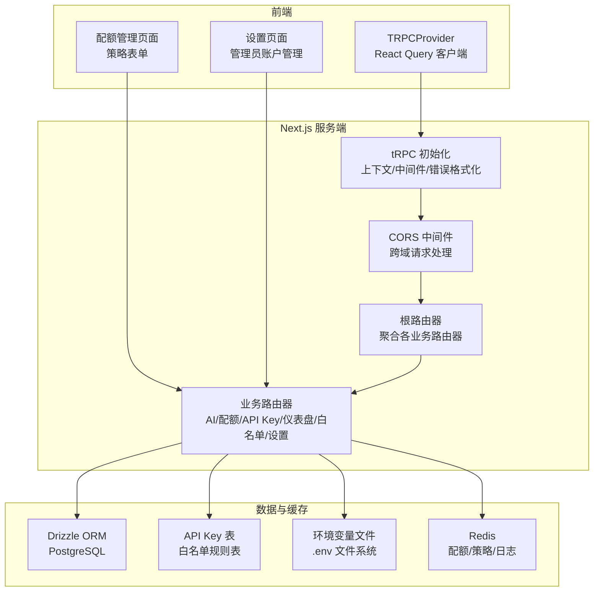
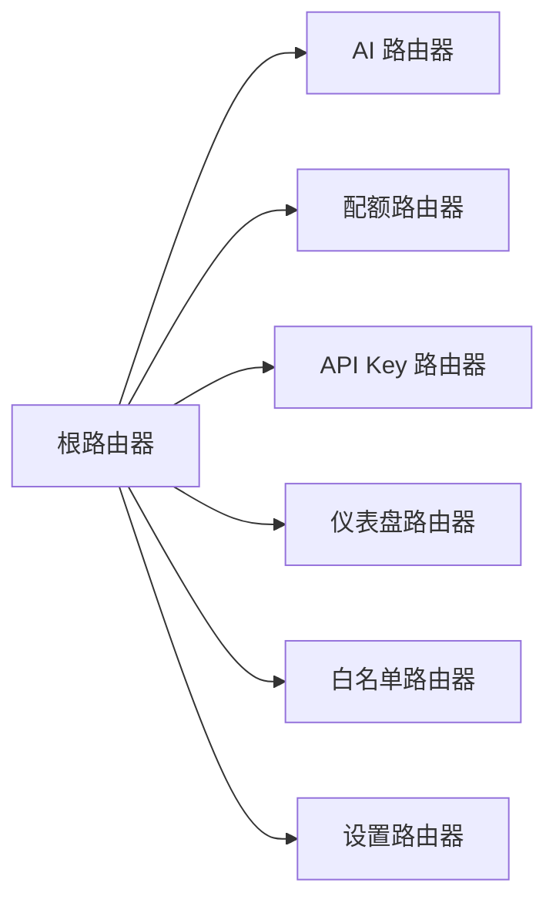
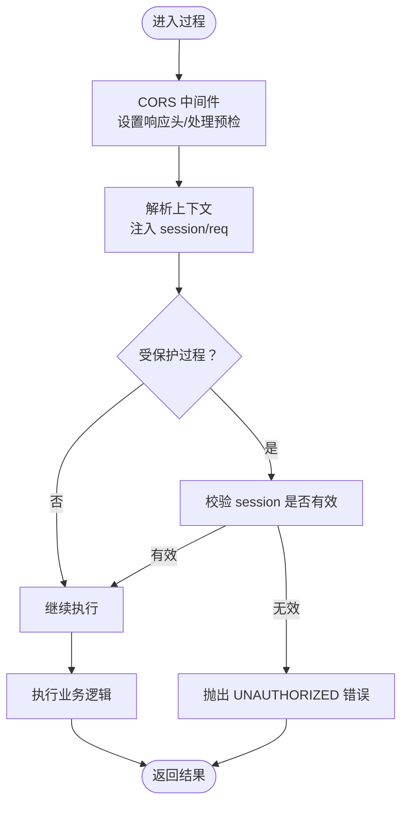
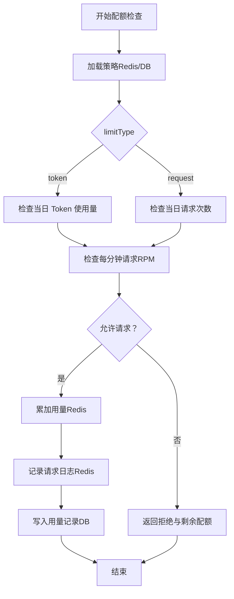
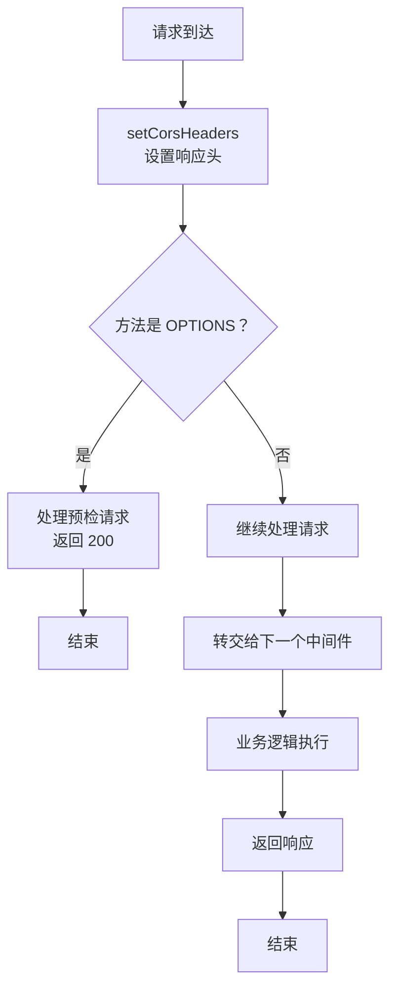
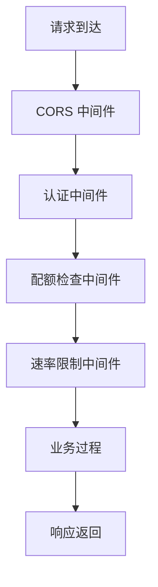
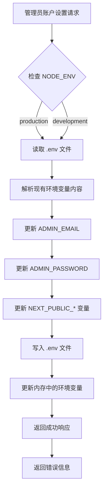
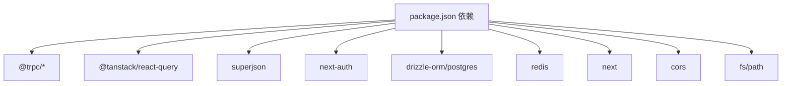

# tRPC API 系统

<cite>
**本文引用的文件**
- [package.json](file://package.json)
- [根路由定义](file://src/server/api/root.ts)
- [tRPC 初始化与上下文](file://src/server/api/trpc.ts)
- [AI 路由器](file://src/server/api/routers/ai.ts)
- [配额路由器](file://src/server/api/routers/quota.ts)
- [API Key 路由器](file://src/server/api/routers/api-key.ts)
- [仪表盘路由器](file://src/server/api/routers/dashboard.ts)
- [白名单路由器](file://src/server/api/routers/whitelist.ts)
- [设置路由器](file://src/server/api/routers/settings.ts)
- [配额逻辑](file://src/lib/quota.ts)
- [数据库抽象层](file://src/lib/database.ts)
- [Redis 客户端与键命名](file://src/lib/redis.ts)
- [tRPC 客户端提供者](file://src/components/trpc-provider.tsx)
- [CORS 中间件](file://src/lib/cors.ts)
- [tRPC API 处理器](file://src/pages/api/trpc/[trpc].ts)
- [AI 流式聊天处理器](file://src/pages/api/ai/chat/stream.ts)
- [认证配置](file://src/auth.ts)
- [Next.js 配置](file://next.config.ts)
- [API Key 类型定义](file://src/types/api-key.ts)
- [配额页面](file://src/app/(dashboard)/quotas/page.tsx)
- [配额策略表单](file://src/app/(dashboard)/quotas/components/policy-form.tsx)
- [设置页面](file://src/app/settings/page.tsx)
- [仪表盘布局](file://src/components/dashboard-layout.tsx)
- [部署脚本](file://deploy.sh)
- [Dockerfile](file://Dockerfile)
</cite>

## 更新摘要
**所做更改**
- 更新设置路由器章节，反映生产环境限制的移除
- 修正环境变量更新功能描述，移除生产环境限制说明
- 更新安全验证机制章节，反映生产环境直接修改 .env 文件的能力
- 补充生产环境部署的安全配置建议

## 目录
1. [简介](#简介)
2. [项目结构](#项目结构)
3. [核心组件](#核心组件)
4. [架构总览](#架构总览)
5. [详细组件分析](#详细组件分析)
6. [CORS 中间件集成](#cors-中间件集成)
7. [API 安全性增强](#api-安全性增强)
8. [设置路由器与管理员账户管理](#设置路由器与管理员账户管理)
9. [环境变量更新功能](#环境变量更新功能)
10. [安全验证机制](#安全验证机制)
11. [部署与配置管理](#部署与配置管理)
12. [依赖关系分析](#依赖关系分析)
13. [性能考虑](#性能考虑)
14. [故障排查指南](#故障排查指南)
15. [结论](#结论)
16. [附录](#附录)

## 简介
本文件面向 AIGate 的 tRPC API 系统，系统采用 Next.js 16 与 tRPC 10 实现类型安全的后端 API，并通过 React Query 在前端进行缓存与并发控制。系统围绕"路由器"组织业务模块，结合"中间件"实现认证与速率限制，配合"错误处理"策略保障稳定性。**最新更新**集成了 CORS 中间件以支持跨域请求，增强了 API 安全性，通过 Redis 实现高性能配额与缓存，Drizzle ORM 进行数据库访问抽象，形成前后端一体化的类型驱动开发体验。**新增**设置路由器功能，提供管理员账户管理、环境变量更新和安全验证机制，支持完整的系统配置管理。

## 项目结构
- 后端入口与路由器组织
  - 根路由集中导出各业务子路由，统一挂载在应用级路由器上。
  - 各业务路由器位于独立文件，职责清晰，便于扩展与维护。
  - **新增** 设置路由器：提供管理员账户管理和环境变量更新功能。
- tRPC 初始化
  - 统一初始化上下文、中间件与错误格式化，确保全局一致性。
- **新增** CORS 中间件
  - 统一处理跨域请求，支持预检请求和响应头设置。
- 前端集成
  - 通过客户端提供者注入 tRPC React Query 客户端，自动代码生成与类型推断贯穿全栈。
  - **新增** 设置页面：提供管理员账户信息修改界面。
- 数据与缓存
  - Redis 用于配额、策略与短期日志缓存；数据库通过 Drizzle ORM 抽象，提供稳定的数据访问层。
- **新增** 管理员账户管理
  - 完整的管理员账户生命周期管理，支持邮箱和密码的动态更新。
  - 与环境变量的集成，支持运行时配置管理。



**图表来源**
- [tRPC 初始化与上下文](file://src/server/api/trpc.ts#L1-L153)
- [CORS 中间件](file://src/lib/cors.ts#L1-L54)
- [根路由定义](file://src/server/api/root.ts#L1-L25)
- [设置路由器](file://src/server/api/routers/settings.ts#L1-L121)
- [设置页面](file://src/app/settings/page.tsx#L1-L148)
- [认证配置](file://src/auth.ts#L1-L98)

**章节来源**
- [package.json](file://package.json#L1-L85)
- [根路由定义](file://src/server/api/root.ts#L1-L25)
- [tRPC 初始化与上下文](file://src/server/api/trpc.ts#L1-L153)
- [CORS 中间件](file://src/lib/cors.ts#L1-L54)
- [tRPC 客户端提供者](file://src/components/trpc-provider.tsx#L1-L64)

## 核心组件
- 应用路由器
  - 聚合 AI、配额、API Key、仪表盘、白名单、**新增**设置等子路由，统一暴露给 tRPC 端点。
- tRPC 初始化
  - 上下文：基于 NextAuth 会话注入到每个请求。
  - 中间件：公共过程、受保护过程（认证）、速率限制过程占位。
  - 错误格式化：Zod 错误扁平化，便于前端展示。
- **新增** CORS 中间件
  - 统一设置 CORS 响应头，处理 OPTIONS 预检请求。
  - 支持跨域请求、认证凭据和预检缓存。
- 前端客户端
  - React Query 客户端，批量链接、日志链路、超时与重试策略。
  - 自动代码生成与类型推断，保证前后端一致。
- **新增** 设置页面
  - 提供管理员账户信息修改界面，支持邮箱和密码的实时验证。
  - 集成 tRPC 客户端，实现类型安全的 API 调用。

**章节来源**
- [根路由定义](file://src/server/api/root.ts#L1-L25)
- [tRPC 初始化与上下文](file://src/server/api/trpc.ts#L1-L153)
- [CORS 中间件](file://src/lib/cors.ts#L1-L54)
- [tRPC 客户端提供者](file://src/components/trpc-provider.tsx#L1-L64)

## 架构总览
tRPC 在本项目中采用"服务端初始化 + 客户端集成 + CORS 中间件"的模式：
- 服务端：initTRPC + 上下文 + 中间件 + CORS 中间件 + 路由器 + 数据/缓存层。
- 客户端：createTRPCReact + QueryClient + httpBatchLink + loggerLink。
- 类型安全：通过 AppRouter 类型在服务端与客户端共享，实现端到端类型推断。
- **新增** CORS 支持：统一处理跨域请求，确保外部客户端能够正常访问 API。
- **新增** 设置功能：通过设置路由器提供管理员账户管理和环境变量更新能力。

```mermaid
sequenceDiagram
participant FE as "前端组件"
participant TPRC as "tRPC 客户端"
participant LINK as "httpBatchLink"
participant CORS as "CORS 中间件"
participant SRV as "tRPC 服务器"
participant CTX as "上下文/中间件"
participant SET as "设置路由器"
participant ENV as "环境变量文件"
FE->>TPRC : 调用设置API更新管理员账户
TPRC->>LINK : 发送批处理请求
LINK->>CORS : HTTP 请求 /api/trpc
CORS->>CORS : 处理 OPTIONS 预检请求
CORS->>SRV : 转发实际请求
SRV->>CTX : 解析上下文/执行中间件
CTX->>SET : 调用受保护过程
SET->>ENV : 更新 .env 文件和内存变量
ENV-->>SET : 返回更新结果
SET-->>CTX : 格式化响应
CTX-->>SRV : 返回数据
SRV-->>CORS : 设置 CORS 头并返回
CORS-->>TPRC : 返回响应
TPRC-->>FE : 触发 React Query 缓存更新
```

**图表来源**
- [tRPC 客户端提供者](file://src/components/trpc-provider.tsx#L1-L64)
- [tRPC API 处理器](file://src/pages/api/trpc/[trpc].ts#L1-L28)
- [CORS 中间件](file://src/lib/cors.ts#L36-L53)
- [设置路由器](file://src/server/api/routers/settings.ts#L15-L112)
- [设置页面](file://src/app/settings/page.tsx#L23-L34)

## 详细组件分析

### 路由器组织与职责
- 根路由器
  - 将各业务子路由注册到统一入口，便于后续扩展。
  - **新增** 设置路由器：提供管理员账户管理功能。
- 业务路由器
  - AI：聊天补全、模型列表、Token 估算。
  - 配额：策略查询/设置/创建/更新/删除、用量查询、配额检查、重置。
  - API Key：增删改查、状态切换、有效性测试、使用统计。
  - 仪表盘：总览统计、最近活动、使用趋势、地区分布、IP 请求、模型分布。
  - 白名单：规则 CRUD、状态切换、统计、邮箱策略匹配。
  - **新增** 设置：管理员账户信息查询和更新。



**图表来源**
- [根路由定义](file://src/server/api/root.ts#L1-L25)
- [设置路由器](file://src/server/api/routers/settings.ts#L1-L121)

**章节来源**
- [根路由定义](file://src/server/api/root.ts#L1-L25)
- [设置路由器](file://src/server/api/routers/settings.ts#L1-L121)

### 中间件与上下文
- 上下文
  - 基于 NextAuth 会话，为每个请求注入 session 与 req 对象，供过程使用。
- **更新** 中间件链
  - corsMiddleware：首先处理 CORS 请求，设置响应头并处理 OPTIONS 预检。
  - publicProcedure：公开过程，可访问会话数据。
  - protectedProcedure：认证中间件，校验 session 是否有效。
  - rateLimitedProcedure：速率限制占位，未来可接入配额与限流逻辑。
- 错误格式化
  - 将 Zod 错误扁平化，便于前端展示字段级错误。



**图表来源**
- [tRPC 初始化与上下文](file://src/server/api/trpc.ts#L1-L153)
- [CORS 中间件](file://src/lib/cors.ts#L36-L53)

**章节来源**
- [tRPC 初始化与上下文](file://src/server/api/trpc.ts#L1-L153)
- [CORS 中间件](file://src/lib/cors.ts#L1-L54)

### 错误处理策略
- 统一错误格式化
  - 将 Zod 错误扁平化，保留字段级信息。
- 业务错误
  - 使用 TRPCError 指定标准错误码（如 UNAUTHORIZED/FORBIDDEN/BAD_REQUEST/TOO_MANY_REQUESTS/INTERNAL_SERVER_ERROR）。
- 异常捕获
  - 业务过程内对非 TRPCError 的异常进行包装，避免泄露内部细节。
- **新增** CORS 错误处理
  - CORS 中间件统一处理跨域相关的错误和预检请求。
- **新增** 设置功能错误处理
  - 环境变量文件读写错误的统一处理
  - 生产环境安全限制的错误提示

**章节来源**
- [tRPC 初始化与上下文](file://src/server/api/trpc.ts#L73-L84)
- [设置路由器](file://src/server/api/routers/settings.ts#L18-L23)
- [CORS 中间件](file://src/lib/cors.ts#L42-L53)

### tRPC 与 Next.js 集成
- 客户端
  - createTRPCReact + QueryClientProvider 注入全局。
  - httpBatchLink 批量请求提升吞吐，loggerLink 开发环境可观测。
  - transformer 使用 superjson，支持复杂类型序列化。
- 服务端
  - Next adapter 集成，上下文基于 Next.js 请求/响应对象。
  - **更新** CORS 中间件集成，确保跨域请求正常工作。
- 类型安全
  - AppRouter 在服务端导出，前端导入后自动生成强类型客户端 API。

```mermaid
sequenceDiagram
participant App as "Next.js 页面"
participant Provider as "TRPCProvider"
participant Client as "createTRPCReact"
participant Link as "httpBatchLink"
participant CORS as "CORS 中间件"
participant API as "tRPC 服务器"
App->>Provider : 包裹应用
Provider->>Client : 创建客户端
Client->>Link : 配置批处理与日志
App->>Client : 调用 typed 查询/变更
Client->>CORS : 发送 /api/trpc 请求
CORS->>API : 转发请求并设置 CORS 头
API-->>CORS : 返回类型安全响应
CORS-->>Client : 设置响应头并返回
Client-->>App : 触发 React Query 缓存更新
```

**图表来源**
- [tRPC 客户ент提供者](file://src/components/trpc-provider.tsx#L1-L64)
- [tRPC API 处理器](file://src/pages/api/trpc/[trpc].ts#L1-L28)
- [CORS 中间件](file://src/lib/cors.ts#L36-L53)
- [根路由定义](file://src/server/api/root.ts#L21-L25)

**章节来源**
- [tRPC 客户端提供者](file://src/components/trpc-provider.tsx#L1-L64)
- [tRPC API 处理器](file://src/pages/api/trpc/[trpc].ts#L1-L28)
- [根路由定义](file://src/server/api/root.ts#L21-L25)

### 完整 API 路由器实现示例（要点）
- AI 接口
  - 输入：用户 ID、API Key ID、请求体（含模型、消息、stream 标记）。
  - 流程：白名单校验 → API Key 校验与提供商解析 → Token 估算 → 配额检查 → 请求转发 → 记录用量 → 返回响应与元数据。
  - 注意：stream 模式应走专用端点，非 stream 模式返回完整响应。
- **更新** 配额接口
  - 查询策略、用量、检查配额、重置配额。
  - 支持按 token 或请求次数两种模式，内置 RPM 限制。
  - **新增** API Key ID 参数支持，实现精确的配额控制。
- API Key 接口
  - 增删改查、状态切换、有效性测试、使用统计。
  - 提供前后端大小写映射与 Redis 缓存。
- 仪表盘接口
  - 新增用户、请求数、Token 消耗、活跃用户等指标与趋势。
- 白名单接口
  - 规则 CRUD、状态切换、统计、邮箱策略匹配与校验。
- **新增** 设置接口
  - 管理员账户信息查询：获取当前管理员邮箱信息。
  - 管理员账户更新：在开发环境更新 .env 文件和内存中的管理员凭据。
  - 环境变量同步：同时更新 ADMIN_EMAIL、ADMIN_PASSWORD 和 NEXT_PUBLIC_* 前缀变量。

**章节来源**
- [AI 路由器](file://src/server/api/routers/ai.ts#L85-L193)
- [配额路由器](file://src/server/api/routers/quota.ts#L31-L172)
- [API Key 路由器](file://src/server/api/routers/api-key.ts#L84-L144)
- [仪表盘路由器](file://src/server/api/routers/dashboard.ts#L7-L133)
- [白名单路由器](file://src/server/api/routers/whitelist.ts#L19-L61)
- [设置路由器](file://src/server/api/routers/settings.ts#L15-L120)

### 配额与缓存策略
- 策略匹配
  - 通过白名单规则匹配用户策略，支持正则校验；未匹配使用默认策略。
  - **新增** API Key 优先匹配机制，优先使用 API Key ID 进行策略查找。
- Redis 缓存
  - 策略缓存（1 小时）、API Key 缓存（1 小时）、当日用量（7 天过期）、每分钟请求（2 分钟过期）、请求日志（24 小时过期）。
- 用量记录
  - 根据 limitType（token/request）分别累加；同时记录详细用量到数据库。
- 清理策略
  - 更新/删除策略时扫描清理相关缓存键，保证一致性。



**图表来源**
- [配额逻辑](file://src/lib/quota.ts#L74-L190)
- [数据库抽象层](file://src/lib/database.ts#L142-L277)
- [Redis 客户端与键命名](file://src/lib/redis.ts#L18-L49)

**章节来源**
- [配额逻辑](file://src/lib/quota.ts#L1-L386)
- [数据库抽象层](file://src/lib/database.ts#L1-L582)
- [Redis 客户端与键命名](file://src/lib/redis.ts#L1-L49)

### 并发处理与性能优化
- 批处理请求
  - httpBatchLink 减少网络往返，提升吞吐。
- React Query 缓存
  - 5 分钟 staleTime、1 次重试，平衡实时性与性能。
- Redis 原子操作
  - incr/incrBy/expire 等原子命令，降低竞争条件。
- 数据库查询
  - 使用事务与批量查询（Promise.all）减少延迟。
- 日志与可观测性
  - loggerLink 仅在开发或错误时输出，避免生产开销。
- **新增** 设置功能性能优化
  - 环境变量文件读写使用同步操作，避免并发冲突。
  - 内存变量更新仅在开发环境生效，生产环境通过重启容器加载。

**章节来源**
- [tRPC 客户端提供者](file://src/components/trpc-provider.tsx#L25-L54)
- [配额逻辑](file://src/lib/quota.ts#L192-L255)
- [仪表盘路由器](file://src/server/api/routers/dashboard.ts#L33-L78)

### 客户端调用示例与调试
- 客户端调用
  - 使用 createTRPCReact 导出的方法，自动获得类型推断。
  - 查询/变更方法在编译期绑定 AppRouter 类型，运行期类型安全。
- 错误处理模式
  - 前端通过 TRPCError.code 与 message 进行分支处理。
  - Zod 字段级错误可通过 error.data.zodError 获取。
- 调试工具
  - loggerLink 输出 down/up 链路与错误堆栈。
  - React Query DevTools 可观察缓存状态与重试行为。
- **新增** 设置功能调试
  - 设置页面提供实时验证反馈。
  - 环境变量更新后的状态同步验证。

**章节来源**
- [tRPC 客户端提供者](file://src/components/trpc-provider.tsx#L43-L51)
- [tRPC 初始化与上下文](file://src/server/api/trpc.ts#L75-L83)

### API 版本管理与向后兼容
- 版本策略
  - 通过路由器命名空间区分版本（如 v1、v2），或在路径中体现（需调整 Next.js 路由）。
- 向后兼容
  - 旧方法保留并标注弃用，提供兼容函数，逐步迁移。
  - 数据库 schema 迁移与缓存键前缀升级，避免冲突。
- 文档与契约
  - 通过 AppRouter 类型生成 API 文档，约束变更范围。
- **新增** 设置功能版本管理
  - 管理员账户设置 API 保持向后兼容性。
  - 环境变量更新功能在生产环境也支持直接修改。

**章节来源**
- [配额逻辑](file://src/lib/quota.ts#L307-L340)

## CORS 中间件集成

### CORS 中间件设计
**新增** CORS 中间件为整个 API 系统提供了跨域支持，确保外部客户端能够正常访问 tRPC 和其他 API 端点。

- **核心功能**
  - 统一设置 CORS 响应头
  - 处理 OPTIONS 预检请求
  - 支持认证凭据（Cookie）
  - 预检请求缓存优化

- **响应头配置**
  - `Access-Control-Allow-Origin`: 支持动态来源或通配符
  - `Access-Control-Allow-Methods`: 全部 HTTP 方法支持
  - `Access-Control-Allow-Headers`: 标准请求头支持
  - `Access-Control-Allow-Credentials`: 允许发送 Cookie
  - `Access-Control-Max-Age`: 24 小时预检缓存

### CORS 中间件实现
CORS 中间件通过两个主要函数实现：



**图表来源**
- [CORS 中间件](file://src/lib/cors.ts#L36-L53)

### API 端点集成
**更新** 所有 API 端点都集成了 CORS 中间件：

- **tRPC 端点** (`src/pages/api/trpc/[trpc].ts`)
  - 在请求处理前先执行 CORS 中间件
  - 正确处理 OPTIONS 预检请求
  - 保持原有的 tRPC 处理逻辑

- **流式聊天端点** (`src/pages/api/ai/chat/stream.ts`)
  - 集成 CORS 支持用于跨域流式响应
  - 维持 SSE 流式传输的完整性

**章节来源**
- [CORS 中间件](file://src/lib/cors.ts#L1-L54)
- [tRPC API 处理器](file://src/pages/api/trpc/[trpc].ts#L1-L28)
- [AI 流式聊天处理器](file://src/pages/api/ai/chat/stream.ts#L1-L172)

## API 安全性增强

### 认证与授权
**更新** 系统通过 NextAuth 实现了完整的认证和授权机制：

- **认证配置** (`src/auth.ts`)
  - 支持管理员和普通用户两种角色
  - JWT 令牌存储用户身份信息
  - 会话回调处理用户状态同步
  - **新增** 管理员账户信息从环境变量读取

- **受保护过程**
  - `protectedProcedure` 确保只有认证用户才能访问
  - 自动校验会话有效性
  - 提供用户角色和状态信息

### 安全中间件配置
**新增** 安全中间件链确保请求的安全性：



### 错误处理与安全
**更新** 错误处理策略增强了安全性：

- 统一错误格式化，隐藏内部实现细节
- TRPCError 提供标准化的错误码
- CORS 错误与业务错误分离处理
- 预检请求错误的专门处理
- **新增** 设置功能安全错误处理

### 生产环境安全建议
**更新** 生产环境部署的安全配置：

- **移除生产环境限制**
  - 环境变量文件写入不再受 NODE_ENV 限制
  - 生产环境可以直接修改 .env 文件
  - 需要确保容器具有适当的文件系统权限

- **增强认证机制**
  - 实现 API Key 验证
  - 添加 OAuth2 支持
  - 配置 CSRF 保护

- **监控与审计**
  - 记录所有 API 访问日志
  - 实施异常检测
  - 定期安全审计

**章节来源**
- [认证配置](file://src/auth.ts#L1-L98)
- [tRPC 初始化与上下文](file://src/server/api/trpc.ts#L120-L139)
- [CORS 中间件](file://src/lib/cors.ts#L10-L34)

## 设置路由器与管理员账户管理

### 设置路由器概述
**新增** 设置路由器为系统提供了管理员账户管理的核心功能，支持管理员邮箱和密码的动态更新，以及当前账户信息的查询。

- **核心功能**
  - 管理员账户信息查询：获取当前管理员邮箱信息
  - 管理员账户更新：在开发环境更新 .env 文件和内存中的管理员凭据
  - 环境变量同步：同时更新 ADMIN_EMAIL、ADMIN_PASSWORD 和 NEXT_PUBLIC_* 前缀变量

- **安全特性**
  - 仅在开发环境启用环境变量文件写入
  - 生产环境允许直接修改 .env 文件
  - 管理员凭据验证和会话管理

### 管理员账户设置 API


**图表来源**
- [设置路由器](file://src/server/api/routers/settings.ts#L15-L112)

### 管理员账户信息查询
设置路由器提供了一个查询过程来获取当前管理员账户信息：

- **getAdminAccount 过程**
  - 受保护过程，需要认证用户访问
  - 从环境变量中读取管理员邮箱信息
  - 支持 ADMIN_EMAIL 和 NEXT_PUBLIC_ADMIN_EMAIL 两种变量名
  - 默认返回 'admin@aigate.com'

**章节来源**
- [设置路由器](file://src/server/api/routers/settings.ts#L115-L119)

## 环境变量更新功能

### 环境变量更新机制
**新增** 环境变量更新功能允许在开发环境中动态修改管理员账户信息，通过直接操作 .env 文件实现配置管理。

- **更新流程**
  - 验证 NODE_ENV 是否为 development
  - 读取 .env 文件内容
  - 使用正则表达式替换或添加 ADMIN_EMAIL 和 ADMIN_PASSWORD
  - 同步更新 NEXT_PUBLIC_* 前缀的变量
  - 写入更新后的文件内容
  - 更新内存中的进程环境变量

- **安全限制**
  - **更新** 移除生产环境限制，允许在生产环境中直接修改 .env 文件
  - 文件权限错误返回 INTERNAL_SERVER_ERROR
  - 需要在容器层面确保适当的文件系统权限

### 环境变量同步策略
为了确保前端和后端的一致性，系统实现了环境变量的同步更新：

- **后端变量更新**
  - 更新 process.env 中的管理员邮箱和密码
  - 支持 NEXT_PUBLIC_ADMIN_EMAIL 和 NEXT_PUBLIC_ADMIN_PASSWORD

- **前端变量更新**
  - NEXT_PUBLIC_* 前缀的变量在构建时注入到前端
  - 开发环境下的内存更新不影响前端构建产物

**章节来源**
- [设置路由器](file://src/server/api/routers/settings.ts#L17-L95)
- [部署脚本](file://deploy.sh#L167-L170)

## 安全验证机制

### 管理员账户验证
**新增** 管理员账户验证机制确保只有正确的管理员凭据才能访问受保护的功能：

- **凭据来源**
  - 从环境变量 ADMIN_EMAIL 和 ADMIN_PASSWORD 读取
  - 支持 NEXT_PUBLIC_* 前缀的变量作为备用
  - 默认值：邮箱 'admin@aigate.com'，密码 'admin123'

- **验证流程**
  - CredentialsProvider 提供凭据验证
  - 成功验证后返回管理员用户信息
  - 设置用户角色为 'ADMIN'，状态为 'ACTIVE'

### 环境变量安全策略
**更新** 环境变量安全策略确保配置管理的安全性和一致性：

- **开发环境策略**
  - 允许通过 API 修改 .env 文件
  - 内存变量实时更新
  - 重启后配置持久化

- **生产环境策略**
  - **更新** 允许通过 API 修改 .env 文件
  - 需要确保容器具有适当的文件系统权限
  - 配置变更需要重启容器生效

### 认证回调机制
**新增** 认证回调机制确保用户会话信息的正确传递：

- **JWT 回调**
  - 将用户 ID、角色、状态存储到 JWT token
  - 支持用户信息的序列化和反序列化

- **Session 回调**
  - 将 token 中的用户信息注入到 session 对象
  - 确保前端和后端的用户状态一致

**章节来源**
- [认证配置](file://src/auth.ts#L13-L43)
- [认证配置](file://src/auth.ts#L68-L84)

## 部署与配置管理

### 部署脚本集成
**新增** 部署脚本集成了管理员账户配置功能，提供交互式的环境变量配置：

- **配置流程**
  - 读取当前环境变量值
  - 交互式收集管理员邮箱和密码
  - 更新 ADMIN_EMAIL、ADMIN_PASSWORD 和 NEXT_PUBLIC_* 变量
  - 生成必要的 NEXTAUTH_SECRET 和 NEXTAUTH_URL

- **配置验证**
  - 检查 .env 文件是否存在
  - 提供配置预览和确认机制
  - 支持配置文件的创建和更新

### 环境变量配置选项
部署脚本提供了完整的环境变量配置选项：

- **管理员配置**
  - ADMIN_EMAIL：管理员邮箱地址
  - ADMIN_PASSWORD：管理员密码
  - NEXT_PUBLIC_ADMIN_EMAIL：前端可用的管理员邮箱
  - NEXT_PUBLIC_ADMIN_PASSWORD：前端可用的管理员密码

- **系统配置**
  - DATABASE_URL：数据库连接字符串
  - REDIS_URL：Redis 连接字符串
  - APP_PORT：应用端口号
  - NEXTAUTH_SECRET：NextAuth 秘钥
  - NEXTAUTH_URL：NextAuth 回调地址

**章节来源**
- [部署脚本](file://deploy.sh#L92-L192)

## 依赖关系分析
- 运行时依赖
  - @trpc/*：服务端/客户端/React Query 集成。
  - @tanstack/react-query：前端缓存与并发控制。
  - superjson：复杂类型序列化。
  - next-auth：会话与认证。
  - drizzle-orm/postgres：数据库 ORM。
  - redis：缓存与配额。
  - **新增** cors：CORS 中间件支持。
  - **新增** fs/path：文件系统操作支持。
- 构建与脚本
  - Next.js 16、TypeScript、ESLint/Prettier、Drizzle Kit 迁移与种子。
  - **新增** 部署脚本：提供环境变量配置和系统部署功能。



**图表来源**
- [package.json](file://package.json#L18-L62)

**章节来源**
- [package.json](file://package.json#L1-L85)

## 性能考虑
- 网络层
  - 批处理请求、合理超时与重试，避免雪崩。
  - **新增** CORS 预检缓存减少重复请求。
- 缓存层
  - Redis 短期缓存与过期策略，热点数据本地化。
  - **新增** API Key 策略缓存（1小时），减少数据库查询。
- 数据层
  - 使用索引与聚合查询，避免 N+1；批量写入用量记录。
- 前端
  - QueryClient 默认配置兼顾性能与体验；必要时开启离线缓存。
  - **新增** 设置页面使用 React Query 缓存管理员账户信息。
- **新增** CORS 性能优化
  - 预检请求缓存（24 小时）
  - 动态来源处理优化
  - 最小化响应头设置开销
- **新增** 设置功能性能优化
  - 环境变量文件读写使用同步操作，避免并发冲突
  - 内存变量更新仅在开发环境生效，生产环境通过重启容器加载
  - 文件操作使用正则表达式进行高效匹配和替换

## 故障排查指南
- 常见错误码定位
  - UNAUTHORIZED：受保护过程未通过认证。
  - FORBIDDEN：白名单校验失败或生产环境禁止修改配置。
  - BAD_REQUEST：输入参数错误或不支持的提供商/模型。
  - TOO_MANY_REQUESTS：配额不足或 RPM 超限。
  - INTERNAL_SERVER_ERROR：服务端异常，查看日志。
  - **新增** CORS 错误
    - 405 Method not allowed：CORS 中间件未正确处理
    - CORS 头缺失：预检请求未正确响应
  - **新增** 设置功能错误
    - 环境变量文件读取失败：检查 .env 文件权限
    - 环境变量文件写入失败：检查文件写入权限
    - 生产环境配置错误：检查 NODE_ENV 环境变量
- 排查步骤
  - 检查 NextAuth 会话是否正确注入上下文。
  - 核对 CORS 中间件是否在所有端点正确集成。
  - 验证 Redis 连接与键命名是否一致。
  - 查看 Drizzle ORM SQL 与索引是否合理。
  - 使用 loggerLink 与 React Query DevTools 定位问题。
  - **新增** 验证 .env 文件权限和内容格式
  - **新增** 检查 NODE_ENV 环境变量配置
  - **新增** 验证管理员账户凭据的有效性

**章节来源**
- [tRPC 初始化与上下文](file://src/server/api/trpc.ts#L117-L128)
- [设置路由器](file://src/server/api/routers/settings.ts#L18-L23)
- [CORS 中间件](file://src/lib/cors.ts#L42-L53)

## 结论
AIGate 的 tRPC API 系统通过清晰的路由器组织、完善的中间件与错误处理、以及高效的 Redis/数据库配合，实现了类型安全、可扩展且高性能的后端 API。**最新更新**集成了 CORS 中间件，显著提升了系统的跨域支持能力，同时通过增强的认证和授权机制进一步加强了 API 安全性。**新增**设置路由器功能，提供了完整的管理员账户管理能力，包括环境变量更新、安全验证和部署配置管理。**更新**生产环境限制的移除使得系统在生产环境中也能直接修改 .env 文件，提高了配置管理的灵活性。该功能通过受保护的过程确保只有认证用户能够访问，通过环境变量的严格限制防止生产环境的意外配置变更。结合 React Query 的前端缓存与批处理能力，整体具备良好的开发体验与运行效率。建议持续完善速率限制与审计日志，推进 API 版本化演进与向后兼容策略，并在生产环境中实施更严格的 CORS 配置和安全措施。

## 附录
- 关键文件清单
  - 服务端：根路由、tRPC 初始化、各业务路由器。
  - **新增** 安全：CORS 中间件、认证配置、设置路由器。
  - **新增** 配置：部署脚本、环境变量管理。
  - **新增** 前端：设置页面、仪表盘布局。
  - 数据与缓存：数据库抽象层、Redis 客户端与键命名。
  - 前端：tRPC 客户端提供者、配额管理界面。
- 建议
  - 引入统一的审计日志与链路追踪。
  - 对高频查询引入只读副本与连接池优化。
  - 对外暴露的 API 增加版本号与变更通知。
  - **新增** 在生产环境配置严格的 CORS 策略。
  - **新增** 实施多层安全防护机制。
  - **新增** 定期审查管理员账户配置和访问日志。
  - **新增** 建立环境变量变更的审批流程。