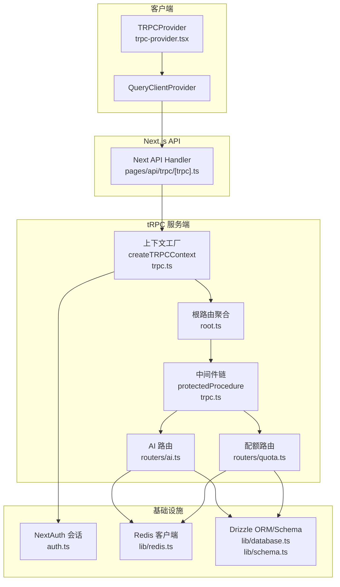
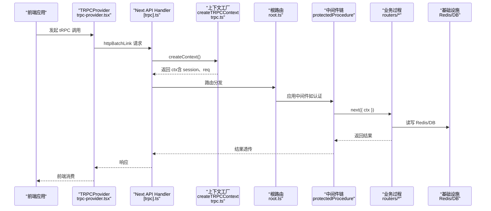
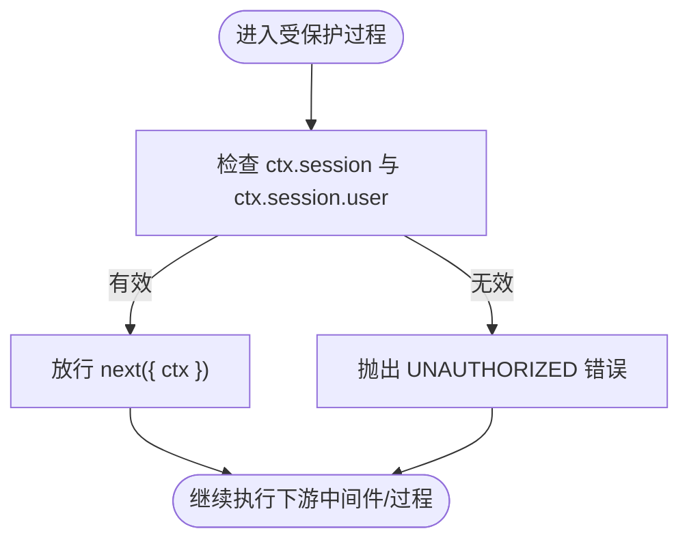
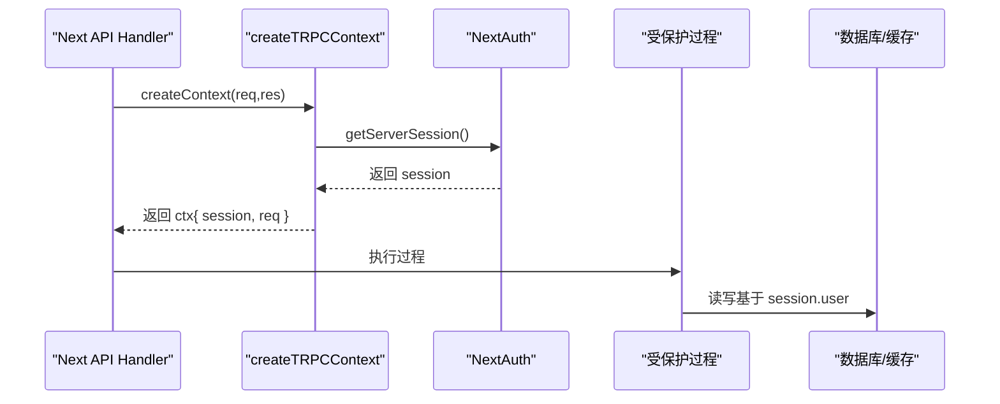
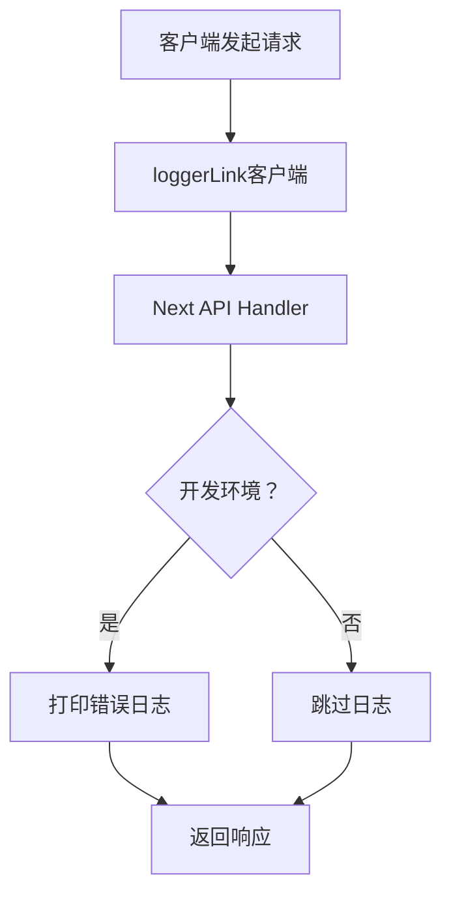
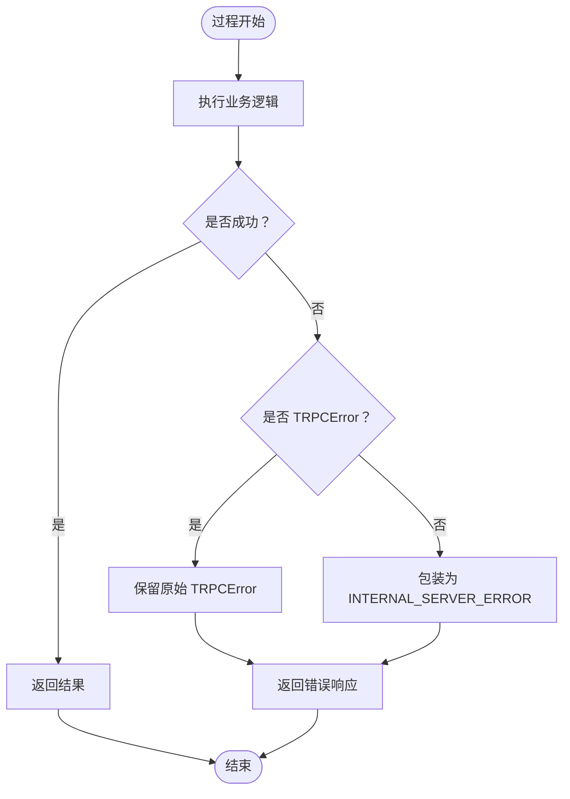
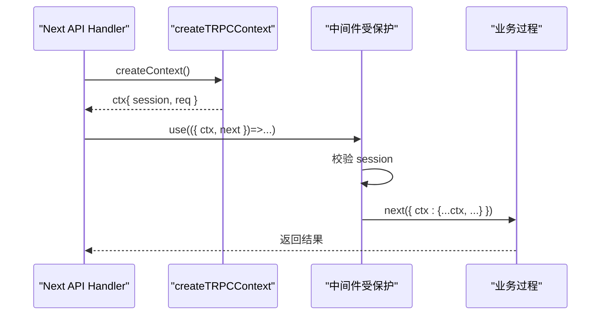
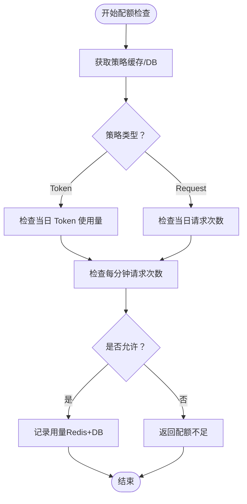
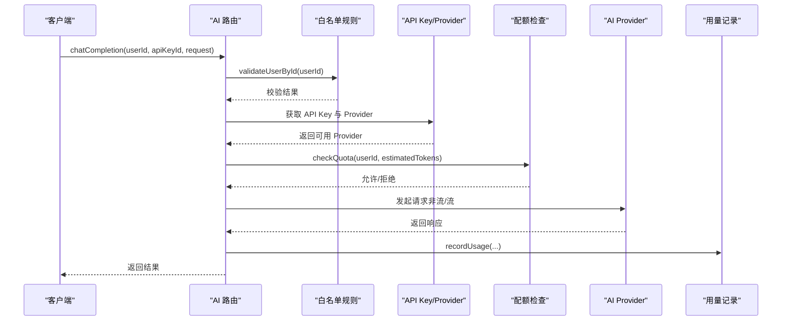
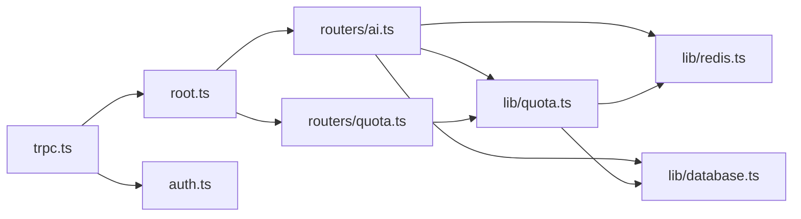

# 中间件配置与拦截器

<cite>
**本文引用的文件**
- [src/server/api/trpc.ts](file://src/server/api/trpc.ts)
- [src/server/api/root.ts](file://src/server/api/root.ts)
- [src/pages/api/trpc/[trpc].ts](file://src/pages/api/trpc/[trpc].ts)
- [src/components/trpc-provider.tsx](file://src/components/trpc-provider.tsx)
- [src/server/api/routers/ai.ts](file://src/server/api/routers/ai.ts)
- [src/server/api/routers/quota.ts](file://src/server/api/routers/quota.ts)
- [src/lib/quota.ts](file://src/lib/quota.ts)
- [src/lib/redis.ts](file://src/lib/redis.ts)
- [src/lib/database.ts](file://src/lib/database.ts)
- [src/lib/schema.ts](file://src/lib/schema.ts)
- [src/lib/types.ts](file://src/lib/types.ts)
- [src/auth.ts](file://src/auth.ts)
</cite>

## 目录
1. [简介](#简介)
2. [项目结构](#项目结构)
3. [核心组件](#核心组件)
4. [架构总览](#架构总览)
5. [详细组件分析](#详细组件分析)
6. [依赖关系分析](#依赖关系分析)
7. [性能考量](#性能考量)
8. [故障排查指南](#故障排查指南)
9. [结论](#结论)
10. [附录](#附录)

## 简介
本文件系统化梳理 tRPC 在本项目中的中间件配置与拦截器实现，重点覆盖以下方面：
- 中间件工作原理与执行顺序：认证中间件、日志中间件、错误处理中间件
- ctx（上下文）对象的构建与传递：用户身份、数据库连接、配置信息注入
- 中间件链式调用模式与异常处理策略
- 自定义中间件开发指南：业务特定中间件与复杂权限控制
- 性能优化技巧与调试方法
- 完整实现示例与最佳实践

## 项目结构
本项目采用分层与按功能模块组织的结构：
- 服务端 API 层：tRPC 初始化、上下文创建、路由聚合
- 客户端集成层：React Query + tRPC 客户端与日志链路
- 业务路由层：AI、配额、API Key、仪表盘、白名单等
- 基础设施层：Redis 缓存、Drizzle ORM、数据库模式与类型定义
- 认证层：NextAuth 配置与会话解析

图表来源
- [src/components/trpc-provider.tsx](file://src/components/trpc-provider.tsx#L1-L64)
- [src/pages/api/trpc/[trpc].ts](file://src/pages/api/trpc/[trpc].ts#L1-L16)
- [src/server/api/trpc.ts](file://src/server/api/trpc.ts#L1-L142)
- [src/server/api/root.ts](file://src/server/api/root.ts#L1-L23)
- [src/server/api/routers/ai.ts](file://src/server/api/routers/ai.ts#L1-L223)
- [src/server/api/routers/quota.ts](file://src/server/api/routers/quota.ts#L1-L301)
- [src/lib/redis.ts](file://src/lib/redis.ts#L1-L49)
- [src/lib/database.ts](file://src/lib/database.ts#L1-L524)
- [src/auth.ts](file://src/auth.ts#L1-L56)

章节来源
- [src/server/api/trpc.ts](file://src/server/api/trpc.ts#L1-L142)
- [src/server/api/root.ts](file://src/server/api/root.ts#L1-L23)
- [src/pages/api/trpc/[trpc].ts](file://src/pages/api/trpc/[trpc].ts#L1-L16)
- [src/components/trpc-provider.tsx](file://src/components/trpc-provider.tsx#L1-L64)

## 核心组件
- 上下文工厂与中间件
  - 上下文工厂负责解析 NextAuth 会话并注入到每个请求的 ctx 中，供后续中间件与过程使用
  - 提供受保护过程与公开过程，受保护过程内置认证中间件
- 根路由聚合
  - 将各业务路由统一注册到根路由，形成 API 聚合入口
- Next.js API 处理器
  - 将 tRPC 与 Next.js 适配器对接，暴露 /api/trpc 端点，并在开发环境启用错误日志
- 客户端集成
  - 使用 React Query 与 tRPC 客户端，配置日志链路与批处理链接，提升前端体验与可观测性

章节来源
- [src/server/api/trpc.ts](file://src/server/api/trpc.ts#L42-L84)
- [src/server/api/root.ts](file://src/server/api/root.ts#L13-L19)
- [src/pages/api/trpc/[trpc].ts](file://src/pages/api/trpc/[trpc].ts#L6-L15)
- [src/components/trpc-provider.tsx](file://src/components/trpc-provider.tsx#L42-L51)

## 架构总览
tRPC 在本项目的执行路径如下：
- 客户端通过 TRPCProvider 创建的客户端发起请求
- Next.js API 处理器接收请求并调用 tRPC 上下文工厂
- 上下文工厂解析 NextAuth 会话，构造 ctx
- 根据路由与过程选择中间件链（如认证中间件）
- 业务过程执行（如 AI 路由、配额路由），访问 Redis 与数据库
- 统一错误格式化与错误日志输出

图表来源
- [src/components/trpc-provider.tsx](file://src/components/trpc-provider.tsx#L38-L53)
- [src/pages/api/trpc/[trpc].ts](file://src/pages/api/trpc/[trpc].ts#L6-L15)
- [src/server/api/trpc.ts](file://src/server/api/trpc.ts#L55-L64)
- [src/server/api/root.ts](file://src/server/api/root.ts#L13-L19)
- [src/server/api/routers/ai.ts](file://src/server/api/routers/ai.ts#L95-L193)
- [src/server/api/routers/quota.ts](file://src/server/api/routers/quota.ts#L32-L170)

## 详细组件分析

### 上下文与中间件链
- 上下文构建
  - 通过上下文工厂解析 NextAuth 会话，注入 session 与原生 req 对象
  - 该 ctx 作为后续中间件与过程的共享载体
- 中间件链
  - 受保护过程内置认证中间件：若会话缺失或用户为空，抛出未授权错误
  - 公开过程默认不强制认证；可在其上叠加自定义中间件
- 错误格式化
  - 统一将 Zod 校验错误扁平化到响应体，便于前端类型安全消费

图表来源
- [src/server/api/trpc.ts](file://src/server/api/trpc.ts#L117-L128)
- [src/server/api/trpc.ts](file://src/server/api/trpc.ts#L75-L83)

章节来源
- [src/server/api/trpc.ts](file://src/server/api/trpc.ts#L42-L84)
- [src/server/api/trpc.ts](file://src/server/api/trpc.ts#L117-L128)

### 认证中间件与会话注入
- 会话来源
  - 通过 NextAuth 的 getServerSession 解析服务端会话，包含用户角色、状态等
- 注入位置
  - 上下文工厂将 session 注入 ctx，供受保护过程与业务过程使用
- 使用场景
  - 受保护过程直接基于 session.user 判断访问权限
  - 业务过程可读取 session.user.id、role 等进行细粒度控制

图表来源
- [src/server/api/trpc.ts](file://src/server/api/trpc.ts#L55-L64)
- [src/auth.ts](file://src/auth.ts#L51-L53)
- [src/server/api/routers/ai.ts](file://src/server/api/routers/ai.ts#L105-L114)

章节来源
- [src/server/api/trpc.ts](file://src/server/api/trpc.ts#L55-L64)
- [src/auth.ts](file://src/auth.ts#L1-L56)

### 日志中间件与客户端日志链
- 客户端日志链
  - 在开发环境或下行错误时启用 loggerLink，打印请求/响应与错误
- 服务端日志
  - Next.js API 处理器在开发环境打印 tRPC 失败路径与错误消息
- 建议
  - 生产环境可结合结构化日志与追踪 ID，便于问题定位

图表来源
- [src/components/trpc-provider.tsx](file://src/components/trpc-provider.tsx#L43-L47)
- [src/pages/api/trpc/[trpc].ts](file://src/pages/api/trpc/[trpc].ts#L9-L14)

章节来源
- [src/components/trpc-provider.tsx](file://src/components/trpc-provider.tsx#L42-L51)
- [src/pages/api/trpc/[trpc].ts](file://src/pages/api/trpc/[trpc].ts#L9-L14)

### 错误处理中间件与统一错误格式化
- 服务端错误格式化
  - 将 Zod 校验错误扁平化，便于前端消费
- 过程内错误
  - 业务过程抛出 TRPCError，携带语义化 code 与 message
  - 未捕获异常会被统一包装为内部错误
- 建议
  - 为常见错误定义稳定的 code 与 message 规范，便于前端分支处理

图表来源
- [src/server/api/trpc.ts](file://src/server/api/trpc.ts#L75-L83)
- [src/server/api/routers/ai.ts](file://src/server/api/routers/ai.ts#L180-L192)

章节来源
- [src/server/api/trpc.ts](file://src/server/api/trpc.ts#L75-L83)
- [src/server/api/routers/ai.ts](file://src/server/api/routers/ai.ts#L180-L192)

### ctx（上下文）对象的构建与传递
- 构建步骤
  - Next.js API 处理器调用上下文工厂
  - 上下文工厂解析 NextAuth 会话，注入 session 与 req
  - 返回的 ctx 作为中间件与过程的共享上下文
- 传递机制
  - 受保护过程内置中间件在 next({ ctx }) 中传递增强后的 ctx
  - 业务过程通过 ctx.session 与 ctx.req 获取用户与请求信息
- 可扩展点
  - 可在上下文工厂中注入数据库连接、配置对象等

图表来源
- [src/pages/api/trpc/[trpc].ts](file://src/pages/api/trpc/[trpc].ts#L6-L8)
- [src/server/api/trpc.ts](file://src/server/api/trpc.ts#L55-L64)
- [src/server/api/trpc.ts](file://src/server/api/trpc.ts#L117-L128)

章节来源
- [src/server/api/trpc.ts](file://src/server/api/trpc.ts#L42-L64)
- [src/server/api/trpc.ts](file://src/server/api/trpc.ts#L117-L128)

### 配额中间件与配额检查流程
- 配额策略匹配
  - 依据用户标识（如 userId）匹配白名单规则，再从策略表获取具体策略
  - 策略结果缓存于 Redis，降低数据库压力
- 配额检查
  - 按策略类型（Token/请求次数）与每日/每分钟限制进行检查
  - 计算剩余配额并返回检查结果
- 用量记录
  - 成功请求后记录用量，更新 Redis 计数器与数据库明细
- 流程图

图表来源
- [src/lib/quota.ts](file://src/lib/quota.ts#L14-L48)
- [src/lib/quota.ts](file://src/lib/quota.ts#L74-L190)
- [src/lib/quota.ts](file://src/lib/quota.ts#L192-L255)
- [src/lib/database.ts](file://src/lib/database.ts#L280-L295)
- [src/lib/redis.ts](file://src/lib/redis.ts#L18-L37)

章节来源
- [src/lib/quota.ts](file://src/lib/quota.ts#L14-L48)
- [src/lib/quota.ts](file://src/lib/quota.ts#L74-L190)
- [src/lib/quota.ts](file://src/lib/quota.ts#L192-L255)
- [src/lib/database.ts](file://src/lib/database.ts#L280-L295)
- [src/lib/redis.ts](file://src/lib/redis.ts#L18-L37)

### AI 路由与配额/白名单/Provider 协作
- 核心流程
  - 校验用户白名单规则与有效性
  - 校验 API Key 与 Provider 支持情况
  - 估算 Token 并检查配额
  - 执行请求（非流/流模式），记录用量并返回结果
- 异常处理
  - 明确的 TRPCError 语义化错误码
  - 未捕获异常统一包装为内部错误

图表来源
- [src/server/api/routers/ai.ts](file://src/server/api/routers/ai.ts#L95-L193)
- [src/lib/database.ts](file://src/lib/database.ts#L400-L489)
- [src/lib/quota.ts](file://src/lib/quota.ts#L74-L190)

章节来源
- [src/server/api/routers/ai.ts](file://src/server/api/routers/ai.ts#L95-L193)
- [src/lib/database.ts](file://src/lib/database.ts#L400-L489)
- [src/lib/quota.ts](file://src/lib/quota.ts#L74-L190)

### 配额路由与策略管理
- 功能概览
  - 查询用户配额信息、策略、使用情况
  - 设置/更新/删除配额策略
  - 清理策略相关缓存键
- 实现要点
  - 使用 Redis 缓存策略与用户策略映射
  - 对策略变更触发缓存清理，保证一致性

章节来源
- [src/server/api/routers/quota.ts](file://src/server/api/routers/quota.ts#L32-L170)
- [src/server/api/routers/quota.ts](file://src/server/api/routers/quota.ts#L184-L299)
- [src/lib/redis.ts](file://src/lib/redis.ts#L18-L37)

### 数据模型与类型
- 数据模型
  - 配额策略、API Key、用量记录、用户、白名单规则等
- 类型定义
  - 使用 Zod Schema 定义输入/输出类型，确保前后端一致
- 关系
  - 白名单规则与配额策略存在关联关系

章节来源
- [src/lib/schema.ts](file://src/lib/schema.ts#L28-L95)
- [src/lib/types.ts](file://src/lib/types.ts#L3-L118)

## 依赖关系分析
- 组件耦合
  - 上下文工厂与 NextAuth 强耦合，确保会话解析稳定
  - 业务过程依赖 Redis 与数据库，注意异步与错误处理
- 外部依赖
  - NextAuth：会话与用户信息
  - Redis：配额计数与缓存
  - Drizzle ORM：数据库访问
- 循环依赖
  - 当前结构未见循环导入；注意避免在中间件中引入业务过程的反向依赖

图表来源
- [src/server/api/trpc.ts](file://src/server/api/trpc.ts#L1-L142)
- [src/server/api/root.ts](file://src/server/api/root.ts#L1-L23)
- [src/server/api/routers/ai.ts](file://src/server/api/routers/ai.ts#L1-L223)
- [src/server/api/routers/quota.ts](file://src/server/api/routers/quota.ts#L1-L301)
- [src/lib/quota.ts](file://src/lib/quota.ts#L1-L334)
- [src/lib/redis.ts](file://src/lib/redis.ts#L1-L49)
- [src/lib/database.ts](file://src/lib/database.ts#L1-L524)
- [src/auth.ts](file://src/auth.ts#L1-L56)

章节来源
- [src/server/api/trpc.ts](file://src/server/api/trpc.ts#L1-L142)
- [src/server/api/root.ts](file://src/server/api/root.ts#L1-L23)
- [src/server/api/routers/ai.ts](file://src/server/api/routers/ai.ts#L1-L223)
- [src/server/api/routers/quota.ts](file://src/server/api/routers/quota.ts#L1-L301)
- [src/lib/quota.ts](file://src/lib/quota.ts#L1-L334)
- [src/lib/redis.ts](file://src/lib/redis.ts#L1-L49)
- [src/lib/database.ts](file://src/lib/database.ts#L1-L524)
- [src/auth.ts](file://src/auth.ts#L1-L56)

## 性能考量
- Redis 缓存
  - 策略与用户策略映射缓存，减少数据库查询
  - 每日/每分钟计数器设置合理过期时间，避免无限增长
- 批处理与日志
  - 客户端启用 httpBatchLink，降低网络往返
  - 开发环境启用 loggerLink，生产环境谨慎开启
- 数据库访问
  - 使用事务与批量查询（如用量统计）减少 IO
- 中间件链
  - 将昂贵操作（如配额检查）置于受保护过程之后，避免重复计算

[本节为通用指导，无需列出章节来源]

## 故障排查指南
- 常见错误与定位
  - UNAUTHORIZED：检查受保护过程是否正确解析 session
  - BAD_REQUEST/FORBIDDEN：检查白名单规则与 API Key 状态
  - TOO_MANY_REQUESTS：检查 Redis 计数器与策略配置
  - INTERNAL_SERVER_ERROR：查看服务端错误格式化与日志
- 调试建议
  - 启用开发环境错误日志与客户端 loggerLink
  - 为关键路径添加追踪 ID，串联请求生命周期
  - 对 Redis 键空间进行巡检，确认过期与计数正常

章节来源
- [src/pages/api/trpc/[trpc].ts](file://src/pages/api/trpc/[trpc].ts#L9-L14)
- [src/server/api/routers/ai.ts](file://src/server/api/routers/ai.ts#L180-L192)
- [src/server/api/trpc.ts](file://src/server/api/trpc.ts#L75-L83)

## 结论
本项目通过清晰的上下文工厂、中间件链与统一错误格式化，实现了认证、日志与错误处理的标准化。配额中间件与 Redis 缓存配合，提供了高并发下的稳定限流能力。建议在现有基础上进一步完善：
- 自定义中间件模板与规范
- 更细粒度的权限控制与审计日志
- 性能监控与告警体系
- 中间件链的可插拔与动态配置

[本节为总结性内容，无需列出章节来源]

## 附录

### 自定义中间件开发指南
- 设计原则
  - 单一职责：每个中间件只做一件事（如鉴权、限流、埋点）
  - 可组合：通过 next({ ctx }) 传递增强后的上下文
  - 可测试：将外部依赖（如 Redis、DB）抽象为可注入的依赖
- 示例思路
  - 鉴权中间件：校验 session，必要时扩展角色/资源级权限
  - 限流中间件：基于用户标识与策略检查 Redis 计数器
  - 日志中间件：记录请求摘要、耗时与错误信息
- 最佳实践
  - 在受保护过程之上叠加业务中间件，避免重复校验
  - 对昂贵操作进行缓存与降级
  - 统一错误码与消息格式，便于前端处理

[本节为概念性内容，无需列出章节来源]