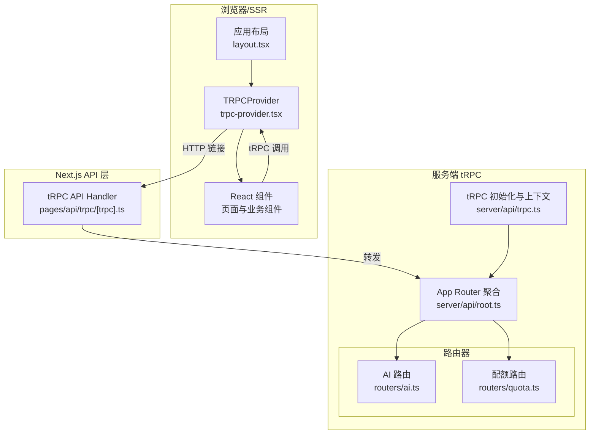
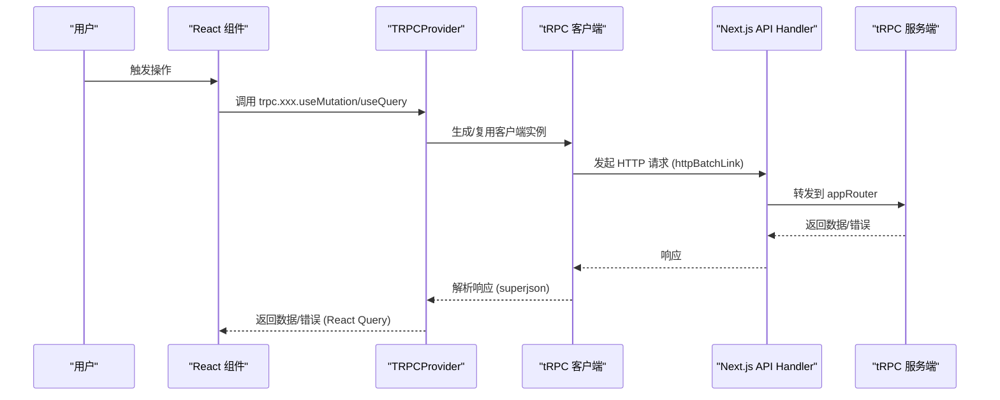
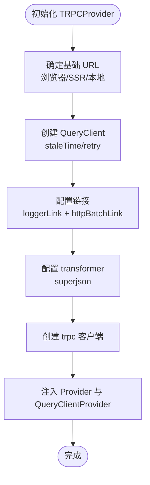
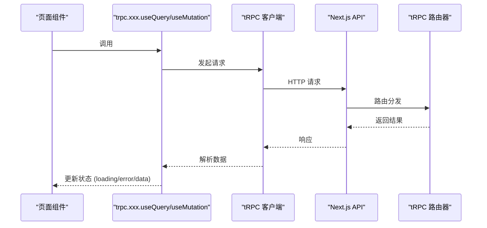
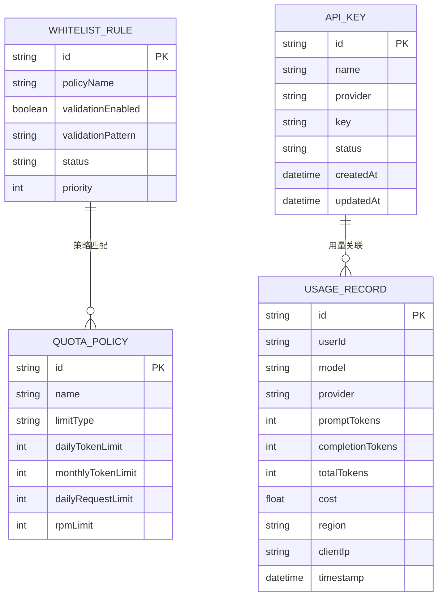
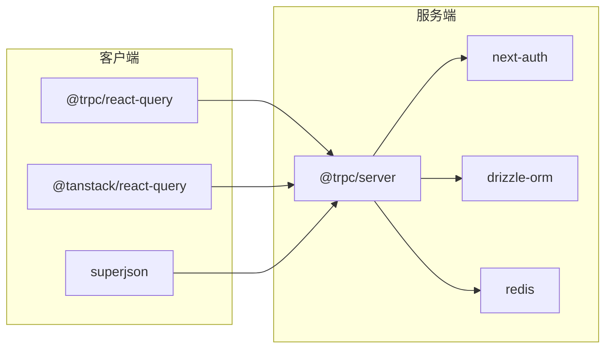

# 客户端集成与调用

<cite>
**本文引用的文件**
- [src/components/trpc-provider.tsx](file://src/components/trpc-provider.tsx)
- [src/app/layout.tsx](file://src/app/layout.tsx)
- [src/pages/api/trpc/[trpc].ts](file://src/pages/api/trpc/[trpc].ts)
- [src/server/api/trpc.ts](file://src/server/api/trpc.ts)
- [src/server/api/root.ts](file://src/server/api/root.ts)
- [src/server/api/routers/ai.ts](file://src/server/api/routers/ai.ts)
- [src/server/api/routers/quota.ts](file://src/server/api/routers/quota.ts)
- [src/app/(dashboard)/debug/page.tsx](file://src/app/(dashboard)/debug/page.tsx)
- [src/app/(dashboard)/keys/page.tsx](file://src/app/(dashboard)/keys/page.tsx)
- [src/lib/quota.ts](file://src/lib/quota.ts)
- [src/lib/database.ts](file://src/lib/database.ts)
- [src/auth.ts](file://src/auth.ts)
- [package.json](file://package.json)
</cite>

## 目录
1. [简介](#简介)
2. [项目结构](#项目结构)
3. [核心组件](#核心组件)
4. [架构总览](#架构总览)
5. [详细组件分析](#详细组件分析)
6. [依赖关系分析](#依赖关系分析)
7. [性能考量](#性能考量)
8. [故障排查指南](#故障排查指南)
9. [结论](#结论)
10. [附录](#附录)

## 简介
本文件面向希望在 Next.js 应用中集成并使用 tRPC 客户端的开发者，系统讲解 tRPC 客户端的初始化与配置、代码生成与类型推断、在 React 组件中的调用方式、缓存与重试策略、乐观更新与错误处理、与服务端的数据同步与状态管理、性能优化与调试工具使用方法，并提供在 Next.js 中的完整集成示例。

## 项目结构
本项目采用 Next.js App Router 结构，tRPC 客户端通过应用根布局注入 Provider，在页面组件中通过自动生成的 hooks 进行调用。服务端通过 Next.js API Handler 暴露 tRPC 路由，配合上下文与中间件实现认证、会话与错误格式化。

图表来源
- [src/app/layout.tsx](file://src/app/layout.tsx#L17-L29)
- [src/components/trpc-provider.tsx](file://src/components/trpc-provider.tsx#L22-L61)
- [src/pages/api/trpc/[trpc].ts](file://src/pages/api/trpc/[trpc].ts#L1-L16)
- [src/server/api/root.ts](file://src/server/api/root.ts#L1-L23)
- [src/server/api/trpc.ts](file://src/server/api/trpc.ts#L55-L84)
- [src/server/api/routers/ai.ts](file://src/server/api/routers/ai.ts#L85-L193)
- [src/server/api/routers/quota.ts](file://src/server/api/routers/quota.ts#L31-L153)

章节来源
- [src/app/layout.tsx](file://src/app/layout.tsx#L17-L29)
- [src/components/trpc-provider.tsx](file://src/components/trpc-provider.tsx#L1-L64)
- [src/pages/api/trpc/[trpc].ts](file://src/pages/api/trpc/[trpc].ts#L1-L16)
- [src/server/api/root.ts](file://src/server/api/root.ts#L1-L23)
- [src/server/api/trpc.ts](file://src/server/api/trpc.ts#L55-L84)

## 核心组件
- TRPCProvider：负责创建 tRPC 客户端、配置链接与转换器、注入 QueryClient，并通过 Provider 暴露给子组件使用。
- Next.js API Handler：将 tRPC 路由暴露为 Next.js API，统一处理上下文与错误。
- 服务端 tRPC 初始化：定义上下文、中间件、错误格式化与公共/受保护过程。
- 自动生成的 hooks：在组件中通过 trpc.xxx.useQuery/useMutation/useInfiniteQuery 等进行调用。

章节来源
- [src/components/trpc-provider.tsx](file://src/components/trpc-provider.tsx#L14-L63)
- [src/pages/api/trpc/[trpc].ts](file://src/pages/api/trpc/[trpc].ts#L1-L16)
- [src/server/api/trpc.ts](file://src/server/api/trpc.ts#L55-L142)

## 架构总览
tRPC 在本项目中的工作流如下：
- 客户端初始化：创建 TRPC 客户端，配置 transformer（superjson）、loggerLink、httpBatchLink，以及 QueryClient 的默认缓存与重试策略。
- 服务端初始化：初始化 tRPC，设置上下文（含 NextAuth 会话），错误格式化（ZodError 扁平化）。
- API Handler：将 appRouter 暴露为 Next.js API，注入 createContext 与 onError。
- 组件调用：在页面组件中使用自动生成的 hooks，自动获得类型安全、缓存、重试与错误处理。

图表来源
- [src/components/trpc-provider.tsx](file://src/components/trpc-provider.tsx#L38-L54)
- [src/pages/api/trpc/[trpc].ts](file://src/pages/api/trpc/[trpc].ts#L6-L15)
- [src/server/api/root.ts](file://src/server/api/root.ts#L13-L19)
- [src/server/api/trpc.ts](file://src/server/api/trpc.ts#L73-L84)

## 详细组件分析

### TRPCProvider 初始化与配置
- 基础 URL 设置：根据运行环境动态决定基础 URL，开发/SSR/Verce 使用不同前缀，浏览器使用相对路径。
- 超时与重试：QueryClient 默认配置了 staleTime 与 retry 次数；可按需调整。
- 链接与日志：使用 httpBatchLink 批量传输；loggerLink 在开发或 down 方向出现错误时输出日志。
- 转换器：使用 superjson 实现复杂数据类型的序列化/反序列化。
- Provider 注入：同时注入 trpc.Provider 与 QueryClientProvider，使 hooks 可用。

图表来源
- [src/components/trpc-provider.tsx](file://src/components/trpc-provider.tsx#L15-L54)

章节来源
- [src/components/trpc-provider.tsx](file://src/components/trpc-provider.tsx#L14-L63)

### 代码生成与类型推断
- 自动生成的 hooks：通过 createTRPCReact<AppRouter>() 生成类型安全的 hooks，覆盖 query/mutation/infiniteQuery 等。
- 类型安全：AppRouter 的类型定义来自 server/api/root.ts，确保前端与后端一致。
- 在组件中使用：例如在调试页使用 trpc.ai.chatCompletion.useMutation 与 trpc.ai.getSupportedModels.useQuery。

章节来源
- [src/components/trpc-provider.tsx](file://src/components/trpc-provider.tsx#L14-L14)
- [src/server/api/root.ts](file://src/server/api/root.ts#L21-L23)
- [src/app/(dashboard)/debug/page.tsx](file://src/app/(dashboard)/debug/page.tsx#L15-L24)

### 在 React 组件中使用 tRPC
- 查询与变更：使用 useQuery/useMutation/useInfiniteQuery 等 hooks，自动具备 loading/error/data 状态。
- 乐观更新：可通过 mutation 的 optimisticData 与 setQueryData 进行手动乐观更新（需结合 React Query 的缓存策略）。
- 错误处理：hooks 返回 error 对象，可在组件中渲染友好提示；服务端错误会被格式化并透传。

图表来源
- [src/app/(dashboard)/debug/page.tsx](file://src/app/(dashboard)/debug/page.tsx#L15-L24)
- [src/app/(dashboard)/keys/page.tsx](file://src/app/(dashboard)/keys/page.tsx#L14-L19)

章节来源
- [src/app/(dashboard)/debug/page.tsx](file://src/app/(dashboard)/debug/page.tsx#L13-L314)
- [src/app/(dashboard)/keys/page.tsx](file://src/app/(dashboard)/keys/page.tsx#L12-L261)

### 缓存策略与重试机制
- QueryClient 默认缓存：staleTime 设为 5 分钟，减少重复请求；retry 为 1 次，提升弱网稳定性。
- 服务端错误格式化：将 ZodError 扁平化，便于前端展示字段级错误。
- 乐观更新：可在 mutation 中使用 setQueryData 进行局部更新，随后以服务端结果回滚或确认。

章节来源
- [src/components/trpc-provider.tsx](file://src/components/trpc-provider.tsx#L25-L36)
- [src/server/api/trpc.ts](file://src/server/api/trpc.ts#L75-L83)

### 错误处理机制
- 服务端错误：在开发环境打印错误日志；在生产环境可选择关闭或自定义处理。
- tRPC 自定义错误：通过 TRPCError 抛出标准化错误码与消息，前端可据此分支处理。
- 组件错误：hooks 的 error 字段可用于渲染错误提示与重试按钮。

章节来源
- [src/pages/api/trpc/[trpc].ts](file://src/pages/api/trpc/[trpc].ts#L9-L15)
- [src/server/api/trpc.ts](file://src/server/api/trpc.ts#L117-L128)
- [src/server/api/routers/ai.ts](file://src/server/api/routers/ai.ts#L104-L193)

### 与服务端的数据同步与状态管理
- tRPC 与 React Query：QueryClient 统一管理缓存、失效与重取；tRPC 负责数据传输与类型安全。
- 会话与认证：NextAuth 提供会话，tRPC 上下文中可访问 session，用于受保护过程。
- 白名单与配额：通过数据库与 Redis 实现策略匹配、用量记录与配额检查，服务端在过程内执行。

图表来源
- [src/lib/database.ts](file://src/lib/database.ts#L309-L428)
- [src/lib/database.ts](file://src/lib/database.ts#L82-L140)
- [src/lib/database.ts](file://src/lib/database.ts#L142-L221)

章节来源
- [src/auth.ts](file://src/auth.ts#L4-L49)
- [src/server/api/trpc.ts](file://src/server/api/trpc.ts#L55-L64)
- [src/lib/quota.ts](file://src/lib/quota.ts#L74-L190)
- [src/lib/database.ts](file://src/lib/database.ts#L400-L489)

### 客户端与服务端的数据同步机制
- 非流式调用：使用 tRPC mutation/query，自动缓存与失效。
- 流式调用：AI 路由在非流式场景使用 tRPC，流式场景使用独立 SSE API；组件中分别处理。
- 配额与用量：服务端在请求前后检查配额并记录用量，前端通过 quota 路由查询配额信息。

章节来源
- [src/server/api/routers/ai.ts](file://src/server/api/routers/ai.ts#L85-L193)
- [src/app/(dashboard)/debug/page.tsx](file://src/app/(dashboard)/debug/page.tsx#L228-L314)
- [src/server/api/routers/quota.ts](file://src/server/api/routers/quota.ts#L31-L153)

### 在 Next.js 中的完整集成示例
- 在根布局中注入 TRPCProvider，使整个应用可用 tRPC hooks。
- 在页面组件中使用 trpc.xxx.useQuery/useMutation，自动获得类型推断与缓存。
- API Handler 将 appRouter 暴露为 /api/trpc，注入 createContext 与 onError。

章节来源
- [src/app/layout.tsx](file://src/app/layout.tsx#L22-L25)
- [src/components/trpc-provider.tsx](file://src/components/trpc-provider.tsx#L56-L60)
- [src/pages/api/trpc/[trpc].ts](file://src/pages/api/trpc/[trpc].ts#L6-L15)

## 依赖关系分析
- 客户端依赖：@trpc/react-query、@tanstack/react-query、superjson。
- 服务端依赖：@trpc/server、next-auth、drizzle-orm、redis。
- Next.js 集成：Next.js API Handler 与 App Router。

图表来源
- [package.json](file://package.json#L18-L56)

章节来源
- [package.json](file://package.json#L18-L56)

## 性能考量
- 批量请求：httpBatchLink 有助于减少网络往返。
- 缓存与失效：合理设置 staleTime 与查询键，避免过度请求。
- 重试策略：在弱网环境下适当增加 retry 次数，但注意幂等性。
- 序列化：superjson 适合复杂类型，但注意仅在必要时使用，避免额外开销。
- 流式与非流式：流式场景建议使用独立 SSE 端点，避免与 tRPC 混用导致缓存复杂化。

## 故障排查指南
- 开发日志：loggerLink 在开发环境或 down 方向错误时输出日志，便于定位问题。
- API Handler 错误：开发环境打印错误堆栈；生产环境可关闭或自定义。
- tRPC 错误：使用 TRPCError 抛出自定义错误码与消息，前端可据此分支处理。
- 会话与认证：确认 NextAuth 配置与 cookies/session 正常；tRPC 上下文中可访问 session。
- 配额与用量：检查 Redis 键空间与过期时间，确认用量记录写入数据库成功。

章节来源
- [src/components/trpc-provider.tsx](file://src/components/trpc-provider.tsx#L43-L47)
- [src/pages/api/trpc/[trpc].ts](file://src/pages/api/trpc/[trpc].ts#L9-L15)
- [src/server/api/trpc.ts](file://src/server/api/trpc.ts#L117-L128)
- [src/auth.ts](file://src/auth.ts#L4-L49)

## 结论
本项目通过 TRPCProvider 将 tRPC 客户端无缝集成到 Next.js 应用中，借助 React Query 实现高效缓存与重试，配合服务端的上下文与中间件实现认证与错误格式化。组件层通过自动生成的 hooks 获得类型安全与良好体验，同时支持流式与非流式调用。通过合理的缓存策略、重试机制与错误处理，可显著提升用户体验与系统稳定性。

## 附录
- 在组件中使用示例：参考调试页与密钥管理页对 trpc.xxx.useQuery/useMutation 的使用。
- 服务端过程示例：AI 路由与配额路由展示了输入验证、配额检查、用量记录与错误处理。

章节来源
- [src/app/(dashboard)/debug/page.tsx](file://src/app/(dashboard)/debug/page.tsx#L13-L314)
- [src/app/(dashboard)/keys/page.tsx](file://src/app/(dashboard)/keys/page.tsx#L12-L261)
- [src/server/api/routers/ai.ts](file://src/server/api/routers/ai.ts#L85-L222)
- [src/server/api/routers/quota.ts](file://src/server/api/routers/quota.ts#L31-L301)