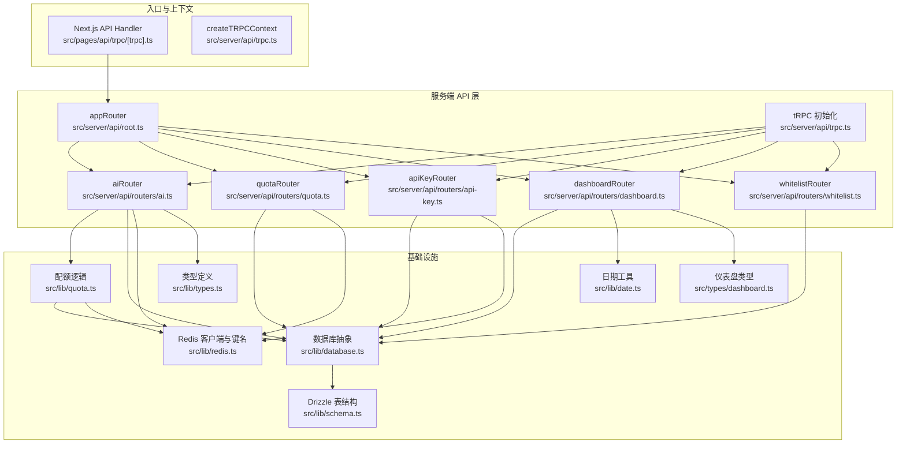
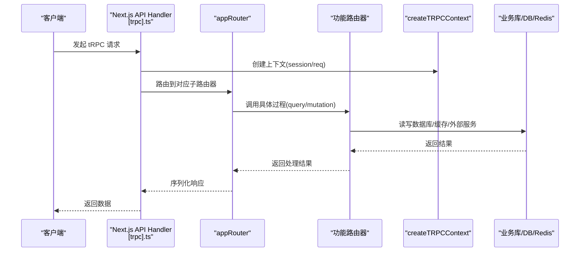
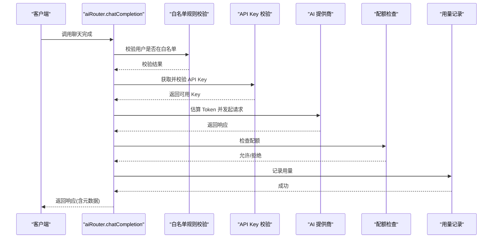
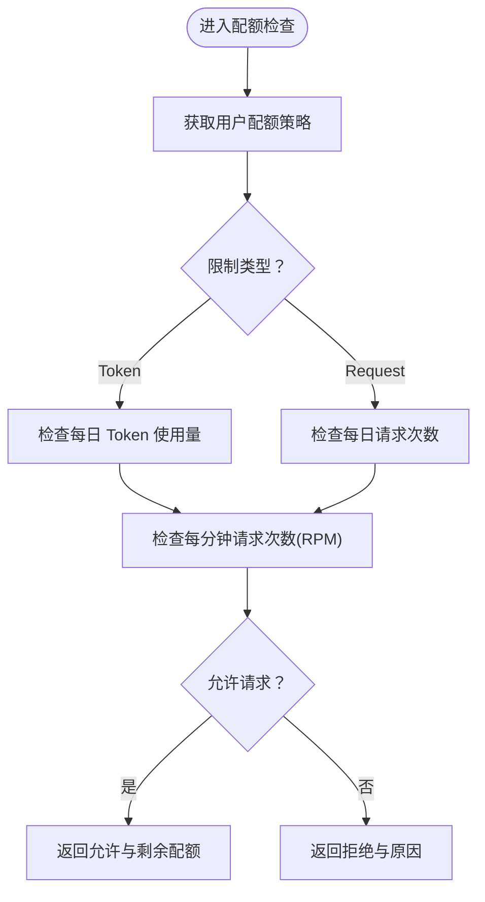
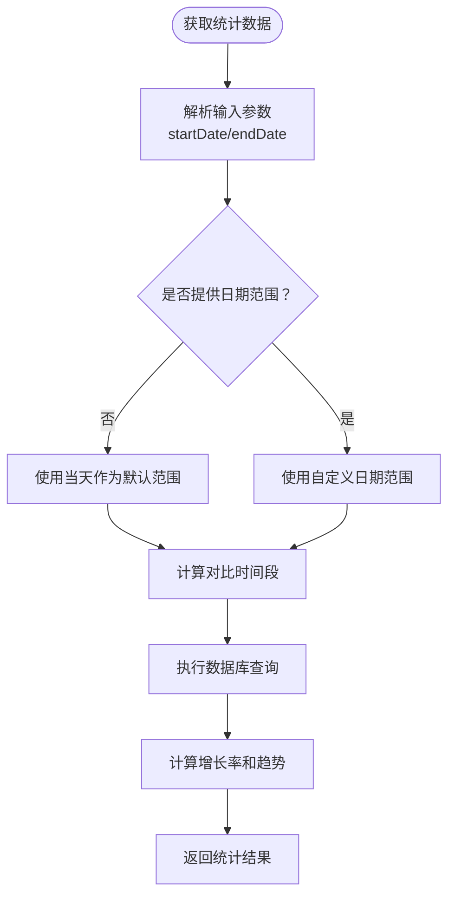
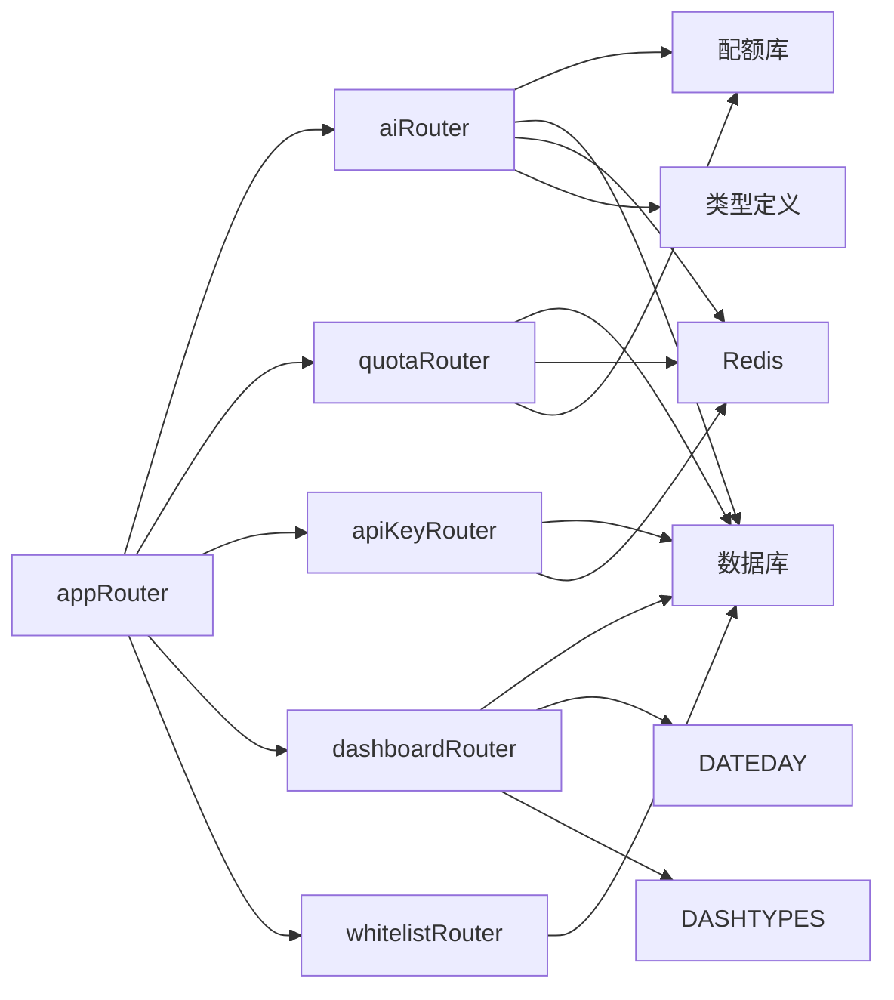

# 路由器设计与组织

<cite>
**本文档引用的文件**
- [src/server/api/root.ts](file://src/server/api/root.ts)
- [src/server/api/trpc.ts](file://src/server/api/trpc.ts)
- [src/server/api/routers/ai.ts](file://src/server/api/routers/ai.ts)
- [src/server/api/routers/quota.ts](file://src/server/api/routers/quota.ts)
- [src/server/api/routers/api-key.ts](file://src/server/api/routers/api-key.ts)
- [src/server/api/routers/dashboard.ts](file://src/server/api/routers/dashboard.ts)
- [src/server/api/routers/whitelist.ts](file://src/server/api/routers/whitelist.ts)
- [src/pages/api/trpc/[trpc].ts](file://src/pages/api/trpc/[trpc].ts)
- [src/lib/types.ts](file://src/lib/types.ts)
- [src/lib/quota.ts](file://src/lib/quota.ts)
- [src/lib/database.ts](file://src/lib/database.ts)
- [src/lib/redis.ts](file://src/lib/redis.ts)
- [src/lib/schema.ts](file://src/lib/schema.ts)
- [src/lib/date.ts](file://src/lib/date.ts)
- [src/types/dashboard.ts](file://src/types/dashboard.ts)
- [package.json](file://package.json)
</cite>

## 更新摘要
**变更内容**
- 更新了 dashboard 路由器 API 端点的增强：所有统计相关过程现在支持可选的日期范围参数
- `getStats` 过程重写以支持灵活的时间范围分析和比较逻辑
- 新增了对比时间段计算功能，支持同比分析
- 更新了统计接口的输入参数和返回值结构

## 目录
1. [简介](#简介)
2. [项目结构](#项目结构)
3. [核心组件](#核心组件)
4. [架构总览](#架构总览)
5. [详细组件分析](#详细组件分析)
6. [依赖关系分析](#依赖关系分析)
7. [性能考量](#性能考量)
8. [故障排查指南](#故障排查指南)
9. [结论](#结论)
10. [附录](#附录)

## 简介
本文件系统性梳理了 tRPC 路由器的设计理念与组织方式，重点围绕 appRouter 的构建、各功能路由器的职责划分、注册机制、路由前缀管理以及嵌套路由器的使用方法展开。同时，结合具体实现文件，解释 aiRouter、quotaRouter、apiKeyRouter、dashboardRouter、whitelistRouter 的功能边界与协作关系，并给出扩展新功能模块的最佳实践与代码组织模式。

**更新** 本次更新重点关注了 dashboard 路由器 API 端点的重大增强，所有统计相关过程现在支持可选的日期范围参数，`getStats` 过程重写以支持灵活的时间范围分析和对比逻辑。

## 项目结构
本项目采用按"功能域"划分的路由器组织方式：
- 根路由器 appRouter 在根目录集中注册各功能子路由器
- 各功能路由器位于独立文件，职责单一，便于维护与扩展
- tRPC 核心在统一的初始化文件中完成上下文、中间件与过程封装
- API 入口通过 Next.js API Handler 暴露给前端

**图表来源**
- [src/server/api/root.ts](file://src/server/api/root.ts#L1-L25)
- [src/server/api/trpc.ts](file://src/server/api/trpc.ts#L1-L153)
- [src/server/api/routers/ai.ts](file://src/server/api/routers/ai.ts#L1-L271)
- [src/server/api/routers/quota.ts](file://src/server/api/routers/quota.ts#L1-L322)
- [src/server/api/routers/api-key.ts](file://src/server/api/routers/api-key.ts#L1-L462)
- [src/server/api/routers/dashboard.ts](file://src/server/api/routers/dashboard.ts#L1-L454)
- [src/server/api/routers/whitelist.ts](file://src/server/api/routers/whitelist.ts#L1-L189)
- [src/pages/api/trpc/[trpc].ts](file://src/pages/api/trpc/[trpc].ts#L1-L16)
- [src/lib/types.ts](file://src/lib/types.ts#L1-L118)
- [src/lib/quota.ts](file://src/lib/quota.ts#L1-L340)
- [src/lib/database.ts](file://src/lib/database.ts#L1-L692)
- [src/lib/redis.ts](file://src/lib/redis.ts#L1-L49)
- [src/lib/schema.ts](file://src/lib/schema.ts#L1-L159)
- [src/lib/date.ts](file://src/lib/date.ts#L1-L13)
- [src/types/dashboard.ts](file://src/types/dashboard.ts#L1-L48)

**章节来源**
- [src/server/api/root.ts](file://src/server/api/root.ts#L1-L25)
- [src/server/api/trpc.ts](file://src/server/api/trpc.ts#L1-L153)
- [src/pages/api/trpc/[trpc].ts](file://src/pages/api/trpc/[trpc].ts#L1-L16)

## 核心组件
- appRouter：应用级根路由器，负责将各功能路由器注册到统一命名空间下，形成清晰的 API 命名空间树
- tRPC 初始化：提供上下文创建、错误格式化、公共/受保护过程等通用能力
- 功能路由器：按领域拆分，每个路由器仅暴露与该领域相关的查询/变更过程
- 数据与缓存：配额与用量通过 Redis 实现高性能计数与日志，数据库通过 Drizzle ORM 统一访问

**章节来源**
- [src/server/api/root.ts](file://src/server/api/root.ts#L1-L25)
- [src/server/api/trpc.ts](file://src/server/api/trpc.ts#L128-L153)
- [src/lib/quota.ts](file://src/lib/quota.ts#L1-L340)
- [src/lib/database.ts](file://src/lib/database.ts#L1-L692)
- [src/lib/redis.ts](file://src/lib/redis.ts#L1-L49)

## 架构总览
tRPC 路由器采用"根注册 + 功能拆分"的组织方式，配合统一上下文与中间件，形成清晰的 API 命名空间与数据流路径。

**图表来源**
- [src/pages/api/trpc/[trpc].ts](file://src/pages/api/trpc/[trpc].ts#L1-L16)
- [src/server/api/root.ts](file://src/server/api/root.ts#L1-L25)
- [src/server/api/trpc.ts](file://src/server/api/trpc.ts#L65-L75)

## 详细组件分析

### appRouter 注册机制与命名规范
- 注册位置：根路由器集中导入并注册各功能路由器
- 命名规范：以功能语义命名，如 ai、quota、apiKey、dashboard、whitelist
- 嵌套与前缀：当前实现为扁平命名空间；若需前缀，可在子路由器内部再嵌套 createTRPCRouter 并通过父路由器挂载

**章节来源**
- [src/server/api/root.ts](file://src/server/api/root.ts#L1-L25)

### tRPC 初始化与上下文
- 上下文：基于 Next.js 会话与请求对象，注入 session 与 req
- 中间件：提供公共/受保护过程，受保护过程对会话进行校验
- 错误格式化：统一 ZodError 结构化输出，便于前端处理

**章节来源**
- [src/server/api/trpc.ts](file://src/server/api/trpc.ts#L84-L153)

### aiRouter：AI 请求处理与配额校验
职责与流程
- 接收聊天完成请求，支持非流式返回
- 校验白名单规则与 API Key 状态
- 选择对应 AI 提供商并估算 Token 消耗
- 执行配额检查，记录用量并返回带元数据的响应

关键实现要点
- 输入校验：使用 Zod Schema 对请求体进行严格校验
- 白名单校验：通过数据库层的规则匹配与校验
- 配额检查：调用配额库进行 Token/请求次数与 RPM 限制检查
- 用量记录：将实际用量写入 Redis 并持久化到数据库

**图表来源**
- [src/server/api/routers/ai.ts](file://src/server/api/routers/ai.ts#L95-L193)
- [src/lib/quota.ts](file://src/lib/quota.ts#L74-L190)
- [src/lib/database.ts](file://src/lib/database.ts#L400-L489)

**章节来源**
- [src/server/api/routers/ai.ts](file://src/server/api/routers/ai.ts#L1-L271)
- [src/lib/types.ts](file://src/lib/types.ts#L48-L118)
- [src/lib/quota.ts](file://src/lib/quota.ts#L1-L340)
- [src/lib/database.ts](file://src/lib/database.ts#L1-L692)

### quotaRouter：配额策略与用量管理
职责与流程
- 查询用户配额信息、策略、用量
- 创建/更新/删除配额策略
- 检查配额与重置配额
- 清理策略相关 Redis 缓存

关键实现要点
- 策略缓存：用户策略在 Redis 中缓存，减少数据库压力
- 配额检查：支持 Token 与请求次数两种模式，含 RPM 限制
- 用量统计：提供多维度统计与趋势分析

**图表来源**
- [src/server/api/routers/quota.ts](file://src/server/api/routers/quota.ts#L135-L153)
- [src/lib/quota.ts](file://src/lib/quota.ts#L74-L190)

**章节来源**
- [src/server/api/routers/quota.ts](file://src/server/api/routers/quota.ts#L1-L322)
- [src/lib/quota.ts](file://src/lib/quota.ts#L1-L340)
- [src/lib/redis.ts](file://src/lib/redis.ts#L19-L49)

### apiKeyRouter：API Key 生命周期与测试
职责与流程
- 获取/创建/更新/删除 API Key
- 切换状态与测试有效性
- 统计使用情况与按日期范围查询

关键实现要点
- 数据映射：前后端字段转换（大小写、状态）
- 缓存同步：创建/更新/删除时同步 Redis 缓存
- 测试逻辑：针对不同提供商执行基础验证

**章节来源**
- [src/server/api/routers/api-key.ts](file://src/server/api/routers/api-key.ts#L1-L462)
- [src/lib/types.ts](file://src/lib/types.ts#L19-L45)
- [src/lib/redis.ts](file://src/lib/redis.ts#L19-L49)
- [src/lib/database.ts](file://src/lib/database.ts#L19-L80)

### dashboardRouter：仪表盘统计与可视化数据
**更新** 重大增强：所有统计相关过程现在支持可选的日期范围参数，`getStats` 过程重写以支持灵活的时间范围分析和对比逻辑。

职责与流程
- 获取总体统计与增长趋势（支持日期范围对比）
- 获取最近活动、使用趋势、地区分布、IP 请求记录、模型分布
- 支持灵活的时间范围查询和同比分析

关键实现要点
- 多维统计：使用 Drizzle ORM 进行聚合查询
- 时间窗口：按日/周/月等维度切片统计，支持自定义日期范围
- 对比分析：计算当前时间段与对比时间段的增长率
- 数据转换：将数据库结果转换为前端友好的格式

**更新** 新增的日期范围参数支持：
- `startDate`：可选的开始日期
- `endDate`：可选的结束日期
- 如果未提供日期范围，默认使用当天
- 支持灵活的时间段分析和对比

**图表来源**
- [src/server/api/routers/dashboard.ts](file://src/server/api/routers/dashboard.ts#L11-L196)
- [src/lib/database.ts](file://src/lib/database.ts#L191-L216)
- [src/lib/date.ts](file://src/lib/date.ts#L1-L13)

**章节来源**
- [src/server/api/routers/dashboard.ts](file://src/server/api/routers/dashboard.ts#L1-L454)
- [src/lib/database.ts](file://src/lib/database.ts#L191-L216)
- [src/lib/date.ts](file://src/lib/date.ts#L1-L13)
- [src/types/dashboard.ts](file://src/types/dashboard.ts#L1-L48)

### whitelistRouter：白名单规则与策略匹配
职责与流程
- 获取/创建/更新/删除白名单规则
- 切换状态与统计
- 匹配用户邮箱到策略并进行校验

关键实现要点
- 规则优先级：按优先级排序匹配
- 正则校验：可选的正则表达式校验
- 默认策略：未匹配到规则时回退到默认策略

**章节来源**
- [src/server/api/routers/whitelist.ts](file://src/server/api/routers/whitelist.ts#L1-L189)
- [src/lib/database.ts](file://src/lib/database.ts#L293-L389)

## 依赖关系分析
- appRouter 依赖：各功能路由器均通过统一的 createTRPCRouter 与过程封装
- aiRouter 依赖：配额库、数据库、Redis、类型定义
- quotaRouter 依赖：数据库、Redis、配额库
- apiKeyRouter 依赖：数据库、Redis、类型定义
- dashboardRouter 依赖：数据库、Drizzle ORM、日期工具、类型定义
- whitelistRouter 依赖：数据库

**图表来源**
- [src/server/api/root.ts](file://src/server/api/root.ts#L1-L25)
- [src/server/api/routers/ai.ts](file://src/server/api/routers/ai.ts#L1-L271)
- [src/server/api/routers/quota.ts](file://src/server/api/routers/quota.ts#L1-L322)
- [src/server/api/routers/api-key.ts](file://src/server/api/routers/api-key.ts#L1-L462)
- [src/server/api/routers/dashboard.ts](file://src/server/api/routers/dashboard.ts#L1-L454)
- [src/server/api/routers/whitelist.ts](file://src/server/api/routers/whitelist.ts#L1-L189)
- [src/lib/quota.ts](file://src/lib/quota.ts#L1-L340)
- [src/lib/database.ts](file://src/lib/database.ts#L1-L692)
- [src/lib/redis.ts](file://src/lib/redis.ts#L1-L49)
- [src/lib/types.ts](file://src/lib/types.ts#L1-L118)
- [src/lib/date.ts](file://src/lib/date.ts#L1-L13)
- [src/types/dashboard.ts](file://src/types/dashboard.ts#L1-L48)

**章节来源**
- [src/server/api/root.ts](file://src/server/api/root.ts#L1-L25)
- [src/lib/quota.ts](file://src/lib/quota.ts#L1-L340)
- [src/lib/database.ts](file://src/lib/database.ts#L1-L692)
- [src/lib/redis.ts](file://src/lib/redis.ts#L1-L49)
- [src/lib/types.ts](file://src/lib/types.ts#L1-L118)
- [src/lib/date.ts](file://src/lib/date.ts#L1-L13)
- [src/types/dashboard.ts](file://src/types/dashboard.ts#L1-L48)

## 性能考量
- Redis 缓存：策略、API Key、用量计数等均通过 Redis 缓存降低数据库压力
- 批量统计：仪表盘统计使用聚合查询，避免多次往返
- 键命名：RedisKeys 提供统一的键命名规范，便于清理与维护
- 配额检查：在内存中进行计数与限制判断，减少数据库 IO
- **日期范围优化**：新增的日期范围查询支持批量统计，减少重复计算

**更新** 新增的性能考量：
- 日期范围查询优化：支持灵活的时间段分析，避免不必要的全量查询
- 对比时间段计算：通过预计算对比时间段，提高分析效率
- 统一的日期工具：使用 `getTodayString` 确保日期格式一致性

**章节来源**
- [src/lib/redis.ts](file://src/lib/redis.ts#L19-L49)
- [src/lib/quota.ts](file://src/lib/quota.ts#L1-L340)
- [src/server/api/routers/dashboard.ts](file://src/server/api/routers/dashboard.ts#L1-L454)
- [src/lib/date.ts](file://src/lib/date.ts#L1-L13)

## 故障排查指南
常见问题与定位
- 路由器未生效：确认 appRouter 是否正确导入并注册对应子路由器
- 会话未认证：受保护过程会抛出未授权错误，检查 NextAuth 配置与会话状态
- 配额不足：检查配额策略与 Redis 计数，确认是否达到每日/每分钟限制
- API Key 无效：检查 API Key 状态与提供商映射，必要时重新测试
- 白名单未匹配：检查规则优先级与正则表达式，确认是否启用校验
- **仪表盘统计异常**：检查日期范围参数格式，确认对比时间段计算是否正确

**更新** 新增的故障排查指导：
- 日期范围参数验证：确认 `startDate` 和 `endDate` 参数格式正确且逻辑合理
- 对比时间段计算：检查日期差计算逻辑，确保对比时间段与当前时间段长度一致
- 统计结果异常：验证增长率计算公式，确认除零保护逻辑

**章节来源**
- [src/server/api/root.ts](file://src/server/api/root.ts#L1-L25)
- [src/server/api/trpc.ts](file://src/server/api/trpc.ts#L128-L139)
- [src/server/api/routers/quota.ts](file://src/server/api/routers/quota.ts#L135-L153)
- [src/server/api/routers/api-key.ts](file://src/server/api/routers/api-key.ts#L338-L407)
- [src/lib/database.ts](file://src/lib/database.ts#L400-L489)

## 结论
本项目的 tRPC 路由器设计遵循"根注册 + 功能拆分"的组织原则，通过统一的上下文与中间件确保一致的请求处理体验。各功能路由器职责明确、边界清晰，配合 Redis 与数据库的协同，实现了高并发下的配额控制与用量统计。

**更新** 本次架构增强体现了从静态统计到动态分析的演进，dashboard 路由器现在支持灵活的时间范围查询和对比分析，为用户提供更强大的数据分析能力。新增的日期范围参数和对比时间段计算功能，使得统计分析更加灵活和实用。

## 附录

### 路由器扩展最佳实践
- 新增路由器步骤
  - 在 routers 目录创建新文件，导出 createTRPCRouter 实例
  - 在根路由器中导入并注册到 appRouter
  - 如涉及配额/用量，完善配额库与 Redis 键命名
  - 如涉及数据库，补充 Drizzle 表结构与 CRUD 抽象
- 命名规范
  - 路由器文件名使用小驼峰或复数形式，如 aiRouter、quotaRouter
  - 路由器导出名称与文件名一致，便于引用
- 中间件与上下文
  - 受保护过程统一使用受保护中间件
  - 上下文注入必要的会话与请求信息
- 错误处理
  - 使用 TRPCError 返回标准化错误码与消息
  - 对外暴露的错误信息简洁明了，内部保留详细日志
- **日期范围参数设计**
  - 统一使用 `startDate` 和 `endDate` 参数名
  - 提供合理的默认值（如当天）
  - 支持灵活的时间段组合
  - 实现对比时间段自动计算逻辑

**更新** 新增了日期范围参数设计的重要指导原则。

**章节来源**
- [src/server/api/root.ts](file://src/server/api/root.ts#L1-L25)
- [src/server/api/trpc.ts](file://src/server/api/trpc.ts#L128-L153)
- [src/lib/redis.ts](file://src/lib/redis.ts#L19-L49)
- [src/lib/schema.ts](file://src/lib/schema.ts#L1-L159)
- [src/server/api/routers/dashboard.ts](file://src/server/api/routers/dashboard.ts#L11-L196)
- [src/lib/date.ts](file://src/lib/date.ts#L1-L13)