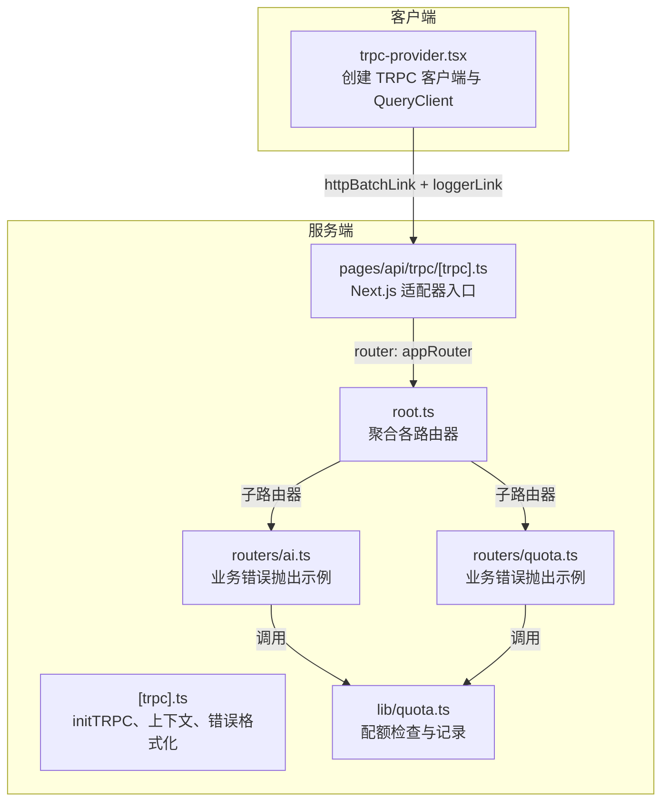
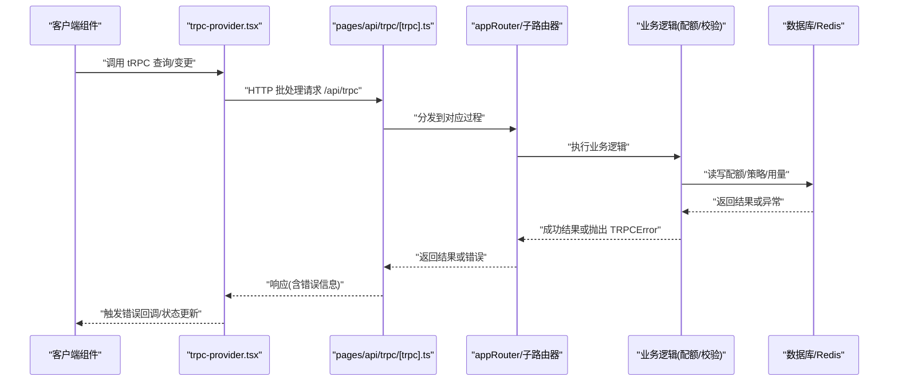
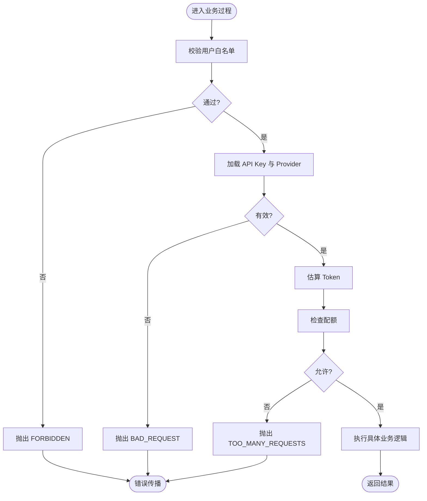
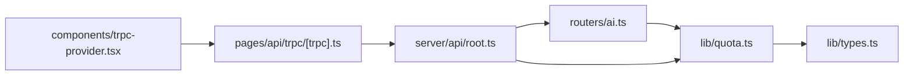

# 错误处理与异常管理

<cite>
**本文引用的文件**
- [src/server/api/trpc.ts](file://src/server/api/trpc.ts)
- [src/server/api/root.ts](file://src/server/api/root.ts)
- [src/pages/api/trpc/[trpc].ts](file://src/pages/api/trpc/[trpc].ts)
- [src/components/trpc-provider.tsx](file://src/components/trpc-provider.tsx)
- [src/server/api/routers/ai.ts](file://src/server/api/routers/ai.ts)
- [src/server/api/routers/quota.ts](file://src/server/api/routers/quota.ts)
- [src/lib/quota.ts](file://src/lib/quota.ts)
- [src/lib/types.ts](file://src/lib/types.ts)
- [src/utils/api.ts](file://src/utils/api.ts)
- [src/pages/api/ai/chat/stream.ts](file://src/pages/api/ai/chat/stream.ts)
</cite>

## 目录
1. [简介](#简介)
2. [项目结构](#项目结构)
3. [核心组件](#核心组件)
4. [架构总览](#架构总览)
5. [详细组件分析](#详细组件分析)
6. [依赖关系分析](#依赖关系分析)
7. [性能考量](#性能考量)
8. [故障排查指南](#故障排查指南)
9. [结论](#结论)
10. [附录](#附录)

## 简介
本文件面向 tRPC 在本项目中的错误处理与异常管理，系统性阐述错误分类体系、传播机制、自定义错误类型、序列化与传输、客户端解析与展示策略、全局与特定路由的错误处理实现、日志与监控集成、错误恢复与用户体验优化最佳实践。内容基于仓库中实际实现进行归纳总结，避免臆造，确保可操作与可落地。

## 项目结构
围绕 tRPC 的服务端初始化、路由器组织、适配器入口、客户端 Provider 与链接配置，以及业务路由器中的错误抛出与处理，形成完整的错误处理闭环。

图表来源
- [src/components/trpc-provider.tsx](file://src/components/trpc-provider.tsx#L1-L64)
- [src/server/api/trpc.ts](file://src/server/api/trpc.ts#L1-L142)
- [src/server/api/root.ts](file://src/server/api/root.ts#L1-L23)
- [src/pages/api/trpc/[trpc].ts](file://src/pages/api/trpc/[trpc].ts#L1-L16)
- [src/server/api/routers/ai.ts](file://src/server/api/routers/ai.ts#L1-L223)
- [src/server/api/routers/quota.ts](file://src/server/api/routers/quota.ts#L1-L301)
- [src/lib/quota.ts](file://src/lib/quota.ts#L1-L334)

章节来源
- [src/server/api/trpc.ts](file://src/server/api/trpc.ts#L1-L142)
- [src/server/api/root.ts](file://src/server/api/root.ts#L1-L23)
- [src/pages/api/trpc/[trpc].ts](file://src/pages/api/trpc/[trpc].ts#L1-L16)
- [src/components/trpc-provider.tsx](file://src/components/trpc-provider.tsx#L1-L64)

## 核心组件
- 服务端 tRPC 初始化与上下文
  - 初始化 tRPC，配置 transformer 与错误格式化器，将 Zod 校验错误扁平化并透传至前端。
  - 定义受保护过程与公开过程，统一注入会话上下文。
- 路由器聚合
  - 聚合 ai、quota、apiKey、dashboard、whitelist 等子路由器。
- Next.js 适配器入口
  - 暴露 /api/trpc 接口，开发环境输出错误日志。
- 客户端 Provider
  - 创建 TRPC React 客户端，配置超时、批处理、日志链路与 URL。
- 业务路由器中的错误抛出
  - 在业务流程中显式抛出 TRPCError，覆盖鉴权、参数校验、配额不足、内部错误等场景。
- 配额模块
  - 提供配额检查、用量记录、剩余配额计算，支撑业务侧错误决策。

章节来源
- [src/server/api/trpc.ts](file://src/server/api/trpc.ts#L73-L84)
- [src/server/api/root.ts](file://src/server/api/root.ts#L13-L19)
- [src/pages/api/trpc/[trpc].ts](file://src/pages/api/trpc/[trpc].ts#L6-L15)
- [src/components/trpc-provider.tsx](file://src/components/trpc-provider.tsx#L40-L54)
- [src/server/api/routers/ai.ts](file://src/server/api/routers/ai.ts#L104-L193)
- [src/server/api/routers/quota.ts](file://src/server/api/routers/quota.ts#L32-L153)
- [src/lib/quota.ts](file://src/lib/quota.ts#L74-L190)

## 架构总览
下图展示一次典型请求从客户端发起到服务端处理与错误传播的关键路径，以及客户端如何接收与解析错误。

图表来源
- [src/components/trpc-provider.tsx](file://src/components/trpc-provider.tsx#L40-L54)
- [src/pages/api/trpc/[trpc].ts](file://src/pages/api/trpc/[trpc].ts#L6-L15)
- [src/server/api/root.ts](file://src/server/api/root.ts#L13-L19)
- [src/server/api/routers/ai.ts](file://src/server/api/routers/ai.ts#L95-L193)
- [src/server/api/routers/quota.ts](file://src/server/api/routers/quota.ts#L135-L153)
- [src/lib/quota.ts](file://src/lib/quota.ts#L74-L190)

## 详细组件分析

### 服务端错误格式化与上下文
- 错误格式化
  - 在错误形状中注入扁平化的 ZodError，便于前端精准定位字段级校验问题。
- 上下文
  - 注入会话信息，受保护过程在缺少会话时直接抛出 UNAUTHORIZED。
- 受保护过程
  - 对未登录访问进行拦截，避免后续业务逻辑执行。

章节来源
- [src/server/api/trpc.ts](file://src/server/api/trpc.ts#L73-L84)
- [src/server/api/trpc.ts](file://src/server/api/trpc.ts#L117-L128)

### Next.js 适配器入口与全局错误钩子
- 适配器
  - 使用 createNextApiHandler 暴露 appRouter。
- 全局 onError
  - 开发环境下打印路径与错误消息；生产环境默认不输出，可按需扩展。

章节来源
- [src/pages/api/trpc/[trpc].ts](file://src/pages/api/trpc/[trpc].ts#L6-L15)

### 客户端 Provider 与链接配置
- Transformer
  - 使用 superjson 实现复杂数据结构的序列化/反序列化。
- 链路
  - loggerLink：仅在开发或下行错误时启用，便于调试。
  - httpBatchLink：批量请求提升性能。
- QueryClient
  - 默认缓存与重试策略，减少重复请求与提升体验。

章节来源
- [src/components/trpc-provider.tsx](file://src/components/trpc-provider.tsx#L40-L54)

### 业务路由器中的错误分类与传播
- 鉴权错误
  - 未登录访问受保护过程时抛出 UNAUTHORIZED。
- 参数/业务错误
  - 白名单校验失败、API Key 无效/禁用、不支持的提供商、配额不足、请求模式不匹配等，抛出 BAD_REQUEST、FORBIDDEN、TOO_MANY_REQUESTS。
- 未知错误
  - 捕获非 TRPCError 的异常并转换为 INTERNAL_SERVER_ERROR，保留 cause 以便追踪。

图表来源
- [src/server/api/routers/ai.ts](file://src/server/api/routers/ai.ts#L104-L193)

章节来源
- [src/server/api/routers/ai.ts](file://src/server/api/routers/ai.ts#L104-L193)

### 配额检查与错误决策
- 检查维度
  - 日常 Token 使用量、日常请求次数、每分钟 RPM。
- 返回结构
  - allowed、reason、remainingTokens/remainingRequests、policy。
- 业务侧使用
  - 当不允许时抛出 TOO_MANY_REQUESTS，携带原因与剩余配额信息，便于前端提示与降级。

章节来源
- [src/lib/quota.ts](file://src/lib/quota.ts#L74-L190)
- [src/server/api/routers/ai.ts](file://src/server/api/routers/ai.ts#L146-L154)

### 自定义错误类型与区分
- TRPCError.code
  - UNAUTHORIZED：鉴权失败。
  - FORBIDDEN：业务禁止访问（如白名单校验）。
  - BAD_REQUEST：参数/配置错误（如 API Key 无效、不支持的提供商、错误的请求模式）。
  - TOO_MANY_REQUESTS：配额不足或速率超限。
  - INTERNAL_SERVER_ERROR：未捕获的系统异常。
- 业务与系统错误
  - 业务错误：明确可告知用户的原因（如配额不足、参数错误），通常返回 4xx。
  - 系统错误：未知异常，返回 5xx，并保留 cause 用于追踪。

章节来源
- [src/server/api/routers/ai.ts](file://src/server/api/routers/ai.ts#L110-L191)
- [src/server/api/routers/quota.ts](file://src/server/api/routers/quota.ts#L200-L221)
- [src/server/api/trpc.ts](file://src/server/api/trpc.ts#L117-L128)

### 错误序列化与传输机制
- 服务端
  - 使用 superjson 序列化复杂对象；错误格式化器将 ZodError 扁平化注入 data 字段。
- 客户端
  - 通过 loggerLink 观察下行错误；React Query 捕获错误并暴露给调用方。
- 前后端一致性
  - 通过 RouterInputs/Outputs 类型推断，保证输入输出的类型安全，减少因类型不一致导致的错误。

章节来源
- [src/server/api/trpc.ts](file://src/server/api/trpc.ts#L73-L84)
- [src/components/trpc-provider.tsx](file://src/components/trpc-provider.tsx#L40-L54)
- [src/utils/api.ts](file://src/utils/api.ts#L1-L16)

### 客户端错误解析与展示策略
- 解析
  - 利用 TRPC 的类型推断与错误对象的 code/message/cause，区分错误类别。
- 展示
  - 针对不同 code 显示友好提示；对于 TOO_MANY_REQUESTS 展示 remaining 信息辅助用户理解。
- 交互
  - 对于可恢复错误（如临时网络波动）可自动重试；对业务错误引导用户修正输入或升级配额。

章节来源
- [src/components/trpc-provider.tsx](file://src/components/trpc-provider.tsx#L40-L54)
- [src/server/api/routers/ai.ts](file://src/server/api/routers/ai.ts#L146-L154)

### 全局错误处理器与特定路由错误处理
- 全局
  - Next.js 适配器的 onError 在开发环境打印路径与错误消息；生产环境可扩展为上报监控系统。
- 特定路由
  - 在业务过程内针对具体场景抛出 TRPCError，确保错误语义清晰且可控。
- 最佳实践
  - 业务层尽量早失败并抛出明确错误；避免吞掉异常导致不可诊断。

章节来源
- [src/pages/api/trpc/[trpc].ts](file://src/pages/api/trpc/[trpc].ts#L9-L14)
- [src/server/api/routers/ai.ts](file://src/server/api/routers/ai.ts#L180-L193)

### 错误日志记录与监控集成
- 开发日志
  - loggerLink 在开发或下行错误时启用，便于本地调试。
- 服务端日志
  - 适配器 onError 输出路径与消息；业务层在关键节点打印日志（如配额检查、用量记录）。
- 监控建议
  - 生产环境可在 onError 中接入日志/监控系统（如 Sentry、DataDog），采集错误上下文与指标。

章节来源
- [src/components/trpc-provider.tsx](file://src/components/trpc-provider.tsx#L43-L47)
- [src/pages/api/trpc/[trpc].ts](file://src/pages/api/trpc/[trpc].ts#L10-L13)
- [src/lib/quota.ts](file://src/lib/quota.ts#L107-L121)
- [src/lib/quota.ts](file://src/lib/quota.ts#L252-L254)

### 错误恢复策略与用户体验优化
- 恢复
  - 对瞬时网络错误采用轻量重试；对配额错误提示剩余与升级方案。
- 体验
  - 提供明确的错误文案与可操作指引；在 UI 中区分错误类型并给出修复建议。
- 流程
  - 在客户端对常见错误进行兜底处理，避免崩溃并保持界面可用。

章节来源
- [src/components/trpc-provider.tsx](file://src/components/trpc-provider.tsx#L25-L36)
- [src/server/api/routers/ai.ts](file://src/server/api/routers/ai.ts#L146-L154)

## 依赖关系分析
- 组件耦合
  - 路由器依赖配额模块进行业务决策；适配器依赖根路由器；客户端依赖适配器与 Provider。
- 外部依赖
  - NextAuth 会话、Zod 校验、superjson 序列化、React Query、Redis/数据库。

图表来源
- [src/server/api/routers/ai.ts](file://src/server/api/routers/ai.ts#L1-L223)
- [src/lib/quota.ts](file://src/lib/quota.ts#L1-L334)
- [src/lib/types.ts](file://src/lib/types.ts#L1-L118)
- [src/server/api/root.ts](file://src/server/api/root.ts#L1-L23)
- [src/pages/api/trpc/[trpc].ts](file://src/pages/api/trpc/[trpc].ts#L1-L16)
- [src/components/trpc-provider.tsx](file://src/components/trpc-provider.tsx#L1-L64)

章节来源
- [src/server/api/root.ts](file://src/server/api/root.ts#L1-L23)
- [src/server/api/routers/ai.ts](file://src/server/api/routers/ai.ts#L1-L223)
- [src/server/api/routers/quota.ts](file://src/server/api/routers/quota.ts#L1-L301)
- [src/lib/quota.ts](file://src/lib/quota.ts#L1-L334)

## 性能考量
- 批处理
  - httpBatchLink 减少往返开销，适合高频调用。
- 缓存
  - 配额策略与用量在 Redis 中缓存，降低数据库压力。
- 重试与过期
  - Redis 计数键设置合理过期时间，避免长期占用内存。
- 日志
  - loggerLink 条件启用，避免生产环境产生过多日志。

章节来源
- [src/components/trpc-provider.tsx](file://src/components/trpc-provider.tsx#L48-L50)
- [src/lib/quota.ts](file://src/lib/quota.ts#L41-L43)
- [src/lib/quota.ts](file://src/lib/quota.ts#L208-L230)

## 故障排查指南
- 常见问题定位
  - UNAUTHORIZED：确认会话是否正确传递与解析。
  - FORBIDDEN：检查白名单规则与用户校验逻辑。
  - BAD_REQUEST：核对输入参数与 API Key 状态。
  - TOO_MANY_REQUESTS：查看配额检查返回的 remaining 与原因。
  - INTERNAL_SERVER_ERROR：检查 cause 并查看服务端日志。
- 调试技巧
  - 开启 loggerLink 观察请求/响应与错误方向。
  - 在适配器 onError 中输出路径与消息，快速定位问题路由。
  - 在业务关键点打印日志，结合 Redis/数据库状态验证。

章节来源
- [src/components/trpc-provider.tsx](file://src/components/trpc-provider.tsx#L43-L47)
- [src/pages/api/trpc/[trpc].ts](file://src/pages/api/trpc/[trpc].ts#L10-L13)
- [src/server/api/routers/ai.ts](file://src/server/api/routers/ai.ts#L180-L193)

## 结论
本项目通过统一的 tRPC 初始化、严格的错误格式化、清晰的业务错误抛出与客户端链路配置，构建了可维护、可观测、可恢复的错误处理体系。建议在生产环境中进一步完善监控与告警、错误归因与追踪，持续优化用户体验与系统稳定性。

## 附录
- 数据模型（简化）
  - 配额策略、API Key、用户、用量记录、配额检查结果等类型定义，支撑错误决策与日志记录。

章节来源
- [src/lib/types.ts](file://src/lib/types.ts#L4-L118)