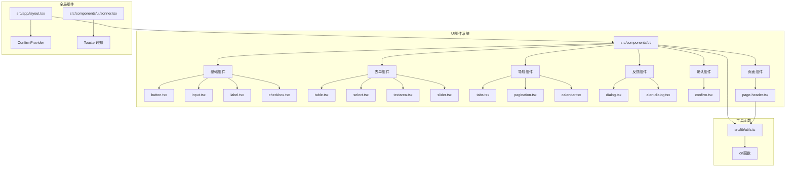
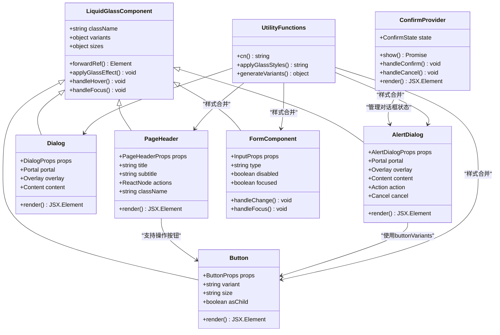
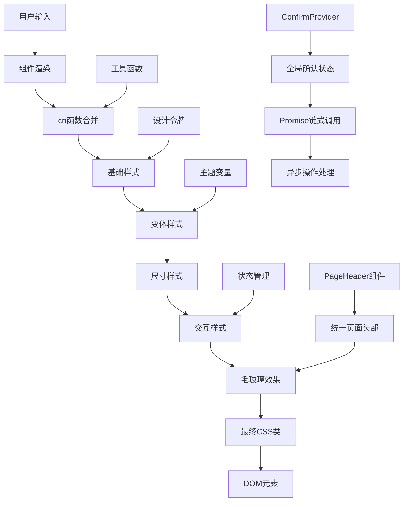
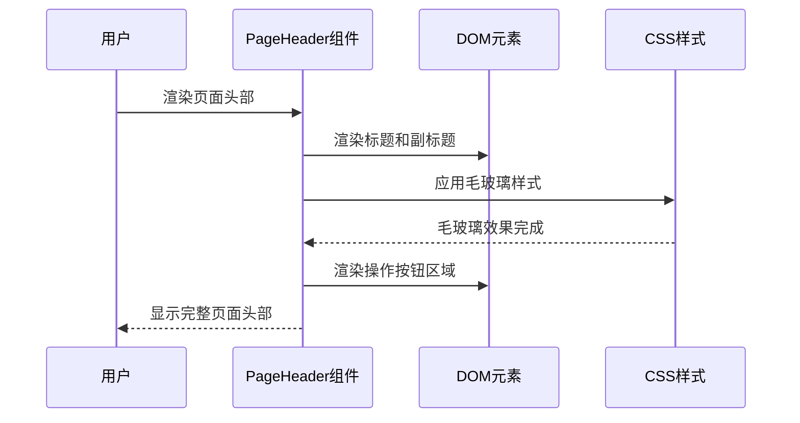
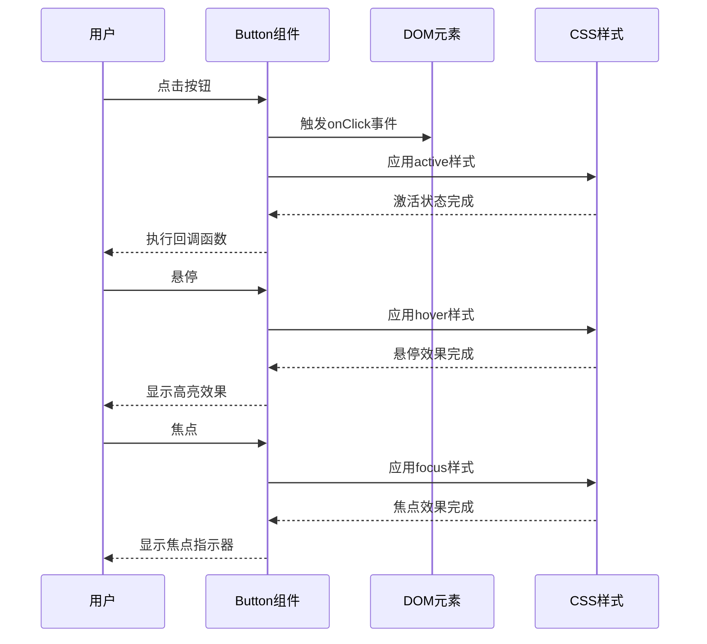
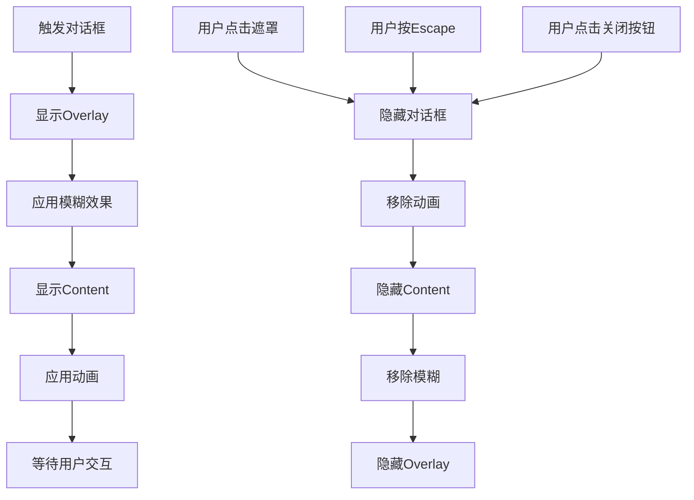
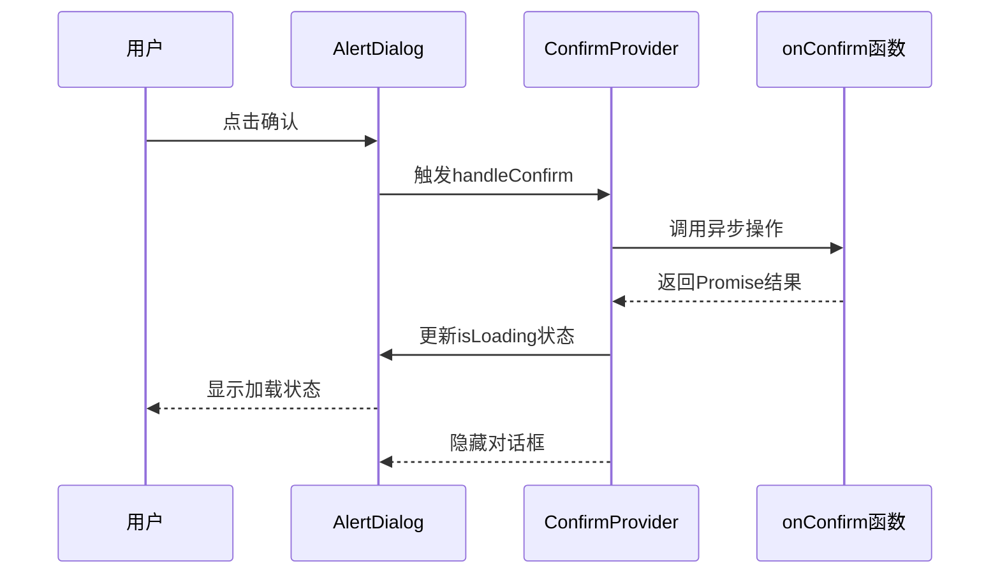
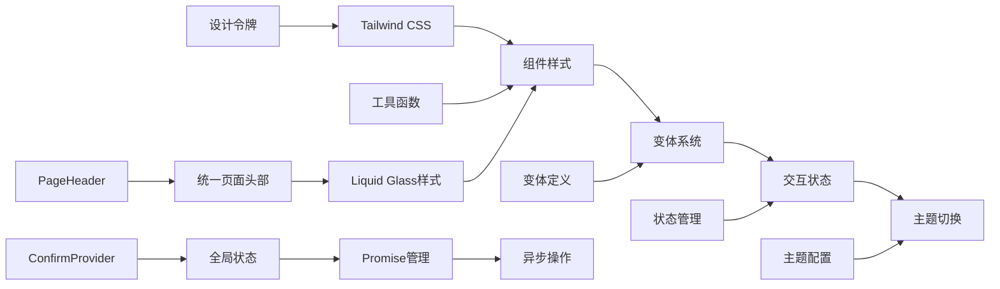

# Apple Liquid Glass UI组件系统

<cite>
**本文档引用的文件**
- [README.md](file://README.md)
- [page-header.tsx](file://src/components/page-header.tsx)
- [button.tsx](file://src/components/ui/button.tsx)
- [dialog.tsx](file://src/components/ui/dialog.tsx)
- [input.tsx](file://src/components/ui/input.tsx)
- [table.tsx](file://src/components/ui/table.tsx)
- [alert-dialog.tsx](file://src/components/ui/alert-dialog.tsx)
- [confirm.tsx](file://src/components/ui/confirm.tsx)
- [layout.tsx](file://src/app/layout.tsx)
- [home-page.tsx](file://src/app/(dashboard)/page.tsx)
- [users-page.tsx](file://src/app/(dashboard)/users/page.tsx)
- [keys-page.tsx](file://src/app/(dashboard)/keys/page.tsx)
- [quotas-page.tsx](file://src/app/(dashboard)/quotas/page.tsx)
- [delete-confirm-modal.tsx](file://src/app/(dashboard)/keys/components/delete-confirm-modal.tsx)
- [sonner.tsx](file://src/components/ui/sonner.tsx)
- [utils.ts](file://src/lib/utils.ts)
</cite>

## 更新摘要
**所做更改**
- 新增 PageHeader 组件章节，反映 PageHeader 组件继承 Liquid Glass 设计风格
- 更新项目结构图，包含新增的 PageHeader 组件
- 增强仪表板页面统一性分析，展示 PageHeader 在各页面中的应用
- 完善 Liquid Glass 设计风格的组件分类说明
- 更新依赖关系分析，反映 PageHeader 组件的引入

## 目录
1. [简介](#简介)
2. [项目结构](#项目结构)
3. [核心组件](#核心组件)
4. [架构概览](#架构概览)
5. [详细组件分析](#详细组件分析)
6. [依赖关系分析](#依赖关系分析)
7. [性能考虑](#性能考虑)
8. [故障排除指南](#故障排除指南)
9. [结论](#结论)

## 简介

Apple Liquid Glass UI组件系统是一个基于React和Tailwind CSS构建的现代化UI组件库，专为Apple风格的液态玻璃效果而设计。该系统采用先进的CSS技术实现毛玻璃效果、半透明材质和精致的视觉层次，为用户提供沉浸式的Apple风格界面体验。

**最新更新**：PageHeader 组件已继承 Liquid Glass 设计风格，统一了仪表板页面的视觉一致性，减少了代码重复，提升了开发效率。

该项目的核心特色包括：
- **液态玻璃效果**：通过backdrop-filter和透明度实现毛玻璃质感
- **深色模式支持**：完整的暗黑主题适配和自动切换机制
- **流畅动画过渡**：基于cubic-bezier曲线的平滑动画效果
- **响应式设计**：完全适配各种屏幕尺寸和设备类型
- **无障碍访问**：符合WCAG标准的可访问性支持
- **全局状态管理**：通过ConfirmProvider实现统一的确认对话框管理
- **统一页面头部**：PageHeader组件提供一致的页面标题体验

## 项目结构

项目采用模块化组织结构，UI组件集中在`src/components/ui/`目录下，每个组件都是独立的功能单元，便于复用和维护。新增了PageHeader组件作为统一的页面头部解决方案，位于应用根目录下。



**图表来源**
- [page-header.tsx:15-34](file://src/components/page-header.tsx#L15-L34)
- [button.tsx:62-74](file://src/components/ui/button.tsx#L62-L74)
- [input.tsx:15-29](file://src/components/ui/input.tsx#L15-L29)
- [table.tsx:6-12](file://src/components/ui/table.tsx#L6-L12)
- [confirm.tsx:36-153](file://src/components/ui/confirm.tsx#L36-L153)
- [layout.tsx:49-52](file://src/app/layout.tsx#L49-L52)

**章节来源**
- [README.md:1-88](file://README.md#L1-L88)
- [layout.tsx:1-58](file://src/app/layout.tsx#L1-L58)
- [page-header.tsx:1-37](file://src/components/page-header.tsx#L1-L37)

## 核心组件

### 液态玻璃设计系统

Apple Liquid Glass UI组件系统的核心在于其独特的视觉设计语言，通过以下关键技术实现：

#### 毛玻璃效果实现
- **backdrop-blur-xl**：实现高斯模糊背景效果
- **backdrop-saturate-[1.8]**：增强背景饱和度
- **透明度控制**：使用`bg-white/20`和`bg-black/20`控制透明度
- **边框渐变**：`border border-white/30 dark:border-white/15`

#### 动画过渡系统
- **cubic-bezier曲线**：使用`cubic-bezier(0.34,1.56,0.64,1)`实现自然的缓动效果
- **持续时间**：`duration-200`和`duration-300`确保流畅的交互体验
- **缩放效果**：`hover:scale-[1.02]`提供微妙的3D反馈

#### 深色模式适配
- **双主题支持**：同时支持浅色和深色模式
- **自动切换**：基于`dark:`前缀的Tailwind类实现
- **颜色映射**：为每种模式提供优化的颜色方案

#### 统一页面头部系统
- **PageHeader组件**：提供统一的页面标题体验
- **灵活布局**：支持标题、副标题和操作按钮的灵活组合
- **样式一致性**：继承完整的Liquid Glass设计风格

**章节来源**
- [page-header.tsx:18-25](file://src/components/page-header.tsx#L18-L25)
- [button.tsx:7-54](file://src/components/ui/button.tsx#L7-L54)
- [input.tsx:15-29](file://src/components/ui/input.tsx#L15-L29)
- [table.tsx:6-12](file://src/components/ui/table.tsx#L6-L12)

## 架构概览

### 组件架构设计



**图表来源**
- [page-header.tsx:15-34](file://src/components/page-header.tsx#L15-L34)
- [button.tsx:62-74](file://src/components/ui/button.tsx#L62-L74)
- [dialog.tsx:30-53](file://src/components/ui/dialog.tsx#L30-L53)
- [alert-dialog.tsx:30-50](file://src/components/ui/alert-dialog.tsx#L30-L50)
- [confirm.tsx:36-153](file://src/components/ui/confirm.tsx#L36-L153)
- [input.tsx:8-35](file://src/components/ui/input.tsx#L8-L35)

### 样式系统架构



**图表来源**
- [utils.ts:4-6](file://src/lib/utils.ts#L4-L6)
- [page-header.tsx:18-25](file://src/components/page-header.tsx#L18-L25)
- [button.tsx:5-6](file://src/components/ui/button.tsx#L5-L6)
- [confirm.tsx:44-85](file://src/components/ui/confirm.tsx#L44-L85)

## 详细组件分析

### 页面头部组件 (PageHeader)

PageHeader组件是Liquid Glass设计系统的新增核心组件，专门用于统一仪表板页面的头部展示，继承了完整的毛玻璃设计风格。

#### 组件特性
- **统一设计语言**：完全继承Liquid Glass设计风格
- **灵活布局**：支持标题、副标题和操作按钮的灵活组合
- **响应式设计**：根据是否存在操作按钮自动调整布局
- **样式一致性**：提供统一的视觉体验和交互反馈

#### 样式实现要点
- **毛玻璃背景**：`bg-white/60 dark:bg-black/30`实现半透明背景
- **模糊效果**：`backdrop-blur-xl`提供背景模糊效果
- **边框设计**：`border border-white/30 dark:border-white/10`提供层次感
- **阴影系统**：`shadow-[0_8px_32px_rgba(0,0,0,0.08),inset_0_1px_0_rgba(255,255,255,0.4)]`创造立体效果

#### 布局系统
- **标题区域**：主标题使用`text-2xl font-bold text-foreground`
- **副标题支持**：可选的副标题区域，使用`text-muted-foreground`
- **操作区域**：可选的操作按钮区域，使用`flex justify-between items-center`
- **间距控制**：使用`p-6`和`gap-2`确保合适的内边距和间距



**图表来源**
- [page-header.tsx:15-34](file://src/components/page-header.tsx#L15-L34)

**章节来源**
- [page-header.tsx:1-37](file://src/components/page-header.tsx#L1-L37)

### 按钮组件 (Button)

按钮组件是Liquid Glass设计系统的核心组件之一，实现了完整的液态玻璃效果和丰富的交互状态。

#### 组件特性
- **多种变体**：default、destructive、outline、secondary、ghost、link、glass
- **尺寸系统**：default、sm、lg、icon四种尺寸
- **动画效果**：悬停、聚焦、激活状态的平滑过渡
- **无障碍支持**：完整的键盘导航和屏幕阅读器支持

#### 样式实现要点
- **玻璃效果**：`bg-white/15 dark:bg-black/20`实现半透明背景
- **边框设计**：`border border-white/25 dark:border-white/8`提供层次感
- **阴影系统**：内外阴影组合创造立体效果
- **过渡动画**：`transition-all duration-200 ease-[cubic-bezier(0.34,1.56,0.64,1)]`



**图表来源**
- [button.tsx:62-74](file://src/components/ui/button.tsx#L62-L74)

**章节来源**
- [button.tsx:1-77](file://src/components/ui/button.tsx#L1-L77)

### 对话框组件 (Dialog)

对话框组件提供了完整的模态对话框解决方案，实现了液态玻璃背景和优雅的动画过渡。

#### 核心功能
- **模态管理**：完整的模态显示和隐藏控制
- **背景模糊**：`backdrop-blur-xl`实现背景模糊效果
- **动画系统**：进入和退出的平滑动画
- **键盘导航**：Tab键循环导航和Escape键关闭

#### 设计特点
- **圆角设计**：`rounded-[1.75rem]`提供柔和的视觉感受
- **阴影层次**：多层阴影创造深度感
- **响应式布局**：居中定位和自适应宽度
- **关闭按钮**：集成的X图标和无障碍支持



**图表来源**
- [dialog.tsx:15-27](file://src/components/ui/dialog.tsx#L15-L27)
- [dialog.tsx:30-53](file://src/components/ui/dialog.tsx#L30-L53)

**章节来源**
- [dialog.tsx:1-123](file://src/components/ui/dialog.tsx#L1-L123)

### 警告对话框组件 (AlertDialog)

AlertDialog组件提供了更加强大的确认对话框功能，集成了完整的确认流程管理。

#### 核心功能
- **确认流程管理**：完整的确认、取消流程控制
- **异步操作支持**：支持Promise的异步确认操作
- **加载状态管理**：自动处理异步操作的加载状态
- **错误处理机制**：完善的错误捕获和处理

#### 设计特点
- **毛玻璃背景**：`bg-white/80 dark:bg-slate-900/80`实现半透明背景
- **阴影系统**：`shadow-[0_24px_64px_rgba(0,0,0,0.2),inset_1px_1px_0_rgba(255,255,255,0.6)]`创造深度感
- **动画过渡**：`data-[state=open]:zoom-in-95`等动画效果
- **按钮变体**：集成buttonVariants的样式系统



**图表来源**
- [alert-dialog.tsx:105-115](file://src/components/ui/alert-dialog.tsx#L105-L115)
- [confirm.tsx:62-79](file://src/components/ui/confirm.tsx#L62-L79)

**章节来源**
- [alert-dialog.tsx:1-146](file://src/components/ui/alert-dialog.tsx#L1-L146)

### 确认对话框组件 (Confirm)

Confirm组件提供了全局的确认对话框管理功能，通过ConfirmProvider实现统一的状态管理。

#### 组件特性
- **全局状态管理**：通过ConfirmProvider集中管理确认对话框状态
- **Promise链式调用**：返回Promise支持异步操作
- **配置选项**：支持标题、描述、按钮文本等配置
- **变体支持**：支持default和destructive两种变体

#### 状态管理
- **ConfirmState**：包含isOpen、options、resolve、isLoading状态
- **show方法**：创建新的确认对话框实例
- **异步处理**：支持Promise的异步确认操作
- **生命周期管理**：自动清理状态和事件监听器

```mermaid
flowchart TD
A[调用confirm函数] --> B{ConfirmProvider存在?}
B --> |否| C[返回Promise.resolve(false)]
B --> |是| D[调用show方法]
D --> E[创建ConfirmState]
E --> F[设置isOpen=true]
F --> G[显示AlertDialog]
G --> H{用户操作}
H --> |确认| I[调用onConfirm]
I --> J[更新isLoading=true]
J --> K[执行异步操作]
K --> L{操作成功?}
L --> |是| M[resolve(true)]
L --> |否| N[抛出错误]
H --> |取消| O[resolve(false)]
M --> P[隐藏对话框]
N --> Q[保持对话框显示]
O --> P
P --> R[清理状态]
```

**图表来源**
- [confirm.tsx:36-153](file://src/components/ui/confirm.tsx#L36-L153)
- [confirm.tsx:155-169](file://src/components/ui/confirm.tsx#L155-L169)

**章节来源**
- [confirm.tsx:1-170](file://src/components/ui/confirm.tsx#L1-L170)

### 确认提供者组件 (ConfirmProvider)

ConfirmProvider作为全局状态管理组件，为整个应用提供统一的确认对话框服务。

#### 核心功能
- **全局状态存储**：在整个应用范围内管理确认对话框状态
- **实例管理**：维护confirmInstance的单例模式
- **生命周期管理**：在组件挂载时注册，在卸载时清理
- **状态同步**：确保所有确认对话框共享同一状态

#### 实现细节
- **useMemoizedFn**：优化show方法的性能
- **useMount**：确保组件正确挂载和卸载
- **状态更新**：使用setState进行状态管理
- **错误处理**：完善的错误捕获和处理机制

**章节来源**
- [confirm.tsx:36-153](file://src/components/ui/confirm.tsx#L36-L153)
- [layout.tsx:49-52](file://src/app/layout.tsx#L49-L52)

### 输入组件 (Input)

输入组件实现了液态玻璃效果的表单控件，提供了丰富的交互状态和视觉反馈。

#### 交互状态
- **默认状态**：`bg-white/20 dark:bg-black/20`半透明背景
- **悬停状态**：`hover:bg-white/25 dark:hover:bg-black/25`轻微变化
- **聚焦状态**：`focus-visible:ring-2 focus-visible:ring-white/30`强调焦点
- **禁用状态**：`disabled:opacity-50`提供视觉反馈

#### 样式特征
- **圆角设计**：`rounded-2xl`提供现代感
- **阴影系统**：内外阴影组合创造立体效果
- **过渡动画**：`transition-all duration-200 ease-[cubic-bezier(0.34,1.56,0.64,1)]`平滑过渡
- **占位符样式**：`placeholder:text-muted-foreground/60`半透明占位符

**章节来源**
- [input.tsx:1-40](file://src/components/ui/input.tsx#L1-L40)

### 表格组件 (Table)

表格组件提供了液态玻璃效果的数据展示解决方案，支持复杂的交互和视觉层次。

#### 组件结构
- **Table容器**：`rounded-2xl backdrop-blur-xl`实现毛玻璃背景
- **表头样式**：`bg-white/30 dark:bg-white/5`半透明表头
- **行悬停效果**：`hover:bg-white/30 dark:hover:bg-white/10`交互反馈
- **选中状态**：`data-[state=selected]:bg-white/40 dark:data-[state=selected]:bg-white/15`选择高亮

#### 设计细节
- **边框系统**：`border border-white/25 dark:border-white/10`提供清晰分隔
- **阴影层次**：`shadow-[0_8px_32px_rgba(0,0,0,0.08)]`创造深度感
- **文本样式**：`text-foreground/70`和`text-foreground/90`提供视觉层次
- **过渡动画**：`transition-all duration-200`平滑状态变化

**章节来源**
- [table.tsx:1-115](file://src/components/ui/table.tsx#L1-L115)

### 选择器组件 (Select)

选择器组件实现了液态玻璃效果的下拉选择器，提供了完整的交互体验。

#### 组件特性
- **触发器样式**：`backdrop-blur-xl`实现背景模糊
- **内容面板**：`backdrop-blur-2xl`提供毛玻璃效果
- **滚动支持**：`SelectScrollUpButton`和`SelectScrollDownButton`
- **高亮状态**：`data-[highlighted]:bg-white/30`视觉反馈

#### 动画系统
- **弹出动画**：`data-[state=open]:animate-in`进入动画
- **缩放效果**：`data-[state=closed]:zoom-out-95`退出动画
- **滑动过渡**：`data-[side=bottom]:slide-in-from-top-2`定位动画

**章节来源**
- [select.tsx:1-173](file://src/components/ui/select.tsx#L1-L173)

### 分页组件 (Pagination)

分页组件提供了液态玻璃效果的页面导航解决方案，支持国际化和无障碍访问。

#### 国际化支持
- **翻译集成**：`useTranslation()`函数支持多语言
- **本地化文本**：`t('Pagination.previous')`动态文本
- **无障碍标签**：`aria-label`提供屏幕阅读器支持

#### 组件结构
- **导航容器**：`Pagination`提供语义化导航
- **链接样式**：基于`buttonVariants`的样式系统
- **图标集成**：`ChevronLeft`和`ChevronRight`图标
- **省略号**：`MoreHorizontal`表示省略的页面

**章节来源**
- [pagination.tsx:1-130](file://src/components/ui/pagination.tsx#L1-L130)

### 日历组件 (Calendar)

日历组件实现了复杂的液态玻璃效果日历选择器，提供了完整的日期交互功能。

#### 组件复杂度
- **多组件集成**：`DayPicker`、`Button`、`Select`等多个组件
- **国际化支持**：完整的多语言和本地化支持
- **无障碍访问**：完整的键盘导航和屏幕阅读器支持
- **RTL支持**：右到左语言的特殊处理

#### 样式系统
- **根容器**：`rounded-2xl border border-white/25`基础样式
- **月份网格**：`flex flex-col gap-4 md:flex-row`响应式布局
- **按钮样式**：`backdrop-blur-xl`毛玻璃效果
- **选中状态**：`data-[selected-single=true]`精确选择

**章节来源**
- [calendar.tsx:1-226](file://src/components/ui/calendar.tsx#L1-L226)

## 依赖关系分析

### 组件依赖图

```mermaid
graph TB
subgraph "外部依赖"
A[@radix-ui/react-slot] --> B[Button组件]
C[@radix-ui/react-dialog] --> D[Dialog组件]
E[@radix-ui/react-alert-dialog] --> F[AlertDialog组件]
G[@radix-ui/react-select] --> H[Select组件]
I[@radix-ui/react-checkbox] --> J[Checkbox组件]
J --> K[Form组件]
L[@radix-ui/react-tabs] --> M[Tabs组件]
M --> N[Navigation组件]
O[@radix-ui/react-slider] --> P[Slider组件]
P --> Q[Range组件]
R[react-day-picker] --> S[Calendar组件]
S --> T[Date组件]
U[ahooks] --> V[useMemoizedFn, useMount]
W[lucide-react] --> X[图标组件]
Y[class-variance-authority] --> Z[变体系统]
end
subgraph "样式依赖"
X --> AA[Button图标]
X --> AB[Select图标]
Z --> AC[Button变体]
Z --> AD[Dialog变体]
end
subgraph "工具依赖"
AE[clsx] --> AF[cn函数]
AG[tailwind-merge] --> AF
AF --> AH[样式合并]
AI[ConfirmProvider] --> AJ[全局状态管理]
AJ --> AK[Promise链式调用]
AL[PageHeader] --> AM[统一页面头部]
AM --> AH
end
B --> AH
D --> AH
F --> AH
H --> AH
M --> AH
P --> AH
S --> AH
AL --> B
AL --> F
AI --> F
```

**图表来源**
- [page-header.tsx:15-34](file://src/components/page-header.tsx#L15-L34)
- [button.tsx:1-3](file://src/components/ui/button.tsx#L1-L3)
- [dialog.tsx:1-3](file://src/components/ui/dialog.tsx#L1-L3)
- [alert-dialog.tsx:3-7](file://src/components/ui/alert-dialog.tsx#L3-L7)
- [select.tsx:1-3](file://src/components/ui/select.tsx#L1-L3)
- [confirm.tsx:14](file://src/components/ui/confirm.tsx#L14)
- [utils.ts:1-2](file://src/lib/utils.ts#L1-L2)

### 样式系统依赖



**图表来源**
- [page-header.tsx:18-25](file://src/components/page-header.tsx#L18-L25)
- [button.tsx:7-54](file://src/components/ui/button.tsx#L7-L54)
- [utils.ts:4-6](file://src/lib/utils.ts#L4-L6)
- [confirm.tsx:44-85](file://src/components/ui/confirm.tsx#L44-L85)

**章节来源**
- [page-header.tsx:1-37](file://src/components/page-header.tsx#L1-L37)
- [button.tsx:1-77](file://src/components/ui/button.tsx#L1-L77)
- [dialog.tsx:1-123](file://src/components/ui/dialog.tsx#L1-L123)
- [alert-dialog.tsx:1-146](file://src/components/ui/alert-dialog.tsx#L1-L146)
- [confirm.tsx:1-170](file://src/components/ui/confirm.tsx#L1-L170)
- [utils.ts:1-7](file://src/lib/utils.ts#L1-L7)

## 性能考虑

### 渲染优化

Apple Liquid Glass UI组件系统在性能方面采用了多项优化策略：

#### 样式优化
- **CSS变量**：减少重复样式的计算开销
- **类名合并**：`cn`函数避免不必要的DOM操作
- **条件渲染**：仅在需要时应用复杂的毛玻璃效果

#### 动画性能
- **硬件加速**：使用`transform`和`opacity`属性
- **帧率优化**：`requestAnimationFrame`确保60fps
- **内存管理**：及时清理事件监听器和定时器

#### 代码分割
- **懒加载**：大型组件按需加载
- **Tree Shaking**：移除未使用的代码
- **Bundle优化**：最小化包体积

### 内存管理

- **组件卸载**：正确清理DOM事件和订阅
- **状态管理**：避免内存泄漏的状态引用
- **缓存策略**：合理使用缓存避免重复计算

### 全局状态管理优化

ConfirmProvider组件的性能优化策略：
- **useMemoizedFn**：优化show方法的性能，避免不必要的重新创建
- **useMount**：确保组件正确挂载和清理，防止内存泄漏
- **状态分离**：将全局状态与组件状态分离，提高响应速度
- **Promise链式调用**：避免阻塞主线程的异步操作

### PageHeader 组件优化

PageHeader组件的性能优化策略：
- **样式复用**：通过cn函数合并样式，减少DOM操作
- **条件渲染**：根据是否存在操作按钮动态调整布局
- **样式缓存**：利用Tailwind CSS的样式缓存机制
- **组件复用**：在多个仪表板页面中复用同一组件，减少代码重复

## 故障排除指南

### 常见问题解决

#### 毛玻璃效果不显示
1. **检查浏览器支持**：确保目标浏览器支持`backdrop-filter`
2. **验证CSS变量**：确认Tailwind配置包含必要的变量
3. **检查z-index层级**：确保元素没有被其他元素遮挡

#### 动画卡顿问题
1. **检查GPU加速**：确认使用了支持硬件加速的CSS属性
2. **减少重绘**：避免频繁改变布局相关的CSS属性
3. **优化动画数量**：控制同时运行的动画数量

#### 深色模式切换异常
1. **检查CSS优先级**：确保`dark:`前缀的样式正确应用
2. **验证系统偏好**：确认系统主题设置正确
3. **测试手动切换**：验证手动切换逻辑

#### 性能问题诊断
1. **使用开发者工具**：监控FPS和内存使用情况
2. **分析渲染时间**：识别慢组件和重渲染
3. **检查事件监听器**：确保没有内存泄漏

#### ConfirmProvider相关问题
1. **ConfirmProvider未找到**：确保在应用根部正确包裹ConfirmProvider
2. **Promise链式调用失败**：检查onConfirm函数的Promise处理
3. **状态管理异常**：验证ConfirmState的状态更新逻辑
4. **异步操作超时**：检查网络请求和异步操作的超时设置
5. **加载状态显示问题**：确认isLoading状态的正确更新

#### PageHeader 组件问题
1. **样式不生效**：检查PageHeader组件的className属性
2. **布局错乱**：验证actions属性的正确传递
3. **样式冲突**：检查是否与其他组件的样式发生冲突
4. **响应式问题**：测试不同屏幕尺寸下的显示效果

**章节来源**
- [page-header.tsx:1-37](file://src/components/page-header.tsx#L1-L37)
- [button.tsx:1-77](file://src/components/ui/button.tsx#L1-L77)
- [dialog.tsx:1-123](file://src/components/ui/dialog.tsx#L1-L123)
- [alert-dialog.tsx:1-146](file://src/components/ui/alert-dialog.tsx#L1-L146)
- [confirm.tsx:155-169](file://src/components/ui/confirm.tsx#L155-L169)

## 结论

Apple Liquid Glass UI组件系统代表了现代Web界面设计的前沿技术，通过创新的CSS技术和精心设计的交互体验，为用户提供了接近原生应用的界面感受。

### 主要成就
- **视觉创新**：成功实现Apple风格的液态玻璃效果
- **技术突破**：在前端实现复杂的毛玻璃和阴影效果
- **用户体验**：提供流畅、直观的交互体验
- **可扩展性**：模块化的组件架构支持功能扩展
- **状态管理**：通过ConfirmProvider实现统一的全局状态管理
- **统一设计**：PageHeader组件提供一致的页面头部体验

### 技术特色
- **CSS-in-JS**：结合传统CSS和现代JS技术
- **响应式设计**：完全适配各种设备和屏幕尺寸
- **无障碍访问**：符合WCAG标准的可访问性支持
- **国际化**：完整的多语言和本地化支持
- **异步处理**：完善的Promise链式调用支持
- **组件复用**：通过PageHeader减少代码重复，提升开发效率

### 未来发展方向
- **性能优化**：进一步提升渲染性能和内存效率
- **功能扩展**：增加更多类型的组件和交互模式
- **工具链完善**：提供更好的开发工具和调试支持
- **生态建设**：建立完整的组件生态系统和最佳实践
- **状态管理增强**：扩展ConfirmProvider的功能，支持更多场景
- **设计系统完善**：继续优化PageHeader等核心组件的设计一致性

**更新总结**：本次更新重点反映了PageHeader组件的引入，该组件继承了完整的Liquid Glass设计风格，统一了仪表板页面的视觉一致性，显著减少了代码重复，提升了开发效率和维护性。这一更新体现了组件系统从单一功能组件向统一设计系统的演进，为后续的功能扩展奠定了坚实的基础。

该系统不仅展示了现代前端技术的可能性，更为未来的UI设计提供了新的思路和方向，特别是在状态管理和异步操作处理方面的创新实践，以及通过PageHeader组件实现的设计一致性管理。