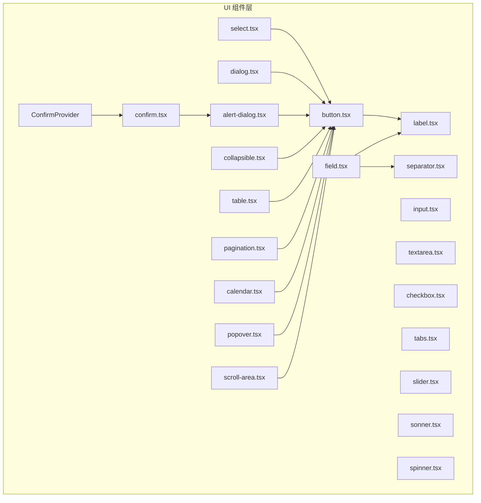
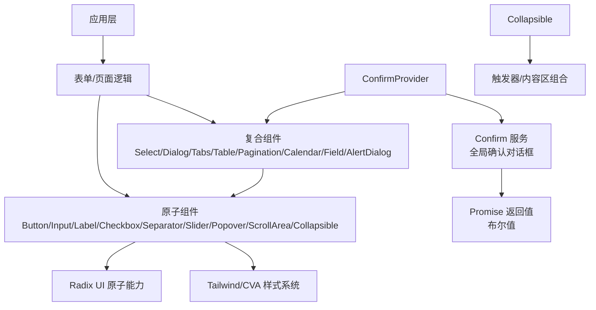
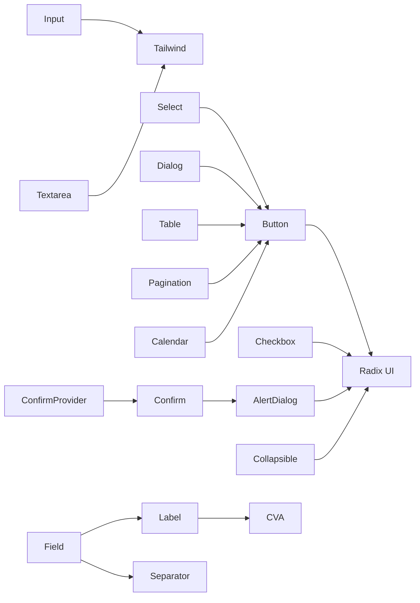

# UI 组件库

<cite>
**本文引用的文件**
- [src/components/ui/button.tsx](file://src/components/ui/button.tsx)
- [src/components/ui/input.tsx](file://src/components/ui/input.tsx)
- [src/components/ui/dialog.tsx](file://src/components/ui/dialog.tsx)
- [src/components/ui/select.tsx](file://src/components/ui/select.tsx)
- [src/components/ui/table.tsx](file://src/components/ui/table.tsx)
- [src/components/ui/pagination.tsx](file://src/components/ui/pagination.tsx)
- [src/components/ui/calendar.tsx](file://src/components/ui/calendar.tsx)
- [src/components/ui/checkbox.tsx](file://src/components/ui/checkbox.tsx)
- [src/components/ui/textarea.tsx](file://src/components/ui/textarea.tsx)
- [src/components/ui/label.tsx](file://src/components/ui/label.tsx)
- [src/components/ui/tabs.tsx](file://src/components/ui/tabs.tsx)
- [src/components/ui/popover.tsx](file://src/components/ui/popover.tsx)
- [src/components/ui/slider.tsx](file://src/components/ui/slider.tsx)
- [src/components/ui/separator.tsx](file://src/components/ui/separator.tsx)
- [src/components/ui/scroll-area.tsx](file://src/components/ui/scroll-area.tsx)
- [src/components/ui/field.tsx](file://src/components/ui/field.tsx)
- [src/components/ui/sonner.tsx](file://src/components/ui/sonner.tsx)
- [src/components/ui/spinner.tsx](file://src/components/ui/spinner.tsx)
- [src/components/ui/alert-dialog.tsx](file://src/components/ui/alert-dialog.tsx)
- [src/components/ui/confirm.tsx](file://src/components/ui/confirm.tsx)
- [src/components/ui/collapsible.tsx](file://src/components/ui/collapsible.tsx)
- [src/app/globals.css](file://src/app/globals.css)
- [src/app/(dashboard)/debug/components/code-modal.tsx](file://src/app/(dashboard)/debug/components/code-modal.tsx)
- [src/app/(dashboard)/debug/components/quota-debug/index.tsx](file://src/app/(dashboard)/debug/components/quota-debug/index.tsx)
- [src/app/(dashboard)/keys/components/add-api-key-dialog.tsx](file://src/app/(dashboard)/keys/components/add-api-key-dialog.tsx)
- [src/app/(dashboard)/keys/components/delete-confirm-modal.tsx](file://src/app/(dashboard)/keys/components/delete-confirm-modal.tsx)
- [src/app/(dashboard)/keys/page.tsx](file://src/app/(dashboard)/keys/page.tsx)
- [src/app/(dashboard)/quotas/page.tsx](file://src/app/(dashboard)/quotas/page.tsx)
- [src/app/(dashboard)/users/page.tsx](file://src/app/(dashboard)/users/page.tsx)
- [src/app/layout.tsx](file://src/app/layout.tsx)
</cite>

## 更新摘要
**所做更改**
- 新增 Collapsible 组件的详细说明，基于 Radix UI 的可折叠组件
- 完善 Confirm 对话框系统的文档，包括全局确认对话框服务
- 更新组件架构图，反映新增的 Collapsible 和 Confirm 组件
- 增加实际使用示例和最佳实践指导

## 目录
1. [简介](#简介)
2. [项目结构](#项目结构)
3. [核心组件](#核心组件)
4. [架构总览](#架构总览)
5. [组件详解](#组件详解)
6. [依赖关系分析](#依赖关系分析)
7. [性能与体验](#性能与体验)
8. [故障排查指南](#故障排查指南)
9. [结论](#结论)
10. [附录](#附录)

## 简介
本文件系统化梳理 AIGate 基于 shadcn/ui 设计体系的 UI 组件库，覆盖按钮、输入框、对话框、选择器、表格、分页器、日历、复选框、文本域、标签、选项卡、弹出框、滑块、分隔符、滚动区域、字段容器、通知、加载指示器、**警告对话框 AlertDialog**、**确认对话框 Confirm**、**确认对话框服务 ConfirmProvider** 和 **可折叠组件 Collapsible** 等组件。文档从设计原则、可访问性、响应式适配到样式定制与最佳实践进行深入说明，并提供可视化图示帮助理解组件交互与数据流。

## 项目结构
UI 组件集中位于 src/components/ui 目录下，采用"按功能模块拆分"的组织方式：每个组件独立文件，遵循统一的命名与导出规范；部分组件通过 Radix UI 原子能力组合实现高可访问性与可定制性；大量使用 class-variance-authority 实现变体（variants）与尺寸（sizes）的组合扩展；整体风格强调"液态玻璃"视觉效果与柔和阴影，兼顾深浅色主题一致性。

**图表来源**
- [src/components/ui/button.tsx:1-77](file://src/components/ui/button.tsx#L1-L77)
- [src/components/ui/input.tsx:1-41](file://src/components/ui/input.tsx#L1-L41)
- [src/components/ui/textarea.tsx:1-38](file://src/components/ui/textarea.tsx#L1-L38)
- [src/components/ui/checkbox.tsx:1-31](file://src/components/ui/checkbox.tsx#L1-L31)
- [src/components/ui/select.tsx:1-182](file://src/components/ui/select.tsx#L1-L182)
- [src/components/ui/dialog.tsx:1-125](file://src/components/ui/dialog.tsx#L1-L125)
- [src/components/ui/tabs.tsx:1-56](file://src/components/ui/tabs.tsx#L1-L56)
- [src/components/ui/popover.tsx:1-32](file://src/components/ui/popover.tsx#L1-L32)
- [src/components/ui/slider.tsx:1-29](file://src/components/ui/slider.tsx#L1-L29)
- [src/components/ui/separator.tsx:1-32](file://src/components/ui/separator.tsx#L1-L32)
- [src/components/ui/scroll-area.tsx:1-49](file://src/components/ui/scroll-area.tsx#L1-L49)
- [src/components/ui/table.tsx:1-115](file://src/components/ui/table.tsx#L1-L115)
- [src/components/ui/pagination.tsx:1-118](file://src/components/ui/pagination.tsx#L1-L118)
- [src/components/ui/calendar.tsx:1-223](file://src/components/ui/calendar.tsx#L1-L223)
- [src/components/ui/label.tsx:1-27](file://src/components/ui/label.tsx#L1-L27)
- [src/components/ui/field.tsx:1-245](file://src/components/ui/field.tsx#L1-L245)
- [src/components/ui/sonner.tsx](file://src/components/ui/sonner.tsx)
- [src/components/ui/spinner.tsx](file://src/components/ui/spinner.tsx)
- [src/components/ui/alert-dialog.tsx:1-146](file://src/components/ui/alert-dialog.tsx#L1-L146)
- [src/components/ui/confirm.tsx:1-170](file://src/components/ui/confirm.tsx#L1-L170)
- [src/components/ui/collapsible.tsx:1-12](file://src/components/ui/collapsible.tsx#L1-L12)

**章节来源**
- [src/components/ui/button.tsx:1-77](file://src/components/ui/button.tsx#L1-L77)
- [src/components/ui/input.tsx:1-41](file://src/components/ui/input.tsx#L1-L41)
- [src/components/ui/textarea.tsx:1-38](file://src/components/ui/textarea.tsx#L1-L38)
- [src/components/ui/checkbox.tsx:1-31](file://src/components/ui/checkbox.tsx#L1-L31)
- [src/components/ui/select.tsx:1-182](file://src/components/ui/select.tsx#L1-L182)
- [src/components/ui/dialog.tsx:1-125](file://src/components/ui/dialog.tsx#L1-L125)
- [src/components/ui/tabs.tsx:1-56](file://src/components/ui/tabs.tsx#L1-L56)
- [src/components/ui/popover.tsx:1-32](file://src/components/ui/popover.tsx#L1-L32)
- [src/components/ui/slider.tsx:1-29](file://src/components/ui/slider.tsx#L1-L29)
- [src/components/ui/separator.tsx:1-32](file://src/components/ui/separator.tsx#L1-L32)
- [src/components/ui/scroll-area.tsx:1-49](file://src/components/ui/scroll-area.tsx#L1-L49)
- [src/components/ui/table.tsx:1-115](file://src/components/ui/table.tsx#L1-L115)
- [src/components/ui/pagination.tsx:1-118](file://src/components/ui/pagination.tsx#L1-L118)
- [src/components/ui/calendar.tsx:1-223](file://src/components/ui/calendar.tsx#L1-L223)
- [src/components/ui/label.tsx:1-27](file://src/components/ui/label.tsx#L1-L27)
- [src/components/ui/field.tsx:1-245](file://src/components/ui/field.tsx#L1-L245)
- [src/components/ui/sonner.tsx](file://src/components/ui/sonner.tsx)
- [src/components/ui/spinner.tsx](file://src/components/ui/spinner.tsx)
- [src/components/ui/alert-dialog.tsx:1-146](file://src/components/ui/alert-dialog.tsx#L1-L146)
- [src/components/ui/confirm.tsx:1-170](file://src/components/ui/confirm.tsx#L1-L170)
- [src/components/ui/collapsible.tsx:1-12](file://src/components/ui/collapsible.tsx#L1-L12)

## 核心组件
- 按钮 Button：支持多种变体（默认、危险、描边、次级、幽灵、链接、玻璃）与尺寸（默认、小、大、图标），具备过渡动画与可插槽渲染能力。
- 输入 Input：统一圆角、背景玻璃化、聚焦与悬停状态，适配深浅色主题。
- 文本域 Textarea：多行输入，继承输入风格，支持最小高度与尺寸适配。
- 复选框 Checkbox：基于 Radix UI，提供受控/非受控状态与无障碍焦点管理。
- 选择器 Select：触发器、内容区、滚动按钮、项、分隔符等原子部件组合，支持玻璃化与动效。
- 对话框 Dialog：根组件、触发器、门户、遮罩、内容、标题、描述与关闭按钮，内置入场/出场动画。
- **警告对话框 AlertDialog**：基于 Radix UI 的警告对话框，提供液体玻璃样式的确认对话框功能，包含覆盖层、内容区、标题、描述、操作按钮等原子部件。
- **确认对话框 Confirm**：基于 AlertDialog 的确认对话框服务，提供全局的确认对话框功能，支持字符串和配置对象两种调用方式，返回 Promise 值。
- **确认对话框服务 ConfirmProvider**：提供全局状态管理，负责管理 Confirm 组件的显示与隐藏，以及提供 show 方法。
- **可折叠组件 Collapsible**：基于 Radix UI 的可折叠组件，提供展开/收起的交互功能，支持触发器和内容区的组合使用。
- 表格 Table：容器、表头、表体、表尾、行、单元格、标题、说明，支持悬停与选中态。
- 分页器 Pagination：导航、内容、项、链接、上一页/下一页、省略号。
- 日历 Calendar：基于 react-day-picker，统一样式、按钮变体、月份切换、范围选择、周数显示。
- 标签 Label：基于 class-variance-authority 的轻量标签样式。
- 选项卡 Tabs：列表、触发器、内容区，支持激活态与无障碍控制。
- 弹出框 Popover：根、触发器、内容区，支持对齐与偏移。
- 滑块 Slider：轨道、范围、拇指，支持禁用与无障碍焦点。
- 分隔符 Separator：水平/垂直方向，支持装饰性与语义化。
- 滚动区域 ScrollArea：根、视口、滚动条、角落，支持方向与样式定制。
- 字段容器 Field：Field、Label、Description、Error、Group、Legend、Separator、Title 等组合，支持纵向/横向/响应式布局与错误展示。
- 通知 Sonner：全局通知组件（在 UI 目录中存在）。
- 加载指示器 Spinner：轻量加载组件（在 UI 目录中存在）。

**章节来源**
- [src/components/ui/button.tsx:56-77](file://src/components/ui/button.tsx#L56-L77)
- [src/components/ui/input.tsx:5-41](file://src/components/ui/input.tsx#L5-L41)
- [src/components/ui/textarea.tsx:5-38](file://src/components/ui/textarea.tsx#L5-L38)
- [src/components/ui/checkbox.tsx:9-31](file://src/components/ui/checkbox.tsx#L9-L31)
- [src/components/ui/select.tsx:7-182](file://src/components/ui/select.tsx#L7-L182)
- [src/components/ui/dialog.tsx:7-125](file://src/components/ui/dialog.tsx#L7-L125)
- [src/components/ui/alert-dialog.tsx:9-146](file://src/components/ui/alert-dialog.tsx#L9-L146)
- [src/components/ui/confirm.tsx:16-170](file://src/components/ui/confirm.tsx#L16-L170)
- [src/components/ui/collapsible.tsx:5-12](file://src/components/ui/collapsible.tsx#L5-L12)
- [src/components/ui/table.tsx:4-115](file://src/components/ui/table.tsx#L4-L115)
- [src/components/ui/pagination.tsx:7-118](file://src/components/ui/pagination.tsx#L7-L118)
- [src/components/ui/calendar.tsx:15-223](file://src/components/ui/calendar.tsx#L15-L223)
- [src/components/ui/label.tsx:9-27](file://src/components/ui/label.tsx#L9-L27)
- [src/components/ui/tabs.tsx:8-56](file://src/components/ui/tabs.tsx#L8-L56)
- [src/components/ui/popover.tsx:8-32](file://src/components/ui/popover.tsx#L8-L32)
- [src/components/ui/slider.tsx:8-29](file://src/components/ui/slider.tsx#L8-L29)
- [src/components/ui/separator.tsx:8-32](file://src/components/ui/separator.tsx#L8-L32)
- [src/components/ui/scroll-area.tsx:8-49](file://src/components/ui/scroll-area.tsx#L8-L49)
- [src/components/ui/field.tsx:57-245](file://src/components/ui/field.tsx#L57-L245)
- [src/components/ui/sonner.tsx](file://src/components/ui/sonner.tsx)
- [src/components/ui/spinner.tsx](file://src/components/ui/spinner.tsx)

## 架构总览
组件库以"原子能力 + 组合模式"构建：
- 原子组件：Button、Input、Label、Checkbox、Separator、Slider、Popover、ScrollArea、Collapsible 等，提供基础交互与视觉。
- 容器与复合组件：Select、Dialog、Tabs、Table、Pagination、Calendar、Field、AlertDialog 等，封装复杂状态与交互。
- **确认对话框服务**：Confirm 基于 AlertDialog，通过 ConfirmProvider 提供全局状态管理，实现跨组件的一致确认对话框体验。
- **可折叠组件**：Collapsible 基于 Radix UI，提供灵活的内容展开/收起功能，常用于表单中的高级配置区域。
- 可访问性：广泛使用 Radix UI，确保键盘导航、焦点管理与 ARIA 属性。
- 样式系统：class-variance-authority 提供变体与尺寸；Tailwind 类名统一风格；Glassmorphism 视觉贯穿。

**图表来源**
- [src/components/ui/select.tsx:1-182](file://src/components/ui/select.tsx#L1-L182)
- [src/components/ui/dialog.tsx:1-125](file://src/components/ui/dialog.tsx#L1-L125)
- [src/components/ui/tabs.tsx:1-56](file://src/components/ui/tabs.tsx#L1-L56)
- [src/components/ui/table.tsx:1-115](file://src/components/ui/table.tsx#L1-L115)
- [src/components/ui/pagination.tsx:1-118](file://src/components/ui/pagination.tsx#L1-L118)
- [src/components/ui/calendar.tsx:1-223](file://src/components/ui/calendar.tsx#L1-L223)
- [src/components/ui/field.tsx:1-245](file://src/components/ui/field.tsx#L1-L245)
- [src/components/ui/alert-dialog.tsx:1-146](file://src/components/ui/alert-dialog.tsx#L1-L146)
- [src/components/ui/button.tsx:1-77](file://src/components/ui/button.tsx#L1-L77)
- [src/components/ui/input.tsx:1-41](file://src/components/ui/input.tsx#L1-L41)
- [src/components/ui/checkbox.tsx:1-31](file://src/components/ui/checkbox.tsx#L1-L31)
- [src/components/ui/separator.tsx:1-32](file://src/components/ui/separator.tsx#L1-L32)
- [src/components/ui/slider.tsx:1-29](file://src/components/ui/slider.tsx#L1-L29)
- [src/components/ui/popover.tsx:1-32](file://src/components/ui/popover.tsx#L1-L32)
- [src/components/ui/scroll-area.tsx:1-49](file://src/components/ui/scroll-area.tsx#L1-L49)
- [src/components/ui/confirm.tsx:36-170](file://src/components/ui/confirm.tsx#L36-L170)
- [src/components/ui/collapsible.tsx:1-12](file://src/components/ui/collapsible.tsx#L1-L12)

## 组件详解

### 按钮 Button
- 功能特性
  - 支持多种变体与尺寸，统一过渡动画与缩放反馈。
  - 支持 asChild 插槽渲染，便于与路由或自定义元素组合。
- 关键属性
  - variant: 默认值为 default，可选 default/destructive/outline/secondary/ghost/link/glass。
  - size: 默认值为 default，可选 default/sm/lg/icon。
  - asChild: 是否以子元素作为渲染节点。
- 样式定制
  - 通过变体与尺寸映射类名，结合 Tailwind 与 Glass 效果类实现一致风格。
- 最佳实践
  - 图标按钮建议使用 icon 尺寸；危险操作使用 destructive 变体；需要强调时使用 outline 或 glass。

**章节来源**
- [src/components/ui/button.tsx:7-77](file://src/components/ui/button.tsx#L7-L77)

### 输入框 Input
- 功能特性
  - 圆角、玻璃背景、聚焦与悬停态过渡，支持禁用态。
- 关键属性
  - 继承原生 input 属性，如 type、placeholder 等。
- 样式定制
  - 背景、边框、阴影与聚焦环均采用 Glass 风格类名。
- 最佳实践
  - 与 Label 或 Field 组合使用，提升可访问性与布局一致性。

**章节来源**
- [src/components/ui/input.tsx:5-41](file://src/components/ui/input.tsx#L5-L41)

### 文本域 Textarea
- 功能特性
  - 多行输入，支持最小高度与尺寸适配。
- 关键属性
  - 继承 textarea 原生属性。
- 样式定制
  - 与输入框一致的 Glass 风格与过渡动画。
- 最佳实践
  - 与 Field/Label/Description/Error 组合，形成标准表单字段。

**章节来源**
- [src/components/ui/textarea.tsx:5-38](file://src/components/ui/textarea.tsx#L5-L38)

### 复选框 Checkbox
- 功能特性
  - 基于 Radix UI，支持受控/非受控状态与无障碍焦点管理。
- 关键属性
  - 继承原生 input 属性，如 checked/disabled 等。
- 样式定制
  - 圆角边框、选中态背景与图标指示器。
- 最佳实践
  - 与 Label 组合使用，确保点击区域与可访问性。

**章节来源**
- [src/components/ui/checkbox.tsx:9-31](file://src/components/ui/checkbox.tsx#L9-L31)

### 选择器 Select
- 功能特性
  - 触发器、内容区、滚动按钮、项、分隔符等原子部件组合，支持玻璃化与动效。
- 关键属性
  - Trigger：支持占位符、聚焦态与禁用态。
  - Content：支持位置与动效，Viewport 自适应宽度/高度。
  - Item：支持选中指示器与禁用态。
- 样式定制
  - 触发器与内容区均采用 Glass 风格与阴影。
- 最佳实践
  - 使用 SelectValue 显示当前值；使用 SelectLabel 分组标题；使用 SelectSeparator 添加分隔。

**章节来源**
- [src/components/ui/select.tsx:13-182](file://src/components/ui/select.tsx#L13-L182)

### 对话框 Dialog
- 功能特性
  - 根组件、触发器、门户、遮罩、内容、标题、描述与关闭按钮，内置入场/出场动画。
- 关键属性
  - Overlay：全屏遮罩，支持 backdrop-blur-xl 与 backdrop-saturate-[1.5]。
  - Content：居中网格布局，支持动画与液态玻璃背景。
  - Close：带可访问性标签的关闭按钮。
- 样式定制
  - 内容区采用圆角、液态玻璃背景与阴影，深色模式下使用 slate-900/80 背景色。
- 最佳实践
  - 在内容区放置 DialogHeader/DialogFooter 进行结构化布局；确保关闭按钮可见且可聚焦。

**更新** 优化了视觉样式，移除了半透明白色背景效果，简化视觉呈现同时保持液态玻璃效果和深色模式兼容性

**章节来源**
- [src/components/ui/dialog.tsx:15-125](file://src/components/ui/dialog.tsx#L15-L125)

### 警告对话框 AlertDialog
- 功能特性
  - 基于 Radix UI 的警告对话框，提供液体玻璃样式的确认对话框功能。
  - 包含覆盖层、内容区、标题、描述、操作按钮等原子部件，支持门户渲染与动画效果。
- 关键属性
  - Overlay：全屏遮罩，支持 backdrop-blur-xl 与 fade 动画。
  - Content：居中网格布局，支持 zoom、slide 动画与液态玻璃背景。
  - Header/Footer：支持响应式布局与空间分布。
  - Title/Description：支持语义化标题与描述。
  - Action/Cancel：支持不同变体与样式定制。
- 样式定制
  - 内容区采用圆角、backdrop-blur-xl、多层阴影与边框效果，深色模式下使用 slate-900/80 背景色。
- 最佳实践
  - 使用 Header/Footer 进行结构化布局；确保操作按钮具有明确的可访问性标签；在取消操作时正确处理状态变更。

**更新** 新增组件，提供液体玻璃样式的警告对话框功能

**章节来源**
- [src/components/ui/alert-dialog.tsx:9-146](file://src/components/ui/alert-dialog.tsx#L9-L146)

### 确认对话框 Confirm
- 功能特性
  - 基于 AlertDialog 的确认对话框服务，提供全局的确认对话框功能。
  - 通过 Provider 模式在整个应用中提供一致的确认对话框体验，返回 Promise 值。
  - 支持字符串和配置对象两种调用方式，支持自定义标题、描述、按钮文本和变体。
  - 支持异步操作，自动处理加载状态与错误处理。
- 关键属性
  - Options：title、description、confirmText、cancelText、variant、onConfirm。
  - State：isOpen、options、resolve、isLoading。
  - Provider：ConfirmProvider，负责管理全局状态和提供 show 方法。
  - Service：confirm 函数，提供便捷的确认对话框调用接口。
- 样式定制
  - 基于 AlertDialog 的样式系统，支持默认和危险两种变体样式。
  - 加载状态时显示旋转指示器，提供更好的用户体验。
- 最佳实践
  - 在应用根组件中包裹 ConfirmProvider；使用 confirm 函数进行异步确认；处理 Promise 返回值；确保在没有 Provider 的情况下有适当的错误处理。

**更新** 新增组件，提供全局确认对话框服务

**章节来源**
- [src/components/ui/confirm.tsx:16-170](file://src/components/ui/confirm.tsx#L16-L170)

### 确认对话框服务 ConfirmProvider
- 功能特性
  - 提供全局状态管理，负责管理 Confirm 组件的显示与隐藏。
  - 通过 useMemoizedFn 优化函数性能，避免不必要的重新渲染。
  - 使用 useMount 生命周期钩子确保组件正确初始化。
  - 支持异步操作的完整生命周期管理。
- 关键属性
  - State：isOpen、options、resolve、isLoading。
  - Methods：show、handleConfirm、handleCancel。
  - Context：向子组件提供 confirm 函数。
- 样式定制
  - 与 Confirm 组件共享相同的样式系统。
- 最佳实践
  - 在应用根组件中包裹 ConfirmProvider；确保在整个应用中只存在一个实例；正确处理异步操作的错误状态。

**更新** 新增组件，提供全局状态管理

**章节来源**
- [src/components/ui/confirm.tsx:36-170](file://src/components/ui/confirm.tsx#L36-L170)

### 可折叠组件 Collapsible
- 功能特性
  - 基于 Radix UI 的可折叠组件，提供展开/收起的交互功能。
  - 支持 CollapsibleTrigger 作为触发器，CollapsibleContent 作为内容区。
  - 内置状态管理，通过 data-state 属性控制展开/收起状态。
- 关键属性
  - Collapsible：根组件，管理整体状态。
  - CollapsibleTrigger：触发器，支持 asChild 插槽渲染。
  - CollapsibleContent：内容区，支持动画过渡。
- 样式定制
  - 通过 data-state 属性控制展开/收起状态，支持 CSS 过渡动画。
  - 可与 Button、ChevronDown 等组件组合使用。
- 最佳实践
  - 常用于表单中的高级配置区域，如 API 密钥的定价配置。
  - 与 ChevronDown 组合使用时，可通过 group-data-[state=open] 旋转图标。
  - 确保内容区具有适当的内边距和布局。

**更新** 新增组件，提供可折叠功能

**章节来源**
- [src/components/ui/collapsible.tsx:1-12](file://src/components/ui/collapsible.tsx#L1-L12)

### 表格 Table
- 功能特性
  - 容器、表头、表体、表尾、行、单元格、标题、说明，支持悬停与选中态。
- 关键属性
  - Table：外层滚动容器与 Glass 背景。
  - TableHeader/Body/Footer：分节容器与边框样式。
  - TableRow/TableCell：悬停与选中态过渡。
- 样式定制
  - 表格整体采用圆角、背景与内阴影。
- 最佳实践
  - 使用 TableCaption 提供可访问性说明；在行上使用 data-state 控制选中态。

**章节来源**
- [src/components/ui/table.tsx:4-115](file://src/components/ui/table.tsx#L4-L115)

### 分页器 Pagination
- 功能特性
  - 导航、内容、项、链接、上一页/下一页、省略号。
- 关键属性
  - PaginationLink：根据 isActive 切换 outline/ghost 变体。
  - PaginationPrevious/PaginationNext：带图标与文案。
- 样式定制
  - 基于 Button 的变体与尺寸系统。
- 最佳实践
  - 为当前页设置 aria-current；为 Previous/Next 设置 aria-label。

**章节来源**
- [src/components/ui/pagination.tsx:7-118](file://src/components/ui/pagination.tsx#L7-L118)

### 日历 Calendar
- 功能特性
  - 基于 react-day-picker，统一样式、按钮变体、月份切换、范围选择、周数显示。
- 关键属性
  - buttonVariant：传递给内部按钮的变体。
  - captionLayout：支持 label 或自定义布局。
  - showOutsideDays：是否显示非当月日期。
  - components：可替换 Root、Chevron、DayButton、WeekNumber 等。
- 样式定制
  - 通过 classNames 与 buttonVariants 统一按钮风格。
- 最佳实践
  - 使用 Ghost 按钮风格保持与整体一致；为范围选择提供清晰的起止与中间态样式。

**章节来源**
- [src/components/ui/calendar.tsx:15-223](file://src/components/ui/calendar.tsx#L15-L223)

### 标签 Label
- 功能特性
  - 基于 class-variance-authority 的轻量标签样式。
- 关键属性
  - 继承原生 label 属性，支持禁用态。
- 样式定制
  - 通过变体类名控制字体大小与权重。
- 最佳实践
  - 与表单控件配合使用，确保点击区域与可访问性。

**章节来源**
- [src/components/ui/label.tsx:9-27](file://src/components/ui/label.tsx#L9-L27)

### 选项卡 Tabs
- 功能特性
  - 列表、触发器、内容区，支持激活态与无障碍控制。
- 关键属性
  - TabsTrigger：激活态背景与阴影变化。
  - TabsContent：内容区焦点管理。
- 样式定制
  - 列表与触发器采用圆角与过渡动画。
- 最佳实践
  - 使用 data-state 控制激活态；为触发器设置明确的可访问名称。

**章节来源**
- [src/components/ui/tabs.tsx:10-56](file://src/components/ui/tabs.tsx#L10-L56)

### 弹出框 Popover
- 功能特性
  - 根、触发器、内容区，支持对齐与偏移。
- 关键属性
  - Content：支持 align 与 sideOffset，内置入场/出场动画。
- 样式定制
  - 圆角边框、阴影与背景。
- 最佳实践
  - 用于轻量信息展示或快捷操作面板；确保内容区可聚焦。

**章节来源**
- [src/components/ui/popover.tsx:12-32](file://src/components/ui/popover.tsx#L12-L32)

### 滑块 Slider
- 功能特性
  - 轨道、范围、拇指，支持禁用与无障碍焦点。
- 关键属性
  - Track：轨道背景。
  - Range：进度范围。
  - Thumb：拇指可聚焦。
- 样式定制
  - 轨道与拇指采用对比色与过渡。
- 最佳实践
  - 与数值显示联动；提供无障碍提示。

**章节来源**
- [src/components/ui/slider.tsx:8-29](file://src/components/ui/slider.tsx#L8-L29)

### 分隔符 Separator
- 功能特性
  - 水平/垂直方向，支持装饰性与语义化。
- 关键属性
  - orientation：horizontal/vertical。
  - decorative：是否为装饰性元素。
- 样式定制
  - 单像素厚度与背景色。
- 最佳实践
  - 用于分组或内容分区；避免滥用装饰性分隔。

**章节来源**
- [src/components/ui/separator.tsx:8-32](file://src/components/ui/separator.tsx#L8-L32)

### 滚动区域 ScrollArea
- 功能特性
  - 根、视口、滚动条、角落，支持方向与样式定制。
- 关键属性
  - ScrollBar：支持垂直/水平方向，动态显示与隐藏。
- 样式定制
  - 滚动条采用透明边框与背景色。
- 最佳实践
  - 与内容区配合，避免滚动条遮挡关键元素。

**章节来源**
- [src/components/ui/scroll-area.tsx:8-49](file://src/components/ui/scroll-area.tsx#L8-L49)

### 字段容器 Field
- 功能特性
  - Field、Label、Description、Error、Group、Legend、Separator、Title 等组合，支持纵向/横向/响应式布局与错误展示。
- 关键属性
  - orientation：vertical/horizontal/responsive。
  - FieldError：支持单条或多条错误列表。
- 样式定制
  - 通过 data-slot 与 data-orientation 控制布局与间距。
- 最佳实践
  - 与 Input/Select/Checkbox 等组合使用；错误信息使用 role="alert" 提升可访问性。

**章节来源**
- [src/components/ui/field.tsx:57-245](file://src/components/ui/field.tsx#L57-L245)

### 通知 Sonner
- 功能特性
  - 全局通知组件，支持多种类型与位置。
- 样式定制
  - 与整体风格一致的通知样式与动效。
- 最佳实践
  - 仅在必要时弹出通知；避免频繁打扰用户。

**章节来源**
- [src/components/ui/sonner.tsx](file://src/components/ui/sonner.tsx)

### 加载指示器 Spinner
- 功能特性
  - 轻量加载组件，适合按钮内或页面局部。
- 样式定制
  - 圆形旋转与细线样式。
- 最佳实践
  - 与按钮或卡片组合时，保持视觉平衡。

**章节来源**
- [src/components/ui/spinner.tsx](file://src/components/ui/spinner.tsx)

## 依赖关系分析
- 组件间耦合
  - 复合组件（Select/Dialog/Tabs/Table/Pagination/Calendar/Field/AlertDialog）依赖原子组件（Button/Input/Label/Checkbox/Separator/Slider/Popover/ScrollArea）。
  - **确认对话框服务**：Confirm 基于 AlertDialog，通过 ConfirmProvider 模式在整个应用中提供一致的确认对话框体验。
  - **可折叠组件**：Collapsible 基于 Radix UI，为表单提供灵活的内容展开/收起功能。
  - 复合组件之间低耦合，通过公共样式系统与工具函数（cn）连接。
- 外部依赖
  - Radix UI：提供无障碍与状态管理能力。
  - class-variance-authority：提供变体与尺寸系统。
  - Tailwind CSS：提供原子化样式与 Glass 效果。
  - react-day-picker：提供日历能力。
  - **ahooks**：提供 useMemoizedFn 等工具函数支持。
- 循环依赖
  - 未发现循环依赖；组件导出清晰，无相互引用。

**图表来源**
- [src/components/ui/button.tsx:1-77](file://src/components/ui/button.tsx#L1-L77)
- [src/components/ui/input.tsx:1-41](file://src/components/ui/input.tsx#L1-L41)
- [src/components/ui/textarea.tsx:1-38](file://src/components/ui/textarea.tsx#L1-L38)
- [src/components/ui/checkbox.tsx:1-31](file://src/components/ui/checkbox.tsx#L1-L31)
- [src/components/ui/select.tsx:1-182](file://src/components/ui/select.tsx#L1-L182)
- [src/components/ui/dialog.tsx:1-125](file://src/components/ui/dialog.tsx#L1-L125)
- [src/components/ui/alert-dialog.tsx:1-146](file://src/components/ui/alert-dialog.tsx#L1-L146)
- [src/components/ui/confirm.tsx:1-170](file://src/components/ui/confirm.tsx#L1-L170)
- [src/components/ui/collapsible.tsx:1-12](file://src/components/ui/collapsible.tsx#L1-L12)
- [src/components/ui/tabs.tsx:1-56](file://src/components/ui/tabs.tsx#L1-L56)
- [src/components/ui/popover.tsx:1-32](file://src/components/ui/popover.tsx#L1-L32)
- [src/components/ui/slider.tsx:1-29](file://src/components/ui/slider.tsx#L1-L29)
- [src/components/ui/scroll-area.tsx:1-49](file://src/components/ui/scroll-area.tsx#L1-L49)
- [src/components/ui/table.tsx:1-115](file://src/components/ui/table.tsx#L1-L115)
- [src/components/ui/pagination.tsx:1-118](file://src/components/ui/pagination.tsx#L1-L118)
- [src/components/ui/calendar.tsx:1-223](file://src/components/ui/calendar.tsx#L1-L223)
- [src/components/ui/label.tsx:1-27](file://src/components/ui/label.tsx#L1-L27)
- [src/components/ui/field.tsx:1-245](file://src/components/ui/field.tsx#L1-L245)
- [src/components/ui/separator.tsx:1-32](file://src/components/ui/separator.tsx#L1-L32)

## 性能与体验
- 性能特性
  - 复合组件普遍采用 Portal 渲染，减少 DOM 层级与重排开销。
  - 动画使用 CSS 过渡与 transform，避免强制同步布局。
  - 液态玻璃效果通过 backdrop-blur 与阴影实现，现代浏览器性能良好。
  - **确认对话框服务**：通过 Provider 模式避免重复渲染，提高性能。
  - **useMemoizedFn**：优化函数性能，避免不必要的重新渲染。
  - **可折叠组件**：基于 Radix UI，提供高效的展开/收起动画。
- 体验优化
  - 统一的过渡曲线与缩放反馈，增强交互感知。
  - 深浅色主题一致的视觉语言，降低认知负担。
  - 可访问性优先：焦点管理、键盘导航、ARIA 属性齐全。
  - **确认对话框**：提供一致的确认对话框体验，减少重复代码。
  - **异步操作支持**：自动处理加载状态与错误处理，提升用户体验。
  - **可折叠功能**：为复杂表单提供优雅的内容管理，提升信息密度。

## 故障排查指南
- 可访问性问题
  - 确保所有交互元素具备可聚焦性与键盘可达性（Checkbox/Slider/Tabs/Dialog/Popover/AlertDialog）。
  - 错误信息使用 role="alert"，并提供可读的文本内容（Field/Label）。
- 样式冲突
  - 若出现液态玻璃效果异常，检查 Tailwind 配置与 backdrop-blur 支持情况。
  - 若动画不生效，确认 CSS 过渡类名与浏览器兼容性。
- 复合组件状态
  - Select/Dialog/Tabs 等组件的状态需由根组件统一管理，避免外部直接修改内部状态。
- 日历组件
  - 如月份切换按钮无效，检查 buttonVariant 与 classNames 的传递是否正确。
- **确认对话框组件**
  - 如果 confirm 函数报错"ConfirmProvider not found"，确保在应用根组件中正确包裹 ConfirmProvider。
  - 确认对话框的 Promise 返回值处理，避免忘记处理 then/catch。
  - 检查 confirm 函数的参数格式，确保字符串或配置对象的正确使用。
  - 确认异步操作的错误处理，确保状态正确恢复。
- **可折叠组件**
  - 如果展开/收起功能无效，检查 CollapsibleTrigger 与 CollapsibleContent 的组合使用。
  - 确保 data-state 属性正确控制状态，CSS 过渡动画正常工作。
  - 检查 asChild 属性的使用，确保触发器的正确渲染。
- **液体玻璃样式优化**
  - 检查 backdrop-blur 与 backdrop-saturate 属性的支持情况。
  - 确认深浅色主题下的对比度与可读性。
  - 验证阴影效果在不同设备上的性能表现。

**章节来源**
- [src/components/ui/checkbox.tsx:9-31](file://src/components/ui/checkbox.tsx#L9-L31)
- [src/components/ui/slider.tsx:8-29](file://src/components/ui/slider.tsx#L8-L29)
- [src/components/ui/tabs.tsx:10-56](file://src/components/ui/tabs.tsx#L10-L56)
- [src/components/ui/dialog.tsx:15-125](file://src/components/ui/dialog.tsx#L15-L125)
- [src/components/ui/popover.tsx:12-32](file://src/components/ui/popover.tsx#L12-L32)
- [src/components/ui/field.tsx:186-231](file://src/components/ui/field.tsx#L186-L231)
- [src/components/ui/calendar.tsx:57-135](file://src/components/ui/calendar.tsx#L57-L135)
- [src/components/ui/alert-dialog.tsx:15-146](file://src/components/ui/alert-dialog.tsx#L15-L146)
- [src/components/ui/confirm.tsx:155-170](file://src/components/ui/confirm.tsx#L155-L170)
- [src/components/ui/collapsible.tsx:5-12](file://src/components/ui/collapsible.tsx#L5-L12)

## 结论
AIGate UI 组件库以 shadcn/ui 设计理念为基础，结合 Radix UI 的可访问性与 class-variance-authority 的变体系统，实现了风格统一、易于扩展、可维护性强的组件体系。通过液态玻璃视觉与一致的过渡动画，提升了用户体验；通过 Field、Label、Separator 等辅助组件，强化了表单与布局的可访问性与一致性。

**新增组件**：最近新增的 AlertDialog、Confirm、ConfirmProvider 和 Collapsible 组件进一步完善了组件库的功能。AlertDialog 提供了基于 Radix UI 的警告对话框，具有液体玻璃样式的视觉效果；Confirm 基于 AlertDialog，提供了全局的确认对话框服务，通过 Provider 模式在整个应用中提供一致的确认对话框体验；ConfirmProvider 负责管理全局状态，确保跨组件的一致性；Collapsible 基于 Radix UI，为表单提供灵活的可折叠功能，常用于高级配置区域。这些组件已在配额调试、API 密钥管理等页面中得到广泛应用，显著提升了用户体验和开发效率。

**实际应用场景**：
- **API 密钥管理**：在添加 API 密钥对话框中使用 Collapsible 组件展示定价配置等高级选项。
- **配额调试功能**：使用 confirm 函数处理配额重置等敏感操作，提供安全的确认机制。
- **全局确认对话框**：在多个页面中统一处理删除、重置等重要操作的确认流程。

建议在实际业务中遵循组件的最佳实践与可访问性规范，持续优化交互细节与性能表现。对于新增的确认对话框和可折叠功能，建议在应用根组件中正确配置 ConfirmProvider，并在需要确认操作的场景中使用 confirm 函数，以提供一致的用户体验。

## 附录
- 设计原则
  - 一致性：统一的尺寸、颜色与动效。
  - 可访问性：键盘可达、焦点可见、语义明确。
  - 响应式：在移动端与桌面端保持良好可用性。
  - 简洁性：移除不必要的视觉层次，保持界面清晰。
  - **一致性体验**：通过 ConfirmProvider 提供全局一致的确认对话框体验。
  - **渐进式展开**：通过 Collapsible 组件提供优雅的内容管理。
- 样式定制建议
  - 优先通过变体与尺寸扩展，避免破坏整体风格。
  - 使用 Tailwind 原子类名进行微调，保持可读性与可维护性。
  - 在深色模式下确保足够的对比度与可读性。
  - **液体玻璃效果**：合理使用 backdrop-blur 与阴影，确保在不同设备上的性能表现。
  - **可折叠动画**：确保 CSS 过渡动画流畅，避免性能问题。
- 常见问题
  - 组件间组合时注意数据流向与状态管理。
  - 注意深浅色主题下的对比度与可读性。
  - 液态玻璃效果在不同浏览器中的兼容性差异。
  - **确认对话框**：确保正确配置 ConfirmProvider，避免运行时错误。
  - **异步操作**：正确处理 Promise 返回值与错误状态。
  - **性能优化**：使用 useMemoizedFn 优化函数性能，避免不必要的重新渲染。
  - **可折叠组件**：确保正确的状态管理和动画性能。
  - **触发器组合**：在使用 asChild 时注意事件冒泡和样式继承。